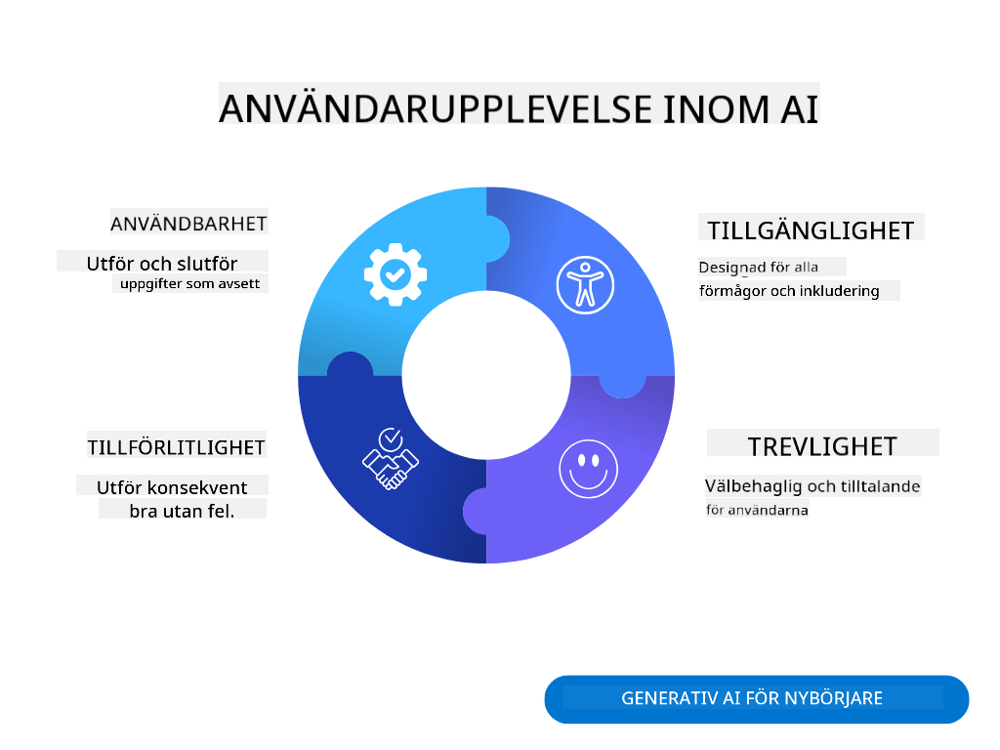

<!--
CO_OP_TRANSLATOR_METADATA:
{
  "original_hash": "747668e4c53d067369f06e9ec2e6313e",
  "translation_date": "2025-08-26T17:23:52+00:00",
  "source_file": "12-designing-ux-for-ai-applications/README.md",
  "language_code": "sv"
}
-->
# Designa UX för AI-applikationer

> _(Klicka på bilden ovan för att se videon till denna lektion)_

Användarupplevelse är en mycket viktig del av att bygga appar. Användare måste kunna använda din app på ett effektivt sätt för att utföra sina uppgifter. Att vara effektiv är en sak, men du behöver också designa appar så att de kan användas av alla, för att göra dem _tillgängliga_. Det här kapitlet fokuserar på detta område så att du förhoppningsvis designar en app som folk kan och vill använda.

## Introduktion

Användarupplevelse handlar om hur en användare interagerar med och använder en viss produkt eller tjänst, oavsett om det är ett system, verktyg eller design. När man utvecklar AI-applikationer fokuserar utvecklare inte bara på att säkerställa att användarupplevelsen är effektiv, utan också etisk. I denna lektion går vi igenom hur man bygger artificiell intelligens (AI)-applikationer som möter användarnas behov.

Lektionens innehåll:

- Introduktion till användarupplevelse och förståelse för användarbehov
- Designa AI-applikationer för tillit och transparens
- Designa AI-applikationer för samarbete och återkoppling

## Lärandemål

Efter denna lektion kommer du att kunna:

- Förstå hur man bygger AI-applikationer som möter användarnas behov.
- Designa AI-applikationer som främjar tillit och samarbete.

### Förkunskaper

Ta dig tid att läsa mer om [användarupplevelse och design thinking.](https://learn.microsoft.com/training/modules/ux-design?WT.mc_id=academic-105485-koreyst)

## Introduktion till användarupplevelse och förståelse för användarbehov

I vårt fiktiva utbildnings-startup har vi två huvudanvändare, lärare och elever. Båda dessa användare har unika behov. En användarcentrerad design sätter användaren i fokus och säkerställer att produkterna är relevanta och användbara för dem de är avsedda för.

Applikationen ska vara **användbar, pålitlig, tillgänglig och trevlig** för att ge en bra användarupplevelse.

### Användbarhet

Att vara användbar innebär att applikationen har funktioner som matchar dess syfte, till exempel att automatisera rättningsprocessen eller skapa flashcards för repetition. En applikation som automatiserar rättning ska kunna tilldela poäng till elevernas arbete korrekt och effektivt utifrån fördefinierade kriterier. På samma sätt ska en applikation som skapar repetitionskort kunna generera relevanta och varierade frågor utifrån sin data.

### Pålitlighet

Att vara pålitlig innebär att applikationen kan utföra sina uppgifter konsekvent och utan fel. Men AI är, precis som människor, inte perfekt och kan göra misstag. Applikationerna kan stöta på fel eller oväntade situationer som kräver mänsklig inblandning eller korrigering. Hur hanterar du fel? I sista delen av denna lektion går vi igenom hur AI-system och applikationer designas för samarbete och återkoppling.

### Tillgänglighet

Att vara tillgänglig innebär att användarupplevelsen utökas till användare med olika förmågor, inklusive personer med funktionsnedsättningar, så att ingen lämnas utanför. Genom att följa riktlinjer och principer för tillgänglighet blir AI-lösningar mer inkluderande, användbara och till nytta för alla användare.

### Trevlig

Att vara trevlig innebär att applikationen är rolig och behaglig att använda. En tilltalande användarupplevelse kan ha en positiv inverkan på användaren, uppmuntra dem att återvända till applikationen och öka företagets intäkter.

Alla utmaningar kan inte lösas med AI. AI används för att förstärka användarupplevelsen, till exempel genom att automatisera manuella uppgifter eller anpassa användarupplevelser.

## Designa AI-applikationer för tillit och transparens

Att bygga tillit är avgörande när man designar AI-applikationer. Tillit gör att användaren känner sig säker på att applikationen utför jobbet, levererar resultat konsekvent och att resultaten är vad användaren behöver. En risk här är misstro och övertillit. Misstro uppstår när en användare har lite eller ingen tillit till ett AI-system, vilket leder till att användaren avvisar din applikation. Övertillit uppstår när en användare överskattar AI-systemets förmåga, vilket gör att användaren litar för mycket på AI-systemet. Till exempel kan ett automatiserat rättningssystem vid övertillit leda till att läraren inte dubbelkollar vissa prov för att säkerställa att rättningssystemet fungerar bra. Detta kan resultera i orättvisa eller felaktiga betyg för eleverna, eller missade möjligheter till återkoppling och förbättring.

Två sätt att säkerställa att tillit står i centrum för designen är förklarbarhet och kontroll.

### Förklarbarhet

När AI hjälper till att fatta beslut, som att förmedla kunskap till framtida generationer, är det viktigt för lärare och föräldrar att förstå hur AI-beslut fattas. Detta är förklarbarhet – att förstå hur AI-applikationer fattar beslut. Att designa för förklarbarhet innebär att lägga till detaljer som visar hur AI kom fram till sitt resultat. Målgruppen måste vara medveten om att resultatet är genererat av AI och inte av en människa. Till exempel, istället för att säga "Börja chatta med din handledare nu", säg "Använd AI-handledaren som anpassar sig efter dina behov och hjälper dig att lära dig i din egen takt."

Ett annat exempel är hur AI använder användar- och persondata. Till exempel kan en användare med personan elev ha begränsningar baserat på sin roll. AI:n kanske inte kan avslöja svaren på frågor men kan hjälpa användaren att tänka igenom hur de kan lösa ett problem.

En sista viktig del av förklarbarhet är att förenkla förklaringarna. Elever och lärare är kanske inte AI-experter, därför bör förklaringar av vad applikationen kan eller inte kan göra vara förenklade och lätta att förstå.

### Kontroll

Generativ AI skapar ett samarbete mellan AI och användaren, där användaren till exempel kan ändra promptar för olika resultat. Dessutom, när ett resultat har genererats, ska användare kunna ändra resultatet och därmed få en känsla av kontroll. Till exempel, när du använder Bing, kan du anpassa din prompt utifrån format, ton och längd. Du kan också göra ändringar i ditt resultat och justera det som visas nedan:

En annan funktion i Bing som ger användaren kontroll över applikationen är möjligheten att välja om man vill dela data som AI använder. För en skolapplikation kanske en elev vill använda sina egna anteckningar samt lärarens resurser som repetitionsmaterial.

> När du designar AI-applikationer är det viktigt att vara medveten om att användare inte ska övertro AI:ns förmåga och därmed få orealistiska förväntningar. Ett sätt att göra detta är att skapa friktion mellan prompt och resultat. Påminn användaren om att detta är AI och inte en människa.

## Designa AI-applikationer för samarbete och återkoppling

Som nämnts tidigare skapar generativ AI ett samarbete mellan användaren och AI. De flesta interaktioner sker genom att användaren skriver in en prompt och AI genererar ett resultat. Men vad händer om resultatet är felaktigt? Hur hanterar applikationen fel om de uppstår? Skyller AI på användaren eller tar den sig tid att förklara felet?

AI-applikationer bör byggas för att både ta emot och ge återkoppling. Detta hjälper inte bara AI-systemet att förbättras, utan bygger också tillit hos användarna. En återkopplingsloop bör ingå i designen, till exempel en enkel tumme upp eller ner på resultatet.

Ett annat sätt att hantera detta är att tydligt kommunicera systemets kapacitet och begränsningar. När en användare gör ett misstag och ber om något utanför AI:ns kapacitet, bör det också finnas ett sätt att hantera detta, som visas nedan.

Systemfel är vanliga i applikationer där användaren kan behöva hjälp med information utanför AI:ns område eller där applikationen har en gräns för hur många frågor/ämnen en användare kan generera sammanfattningar för. Till exempel kan en AI-applikation som är tränad på data om endast vissa ämnen, som historia och matematik, inte hantera frågor om geografi. För att hantera detta kan AI-systemet ge ett svar som: "Tyvärr, vår produkt är tränad på data inom följande ämnen....., jag kan inte svara på den fråga du ställde."

AI-applikationer är inte perfekta, därför kommer de att göra misstag. När du designar dina applikationer bör du se till att det finns utrymme för återkoppling från användare och felhantering på ett sätt som är enkelt och lätt att förklara.

## Uppgift

Ta någon AI-app du har byggt hittills och fundera på att implementera stegen nedan i din app:

- **Trevlig:** Fundera på hur du kan göra din app mer trevlig. Lägger du till förklaringar överallt? Uppmuntrar du användaren att utforska? Hur formulerar du dina felmeddelanden?

- **Användbarhet:** Bygger du en webbapp? Se till att din app går att navigera med både mus och tangentbord.

- **Tillit och transparens:** Lita inte blint på AI och dess resultat, fundera på hur du kan lägga till en människa i processen för att verifiera resultatet. Fundera också på och implementera andra sätt att uppnå tillit och transparens.

- **Kontroll:** Ge användaren kontroll över den data de lämnar till applikationen. Implementera ett sätt för användaren att välja om de vill delta i datainsamling i AI-applikationen.

## Fortsätt lära dig!

När du är klar med denna lektion, kolla in vår [Generative AI Learning collection](https://aka.ms/genai-collection?WT.mc_id=academic-105485-koreyst) för att fortsätta utveckla dina kunskaper om generativ AI!

Gå vidare till Lektion 13, där vi tittar på hur man [säkrar AI-applikationer](../13-securing-ai-applications/README.md?WT.mc_id=academic-105485-koreyst)!

---

**Ansvarsfriskrivning**:  
Detta dokument har översatts med hjälp av AI-översättningstjänsten [Co-op Translator](https://github.com/Azure/co-op-translator). Även om vi strävar efter noggrannhet, bör du vara medveten om att automatiska översättningar kan innehålla fel eller brister. Det ursprungliga dokumentet på dess originalspråk ska betraktas som den auktoritativa källan. För kritisk information rekommenderas professionell mänsklig översättning. Vi ansvarar inte för eventuella missförstånd eller feltolkningar som uppstår vid användning av denna översättning.