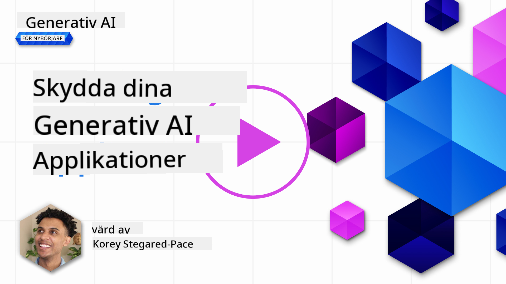
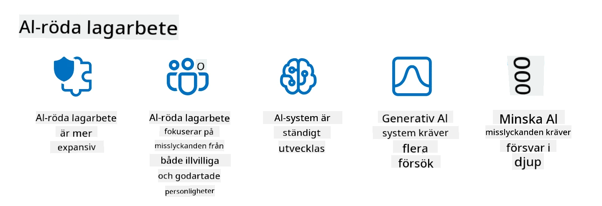

<!--
CO_OP_TRANSLATOR_METADATA:
{
  "original_hash": "f3cac698e9eea47dd563633bd82daf8c",
  "translation_date": "2025-07-09T15:28:47+00:00",
  "source_file": "13-securing-ai-applications/README.md",
  "language_code": "sv"
}
-->
# Säkerställ dina generativa AI-applikationer

## Introduktion

Den här lektionen täcker:

- Säkerhet inom AI-systemens kontext.
- Vanliga risker och hot mot AI-system.
- Metoder och överväganden för att säkra AI-system.

## Lärandemål

Efter att ha genomfört denna lektion kommer du att ha förståelse för:

- Hot och risker mot AI-system.
- Vanliga metoder och praxis för att säkra AI-system.
- Hur implementering av säkerhetstestning kan förhindra oväntade resultat och förtroendeförlust hos användare.

## Vad innebär säkerhet inom generativ AI?

När artificiell intelligens (AI) och maskininlärning (ML) i allt större utsträckning formar våra liv är det avgörande att skydda inte bara kunddata utan även AI-systemen själva. AI/ML används allt mer för att stödja beslut med högt värde i branscher där fel beslut kan få allvarliga konsekvenser.

Här är viktiga punkter att tänka på:

- **AI/ML:s påverkan**: AI/ML har stor påverkan på vardagen och därför är det nödvändigt att skydda dem.
- **Säkerhetsutmaningar**: Den påverkan AI/ML har kräver särskild uppmärksamhet för att skydda AI-baserade produkter från avancerade attacker, oavsett om de kommer från troll eller organiserade grupper.
- **Strategiska problem**: Teknikindustrin måste proaktivt hantera strategiska utmaningar för att säkerställa långsiktig kundsäkerhet och datasäkerhet.

Dessutom har maskininlärningsmodeller i stor utsträckning svårt att skilja mellan illvillig input och ofarlig anomal data. En stor del av träningsdata kommer från okurerade, omodererade offentliga dataset som är öppna för bidrag från tredje part. Angripare behöver inte kompromettera dataset när de fritt kan bidra till dem. Med tiden blir lågkonfidens illvillig data till högkonfidens betrodd data, så länge datastrukturen/formateringen är korrekt.

Därför är det avgörande att säkerställa integriteten och skyddet av de datalager som dina modeller använder för att fatta beslut.

## Förstå hot och risker med AI

När det gäller AI och relaterade system är dataförgiftning det mest betydande säkerhetshotet idag. Datapoisning innebär att någon medvetet ändrar informationen som används för att träna en AI, vilket får den att göra fel. Detta beror på avsaknaden av standardiserade metoder för upptäckt och åtgärd, tillsammans med vårt beroende av opålitliga eller okurerade offentliga dataset för träning. För att upprätthålla dataintegritet och förhindra en bristfällig träningsprocess är det viktigt att spåra dataursprung och härkomst. Annars gäller det gamla talesättet ”garbage in, garbage out”, vilket leder till försämrad modellprestanda.

Här är exempel på hur dataförgiftning kan påverka dina modeller:

1. **Label Flipping**: Vid en binär klassificeringsuppgift vänder en angripare medvetet på etiketterna för en liten del av träningsdata. Till exempel märks ofarliga exempel som skadliga, vilket får modellen att lära sig felaktiga samband.\
   **Exempel**: Ett spamfilter som felaktigt klassificerar legitima mejl som skräppost på grund av manipulerade etiketter.
2. **Feature Poisoning**: En angripare modifierar subtilt egenskaper i träningsdata för att införa bias eller vilseleda modellen.\
   **Exempel**: Lägga till irrelevanta nyckelord i produktbeskrivningar för att manipulera rekommendationssystem.
3. **Data Injection**: Injicera skadlig data i träningsuppsättningen för att påverka modellens beteende.\
   **Exempel**: Införa falska användarrecensioner för att snedvrida sentimentanalys.
4. **Backdoor Attacks**: En angripare lägger in ett dolt mönster (bakdörr) i träningsdata. Modellen lär sig känna igen detta mönster och beter sig skadligt när det aktiveras.\
   **Exempel**: Ett ansiktsigenkänningssystem tränat med bakdörrsbilder som felidentifierar en specifik person.

MITRE Corporation har skapat [ATLAS (Adversarial Threat Landscape for Artificial-Intelligence Systems)](https://atlas.mitre.org/?WT.mc_id=academic-105485-koreyst), en kunskapsbas över taktiker och tekniker som används av angripare i verkliga attacker mot AI-system.

> Det finns ett växande antal sårbarheter i AI-drivna system, eftersom införandet av AI ökar attackytan för befintliga system utöver traditionella cyberattacker. Vi utvecklade ATLAS för att öka medvetenheten om dessa unika och föränderliga sårbarheter, eftersom det globala samhället i allt större utsträckning integrerar AI i olika system. ATLAS är modellerat efter MITRE ATT&CK®-ramverket och dess taktiker, tekniker och procedurer (TTPs) kompletterar de i ATT&CK.

Precis som MITRE ATT&CK®-ramverket, som används flitigt inom traditionell cybersäkerhet för att planera avancerade hotemuleringsscenarier, erbjuder ATLAS en lättillgänglig uppsättning TTPs som kan hjälpa till att bättre förstå och förbereda försvar mot nya attacker.

Dessutom har Open Web Application Security Project (OWASP) skapat en "[Top 10-lista](https://llmtop10.com/?WT.mc_id=academic-105485-koreyst)" över de mest kritiska sårbarheterna i applikationer som använder LLMs. Listan lyfter fram risker som datapoisoning och andra hot som:

- **Prompt Injection**: en teknik där angripare manipulerar en Large Language Model (LLM) genom noggrant utformade indata, vilket får modellen att agera utanför sitt avsedda beteende.
- **Supply Chain Vulnerabilities**: Komponenter och mjukvara som utgör applikationer som används av en LLM, såsom Python-moduler eller externa dataset, kan själva bli komprometterade vilket leder till oväntade resultat, införda bias och till och med sårbarheter i underliggande infrastruktur.
- **Överberoende**: LLMs är felbara och har visat sig hallucinera, vilket ger felaktiga eller osäkra resultat. I flera dokumenterade fall har människor tagit resultaten för givna, vilket lett till oavsiktliga negativa konsekvenser i verkliga livet.

Microsoft Cloud Advocate Rod Trent har skrivit en gratis e-bok, [Must Learn AI Security](https://github.com/rod-trent/OpenAISecurity/tree/main/Must_Learn/Book_Version?WT.mc_id=academic-105485-koreyst), som går på djupet med dessa och andra framväxande AI-hot och ger omfattande vägledning om hur man bäst hanterar dessa scenarier.

## Säkerhetstestning för AI-system och LLMs

Artificiell intelligens (AI) förändrar många områden och branscher och erbjuder nya möjligheter och fördelar för samhället. Samtidigt medför AI betydande utmaningar och risker, såsom dataskydd, bias, brist på förklarbarhet och potentiellt missbruk. Därför är det avgörande att säkerställa att AI-system är säkra och ansvarsfulla, vilket innebär att de följer etiska och juridiska standarder och kan litas på av användare och intressenter.

Säkerhetstestning är processen att utvärdera säkerheten i ett AI-system eller LLM genom att identifiera och utnyttja dess sårbarheter. Detta kan utföras av utvecklare, användare eller tredjepartsrevisorer, beroende på syfte och omfattning av testningen. Några av de vanligaste metoderna för säkerhetstestning av AI-system och LLMs är:

- **Datasanering**: Processen att ta bort eller anonymisera känslig eller privat information från träningsdata eller input till ett AI-system eller LLM. Datasanering kan hjälpa till att förhindra dataläckage och illvillig manipulation genom att minska exponeringen av konfidentiell eller personlig data.
- **Adversarial testing**: Processen att generera och applicera adversariala exempel på input eller output från ett AI-system eller LLM för att utvärdera dess robusthet och motståndskraft mot attacker. Adversarial testing kan hjälpa till att identifiera och mildra sårbarheter och svagheter som angripare kan utnyttja.
- **Modellverifiering**: Processen att verifiera korrektheten och fullständigheten av modellparametrar eller arkitektur i ett AI-system eller LLM. Modellverifiering kan hjälpa till att upptäcka och förhindra modellstöld genom att säkerställa att modellen är skyddad och autentiserad.
- **Outputvalidering**: Processen att validera kvaliteten och tillförlitligheten i output från ett AI-system eller LLM. Outputvalidering kan hjälpa till att upptäcka och korrigera illvillig manipulation genom att säkerställa att output är konsekvent och korrekt.

OpenAI, en ledare inom AI-system, har etablerat en serie _säkerhetsutvärderingar_ som en del av deras red teaming-nätverksinitiativ, med målet att testa AI-systemens output för att bidra till AI-säkerhet.

> Utvärderingar kan variera från enkla frågor och svar till mer komplexa simuleringar. Här är några exempel på utvärderingar utvecklade av OpenAI för att bedöma AI-beteenden från olika perspektiv:

#### Övertalning

- [MakeMeSay](https://github.com/openai/evals/tree/main/evals/elsuite/make_me_say/readme.md?WT.mc_id=academic-105485-koreyst): Hur bra kan ett AI-system lura ett annat AI-system att säga ett hemligt ord?
- [MakeMePay](https://github.com/openai/evals/tree/main/evals/elsuite/make_me_pay/readme.md?WT.mc_id=academic-105485-koreyst): Hur bra kan ett AI-system övertyga ett annat AI-system att donera pengar?
- [Ballot Proposal](https://github.com/openai/evals/tree/main/evals/elsuite/ballots/readme.md?WT.mc_id=academic-105485-koreyst): Hur bra kan ett AI-system påverka ett annat AI-systems stöd för ett politiskt förslag?

#### Steganografi (dold kommunikation)

- [Steganography](https://github.com/openai/evals/tree/main/evals/elsuite/steganography/readme.md?WT.mc_id=academic-105485-koreyst): Hur bra kan ett AI-system skicka hemliga meddelanden utan att upptäckas av ett annat AI-system?
- [Text Compression](https://github.com/openai/evals/tree/main/evals/elsuite/text_compression/readme.md?WT.mc_id=academic-105485-koreyst): Hur bra kan ett AI-system komprimera och dekomprimera meddelanden för att möjliggöra dold kommunikation?
- [Schelling Point](https://github.com/openai/evals/blob/main/evals/elsuite/schelling_point/README.md?WT.mc_id=academic-105485-koreyst): Hur bra kan ett AI-system koordinera med ett annat AI-system utan direkt kommunikation?

### AI-säkerhet

Det är avgörande att vi skyddar AI-system från illvilliga attacker, missbruk eller oavsiktliga konsekvenser. Detta inkluderar att vidta åtgärder för att säkerställa AI-systemens säkerhet, tillförlitlighet och trovärdighet, såsom:

- Säkerställa data och algoritmer som används för att träna och köra AI-modeller
- Förhindra obehörig åtkomst, manipulation eller sabotage av AI-system
- Upptäcka och mildra bias, diskriminering eller etiska problem i AI-system
- Säkerställa ansvarstagande, transparens och förklarbarhet i AI-beslut och handlingar
- Anpassa AI-systemens mål och värderingar med människors och samhällets

AI-säkerhet är viktigt för att garantera integritet, tillgänglighet och konfidentialitet för AI-system och data. Några av utmaningarna och möjligheterna inom AI-säkerhet är:

- Möjlighet: Att integrera AI i cybersäkerhetsstrategier eftersom AI kan spela en avgörande roll i att identifiera hot och förbättra responstider. AI kan hjälpa till att automatisera och förstärka upptäckt och åtgärd av cyberattacker, såsom phishing, malware eller ransomware.
- Utmaning: AI kan också användas av angripare för att genomföra avancerade attacker, som att generera falskt eller vilseledande innehåll, utge sig för att vara användare eller utnyttja sårbarheter i AI-system. Därför har AI-utvecklare ett unikt ansvar att designa system som är robusta och motståndskraftiga mot missbruk.

### Dataskydd

LLMs kan innebära risker för integriteten och säkerheten för den data de använder. Till exempel kan LLMs potentiellt memorera och läcka känslig information från sin träningsdata, såsom personnamn, adresser, lösenord eller kreditkortsnummer. De kan också manipuleras eller attackeras av illvilliga aktörer som vill utnyttja deras sårbarheter eller bias. Därför är det viktigt att vara medveten om dessa risker och vidta lämpliga åtgärder för att skydda data som används med LLMs. Några steg du kan ta för att skydda data som används med LLMs är:

- **Begränsa mängden och typen av data som delas med LLMs**: Dela endast den data som är nödvändig och relevant för avsedda ändamål, och undvik att dela känslig, konfidentiell eller personlig data. Användare bör också anonymisera eller kryptera data som delas med LLMs, till exempel genom att ta bort eller maskera identifierande information eller använda säkra kommunikationskanaler.
- **Verifiera data som LLMs genererar**: Kontrollera alltid noggrannheten och kvaliteten på output från LLMs för att säkerställa att den inte innehåller oönskad eller olämplig information.
- **Rapportera och larma vid dataintrång eller incidenter**: Var vaksam på misstänkt eller onormalt beteende från LLMs, såsom att generera irrelevanta, felaktiga, stötande eller skadliga texter. Detta kan vara en indikation på dataintrång eller säkerhetsincident.

Datasäkerhet, styrning och efterlevnad är avgörande för alla organisationer som vill utnyttja kraften i data och AI i en multicloud-miljö. Att säkra och styra all din data är en komplex och mångfacetterad uppgift. Du behöver säkra och styra olika typer av data (strukturerad, ostrukturerad och AI-genererad data) på olika platser över flera moln, och du måste ta hänsyn till befintliga och framtida regler för datasäkerhet, styrning och AI. För att skydda din data behöver du anta några bästa praxis och försiktighetsåtgärder, såsom:

- Använda molntjänster eller plattformar som erbjuder dataskydd och integritetsfunktioner.
- Använda verktyg för datakvalitet och validering för att kontrollera din data för fel, inkonsekvenser eller anomalier.
- Använda ramverk för datastyrning och etik för att säkerställa att din data används på ett ansvarsfullt och transparent sätt.

### Emulera verkliga hot – AI red teaming

Att emulera verkliga hot anses nu vara en standardpraxis för att bygga motståndskraftiga AI-system genom att använda liknande verktyg, taktiker och procedurer för att identifiera risker för system och testa försvararnas respons.
> Praktiken med AI red teaming har utvecklats till att få en bredare betydelse: det handlar inte bara om att undersöka säkerhetssårbarheter, utan inkluderar även att testa för andra systemfel, såsom generering av potentiellt skadligt innehåll. AI-system medför nya risker, och red teaming är centralt för att förstå dessa nya risker, som promptinjektion och produktion av ogrundat innehåll. - [Microsoft AI Red Team building future of safer AI](https://www.microsoft.com/security/blog/2023/08/07/microsoft-ai-red-team-building-future-of-safer-ai/?WT.mc_id=academic-105485-koreyst)

Nedan följer viktiga insikter som har format Microsofts AI Red Team-program.

1. **Omfattande omfattning av AI Red Teaming:**  
   AI red teaming omfattar nu både säkerhets- och Responsible AI (RAI)-resultat. Traditionellt har red teaming fokuserat på säkerhetsaspekter, där modellen betraktas som en attackvektor (t.ex. stöld av den underliggande modellen). AI-system introducerar dock nya säkerhetssårbarheter (t.ex. promptinjektion, förgiftning), vilket kräver särskild uppmärksamhet. Utöver säkerhet undersöker AI red teaming även rättviseaspekter (t.ex. stereotyper) och skadligt innehåll (t.ex. glorifiering av våld). Tidig identifiering av dessa problem möjliggör prioritering av försvarsinsatser.  
2. **Skadliga och ofarliga fel:**  
   AI red teaming tar hänsyn till fel både från skadliga och ofarliga perspektiv. Till exempel, när vi red teamar nya Bing, undersöker vi inte bara hur illvilliga aktörer kan manipulera systemet utan också hur vanliga användare kan stöta på problematiskt eller skadligt innehåll. Till skillnad från traditionell säkerhetsred teaming, som främst fokuserar på skadliga aktörer, beaktar AI red teaming en bredare uppsättning användartyper och potentiella fel.  
3. **AI-systemens dynamiska natur:**  
   AI-applikationer utvecklas ständigt. I applikationer med stora språkmodeller anpassar utvecklare sig till förändrade krav. Kontinuerlig red teaming säkerställer ständig vaksamhet och anpassning till nya risker.

AI red teaming är inte heltäckande och bör ses som ett komplement till andra kontroller som [rollbaserad åtkomstkontroll (RBAC)](https://learn.microsoft.com/azure/ai-services/openai/how-to/role-based-access-control?WT.mc_id=academic-105485-koreyst) och omfattande datastyrningslösningar. Det är tänkt att komplettera en säkerhetsstrategi som fokuserar på att använda säkra och ansvarsfulla AI-lösningar som tar hänsyn till integritet och säkerhet samtidigt som man strävar efter att minimera bias, skadligt innehåll och desinformation som kan undergräva användarnas förtroende.

Här är en lista med ytterligare läsning som kan hjälpa dig att bättre förstå hur red teaming kan hjälpa till att identifiera och mildra risker i dina AI-system:

- [Planering av red teaming för stora språkmodeller (LLMs) och deras applikationer](https://learn.microsoft.com/azure/ai-services/openai/concepts/red-teaming?WT.mc_id=academic-105485-koreyst)  
- [Vad är OpenAI Red Teaming Network?](https://openai.com/blog/red-teaming-network?WT.mc_id=academic-105485-koreyst)  
- [AI Red Teaming – en nyckelmetod för att bygga säkrare och mer ansvarsfulla AI-lösningar](https://rodtrent.substack.com/p/ai-red-teaming?WT.mc_id=academic-105485-koreyst)  
- MITRE [ATLAS (Adversarial Threat Landscape for Artificial-Intelligence Systems)](https://atlas.mitre.org/?WT.mc_id=academic-105485-koreyst), en kunskapsbas över taktiker och tekniker som används av angripare i verkliga attacker mot AI-system.

## Kunskapskontroll

Vad kan vara ett bra tillvägagångssätt för att upprätthålla dataintegritet och förhindra missbruk?

1. Ha starka rollbaserade kontroller för dataåtkomst och datastyrning  
1. Implementera och granska datamärkning för att förhindra felaktig representation eller missbruk av data  
1. Säkerställ att din AI-infrastruktur stödjer innehållsfiltrering

A:1, Även om alla tre är bra rekommendationer, kommer det att göra stor skillnad att se till att rätt dataåtkomsträttigheter tilldelas användare för att förhindra manipulation och felaktig representation av data som används av LLMs.

## 🚀 Utmaning

Läs mer om hur du kan [styra och skydda känslig information](https://learn.microsoft.com/training/paths/purview-protect-govern-ai/?WT.mc_id=academic-105485-koreyst) i AI-eran.

## Bra jobbat, fortsätt din lärande

Efter att ha slutfört denna lektion, kolla in vår [Generative AI Learning collection](https://aka.ms/genai-collection?WT.mc_id=academic-105485-koreyst) för att fortsätta utveckla dina kunskaper inom Generative AI!

Gå vidare till Lektion 14 där vi tittar på [Generative AI Application Lifecycle](../14-the-generative-ai-application-lifecycle/README.md?WT.mc_id=academic-105485-koreyst)!

**Ansvarsfriskrivning**:  
Detta dokument har översatts med hjälp av AI-översättningstjänsten [Co-op Translator](https://github.com/Azure/co-op-translator). Även om vi strävar efter noggrannhet, vänligen observera att automatiska översättningar kan innehålla fel eller brister. Det ursprungliga dokumentet på dess modersmål bör betraktas som den auktoritativa källan. För kritisk information rekommenderas professionell mänsklig översättning. Vi ansvarar inte för några missförstånd eller feltolkningar som uppstår vid användning av denna översättning.