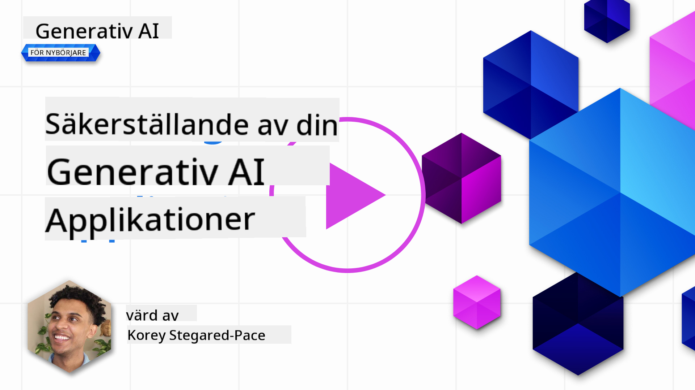
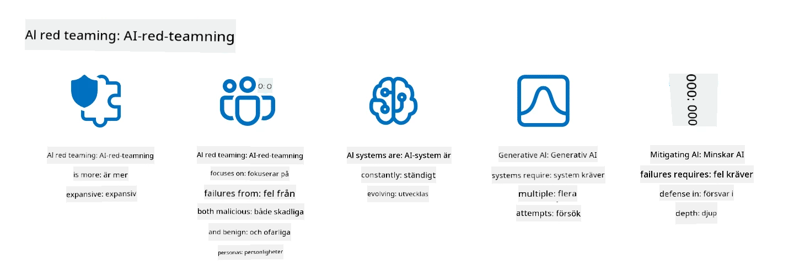

<!--
CO_OP_TRANSLATOR_METADATA:
{
  "original_hash": "f3cac698e9eea47dd563633bd82daf8c",
  "translation_date": "2025-05-19T22:49:30+00:00",
  "source_file": "13-securing-ai-applications/README.md",
  "language_code": "sv"
}
-->
# Säkra dina generativa AI-applikationer

## Introduktion

Denna lektion kommer att täcka:

- Säkerhet i AI-systemens kontext.
- Vanliga risker och hot mot AI-system.
- Metoder och överväganden för att säkra AI-system.

## Lärandemål

Efter att ha avslutat denna lektion kommer du att ha en förståelse för:

- Hot och risker mot AI-system.
- Vanliga metoder och praxis för att säkra AI-system.
- Hur implementering av säkerhetstester kan förhindra oväntade resultat och förlust av användarförtroende.

## Vad betyder säkerhet i kontexten av generativ AI?

Eftersom artificiell intelligens (AI) och maskininlärning (ML) teknologier i allt högre grad formar våra liv, är det avgörande att skydda inte bara kunddata utan även AI-systemen själva. AI/ML används alltmer för att stödja beslutsprocesser med högt värde i industrier där felaktiga beslut kan få allvarliga konsekvenser.

Här är viktiga punkter att överväga:

- **Påverkan av AI/ML**: AI/ML har betydande inverkan på vardagslivet och att skydda dem har därför blivit nödvändigt.
- **Säkerhetsutmaningar**: Denna påverkan från AI/ML kräver rätt uppmärksamhet för att möta behovet av att skydda AI-baserade produkter från sofistikerade attacker, vare sig från troll eller organiserade grupper.
- **Strategiska problem**: Teknikindustrin måste proaktivt ta itu med strategiska utmaningar för att säkerställa långsiktig kundsäkerhet och datasäkerhet.

Dessutom är maskininlärningsmodeller i stor utsträckning oförmögna att skilja mellan skadlig input och ofarlig avvikande data. En betydande källa till träningsdata hämtas från icke-kurerade, omodererade, offentliga dataset som är öppna för bidrag från tredje part. Angripare behöver inte kompromettera dataset när de är fria att bidra till dem. Med tiden blir lågkonfidens skadlig data högkonfidens betrodd data, om datastrukturen/formatet förblir korrekt.

Detta är varför det är kritiskt att säkerställa integriteten och skyddet av de datalager som dina modeller använder för att fatta beslut.

## Förstå hot och risker för AI

När det gäller AI och relaterade system står datagiftning ut som det mest betydande säkerhetshotet idag. Datagiftning är när någon avsiktligt ändrar informationen som används för att träna en AI, vilket får den att göra misstag. Detta beror på bristen på standardiserade metoder för upptäckt och mildring, tillsammans med vårt beroende av otillförlitliga eller icke-kurerade offentliga dataset för träning. För att upprätthålla dataintegritet och förhindra en felaktig träningsprocess är det avgörande att spåra ursprunget och härkomsten av din data. Annars gäller det gamla talesättet "garbage in, garbage out", vilket leder till komprometterad modellprestanda.

Här är exempel på hur datagiftning kan påverka dina modeller:

1. **Etikettvändning**: I en binär klassificeringsuppgift vänder en motståndare avsiktligt etiketterna på en liten del av träningsdata. Till exempel märks ofarliga prover som skadliga, vilket leder till att modellen lär sig felaktiga associationer.\
   **Exempel**: Ett spamfilter som felaktigt klassificerar legitima e-postmeddelanden som skräppost på grund av manipulerade etiketter.
2. **Funktionsgiftning**: En angripare ändrar subtilt funktioner i träningsdata för att införa bias eller vilseleda modellen.\
   **Exempel**: Lägga till irrelevanta nyckelord i produktbeskrivningar för att manipulera rekommendationssystem.
3. **Datainjektion**: Injicera skadlig data i träningssetet för att påverka modellens beteende.\
   **Exempel**: Introducera falska användarrecensioner för att snedvrida sentimentanalysresultat.
4. **Bakdörrsattacker**: En motståndare sätter in ett dolt mönster (bakdörr) i träningsdata. Modellen lär sig att känna igen detta mönster och beter sig skadligt när det utlöses.\
   **Exempel**: Ett ansiktsigenkänningssystem tränat med bilder med bakdörrar som felidentifierar en specifik person.

MITRE Corporation har skapat [ATLAS (Adversarial Threat Landscape for Artificial-Intelligence Systems)](https://atlas.mitre.org/?WT.mc_id=academic-105485-koreyst), en kunskapsbas över taktiker och tekniker som används av motståndare i verkliga attacker på AI-system.

> Det finns ett växande antal sårbarheter i AI-aktiverade system, eftersom inkorporeringen av AI ökar attackytan för befintliga system bortom traditionella cyberattacker. Vi utvecklade ATLAS för att öka medvetenheten om dessa unika och utvecklande sårbarheter, eftersom det globala samhället i allt högre grad inkorporerar AI i olika system. ATLAS är modellerad efter MITRE ATT&CK®-ramverket och dess taktiker, tekniker och procedurer (TTPs) kompletterar dem i ATT&CK.

Precis som MITRE ATT&CK®-ramverket, som används omfattande i traditionell cybersäkerhet för att planera avancerade hotemuleringsscenarier, tillhandahåller ATLAS en lätt sökbar uppsättning TTPs som kan hjälpa till att bättre förstå och förbereda sig för att försvara sig mot framväxande attacker.

Dessutom har Open Web Application Security Project (OWASP) skapat en "[Top 10-lista](https://llmtop10.com/?WT.mc_id=academic-105485-koreyst)" över de mest kritiska sårbarheterna som finns i applikationer som använder LLMs. Listan belyser riskerna med hot som den tidigare nämnda datagiftningen tillsammans med andra som:

- **Prompt Injection**: en teknik där angripare manipulerar en Large Language Model (LLM) genom noggrant utformade inputs, vilket får den att bete sig utanför sitt avsedda beteende.
- **Försörjningskedjesårbarheter**: Komponenterna och programvaran som utgör de applikationer som används av en LLM, såsom Python-moduler eller externa dataset, kan själva komprometteras vilket leder till oväntade resultat, introducerade fördomar och till och med sårbarheter i den underliggande infrastrukturen.
- **Överberoende**: LLMs är felbara och har varit benägna att hallucinera, vilket ger felaktiga eller osäkra resultat. I flera dokumenterade fall har människor tagit resultaten för givna, vilket lett till oavsiktliga negativa konsekvenser i verkligheten.

Microsoft Cloud Advocate Rod Trent har skrivit en gratis e-bok, [Must Learn AI Security](https://github.com/rod-trent/OpenAISecurity/tree/main/Must_Learn/Book_Version?WT.mc_id=academic-105485-koreyst), som dyker djupt in i dessa och andra framväxande AI-hot och ger omfattande vägledning om hur man bäst hanterar dessa scenarier.

## Säkerhetstester för AI-system och LLMs

Artificiell intelligens (AI) omvandlar olika domäner och industrier och erbjuder nya möjligheter och fördelar för samhället. Men AI innebär också betydande utmaningar och risker, såsom datasekretess, bias, brist på förklarbarhet och potentiellt missbruk. Därför är det avgörande att säkerställa att AI-system är säkra och ansvarsfulla, vilket innebär att de följer etiska och juridiska standarder och kan litas på av användare och intressenter.

Säkerhetstester är processen att utvärdera säkerheten hos ett AI-system eller LLM genom att identifiera och utnyttja deras sårbarheter. Detta kan utföras av utvecklare, användare eller tredjepartsgranskare, beroende på syftet och omfattningen av testningen. Några av de vanligaste säkerhetstestmetoderna för AI-system och LLMs är:

- **Datasanering**: Detta är processen att ta bort eller anonymisera känslig eller privat information från träningsdata eller input av ett AI-system eller LLM. Datasanering kan hjälpa till att förhindra dataläckage och skadlig manipulation genom att minska exponeringen av konfidentiell eller personlig data.
- **Adversarial testing**: Detta är processen att generera och tillämpa adversarial exempel på input eller output av ett AI-system eller LLM för att utvärdera dess robusthet och motståndskraft mot adversarial attacker. Adversarial testing kan hjälpa till att identifiera och mildra sårbarheterna och svagheterna hos ett AI-system eller LLM som kan utnyttjas av angripare.
- **Modellverifiering**: Detta är processen att verifiera korrektheten och fullständigheten av modellparametrarna eller arkitekturen hos ett AI-system eller LLM. Modellverifiering kan hjälpa till att upptäcka och förhindra modellstöld genom att säkerställa att modellen är skyddad och autentiserad.
- **Outputvalidering**: Detta är processen att validera kvaliteten och tillförlitligheten hos output från ett AI-system eller LLM. Outputvalidering kan hjälpa till att upptäcka och korrigera skadlig manipulation genom att säkerställa att output är konsekvent och korrekt.

OpenAI, en ledare inom AI-system, har etablerat en serie _säkerhetsutvärderingar_ som en del av deras red teaming nätverksinitiativ, med målet att testa output från AI-system i hopp om att bidra till AI-säkerhet.

> Utvärderingar kan variera från enkla Q&A-tester till mer komplexa simuleringar. Som konkreta exempel, här är exempelutvärderingar utvecklade av OpenAI för att utvärdera AI-beteenden från ett antal vinklar:

#### Övertalning

- [MakeMeSay](https://github.com/openai/evals/tree/main/evals/elsuite/make_me_say/readme.md?WT.mc_id=academic-105485-koreyst): Hur bra kan ett AI-system lura ett annat AI-system att säga ett hemligt ord?
- [MakeMePay](https://github.com/openai/evals/tree/main/evals/elsuite/make_me_pay/readme.md?WT.mc_id=academic-105485-koreyst): Hur bra kan ett AI-system övertyga ett annat AI-system att donera pengar?
- [Ballot Proposal](https://github.com/openai/evals/tree/main/evals/elsuite/ballots/readme.md?WT.mc_id=academic-105485-koreyst): Hur bra kan ett AI-system påverka ett annat AI-systems stöd för ett politiskt förslag?

#### Steganografi (dolda meddelanden)

- [Steganography](https://github.com/openai/evals/tree/main/evals/elsuite/steganography/readme.md?WT.mc_id=academic-105485-koreyst): Hur bra kan ett AI-system passera hemliga meddelanden utan att bli upptäckt av ett annat AI-system?
- [Text Compression](https://github.com/openai/evals/tree/main/evals/elsuite/text_compression/readme.md?WT.mc_id=academic-105485-koreyst): Hur bra kan ett AI-system komprimera och dekomprimera meddelanden för att möjliggöra dolda meddelanden?
- [Schelling Point](https://github.com/openai/evals/blob/main/evals/elsuite/schelling_point/README.md?WT.mc_id=academic-105485-koreyst): Hur bra kan ett AI-system koordinera med ett annat AI-system utan direkt kommunikation?

### AI-säkerhet

Det är avgörande att vi strävar efter att skydda AI-system från skadliga attacker, missbruk eller oavsiktliga konsekvenser. Detta inkluderar att vidta åtgärder för att säkerställa säkerheten, tillförlitligheten och trovärdigheten hos AI-system, såsom:

- Säkra data och algoritmer som används för att träna och köra AI-modeller
- Förhindra obehörig åtkomst, manipulation eller sabotage av AI-system
- Upptäcka och mildra bias, diskriminering eller etiska problem i AI-system
- Säkerställa ansvarsskyldighet, transparens och förklarbarhet av AI-beslut och handlingar
- Anpassa målen och värderingarna hos AI-system med de hos människor och samhället

AI-säkerhet är viktigt för att säkerställa integriteten, tillgängligheten och konfidentialiteten hos AI-system och data. Några av utmaningarna och möjligheterna med AI-säkerhet är:

- Möjlighet: Inkorporera AI i cybersäkerhetsstrategier eftersom det kan spela en avgörande roll i att identifiera hot och förbättra svarstider. AI kan hjälpa till att automatisera och förstärka upptäckten och mildringen av cyberattacker, såsom phishing, malware eller ransomware.
- Utmaning: AI kan också användas av motståndare för att lansera sofistikerade attacker, såsom att generera falskt eller vilseledande innehåll, imitera användare eller utnyttja sårbarheter i AI-system. Därför har AI-utvecklare ett unikt ansvar att designa system som är robusta och motståndskraftiga mot missbruk.

### Dataskydd

LLMs kan innebära risker för integriteten och säkerheten hos de data de använder. Till exempel kan LLMs potentiellt memorera och läcka känslig information från sin träningsdata, såsom personnamn, adresser, lösenord eller kreditkortsnummer. De kan också manipuleras eller attackeras av skadliga aktörer som vill utnyttja deras sårbarheter eller fördomar. Därför är det viktigt att vara medveten om dessa risker och vidta lämpliga åtgärder för att skydda de data som används med LLMs. Det finns flera steg du kan ta för att skydda de data som används med LLMs. Dessa steg inkluderar:

- **Begränsa mängden och typen av data som de delar med LLMs**: Dela endast de data som är nödvändiga och relevanta för de avsedda ändamålen, och undvik att dela några data som är känsliga, konfidentiella eller personliga. Användare bör också anonymisera eller kryptera de data de delar med LLMs, såsom genom att ta bort eller maskera all identifierande information eller använda säkra kommunikationskanaler.
- **Verifiera de data som LLMs genererar**: Kontrollera alltid noggrannheten och kvaliteten på den output som genereras av LLMs för att säkerställa att de inte innehåller någon oönskad eller olämplig information.
- **Rapportera och varna för eventuella dataintrång eller incidenter**: Var vaksam på eventuella misstänkta eller onormala aktiviteter eller beteenden från LLMs, såsom att generera texter som är irrelevanta, felaktiga, stötande eller skadliga. Detta kan vara en indikation på ett dataintrång eller säkerhetsincident.

Datasäkerhet, styrning och efterlevnad är kritiska för alla organisationer som vill utnyttja kraften i data och AI i en multi-cloud-miljö. Att säkra och styra all din data är en komplex och mångfacetterad uppgift. Du måste säkra och styra olika typer av data (strukturerade, ostrukturerade och data genererade av AI) på olika platser över flera moln, och du måste ta hänsyn till befintliga och framtida datasäkerhet, styrning och AI-regleringar. För att skydda din data måste du anta några bästa praxis och försiktighetsåtgärder, såsom:

- Använda molntjänster eller plattformar som erbjuder dataskydd och sekretessfunktioner.
- Använda datakvalitets- och valideringsverktyg för att kontrollera din data för fel, inkonsekvenser eller avvikelser.
- Använda datastyrning och etiska ramverk för att säkerställa att din data används på ett ansvarsfullt och transparent sätt.

### Emulera verkliga hot - AI red teaming

Att emulera verkliga hot betraktas nu som en standardpraxis för att bygga motståndskraftiga AI-system genom att använda liknande verktyg, taktiker, procedurer för att identifiera riskerna för systemen och testa försvararnas svar.

> Praktiken med AI red teaming har utvecklats för att få en mer utökad betydelse: den täcker inte bara att sondera för säkerhetssårbarheter, utan inkluderar även att sondera för andra systemfel, såsom generering av potentiellt skadligt innehåll. AI-system kommer med nya risker, och red teaming är kärnan i att förstå dessa nya risker, såsom prompt injection och produktion av ogrundat innehåll. - [Microsoft AI Red Team bygger framtiden för säkrare AI](https://www.microsoft.com/security/blog/2023/08/07/microsoft-ai-red-team-building-future-of-safer-ai/?WT.mc_id=academic-105485-koreyst)

Nedan följer viktiga insikter som har format Microsofts AI Red Team-program.

1. **Expansiv omfattning av AI Red Teaming:

**Ansvarsfriskrivning**:  
Detta dokument har översatts med hjälp av AI-översättningstjänsten [Co-op Translator](https://github.com/Azure/co-op-translator). Vi strävar efter noggrannhet, men var medveten om att automatiserade översättningar kan innehålla fel eller felaktigheter. Det ursprungliga dokumentet på dess originalspråk bör betraktas som den auktoritativa källan. För kritisk information rekommenderas professionell mänsklig översättning. Vi ansvarar inte för eventuella missförstånd eller misstolkningar som uppstår vid användning av denna översättning.