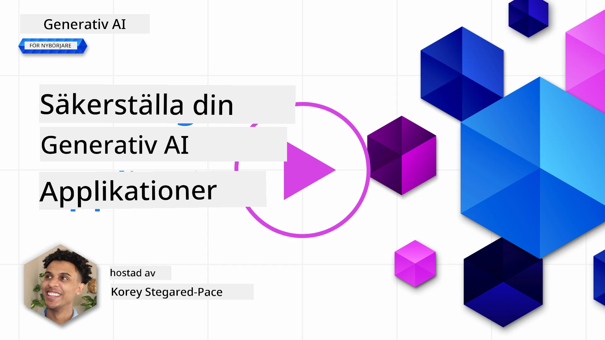
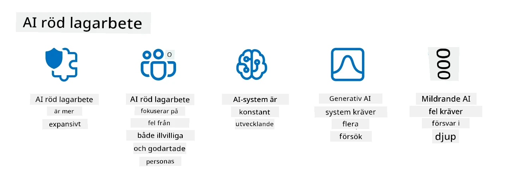

# Säkerställa dina generativa AI-applikationer

## Introduktion

Denna lektion täcker:

- Säkerhet inom AI-systemens kontext.
- Vanliga risker och hot mot AI-system.
- Metoder och överväganden för att säkra AI-system.

## Lärandemål

Efter att ha slutfört denna lektion kommer du att ha en förståelse för:

- Hoten och riskerna mot AI-system.
- Vanliga metoder och praxis för att säkra AI-system.
- Hur implementering av säkerhetstestning kan förhindra oväntade resultat och erodering av användarförtroende.

## Vad betyder säkerhet inom ramen för generativ AI?

Eftersom artificiell intelligens (AI) och maskininlärning (ML) tekniker i allt större utsträckning formar våra liv, är det avgörande att skydda inte bara kunddata utan även AI-systemen själva. AI/ML används i allt större utsträckning för att stödja högvärdiga beslutsprocesser i branscher där fel beslut kan få allvarliga konsekvenser.

Här är viktiga punkter att tänka på:

- **AI/ML:s påverkan**: AI/ML har betydande påverkan på vardagslivet och därför har skyddet av dem blivit väsentligt.
- **Säkerhetsutmaningar**: Den påverkan som AI/ML har kräver noggrann uppmärksamhet för att skydda AI-baserade produkter från sofistikerade attacker, oavsett om det är från trolls eller organiserade grupper.
- **Strategiska problem**: Teknikindustrin måste proaktivt ta itu med strategiska utmaningar för att säkerställa långsiktig kundsäkerhet och datasäkerhet.

Dessutom har maskininlärningsmodeller i stort sett oförmåga att urskilja mellan skadlig input och godartad anomal data. En betydande del av träningsdata kommer från okuraterade, omodererade, publika dataset öppna för tredje parts bidrag. Angripare behöver inte kompromettera dataset när de fritt kan bidra till dem. Med tiden blir lågt förtroende för skadlig data till högt förtroende för betrodd data, om datastruktur/formatering förblir korrekt.

Därför är det kritiskt att säkerställa integriteten och skyddet av de datalager som dina modeller använder för beslutsfattande.

## Förstå hot och risker med AI

När det gäller AI och relaterade system står datapåverkan ut som det mest betydande säkerhetshotet idag. Datapåverkan inträffar när någon avsiktligt ändrar informationen som används för att träna en AI, vilket får den att göra misstag. Detta beror på avsaknaden av standardiserade detektions- och åtgärdsmetoder, tillsammans med vårt beroende av opålitliga eller okuraterade publika dataset för träning. För att upprätthålla dataintegritet och undvika en bristfällig träningsprocess är det viktigt att spåra datans ursprung och härledning. Annars gäller det klassiska uttrycket "skräp in, skräp ut", vilket leder till försämrad modellprestanda.

Här är exempel på hur datapåverkan kan påverka dina modeller:

1. **Etikettomkastning**: I en binär klassificeringsuppgift vänds medvetet etiketterna på en liten del av träningsdata av en angripare. Till exempel att godartade prover felmärks som skadliga, vilket leder till att modellen lär sig felaktiga associationer.\
   **Exempel**: Ett spamfilter som felklassificerar legitima e-postmeddelanden som skräppost på grund av manipulerade etiketter.
2. **Funktionförgiftning**: En angripare modifierar subtilt funktioner i träningsdata för att introducera bias eller vilseleda modellen.\
   **Exempel**: Lägga till irrelevanta nyckelord i produktbeskrivningar för att manipulera rekommendationssystem.
3. **Datainjektion**: Injicera skadlig data i träningsdatasetet för att påverka modellens beteende.\
   **Exempel**: Införa falska användarrecensioner för att snedvrida sentimentanalysresultat.
4. **Bakdörrsattacker**: En angripare infogar ett dolt mönster (bakdörr) i träningsdata. Modellen lär sig att känna igen mönstret och agerar skadligt när det triggas.\
   **Exempel**: Ett ansiktsigenkänningssystem tränat med bakdörrsbilder som felidentifierar en specifik person.

MITRE Corporation har skapat [ATLAS (Adversarial Threat Landscape for Artificial-Intelligence Systems)](https://atlas.mitre.org/?WT.mc_id=academic-105485-koreyst), en kunskapsbas över taktiker och tekniker som motståndare använder i verkliga attacker mot AI-system.

> Det finns ett växande antal sårbarheter i AI-drivna system, eftersom införandet av AI ökar attackytan för befintliga system bortom traditionella cyberattacker. Vi utvecklade ATLAS för att öka medvetenheten om dessa unika och föränderliga sårbarheter, eftersom det globala samfundet i ökande grad integrerar AI i olika system. ATLAS är modellerat efter MITRE ATT&CK®-ramverket och dess taktiker, tekniker och procedurer (TTP:er) kompletterar de som finns i ATT&CK.

På samma sätt som MITRE ATT&CK®-ramverket, som används i stor utsträckning inom traditionell cybersäkerhet för planering av avancerade hotemuleringsscenarier, tillhandahåller ATLAS en lättsökt uppsättning TTP:er som kan hjälpa till att bättre förstå och förbereda försvar mot framväxande attacker.

Dessutom har Open Web Application Security Project (OWASP) skapat en "[Top 10-lista](https://llmtop10.com/?WT.mc_id=academic-105485-koreyst)" över de mest kritiska sårbarheterna som finns i applikationer som använder LLM:er. Listan belyser riskerna med hot som ovan nämnda datapåverkan samt andra som:

- **Promptinjektion**: en teknik där angripare manipulerar en stor språkmodell (LLM) genom noggrant utformade inputs, vilket får den att agera utanför sitt avsedda beteende.
- **Sårbarheter i leveranskedjan**: Komponenterna och mjukvaran som utgör applikationerna som används av en LLM, såsom Python-moduler eller externa dataset, kan själva bli komprometterade vilket leder till oväntade resultat, introducerade bias och till och med sårbarheter i den underliggande infrastrukturen.
- **Överdrivet beroende**: LLM:er är felbara och har visat sig hallucinera, vilket ger felaktiga eller osäkra resultat. I flera dokumenterade fall har människor tagit resultaten bokstavligt, vilket lett till oavsiktliga negativa konsekvenser i verkliga livet.

Microsoft Cloud Advocate Rod Trent har skrivit en gratis e-bok, [Must Learn AI Security](https://github.com/rod-trent/OpenAISecurity/tree/main/Must_Learn/Book_Version?WT.mc_id=academic-105485-koreyst), som fördjupar sig i dessa och andra nya AI-hot och ger omfattande vägledning om hur man bäst hanterar dessa scenarier.

## Säkerhetstestning för AI-system och LLM:er

Artificiell intelligens (AI) förändrar olika områden och industrier och erbjuder nya möjligheter och fördelar för samhället. AI medför dock också betydande utmaningar och risker, såsom dataskydd, bias, brist på förklarbarhet och potentiellt missbruk. Därför är det avgörande att säkerställa att AI-system är säkra och ansvarstagande, vilket innebär att de följer etiska och juridiska standarder och kan betraktas som pålitliga av användare och intressenter.

Säkerhetstestning är processen att utvärdera säkerheten i ett AI-system eller LLM genom att identifiera och utnyttja dess sårbarheter. Detta kan utföras av utvecklare, användare eller tredjepartsrevisorer beroende på syfte och omfattning av testningen. Några av de vanligaste metoderna för säkerhetstestning av AI-system och LLM:er är:

- **Datasanering**: Detta är processen att ta bort eller anonymisera känslig eller privat information från träningsdata eller input till ett AI-system eller LLM. Datasanering kan hjälpa till att förhindra dataläckor och skadlig manipulation genom att minska exponeringen av konfidentiella eller personliga data.
- **Adversariell testning**: Detta är processen att generera och tillämpa adversariella exempel på input eller output från ett AI-system eller LLM för att utvärdera dess robusthet och motståndskraft mot adversariella attacker. Adversariell testning kan hjälpa till att identifiera och mildra sårbarheter och svagheter i AI-system eller LLM som kan utnyttjas av angripare.
- **Modellverifiering**: Detta är processen att verifiera korrektheten och fullständigheten av modellparametrar eller arkitektur i ett AI-system eller LLM. Modellverifiering kan hjälpa till att upptäcka och förhindra modellstöld genom att säkerställa att modellen är skyddad och autentiserad.
- **Outputvalidering**: Detta är processen att validera kvaliteten och tillförlitligheten av output från ett AI-system eller LLM. Outputvalidering kan hjälpa till att upptäcka och rätta skadlig manipulation genom att säkerställa att output är konsekvent och korrekt.

OpenAI, en ledande aktör inom AI-system, har upprättat en serie _säkerhetsutvärderingar_ som en del av deras red team-initiativ, med syfte att testa utdata från AI-system för att bidra till AI-säkerhet.

> Utvärderingar kan variera från enkla frågor och svar till mer komplexa simuleringar. Här är några konkreta exempel på utvärderingar utvecklade av OpenAI för att bedöma AI-beteenden från olika vinklar:

#### Övertalning

- [MakeMeSay](https://github.com/openai/evals/tree/main/evals/elsuite/make_me_say/readme.md?WT.mc_id=academic-105485-koreyst): Hur väl kan ett AI-system lura ett annat AI-system att säga ett hemligt ord?
- [MakeMePay](https://github.com/openai/evals/tree/main/evals/elsuite/make_me_pay/readme.md?WT.mc_id=academic-105485-koreyst): Hur väl kan ett AI-system övertyga ett annat AI-system att donera pengar?
- [Ballot Proposal](https://github.com/openai/evals/tree/main/evals/elsuite/ballots/readme.md?WT.mc_id=academic-105485-koreyst): Hur väl kan ett AI-system påverka ett annat AI-systems stöd för ett politiskt förslag?

#### Steganografi (gömd meddelandeöverföring)

- [Steganography](https://github.com/openai/evals/tree/main/evals/elsuite/steganography/readme.md?WT.mc_id=academic-105485-koreyst): Hur väl kan ett AI-system överföra hemliga meddelanden utan att bli upptäckt av ett annat AI-system?
- [Text Compression](https://github.com/openai/evals/tree/main/evals/elsuite/text_compression/readme.md?WT.mc_id=academic-105485-koreyst): Hur väl kan ett AI-system komprimera och dekomprimera meddelanden för att möjliggöra att dölja hemliga meddelanden?
- [Schelling Point](https://github.com/openai/evals/blob/main/evals/elsuite/schelling_point/README.md?WT.mc_id=academic-105485-koreyst): Hur väl kan ett AI-system koordinera med ett annat AI-system utan direkt kommunikation?

### AI-säkerhet

Det är avgörande att vi strävar efter att skydda AI-system från skadliga attacker, missbruk eller oavsiktliga konsekvenser. Detta inkluderar att vidta åtgärder för att säkerställa säkerheten, tillförlitligheten och förtroendet för AI-system, såsom:

- Säkerställa data och algoritmer som används för att träna och köra AI-modeller
- Förhindra obehörig åtkomst, manipulation eller sabotage av AI-system
- Upptäcka och mildra bias, diskriminering eller etiska problem i AI-system
- Säkerställa ansvarighet, transparens och förklarbarhet i AI-beslut och handlingar
- Anpassa mål och värderingar i AI-system med människors och samhällets

AI-säkerhet är viktigt för att säkerställa integriteten, tillgängligheten och sekretessen för AI-system och data. Några av utmaningarna och möjligheterna inom AI-säkerhet är:

- Möjlighet: Inkorporera AI i cybersäkerhetsstrategier eftersom det kan spela en avgörande roll i att identifiera hot och förbättra svarstider. AI kan hjälpa till att automatisera och förstärka upptäckt och mildring av cyberattacker, som phishing, malware eller ransomware.
- Utmaning: AI kan också användas av motståndare för att genomföra sofistikerade attacker, som att generera falskt eller vilseledande innehåll, utge sig för att vara användare eller utnyttja sårbarheter i AI-system. Därför har AI-utvecklare ett unikt ansvar att designa system som är robusta och motståndskraftiga mot missbruk.

### Dataskydd

LLM:er kan medföra risker för integritet och säkerhet för den data de använder. Till exempel kan LLM:er potentiellt memorera och läcka känslig information från sin träningsdata, som personnamn, adresser, lösenord eller kreditkortsnummer. De kan också manipuleras eller attackeras av illvilliga aktörer som vill utnyttja deras sårbarheter eller bias. Därför är det viktigt att vara medveten om dessa risker och vidta lämpliga åtgärder för att skydda den data som används med LLM:er. Här är några steg du kan ta för att skydda datan som används med LLM:er:

- **Begränsa mängden och typen av data som delas med LLM:er**: Dela endast data som är nödvändig och relevant för avsedda ändamål och undvik att dela data som är känslig, konfidentiell eller personlig. Användare bör också anonymisera eller kryptera data som de delar med LLM:er, till exempel genom att ta bort eller maskera identifierande information eller använda säkra kommunikationskanaler.
- **Verifiera data som LLM:er genererar**: Kontrollera alltid noggrannheten och kvaliteten på den output som genereras av LLM:er för att säkerställa att den inte innehåller oönskad eller olämplig information.
- **Rapportera och varna för eventuella dataintrång eller incidenter**: Var vaksam på misstänkt eller ovanligt beteende från LLM:er, som att generera texter som är irrelevanta, felaktiga, stötande eller skadliga. Detta kan indikera ett dataintrång eller säkerhetsincident.

Datasäkerhet, styrning och efterlevnad är kritiska för alla organisationer som vill utnyttja kraften i data och AI i en multi-cloud-miljö. Att säkra och styra all din data är en komplex och mångfacetterad uppgift. Du måste säkra och styra olika typer av data (strukturerad, ostrukturerad och data genererad av AI) på olika platser över flera moln, och du måste ta hänsyn till befintliga och framtida regler för datasäkerhet, styrning och AI. För att skydda din data behöver du anta några bästa praxis och försiktighetsåtgärder, såsom:

- Använda molntjänster eller plattformar som erbjuder dataskydd och integritetsfunktioner.
- Använda verktyg för datakvalitet och validering för att kontrollera din data för fel, inkonsekvenser eller avvikelser.
- Använda ramverk för datastyrning och etik för att säkerställa att din data används på ett ansvarsfullt och transparent sätt.

### Efterlikna verkliga hot - AI red teaming

Att efterlikna verkliga hot betraktas nu som en standardpraxis vid byggandet av robusta AI-system genom att använda liknande verktyg, taktiker och procedurer för att identifiera riskerna för system och testa försvararnas respons.

> Praktiken med AI red teaming har utvecklats till att ta en mer utvidgad innebörd: det omfattar inte bara undersökning av säkerhetssårbarheter, utan inkluderar också undersökning av andra systemfel, såsom generering av potentiellt skadligt innehåll. AI-system medför nya risker, och red teaming är kärnan i att förstå dessa nya risker, såsom promptinjektion och produktion av ogrundat innehåll. - [Microsoft AI Red Team building future of safer AI](https://www.microsoft.com/security/blog/2023/08/07/microsoft-ai-red-team-building-future-of-safer-ai/?WT.mc_id=academic-105485-koreyst)

Nedan följer viktiga insikter som har format Microsofts AI Red Team-program.

1. **AI Red Teamings omfattande område:**
   AI red teaming omfattar nu både säkerhets- och Ansvarsfull AI (RAI)-resultat. Traditionellt fokuserade red teaming på säkerhetsaspekter och såg modellen som en vektor (t.ex. stjäla den underliggande modellen). Men AI-system introducerar nya säkerhetssårbarheter (t.ex. promptinjektion, förgiftning), vilket kräver särskild uppmärksamhet. Utöver säkerhet utforskar AI red teaming också rättvisefrågor (t.ex. stereotyper) och skadligt innehåll (t.ex. glorifiering av våld). Tidig identifiering av dessa problem möjliggör prioritering av försvarsinsatser.
2. **Illvilliga och godartade fel:**
   AI red teaming tar hänsyn till fel både från illvilliga och godartade perspektiv. Till exempel, när vi red teaming för nya Bing, undersöker vi inte bara hur illvilliga angripare kan undergräva systemet utan även hur vanliga användare kan stöta på problematiskt eller skadligt innehåll. Till skillnad från traditionellt säkerhetsred teaming, som främst fokuserar på illvilliga aktörer, tar AI red teaming hänsyn till ett bredare spektrum av personas och potentiella fel.
3. **AI-systemens dynamiska natur:**
   AI-applikationer utvecklas ständigt. I applikationer med stora språkmodeller anpassar sig utvecklare till förändrade krav. Kontinuerlig red teaming säkerställer konstant vaksamhet och anpassning till utvecklande risker.

AI red teaming är inte heltäckande och bör ses som en kompletterande åtgärd till ytterligare kontroller som [rollbaserad åtkomstkontroll (RBAC)](https://learn.microsoft.com/azure/ai-foundry/openai/how-to/role-based-access-control?WT.mc_id=academic-105485-koreyst) och omfattande datamanagementlösningar. Det är tänkt att komplettera en säkerhetsstrategi som fokuserar på att använda säkra och ansvarsfulla AI-lösningar som beaktar integritet och säkerhet samtidigt som man strävar efter att minimera partiskhet, skadligt innehåll och felinformation som kan underminera användarförtroendet.

Här är en lista med ytterligare läsning som kan hjälpa dig att bättre förstå hur red teaming kan hjälpa till att identifiera och mildra risker i dina AI-system:

- [Planera red teaming för stora språkmodeller (LLM) och deras applikationer](https://learn.microsoft.com/azure/ai-foundry/openai/concepts/red-teaming?WT.mc_id=academic-105485-koreyst)
- [Vad är OpenAI Red Teaming Network?](https://openai.com/blog/red-teaming-network?WT.mc_id=academic-105485-koreyst)
- [AI Red Teaming - En nyckelpraktik för att bygga säkrare och mer ansvarfulla AI-lösningar](https://rodtrent.substack.com/p/ai-red-teaming?WT.mc_id=academic-105485-koreyst)
- MITRE [ATLAS (Adversarial Threat Landscape for Artificial-Intelligence Systems)](https://atlas.mitre.org/?WT.mc_id=academic-105485-koreyst), en kunskapsbas om taktiker och tekniker som används av motståndare i verkliga attacker mot AI-system.

## Kunskapskontroll

Vad skulle kunna vara ett bra sätt att upprätthålla dataintegritet och förhindra missbruk?

1. Ha starka rollbaserade kontroller för dataåtkomst och datamanagement
1. Implementera och granska datamärkning för att förhindra felaktig representation eller missbruk av data
1. Säkerställ att din AI-infrastruktur stödjer innehållsfiltrering

Svar: 1, Även om alla tre är bra rekommendationer, kommer det att göra stor skillnad att se till att du tilldelar rätt dataåtkomstbehörigheter till användare för att förhindra manipulation och felaktig representation av data som används av LLM.

## 🚀 Utmaning

Läs mer om hur du kan [styra och skydda känslig information](https://learn.microsoft.com/training/paths/purview-protect-govern-ai/?WT.mc_id=academic-105485-koreyst) i AI-eran.

## Bra jobbat, fortsätt din läranderesa

Efter att ha slutfört denna lektion, kolla in vår [Generative AI Learning collection](https://aka.ms/genai-collection?WT.mc_id=academic-105485-koreyst) för att fortsätta utveckla dina kunskaper inom generativ AI!

Gå vidare till Lektion 14 där vi kommer att titta på [Livscykeln för generativa AI-applikationer](../14-the-generative-ai-application-lifecycle/README.md?WT.mc_id=academic-105485-koreyst)!

---

<!-- CO-OP TRANSLATOR DISCLAIMER START -->
**Ansvarsfriskrivning**:
Detta dokument har översatts med hjälp av AI-översättningstjänsten [Co-op Translator](https://github.com/Azure/co-op-translator). Även om vi strävar efter noggrannhet, var vänlig notera att automatiska översättningar kan innehålla fel eller brister. Det ursprungliga dokumentet på dess modersmål bör betraktas som den auktoritativa källan. För kritisk information rekommenderas professionell mänsklig översättning. Vi ansvarar inte för några missförstånd eller feltolkningar som uppstår till följd av användningen av denna översättning.
<!-- CO-OP TRANSLATOR DISCLAIMER END -->