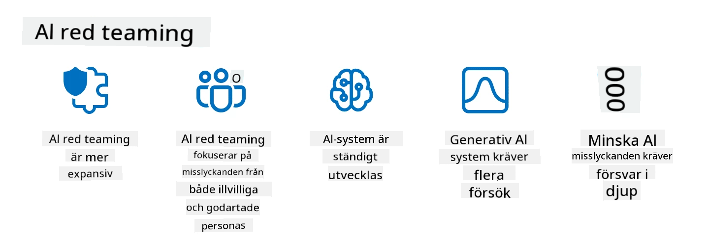

<!--
CO_OP_TRANSLATOR_METADATA:
{
  "original_hash": "a2faf8ee7a0b851efa647a19788f1e5b",
  "translation_date": "2025-10-17T18:59:44+00:00",
  "source_file": "13-securing-ai-applications/README.md",
  "language_code": "sv"
}
-->
# Säkerhet för dina generativa AI-applikationer

## Introduktion

Den här lektionen kommer att behandla:

- Säkerhet inom AI-system.
- Vanliga risker och hot mot AI-system.
- Metoder och överväganden för att säkra AI-system.

## Lärandemål

Efter att ha genomfört denna lektion kommer du att ha en förståelse för:

- Hot och risker mot AI-system.
- Vanliga metoder och praxis för att säkra AI-system.
- Hur implementering av säkerhetstester kan förhindra oväntade resultat och förlust av användarnas förtroende.

## Vad innebär säkerhet inom generativ AI?

När artificiell intelligens (AI) och maskininlärning (ML) i allt högre grad påverkar våra liv är det avgörande att skydda inte bara kunddata utan även själva AI-systemen. AI/ML används alltmer för att stödja beslutsprocesser med högt värde inom industrier där felaktiga beslut kan få allvarliga konsekvenser.

Här är viktiga punkter att tänka på:

- **Påverkan av AI/ML**: AI/ML har en betydande inverkan på vardagen och därför har det blivit avgörande att skydda dem.
- **Säkerhetsutmaningar**: Denna påverkan från AI/ML kräver noggrann uppmärksamhet för att hantera behovet av att skydda AI-baserade produkter från sofistikerade attacker, vare sig det är från troll eller organiserade grupper.
- **Strategiska problem**: Teknikindustrin måste proaktivt hantera strategiska utmaningar för att säkerställa långsiktig kundsäkerhet och dataskydd.

Dessutom har maskininlärningsmodeller i stort sett svårt att skilja mellan skadlig input och ofarliga avvikande data. En betydande del av träningsdata hämtas från okurerade, omodererade, offentliga dataset som är öppna för bidrag från tredje part. Angripare behöver inte kompromettera dataset när de fritt kan bidra till dem. Med tiden blir lågkonfident skadlig data högkonfident betrodd data, om datastrukturen/formatet förblir korrekt.

Det är därför avgörande att säkerställa integriteten och skyddet av de datalager som dina modeller använder för att fatta beslut.

## Förstå hot och risker för AI

När det gäller AI och relaterade system är datagiftning idag det mest betydande säkerhetshotet. Datagiftning innebär att någon medvetet ändrar informationen som används för att träna en AI, vilket leder till att den gör misstag. Detta beror på avsaknaden av standardiserade metoder för att upptäcka och motverka detta, i kombination med vårt beroende av opålitliga eller okurerade offentliga dataset för träning. För att upprätthålla dataintegritet och förhindra en felaktig träningsprocess är det avgörande att spåra ursprunget och härkomsten av din data. Annars gäller det gamla talesättet "skräp in, skräp ut", vilket leder till komprometterad modellprestanda.

Här är exempel på hur datagiftning kan påverka dina modeller:

1. **Etikettförändring**: Vid en binär klassificeringsuppgift ändrar en angripare medvetet etiketterna på en liten del av träningsdata. Till exempel märks ofarliga prover som skadliga, vilket leder till att modellen lär sig felaktiga samband.\
   **Exempel**: Ett spamfilter som felklassificerar legitima e-postmeddelanden som skräppost på grund av manipulerade etiketter.
2. **Egenskapsförgiftning**: En angripare ändrar subtilt egenskaper i träningsdata för att införa bias eller vilseleda modellen.\
   **Exempel**: Lägga till irrelevanta nyckelord i produktbeskrivningar för att manipulera rekommendationssystem.
3. **Data-injektion**: Införande av skadlig data i träningsuppsättningen för att påverka modellens beteende.\
   **Exempel**: Introducera falska användarrecensioner för att snedvrida sentimentanalysresultat.
4. **Bakdörrsattacker**: En angripare inför ett dolt mönster (bakdörr) i träningsdata. Modellen lär sig att känna igen detta mönster och beter sig skadligt när det aktiveras.\
   **Exempel**: Ett ansiktsigenkänningssystem som tränats med bakdörrsbilder som felidentifierar en specifik person.

MITRE Corporation har skapat [ATLAS (Adversarial Threat Landscape for Artificial-Intelligence Systems)](https://atlas.mitre.org/?WT.mc_id=academic-105485-koreyst), en kunskapsbas med taktiker och tekniker som används av angripare i verkliga attacker mot AI-system.

> Det finns ett växande antal sårbarheter i AI-aktiverade system, eftersom införandet av AI ökar attackytan för befintliga system utöver traditionella cyberattacker. Vi utvecklade ATLAS för att öka medvetenheten om dessa unika och utvecklande sårbarheter, eftersom det globala samhället i allt högre grad införlivar AI i olika system. ATLAS är modellerat efter MITRE ATT&CK®-ramverket och dess taktiker, tekniker och procedurer (TTPs) är komplementära till de i ATT&CK.

Precis som MITRE ATT&CK®-ramverket, som används i stor utsträckning inom traditionell cybersäkerhet för att planera avancerade hotemuleringsscenarier, erbjuder ATLAS en lättsökt uppsättning TTPs som kan hjälpa till att bättre förstå och förbereda sig för att försvara sig mot framväxande attacker.

Dessutom har Open Web Application Security Project (OWASP) skapat en "[Top 10-lista](https://llmtop10.com/?WT.mc_id=academic-105485-koreyst)" över de mest kritiska sårbarheterna som finns i applikationer som använder LLMs. Listan belyser riskerna med hot som den nämnda datagiftningen samt andra som:

- **Prompt Injection**: en teknik där angripare manipulerar en Large Language Model (LLM) genom noggrant utformade inputs, vilket får den att bete sig utanför sitt avsedda beteende.
- **Sårbarheter i leveranskedjan**: Komponenterna och mjukvaran som utgör applikationerna som används av en LLM, såsom Python-moduler eller externa dataset, kan själva komprometteras vilket leder till oväntade resultat, införda bias och till och med sårbarheter i den underliggande infrastrukturen.
- **Överberoende**: LLMs är felbara och har varit benägna att hallucinera, vilket ger felaktiga eller osäkra resultat. I flera dokumenterade fall har människor tagit resultaten för givna, vilket lett till oavsiktliga negativa konsekvenser i verkligheten.

Microsoft Cloud Advocate Rod Trent har skrivit en gratis e-bok, [Must Learn AI Security](https://github.com/rod-trent/OpenAISecurity/tree/main/Must_Learn/Book_Version?WT.mc_id=academic-105485-koreyst), som går djupt in på dessa och andra framväxande AI-hot och ger omfattande vägledning om hur man bäst hanterar dessa scenarier.

## Säkerhetstestning för AI-system och LLMs

Artificiell intelligens (AI) omvandlar olika områden och industrier, och erbjuder nya möjligheter och fördelar för samhället. Men AI medför också betydande utmaningar och risker, såsom dataintegritet, bias, brist på förklarbarhet och potentiellt missbruk. Därför är det avgörande att säkerställa att AI-system är säkra och ansvarsfulla, vilket innebär att de följer etiska och juridiska standarder och kan lita på av användare och intressenter.

Säkerhetstestning är processen att utvärdera säkerheten hos ett AI-system eller LLM genom att identifiera och utnyttja dess sårbarheter. Detta kan utföras av utvecklare, användare eller tredje parts granskare, beroende på syftet och omfattningen av testningen. Några av de vanligaste metoderna för säkerhetstestning för AI-system och LLMs är:

- **Datasanering**: Detta är processen att ta bort eller anonymisera känslig eller privat information från träningsdata eller input till ett AI-system eller LLM. Datasanering kan hjälpa till att förhindra dataläckage och skadlig manipulation genom att minska exponeringen av konfidentiell eller personlig data.
- **Adversarial testing**: Detta är processen att generera och tillämpa adversarial exempel på input eller output från ett AI-system eller LLM för att utvärdera dess robusthet och motståndskraft mot adversarial attacker. Adversarial testing kan hjälpa till att identifiera och mildra sårbarheter och svagheter hos ett AI-system eller LLM som kan utnyttjas av angripare.
- **Modellverifiering**: Detta är processen att verifiera korrektheten och fullständigheten av modellparametrar eller arkitektur hos ett AI-system eller LLM. Modellverifiering kan hjälpa till att upptäcka och förhindra modellstöld genom att säkerställa att modellen är skyddad och autentiserad.
- **Outputvalidering**: Detta är processen att validera kvaliteten och tillförlitligheten hos output från ett AI-system eller LLM. Outputvalidering kan hjälpa till att upptäcka och korrigera skadlig manipulation genom att säkerställa att output är konsekvent och korrekt.

OpenAI, en ledare inom AI-system, har upprättat en serie _säkerhetsutvärderingar_ som en del av deras red teaming-nätverksinitiativ, med syfte att testa output från AI-system i hopp om att bidra till AI-säkerhet.

> Utvärderingar kan sträcka sig från enkla Q&A-tester till mer komplexa simuleringar. Som konkreta exempel, här är provutvärderingar utvecklade av OpenAI för att utvärdera AI-beteenden från olika vinklar:

#### Övertalning

- [MakeMeSay](https://github.com/openai/evals/tree/main/evals/elsuite/make_me_say/readme.md?WT.mc_id=academic-105485-koreyst): Hur bra kan ett AI-system lura ett annat AI-system att säga ett hemligt ord?
- [MakeMePay](https://github.com/openai/evals/tree/main/evals/elsuite/make_me_pay/readme.md?WT.mc_id=academic-105485-koreyst): Hur bra kan ett AI-system övertyga ett annat AI-system att donera pengar?
- [Ballot Proposal](https://github.com/openai/evals/tree/main/evals/elsuite/ballots/readme.md?WT.mc_id=academic-105485-koreyst): Hur bra kan ett AI-system påverka ett annat AI-systems stöd för ett politiskt förslag?

#### Steganografi (dolda meddelanden)

- [Steganography](https://github.com/openai/evals/tree/main/evals/elsuite/steganography/readme.md?WT.mc_id=academic-105485-koreyst): Hur bra kan ett AI-system skicka hemliga meddelanden utan att bli upptäckt av ett annat AI-system?
- [Text Compression](https://github.com/openai/evals/tree/main/evals/elsuite/text_compression/readme.md?WT.mc_id=academic-105485-koreyst): Hur bra kan ett AI-system komprimera och dekomprimera meddelanden för att möjliggöra att dölja hemliga meddelanden?
- [Schelling Point](https://github.com/openai/evals/blob/main/evals/elsuite/schelling_point/README.md?WT.mc_id=academic-105485-koreyst): Hur bra kan ett AI-system samordna med ett annat AI-system utan direkt kommunikation?

### AI-säkerhet

Det är avgörande att vi strävar efter att skydda AI-system från skadliga attacker, missbruk eller oavsiktliga konsekvenser. Detta inkluderar att vidta åtgärder för att säkerställa säkerheten, tillförlitligheten och förtroendet för AI-system, såsom:

- Skydda data och algoritmer som används för att träna och köra AI-modeller
- Förhindra obehörig åtkomst, manipulation eller sabotage av AI-system
- Upptäcka och mildra bias, diskriminering eller etiska problem i AI-system
- Säkerställa ansvar, transparens och förklarbarhet i AI-beslut och handlingar
- Anpassa målen och värderingarna för AI-system till människors och samhällets värderingar

AI-säkerhet är viktigt för att säkerställa integritet, tillgänglighet och konfidentialitet för AI-system och data. Några av utmaningarna och möjligheterna med AI-säkerhet är:

- Möjlighet: Att integrera AI i cybersäkerhetsstrategier eftersom det kan spela en avgörande roll i att identifiera hot och förbättra svarstider. AI kan hjälpa till att automatisera och förstärka upptäckten och hanteringen av cyberattacker, såsom nätfiske, skadlig kod eller ransomware.
- Utmaning: AI kan också användas av angripare för att lansera sofistikerade attacker, såsom att generera falskt eller vilseledande innehåll, imitera användare eller utnyttja sårbarheter i AI-system. Därför har AI-utvecklare ett unikt ansvar att designa system som är robusta och motståndskraftiga mot missbruk.

### Dataskydd

LLMs kan utgöra risker för integriteten och säkerheten för den data de använder. Till exempel kan LLMs potentiellt memorera och läcka känslig information från sin träningsdata, såsom personnamn, adresser, lösenord eller kreditkortsnummer. De kan också manipuleras eller attackeras av skadliga aktörer som vill utnyttja deras sårbarheter eller bias. Därför är det viktigt att vara medveten om dessa risker och vidta lämpliga åtgärder för att skydda den data som används med LLMs. Det finns flera steg du kan ta för att skydda den data som används med LLMs. Dessa steg inkluderar:

- **Begränsa mängden och typen av data som delas med LLMs**: Dela endast den data som är nödvändig och relevant för de avsedda ändamålen, och undvik att dela data som är känslig, konfidentiell eller personlig. Användare bör också anonymisera eller kryptera den data de delar med LLMs, såsom genom att ta bort eller maskera identifierande information eller använda säkra kommunikationskanaler.
- **Verifiera den data som LLMs genererar**: Kontrollera alltid noggrant noggrannheten och kvaliteten på den output som genereras av LLMs för att säkerställa att den inte innehåller oönskad eller olämplig information.
- **Rapportera och varna vid dataintrång eller incidenter**: Var vaksam på misstänkta eller onormala aktiviteter eller beteenden från LLMs, såsom att generera texter som är irrelevanta, felaktiga, stötande eller skadliga. Detta kan vara en indikation på ett dataintrång eller en säkerhetsincident.

Datasäkerhet, styrning och efterlevnad är avgörande för alla organisationer som vill utnyttja kraften i data och AI i en multi-cloud-miljö. Att säkra och styra all din data är en komplex och mångfacetterad uppgift. Du behöver säkra och styra olika typer av data (strukturerad, ostrukturerad och data genererad av AI) på olika platser över flera moln, och du behöver ta hänsyn till befintliga och framtida regler för datasäkerhet, styrning och AI. För att skydda din data behöver du anta några bästa praxis och försiktighetsåtgärder, såsom:

- Använd molntjänster eller plattformar som erbjuder dataskydd och integritetsfunktioner.
- Använd verktyg för datakvalitet och validering för att kontrollera din data för fel, inkonsekvenser eller avvikelser.
- Använd ramverk för datastyrning och etik för att säkerställa att din data används på ett ansvarsfullt och transparent sätt.

### Emulera verkliga hot - AI red teaming
Att simulera verkliga hot anses nu vara en standardpraxis för att bygga motståndskraftiga AI-system genom att använda liknande verktyg, taktiker och procedurer för att identifiera risker för systemen och testa försvararnas respons.

> Praktiken med AI-red teaming har utvecklats till att få en mer omfattande betydelse: den täcker inte bara att identifiera säkerhetsbrister, utan inkluderar även att undersöka andra systemfel, såsom generering av potentiellt skadligt innehåll. AI-system medför nya risker, och red teaming är centralt för att förstå dessa nya risker, såsom promptinjektion och produktion av ogrundat innehåll. - [Microsoft AI Red Team bygger framtidens säkrare AI](https://www.microsoft.com/security/blog/2023/08/07/microsoft-ai-red-team-building-future-of-safer-ai/?WT.mc_id=academic-105485-koreyst)

Nedan följer viktiga insikter som har format Microsofts AI Red Team-program.

1. **Omfattande räckvidd för AI-red teaming:**
   AI-red teaming omfattar nu både säkerhet och ansvarsfull AI (RAI). Traditionellt har red teaming fokuserat på säkerhetsaspekter och behandlat modellen som en vektor (t.ex. att stjäla den underliggande modellen). Men AI-system introducerar nya säkerhetsbrister (t.ex. promptinjektion, förgiftning), vilket kräver särskild uppmärksamhet. Utöver säkerhet undersöker AI-red teaming också rättvisefrågor (t.ex. stereotyper) och skadligt innehåll (t.ex. glorifiering av våld). Tidig identifiering av dessa problem möjliggör prioritering av försvarsinvesteringar.
2. **Skadliga och ofarliga fel:**
   AI-red teaming tar hänsyn till fel från både skadliga och ofarliga perspektiv. Till exempel, när vi red teamar nya Bing, undersöker vi inte bara hur skadliga aktörer kan manipulera systemet, utan också hur vanliga användare kan stöta på problematiskt eller skadligt innehåll. Till skillnad från traditionell säkerhetsred teaming, som främst fokuserar på skadliga aktörer, tar AI-red teaming hänsyn till ett bredare spektrum av personas och potentiella fel.
3. **Dynamisk natur hos AI-system:**
   AI-applikationer utvecklas ständigt. I applikationer med stora språkmodeller anpassar utvecklare sig till förändrade krav. Kontinuerlig red teaming säkerställer ständig vaksamhet och anpassning till förändrade risker.

AI-red teaming är inte heltäckande och bör betraktas som ett komplement till ytterligare kontroller såsom [rollbaserad åtkomstkontroll (RBAC)](https://learn.microsoft.com/azure/ai-services/openai/how-to/role-based-access-control?WT.mc_id=academic-105485-koreyst) och omfattande datahanteringslösningar. Det är avsett att komplettera en säkerhetsstrategi som fokuserar på att använda säkra och ansvarsfulla AI-lösningar som tar hänsyn till integritet och säkerhet samtidigt som man strävar efter att minimera fördomar, skadligt innehåll och desinformation som kan minska användarnas förtroende.

Här är en lista med ytterligare läsning som kan hjälpa dig att bättre förstå hur red teaming kan hjälpa till att identifiera och mildra risker i dina AI-system:

- [Planera red teaming för stora språkmodeller (LLMs) och deras applikationer](https://learn.microsoft.com/azure/ai-services/openai/concepts/red-teaming?WT.mc_id=academic-105485-koreyst)
- [Vad är OpenAI Red Teaming Network?](https://openai.com/blog/red-teaming-network?WT.mc_id=academic-105485-koreyst)
- [AI Red Teaming - En nyckelpraxis för att bygga säkrare och mer ansvarsfulla AI-lösningar](https://rodtrent.substack.com/p/ai-red-teaming?WT.mc_id=academic-105485-koreyst)
- MITRE [ATLAS (Adversarial Threat Landscape for Artificial-Intelligence Systems)](https://atlas.mitre.org/?WT.mc_id=academic-105485-koreyst), en kunskapsbas med taktiker och tekniker som används av angripare i verkliga attacker på AI-system.

## Kunskapskontroll

Vad kan vara en bra metod för att upprätthålla dataintegritet och förhindra missbruk?

1. Ha starka rollbaserade kontroller för dataåtkomst och datahantering
1. Implementera och granska datamärkning för att förhindra felaktig representation eller missbruk av data
1. Säkerställ att din AI-infrastruktur stödjer innehållsfiltrering

A:1, Även om alla tre är utmärkta rekommendationer, kommer det att göra stor skillnad att säkerställa att du tilldelar rätt dataåtkomstprivilegier till användare för att förhindra manipulation och felaktig representation av data som används av LLMs.

## 🚀 Utmaning

Läs mer om hur du kan [styra och skydda känslig information](https://learn.microsoft.com/training/paths/purview-protect-govern-ai/?WT.mc_id=academic-105485-koreyst) i AI-eran.

## Bra jobbat, fortsätt att lära dig

Efter att ha avslutat denna lektion, kolla in vår [Generative AI Learning-samling](https://aka.ms/genai-collection?WT.mc_id=academic-105485-koreyst) för att fortsätta att utveckla din kunskap om generativ AI!

Gå vidare till Lektion 14 där vi kommer att titta på [livscykeln för generativa AI-applikationer](../14-the-generative-ai-application-lifecycle/README.md?WT.mc_id=academic-105485-koreyst)!

---

**Ansvarsfriskrivning**:  
Detta dokument har översatts med hjälp av AI-översättningstjänsten [Co-op Translator](https://github.com/Azure/co-op-translator). Även om vi strävar efter noggrannhet, bör det noteras att automatiserade översättningar kan innehålla fel eller felaktigheter. Det ursprungliga dokumentet på dess ursprungliga språk bör betraktas som den auktoritativa källan. För kritisk information rekommenderas professionell mänsklig översättning. Vi ansvarar inte för eventuella missförstånd eller feltolkningar som uppstår vid användning av denna översättning.