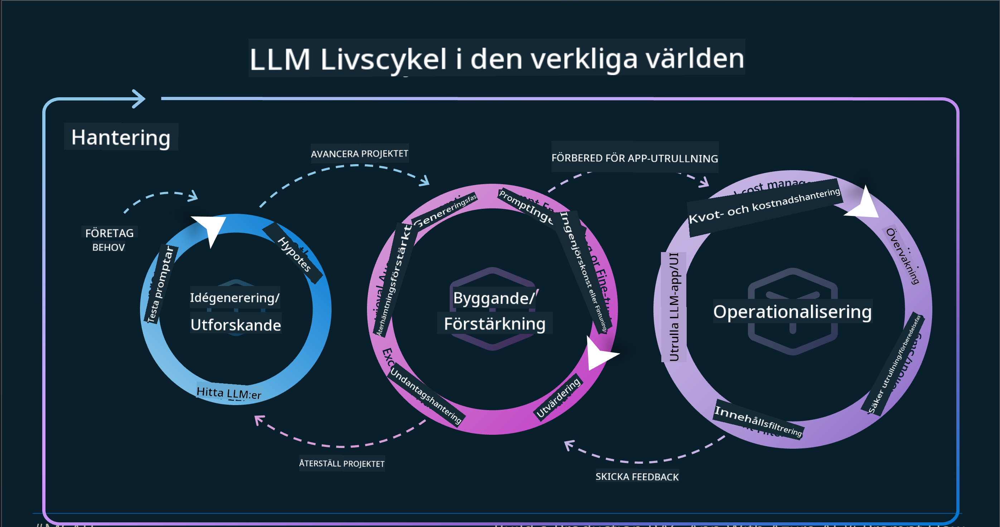
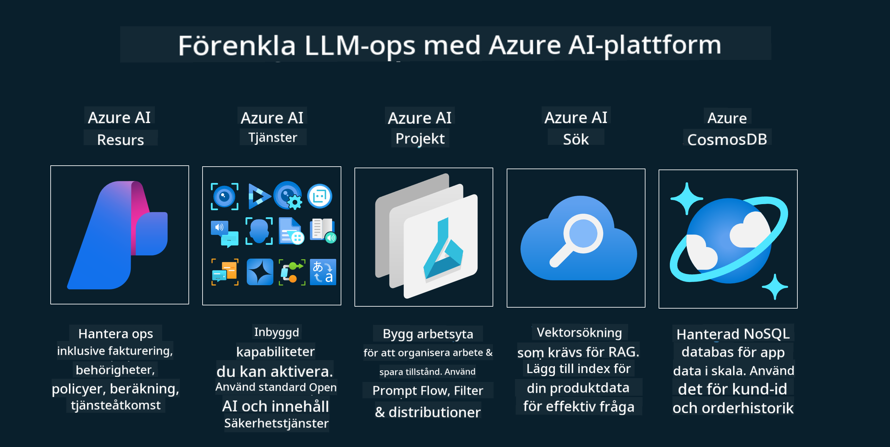
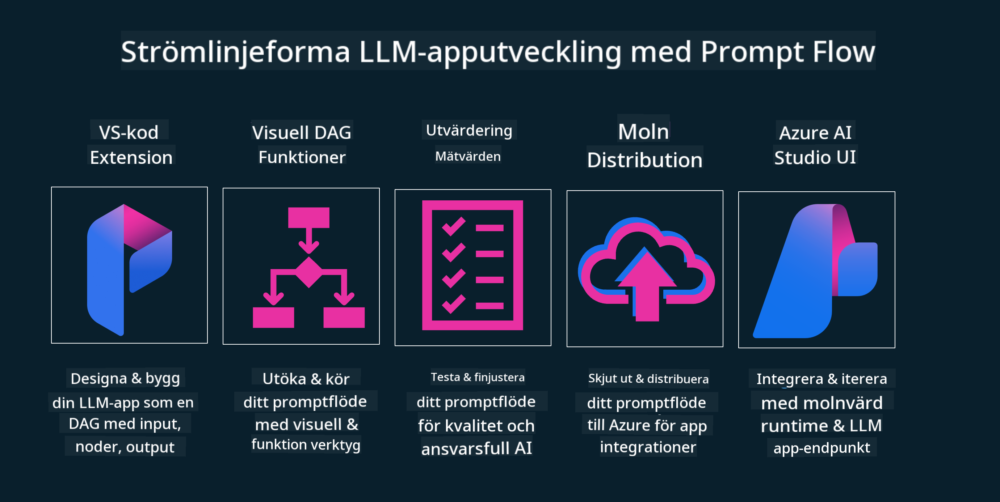

<!--
CO_OP_TRANSLATOR_METADATA:
{
  "original_hash": "27a5347a5022d5ef0a72ab029b03526a",
  "translation_date": "2025-05-19T23:28:45+00:00",
  "source_file": "14-the-generative-ai-application-lifecycle/README.md",
  "language_code": "sv"
}
-->

# Livscykeln för Generativ AI-applikationer

En viktig fråga för alla AI-applikationer är relevansen av AI-funktioner, eftersom AI är ett snabbt utvecklande område. För att säkerställa att din applikation förblir relevant, pålitlig och robust behöver du kontinuerligt övervaka, utvärdera och förbättra den. Det är här den generativa AI-livscykeln kommer in.

Den generativa AI-livscykeln är ett ramverk som vägleder dig genom stadierna av att utveckla, distribuera och underhålla en generativ AI-applikation. Den hjälper dig att definiera dina mål, mäta din prestation, identifiera dina utmaningar och implementera dina lösningar. Den hjälper dig också att anpassa din applikation till de etiska och juridiska standarderna inom ditt område och dina intressenter. Genom att följa den generativa AI-livscykeln kan du säkerställa att din applikation alltid levererar värde och tillfredsställer dina användare.

## Introduktion

I detta kapitel kommer du att:

- Förstå paradigmskiftet från MLOps till LLMOps
- LLM-livscykeln
- Verktyg för livscykeln
- Metrifiering och utvärdering av livscykeln

## Förstå paradigmskiftet från MLOps till LLMOps

LLMs är ett nytt verktyg i den artificiella intelligensens arsenal. De är otroligt kraftfulla för analys- och genereringsuppgifter i applikationer, men denna kraft har vissa konsekvenser för hur vi effektiviserar AI- och klassiska maskininlärningsuppgifter.

Med detta behöver vi ett nytt paradigm för att anpassa detta verktyg dynamiskt, med rätt incitament. Vi kan kategorisera äldre AI-appar som "ML-appar" och nyare AI-appar som "GenAI-appar" eller bara "AI-appar", vilket återspeglar den mainstreamteknologi och teknik som används vid den tiden. Detta skiftar vår berättelse på flera sätt, se följande jämförelse.

Notera att i LLMOps fokuserar vi mer på apputvecklare, använder integrationer som en nyckelpunkt, använder "Models-as-a-Service" och tänker på följande punkter för mätvärden.

- Kvalitet: Responskvalitet
- Skada: Ansvarsfull AI
- Ärlighet: Responsens grundlighet (Är det vettigt? Är det korrekt?)
- Kostnad: Lösningsbudget
- Latens: Genomsnittlig tid för tokenrespons

## LLM-livscykeln

Först, för att förstå livscykeln och modifieringarna, låt oss notera nästa infografik.

Som du kanske noterar, skiljer detta sig från de vanliga livscyklerna från MLOps. LLMs har många nya krav, som promptning, olika tekniker för att förbättra kvaliteten (Fine-Tuning, RAG, Meta-Prompts), olika bedömningar och ansvar med ansvarsfull AI, och slutligen nya utvärderingsmetoder (Kvalitet, Skada, Ärlighet, Kostnad och Latens).

Till exempel, titta på hur vi idégenererar. Använder promptteknik för att experimentera med olika LLMs för att utforska möjligheter och testa om deras hypotes kan vara korrekt.

Notera att detta inte är linjärt, utan integrerade loopar, iterativt och med en övergripande cykel.

Hur kan vi utforska dessa steg? Låt oss gå in i detalj om hur vi kan bygga en livscykel.

Detta kan se lite komplicerat ut, låt oss fokusera på de tre stora stegen först.

1. Idégenerering/Utforskning: Utforskning, här kan vi utforska enligt våra affärsbehov. Prototyping, skapa en [PromptFlow](https://microsoft.github.io/promptflow/index.html?WT.mc_id=academic-105485-koreyst) och testa om det är tillräckligt effektivt för vår hypotes.
2. Byggande/Förstärkning: Implementering, nu börjar vi utvärdera för större dataset och implementera tekniker, som Fine-tuning och RAG, för att kontrollera robustheten i vår lösning. Om det inte gör det, kan omimplementering, tillägg av nya steg i vårt flöde eller omstrukturering av data hjälpa. Efter att ha testat vårt flöde och vår skala, om det fungerar och vi kontrollerar våra mätvärden, är det redo för nästa steg.
3. Operationalisering: Integration, nu lägger vi till övervaknings- och varningssystem till vårt system, distribution och applikationsintegration till vår applikation.

Sedan har vi den övergripande cykeln av förvaltning, med fokus på säkerhet, efterlevnad och styrning.

Grattis, nu har du din AI-app redo att gå och operativ. För en praktisk erfarenhet, ta en titt på [Contoso Chat Demo.](https://nitya.github.io/contoso-chat/?WT.mc_id=academic-105485-koreys)

Nu, vilka verktyg kan vi använda?

## Verktyg för livscykeln

För verktyg tillhandahåller Microsoft [Azure AI Platform](https://azure.microsoft.com/solutions/ai/?WT.mc_id=academic-105485-koreys) och [PromptFlow](https://microsoft.github.io/promptflow/index.html?WT.mc_id=academic-105485-koreyst) för att underlätta och göra din cykel enkel att implementera och redo att gå.

[Azure AI Platform](https://azure.microsoft.com/solutions/ai/?WT.mc_id=academic-105485-koreys) låter dig använda [AI Studio](https://ai.azure.com/?WT.mc_id=academic-105485-koreys). AI Studio är en webbportal som låter dig utforska modeller, exempel och verktyg. Hantera dina resurser, UI-utvecklingsflöden och SDK/CLI-alternativ för kod-först-utveckling.

Azure AI låter dig använda flera resurser för att hantera dina operationer, tjänster, projekt, vektorsökning och databaser behov.

Bygg, från Proof-of-Concept (POC) till storskaliga applikationer med PromptFlow:

- Designa och bygg appar från VS Code, med visuella och funktionella verktyg
- Testa och finjustera dina appar för kvalitets-AI, med enkelhet.
- Använd Azure AI Studio för att integrera och iterera med molnet, tryck och distribuera för snabb integration.

## Fantastiskt! Fortsätt ditt lärande!

Fantastiskt, nu lär dig mer om hur vi strukturerar en applikation för att använda koncepten med [Contoso Chat App](https://nitya.github.io/contoso-chat/?WT.mc_id=academic-105485-koreyst), för att se hur Cloud Advocacy lägger till dessa koncept i demonstrationer. För mer innehåll, kolla vår [Ignite breakout session!
](https://www.youtube.com/watch?v=DdOylyrTOWg)

Nu, kolla in Lektion 15, för att förstå hur [Retrieval Augmented Generation och Vector Databases](../15-rag-and-vector-databases/README.md?WT.mc_id=academic-105485-koreyst) påverkar Generativ AI och gör mer engagerande applikationer!

**Ansvarsfriskrivning**:  
Detta dokument har översatts med hjälp av AI-översättningstjänsten [Co-op Translator](https://github.com/Azure/co-op-translator). Även om vi strävar efter noggrannhet, vänligen var medveten om att automatiska översättningar kan innehålla fel eller felaktigheter. Det ursprungliga dokumentet på sitt modersmål bör betraktas som den auktoritativa källan. För kritisk information rekommenderas professionell mänsklig översättning. Vi är inte ansvariga för eventuella missförstånd eller feltolkningar som uppstår vid användning av denna översättning.