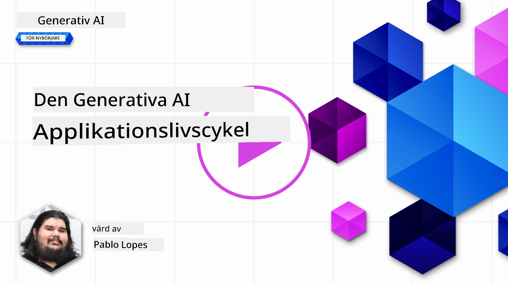
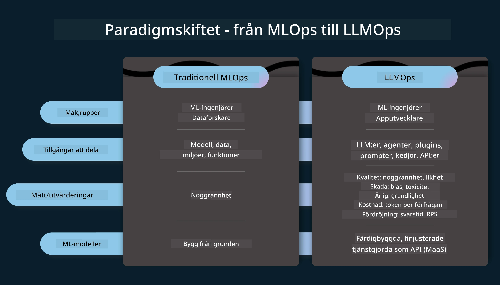
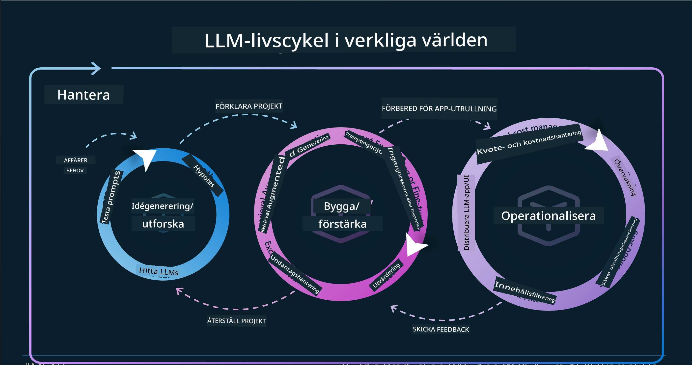
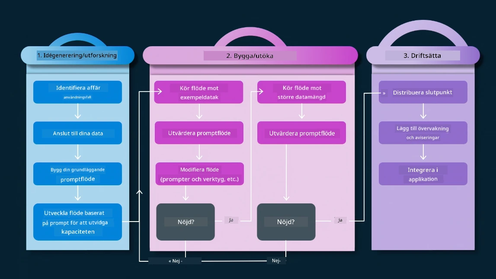
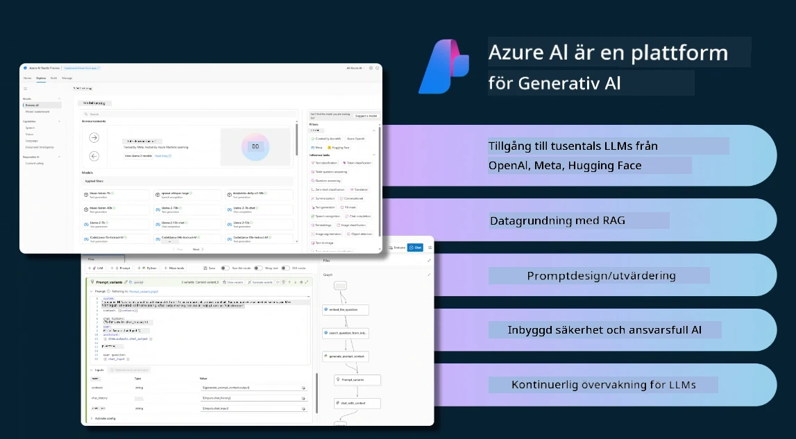
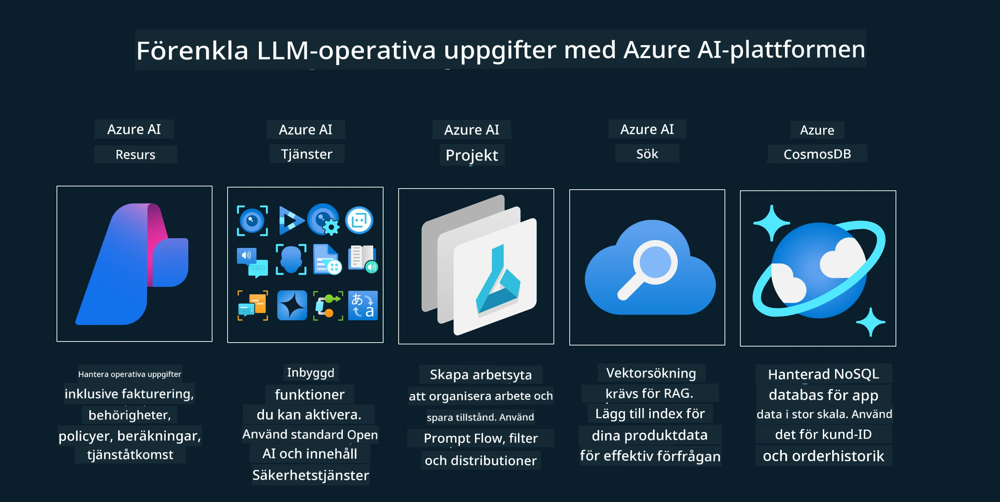
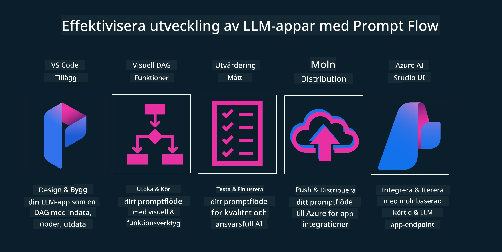

# Livscykeln för generativa AI-applikationer

En viktig fråga för alla AI-applikationer är relevansen av AI-funktioner, eftersom AI är ett snabbt utvecklande område. För att säkerställa att din applikation förblir relevant, pålitlig och robust behöver du kontinuerligt övervaka, utvärdera och förbättra den. Det är här livscykeln för generativ AI kommer in.

Livscykeln för generativ AI är ett ramverk som vägleder dig genom stadierna för att utveckla, distribuera och underhålla en generativ AI-applikation. Det hjälper dig att definiera dina mål, mäta din prestation, identifiera dina utmaningar och implementera dina lösningar. Det hjälper dig också att anpassa din applikation till de etiska och juridiska standarderna i din domän och för dina intressenter. Genom att följa livscykeln för generativ AI kan du säkerställa att din applikation alltid levererar värde och tillfredsställer dina användare.

## Introduktion

I detta kapitel kommer du att:

- Förstå paradigmskiftet från MLOps till LLMOps
- LLM-livscykeln
- Verktyg för livscykelhantering
- Mätning och utvärdering av livscykeln

## Förstå paradigmskiftet från MLOps till LLMOps

LLM:er är ett nytt verktyg i den artificiella intelligensens arsenal, de är otroligt kraftfulla i analys- och genereringsuppgifter för applikationer, men denna kraft har vissa konsekvenser för hur vi effektiviserar AI och klassiska maskininlärningsuppgifter.

Därför behöver vi ett nytt paradigm för att anpassa detta verktyg dynamiskt med rätt incitament. Vi kan kategorisera äldre AI-appar som "ML-appar" och nyare AI-appar som "GenAI-appar" eller bara "AI-appar", vilket speglar den dominerande teknologin och teknikerna som används vid tidpunkten. Detta skiftar vår berättelse på flera sätt, se följande jämförelse.

Notera att i LLMOps fokuserar vi mer på apputvecklarna, använder integrationer som en nyckelpunkt, använder "Modeller-som-en-tjänst" och tänker utifrån följande punkter för mätningar.

- Kvalitet: Svars kvalitet
- Skada: Ansvarfull AI
- Ärlighet: Svarens grundlighet (Förekommer det? Är det korrekt?)
- Kostnad: Lösningens budget
- Latens: Genomsnittlig tid för tokensvar

## LLM-livscykeln

Först, för att förstå livscykeln och dess modifieringar, notera följande infographic.

Som du kan se skiljer sig detta från de vanliga livscyklerna i MLOps. LLM har många nya krav, som prompting, olika tekniker för att förbättra kvalitet (Fine-Tuning, RAG, Meta-Prompts), olika bedömningar och ansvar med ansvarsfull AI, och slutligen nya utvärderingsmätningar (Kvalitet, Skada, Ärlighet, Kostnad och Latens).

Till exempel, titta på hur vi skapar idéer. Med prompt engineering experimenterar vi med olika LLM för att utforska möjligheter och testa om deras hypotes kan vara korrekt.

Observera att detta inte är linjärt, utan integrerade loopar, iterativa och med en övergripande cykel.

Hur kan vi utforska dessa steg? Låt oss gå in på detaljer i hur vi kan bygga en livscykel.

Det kan se lite komplicerat ut, låt oss först fokusera på de tre stora stegen.

1. Idégenerering/Utforskning: Utforskning, här kan vi utforska enligt våra affärsbehov. Prototypa, skapa en [PromptFlow](https://microsoft.github.io/promptflow/index.html?WT.mc_id=academic-105485-koreyst) och testa om den är tillräckligt effektiv för vår hypotes.
1. Bygga/Förstärka: Implementering, nu börjar vi utvärdera för större dataset, implementera tekniker som Fine-tuning och RAG för att kontrollera lösningens robusthet. Om det inte fungerar kan omimplementering, lägga till nya steg i vår process eller omstrukturering av data hjälpa. Efter att ha testat vår process och skala, om det fungerar och uppfyller våra mätvärden, är den redo för nästa steg.
1. Operativisering: Integration, nu lägger vi till övervakning och larmsystem i vårt system, distribution och applikationsintegration till vår applikation.

Sedan har vi den övergripande cykeln för management, med fokus på säkerhet, regelefterlevnad och styrning.

Grattis, nu har du din AI-app redo att användas och vara i drift. För en praktisk erfarenhet, ta en titt på [Contoso Chat Demo.](https://nitya.github.io/contoso-chat/?WT.mc_id=academic-105485-koreyst)

Vilka verktyg kan vi använda?

## Verktyg för livscykelhantering

För verktyg tillhandahåller Microsoft [Azure AI Platform](https://azure.microsoft.com/solutions/ai/?WT.mc_id=academic-105485-koreyst) och [PromptFlow](https://microsoft.github.io/promptflow/index.html?WT.mc_id=academic-105485-koreyst) som förenklar och gör din cykel lätt att implementera och redo att användas.

[Azure AI Platform](https://azure.microsoft.com/solutions/ai/?WT.mc_id=academic-105485-koreyst) låter dig använda [AI Studio](https://ai.azure.com/?WT.mc_id=academic-105485-koreyst). AI Studio är en webbportal som låter dig utforska modeller, exempel och verktyg. Hantera dina resurser, UI-utvecklingsflöden och SDK/CLI-alternativ för kod-först-utveckling.

Azure AI låter dig använda flera resurser för att hantera dina operationer, tjänster, projekt, vektorsökningar och databasutmaningar.

Konstruera från Proof-of-Concept(POC) till storskaliga applikationer med PromptFlow:

- Designa och bygg appar från VS Code, med visuella och funktionella verktyg
- Testa och finjustera dina appar för kvalitativ AI med lätthet.
- Använd Azure AI Studio för att integrera och iterera med molnet, push och distribuera för snabb integration.

## Fantastiskt! Fortsätt din lärande!

Fantastiskt, lär dig nu mer om hur vi strukturerar en applikation för att använda koncepten med [Contoso Chat App](https://nitya.github.io/contoso-chat/?WT.mc_id=academic-105485-koreyst), för att se hur Cloud Advocacy lägger till dessa koncept i demonstrationer. För mer innehåll, kolla in vår [Ignite breakout session!
](https://www.youtube.com/watch?v=DdOylyrTOWg)

Nu, gå vidare till lektion 15 för att förstå hur [Retrieval Augmented Generation och Vector Databases](../15-rag-and-vector-databases/README.md?WT.mc_id=academic-105485-koreyst) påverkar Generativ AI och skapar mer engagerande applikationer!

---

<!-- CO-OP TRANSLATOR DISCLAIMER START -->
**Ansvarsfriskrivning**:
Detta dokument har översatts med hjälp av AI-översättningstjänsten [Co-op Translator](https://github.com/Azure/co-op-translator). Även om vi strävar efter noggrannhet, var vänlig notera att automatiska översättningar kan innehålla fel eller brister. Det ursprungliga dokumentet på dess modersmål bör betraktas som den auktoritativa källan. För kritisk information rekommenderas professionell mänsklig översättning. Vi ansvarar inte för några missförstånd eller feltolkningar som uppstår genom användning av denna översättning.
<!-- CO-OP TRANSLATOR DISCLAIMER END -->