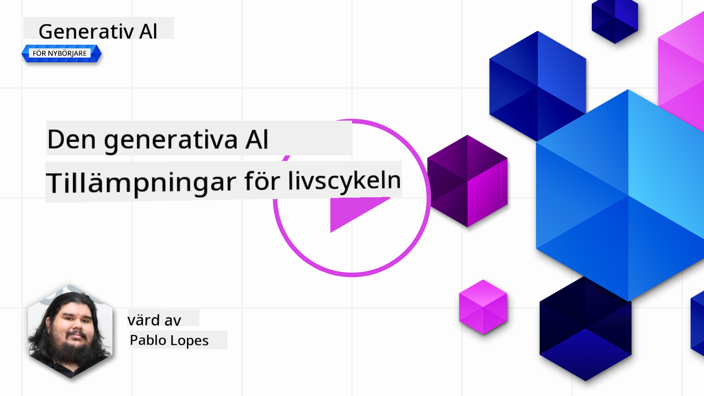
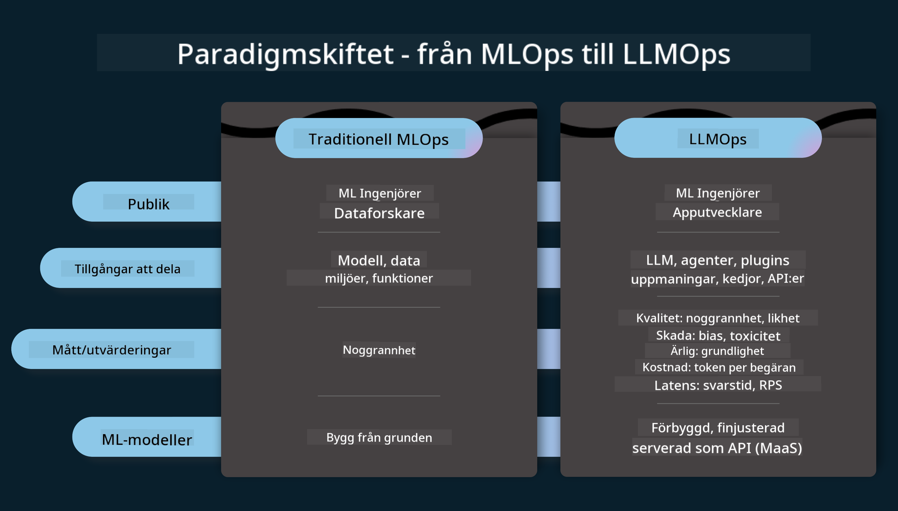
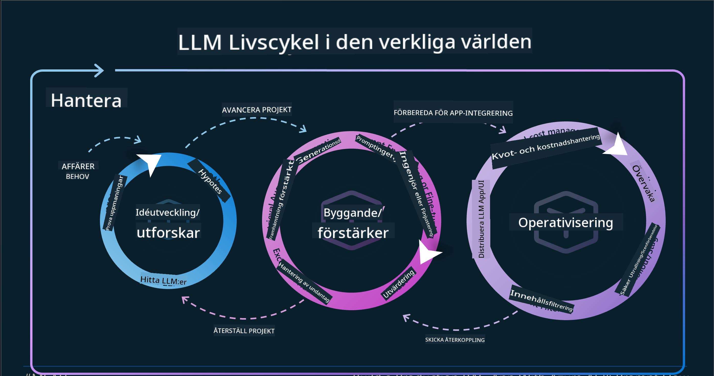
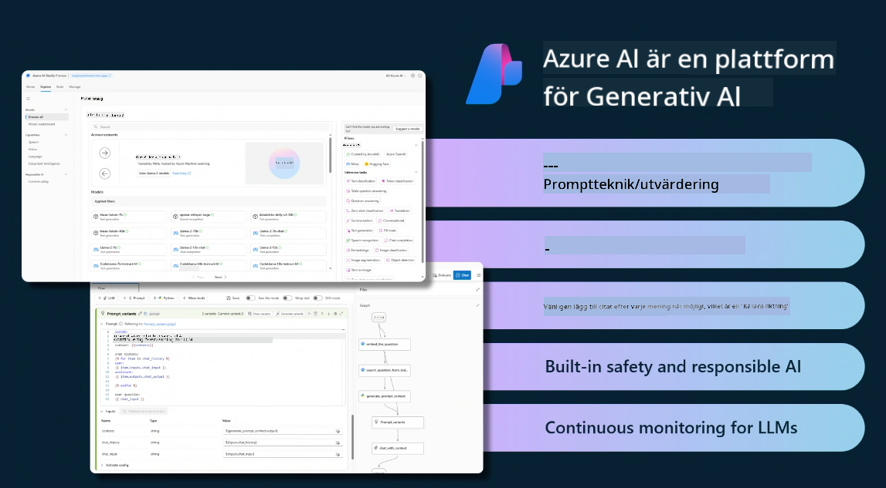
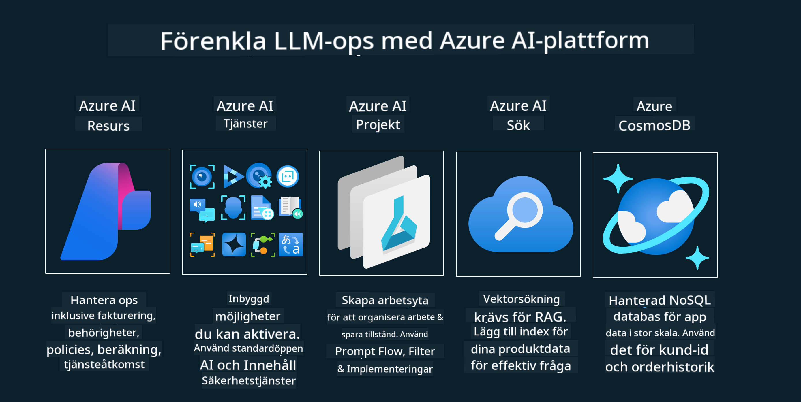
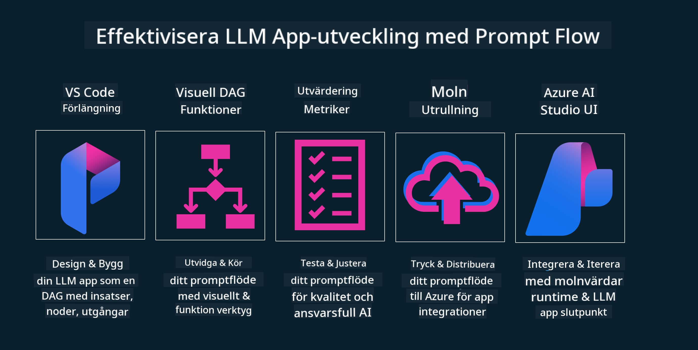

<!--
CO_OP_TRANSLATOR_METADATA:
{
  "original_hash": "27a5347a5022d5ef0a72ab029b03526a",
  "translation_date": "2025-06-25T22:04:26+00:00",
  "source_file": "14-the-generative-ai-application-lifecycle/README.md",
  "language_code": "sv"
}
-->

# Den Generativa AI-applikationens livscykel

En viktig fråga för alla AI-applikationer är relevansen av AI-funktioner, eftersom AI är ett snabbt utvecklande område. För att säkerställa att din applikation förblir relevant, pålitlig och robust behöver du övervaka, utvärdera och förbättra den kontinuerligt. Det är här den generativa AI-livscykeln kommer in.

Den generativa AI-livscykeln är en ram som guidar dig genom stadierna av att utveckla, distribuera och underhålla en generativ AI-applikation. Den hjälper dig att definiera dina mål, mäta din prestation, identifiera dina utmaningar och implementera dina lösningar. Den hjälper också till att anpassa din applikation till de etiska och juridiska standarderna inom ditt område och för dina intressenter. Genom att följa den generativa AI-livscykeln kan du säkerställa att din applikation alltid levererar värde och tillfredsställer dina användare.

## Introduktion

I detta kapitel kommer du att:

- Förstå paradigmskiftet från MLOps till LLMOps
- LLM-livscykeln
- Livscykelverktyg
- Livscykelmätning och utvärdering

## Förstå paradigmskiftet från MLOps till LLMOps

LLM:er är ett nytt verktyg i arsenalen för artificiell intelligens, de är otroligt kraftfulla i analys- och genereringsuppgifter för applikationer. Men denna kraft har vissa konsekvenser för hur vi strömlinjeformar AI och klassiska maskininlärningsuppgifter.

Med detta behöver vi ett nytt paradigm för att anpassa detta verktyg dynamiskt, med rätt incitament. Vi kan kategorisera äldre AI-appar som "ML-appar" och nyare AI-appar som "GenAI-appar" eller bara "AI-appar", vilket återspeglar den mainstreamteknologi och de tekniker som används vid den tiden. Detta förändrar vår berättelse på flera sätt, se följande jämförelse.

Observera att vi i LLMOps är mer fokuserade på apputvecklare, med integrationer som en nyckelpunkt, använder "Models-as-a-Service" och tänker på följande punkter för mätningar.

- Kvalitet: Svarskvalitet
- Skada: Ansvarsfull AI
- Ärlighet: Svarens grundlighet (Låter det vettigt? Är det korrekt?)
- Kostnad: Lösningsbudget
- Latens: Genomsnittlig tid för tokensvar

## LLM-livscykeln

Först, för att förstå livscykeln och modifieringarna, låt oss notera nästa infographic.

Som du kanske märker är detta annorlunda än de vanliga livscyklerna från MLOps. LLM:er har många nya krav, som Prompting, olika tekniker för att förbättra kvaliteten (Fine-Tuning, RAG, Meta-Prompts), olika bedömning och ansvar med ansvarsfull AI, och slutligen nya utvärderingsmått (Kvalitet, Skada, Ärlighet, Kostnad och Latens).

Till exempel, ta en titt på hur vi tänker. Använda prompt engineering för att experimentera med olika LLM:er för att utforska möjligheter att testa om deras hypoteser skulle kunna vara korrekta.

Observera att detta inte är linjärt, utan integrerade loopar, iterativt och med en övergripande cykel.

Hur skulle vi kunna utforska dessa steg? Låt oss gå in på detaljer om hur vi skulle kunna bygga en livscykel.

Detta kan se lite komplicerat ut, låt oss fokusera på de tre stora stegen först.

1. Idé/Utforskning: Utforskning, här kan vi utforska enligt våra affärsbehov. Prototyping, skapa ett [PromptFlow](https://microsoft.github.io/promptflow/index.html?WT.mc_id=academic-105485-koreyst) och testa om det är tillräckligt effektivt för vår hypotes.
2. Bygga/Förstärka: Implementering, nu börjar vi utvärdera för större datamängder och implementera tekniker, som Fine-tuning och RAG, för att kontrollera robustheten i vår lösning. Om det inte gör det, kan återimplementering, att lägga till nya steg i vårt flöde eller omstrukturera data hjälpa. Efter att ha testat vårt flöde och vår skala, om det fungerar och kontrollerar våra mått, är det redo för nästa steg.
3. Operationalisering: Integration, nu lägger vi till övervaknings- och varningssystem till vårt system, distribution och applikationsintegration till vår applikation.

Sedan har vi den övergripande cykeln av hantering, med fokus på säkerhet, efterlevnad och styrning.

Grattis, nu har du din AI-app redo att gå och operativ. För en praktisk upplevelse, ta en titt på [Contoso Chat Demo.](https://nitya.github.io/contoso-chat/?WT.mc_id=academic-105485-koreys)

Nu, vilka verktyg kan vi använda?

## Livscykelverktyg

För verktyg, tillhandahåller Microsoft [Azure AI Platform](https://azure.microsoft.com/solutions/ai/?WT.mc_id=academic-105485-koreys) och [PromptFlow](https://microsoft.github.io/promptflow/index.html?WT.mc_id=academic-105485-koreyst) för att underlätta och göra din cykel lätt att implementera och redo att gå.

[Azure AI Platform](https://azure.microsoft.com/solutions/ai/?WT.mc_id=academic-105485-koreys), låter dig använda [AI Studio](https://ai.azure.com/?WT.mc_id=academic-105485-koreys). AI Studio är en webbportal som låter dig utforska modeller, exempel och verktyg. Hantera dina resurser, UI-utvecklingsflöden och SDK/CLI-alternativ för kod-först utveckling.

Azure AI, låter dig använda flera resurser, för att hantera dina operationer, tjänster, projekt, vektorsökning och databasbehov.

Konstruera, från Proof-of-Concept(POC) till storskaliga applikationer med PromptFlow:

- Designa och bygg appar från VS Code, med visuella och funktionella verktyg
- Testa och finjustera dina appar för kvalitets-AI, med lätthet.
- Använd Azure AI Studio för att integrera och iterera med molnet, tryck och distribuera för snabb integration.

## Fantastiskt! Fortsätt ditt lärande!

Fantastiskt, nu lär dig mer om hur vi strukturerar en applikation för att använda koncepten med [Contoso Chat App](https://nitya.github.io/contoso-chat/?WT.mc_id=academic-105485-koreyst), för att se hur Cloud Advocacy lägger till dessa koncept i demonstrationer. För mer innehåll, kolla vår [Ignite breakout session!
](https://www.youtube.com/watch?v=DdOylyrTOWg)

Nu, kolla in Lektion 15, för att förstå hur [Retrieval Augmented Generation och Vektordatabaser](../15-rag-and-vector-databases/README.md?WT.mc_id=academic-105485-koreyst) påverkar Generativ AI och gör mer engagerande applikationer!

**Ansvarsfriskrivning**:  
Detta dokument har översatts med hjälp av AI-översättningstjänsten [Co-op Translator](https://github.com/Azure/co-op-translator). Vi strävar efter noggrannhet, men var medveten om att automatiska översättningar kan innehålla fel eller felaktigheter. Det ursprungliga dokumentet på dess modersmål bör betraktas som den auktoritativa källan. För kritisk information rekommenderas professionell mänsklig översättning. Vi ansvarar inte för eventuella missförstånd eller feltolkningar som uppstår vid användning av denna översättning.