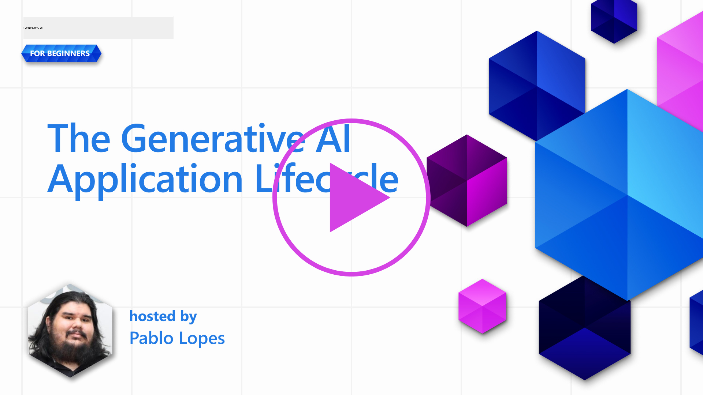
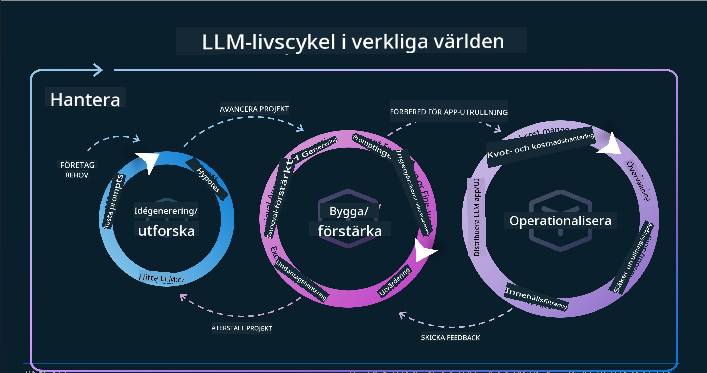
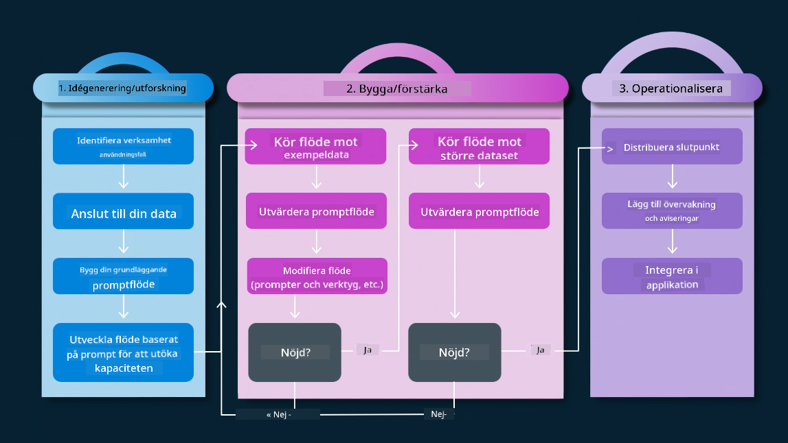
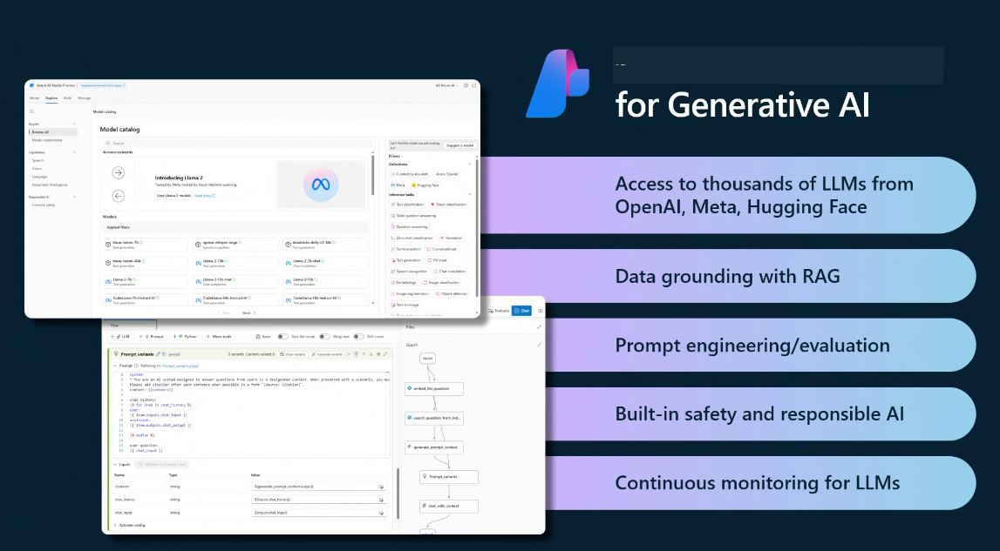
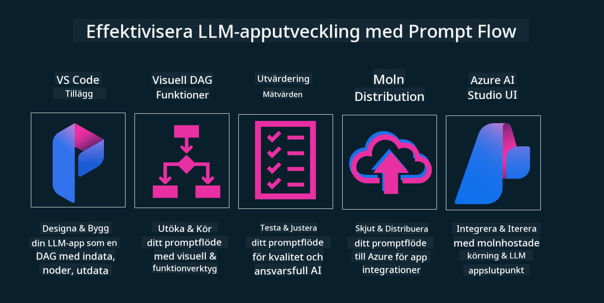

<!--
CO_OP_TRANSLATOR_METADATA:
{
  "original_hash": "27a5347a5022d5ef0a72ab029b03526a",
  "translation_date": "2025-07-09T15:54:24+00:00",
  "source_file": "14-the-generative-ai-application-lifecycle/README.md",
  "language_code": "sv"
}
-->

# Livscykeln för Generativa AI-applikationer

En viktig fråga för alla AI-applikationer är relevansen av AI-funktioner, eftersom AI är ett snabbt utvecklande område. För att säkerställa att din applikation förblir relevant, pålitlig och robust behöver du kontinuerligt övervaka, utvärdera och förbättra den. Det är här den generativa AI-livscykeln kommer in i bilden.

Den generativa AI-livscykeln är en ram som vägleder dig genom stadierna för att utveckla, distribuera och underhålla en generativ AI-applikation. Den hjälper dig att definiera dina mål, mäta din prestation, identifiera dina utmaningar och genomföra dina lösningar. Den hjälper dig också att anpassa din applikation till de etiska och juridiska standarderna inom ditt område och för dina intressenter. Genom att följa den generativa AI-livscykeln kan du säkerställa att din applikation alltid levererar värde och tillfredsställer dina användare.

## Introduktion

I detta kapitel kommer du att:

- Förstå paradigmskiftet från MLOps till LLMOps  
- LLM-livscykeln  
- Verktyg för livscykeln  
- Mätning och utvärdering av livscykeln  

## Förstå paradigmskiftet från MLOps till LLMOps

LLM:er är ett nytt verktyg i artificiell intelligens arsenal, de är otroligt kraftfulla för analys- och genereringsuppgifter i applikationer, men denna kraft har vissa konsekvenser för hur vi effektiviserar AI och klassiska maskininlärningsuppgifter.

Därför behöver vi ett nytt paradigm för att anpassa detta verktyg på ett dynamiskt sätt, med rätt incitament. Vi kan kategorisera äldre AI-appar som "ML Apps" och nyare AI-appar som "GenAI Apps" eller bara "AI Apps", vilket speglar den dominerande teknologin och teknikerna som användes vid den tiden. Detta skiftar vår berättelse på flera sätt, se följande jämförelse.

Notera att i LLMOps är vi mer fokuserade på apputvecklarna, där integrationer är en nyckelpunkt, vi använder "Models-as-a-Service" och tänker på följande punkter för mätvärden.

- Kvalitet: Svarskvalitet  
- Skada: Ansvarsfull AI  
- Ärlighet: Svarens grundlighet (Låter det rimligt? Är det korrekt?)  
- Kostnad: Lösningens budget  
- Latens: Genomsnittlig tid för tokensvar  

## LLM-livscykeln

Först, för att förstå livscykeln och dess förändringar, låt oss titta på följande infographic.

Som du kanske märker skiljer sig detta från de vanliga livscyklerna inom MLOps. LLM:er har många nya krav, som Prompting, olika tekniker för att förbättra kvaliteten (Fine-Tuning, RAG, Meta-Prompts), olika bedömningar och ansvar med ansvarsfull AI, samt nya utvärderingsmått (Kvalitet, Skada, Ärlighet, Kostnad och Latens).

Till exempel, titta på hur vi skapar idéer. Vi använder prompt engineering för att experimentera med olika LLM:er för att utforska möjligheter och testa om deras hypotes kan vara korrekt.

Observera att detta inte är linjärt, utan integrerade loopar, iterativt och med en övergripande cykel.

Hur kan vi utforska dessa steg? Låt oss gå in på detaljer om hur vi kan bygga en livscykel.

Detta kan se lite komplicerat ut, låt oss först fokusera på de tre stora stegen.

1. Idégenerering/Utforskning: Utforskning, här kan vi undersöka enligt våra affärsbehov. Prototypa, skapa en [PromptFlow](https://microsoft.github.io/promptflow/index.html?WT.mc_id=academic-105485-koreyst) och testa om den är tillräckligt effektiv för vår hypotes.  
1. Bygga/Förstärka: Implementering, nu börjar vi utvärdera större datamängder och implementera tekniker som Fine-tuning och RAG för att kontrollera lösningens robusthet. Om det inte fungerar kan omimplementering, tillägg av nya steg i flödet eller omstrukturering av data hjälpa. Efter att ha testat vårt flöde och vår skala, om det fungerar och våra mätvärden är godkända, är det redo för nästa steg.  
1. Driftsätta: Integration, nu lägger vi till övervakning och larmsystem i vårt system, distribution och applikationsintegration till vår applikation.  

Sedan har vi den övergripande cykeln för förvaltning, med fokus på säkerhet, efterlevnad och styrning.

Grattis, nu har du din AI-app redo att användas och driftsättas. För en praktisk upplevelse, ta en titt på [Contoso Chat Demo.](https://nitya.github.io/contoso-chat/?WT.mc_id=academic-105485-koreys)

Vilka verktyg kan vi använda?

## Verktyg för livscykeln

För verktyg erbjuder Microsoft [Azure AI Platform](https://azure.microsoft.com/solutions/ai/?WT.mc_id=academic-105485-koreys) och [PromptFlow](https://microsoft.github.io/promptflow/index.html?WT.mc_id=academic-105485-koreyst) som underlättar och gör din cykel enkel att implementera och redo att användas.

[Azure AI Platform](https://azure.microsoft.com/solutions/ai/?WT.mc_id=academic-105485-koreys) låter dig använda [AI Studio](https://ai.azure.com/?WT.mc_id=academic-105485-koreys). AI Studio är en webbportal som låter dig utforska modeller, exempel och verktyg. Hantera dina resurser, UI-utvecklingsflöden och SDK/CLI-alternativ för kod-först-utveckling.

Azure AI låter dig använda flera resurser för att hantera dina operationer, tjänster, projekt, vektorsökning och databaser.

Bygg från Proof-of-Concept (POC) till storskaliga applikationer med PromptFlow:

- Designa och bygg appar från VS Code, med visuella och funktionella verktyg  
- Testa och finjustera dina appar för kvalitativ AI, enkelt.  
- Använd Azure AI Studio för att integrera och iterera med molnet, tryck och distribuera för snabb integration.  

## Fantastiskt! Fortsätt din lärande!

Fantastiskt, lär dig nu mer om hur vi strukturerar en applikation för att använda koncepten med [Contoso Chat App](https://nitya.github.io/contoso-chat/?WT.mc_id=academic-105485-koreyst), för att se hur Cloud Advocacy tillämpar dessa koncept i demonstrationer. För mer innehåll, kolla in vår [Ignite breakout session!](https://www.youtube.com/watch?v=DdOylyrTOWg)

Nu, gå vidare till Lektion 15 för att förstå hur [Retrieval Augmented Generation och Vector Databases](../15-rag-and-vector-databases/README.md?WT.mc_id=academic-105485-koreyst) påverkar Generativ AI och för att skapa mer engagerande applikationer!

**Ansvarsfriskrivning**:  
Detta dokument har översatts med hjälp av AI-översättningstjänsten [Co-op Translator](https://github.com/Azure/co-op-translator). Även om vi strävar efter noggrannhet, vänligen observera att automatiska översättningar kan innehålla fel eller brister. Det ursprungliga dokumentet på dess modersmål bör betraktas som den auktoritativa källan. För kritisk information rekommenderas professionell mänsklig översättning. Vi ansvarar inte för några missförstånd eller feltolkningar som uppstår vid användning av denna översättning.