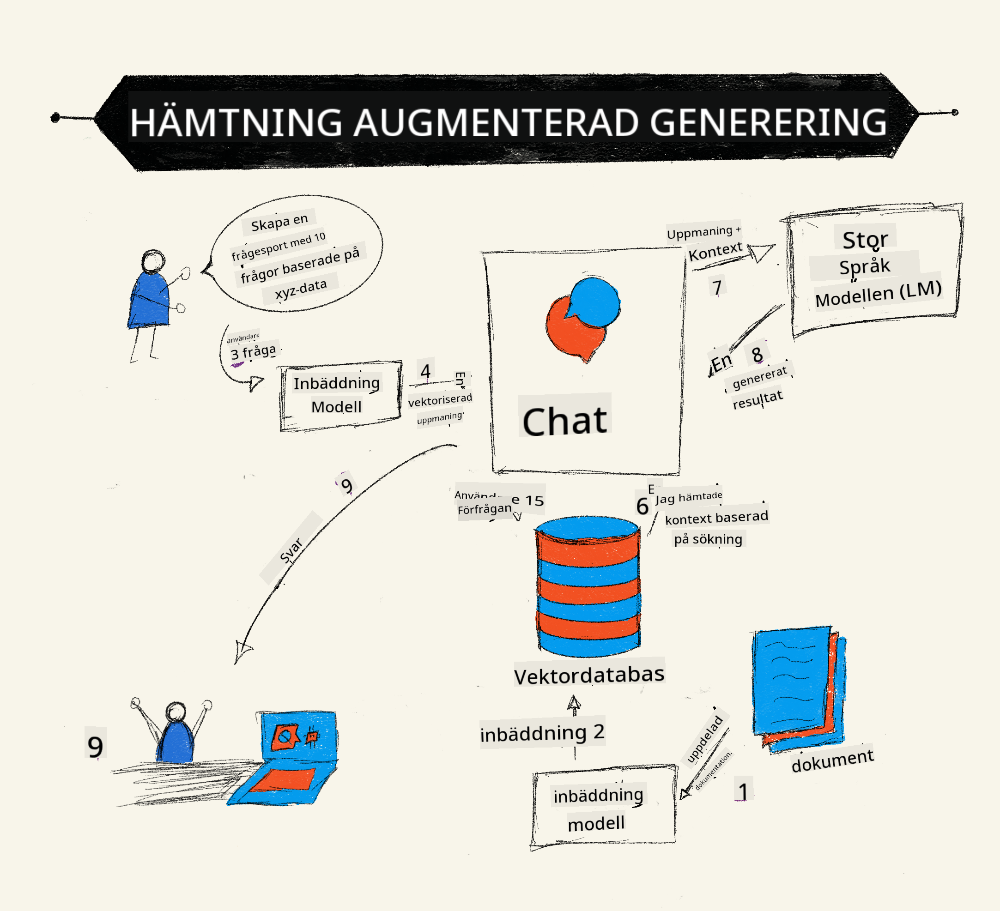
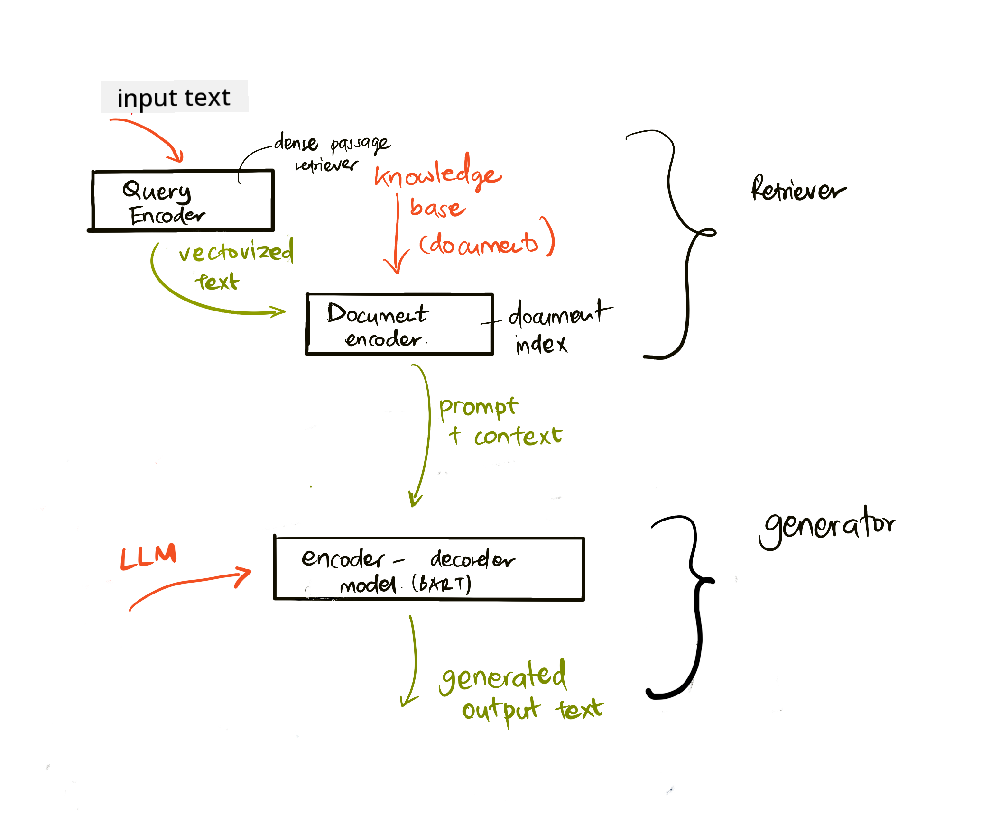
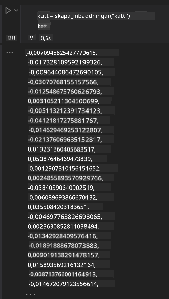

<!--
CO_OP_TRANSLATOR_METADATA:
{
  "original_hash": "e2861bbca91c0567ef32bc77fe054f9e",
  "translation_date": "2025-05-20T01:20:17+00:00",
  "source_file": "15-rag-and-vector-databases/README.md",
  "language_code": "sv"
}
-->
# Retrieval Augmented Generation (RAG) och Vektordatabaser

[](https://aka.ms/gen-ai-lesson15-gh?WT.mc_id=academic-105485-koreyst)

I lektionen om sökapplikationer lärde vi oss kort hur man integrerar egen data i Stora Språkmodeller (LLMs). I denna lektion kommer vi att fördjupa oss i koncepten kring att grunda din data i din LLM-applikation, processens mekanik och metoder för att lagra data, inklusive både inbäddningar och text.

> **Video Kommer Snart**

## Introduktion

I denna lektion kommer vi att täcka följande:

- En introduktion till RAG, vad det är och varför det används inom AI (artificiell intelligens).

- Förstå vad vektordatabaser är och skapa en för vår applikation.

- Ett praktiskt exempel på hur man integrerar RAG i en applikation.

## Lärandemål

Efter att ha slutfört denna lektion kommer du att kunna:

- Förklara betydelsen av RAG i dataåtervinning och bearbetning.

- Ställa in en RAG-applikation och grunda din data till en LLM

- Effektiv integration av RAG och Vektordatabaser i LLM-applikationer.

## Vårt Scenario: förbättra våra LLM:er med vår egen data

För denna lektion vill vi lägga till våra egna anteckningar i utbildningsstarten, vilket gör att chatboten kan få mer information om de olika ämnena. Med hjälp av de anteckningar vi har kommer eleverna kunna studera bättre och förstå de olika ämnena, vilket gör det enklare att repetera inför sina prov. För att skapa vårt scenario kommer vi att använda:

- `Azure OpenAI:` LLM som vi kommer att använda för att skapa vår chatbot

- `AI for beginners' lesson on Neural Networks`: detta kommer att vara den data vi grundar vår LLM på

- `Azure AI Search` och `Azure Cosmos DB:` vektordatabas för att lagra vår data och skapa ett sökindex

Användare kommer att kunna skapa övningsquiz från sina anteckningar, repetitionskort och sammanfatta dem till koncisa översikter. För att komma igång, låt oss titta på vad RAG är och hur det fungerar:

## Retrieval Augmented Generation (RAG)

En LLM-driven chatbot bearbetar användarens frågor för att generera svar. Den är designad för att vara interaktiv och engagerar sig med användare inom en mängd olika ämnen. Dock är dess svar begränsade till det sammanhang som ges och dess grundläggande träningsdata. Till exempel är GPT-4:s kunskapsgräns september 2021, vilket innebär att den saknar kunskap om händelser som inträffat efter denna period. Dessutom utesluter datan som används för att träna LLM:er konfidentiell information såsom personliga anteckningar eller en företags produktmanual.

### Hur RAGs (Retrieval Augmented Generation) fungerar



Anta att du vill distribuera en chatbot som skapar quiz från dina anteckningar, då kommer du behöva en koppling till kunskapsbasen. Det är här RAG kommer till undsättning. RAGs fungerar enligt följande:

- **Kunskapsbas:** Innan återvinning behöver dessa dokument intas och förbehandlas, vanligtvis genom att bryta ner stora dokument i mindre delar, omvandla dem till textinbäddning och lagra dem i en databas.

- **Användarfråga:** användaren ställer en fråga

- **Återvinning:** När en användare ställer en fråga hämtar inbäddningsmodellen relevant information från vår kunskapsbas för att ge mer sammanhang som kommer att införlivas i frågan.

- **Förstärkt generering:** LLM förbättrar sitt svar baserat på den data som hämtats. Det gör att det genererade svaret inte bara baseras på förtränad data utan också relevant information från det tillagda sammanhanget. Den hämtade datan används för att förstärka LLM:s svar. LLM returnerar sedan ett svar på användarens fråga.



Arkitekturen för RAGs implementeras med hjälp av transformatorer bestående av två delar: en encoder och en decoder. Till exempel, när en användare ställer en fråga, 'kodas' ingångstexten till vektorer som fångar ordens betydelse och vektorerna 'avkodas' till vårt dokumentindex och genererar ny text baserat på användarens fråga. LLM använder både en encoder-decoder-modell för att generera utdata.

Två tillvägagångssätt när man implementerar RAG enligt det föreslagna dokumentet: [Retrieval-Augmented Generation for Knowledge intensive NLP (natural language processing software) Tasks](https://arxiv.org/pdf/2005.11401.pdf?WT.mc_id=academic-105485-koreyst) är:

- **_RAG-Sequence_** använder hämtade dokument för att förutsäga det bästa möjliga svaret på en användarfråga

- **RAG-Token** använder dokument för att generera nästa token, sedan hämta dem för att svara på användarens fråga

### Varför skulle du använda RAGs? 

- **Informationsrikedom:** säkerställer att textrespons är aktuella och uppdaterade. Det förbättrar därför prestandan på domänspecifika uppgifter genom att få tillgång till den interna kunskapsbasen.

- Minskar fabricering genom att använda **verifierbar data** i kunskapsbasen för att ge sammanhang till användarfrågor.

- Det är **kostnadseffektivt** eftersom de är mer ekonomiska jämfört med att finjustera en LLM

## Skapa en kunskapsbas

Vår applikation är baserad på vår personliga data, dvs. lektionen om neurala nätverk i AI For Beginners-kursplanen.

### Vektordatabaser

En vektordatabas, till skillnad från traditionella databaser, är en specialiserad databas designad för att lagra, hantera och söka inbäddade vektorer. Den lagrar numeriska representationer av dokument. Att bryta ner data till numeriska inbäddningar gör det enklare för vårt AI-system att förstå och bearbeta datan.

Vi lagrar våra inbäddningar i vektordatabaser eftersom LLM:er har en gräns för antalet tokens de accepterar som indata. Eftersom du inte kan skicka hela inbäddningarna till en LLM, behöver vi bryta ner dem i delar och när en användare ställer en fråga, kommer de inbäddningar som mest liknar frågan att returneras tillsammans med frågan. Att dela upp i delar minskar också kostnaderna för antalet tokens som skickas genom en LLM.

Några populära vektordatabaser inkluderar Azure Cosmos DB, Clarifyai, Pinecone, Chromadb, ScaNN, Qdrant och DeepLake. Du kan skapa en Azure Cosmos DB-modell med hjälp av Azure CLI med följande kommando:

```bash
az login
az group create -n <resource-group-name> -l <location>
az cosmosdb create -n <cosmos-db-name> -r <resource-group-name>
az cosmosdb list-keys -n <cosmos-db-name> -g <resource-group-name>
```

### Från text till inbäddningar

Innan vi lagrar vår data behöver vi omvandla den till vektor inbäddningar innan den lagras i databasen. Om du arbetar med stora dokument eller långa texter kan du dela upp dem baserat på förväntade frågor. Uppdelning kan göras på meningsnivå, eller på styckenivå. Eftersom uppdelning härleder betydelser från orden omkring dem kan du lägga till annat sammanhang till en del, till exempel genom att lägga till dokumentets titel eller inkludera lite text före eller efter delen. Du kan dela upp datan enligt följande:

```python
def split_text(text, max_length, min_length):
    words = text.split()
    chunks = []
    current_chunk = []

    for word in words:
        current_chunk.append(word)
        if len(' '.join(current_chunk)) < max_length and len(' '.join(current_chunk)) > min_length:
            chunks.append(' '.join(current_chunk))
            current_chunk = []

    # If the last chunk didn't reach the minimum length, add it anyway
    if current_chunk:
        chunks.append(' '.join(current_chunk))

    return chunks
```

När de väl är uppdelade kan vi sedan inbädda vår text med olika inbäddningsmodeller. Några modeller du kan använda inkluderar: word2vec, ada-002 av OpenAI, Azure Computer Vision och många fler. Att välja en modell att använda beror på de språk du använder, typen av innehåll som kodas (text/bilder/ljud), storleken på indata den kan koda och längden på inbäddningsutdata.

Ett exempel på inbäddad text med OpenAI:s `text-embedding-ada-002` modell är:


## Återvinning och Vektorsökning

När en användare ställer en fråga omvandlar retrievern den till en vektor med hjälp av frågeencodern, den söker sedan genom vårt dokumentsökindex efter relevanta vektorer i dokumentet som är relaterade till indata. När det är klart omvandlar den både indatavektorn och dokumentvektorerna till text och skickar det genom LLM.

### Återvinning

Återvinning sker när systemet försöker snabbt hitta dokumenten från indexet som uppfyller sökkriterierna. Målet med retrievern är att få dokument som kommer att användas för att ge sammanhang och grunda LLM på din data.

Det finns flera sätt att utföra sökningar inom vår databas, såsom:

- **Nyckelordssökning** - används för textsökningar

- **Semantisk sökning** - använder den semantiska betydelsen av ord

- **Vektorsökning** - omvandlar dokument från text till vektorrepresentationer med hjälp av inbäddningsmodeller. Återvinning kommer att ske genom att fråga dokumenten vars vektorrepresentationer är närmast användarens fråga.

- **Hybrid** - en kombination av både nyckelord och vektorsökning.

En utmaning med återvinning uppstår när det inte finns något liknande svar på frågan i databasen, systemet kommer då att returnera den bästa informationen de kan få, dock kan du använda taktiker som att ställa in det maximala avståndet för relevans eller använda hybrid sökning som kombinerar både nyckelord och vektorsökning. I denna lektion kommer vi att använda hybrid sökning, en kombination av både vektor- och nyckelordssökning. Vi kommer att lagra vår data i en dataframe med kolumner som innehåller delarna samt inbäddningar.

### Vektorsimilaritet

Retrievern kommer att söka igenom kunskapsdatabasen efter inbäddningar som ligger nära varandra, den närmaste grannen, eftersom de är texter som är lika. I scenariot där en användare ställer en fråga, inbäddas den först och matchas sedan med liknande inbäddningar. Den vanliga mätningen som används för att hitta hur lika olika vektorer är, är cosinuslikhet som baseras på vinkeln mellan två vektorer.

Vi kan mäta likhet med andra alternativ vi kan använda är euklidiskt avstånd som är den raka linjen mellan vektorändpunkter och skalärprodukt som mäter summan av produkterna av motsvarande element av två vektorer.

### Sökindex

När vi gör återvinning behöver vi bygga ett sökindex för vår kunskapsbas innan vi utför sökning. Ett index kommer att lagra våra inbäddningar och kan snabbt hämta de mest liknande delarna även i en stor databas. Vi kan skapa vårt index lokalt med hjälp av:

```python
from sklearn.neighbors import NearestNeighbors

embeddings = flattened_df['embeddings'].to_list()

# Create the search index
nbrs = NearestNeighbors(n_neighbors=5, algorithm='ball_tree').fit(embeddings)

# To query the index, you can use the kneighbors method
distances, indices = nbrs.kneighbors(embeddings)
```

### Omrankning

När du har frågat databasen kan du behöva sortera resultaten från de mest relevanta. En omranknings-LLM använder Maskininlärning för att förbättra relevansen av sökresultaten genom att ordna dem från de mest relevanta. Med Azure AI Search görs omrankning automatiskt åt dig med hjälp av en semantisk omrankare. Ett exempel på hur omrankning fungerar med närmaste grannar:

```python
# Find the most similar documents
distances, indices = nbrs.kneighbors([query_vector])

index = []
# Print the most similar documents
for i in range(3):
    index = indices[0][i]
    for index in indices[0]:
        print(flattened_df['chunks'].iloc[index])
        print(flattened_df['path'].iloc[index])
        print(flattened_df['distances'].iloc[index])
    else:
        print(f"Index {index} not found in DataFrame")
```

## Samla allt

Det sista steget är att lägga till vår LLM i mixen för att kunna få svar som är grundade på vår data. Vi kan implementera det enligt följande:

```python
user_input = "what is a perceptron?"

def chatbot(user_input):
    # Convert the question to a query vector
    query_vector = create_embeddings(user_input)

    # Find the most similar documents
    distances, indices = nbrs.kneighbors([query_vector])

    # add documents to query  to provide context
    history = []
    for index in indices[0]:
        history.append(flattened_df['chunks'].iloc[index])

    # combine the history and the user input
    history.append(user_input)

    # create a message object
    messages=[
        {"role": "system", "content": "You are an AI assistant that helps with AI questions."},
        {"role": "user", "content": history[-1]}
    ]

    # use chat completion to generate a response
    response = openai.chat.completions.create(
        model="gpt-4",
        temperature=0.7,
        max_tokens=800,
        messages=messages
    )

    return response.choices[0].message

chatbot(user_input)
```

## Utvärdera vår applikation

### Utvärderingsmetoder

- Kvalitet på svaren som tillhandahålls, säkerställa att det låter naturligt, flytande och mänskligt

- Grundadhet i datan: utvärdera om svaret kom från de tillhandahållna dokumenten

- Relevans: utvärdera om svaret matchar och är relaterat till frågan som ställdes

- Flyt - om svaret är grammatiskt meningsfullt

## Användningsfall för att använda RAG (Retrieval Augmented Generation) och vektordatabaser

Det finns många olika användningsfall där funktionsanrop kan förbättra din app, såsom:

- Frågor och Svar: grunda din företagsdata till en chatt som kan användas av anställda för att ställa frågor.

- Rekommendationssystem: där du kan skapa ett system som matchar de mest liknande värdena, t.ex. filmer, restauranger och mycket mer.

- Chatbottjänster: du kan lagra chattens historia och anpassa konversationen baserat på användardata.

- Bildsökning baserat på vektor inbäddningar, användbart vid bildigenkänning och avvikelsedetektering.

## Sammanfattning

Vi har täckt de grundläggande områdena av RAG från att lägga till vår data till applikationen, användarfrågan och utdata. För att förenkla skapandet av RAG kan du använda ramverk som Semanti Kernel, Langchain eller Autogen.

## Uppgift

För att fortsätta din inlärning av Retrieval Augmented Generation (RAG) kan du bygga:

- Bygg en front-end för applikationen med hjälp av det ramverk du väljer

- Använd ett ramverk, antingen LangChain eller Semantic Kernel, och återskapa din applikation.

Grattis till att ha slutfört lektionen 👏.

## Lärandet slutar inte här, fortsätt resan

Efter att ha slutfört denna lektion, kolla in vår [Generativ AI-lärande samling](https://aka.ms/genai-collection?WT.mc_id=academic-105485-koreyst) för att fortsätta förbättra din kunskap om Generativ AI!

**Ansvarsfriskrivning**:  
Detta dokument har översatts med hjälp av AI-översättningstjänsten [Co-op Translator](https://github.com/Azure/co-op-translator). Även om vi strävar efter noggrannhet, var medveten om att automatiska översättningar kan innehålla fel eller felaktigheter. Det ursprungliga dokumentet på dess modersmål bör betraktas som den auktoritativa källan. För kritisk information rekommenderas professionell mänsklig översättning. Vi är inte ansvariga för eventuella missförstånd eller feltolkningar som uppstår vid användning av denna översättning.