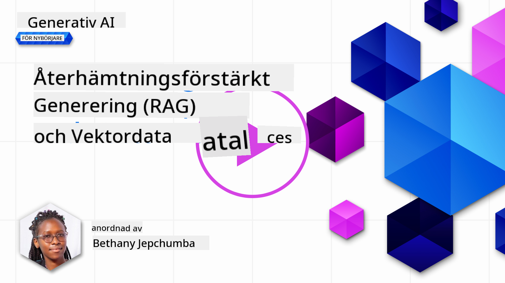
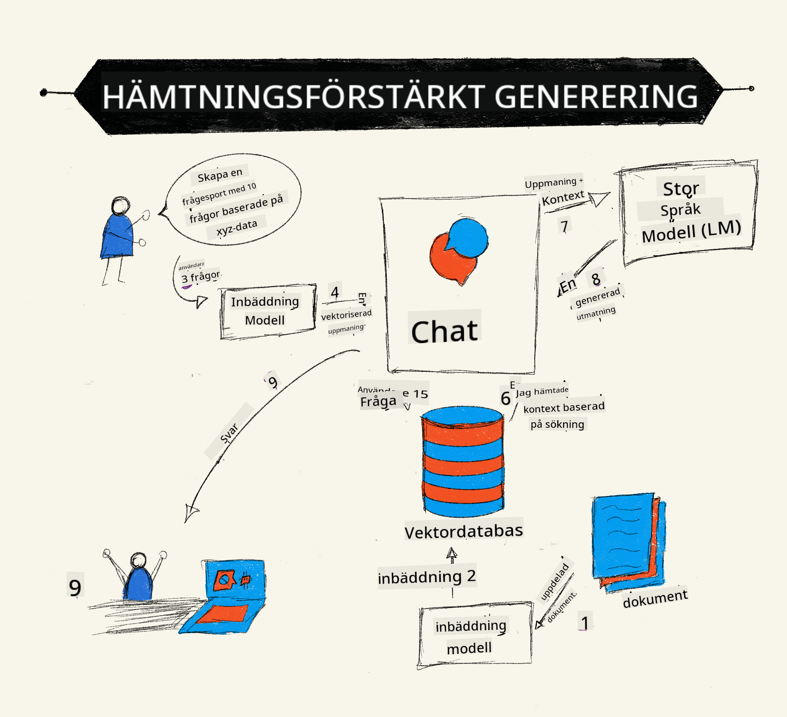
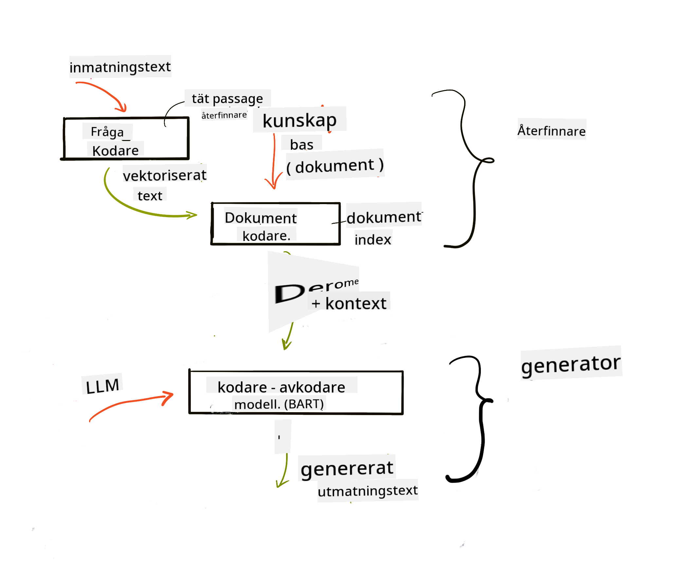
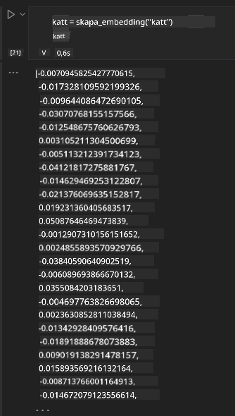

<!--
CO_OP_TRANSLATOR_METADATA:
{
  "original_hash": "e2861bbca91c0567ef32bc77fe054f9e",
  "translation_date": "2025-07-09T16:13:38+00:00",
  "source_file": "15-rag-and-vector-databases/README.md",
  "language_code": "sv"
}
-->
# Retrieval Augmented Generation (RAG) och vektordatabaser

[](https://aka.ms/gen-ai-lesson15-gh?WT.mc_id=academic-105485-koreyst)

I lektionen om sökapplikationer lärde vi oss kort hur man integrerar egna data i Large Language Models (LLMs). I den här lektionen går vi djupare in på konceptet att förankra dina data i din LLM-applikation, hur processen fungerar och metoder för att lagra data, inklusive både embeddings och text.

> **Video kommer snart**

## Introduktion

I den här lektionen kommer vi att gå igenom följande:

- En introduktion till RAG, vad det är och varför det används inom AI (artificiell intelligens).

- Förstå vad vektordatabaser är och hur man skapar en för vår applikation.

- Ett praktiskt exempel på hur man integrerar RAG i en applikation.

## Lärandemål

Efter att ha genomfört denna lektion kommer du att kunna:

- Förklara betydelsen av RAG vid datahämtning och bearbetning.

- Sätta upp en RAG-applikation och förankra dina data i en LLM.

- Effektiv integration av RAG och vektordatabaser i LLM-applikationer.

## Vårt scenario: förbättra våra LLMs med våra egna data

I denna lektion vill vi lägga till våra egna anteckningar i utbildningsstartuppen, vilket gör att chatboten kan få mer information om olika ämnen. Med hjälp av de anteckningar vi har kan eleverna studera bättre och förstå olika ämnen, vilket gör det lättare att repetera inför sina prov. För att skapa vårt scenario kommer vi att använda:

- `Azure OpenAI:` den LLM vi använder för att skapa vår chatbot

- `AI for beginners' lesson on Neural Networks:` detta blir datan vi förankrar vår LLM på

- `Azure AI Search` och `Azure Cosmos DB:` vektordatabas för att lagra våra data och skapa ett sökindex

Användare kommer att kunna skapa övningsquiz från sina anteckningar, repetitionskort och sammanfatta dem till kortfattade översikter. För att komma igång, låt oss titta på vad RAG är och hur det fungerar:

## Retrieval Augmented Generation (RAG)

En LLM-driven chatbot bearbetar användarfrågor för att generera svar. Den är designad för att vara interaktiv och engagerar sig med användare i en mängd olika ämnen. Dock är dess svar begränsade till den kontext som ges och dess grundläggande träningsdata. Till exempel har GPT-4 kunskapsavgränsning i september 2021, vilket innebär att den saknar kunskap om händelser efter detta datum. Dessutom exkluderar data som används för att träna LLMs konfidentiell information som personliga anteckningar eller ett företags produktmanual.

### Hur RAGs (Retrieval Augmented Generation) fungerar



Anta att du vill lansera en chatbot som skapar quiz från dina anteckningar, då behöver du en koppling till kunskapsbasen. Det är här RAG kommer in i bilden. RAGs fungerar på följande sätt:

- **Kunskapsbas:** Innan hämtning måste dessa dokument tas in och förbehandlas, vanligtvis genom att dela upp stora dokument i mindre delar, omvandla dem till text-embedding och lagra dem i en databas.

- **Användarfråga:** användaren ställer en fråga

- **Hämtning:** När en användare ställer en fråga hämtar embedding-modellen relevant information från vår kunskapsbas för att ge mer kontext som inkluderas i prompten.

- **Förstärkt generering:** LLM förbättrar sitt svar baserat på den hämtade datan. Det gör att svaret inte bara baseras på förtränad data utan också på relevant information från den tillagda kontexten. Den hämtade datan används för att förstärka LLM:s svar. LLM returnerar sedan ett svar på användarens fråga.



Arkitekturen för RAGs implementeras med transformers som består av två delar: en encoder och en decoder. Till exempel, när en användare ställer en fråga, "kodas" inmatningstexten till vektorer som fångar ordens betydelse och vektorerna "avkodas" mot vårt dokumentindex och genererar ny text baserat på användarfrågan. LLM använder både en encoder-decoder-modell för att generera output.

Två tillvägagångssätt vid implementering av RAG enligt den föreslagna artikeln: [Retrieval-Augmented Generation for Knowledge intensive NLP (natural language processing software) Tasks](https://arxiv.org/pdf/2005.11401.pdf?WT.mc_id=academic-105485-koreyst) är:

- **_RAG-Sequence_** som använder hämtade dokument för att förutsäga det bästa möjliga svaret på en användarfråga

- **RAG-Token** som använder dokument för att generera nästa token, och sedan hämtar dem för att svara på användarens fråga

### Varför skulle du använda RAGs?

- **Informationsrikedom:** säkerställer att textsvar är uppdaterade och aktuella. Det förbättrar därmed prestanda på domänspecifika uppgifter genom att få tillgång till den interna kunskapsbasen.

- Minskar fabricering genom att använda **verifierbar data** i kunskapsbasen för att ge kontext till användarfrågor.

- Det är **kostnadseffektivt** eftersom det är mer ekonomiskt jämfört med att finjustera en LLM.

## Skapa en kunskapsbas

Vår applikation baseras på våra personliga data, dvs. lektionen om Neural Networks i AI For Beginners-kursen.

### Vektordatabaser

En vektordatabas, till skillnad från traditionella databaser, är en specialiserad databas designad för att lagra, hantera och söka inbäddade vektorer. Den lagrar numeriska representationer av dokument. Att bryta ner data till numeriska embeddings gör det enklare för vårt AI-system att förstå och bearbeta datan.

Vi lagrar våra embeddings i vektordatabaser eftersom LLMs har en gräns för hur många tokens de kan ta emot som input. Eftersom du inte kan skicka hela embeddingarna till en LLM måste vi dela upp dem i delar, och när en användare ställer en fråga returneras de embeddings som mest liknar frågan tillsammans med prompten. Uppdelning minskar också kostnaderna för antalet tokens som skickas genom en LLM.

Några populära vektordatabaser inkluderar Azure Cosmos DB, Clarifyai, Pinecone, Chromadb, ScaNN, Qdrant och DeepLake. Du kan skapa en Azure Cosmos DB-modell med Azure CLI med följande kommando:

```bash
az login
az group create -n <resource-group-name> -l <location>
az cosmosdb create -n <cosmos-db-name> -r <resource-group-name>
az cosmosdb list-keys -n <cosmos-db-name> -g <resource-group-name>
```

### Från text till embeddings

Innan vi lagrar vår data måste vi konvertera den till vektor-embeddings innan den sparas i databasen. Om du arbetar med stora dokument eller långa texter kan du dela upp dem baserat på förväntade frågor. Uppdelning kan göras på meningsnivå eller på styckesnivå. Eftersom uppdelning hämtar mening från orden runt omkring kan du lägga till ytterligare kontext till en del, till exempel genom att lägga till dokumentets titel eller inkludera text före eller efter delen. Du kan dela upp datan enligt följande:

```python
def split_text(text, max_length, min_length):
    words = text.split()
    chunks = []
    current_chunk = []

    for word in words:
        current_chunk.append(word)
        if len(' '.join(current_chunk)) < max_length and len(' '.join(current_chunk)) > min_length:
            chunks.append(' '.join(current_chunk))
            current_chunk = []

    # If the last chunk didn't reach the minimum length, add it anyway
    if current_chunk:
        chunks.append(' '.join(current_chunk))

    return chunks
```

När den är uppdelad kan vi sedan bädda in vår text med olika embedding-modeller. Några modeller du kan använda inkluderar: word2vec, ada-002 från OpenAI, Azure Computer Vision och många fler. Valet av modell beror på vilka språk du använder, vilken typ av innehåll som kodas (text/bilder/ljud), storleken på input den kan koda och längden på embedding-outputen.

Ett exempel på inbäddad text med OpenAI:s `text-embedding-ada-002`-modell är:


## Hämtning och vektorsökning

När en användare ställer en fråga omvandlar retrievern den till en vektor med hjälp av query-encodern, den söker sedan igenom vårt dokument-sökindex efter relevanta vektorer i dokumentet som är relaterade till inputen. När det är klart konverterar den både input-vektorn och dokumentvektorerna till text och skickar det genom LLM.

### Hämtning

Hämtning sker när systemet försöker snabbt hitta dokument från indexet som uppfyller sökkriterierna. Målet med retrievern är att få dokument som kan användas för att ge kontext och förankra LLM på dina data.

Det finns flera sätt att utföra sökningar i vår databas, såsom:

- **Nyckelordssökning** - används för textsökningar

- **Semantisk sökning** - använder ordens semantiska betydelse

- **Vektorsökning** - konverterar dokument från text till vektorrepresentationer med hjälp av embedding-modeller. Hämtning görs genom att fråga efter dokument vars vektorrepresentationer är närmast användarens fråga.

- **Hybrid** - en kombination av både nyckelords- och vektorsökning.

En utmaning med hämtning uppstår när det inte finns något liknande svar på frågan i databasen, systemet returnerar då den bästa informationen det kan hitta, men du kan använda taktiker som att sätta en maximal distans för relevans eller använda hybrid-sökning som kombinerar både nyckelord och vektorsökning. I denna lektion använder vi hybrid-sökning, en kombination av både vektor- och nyckelordssökning. Vi lagrar vår data i en dataframe med kolumner som innehåller både delarna och embeddings.

### Vektorsimilaritet

Retrievern söker igenom kunskapsdatabasen efter embeddings som ligger nära varandra, den närmaste grannen, eftersom de är texter som är lika. I scenariot där en användare ställer en fråga bäddas den först in och matchas sedan med liknande embeddings. Det vanliga måttet som används för att avgöra hur lika olika vektorer är är cosinuslikhet, som baseras på vinkeln mellan två vektorer.

Vi kan mäta likhet med andra alternativ som Euclidean distance, vilket är den raka linjen mellan vektorändpunkter, och dot product som mäter summan av produkterna av motsvarande element i två vektorer.

### Sökindex

När vi gör hämtning behöver vi bygga ett sökindex för vår kunskapsbas innan vi utför sökningen. Ett index lagrar våra embeddings och kan snabbt hämta de mest liknande delarna även i en stor databas. Vi kan skapa vårt index lokalt med:

```python
from sklearn.neighbors import NearestNeighbors

embeddings = flattened_df['embeddings'].to_list()

# Create the search index
nbrs = NearestNeighbors(n_neighbors=5, algorithm='ball_tree').fit(embeddings)

# To query the index, you can use the kneighbors method
distances, indices = nbrs.kneighbors(embeddings)
```

### Omrankning

När du har frågat databasen kan du behöva sortera resultaten från mest relevanta. En omrankande LLM använder maskininlärning för att förbättra relevansen i sökresultaten genom att ordna dem från mest relevanta. Med Azure AI Search görs omrankning automatiskt med en semantisk omrankare. Ett exempel på hur omrankning fungerar med närmaste grannar:

```python
# Find the most similar documents
distances, indices = nbrs.kneighbors([query_vector])

index = []
# Print the most similar documents
for i in range(3):
    index = indices[0][i]
    for index in indices[0]:
        print(flattened_df['chunks'].iloc[index])
        print(flattened_df['path'].iloc[index])
        print(flattened_df['distances'].iloc[index])
    else:
        print(f"Index {index} not found in DataFrame")
```

## Att sätta ihop allt

Det sista steget är att lägga till vår LLM i mixen för att kunna få svar som är förankrade i våra data. Vi kan implementera det så här:

```python
user_input = "what is a perceptron?"

def chatbot(user_input):
    # Convert the question to a query vector
    query_vector = create_embeddings(user_input)

    # Find the most similar documents
    distances, indices = nbrs.kneighbors([query_vector])

    # add documents to query  to provide context
    history = []
    for index in indices[0]:
        history.append(flattened_df['chunks'].iloc[index])

    # combine the history and the user input
    history.append(user_input)

    # create a message object
    messages=[
        {"role": "system", "content": "You are an AI assistant that helps with AI questions."},
        {"role": "user", "content": history[-1]}
    ]

    # use chat completion to generate a response
    response = openai.chat.completions.create(
        model="gpt-4",
        temperature=0.7,
        max_tokens=800,
        messages=messages
    )

    return response.choices[0].message

chatbot(user_input)
```

## Utvärdera vår applikation

### Utvärderingsmått

- Kvalitet på svaren, säkerställa att de låter naturliga, flytande och mänskliga

- Förankring av data: utvärdera om svaret kommer från de tillhandahållna dokumenten

- Relevans: utvärdera om svaret matchar och är relaterat till den ställda frågan

- Flyt - om svaret är grammatiskt korrekt och begripligt

## Användningsområden för RAG (Retrieval Augmented Generation) och vektordatabaser

Det finns många olika användningsområden där funktionsanrop kan förbättra din app, till exempel:

- Frågor och svar: förankra ditt företags data till en chatt som kan användas av anställda för att ställa frågor.

- Rekommendationssystem: där du kan skapa ett system som matchar de mest liknande värdena, t.ex. filmer, restauranger och mycket mer.

- Chattbottjänster: du kan lagra chattloggar och anpassa konversationen baserat på användardata.

- Bildsökning baserat på vektor-embeddings, användbart vid bildigenkänning och avvikelsedetektering.

## Sammanfattning

Vi har gått igenom grundläggande områden för RAG från att lägga till våra data i applikationen, användarfrågan och output. För att förenkla skapandet av RAG kan du använda ramverk som Semantic Kernel, Langchain eller Autogen.

## Uppgift

För att fortsätta din inlärning av Retrieval Augmented Generation (RAG) kan du bygga:

- Skapa ett frontend för applikationen med det ramverk du föredrar

- Använd ett ramverk, antingen LangChain eller Semantic Kernel, och återskapa din applikation.

Grattis till att du har slutfört lektionen 👏.

## Lärandet slutar inte här, fortsätt resan

Efter att ha genomfört denna lektion, kolla in vår [Generative AI Learning collection](https://aka.ms/genai-collection?WT.mc_id=academic-105485-koreyst) för att fortsätta utveckla dina kunskaper inom Generativ AI!

**Ansvarsfriskrivning**:  
Detta dokument har översatts med hjälp av AI-översättningstjänsten [Co-op Translator](https://github.com/Azure/co-op-translator). Även om vi strävar efter noggrannhet, vänligen observera att automatiska översättningar kan innehålla fel eller brister. Det ursprungliga dokumentet på dess modersmål bör betraktas som den auktoritativa källan. För kritisk information rekommenderas professionell mänsklig översättning. Vi ansvarar inte för några missförstånd eller feltolkningar som uppstår vid användning av denna översättning.