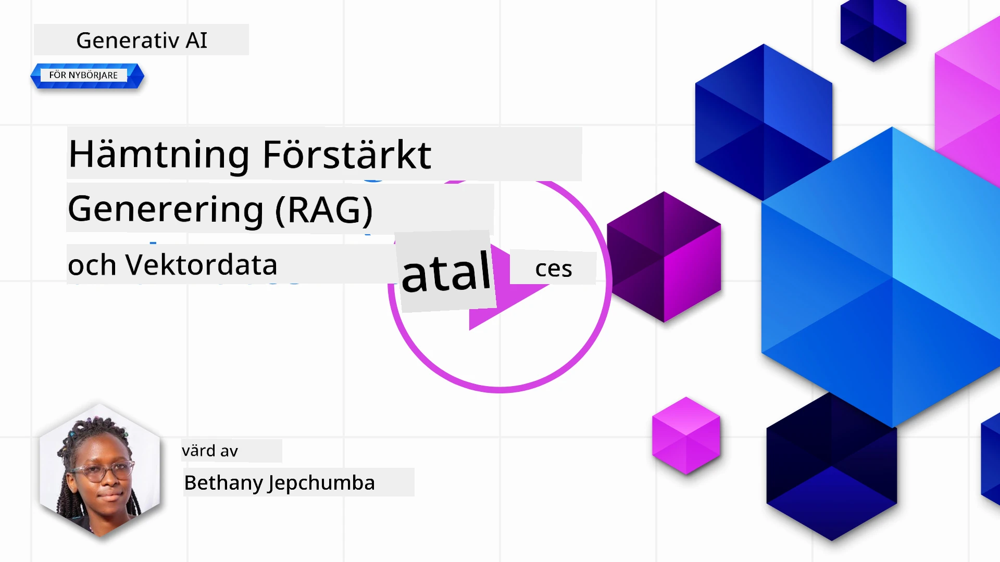
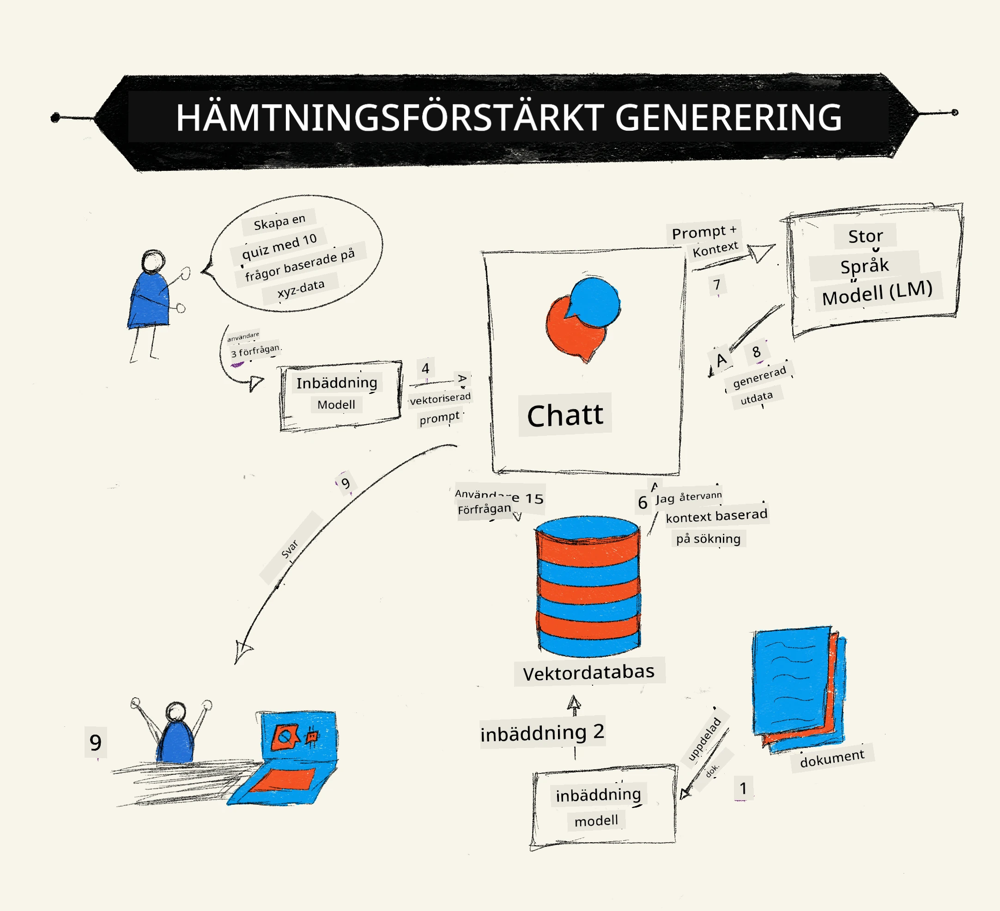
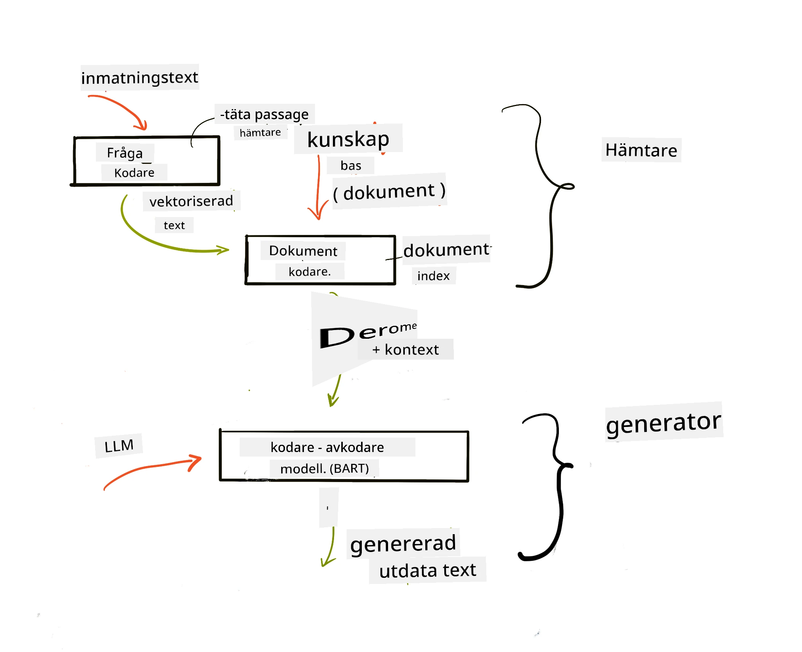
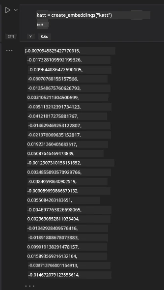

# Retrieval Augmented Generation (RAG) och vektordatabaser

[](https://youtu.be/4l8zhHUBeyI?si=BmvDmL1fnHtgQYkL)

I lektionen om sökapplikationer lärde vi oss kort hur man integrerar egen data i stora språkmodeller (LLM). I denna lektion kommer vi att fördjupa oss i begreppen kring att förankra din data i din LLM-applikation, processen bakom och metoderna för att lagra data, inklusive både inbäddningar och text.

> **Video kommer snart**

## Introduktion

I denna lektion kommer vi att gå igenom följande:

- En introduktion till RAG, vad det är och varför det används inom AI (artificiell intelligens).

- Förståelse för vad vektordatabaser är och hur man skapar en för vår applikation.

- Ett praktiskt exempel på hur man integrerar RAG i en applikation.

## Inlärningsmål

Efter att ha genomfört denna lektion kommer du att kunna:

- Förklara betydelsen av RAG vid datahämtning och -bearbetning.

- Sätta upp en RAG-applikation och förankra din data till en LLM

- Effektiv integration av RAG och vektordatabaser i LLM-applikationer.

## Vårt scenario: förbättra våra LLMs med vår egen data

För denna lektion vill vi lägga till våra egna anteckningar i utbildningsstartupen, vilket gör att chatbotten kan få mer information om olika ämnen. Med hjälp av anteckningarna kan elever studera bättre och förstå olika ämnen, vilket gör det lättare att repetera inför prov. För att skapa vårt scenario kommer vi att använda:

- `Azure OpenAI:` LLM vi kommer använda för att skapa vår chatbot

- `AI for beginners' lesson on Neural Networks`: detta kommer vara datan vi förankrar vår LLM på

- `Azure AI Search` och `Azure Cosmos DB:` vektordatabas för att lagra vår data och skapa ett sökindex

Användare kommer att kunna skapa träningsfrågor från sina anteckningar, repetitionsflashkort och sammanfatta dem till korta översikter. För att komma igång, låt oss titta på vad RAG är och hur det fungerar:

## Retrieval Augmented Generation (RAG)

En LLM-driven chatbot bearbetar användarfrågor för att generera svar. Den är designad för att vara interaktiv och engagera sig med användare inom en mängd olika ämnen. Dock är dess svar begränsade till den kontext som tillhandahålls och dess grundläggande träningsdata. Till exempel är GPT-4:s kunskapsavgränsning i september 2021, vilket innebär att den saknar kunskap om händelser efter denna tidpunkt. Dessutom inkluderar inte den data som används för att träna LLM:er konfidentiell information såsom personliga anteckningar eller företagets produktmanual.

### Hur RAG (Retrieval Augmented Generation) fungerar



Anta att du vill distribuera en chatbot som skapar quiz från dina anteckningar, då behöver du en koppling till kunskapsbasen. Det är här RAG kommer till undsättning. RAG fungerar på följande sätt:

- **Kunskapsbas:** Innan hämtning måste dessa dokument bearbetas och förbehandlas, vanligtvis genom att dela upp stora dokument i mindre delar, omvandla dem till textinbäddningar och lagra dem i en databas.

- **Användarfråga:** användaren ställer en fråga

- **Hämtning:** När en användare ställer en fråga hämtar inbäddningsmodellen relevant information från vår kunskapsbas för att tillhandahålla mer kontext som inkluderas i prompten.

- **Förstärkt generering:** LLM förbättrar sitt svar baserat på den hämtade datan. Det gör att svaret inte bara bygger på förtränad data utan även relevant information från tillagd kontext. Den hämtade datan används för att förstärka LLM:s svar. LLM returnerar sedan ett svar på användarens fråga.



Arkitekturen för RAG implementeras med transformerare bestående av två delar: en kodare och en avkodare. Till exempel när en användare ställer en fråga, "kodas" ingångstexten till vektorer som fångar ordens betydelse, och vektorerna "avkodas" mot vårt dokumentindex och genererar ny text baserat på användarfrågan. LLM använder både en kodar-avkodarmodell för att generera utdata.

Två tillvägagångssätt vid implementering av RAG enligt det föreslagna papperet: [Retrieval-Augmented Generation for Knowledge intensive NLP (natural language processing software) Tasks](https://arxiv.org/pdf/2005.11401.pdf?WT.mc_id=academic-105485-koreyst) är:

- **_RAG-Sequence_** använder hämtade dokument för att förutsäga det bästa möjliga svaret på en användarfråga

- **RAG-Token** använder dokument för att generera nästa token, sedan hämtar de för att svara på användarens fråga

### Varför skulle man använda RAG? 

- **Informationsrikedom:** säkerställer att textsvar är uppdaterade och aktuella. Det förbättrar därför prestanda i domänspecifika uppgifter genom att få tillgång till den interna kunskapsbasen.

- Minskar fabrikation genom att använda **verifierbar data** i kunskapsbasen för att ge kontext till användarfrågor.

- Det är **kostnadseffektivt** eftersom det är billigare jämfört med att finjustera en LLM

## Skapa en kunskapsbas

Vår applikation baseras på vår personliga data dvs. lektionen Neural Network i AI for Beginners-kurserna.

### Vektordatabaser

En vektordatabas är till skillnad från traditionella databaser en specialiserad databas designad för att lagra, hantera och söka inbäddade vektorer. Den lagrar numeriska representationer av dokument. Att bryta ner data till numeriska inbäddningar gör det enklare för vårt AI-system att förstå och bearbeta datan.

Vi lagrar våra inbäddningar i vektordatabaser eftersom LLM har en begränsning i hur många token de kan ta emot som input. Eftersom du inte kan skicka hela inbäddningarna till en LLM måste vi dela upp dem i delar och när en användare ställer en fråga kommer de inbäddningar som mest liknar frågan att returneras tillsammans med prompten. Att dela upp data minskar också kostnaderna för antalet token som passerar genom en LLM.

Några populära vektordatabaser inkluderar Azure Cosmos DB, Clarifyai, Pinecone, Chromadb, ScaNN, Qdrant och DeepLake. Du kan skapa en Azure Cosmos DB-modell med Azure CLI med följande kommando:

```bash
az login
az group create -n <resource-group-name> -l <location>
az cosmosdb create -n <cosmos-db-name> -r <resource-group-name>
az cosmosdb list-keys -n <cosmos-db-name> -g <resource-group-name>
```

### Från text till inbäddningar

Innan vi lagrar vår data måste vi konvertera den till vektorinbäddningar innan den lagras i databasen. Om du arbetar med stora dokument eller långa texter kan du dela upp dem baserat på de frågor du förväntar dig. Uppdelning kan göras på meningsnivå eller på styckesnivå. Eftersom avdelning hämtar betydelser från orden runt dem kan du lägga till annan kontext till en del, till exempel dokumenttiteln eller inkludera text före eller efter delen. Du kan dela upp datan på följande sätt:

```python
def split_text(text, max_length, min_length):
    words = text.split()
    chunks = []
    current_chunk = []

    for word in words:
        current_chunk.append(word)
        if len(' '.join(current_chunk)) < max_length and len(' '.join(current_chunk)) > min_length:
            chunks.append(' '.join(current_chunk))
            current_chunk = []

    # Om den sista biten inte nådde minimilängden, lägg till den ändå
    if current_chunk:
        chunks.append(' '.join(current_chunk))

    return chunks
```

När datan är uppdelad kan vi sedan bädda in vår text med olika inbäddningsmodeller. Några modeller du kan använda inkluderar: word2vec, ada-002 från OpenAI, Azure Computer Vision och många fler. Att välja modell beror på vilka språk du använder, typen av innehåll som kodas (text/bilder/ljud), storleken på indata den kan koda och längden på inbäddningsutgången.

Ett exempel på inbäddad text med OpenAIs `text-embedding-ada-002` modell är:


## Hämtning och vektorsökning

När en användare ställer en fråga konverterar hämtaren den till en vektor med hjälp av fråge-kodaren, sedan söker den igenom vårt dokument-sökindex efter relevanta vektorer i dokumentet som är relaterade till indata. När det är klart konverteras både ingångsvektorn och dokumentvektorerna till text och skickas genom LLM.

### Hämtning

Hämtning sker när systemet försöker snabbt hitta dokument från indexet som uppfyller sökkriterierna. Målet för hämtaren är att få dokument som används för att ge kontext och förankra LLM på din data.

Det finns flera sätt att göra sökningar i vår databas såsom:

- **Nyckelordssökning** - används för textsökningar

- **Vektorsökning** - konverterar dokument från text till vektorrepresentationer med hjälp av inbäddningsmodeller, vilket tillåter en **semantisk sökning** baserad på ordens betydelse. Hämtning görs genom att fråga dokument vars vektorrepresentationer är närmast användarens fråga.

- **Hybrid** - en kombination av både nyckelords- och vektorsökning.

En utmaning med hämtning uppstår när det inte finns något liknande svar på frågan i databasen, systemet returnerar då den bästa information som finns tillgänglig, men du kan använda taktiker som att sätta maxavstånd för relevans eller använda hybrid sökning som kombinerar både nyckelord och vektorsökning. I denna lektion kommer vi att använda hybrid sökning, en kombination av både vektor- och nyckelordssökning. Vi lagrar vår data i en dataframe med kolumner som innehåller bitarna samt inbäddningarna.

### Vektorsimilaritet

Hämtaren söker igenom kunskapsdatabasen efter inbäddningar som ligger nära varandra, den närmaste grannen, eftersom det är texter som är lika. I scenariot där en användare ställer en fråga bäddas den först in och matchas sedan med liknande inbäddningar. Den vanliga mätmetoden som används för att avgöra hur lika olika vektorer är kallas cosinuslikhet som baseras på vinkeln mellan två vektorer.

Vi kan mäta likhet med andra alternativ såsom Euklidiskt avstånd vilket är rak linje mellan vektorändpunkter och skalärprodukt som mäter summan av produkterna av motsvarande element i två vektorer.

### Sökindex

När hämtning görs behöver vi bygga ett sökindex för vår kunskapsbas innan vi utför sökning. Ett index lagrar våra inbäddningar och kan snabbt hämta de mest liknande delarna även i en stor databas. Vi kan skapa vårt index lokalt med:

```python
from sklearn.neighbors import NearestNeighbors

embeddings = flattened_df['embeddings'].to_list()

# Skapa sökindexet
nbrs = NearestNeighbors(n_neighbors=5, algorithm='ball_tree').fit(embeddings)

# För att söka i indexet kan du använda metoden kneighbors
distances, indices = nbrs.kneighbors(embeddings)
```

### Omdömande (Re-ranking)

När du har frågat databasen kan det vara nödvändigt att sortera resultaten från mest relevanta. En omdömande LLM använder maskininlärning för att förbättra relevansen av sökresultaten genom att ordna dem från mest relevanta. Med Azure AI Search görs omdömande automatiskt åt dig med en semantisk omdömare. Ett exempel på hur om­dömning fungerar med närmaste grannar:

```python
# Hitta de mest liknande dokumenten
distances, indices = nbrs.kneighbors([query_vector])

index = []
# Skriv ut de mest liknande dokumenten
for i in range(3):
    index = indices[0][i]
    for index in indices[0]:
        print(flattened_df['chunks'].iloc[index])
        print(flattened_df['path'].iloc[index])
        print(flattened_df['distances'].iloc[index])
    else:
        print(f"Index {index} not found in DataFrame")
```

## Att sammanföra allt

Det sista steget är att lägga till vår LLM i mixen för att kunna få svar som är förankrade i vår data. Vi kan implementera det enligt följande:

```python
user_input = "what is a perceptron?"

def chatbot(user_input):
    # Konvertera frågan till en frågevektor
    query_vector = create_embeddings(user_input)

    # Hitta de mest liknande dokumenten
    distances, indices = nbrs.kneighbors([query_vector])

    # lägg till dokument till frågan för att ge kontext
    history = []
    for index in indices[0]:
        history.append(flattened_df['chunks'].iloc[index])

    # kombinera historiken och användarinmatningen
    history.append(user_input)

    # skapa ett meddelandeobjekt
    messages=[
        {"role": "system", "content": "You are an AI assistant that helps with AI questions."},
        {"role": "user", "content": "\n\n".join(history) }
    ]

    # använd Responses API för att generera ett svar
    response = client.responses.create(
        model="gpt-5-mini",
        max_output_tokens=800,
        input=messages,
        store=False,
    )

    return response.output_text

chatbot(user_input)
```

## Utvärdera vår applikation

### Utvärderingsmått

- Kvaliteten på de svar som ges, att det låter naturligt, flytande och människoliknande

- Förankring i datan: utvärdera om svaret kommer från de angivna dokumenten

- Relevans: utvärdera om svaret stämmer och är relaterat till den ställda frågan

- Flyt - om svaret är grammatiskt korrekt

## Användningsområden för att använda RAG (Retrieval Augmented Generation) och vektordatabaser

Det finns många olika användningsområden där funktionsanrop kan förbättra din app som:

- Frågor och svar: förankra ditt företagsdata i en chatt som anställda kan använda för att ställa frågor.

- Rekommendationssystem: där du kan skapa ett system som matchar mest liknande värden t.ex. filmer, restauranger och mycket mer.

- Chatbottjänster: du kan lagra chatt-historik och personalisera konversationen baserat på användardata.

- Bildsökning baserat på vektorinbäddningar, användbart vid bildigenkänning och avvikelsedetektering.

## Sammanfattning

Vi har gått igenom grundläggande områden i RAG från att lägga till vår data i applikationen, användarfrågan och utdata. För att förenkla skapandet av RAG kan du använda ramverk som Semantic Kernel, Langchain eller Autogen.

## Uppgift

För att fortsätta din inlärning av Retrieval Augmented Generation (RAG) kan du bygga:

- Skapa ett gränssnitt för applikationen med valfritt ramverk

- Använd ett ramverk, antingen LangChain eller Semantic Kernel, och återskapa din applikation.

Grattis till att ha slutfört lektionen 👏.

## Lärandet slutar inte här, fortsätt resan

Efter att ha slutfört denna lektion, kolla in vår [Generative AI Learning collection](https://aka.ms/genai-collection?WT.mc_id=academic-105485-koreyst) för att fortsätta öka din kunskap inom Generativ AI!

---

<!-- CO-OP TRANSLATOR DISCLAIMER START -->
**Ansvarsfriskrivning**:
Detta dokument har översatts med hjälp av AI-översättningstjänsten [Co-op Translator](https://github.com/Azure/co-op-translator). Även om vi strävar efter noggrannhet, var vänlig notera att automatiska översättningar kan innehålla fel eller brister. Det ursprungliga dokumentet på dess modersmål bör betraktas som den auktoritativa källan. För kritisk information rekommenderas professionell mänsklig översättning. Vi ansvarar inte för några missförstånd eller feltolkningar som uppstår till följd av användningen av denna översättning.
<!-- CO-OP TRANSLATOR DISCLAIMER END -->