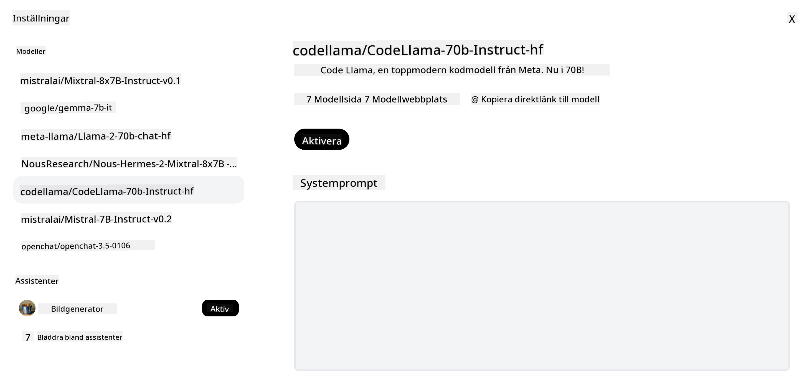
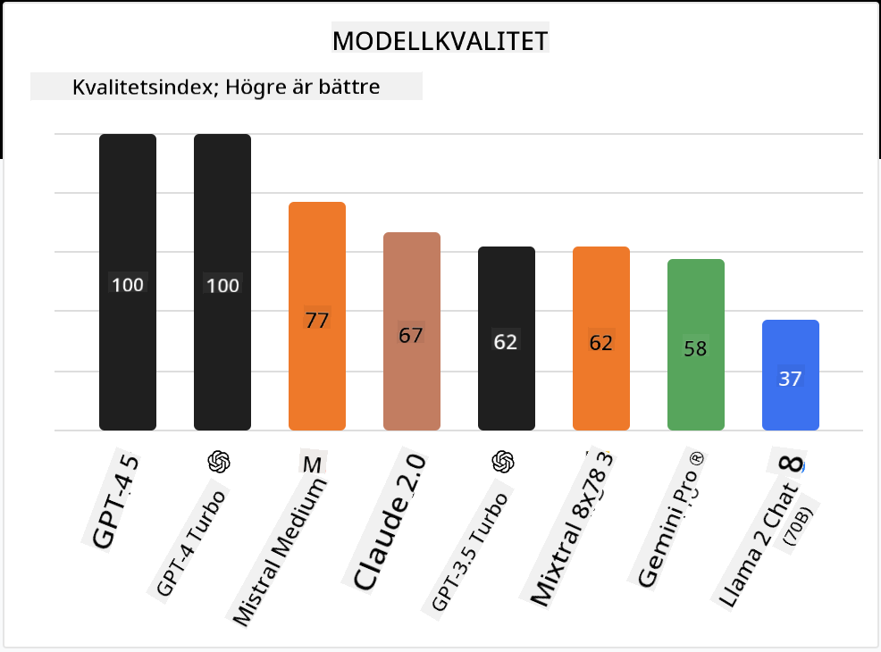

<!--
CO_OP_TRANSLATOR_METADATA:
{
  "original_hash": "0bba96e53ab841d99db731892a51fab8",
  "translation_date": "2025-07-09T17:10:34+00:00",
  "source_file": "16-open-source-models/README.md",
  "language_code": "sv"
}
-->

## Introduktion

Världen av open source LLM:er är spännande och ständigt under utveckling. Den här lektionen syftar till att ge en djupgående inblick i open source-modeller. Om du söker information om hur proprietära modeller jämförs med open source-modeller, gå till lektionen ["Exploring and Comparing Different LLMs"](../02-exploring-and-comparing-different-llms/README.md?WT.mc_id=academic-105485-koreyst). Den här lektionen kommer också att ta upp ämnet finjustering, men en mer detaljerad förklaring finns i lektionen ["Fine-Tuning LLMs"](../18-fine-tuning/README.md?WT.mc_id=academic-105485-koreyst).

## Lärandemål

- Få en förståelse för open source-modeller  
- Förstå fördelarna med att arbeta med open source-modeller  
- Utforska de öppna modeller som finns tillgängliga på Hugging Face och Azure AI Studio  

## Vad är Open Source-modeller?

Open source-programvara har spelat en avgörande roll för teknikens utveckling inom många områden. Open Source Initiative (OSI) har definierat [10 kriterier för programvara](https://web.archive.org/web/20241126001143/https://opensource.org/osd?WT.mc_id=academic-105485-koreyst) för att klassificeras som open source. Källkoden måste delas öppet under en licens godkänd av OSI.

Även om utvecklingen av LLM:er har liknande inslag som mjukvaruutveckling, är processen inte exakt densamma. Detta har lett till mycket diskussion inom communityn om vad open source innebär i LLM-sammanhang. För att en modell ska stämma överens med den traditionella definitionen av open source bör följande information vara offentligt tillgänglig:

- Dataset som använts för att träna modellen.  
- Fullständiga modellvikter som en del av träningen.  
- Utvärderingskoden.  
- Koden för finjustering.  
- Fullständiga modellvikter och träningsmetrik.  

Det finns för närvarande bara några få modeller som uppfyller dessa kriterier. [OLMo-modellen skapad av Allen Institute for Artificial Intelligence (AllenAI)](https://huggingface.co/allenai/OLMo-7B?WT.mc_id=academic-105485-koreyst) är ett exempel som passar in i denna kategori.

I den här lektionen kommer vi framöver att kalla modellerna för "öppna modeller" eftersom de kanske inte uppfyller ovanstående kriterier vid tidpunkten för skrivandet.

## Fördelar med öppna modeller

**Mycket anpassningsbara** – Eftersom öppna modeller släpps med detaljerad träningsinformation kan forskare och utvecklare modifiera modellens interna delar. Detta möjliggör skapandet av mycket specialiserade modeller som är finjusterade för en specifik uppgift eller studieområde. Några exempel är kodgenerering, matematiska operationer och biologi.

**Kostnad** – Kostnaden per token för att använda och distribuera dessa modeller är lägre än för proprietära modeller. När du bygger Generative AI-applikationer bör du jämföra prestanda mot pris för dessa modeller i ditt användningsfall.

  
Källa: Artificial Analysis

**Flexibilitet** – Att arbeta med öppna modeller ger dig flexibilitet att använda olika modeller eller kombinera dem. Ett exempel är [HuggingChat Assistants](https://huggingface.co/chat?WT.mc_id=academic-105485-koreyst) där användaren kan välja vilken modell som ska användas direkt i användargränssnittet:

## Utforska olika öppna modeller

### Llama 2

[LLama2](https://huggingface.co/meta-llama?WT.mc_id=academic-105485-koreyst), utvecklad av Meta, är en öppen modell som är optimerad för chattbaserade applikationer. Detta beror på dess finjusteringsmetod, som inkluderade en stor mängd dialog och mänsklig feedback. Med denna metod producerar modellen resultat som bättre överensstämmer med mänskliga förväntningar, vilket ger en bättre användarupplevelse.

Några exempel på finjusterade versioner av Llama är [Japanese Llama](https://huggingface.co/elyza/ELYZA-japanese-Llama-2-7b?WT.mc_id=academic-105485-koreyst), som är specialiserad på japanska, och [Llama Pro](https://huggingface.co/TencentARC/LLaMA-Pro-8B?WT.mc_id=academic-105485-koreyst), som är en förbättrad version av basmodellen.

### Mistral

[Mistral](https://huggingface.co/mistralai?WT.mc_id=academic-105485-koreyst) är en öppen modell med starkt fokus på hög prestanda och effektivitet. Den använder Mixture-of-Experts-metoden som kombinerar en grupp specialiserade expertmodeller till ett system där vissa modeller väljs beroende på input. Detta gör beräkningarna mer effektiva eftersom modellerna bara hanterar de indata de är specialiserade på.

Några exempel på finjusterade versioner av Mistral är [BioMistral](https://huggingface.co/BioMistral/BioMistral-7B?text=Mon+nom+est+Thomas+et+mon+principal?WT.mc_id=academic-105485-koreyst), som är inriktad på medicinområdet, och [OpenMath Mistral](https://huggingface.co/nvidia/OpenMath-Mistral-7B-v0.1-hf?WT.mc_id=academic-105485-koreyst), som utför matematiska beräkningar.

### Falcon

[Falcon](https://huggingface.co/tiiuae?WT.mc_id=academic-105485-koreyst) är en LLM skapad av Technology Innovation Institute (**TII**). Falcon-40B tränades på 40 miljarder parametrar och har visat sig prestera bättre än GPT-3 med mindre beräkningsresurser. Detta beror på användningen av FlashAttention-algoritmen och multiquery attention som minskar minneskraven vid inferenstid. Med denna kortare inferenstid är Falcon-40B lämplig för chattapplikationer.

Några exempel på finjusterade versioner av Falcon är [OpenAssistant](https://huggingface.co/OpenAssistant/falcon-40b-sft-top1-560?WT.mc_id=academic-105485-koreyst), en assistent byggd på öppna modeller, och [GPT4ALL](https://huggingface.co/nomic-ai/gpt4all-falcon?WT.mc_id=academic-105485-koreyst), som levererar högre prestanda än basmodellen.

## Hur väljer man?

Det finns inget enkelt svar på hur man väljer en öppen modell. Ett bra ställe att börja är att använda Azure AI Studios filterfunktion för uppgiftstyper. Detta hjälper dig att förstå vilka typer av uppgifter modellen har tränats för. Hugging Face har också en LLM Leaderboard som visar de bäst presterande modellerna baserat på olika mått.

När du vill jämföra LLM:er över olika typer är [Artificial Analysis](https://artificialanalysis.ai/?WT.mc_id=academic-105485-koreyst) en annan utmärkt resurs:

  
Källa: Artificial Analysis

Om du arbetar med ett specifikt användningsfall kan det vara effektivt att söka efter finjusterade versioner som är inriktade på samma område. Att experimentera med flera öppna modeller för att se hur de presterar utifrån dina och dina användares förväntningar är också en bra strategi.

## Nästa steg

Det bästa med öppna modeller är att du kan komma igång ganska snabbt. Kolla in [Azure AI Studio Model Catalog](https://ai.azure.com?WT.mc_id=academic-105485-koreyst), som innehåller en specifik Hugging Face-samling med de modeller vi diskuterat här.

## Lärandet slutar inte här, fortsätt resan

Efter att ha genomfört denna lektion, ta en titt på vår [Generative AI Learning collection](https://aka.ms/genai-collection?WT.mc_id=academic-105485-koreyst) för att fortsätta utveckla dina kunskaper inom Generative AI!

**Ansvarsfriskrivning**:  
Detta dokument har översatts med hjälp av AI-översättningstjänsten [Co-op Translator](https://github.com/Azure/co-op-translator). Även om vi strävar efter noggrannhet, vänligen observera att automatiska översättningar kan innehålla fel eller brister. Det ursprungliga dokumentet på dess modersmål bör betraktas som den auktoritativa källan. För kritisk information rekommenderas professionell mänsklig översättning. Vi ansvarar inte för några missförstånd eller feltolkningar som uppstår vid användning av denna översättning.