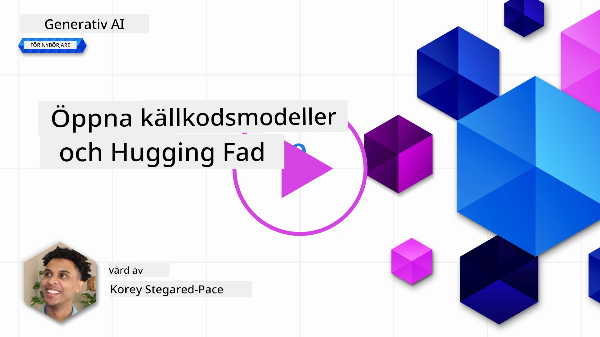
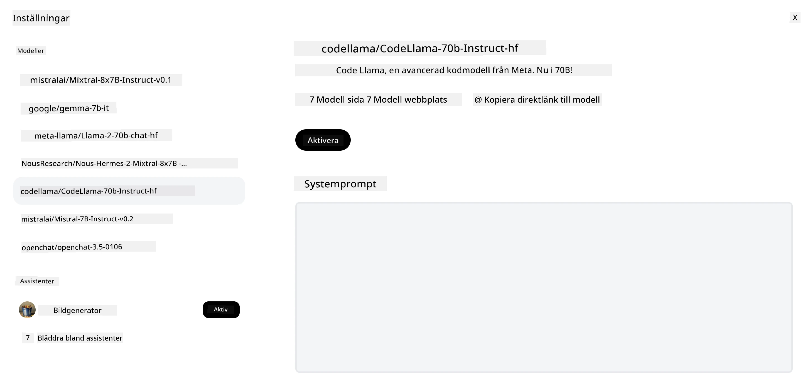
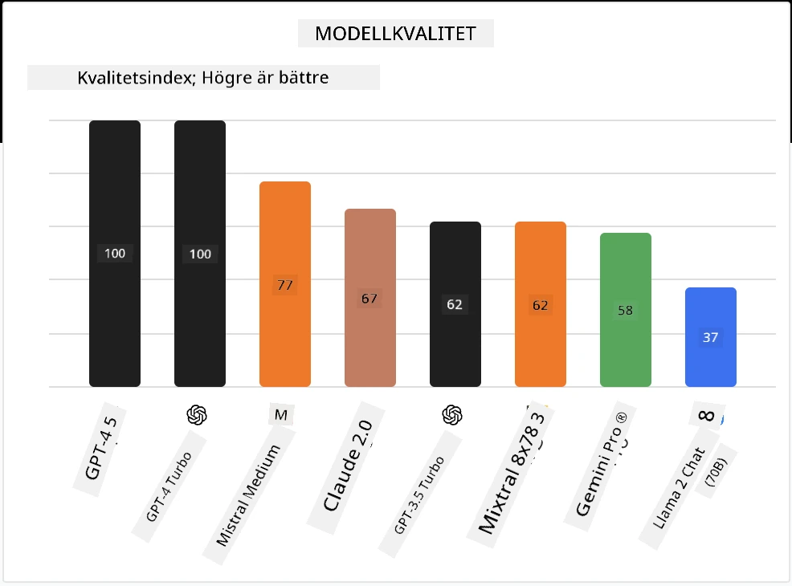

## Introduktion

Världen av open source LLM:er är spännande och ständigt utvecklande. Denna lektion syftar till att ge en djupgående inblick i open source-modeller. Om du letar efter information om hur proprietära modeller jämförs med open source-modeller, gå till ["Utforska och jämföra olika LLM:er"-lektionen](../02-exploring-and-comparing-different-llms/README.md?WT.mc_id=academic-105485-koreyst). Denna lektion kommer också att täcka ämnet finjustering, men en mer detaljerad förklaring finns i ["Finjustering av LLM:er"-lektionen](../18-fine-tuning/README.md?WT.mc_id=academic-105485-koreyst).

## Lärandemål

- Få en förståelse för open source-modeller
- Förstå fördelarna med att arbeta med open source-modeller
- Utforska de öppna modeller som finns tillgängliga på Hugging Face och Azure AI Studio

## Vad är Open Source-modeller?

Open source-programvara har spelat en avgörande roll i teknikens tillväxt inom olika områden. Open Source Initiative (OSI) har definierat [10 kriterier för programvara](https://web.archive.org/web/20241126001143/https://opensource.org/osd?WT.mc_id=academic-105485-koreyst) för att klassificeras som open source. Källkoden måste delas öppet under en licens godkänd av OSI.

Även om utvecklingen av LLM:er har liknande element som utveckling av programvara, är processen inte exakt densamma. Detta har lett till mycket diskussion i communityn om definitionen av open source i kontexten av LLM:er. För att en modell ska stämma överens med den traditionella definitionen av open source bör följande information vara offentligt tillgänglig:

- Dataset som användes för att träna modellen.
- Fullständiga modellvikter som en del av träningen.
- Utvärderingskoden.
- Finjusteringskoden.
- Fullständiga modellvikter och träningsmetrik.

Det finns för närvarande bara några få modeller som uppfyller dessa kriterier. [OLMo-modellen skapad av Allen Institute for Artificial Intelligence (AllenAI)](https://huggingface.co/allenai/OLMo-7B?WT.mc_id=academic-105485-koreyst) är en som passar in i denna kategori.

För denna lektion kommer vi framöver att referera till modellerna som "öppna modeller" eftersom de kanske inte uppfyller ovanstående kriterier vid tidpunkten för skrivandet.

## Fördelar med öppna modeller

**Mycket anpassningsbara** – Eftersom öppna modeller släpps med detaljerad träningsinformation kan forskare och utvecklare modifiera modellens interna delar. Detta möjliggör skapandet av mycket specialiserade modeller som är finjusterade för en specifik uppgift eller studieområde. Några exempel på detta är kodgenerering, matematiska operationer och biologi.

**Kostnad** – Kostnaden per token för att använda och distribuera dessa modeller är lägre än för proprietära modeller. När man bygger Generative AI-applikationer bör man titta på prestanda kontra pris när man arbetar med dessa modeller för sitt användningsfall.

Källa: Artificial Analysis

**Flexibilitet** – Att arbeta med öppna modeller gör det möjligt att vara flexibel när det gäller att använda olika modeller eller kombinera dem. Ett exempel på detta är [HuggingChat Assistants](https://huggingface.co/chat?WT.mc_id=academic-105485-koreyst) där en användare kan välja vilken modell som används direkt i användargränssnittet:

## Utforska olika öppna modeller

### Llama 2

[LLama2](https://huggingface.co/meta-llama?WT.mc_id=academic-105485-koreyst), utvecklad av Meta, är en öppen modell som är optimerad för chattbaserade applikationer. Detta beror på dess finjusteringsmetod, som inkluderade en stor mängd dialog och mänsklig feedback. Med denna metod producerar modellen fler resultat som är anpassade till mänskliga förväntningar, vilket ger en bättre användarupplevelse.

Några exempel på finjusterade versioner av Llama inkluderar [Japanese Llama](https://huggingface.co/elyza/ELYZA-japanese-Llama-2-7b?WT.mc_id=academic-105485-koreyst), som specialiserar sig på japanska, och [Llama Pro](https://huggingface.co/TencentARC/LLaMA-Pro-8B?WT.mc_id=academic-105485-koreyst), som är en förbättrad version av basmodellen.

### Mistral

[Mistral](https://huggingface.co/mistralai?WT.mc_id=academic-105485-koreyst) är en öppen modell med starkt fokus på hög prestanda och effektivitet. Den använder Mixture-of-Experts-metoden som kombinerar en grupp specialiserade expertmodeller till ett system där vissa modeller väljs beroende på input. Detta gör beräkningen mer effektiv eftersom modellerna endast hanterar de inputs de är specialiserade på.

Några exempel på finjusterade versioner av Mistral inkluderar [BioMistral](https://huggingface.co/BioMistral/BioMistral-7B?text=Mon+nom+est+Thomas+et+mon+principal?WT.mc_id=academic-105485-koreyst), som är fokuserad på medicinområdet, och [OpenMath Mistral](https://huggingface.co/nvidia/OpenMath-Mistral-7B-v0.1-hf?WT.mc_id=academic-105485-koreyst), som utför matematiska beräkningar.

### Falcon

[Falcon](https://huggingface.co/tiiuae?WT.mc_id=academic-105485-koreyst) är en LLM skapad av Technology Innovation Institute (**TII**). Falcon-40B tränades på 40 miljarder parametrar och har visat sig prestera bättre än GPT-3 med mindre beräkningsbudget. Detta beror på dess användning av FlashAttention-algoritmen och multiquery attention som gör att minneskraven vid inferenstid minskas. Med denna reducerade inferenstid är Falcon-40B lämplig för chattapplikationer.

Några exempel på finjusterade versioner av Falcon är [OpenAssistant](https://huggingface.co/OpenAssistant/falcon-40b-sft-top1-560?WT.mc_id=academic-105485-koreyst), en assistent byggd på öppna modeller, och [GPT4ALL](https://huggingface.co/nomic-ai/gpt4all-falcon?WT.mc_id=academic-105485-koreyst), som levererar högre prestanda än basmodellen.

## Hur man väljer

Det finns inget enkelt svar på hur man väljer en öppen modell. En bra start är att använda Azure AI Studios filterfunktion för uppgift. Detta hjälper dig att förstå vilka typer av uppgifter modellen har tränats för. Hugging Face underhåller också en LLM Leaderboard som visar de bäst presterande modellerna baserat på vissa mått.

När du vill jämföra LLM:er över olika typer är [Artificial Analysis](https://artificialanalysis.ai/?WT.mc_id=academic-105485-koreyst) en annan utmärkt resurs:

Källa: Artificial Analysis

Om du arbetar med ett specifikt användningsfall kan det vara effektivt att söka efter finjusterade versioner som är fokuserade på samma område. Att experimentera med flera öppna modeller för att se hur de presterar enligt dina och dina användares förväntningar är också en bra metod.

## Nästa steg

Det bästa med öppna modeller är att du kan börja arbeta med dem ganska snabbt. Kolla in [Azure AI Foundry Model Catalog](https://ai.azure.com?WT.mc_id=academic-105485-koreyst), som innehåller en specifik Hugging Face-samling med de modeller vi diskuterat här.

## Lärandet slutar inte här, fortsätt resan

Efter att ha slutfört denna lektion, kolla in vår [Generative AI Learning collection](https://aka.ms/genai-collection?WT.mc_id=academic-105485-koreyst) för att fortsätta utveckla din kunskap inom Generative AI!

---

<!-- CO-OP TRANSLATOR DISCLAIMER START -->
**Ansvarsfriskrivning**:
Detta dokument har översatts med hjälp av AI-översättningstjänsten [Co-op Translator](https://github.com/Azure/co-op-translator). Även om vi strävar efter noggrannhet, vänligen observera att automatiska översättningar kan innehålla fel eller brister. Det ursprungliga dokumentet på dess modersmål bör betraktas som den auktoritativa källan. För kritisk information rekommenderas professionell mänsklig översättning. Vi ansvarar inte för några missförstånd eller feltolkningar som uppstår vid användning av denna översättning.
<!-- CO-OP TRANSLATOR DISCLAIMER END -->