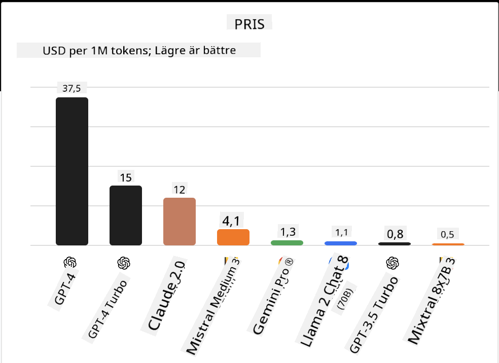

<!--
CO_OP_TRANSLATOR_METADATA:
{
  "original_hash": "0bba96e53ab841d99db731892a51fab8",
  "translation_date": "2025-05-20T06:56:52+00:00",
  "source_file": "16-open-source-models/README.md",
  "language_code": "sv"
}
-->

## Introduktion

Världen av open source-LLM:er är spännande och ständigt i utveckling. Denna lektion syftar till att ge en djupgående titt på open source-modeller. Om du letar efter information om hur proprietära modeller jämförs med open source-modeller, gå till lektionen ["Utforska och jämföra olika LLM:er"](../02-exploring-and-comparing-different-llms/README.md?WT.mc_id=academic-105485-koreyst). Denna lektion kommer också att täcka ämnet finjustering, men en mer detaljerad förklaring finns i lektionen ["Finjustera LLM:er"](../18-fine-tuning/README.md?WT.mc_id=academic-105485-koreyst).

## Lärandemål

- Få en förståelse för open source-modeller
- Förstå fördelarna med att arbeta med open source-modeller
- Utforska de öppna modellerna som finns tillgängliga på Hugging Face och Azure AI Studio

## Vad är Open Source-modeller?

Open source-programvara har spelat en avgörande roll i teknikens tillväxt över olika områden. Open Source Initiative (OSI) har definierat [10 kriterier för programvara](https://web.archive.org/web/20241126001143/https://opensource.org/osd?WT.mc_id=academic-105485-koreyst) för att klassificeras som open source. Källkoden måste delas öppet under en licens godkänd av OSI.

Även om utvecklingen av LLM:er har liknande inslag som att utveckla programvara, är processen inte exakt densamma. Detta har lett till mycket diskussion i gemenskapen om definitionen av open source i sammanhanget av LLM:er. För att en modell ska stämma överens med den traditionella definitionen av open source bör följande information vara offentligt tillgänglig:

- Dataset som användes för att träna modellen.
- Fullständiga modellvikter som en del av träningen.
- Utvärderingskoden.
- Finjusteringskoden.
- Fullständiga modellvikter och träningsmetrik.

Det finns för närvarande endast ett fåtal modeller som matchar dessa kriterier. [OLMo-modellen skapad av Allen Institute for Artificial Intelligence (AllenAI)](https://huggingface.co/allenai/OLMo-7B?WT.mc_id=academic-105485-koreyst) är en som passar in i denna kategori.

För denna lektion kommer vi att hänvisa till modellerna som "öppna modeller" framöver eftersom de kanske inte matchar kriterierna ovan vid tidpunkten för skrivandet.

## Fördelar med öppna modeller

**Hög anpassningsbarhet** - Eftersom öppna modeller släpps med detaljerad träningsinformation kan forskare och utvecklare ändra modellens inre. Detta möjliggör skapandet av högspecialiserade modeller som är finjusterade för en specifik uppgift eller studieområde. Några exempel på detta är kodgenerering, matematiska operationer och biologi.

**Kostnad** - Kostnaden per token för att använda och distribuera dessa modeller är lägre än för proprietära modeller. När du bygger Generative AI-applikationer bör du titta på prestanda kontra pris när du arbetar med dessa modeller för ditt användningsfall.

  
Källa: Artificial Analysis

**Flexibilitet** - Att arbeta med öppna modeller gör det möjligt för dig att vara flexibel när det gäller att använda olika modeller eller kombinera dem. Ett exempel på detta är [HuggingChat Assistants](https://huggingface.co/chat?WT.mc_id=academic-105485-koreyst) där en användare kan välja vilken modell som används direkt i användargränssnittet:

## Utforska olika öppna modeller

### Llama 2

[LLama2](https://huggingface.co/meta-llama?WT.mc_id=academic-105485-koreyst), utvecklad av Meta, är en öppen modell som är optimerad för chattbaserade applikationer. Detta beror på dess finjusteringsmetod, som inkluderade en stor mängd dialog och mänsklig feedback. Med denna metod producerar modellen fler resultat som är i linje med mänskliga förväntningar vilket ger en bättre användarupplevelse.

Några exempel på finjusterade versioner av Llama inkluderar [Japanese Llama](https://huggingface.co/elyza/ELYZA-japanese-Llama-2-7b?WT.mc_id=academic-105485-koreyst), som specialiserar sig på japanska och [Llama Pro](https://huggingface.co/TencentARC/LLaMA-Pro-8B?WT.mc_id=academic-105485-koreyst), som är en förbättrad version av basmodellen.

### Mistral

[Mistral](https://huggingface.co/mistralai?WT.mc_id=academic-105485-koreyst) är en öppen modell med starkt fokus på hög prestanda och effektivitet. Den använder Mixture-of-Experts-metoden som kombinerar en grupp av specialiserade expertmodeller till ett system där beroende på indata, vissa modeller väljs att användas. Detta gör beräkningen mer effektiv eftersom modeller endast adresserar de indata de är specialiserade på.

Några exempel på finjusterade versioner av Mistral inkluderar [BioMistral](https://huggingface.co/BioMistral/BioMistral-7B?text=Mon+nom+est+Thomas+et+mon+principal?WT.mc_id=academic-105485-koreyst), som är fokuserad på det medicinska området och [OpenMath Mistral](https://huggingface.co/nvidia/OpenMath-Mistral-7B-v0.1-hf?WT.mc_id=academic-105485-koreyst), som utför matematiska beräkningar.

### Falcon

[Falcon](https://huggingface.co/tiiuae?WT.mc_id=academic-105485-koreyst) är en LLM skapad av Technology Innovation Institute (**TII**). Falcon-40B tränades på 40 miljarder parametrar vilket har visat sig prestera bättre än GPT-3 med mindre beräkningsbudget. Detta beror på dess användning av FlashAttention-algoritmen och multiquery-uppmärksamhet som gör det möjligt att minska minneskraven vid inferenstid. Med denna reducerade inferenstid är Falcon-40B lämplig för chattapplikationer.

Några exempel på finjusterade versioner av Falcon är [OpenAssistant](https://huggingface.co/OpenAssistant/falcon-40b-sft-top1-560?WT.mc_id=academic-105485-koreyst), en assistent byggd på öppna modeller och [GPT4ALL](https://huggingface.co/nomic-ai/gpt4all-falcon?WT.mc_id=academic-105485-koreyst), som levererar högre prestanda än basmodellen.

## Hur man väljer

Det finns inget entydigt svar för att välja en öppen modell. En bra startpunkt är att använda Azure AI Studio's filter efter uppgift-funktion. Detta hjälper dig att förstå vilka typer av uppgifter modellen har tränats för. Hugging Face underhåller också en LLM Leaderboard som visar dig de bäst presterande modellerna baserat på vissa mätvärden.

När du vill jämföra LLM:er över olika typer, är [Artificial Analysis](https://artificialanalysis.ai/?WT.mc_id=academic-105485-koreyst) en annan bra resurs:

  
Källa: Artificial Analysis

Om du arbetar med ett specifikt användningsfall kan det vara effektivt att söka efter finjusterade versioner som är fokuserade på samma område. Att experimentera med flera öppna modeller för att se hur de presterar enligt dina och dina användares förväntningar är en annan bra praxis.

## Nästa steg

Det bästa med öppna modeller är att du kan börja arbeta med dem ganska snabbt. Kolla in [Azure AI Studio Model Catalog](https://ai.azure.com?WT.mc_id=academic-105485-koreyst), som har en specifik Hugging Face-samling med de modeller vi diskuterade här.

## Lärandet slutar inte här, fortsätt resan

Efter att ha slutfört denna lektion, kolla in vår [Generative AI Learning collection](https://aka.ms/genai-collection?WT.mc_id=academic-105485-koreyst) för att fortsätta utveckla din kunskap om Generative AI!

**Ansvarsfriskrivning**:  
Detta dokument har översatts med hjälp av AI-översättningstjänsten [Co-op Translator](https://github.com/Azure/co-op-translator). Även om vi strävar efter noggrannhet, var medveten om att automatiska översättningar kan innehålla fel eller felaktigheter. Det ursprungliga dokumentet på sitt ursprungliga språk bör betraktas som den auktoritativa källan. För kritisk information rekommenderas professionell mänsklig översättning. Vi ansvarar inte för eventuella missförstånd eller feltolkningar som uppstår vid användning av denna översättning.