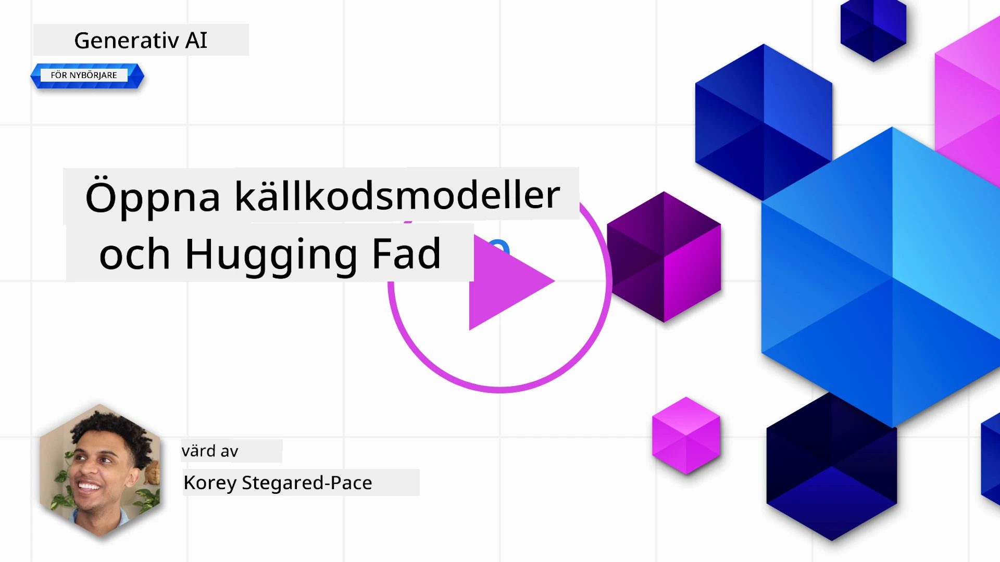
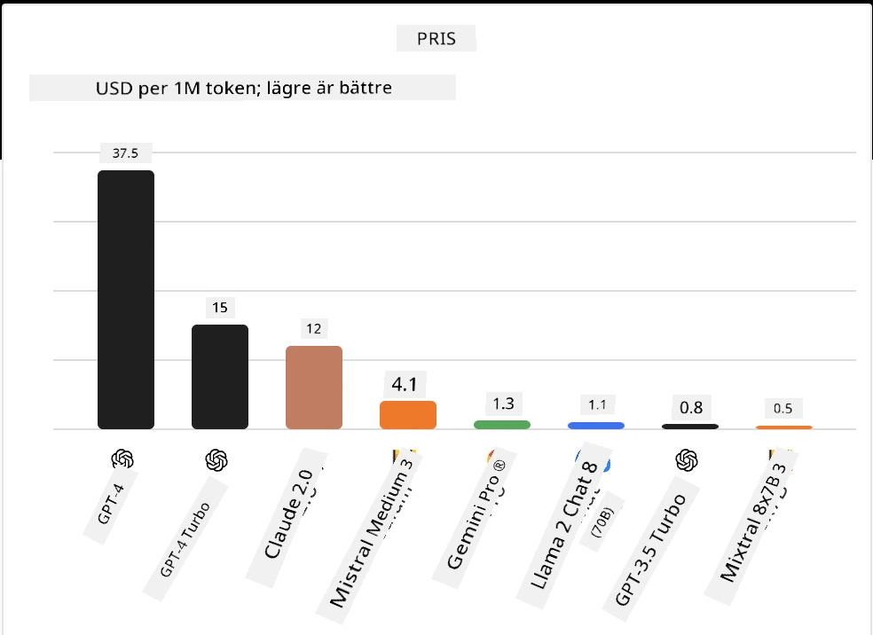
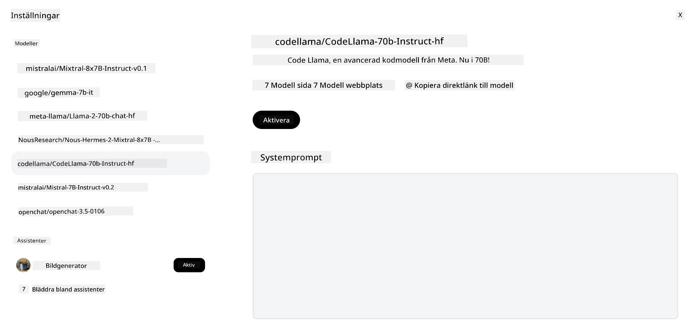
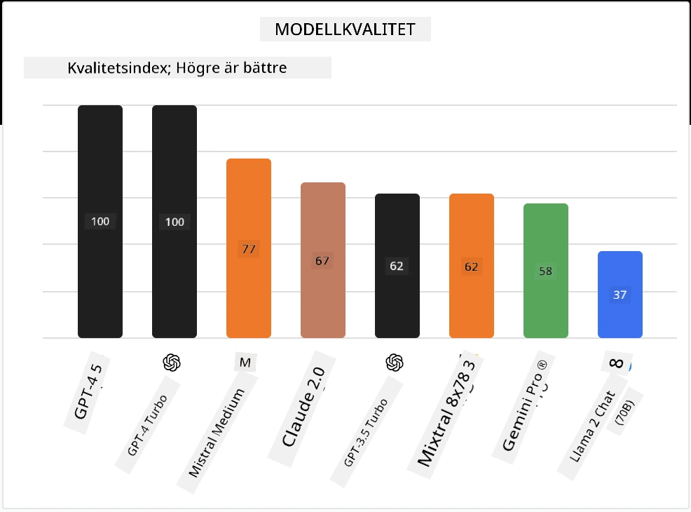

## Introduktion

Världen av öppna LLM:er är spännande och ständigt föränderlig. Den här lektionen syftar till att ge en djupgående inblick i öppna modeller. Om du söker information om hur proprietära modeller jämförs med öppna modeller, gå till ["Exploring and Comparing Different LLMs"-lektionen](../02-exploring-and-comparing-different-llms/README.md?WT.mc_id=academic-105485-koreyst). Den här lektionen kommer också att behandla ämnet finjustering, men en mer detaljerad förklaring finns i ["Fine-Tuning LLMs"-lektionen](../18-fine-tuning/README.md?WT.mc_id=academic-105485-koreyst).

## Lärandemål

- Få en förståelse för öppna modeller
- Förstå fördelarna med att arbeta med öppna modeller
- Utforska de öppna modeller som finns tillgängliga på Hugging Face och Microsoft Foundrys modellkatalog

## Vad är öppna modeller?

Öppen källkod har spelat en avgörande roll i teknikens tillväxt inom olika områden. Open Source Initiative (OSI) har definierat [10 kriterier för mjukvara](https://web.archive.org/web/20241126001143/https://opensource.org/osd?WT.mc_id=academic-105485-koreyst) för att klassas som öppen källkod. Källkoden måste vara öppet delad under en licens godkänd av OSI.

Medan utvecklingen av LLM:er har liknande inslag som mjukvaruutveckling är processen inte exakt densamma. Detta har gett upphov till mycket diskussion i gemenskapen om definitionen av öppen källkod i LLM-sammanhang. För att en modell ska stämma överens med den traditionella definitionen av öppen källkod bör följande information vara offentligt tillgänglig:

- Dataset som använts för att träna modellen.
- Fullständiga modellvikter som en del av träningen.
- Utvärderingskoden.
- Finjusteringskoden.
- Fullständiga modellvikter och träningsmått.

Det finns för närvarande bara några få modeller som matchar detta kriterium. [OLMo-modellen skapad av Allen Institute for Artificial Intelligence (AllenAI)](https://huggingface.co/allenai/OLMo-7B?WT.mc_id=academic-105485-koreyst) är en som passar in i denna kategori.

För den här lektionen kommer vi framöver att kalla modellerna för "öppna modeller" eftersom de kanske inte uppfyller kriterierna ovan vid skrivande stund.

## Fördelar med öppna modeller

**Mycket anpassningsbara** - Eftersom öppna modeller släpps med detaljerad träningsinformation kan forskare och utvecklare modifiera modellens inre. Detta möjliggör skapandet av mycket specialiserade modeller som är finjusterade för en specifik uppgift eller studieområde. Några exempel på detta är kodgenerering, matematiska operationer och biologi.

**Kostnad** - Kostnaden per token för att använda och distribuera dessa modeller är lägre än för proprietära modeller. När man bygger generativa AI-applikationer bör man överväga prestanda i förhållande till pris när man arbetar med dessa modeller för ditt användningsområde.

Källa: Artificial Analysis

**Flexibilitet** - Att arbeta med öppna modeller gör att du kan vara flexibel vad gäller att använda olika modeller eller kombinera dem. Ett exempel på detta är [HuggingChat Assistants](https://huggingface.co/chat?WT.mc_id=academic-105485-koreyst) där en användare kan välja vilken modell som används direkt i användargränssnittet:

## Utforska olika öppna modeller

### Llama 2

[LLama2](https://huggingface.co/meta-llama?WT.mc_id=academic-105485-koreyst), utvecklad av Meta, är en öppen modell som är optimerad för chattbaserade applikationer. Detta beror på dess finjusteringsmetod, som inkluderade en stor mängd dialog och mänsklig återkoppling. Med denna metod ger modellen fler resultat som är anpassade till mänskliga förväntningar, vilket ger en bättre användarupplevelse.

Några exempel på finjusterade versioner av Llama inkluderar [Japanska Llama](https://huggingface.co/elyza/ELYZA-japanese-Llama-2-7b?WT.mc_id=academic-105485-koreyst), som är specialiserad på japanska, och [Llama Pro](https://huggingface.co/TencentARC/LLaMA-Pro-8B?WT.mc_id=academic-105485-koreyst), som är en förbättrad version av grundmodellen.

### Mistral

[Mistral](https://huggingface.co/mistralai?WT.mc_id=academic-105485-koreyst) är en öppen modell med starkt fokus på hög prestanda och effektivitet. Den använder Mixture-of-Experts-metoden, som kombinerar en grupp specialiserade expertmodeller till ett system där vissa modeller väljs beroende på indata. Detta gör beräkningen mer effektiv eftersom modellerna endast bearbetar de indata de är specialiserade på.

Några exempel på finjusterade versioner av Mistral inkluderar [BioMistral](https://huggingface.co/BioMistral/BioMistral-7B?text=Mon+nom+est+Thomas+et+mon+principal?WT.mc_id=academic-105485-koreyst), som är inriktad på medicinområdet, och [OpenMath Mistral](https://huggingface.co/nvidia/OpenMath-Mistral-7B-v0.1-hf?WT.mc_id=academic-105485-koreyst), som utför matematiska beräkningar.

### Falcon

[Falcon](https://huggingface.co/tiiuae?WT.mc_id=academic-105485-koreyst) är ett LLM skapat av Technology Innovation Institute (**TII**). Falcon-40B tränades på 40 miljarder parametrar och har visat sig prestera bättre än GPT-3 med mindre beräkningsresurser. Detta beror på dess användning av FlashAttention-algoritmen och multiquery attention som gör det möjligt att minska minneskraven vid inferenstid. Med denna reducerade inferenstid är Falcon-40B lämplig för chattapplikationer.

Några exempel på finjusterade versioner av Falcon är [OpenAssistant](https://huggingface.co/OpenAssistant/falcon-40b-sft-top1-560?WT.mc_id=academic-105485-koreyst), en assistent byggd på öppna modeller, och [GPT4ALL](https://huggingface.co/nomic-ai/gpt4all-falcon?WT.mc_id=academic-105485-koreyst), som levererar högre prestanda än grundmodellen.

## Hur man väljer

Det finns inget entydigt svar för att välja en öppen modell. En bra början är att använda Microsoft Foundry modellkatalogs filterfunktion baserat på uppgift. Detta hjälper dig att förstå vilka typer av uppgifter modellen har tränats för. Hugging Face underhåller också en LLM Leaderboard som visar de bäst presterande modellerna baserat på vissa mått.

När du vill jämföra LLM:er över olika typer är [Artificial Analysis](https://artificialanalysis.ai/?WT.mc_id=academic-105485-koreyst) en annan bra resurs:

Källa: Artificial Analysis

Om du arbetar med ett specifikt användningsfall kan det vara effektivt att söka efter finjusterade versioner som fokuserar på samma område. Att experimentera med flera öppna modeller för att se hur de presterar enligt dina och dina användares förväntningar är också god praxis.

## Nästa steg

Det bästa med öppna modeller är att du kan komma igång att arbeta med dem ganska snabbt. Kolla in [Microsoft Foundry modellkatalog](https://ai.azure.com?WT.mc_id=academic-105485-koreyst), som har en specifik Hugging Face-samling med de modeller vi diskuterat här.

## Lärandet slutar inte här, fortsätt resan

Efter att ha slutfört denna lektion, kolla in vår [Generative AI Learning collection](https://aka.ms/genai-collection?WT.mc_id=academic-105485-koreyst) för att fortsätta utveckla din kunskap inom Generativ AI!

---

<!-- CO-OP TRANSLATOR DISCLAIMER START -->
**Ansvarsfriskrivning**:
Detta dokument har översatts med hjälp av AI-översättningstjänsten [Co-op Translator](https://github.com/Azure/co-op-translator). Även om vi strävar efter noggrannhet, var vänlig notera att automatiska översättningar kan innehålla fel eller brister. Det ursprungliga dokumentet på dess modersmål bör betraktas som den auktoritativa källan. För kritisk information rekommenderas professionell mänsklig översättning. Vi ansvarar inte för några missförstånd eller feltolkningar som uppstår till följd av användningen av denna översättning.
<!-- CO-OP TRANSLATOR DISCLAIMER END -->