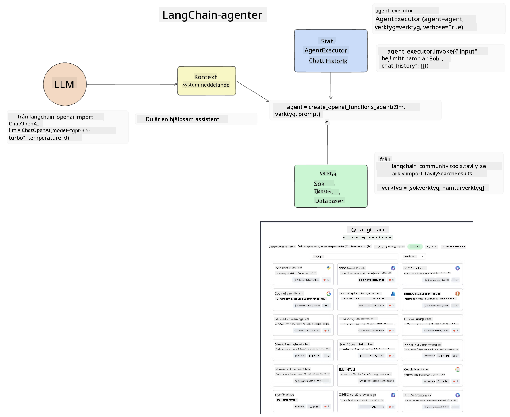
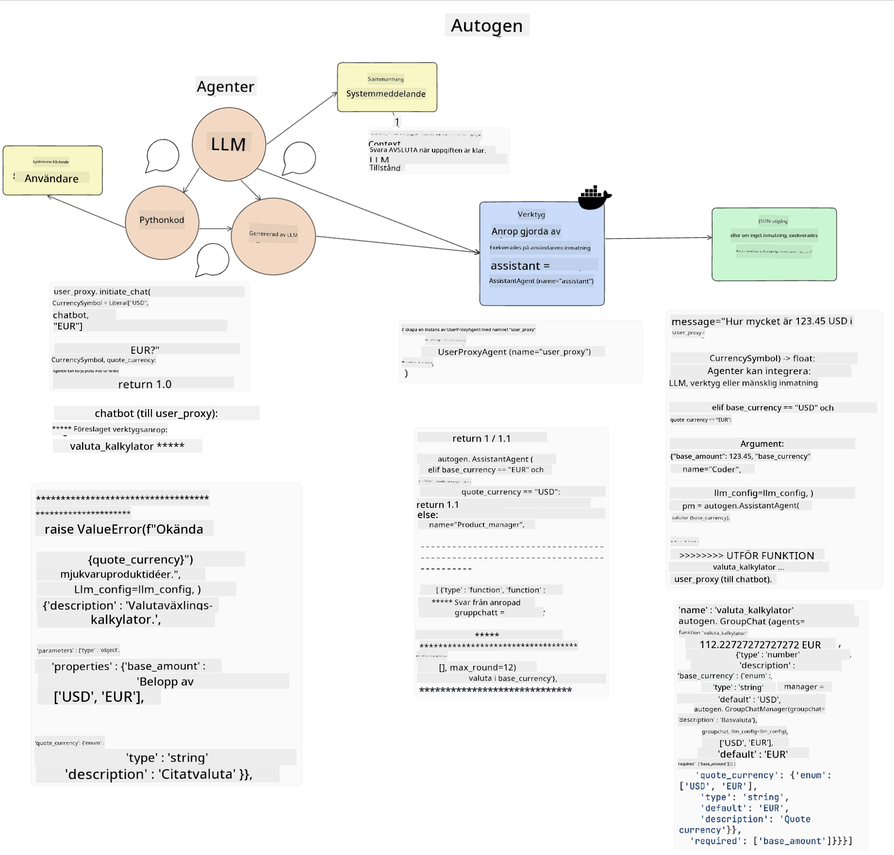
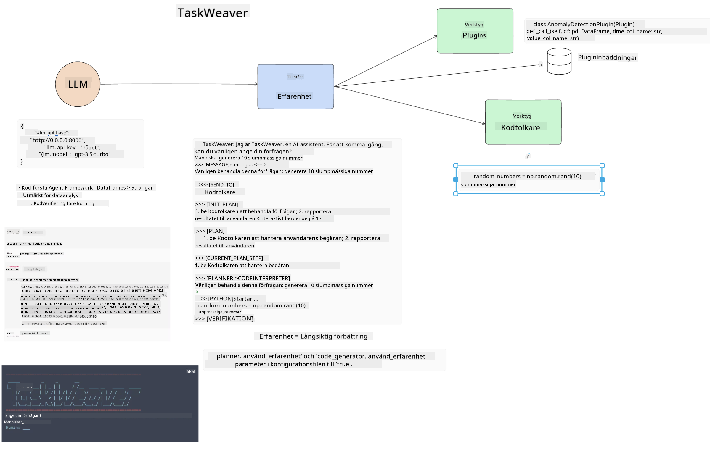
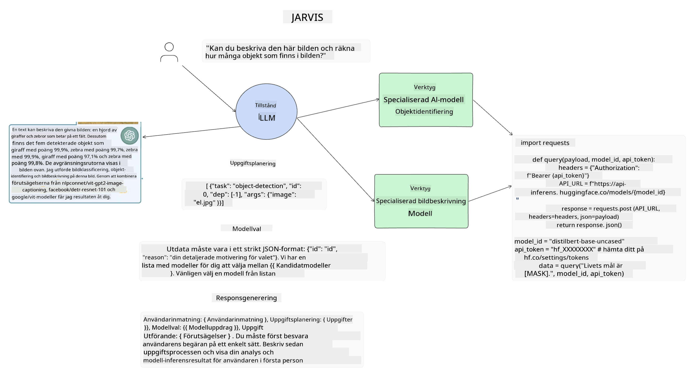

<!--
CO_OP_TRANSLATOR_METADATA:
{
  "original_hash": "11f03c81f190d9cbafd0f977dcbede6c",
  "translation_date": "2025-05-20T07:24:42+00:00",
  "source_file": "17-ai-agents/README.md",
  "language_code": "sv"
}
-->
[](https://aka.ms/gen-ai-lesson17-gh?WT.mc_id=academic-105485-koreyst)

## Introduktion

AI-agenter representerar en spännande utveckling inom Generativ AI, vilket gör att Stora Språkmodeller (LLMs) kan utvecklas från assistenter till agenter som kan vidta åtgärder. AI-agentramverk gör det möjligt för utvecklare att skapa applikationer som ger LLMs tillgång till verktyg och tillståndshantering. Dessa ramverk förbättrar också synligheten, vilket gör det möjligt för användare och utvecklare att övervaka de åtgärder som LLMs planerar, vilket förbättrar upplevelsehanteringen.

Lektionen kommer att täcka följande områden:

- Förstå vad en AI-agent är - Vad är egentligen en AI-agent?
- Utforska fyra olika AI-agentramverk - Vad gör dem unika?
- Tillämpa dessa AI-agenter på olika användningsfall - När bör vi använda AI-agenter?

## Lärandemål

Efter att ha tagit denna lektion kommer du att kunna:

- Förklara vad AI-agenter är och hur de kan användas.
- Ha en förståelse för skillnaderna mellan några av de populära AI-agentramverken och hur de skiljer sig.
- Förstå hur AI-agenter fungerar för att bygga applikationer med dem.

## Vad är AI-agenter?

AI-agenter är ett mycket spännande område inom Generativ AI. Med denna spänning kommer ibland en förvirring av termer och deras tillämpning. För att hålla saker enkelt och inkluderande för de flesta av de verktyg som refererar till AI-agenter, kommer vi att använda denna definition:

AI-agenter tillåter Stora Språkmodeller (LLMs) att utföra uppgifter genom att ge dem tillgång till ett **tillstånd** och **verktyg**.


Låt oss definiera dessa termer:

**Stora Språkmodeller** - Dessa är de modeller som nämns genom hela kursen, såsom GPT-3.5, GPT-4, Llama-2, etc.

**Tillstånd** - Detta refererar till den kontext som LLM arbetar i. LLM använder kontexten av sina tidigare handlingar och den nuvarande kontexten, vilket styr dess beslutsfattande för efterföljande handlingar. AI-agentramverk gör det lättare för utvecklare att upprätthålla denna kontext.

**Verktyg** - För att slutföra den uppgift som användaren har begärt och som LLM har planerat, behöver LLM tillgång till verktyg. Några exempel på verktyg kan vara en databas, ett API, en extern applikation eller till och med en annan LLM!

Dessa definitioner kommer förhoppningsvis att ge dig en bra grund när vi går vidare och tittar på hur de implementeras. Låt oss utforska några olika AI-agentramverk:

## LangChain Agents

[LangChain Agents](https://python.langchain.com/docs/how_to/#agents?WT.mc_id=academic-105485-koreyst) är en implementation av definitionerna vi gav ovan.

För att hantera **tillståndet**, använder det en inbyggd funktion kallad `AgentExecutor`. Denna accepterar den definierade `agent` och `tools` som är tillgängliga för den.

`Agent Executor` lagrar också chattens historia för att ge kontexten för chatten.



LangChain erbjuder en [katalog av verktyg](https://integrations.langchain.com/tools?WT.mc_id=academic-105485-koreyst) som kan importeras i din applikation där LLM kan få tillgång till dem. Dessa är skapade av gemenskapen och av LangChain-teamet.

Du kan sedan definiera dessa verktyg och skicka dem till `Agent Executor`.

Synlighet är en annan viktig aspekt när man pratar om AI-agenter. Det är viktigt för applikationsutvecklare att förstå vilket verktyg LLM använder och varför. För det har teamet på LangChain utvecklat LangSmith.

## AutoGen

Nästa AI-agentramverk vi kommer att diskutera är [AutoGen](https://microsoft.github.io/autogen/?WT.mc_id=academic-105485-koreyst). Huvudfokus för AutoGen är konversationer. Agenter är både **konverserbara** och **anpassningsbara**.

**Konverserbara -** LLMs kan starta och fortsätta en konversation med en annan LLM för att slutföra en uppgift. Detta görs genom att skapa `AssistantAgents` och ge dem ett specifikt systemmeddelande.

```python

autogen.AssistantAgent( name="Coder", llm_config=llm_config, ) pm = autogen.AssistantAgent( name="Product_manager", system_message="Creative in software product ideas.", llm_config=llm_config, )

```

**Anpassningsbara** - Agenter kan definieras inte bara som LLMs utan också som en användare eller ett verktyg. Som utvecklare kan du definiera en `UserProxyAgent` som ansvarar för att interagera med användaren för feedback vid slutförandet av en uppgift. Denna feedback kan antingen fortsätta utförandet av uppgiften eller stoppa den.

```python
user_proxy = UserProxyAgent(name="user_proxy")
```

### Tillstånd och Verktyg

För att ändra och hantera tillstånd genererar en assistentagent Python-kod för att slutföra uppgiften.

Här är ett exempel på processen:



#### LLM Definierad med ett Systemmeddelande

```python
system_message="For weather related tasks, only use the functions you have been provided with. Reply TERMINATE when the task is done."
```

Detta systemmeddelande styr denna specifika LLM till vilka funktioner som är relevanta för dess uppgift. Kom ihåg att med AutoGen kan du ha flera definierade AssistantAgents med olika systemmeddelanden.

#### Chatt Startas av Användaren

```python
user_proxy.initiate_chat( chatbot, message="I am planning a trip to NYC next week, can you help me pick out what to wear? ", )

```

Detta meddelande från user_proxy (Människa) är vad som kommer att starta processen för Agenten att utforska de möjliga funktioner som den bör utföra.

#### Funktion Utförs

```bash
chatbot (to user_proxy):

***** Suggested tool Call: get_weather ***** Arguments: {"location":"New York City, NY","time_periond:"7","temperature_unit":"Celsius"} ******************************************************** --------------------------------------------------------------------------------

>>>>>>>> EXECUTING FUNCTION get_weather... user_proxy (to chatbot): ***** Response from calling function "get_weather" ***** 112.22727272727272 EUR ****************************************************************

```

När den initiala chatten har bearbetats kommer Agenten att skicka det föreslagna verktyget att anropa. I detta fall är det en funktion kallad `get_weather`. Depending on your configuration, this function can be automatically executed and read by the Agent or can be executed based on user input.

You can find a list of [AutoGen code samples](https://microsoft.github.io/autogen/docs/Examples/?WT.mc_id=academic-105485-koreyst) to further explore how to get started building.

## Taskweaver

The next agent framework we will explore is [Taskweaver](https://microsoft.github.io/TaskWeaver/?WT.mc_id=academic-105485-koreyst). It is known as a "code-first" agent because instead of working strictly with `strings` , it can work with DataFrames in Python. This becomes extremely useful for data analysis and generation tasks. This can be things like creating graphs and charts or generating random numbers.

### State and Tools

To manage the state of the conversation, TaskWeaver uses the concept of a `Planner`. The `Planner` is a LLM that takes the request from the users and maps out the tasks that need to be completed to fulfill this request.

To complete the tasks the `Planner` is exposed to the collection of tools called `Plugins`. Detta kan vara Python-klasser eller en allmän kodtolk. Dessa plugins lagras som embeddings så att LLM kan bättre söka efter rätt plugin.



Här är ett exempel på ett plugin för att hantera avvikelsedetektering:

```python
class AnomalyDetectionPlugin(Plugin): def __call__(self, df: pd.DataFrame, time_col_name: str, value_col_name: str):
```

Koden verifieras innan den körs. En annan funktion för att hantera kontext i Taskweaver är `experience`. Experience allows for the context of a conversation to be stored over to the long term in a YAML file. This can be configured so that the LLM improves over time on certain tasks given that it is exposed to prior conversations.

## JARVIS

The last agent framework we will explore is [JARVIS](https://github.com/microsoft/JARVIS?tab=readme-ov-file?WT.mc_id=academic-105485-koreyst). What makes JARVIS unique is that it uses an LLM to manage the `state` av konversationen och `tools` är andra AI-modeller. Varje AI-modell är specialiserade modeller som utför vissa uppgifter såsom objektdetektering, transkription eller bildbeskrivning.



LLM, som är en allmän modell, tar emot förfrågan från användaren och identifierar den specifika uppgiften och eventuella argument/data som behövs för att slutföra uppgiften.

```python
[{"task": "object-detection", "id": 0, "dep": [-1], "args": {"image": "e1.jpg" }}]
```

LLM formaterar sedan förfrågan på ett sätt som den specialiserade AI-modellen kan tolka, såsom JSON. När AI-modellen har returnerat sin förutsägelse baserat på uppgiften, tar LLM emot svaret.

Om flera modeller krävs för att slutföra uppgiften, kommer den också att tolka svaret från dessa modeller innan de sammanförs för att generera svaret till användaren.

Exemplet nedan visar hur detta skulle fungera när en användare begär en beskrivning och antal av objekten i en bild:

## Uppgift

För att fortsätta din inlärning av AI-agenter kan du bygga med AutoGen:

- En applikation som simulerar ett affärsmöte med olika avdelningar i en utbildningsstart.
- Skapa systemmeddelanden som vägleder LLMs i att förstå olika personor och prioriteringar, och gör det möjligt för användaren att presentera en ny produktidé.
- LLM bör sedan generera uppföljningsfrågor från varje avdelning för att förfina och förbättra presentationen och produktidén.

## Lärandet slutar inte här, fortsätt resan

Efter att ha slutfört denna lektion, kolla in vår [Generative AI Learning collection](https://aka.ms/genai-collection?WT.mc_id=academic-105485-koreyst) för att fortsätta utveckla din kunskap om Generativ AI!

**Ansvarsfriskrivning**:  
Detta dokument har översatts med hjälp av AI-översättningstjänsten [Co-op Translator](https://github.com/Azure/co-op-translator). Även om vi strävar efter noggrannhet, vänligen var medveten om att automatiserade översättningar kan innehålla fel eller felaktigheter. Det ursprungliga dokumentet på sitt modersmål bör betraktas som den auktoritativa källan. För kritisk information rekommenderas professionell mänsklig översättning. Vi ansvarar inte för eventuella missförstånd eller feltolkningar som uppstår vid användning av denna översättning.