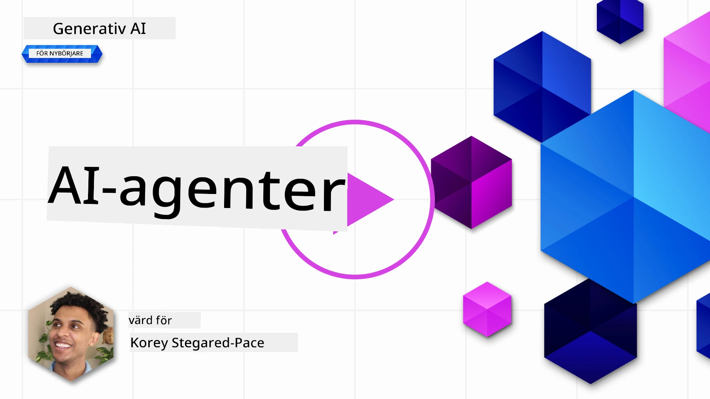
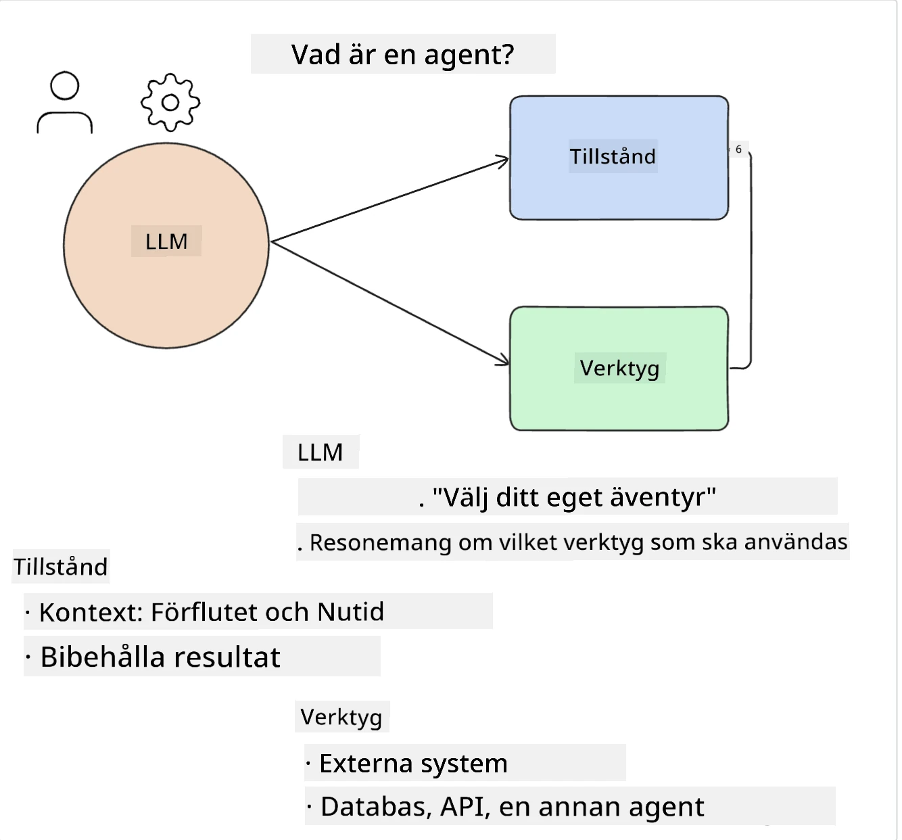
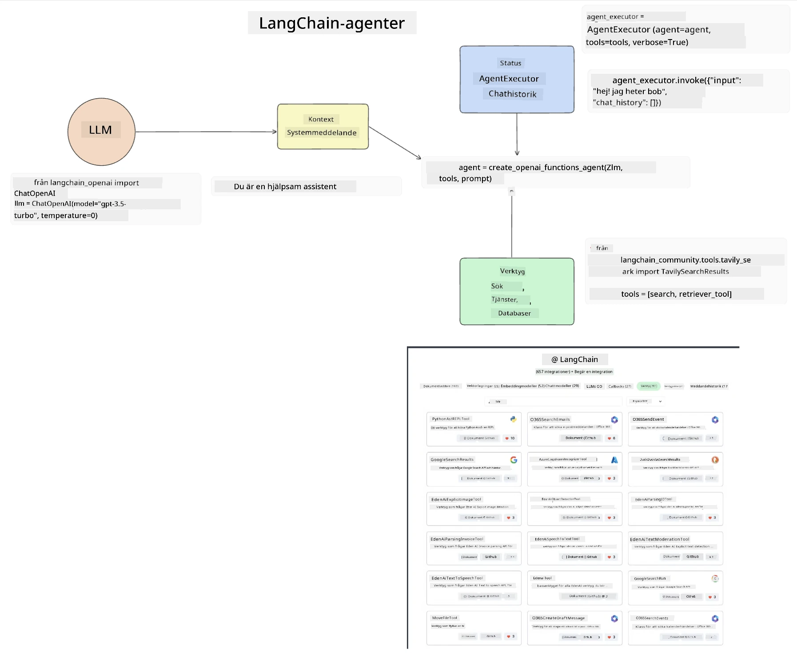
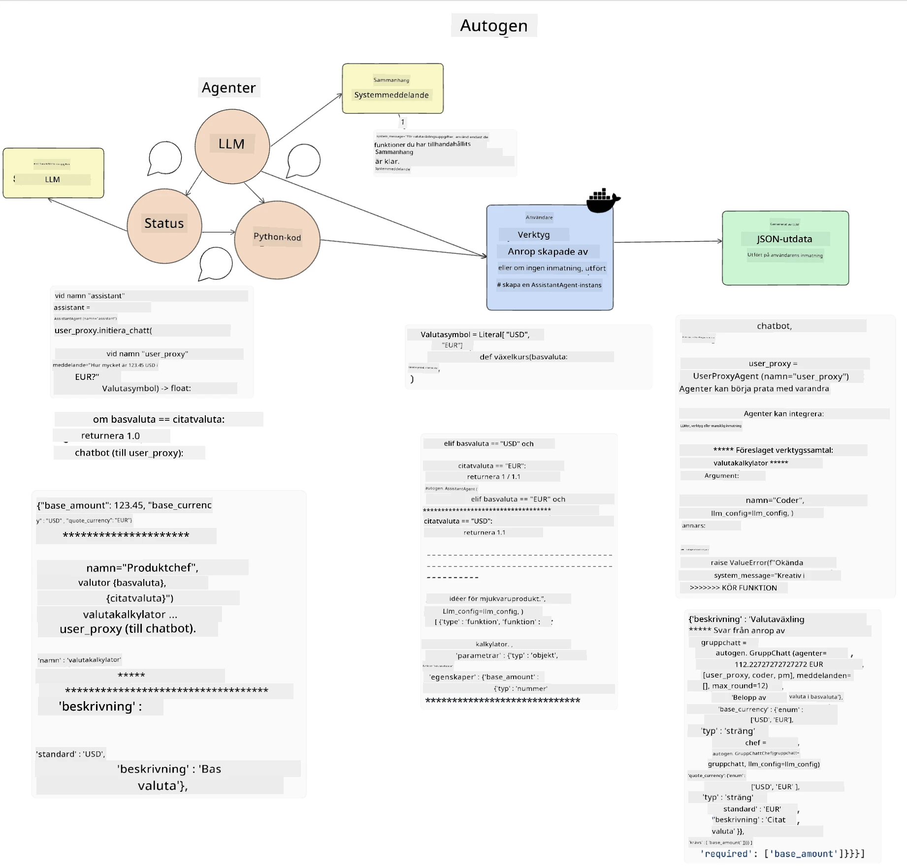
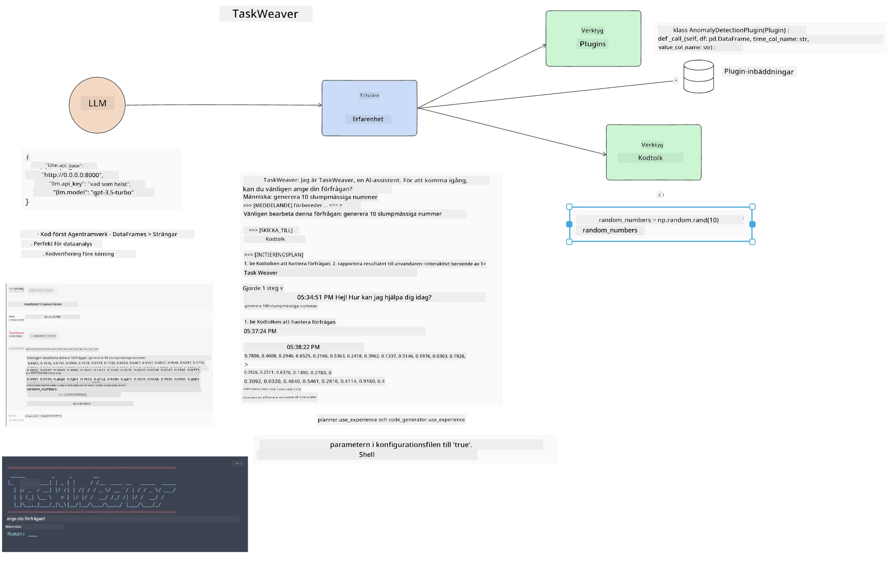
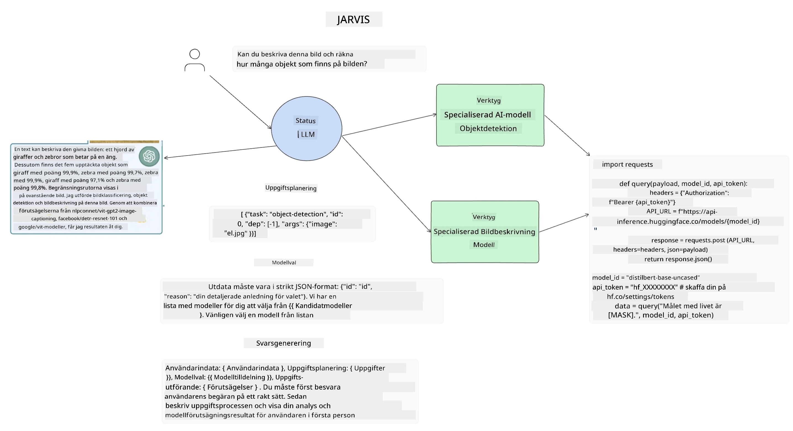

[](https://youtu.be/yAXVW-lUINc?si=bOtW9nL6jc3XJgOM)

## Introduktion

AI-Agenter representerar en spännande utveckling inom Generativ AI, som gör det möjligt för Stora Språkmodeller (LLMs) att utvecklas från assistenter till agenter som kan utföra handlingar. AI Agent-ramverk gör det möjligt för utvecklare att skapa applikationer som ger LLMs tillgång till verktyg och tillståndshantering. Dessa ramverk förbättrar även synligheten, vilket gör det möjligt för användare och utvecklare att övervaka de åtgärder som LLMs planerar, och därmed förbättra upplevelsehanteringen.

Lektionen kommer att täcka följande områden:

- Förstå vad en AI Agent är - Vad exakt är en AI Agent?
- Utforska fyra olika AI Agent-ramverk - Vad gör dem unika?
- Använda dessa AI Agenter för olika användningsfall - När bör vi använda AI Agenter?

## Lärandemål

Efter att ha genomfört denna lektion kommer du att kunna:

- Förklara vad AI Agenter är och hur de kan användas.
- Ha en förståelse för skillnaderna mellan några av de populära AI Agent-ramverken och hur de skiljer sig åt.
- Förstå hur AI Agenter fungerar för att kunna bygga applikationer med dem.

## Vad är AI Agenter?

AI Agenter är ett mycket spännande område inom Generativ AI. Med denna spänning följer ibland en förvirring kring termer och deras tillämpning. För att hålla det enkelt och inkluderande för de flesta av de verktyg som refererar till AI Agenter, använder vi följande definition:

AI Agenter tillåter Stora Språkmodeller (LLMs) att utföra uppgifter genom att ge dem tillgång till ett **tillstånd** och **verktyg**.



Låt oss definiera dessa termer:

**Stora Språkmodeller** - Dessa är de modeller som nämns genom hela kursen såsom GPT-3.5, GPT-4, Llama-2, etc.

**Tillstånd** - Detta syftar på det sammanhang som LLM arbetar inom. LLM använder kontexten från sina tidigare handlingar och det aktuella sammanhanget för att styra sitt beslutsfattande för efterföljande handlingar. AI Agent-ramverk gör det enklare för utvecklare att bibehålla detta sammanhang.

**Verktyg** - För att slutföra den uppgift som användaren har begärt och som LLM har planerat, behöver LLM tillgång till verktyg. Några exempel på verktyg kan vara en databas, en API, en extern applikation eller till och med en annan LLM!

Dessa definitioner kommer förhoppningsvis ge dig en bra grund när vi nu tittar på hur de implementeras. Låt oss utforska några olika AI Agent-ramverk:

## LangChain Agents

[LangChain Agents](https://python.langchain.com/docs/how_to/#agents?WT.mc_id=academic-105485-koreyst) är en implementation av de definitioner vi gav ovan.

För att hantera **tillståndet** använder den en inbyggd funktion kallad `AgentExecutor`. Den tar emot den definierade `agent` och de `verktyg` som finns tillgängliga för den.

`Agent Executor` sparar också chattens historik för att ge sammanhang för konversationen.



LangChain erbjuder en [katalog av verktyg](https://integrations.langchain.com/tools?WT.mc_id=academic-105485-koreyst) som kan importeras till din applikation och som LLM kan få tillgång till. Dessa är skapade av communityn och av LangChain-teamet.

Du kan sedan definiera dessa verktyg och skicka dem till `Agent Executor`.

Synlighet är en annan viktig aspekt när man pratar om AI Agenter. Det är viktigt för applikationsutvecklare att förstå vilket verktyg LLM använder och varför. För detta har teamet på LangChain utvecklat LangSmith.

## AutoGen

Nästa AI Agent-ramverk vi ska diskutera är [AutoGen](https://microsoft.github.io/autogen/?WT.mc_id=academic-105485-koreyst). Huvudfokus för AutoGen är konversationer. Agenter är både **konverserbara** och **anpassningsbara**.

**Konverserbara -** LLMs kan starta och fortsätta en konversation med en annan LLM för att slutföra en uppgift. Detta görs genom att skapa `AssistantAgents` och ge dem ett specifikt systemmeddelande.

```python

autogen.AssistantAgent( name="Coder", llm_config=llm_config, ) pm = autogen.AssistantAgent( name="Product_manager", system_message="Creative in software product ideas.", llm_config=llm_config, )

```

**Anpassningsbara** - Agenter kan definieras inte bara som LLMs utan också som en användare eller ett verktyg. Som utvecklare kan du definiera en `UserProxyAgent` som ansvarar för att interagera med användaren för feedback i att slutföra en uppgift. Denna feedback kan antingen fortsätta uppgiftsutförandet eller stoppa det.

```python
user_proxy = UserProxyAgent(name="user_proxy")
```

### Tillstånd och Verktyg

För att ändra och hantera tillstånd genererar en assistentagent Python-kod för att slutföra uppgiften.

Här är ett exempel på processen:



#### LLM Definierad med ett Systemmeddelande

```python
system_message="For weather related tasks, only use the functions you have been provided with. Reply TERMINATE when the task is done."
```

Detta systemmeddelande styr denna specifika LLM till vilka funktioner som är relevanta för dess uppgift. Kom ihåg att med AutoGen kan du ha flera definierade AssistantAgents med olika systemmeddelanden.

#### Chatt initieras av användaren

```python
user_proxy.initiate_chat( chatbot, message="I am planning a trip to NYC next week, can you help me pick out what to wear? ", )

```

Detta meddelande från user_proxy (människa) är vad som startar processen för agenten att utforska de möjliga funktioner som den bör utföra.

#### Funktion körs

```bash
chatbot (to user_proxy):

***** Suggested tool Call: get_weather ***** Arguments: {"location":"New York City, NY","time_periond:"7","temperature_unit":"Celsius"} ******************************************************** --------------------------------------------------------------------------------

>>>>>>>> EXECUTING FUNCTION get_weather... user_proxy (to chatbot): ***** Response from calling function "get_weather" ***** 112.22727272727272 EUR ****************************************************************

```

När den initiala chatten har bearbetats kommer agenten att skicka det föreslagna verktyget att anropas. I detta fall är det en funktion som heter `get_weather`. Beroende på din konfiguration kan denna funktion automatiskt köras och läsas av agenten eller köras baserat på användarens input.

Du kan hitta en lista över [AutoGen kodexempel](https://microsoft.github.io/autogen/docs/Examples/?WT.mc_id=academic-105485-koreyst) för att ytterligare utforska hur du kommer igång med att bygga.

## Taskweaver

Nästa agentramverk vi ska utforska är [Taskweaver](https://microsoft.github.io/TaskWeaver/?WT.mc_id=academic-105485-koreyst). Det är känt som en "code-first" agent eftersom den istället för att arbeta strikt med `strängar` kan arbeta med DataFrames i Python. Detta blir extremt användbart för dataanalys och genereringsuppgifter. Detta kan vara saker som att skapa grafer och diagram eller generera slumpmässiga nummer.

### Tillstånd och Verktyg

För att hantera samtalstillståndet använder TaskWeaver konceptet `Planner`. `Planner` är en LLM som tar emot användarens förfrågan och kartlägger de uppgifter som behöver genomföras för att uppfylla denna begäran.

För att slutföra uppgifterna exponeras `Planner` för en samling verktyg kallade `Plugins`. Detta kan vara Python-klasser eller en allmän kodtolk. Dessa plugins lagras som embeddings så att LLM kan söka bättre efter rätt plugin.



Här är ett exempel på en plugin för att hantera anomaliupptäckt:

```python
class AnomalyDetectionPlugin(Plugin): def __call__(self, df: pd.DataFrame, time_col_name: str, value_col_name: str):
```

Koden verifieras innan den körs. En annan funktion för att hantera kontext i Taskweaver är `experience`. Experience möjliggör att kontexten av ett samtal kan sparas över längre tid i en YAML-fil. Detta kan konfigureras så att LLM förbättras över tid på vissa uppgifter under förutsättning att den exponeras för tidigare samtal.

## JARVIS

Det sista agentramverket vi ska utforska är [JARVIS](https://github.com/microsoft/JARVIS?tab=readme-ov-file&WT.mc_id=academic-105485-koreyst). Det som gör JARVIS unikt är att det använder en LLM för att hantera `tillståndet` i konversationen och att `verktygen` är andra AI-modeller. Varje AI-modell är specialiserad på att utföra vissa uppgifter såsom objektdetektion, transkription eller bildbeskrivning.



LLM, som är en allmänt använd modell, tar emot begäran från användaren och identifierar den specifika uppgiften samt eventuella argument/data som behövs för att slutföra uppgiften.

```python
[{"task": "object-detection", "id": 0, "dep": [-1], "args": {"image": "e1.jpg" }}]
```

LLM formaterar sedan begäran på ett sätt som den specialiserade AI-modellen kan tolka, till exempel JSON. När AI-modellen har återvänt med sin förutsägelse baserat på uppgiften, tar LLM emot svaret.

Om flera modeller krävs för att slutföra uppgiften kommer den också att tolka svaren från dessa modeller innan de sammanförs för att generera ett svar till användaren.

Exemplet nedan visar hur detta skulle fungera när en användare begär en beskrivning och räkning av objekten på en bild:

## Uppgift

För att fortsätta din inlärning av AI Agenter kan du bygga med AutoGen:

- En applikation som simulerar ett affärsmöte med olika avdelningar i en utbildningsstartup.
- Skapa systemmeddelanden som hjälper LLM att förstå olika personas och prioriteringar, och låt användaren presentera en ny produktidé.
- LLM ska sedan generera följdfrågor från varje avdelning för att förfina och förbättra presentationen och produktidén.

## Lärandet slutar inte här, fortsätt resan

Efter att ha slutfört denna lektion, kolla in vår [Generative AI Learning collection](https://aka.ms/genai-collection?WT.mc_id=academic-105485-koreyst) för att fortsätta att utveckla din kunskap om Generativ AI!

---

<!-- CO-OP TRANSLATOR DISCLAIMER START -->
**Ansvarsfriskrivning**:
Detta dokument har översatts med hjälp av AI-översättningstjänsten [Co-op Translator](https://github.com/Azure/co-op-translator). Även om vi strävar efter noggrannhet, var vänlig observera att automatiska översättningar kan innehålla fel eller inkonsekvenser. Det ursprungliga dokumentet på dess modersmål ska betraktas som den auktoritativa källan. För kritisk information rekommenderas professionell mänsklig översättning. Vi ansvarar inte för några missförstånd eller feltolkningar som uppstår till följd av användningen av denna översättning.
<!-- CO-OP TRANSLATOR DISCLAIMER END -->