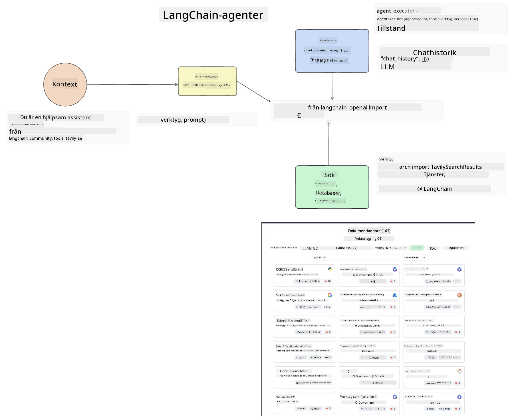
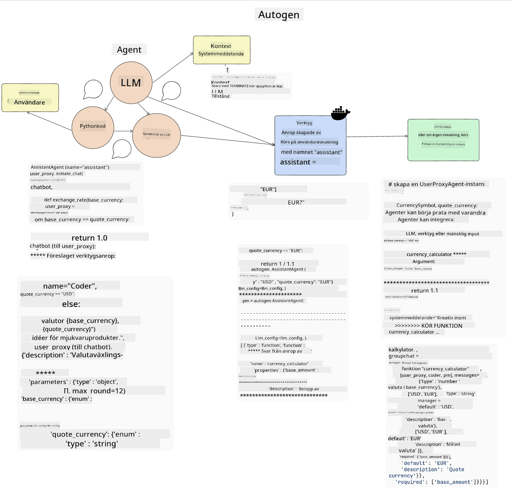
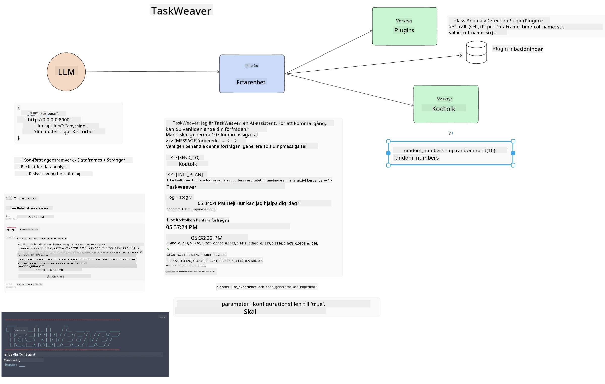

<!--
CO_OP_TRANSLATOR_METADATA:
{
  "original_hash": "11f03c81f190d9cbafd0f977dcbede6c",
  "translation_date": "2025-07-09T17:26:17+00:00",
  "source_file": "17-ai-agents/README.md",
  "language_code": "sv"
}
-->
[](https://aka.ms/gen-ai-lesson17-gh?WT.mc_id=academic-105485-koreyst)

## Introduktion

AI Agents representerar en spännande utveckling inom Generative AI, som gör det möjligt för Large Language Models (LLMs) att utvecklas från assistenter till agenter som kan utföra handlingar. AI Agent-ramverk gör det möjligt för utvecklare att skapa applikationer som ger LLMs tillgång till verktyg och tillståndshantering. Dessa ramverk förbättrar också insynen, vilket gör det möjligt för användare och utvecklare att övervaka de åtgärder som LLMs planerar, och därigenom förbättra upplevelsen.

Lektionens innehåll omfattar följande områden:

- Förstå vad en AI Agent är – Vad är egentligen en AI Agent?
- Utforska fyra olika AI Agent-ramverk – Vad gör dem unika?
- Använda dessa AI Agents i olika användningsfall – När bör vi använda AI Agents?

## Lärandemål

Efter att ha genomgått denna lektion kommer du att kunna:

- Förklara vad AI Agents är och hur de kan användas.
- Ha en förståelse för skillnaderna mellan några av de populära AI Agent-ramverken och hur de skiljer sig åt.
- Förstå hur AI Agents fungerar för att kunna bygga applikationer med dem.

## Vad är AI Agents?

AI Agents är ett mycket spännande område inom Generative AI. Med denna spänning följer ibland en förvirring kring termer och deras tillämpning. För att hålla det enkelt och inkludera de flesta verktyg som refererar till AI Agents, kommer vi att använda denna definition:

AI Agents tillåter Large Language Models (LLMs) att utföra uppgifter genom att ge dem tillgång till ett **tillstånd** och **verktyg**.


Låt oss definiera dessa termer:

**Large Language Models** – Det här är de modeller som nämns genom hela kursen, som GPT-3.5, GPT-4, Llama-2, osv.

**Tillstånd** – Detta syftar på den kontext som LLM arbetar inom. LLM använder kontexten från sina tidigare handlingar och den aktuella kontexten för att styra sitt beslutsfattande för kommande åtgärder. AI Agent-ramverk gör det enklare för utvecklare att behålla denna kontext.

**Verktyg** – För att slutföra den uppgift som användaren har begärt och som LLM har planerat, behöver LLM tillgång till verktyg. Exempel på verktyg kan vara en databas, ett API, en extern applikation eller till och med en annan LLM!

Dessa definitioner ger förhoppningsvis en bra grund när vi går vidare och tittar på hur de implementeras. Låt oss utforska några olika AI Agent-ramverk:

## LangChain Agents

[LangChain Agents](https://python.langchain.com/docs/how_to/#agents?WT.mc_id=academic-105485-koreyst) är en implementation av de definitioner vi gav ovan.

För att hantera **tillståndet** använder det en inbyggd funktion som kallas `AgentExecutor`. Den tar emot den definierade `agent` och de `tools` som finns tillgängliga.

`AgentExecutor` sparar också chattens historik för att ge kontext till samtalet.



LangChain erbjuder en [katalog av verktyg](https://integrations.langchain.com/tools?WT.mc_id=academic-105485-koreyst) som kan importeras till din applikation och som LLM kan få tillgång till. Dessa är skapade av communityn och LangChain-teamet.

Du kan sedan definiera dessa verktyg och skicka dem till `AgentExecutor`.

Insyn är en annan viktig aspekt när man pratar om AI Agents. Det är viktigt för applikationsutvecklare att förstå vilket verktyg LLM använder och varför. För detta har teamet på LangChain utvecklat LangSmith.

## AutoGen

Nästa AI Agent-ramverk vi ska diskutera är [AutoGen](https://microsoft.github.io/autogen/?WT.mc_id=academic-105485-koreyst). AutoGen fokuserar främst på konversationer. Agenter är både **konverserbara** och **anpassningsbara**.

**Konverserbara –** LLMs kan starta och fortsätta en konversation med en annan LLM för att slutföra en uppgift. Detta görs genom att skapa `AssistantAgents` och ge dem ett specifikt systemmeddelande.

```python

autogen.AssistantAgent( name="Coder", llm_config=llm_config, ) pm = autogen.AssistantAgent( name="Product_manager", system_message="Creative in software product ideas.", llm_config=llm_config, )

```

**Anpassningsbara** – Agenter kan definieras inte bara som LLMs utan även som en användare eller ett verktyg. Som utvecklare kan du definiera en `UserProxyAgent` som ansvarar för att interagera med användaren för feedback i att slutföra en uppgift. Denna feedback kan antingen fortsätta utförandet av uppgiften eller stoppa den.

```python
user_proxy = UserProxyAgent(name="user_proxy")
```

### Tillstånd och Verktyg

För att ändra och hantera tillstånd genererar en assistentagent Python-kod för att slutföra uppgiften.

Här är ett exempel på processen:



#### LLM definieras med ett systemmeddelande

```python
system_message="For weather related tasks, only use the functions you have been provided with. Reply TERMINATE when the task is done."
```

Detta systemmeddelande styr denna specifika LLM vilka funktioner som är relevanta för dess uppgift. Kom ihåg att med AutoGen kan du ha flera definierade AssistantAgents med olika systemmeddelanden.

#### Chatten initieras av användaren

```python
user_proxy.initiate_chat( chatbot, message="I am planning a trip to NYC next week, can you help me pick out what to wear? ", )

```

Detta meddelande från user_proxy (människa) är det som startar processen för agenten att utforska vilka funktioner den bör utföra.

#### Funktion utförs

```bash
chatbot (to user_proxy):

***** Suggested tool Call: get_weather ***** Arguments: {"location":"New York City, NY","time_periond:"7","temperature_unit":"Celsius"} ******************************************************** --------------------------------------------------------------------------------

>>>>>>>> EXECUTING FUNCTION get_weather... user_proxy (to chatbot): ***** Response from calling function "get_weather" ***** 112.22727272727272 EUR ****************************************************************

```

När den initiala chatten har bearbetats kommer agenten att skicka det föreslagna verktyget att anropa. I detta fall är det en funktion som heter `get_weather`. Beroende på din konfiguration kan denna funktion automatiskt köras och läsas av agenten eller köras baserat på användarens input.

Du kan hitta en lista med [AutoGen kodexempel](https://microsoft.github.io/autogen/docs/Examples/?WT.mc_id=academic-105485-koreyst) för att utforska hur du kommer igång med att bygga.

## Taskweaver

Nästa agent-ramverk vi ska utforska är [Taskweaver](https://microsoft.github.io/TaskWeaver/?WT.mc_id=academic-105485-koreyst). Det är känt som en "code-first" agent eftersom den, istället för att arbeta strikt med `strings`, kan arbeta med DataFrames i Python. Detta blir mycket användbart för dataanalys och generering av uppgifter. Det kan vara saker som att skapa grafer och diagram eller generera slumpmässiga tal.

### Tillstånd och Verktyg

För att hantera samtalets tillstånd använder TaskWeaver konceptet `Planner`. `Planner` är en LLM som tar emot användarens förfrågan och kartlägger de uppgifter som behöver slutföras för att uppfylla denna förfrågan.

För att slutföra uppgifterna exponeras `Planner` för en samling verktyg kallade `Plugins`. Detta kan vara Python-klasser eller en generell kodtolk. Dessa plugins lagras som embeddings så att LLM kan söka bättre efter rätt plugin.



Här är ett exempel på en plugin för att hantera anomalidetektion:

```python
class AnomalyDetectionPlugin(Plugin): def __call__(self, df: pd.DataFrame, time_col_name: str, value_col_name: str):
```

Koden verifieras innan den körs. En annan funktion för att hantera kontext i Taskweaver är `experience`. Experience tillåter att kontexten i en konversation sparas över tid i en YAML-fil. Detta kan konfigureras så att LLM förbättras över tid på vissa uppgifter, förutsatt att den exponeras för tidigare konversationer.

## JARVIS

Det sista agent-ramverket vi ska utforska är [JARVIS](https://github.com/microsoft/JARVIS?tab=readme-ov-file?WT.mc_id=academic-105485-koreyst). Det som gör JARVIS unikt är att det använder en LLM för att hantera `tillståndet` i konversationen och att `tools` är andra AI-modeller. Varje AI-modell är specialiserad på att utföra vissa uppgifter som objektigenkänning, transkription eller bildbeskrivning.


LLM, som är en allmän modell, tar emot användarens förfrågan och identifierar den specifika uppgiften samt eventuella argument/data som behövs för att slutföra uppgiften.

```python
[{"task": "object-detection", "id": 0, "dep": [-1], "args": {"image": "e1.jpg" }}]
```

LLM formaterar sedan förfrågan på ett sätt som den specialiserade AI-modellen kan tolka, till exempel JSON. När AI-modellen har returnerat sin prediktion baserat på uppgiften, tar LLM emot svaret.

Om flera modeller krävs för att slutföra uppgiften, tolkar den också svaren från dessa modeller innan den sammanställer dem för att generera svaret till användaren.

Exemplet nedan visar hur detta skulle fungera när en användare begär en beskrivning och räkning av objekten i en bild:

## Uppgift

För att fortsätta din inlärning av AI Agents kan du bygga med AutoGen:

- En applikation som simulerar ett affärsmöte med olika avdelningar i en utbildningsstartup.
- Skapa systemmeddelanden som hjälper LLMs att förstå olika personas och prioriteringar, och låt användaren presentera en ny produktidé.
- LLM ska sedan generera följdfrågor från varje avdelning för att förfina och förbättra presentationen och produktidén.

## Lärandet slutar inte här, fortsätt resan

Efter att ha slutfört denna lektion, kolla in vår [Generative AI Learning collection](https://aka.ms/genai-collection?WT.mc_id=academic-105485-koreyst) för att fortsätta utveckla dina kunskaper inom Generative AI!

**Ansvarsfriskrivning**:  
Detta dokument har översatts med hjälp av AI-översättningstjänsten [Co-op Translator](https://github.com/Azure/co-op-translator). Även om vi strävar efter noggrannhet, vänligen observera att automatiska översättningar kan innehålla fel eller brister. Det ursprungliga dokumentet på dess modersmål bör betraktas som den auktoritativa källan. För kritisk information rekommenderas professionell mänsklig översättning. Vi ansvarar inte för några missförstånd eller feltolkningar som uppstår vid användning av denna översättning.