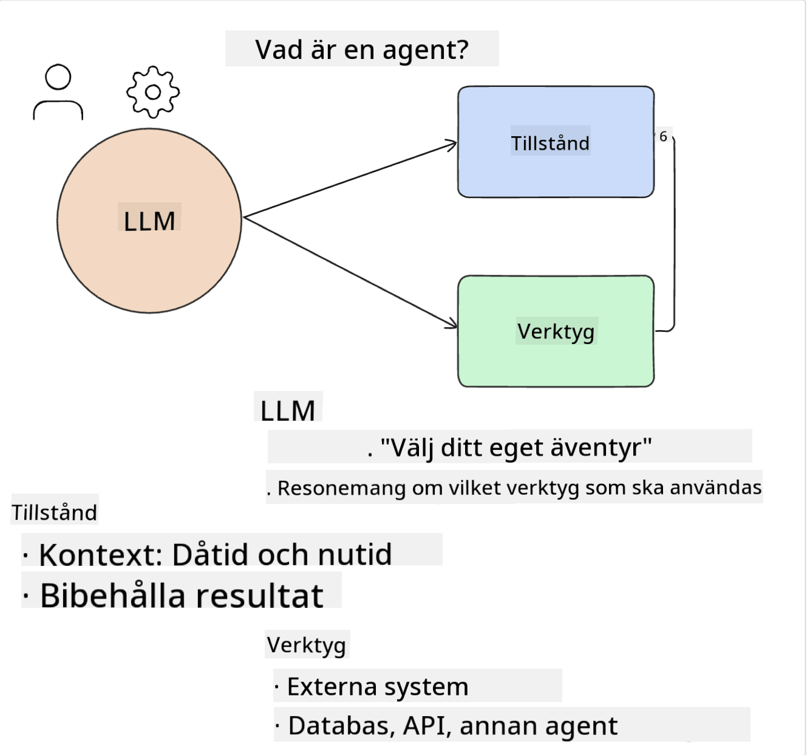
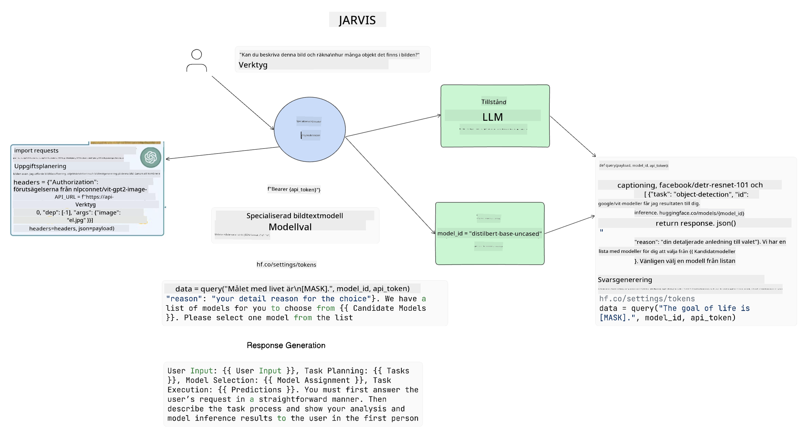

<!--
CO_OP_TRANSLATOR_METADATA:
{
  "original_hash": "8e8d1f6a63da606af7176a87ff8e92b6",
  "translation_date": "2025-10-17T19:06:10+00:00",
  "source_file": "17-ai-agents/README.md",
  "language_code": "sv"
}
-->
[](https://youtu.be/yAXVW-lUINc?si=bOtW9nL6jc3XJgOM)

## Introduktion

AI-agenter representerar en spännande utveckling inom Generativ AI och gör det möjligt för stora språkmodeller (LLMs) att utvecklas från assistenter till agenter som kan utföra handlingar. Ramverk för AI-agenter gör det möjligt för utvecklare att skapa applikationer som ger LLMs tillgång till verktyg och hantering av tillstånd. Dessa ramverk förbättrar också insynen, vilket gör det möjligt för användare och utvecklare att övervaka de åtgärder som LLMs planerar, och därmed förbättra hanteringen av användarupplevelsen.

Den här lektionen kommer att täcka följande områden:

- Förstå vad en AI-agent är - Vad är egentligen en AI-agent?
- Utforska fyra olika ramverk för AI-agenter - Vad gör dem unika?
- Använda dessa AI-agenter för olika användningsområden - När ska vi använda AI-agenter?

## Lärandemål

Efter att ha tagit denna lektion kommer du att kunna:

- Förklara vad AI-agenter är och hur de kan användas.
- Ha en förståelse för skillnaderna mellan några av de populära ramverken för AI-agenter och hur de skiljer sig åt.
- Förstå hur AI-agenter fungerar för att kunna bygga applikationer med dem.

## Vad är AI-agenter?

AI-agenter är ett mycket spännande område inom Generativ AI. Med denna spänning kommer ibland en förvirring kring termer och deras tillämpning. För att hålla det enkelt och inkluderande för de flesta verktyg som hänvisar till AI-agenter kommer vi att använda följande definition:

AI-agenter gör det möjligt för stora språkmodeller (LLMs) att utföra uppgifter genom att ge dem tillgång till ett **tillstånd** och **verktyg**.



Låt oss definiera dessa termer:

**Stora språkmodeller** - Detta är de modeller som nämns genom hela kursen, såsom GPT-3.5, GPT-4, Llama-2, etc.

**Tillstånd** - Detta hänvisar till det sammanhang som LLM arbetar inom. LLM använder sammanhanget från sina tidigare handlingar och det aktuella sammanhanget för att vägleda sitt beslutsfattande för efterföljande handlingar. Ramverk för AI-agenter gör det enklare för utvecklare att hantera detta sammanhang.

**Verktyg** - För att slutföra den uppgift som användaren har begärt och som LLM har planerat, behöver LLM tillgång till verktyg. Några exempel på verktyg kan vara en databas, ett API, en extern applikation eller till och med en annan LLM!

Dessa definitioner kommer förhoppningsvis att ge dig en bra grund att stå på när vi går vidare och tittar på hur de implementeras. Låt oss utforska några olika ramverk för AI-agenter:

## LangChain Agents

[LangChain Agents](https://python.langchain.com/docs/how_to/#agents?WT.mc_id=academic-105485-koreyst) är en implementering av de definitioner vi gav ovan.

För att hantera **tillståndet** använder det en inbyggd funktion som kallas `AgentExecutor`. Denna accepterar den definierade `agenten` och de `verktyg` som är tillgängliga för den.

`AgentExecutor` lagrar också chattens historik för att ge sammanhang till konversationen.


LangChain erbjuder en [katalog över verktyg](https://integrations.langchain.com/tools?WT.mc_id=academic-105485-koreyst) som kan importeras till din applikation och som LLM kan få tillgång till. Dessa är skapade av communityn och av LangChain-teamet.

Du kan sedan definiera dessa verktyg och skicka dem till `AgentExecutor`.

Synlighet är en annan viktig aspekt när man pratar om AI-agenter. Det är viktigt för applikationsutvecklare att förstå vilket verktyg LLM använder och varför. För detta har teamet på LangChain utvecklat LangSmith.

## AutoGen

Nästa ramverk för AI-agenter vi ska diskutera är [AutoGen](https://microsoft.github.io/autogen/?WT.mc_id=academic-105485-koreyst). AutoGen fokuserar främst på konversationer. Agenter är både **konverserbara** och **anpassningsbara**.

**Konverserbara -** LLMs kan starta och fortsätta en konversation med en annan LLM för att slutföra en uppgift. Detta görs genom att skapa `AssistantAgents` och ge dem ett specifikt systemmeddelande.

```python

autogen.AssistantAgent( name="Coder", llm_config=llm_config, ) pm = autogen.AssistantAgent( name="Product_manager", system_message="Creative in software product ideas.", llm_config=llm_config, )

```

**Anpassningsbara** - Agenter kan definieras inte bara som LLMs utan också som en användare eller ett verktyg. Som utvecklare kan du definiera en `UserProxyAgent` som ansvarar för att interagera med användaren för att få feedback vid slutförandet av en uppgift. Denna feedback kan antingen fortsätta utförandet av uppgiften eller stoppa den.

```python
user_proxy = UserProxyAgent(name="user_proxy")
```

### Tillstånd och Verktyg

För att ändra och hantera tillstånd genererar en assistentagent Python-kod för att slutföra uppgiften.

Här är ett exempel på processen:


#### LLM definierad med ett systemmeddelande

```python
system_message="For weather related tasks, only use the functions you have been provided with. Reply TERMINATE when the task is done."
```

Detta systemmeddelande styr denna specifika LLM till vilka funktioner som är relevanta för dess uppgift. Kom ihåg att med AutoGen kan du ha flera definierade AssistantAgents med olika systemmeddelanden.

#### Chat initieras av användaren

```python
user_proxy.initiate_chat( chatbot, message="I am planning a trip to NYC next week, can you help me pick out what to wear? ", )

```

Detta meddelande från user_proxy (Människa) är det som startar processen för agenten att utforska vilka funktioner den bör utföra.

#### Funktion utförs

```bash
chatbot (to user_proxy):

***** Suggested tool Call: get_weather ***** Arguments: {"location":"New York City, NY","time_periond:"7","temperature_unit":"Celsius"} ******************************************************** --------------------------------------------------------------------------------

>>>>>>>> EXECUTING FUNCTION get_weather... user_proxy (to chatbot): ***** Response from calling function "get_weather" ***** 112.22727272727272 EUR ****************************************************************

```

När den initiala chatten har bearbetats kommer agenten att föreslå vilket verktyg som ska användas. I detta fall är det en funktion som heter `get_weather`. Beroende på din konfiguration kan denna funktion automatiskt utföras och läsas av agenten eller utföras baserat på användarens input.

Du kan hitta en lista över [AutoGen kodexempel](https://microsoft.github.io/autogen/docs/Examples/?WT.mc_id=academic-105485-koreyst) för att utforska hur du kan börja bygga.

## Taskweaver

Nästa ramverk för agenter vi ska utforska är [Taskweaver](https://microsoft.github.io/TaskWeaver/?WT.mc_id=academic-105485-koreyst). Det är känt som en "kod-först"-agent eftersom det istället för att arbeta strikt med `strängar` kan arbeta med DataFrames i Python. Detta blir extremt användbart för dataanalys och genereringsuppgifter. Det kan vara saker som att skapa grafer och diagram eller generera slumpmässiga nummer.

### Tillstånd och Verktyg

För att hantera tillståndet i konversationen använder TaskWeaver konceptet `Planner`. `Planner` är en LLM som tar emot begäran från användarna och kartlägger de uppgifter som behöver slutföras för att uppfylla denna begäran.

För att slutföra uppgifterna har `Planner` tillgång till en samling verktyg som kallas `Plugins`. Dessa kan vara Python-klasser eller en allmän kodtolkare. Dessa plugins lagras som embeddings så att LLM bättre kan söka efter rätt plugin.


Här är ett exempel på en plugin för att hantera avvikelsedetektering:

```python
class AnomalyDetectionPlugin(Plugin): def __call__(self, df: pd.DataFrame, time_col_name: str, value_col_name: str):
```

Koden verifieras innan den utförs. En annan funktion för att hantera sammanhang i TaskWeaver är `experience`. Experience gör det möjligt att lagra konversationens sammanhang på lång sikt i en YAML-fil. Detta kan konfigureras så att LLM förbättras över tid på vissa uppgifter eftersom den exponeras för tidigare konversationer.

## JARVIS

Det sista ramverket för agenter vi ska utforska är [JARVIS](https://github.com/microsoft/JARVIS?tab=readme-ov-file?WT.mc_id=academic-105485-koreyst). Det som gör JARVIS unikt är att det använder en LLM för att hantera `tillståndet` i konversationen och `verktygen` är andra AI-modeller. Var och en av AI-modellerna är specialiserade modeller som utför vissa uppgifter såsom objektigenkänning, transkribering eller bildbeskrivning.



LLM, som är en allmän modell, tar emot begäran från användaren och identifierar den specifika uppgiften och eventuella argument/data som behövs för att slutföra uppgiften.

```python
[{"task": "object-detection", "id": 0, "dep": [-1], "args": {"image": "e1.jpg" }}]
```

LLM formaterar sedan begäran på ett sätt som den specialiserade AI-modellen kan tolka, såsom JSON. När AI-modellen har returnerat sin prediktion baserat på uppgiften, tar LLM emot svaret.

Om flera modeller krävs för att slutföra uppgiften kommer den också att tolka svaret från dessa modeller innan den sammanställer dem för att generera ett svar till användaren.

Exemplet nedan visar hur detta skulle fungera när en användare begär en beskrivning och antal objekt i en bild:

## Uppgift

För att fortsätta din inlärning om AI-agenter kan du bygga med AutoGen:

- En applikation som simulerar ett affärsmöte med olika avdelningar i en utbildningsstartup.
- Skapa systemmeddelanden som vägleder LLMs i att förstå olika roller och prioriteringar, och gör det möjligt för användaren att presentera en ny produktidé.
- LLM ska sedan generera uppföljningsfrågor från varje avdelning för att förfina och förbättra presentationen och produktidén.

## Lärandet slutar inte här, fortsätt din resa

Efter att ha avslutat denna lektion, kolla in vår [Generative AI Learning collection](https://aka.ms/genai-collection?WT.mc_id=academic-105485-koreyst) för att fortsätta utveckla din kunskap om Generativ AI!

---

**Ansvarsfriskrivning**:  
Detta dokument har översatts med hjälp av AI-översättningstjänsten [Co-op Translator](https://github.com/Azure/co-op-translator). Även om vi strävar efter noggrannhet, bör det noteras att automatiserade översättningar kan innehålla fel eller felaktigheter. Det ursprungliga dokumentet på dess ursprungliga språk bör betraktas som den auktoritativa källan. För kritisk information rekommenderas professionell mänsklig översättning. Vi ansvarar inte för eventuella missförstånd eller feltolkningar som uppstår vid användning av denna översättning.