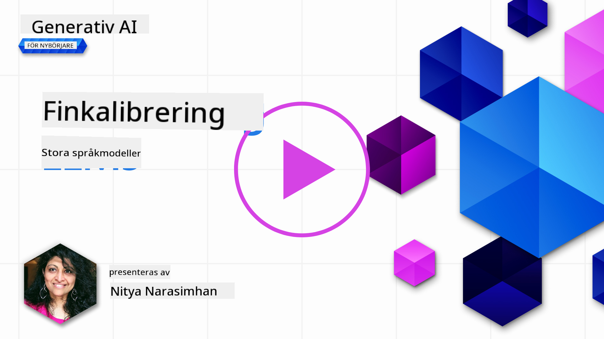
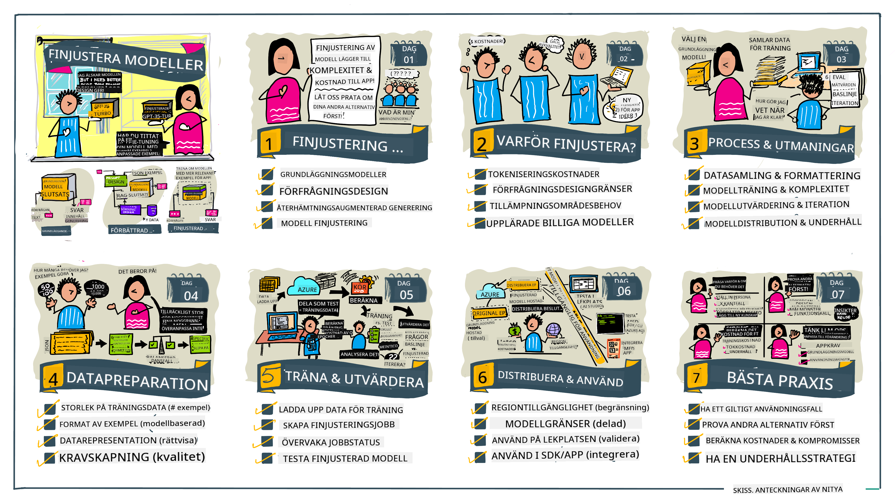

<!--
CO_OP_TRANSLATOR_METADATA:
{
  "original_hash": "68664f7e754a892ae1d8d5e2b7bd2081",
  "translation_date": "2025-05-20T07:49:35+00:00",
  "source_file": "18-fine-tuning/README.md",
  "language_code": "sv"
}
-->

# Finjustera din LLM

Att använda stora språkmodeller för att bygga generativa AI-applikationer medför nya utmaningar. En viktig fråga är att säkerställa svarskvaliteten (noggrannhet och relevans) i innehåll som genereras av modellen för en given användarförfrågan. I tidigare lektioner diskuterade vi tekniker som promptteknik och retrieval-augmented generation som försöker lösa problemet genom att _modifiera promptinmatningen_ till den befintliga modellen.

I dagens lektion diskuterar vi en tredje teknik, **finjustering**, som försöker lösa utmaningen genom att _träna om modellen själv_ med ytterligare data. Låt oss dyka in i detaljerna.

## Inlärningsmål

Denna lektion introducerar konceptet finjustering för förtränade språkmodeller, utforskar fördelarna och utmaningarna med detta tillvägagångssätt, och ger vägledning om när och hur man använder finjustering för att förbättra prestandan hos dina generativa AI-modeller.

I slutet av denna lektion bör du kunna svara på följande frågor:

- Vad är finjustering för språkmodeller?
- När, och varför, är finjustering användbar?
- Hur kan jag finjustera en förtränad modell?
- Vilka är begränsningarna med finjustering?

Redo? Låt oss börja.

## Illustrerad guide

Vill du få en överblick över vad vi kommer att täcka innan vi dyker in? Kolla in denna illustrerade guide som beskriver lärandeprocessen för denna lektion - från att lära sig kärnkoncepten och motivationen för finjustering, till att förstå processen och bästa praxis för att utföra finjusteringsuppgiften. Detta är ett fascinerande ämne för utforskning, så glöm inte att kolla in [Resurser](./RESOURCES.md?WT.mc_id=academic-105485-koreyst) sidan för ytterligare länkar för att stödja din självstyrda inlärningsresa!

## Vad är finjustering för språkmodeller?

Per definition är stora språkmodeller _förtränade_ på stora mängder text hämtad från olika källor, inklusive internet. Som vi har lärt oss i tidigare lektioner behöver vi tekniker som _promptteknik_ och _retrieval-augmented generation_ för att förbättra kvaliteten på modellens svar på användarens frågor ("prompter").

En populär promptteknik innebär att ge modellen mer vägledning om vad som förväntas i svaret antingen genom att ge _instruktioner_ (explicit vägledning) eller _ge den några exempel_ (implicit vägledning). Detta kallas _few-shot learning_ men det har två begränsningar:

- Modellens tokenbegränsningar kan begränsa antalet exempel du kan ge och begränsa effektiviteten.
- Modellens tokenkostnader kan göra det dyrt att lägga till exempel till varje prompt och begränsa flexibiliteten.

Finjustering är en vanlig praxis i maskininlärningssystem där vi tar en förtränad modell och tränar om den med ny data för att förbättra dess prestanda på en specifik uppgift. I sammanhanget av språkmodeller kan vi finjustera den förtränade modellen _med en noggrant utvald uppsättning exempel för en given uppgift eller applikationsdomän_ för att skapa en **anpassad modell** som kan vara mer exakt och relevant för den specifika uppgiften eller domänen. En bieffekt av finjustering är att den också kan minska antalet exempel som behövs för few-shot learning - vilket minskar tokenanvändning och relaterade kostnader.

## När och varför bör vi finjustera modeller?

I _detta_ sammanhang, när vi talar om finjustering, hänvisar vi till **övervakad** finjustering där omträningen görs genom att **lägga till ny data** som inte var en del av den ursprungliga träningsdatamängden. Detta skiljer sig från ett oövervakat finjusteringstillvägagångssätt där modellen tränas om på den ursprungliga datan, men med olika hyperparametrar.

Det viktigaste att komma ihåg är att finjustering är en avancerad teknik som kräver en viss nivå av expertis för att få önskade resultat. Om det görs felaktigt kan det inte ge de förväntade förbättringarna och kan till och med försämra modellens prestanda för din måldomän.

Så innan du lär dig "hur" du finjusterar språkmodeller, behöver du veta "varför" du bör ta denna väg och "när" du ska börja processen med finjustering. Börja med att ställa dig själv dessa frågor:

- **Användningsfall**: Vad är ditt _användningsfall_ för finjustering? Vilken aspekt av den nuvarande förtränade modellen vill du förbättra?
- **Alternativ**: Har du provat _andra tekniker_ för att uppnå de önskade resultaten? Använd dem för att skapa en baslinje för jämförelse.
  - Promptteknik: Prova tekniker som få-shot-prompting med exempel på relevanta prompt-svar. Utvärdera svarens kvalitet.
  - Retrieval Augmented Generation: Försök att förstärka prompter med sökresultat hämtade genom att söka i din data. Utvärdera svarens kvalitet.
- **Kostnader**: Har du identifierat kostnaderna för finjustering?
  - Justerbarhet - är den förtränade modellen tillgänglig för finjustering?
  - Insats - för att förbereda träningsdata, utvärdera och förfina modellen.
  - Beräkning - för att köra finjusteringsjobb och distribuera finjusterad modell.
  - Data - tillgång till tillräckligt många kvalitativa exempel för finjusteringspåverkan.
- **Fördelar**: Har du bekräftat fördelarna med finjustering?
  - Kvalitet - överträffade den finjusterade modellen baslinjen?
  - Kostnad - minskar den tokenanvändningen genom att förenkla prompter?
  - Utbyggbarhet - kan du återanvända basmodellen för nya domäner?

Genom att svara på dessa frågor bör du kunna avgöra om finjustering är rätt tillvägagångssätt för ditt användningsfall. Idealiskt är tillvägagångssättet giltigt endast om fördelarna överväger kostnaderna. När du har bestämt dig för att gå vidare är det dags att tänka på _hur_ du kan finjustera den förtränade modellen.

Vill du få mer insikt i beslutsprocessen? Titta på [To fine-tune or not to fine-tune](https://www.youtube.com/watch?v=0Jo-z-MFxJs)

## Hur kan vi finjustera en förtränad modell?

För att finjustera en förtränad modell behöver du ha:

- en förtränad modell att finjustera
- en datamängd att använda för finjustering
- en träningsmiljö för att köra finjusteringsjobbet
- en värdmiljö för att distribuera den finjusterade modellen

## Finjustering i praktiken

Följande resurser ger steg-för-steg-handledningar för att guida dig genom ett verkligt exempel med en utvald modell och en noggrant utvald datamängd. För att arbeta igenom dessa handledningar behöver du ett konto hos den specifika leverantören, tillsammans med tillgång till den relevanta modellen och datamängderna.

| Leverantör   | Handledning                                                                                                                                                                      | Beskrivning                                                                                                                                                                                                                                                                                                                                                                                                                          |
| ------------ | -------------------------------------------------------------------------------------------------------------------------------------------------------------------------------- | ------------------------------------------------------------------------------------------------------------------------------------------------------------------------------------------------------------------------------------------------------------------------------------------------------------------------------------------------------------------------------------------------------------------------------------- |
| OpenAI       | [How to fine-tune chat models](https://github.com/openai/openai-cookbook/blob/main/examples/How_to_finetune_chat_models.ipynb?WT.mc_id=academic-105485-koreyst)                | Lär dig att finjustera en `gpt-35-turbo` för en specifik domän ("receptassistent") genom att förbereda träningsdata, köra finjusteringsjobbet och använda den finjusterade modellen för inferens.                                                                                                                                                                                                                                    |
| Azure OpenAI | [GPT 3.5 Turbo fine-tuning tutorial](https://learn.microsoft.com/azure/ai-services/openai/tutorials/fine-tune?tabs=python-new%2Ccommand-line?WT.mc_id=academic-105485-koreyst) | Lär dig att finjustera en `gpt-35-turbo-0613` modell **på Azure** genom att ta steg för att skapa och ladda upp träningsdata, köra finjusteringsjobbet. Distribuera och använd den nya modellen.                                                                                                                                                                                                                                          |
| Hugging Face | [Fine-tuning LLMs with Hugging Face](https://www.philschmid.de/fine-tune-llms-in-2024-with-trl?WT.mc_id=academic-105485-koreyst)                                               | Detta blogginlägg guidar dig genom finjustering av en _öppen LLM_ (ex: `CodeLlama 7B`) med hjälp av [transformers](https://huggingface.co/docs/transformers/index?WT.mc_id=academic-105485-koreyst) biblioteket & [Transformer Reinforcement Learning (TRL)](https://huggingface.co/docs/trl/index?WT.mc_id=academic-105485-koreyst]) med öppna [datasets](https://huggingface.co/docs/datasets/index?WT.mc_id=academic-105485-koreyst) på Hugging Face. |
|              |                                                                                                                                                                                  |                                                                                                                                                                                                                                                                                                                                                                                                                                       |
| 🤗 AutoTrain | [Fine-tuning LLMs with AutoTrain](https://github.com/huggingface/autotrain-advanced/?WT.mc_id=academic-105485-koreyst)                                                         | AutoTrain (eller AutoTrain Advanced) är ett python-bibliotek utvecklat av Hugging Face som möjliggör finjustering för många olika uppgifter inklusive LLM finjustering. AutoTrain är en kodfri lösning och finjustering kan göras i din egen moln, på Hugging Face Spaces eller lokalt. Det stöder både en webbaserad GUI, CLI och träning via yaml-konfigurationsfiler.                                                                 |

## Uppgift

Välj en av handledningarna ovan och gå igenom dem. _Vi kan replikera en version av dessa handledningar i Jupyter Notebooks i detta repo endast som referens. Använd de ursprungliga källorna direkt för att få de senaste versionerna_.

## Bra jobbat! Fortsätt ditt lärande.

Efter att ha slutfört denna lektion, kolla in vår [Generative AI Learning collection](https://aka.ms/genai-collection?WT.mc_id=academic-105485-koreyst) för att fortsätta förbättra din kunskap om Generativ AI!

Grattis!! Du har slutfört den sista lektionen från v2-serien för denna kurs! Sluta inte lära och bygga. **Kolla in [RESURSER](RESOURCES.md?WT.mc_id=academic-105485-koreyst) sidan för en lista över ytterligare förslag för just detta ämne.

Vår v1-serie av lektioner har också uppdaterats med fler uppgifter och koncept. Så ta en minut för att fräscha upp din kunskap - och vänligen [dela dina frågor och feedback](https://github.com/microsoft/generative-ai-for-beginners/issues?WT.mc_id=academic-105485-koreyst) för att hjälpa oss att förbättra dessa lektioner för samhället.

**Ansvarsfriskrivning**:  
Detta dokument har översatts med hjälp av AI-översättningstjänsten [Co-op Translator](https://github.com/Azure/co-op-translator). Även om vi strävar efter noggrannhet, var medveten om att automatiserade översättningar kan innehålla fel eller felaktigheter. Det ursprungliga dokumentet på sitt modersmål bör betraktas som den auktoritativa källan. För kritisk information rekommenderas professionell mänsklig översättning. Vi ansvarar inte för eventuella missförstånd eller feltolkningar som uppstår vid användningen av denna översättning.