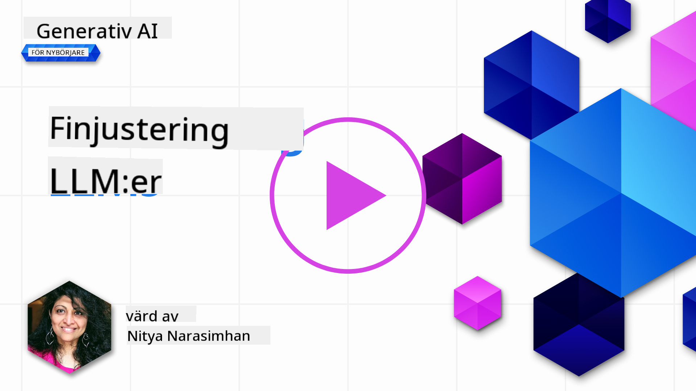

<!--
CO_OP_TRANSLATOR_METADATA:
{
  "original_hash": "68664f7e754a892ae1d8d5e2b7bd2081",
  "translation_date": "2025-07-09T17:44:01+00:00",
  "source_file": "18-fine-tuning/README.md",
  "language_code": "sv"
}
-->

# Finjustera din LLM

Att använda stora språkmodeller för att bygga generativa AI-applikationer innebär nya utmaningar. En viktig fråga är att säkerställa svarskvalitet (noggrannhet och relevans) i det innehåll som modellen genererar för en given användarförfrågan. I tidigare lektioner har vi diskuterat tekniker som prompt engineering och retrieval-augmented generation som försöker lösa problemet genom att _modifiera promptinmatningen_ till den befintliga modellen.

I dagens lektion tar vi upp en tredje teknik, **finjustering**, som försöker hantera utmaningen genom att _träna om modellen själv_ med ytterligare data. Låt oss gå in på detaljerna.

## Lärandemål

Den här lektionen introducerar begreppet finjustering för förtränade språkmodeller, utforskar fördelar och utmaningar med detta tillvägagångssätt och ger vägledning om när och hur man använder finjustering för att förbättra prestandan hos dina generativa AI-modeller.

I slutet av lektionen ska du kunna svara på följande frågor:

- Vad är finjustering för språkmodeller?
- När och varför är finjustering användbart?
- Hur kan jag finjustera en förtränad modell?
- Vilka är begränsningarna med finjustering?

Redo? Då kör vi.

## Illustrerad guide

Vill du få en överblick över vad vi kommer att gå igenom innan vi dyker ner i detaljerna? Kolla in denna illustrerade guide som beskriver läranderesan för denna lektion – från att lära sig kärnkoncepten och motivationen för finjustering, till att förstå processen och bästa praxis för att genomföra finjusteringsuppgiften. Det här är ett fascinerande ämne att utforska, så glöm inte att titta på [Resurser](./RESOURCES.md?WT.mc_id=academic-105485-koreyst) för fler länkar som stödjer din självstyrda läranderesa!

## Vad är finjustering för språkmodeller?

Per definition är stora språkmodeller _förtränade_ på stora mängder text från olika källor, inklusive internet. Som vi lärt oss i tidigare lektioner behöver vi tekniker som _prompt engineering_ och _retrieval-augmented generation_ för att förbättra kvaliteten på modellens svar på användarens frågor ("prompter").

En populär prompt-engineering-teknik innebär att ge modellen mer vägledning om vad som förväntas i svaret, antingen genom att ge _instruktioner_ (explicit vägledning) eller _ge några exempel_ (implicit vägledning). Detta kallas _few-shot learning_ men har två begränsningar:

- Modellens tokenbegränsningar kan begränsa antalet exempel du kan ge och minska effektiviteten.
- Kostnaden för tokens kan göra det dyrt att lägga till exempel i varje prompt och begränsa flexibiliteten.

Finjustering är en vanlig metod inom maskininlärningssystem där man tar en förtränad modell och tränar om den med ny data för att förbättra dess prestanda på en specifik uppgift. I språkmodellernas sammanhang kan vi finjustera den förtränade modellen _med en noggrant utvald uppsättning exempel för en viss uppgift eller applikationsdomän_ för att skapa en **anpassad modell** som kan vara mer exakt och relevant för just den uppgiften eller domänen. En extra fördel med finjustering är att det också kan minska antalet exempel som behövs för few-shot learning – vilket minskar tokenanvändning och relaterade kostnader.

## När och varför bör vi finjustera modeller?

I _detta_ sammanhang, när vi pratar om finjustering, syftar vi på **övervakad** finjustering där omträningen görs genom att **lägga till ny data** som inte ingick i den ursprungliga träningsdatan. Detta skiljer sig från en oövervakad finjusteringsmetod där modellen tränas om på originaldatan, men med andra hyperparametrar.

Det viktigaste att komma ihåg är att finjustering är en avancerad teknik som kräver en viss nivå av expertis för att uppnå önskade resultat. Om det görs felaktigt kan det leda till att förbättringarna uteblir, eller till och med försämra modellens prestanda för din specifika domän.

Så innan du lär dig "hur" man finjusterar språkmodeller, behöver du veta "varför" du ska ta denna väg och "när" du ska starta finjusteringsprocessen. Börja med att ställa dig själv dessa frågor:

- **Användningsfall**: Vad är ditt _användningsfall_ för finjustering? Vilken aspekt av den nuvarande förtränade modellen vill du förbättra?
- **Alternativ**: Har du provat _andra tekniker_ för att uppnå önskat resultat? Använd dem för att skapa en baslinje att jämföra med.
  - Prompt engineering: Prova tekniker som few-shot prompting med exempel på relevanta prompt-svar. Utvärdera svarens kvalitet.
  - Retrieval Augmented Generation: Prova att förstärka prompts med sökresultat från din data. Utvärdera svarens kvalitet.
- **Kostnader**: Har du identifierat kostnaderna för finjustering?
  - Möjlighet till justering – är den förtränade modellen tillgänglig för finjustering?
  - Arbetsinsats – för att förbereda träningsdata, utvärdera och förfina modellen.
  - Beräkningsresurser – för att köra finjusteringsjobb och distribuera den finjusterade modellen.
  - Data – tillgång till tillräckligt många kvalitativa exempel för att finjusteringen ska få effekt.
- **Fördelar**: Har du bekräftat fördelarna med finjustering?
  - Kvalitet – presterade den finjusterade modellen bättre än baslinjen?
  - Kostnad – minskar det tokenanvändningen genom att förenkla prompts?
  - Utbyggbarhet – kan du återanvända basmodellen för nya domäner?

Genom att svara på dessa frågor bör du kunna avgöra om finjustering är rätt metod för ditt användningsfall. Idealiskt är metoden bara giltig om fördelarna överväger kostnaderna. När du bestämt dig för att gå vidare är det dags att fundera på _hur_ du kan finjustera den förtränade modellen.

Vill du få fler insikter om beslutsprocessen? Titta på [To fine-tune or not to fine-tune](https://www.youtube.com/watch?v=0Jo-z-MFxJs)

## Hur kan vi finjustera en förtränad modell?

För att finjustera en förtränad modell behöver du:

- en förtränad modell att finjustera
- en dataset att använda för finjustering
- en träningsmiljö för att köra finjusteringsjobbet
- en hostingmiljö för att distribuera den finjusterade modellen

## Finjustering i praktiken

Följande resurser erbjuder steg-för-steg-handledning som tar dig igenom ett verkligt exempel med en utvald modell och en noggrant utvald dataset. För att arbeta med dessa handledningar behöver du ett konto hos respektive leverantör, samt tillgång till relevant modell och dataset.

| Leverantör  | Handledning                                                                                                                                                                  | Beskrivning                                                                                                                                                                                                                                                                                                                                                                                                                      |
| ----------- | --------------------------------------------------------------------------------------------------------------------------------------------------------------------------- | -------------------------------------------------------------------------------------------------------------------------------------------------------------------------------------------------------------------------------------------------------------------------------------------------------------------------------------------------------------------------------------------------------------------------------- |
| OpenAI      | [How to fine-tune chat models](https://github.com/openai/openai-cookbook/blob/main/examples/How_to_finetune_chat_models.ipynb?WT.mc_id=academic-105485-koreyst)               | Lär dig finjustera en `gpt-35-turbo` för en specifik domän ("receptassistent") genom att förbereda träningsdata, köra finjusteringsjobbet och använda den finjusterade modellen för inferens.                                                                                                                                                                                                                                   |
| Azure OpenAI| [GPT 3.5 Turbo fine-tuning tutorial](https://learn.microsoft.com/azure/ai-services/openai/tutorials/fine-tune?tabs=python-new%2Ccommand-line?WT.mc_id=academic-105485-koreyst) | Lär dig finjustera en `gpt-35-turbo-0613` modell **på Azure** genom att skapa och ladda upp träningsdata, köra finjusteringsjobbet samt distribuera och använda den nya modellen.                                                                                                                                                                                                                                                |
| Hugging Face| [Fine-tuning LLMs with Hugging Face](https://www.philschmid.de/fine-tune-llms-in-2024-with-trl?WT.mc_id=academic-105485-koreyst)                                            | Denna bloggpost visar hur du finjusterar en _öppen LLM_ (t.ex. `CodeLlama 7B`) med hjälp av [transformers](https://huggingface.co/docs/transformers/index?WT.mc_id=academic-105485-koreyst) biblioteket och [Transformer Reinforcement Learning (TRL)](https://huggingface.co/docs/trl/index?WT.mc_id=academic-105485-koreyst) med öppna [datasets](https://huggingface.co/docs/datasets/index?WT.mc_id=academic-105485-koreyst) på Hugging Face. |
|             |                                                                                                                                                                             |                                                                                                                                                                                                                                                                                                                                                                                                                                  |
| 🤗 AutoTrain| [Fine-tuning LLMs with AutoTrain](https://github.com/huggingface/autotrain-advanced/?WT.mc_id=academic-105485-koreyst)                                                      | AutoTrain (eller AutoTrain Advanced) är ett pythonbibliotek utvecklat av Hugging Face som möjliggör finjustering för många olika uppgifter, inklusive LLM-finjustering. AutoTrain är en kodfri lösning och finjustering kan göras i din egen molnmiljö, på Hugging Face Spaces eller lokalt. Det stöder både webbaserat GUI, CLI och träning via yaml-konfigurationsfiler.                                                                                 |
|             |                                                                                                                                                                             |                                                                                                                                                                                                                                                                                                                                                                                                                                  |

## Uppgift

Välj en av handledningarna ovan och gå igenom den. _Vi kan komma att replikera en version av dessa handledningar i Jupyter Notebooks i detta repo för referens. Använd gärna originalkällorna direkt för att få de senaste versionerna_.

## Bra jobbat! Fortsätt din lärande.

Efter att ha slutfört denna lektion, kolla in vår [Generative AI Learning collection](https://aka.ms/genai-collection?WT.mc_id=academic-105485-koreyst) för att fortsätta utveckla din kunskap inom Generativ AI!

Grattis!! Du har avslutat den sista lektionen i v2-serien för denna kurs! Sluta inte att lära och bygga. \*\*Kolla in [RESOURCES](RESOURCES.md?WT.mc_id=academic-105485-koreyst) sidan för en lista med fler förslag just för detta ämne.

Vår v1-serie av lektioner har också uppdaterats med fler uppgifter och koncept. Ta en minut att fräscha upp dina kunskaper – och vänligen [dela dina frågor och feedback](https://github.com/microsoft/generative-ai-for-beginners/issues?WT.mc_id=academic-105485-koreyst) för att hjälpa oss förbättra dessa lektioner för communityn.

**Ansvarsfriskrivning**:  
Detta dokument har översatts med hjälp av AI-översättningstjänsten [Co-op Translator](https://github.com/Azure/co-op-translator). Även om vi strävar efter noggrannhet, vänligen observera att automatiska översättningar kan innehålla fel eller brister. Det ursprungliga dokumentet på dess modersmål bör betraktas som den auktoritativa källan. För kritisk information rekommenderas professionell mänsklig översättning. Vi ansvarar inte för några missförstånd eller feltolkningar som uppstår vid användning av denna översättning.