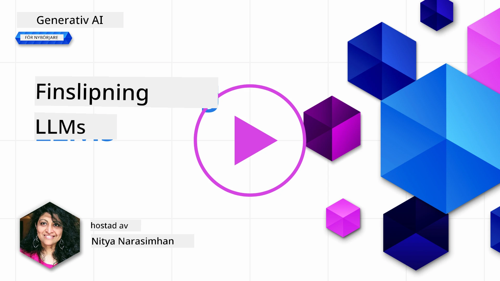
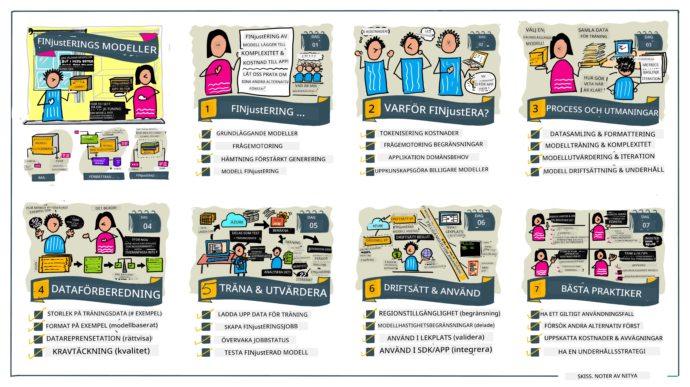

# Finsjustering av din LLM

Att använda stora språkmodeller för att bygga generativa AI-applikationer medför nya utmaningar. En nyckelfråga är att säkerställa svarskvalitet (noggrannhet och relevans) i innehållet som genereras av modellen för en viss användarförfrågan. I tidigare lektioner har vi diskuterat tekniker som promptingenjörskap och återhämtningsförstärkt generering som försöker lösa problemet genom att _modifiera promptinmatningen_ till den befintliga modellen.

I dagens lektion diskuterar vi en tredje teknik, **finsjustering**, som försöker hantera utmaningen genom att _omträna modellen själv_ med ytterligare data. Låt oss dyka in i detaljerna.

## Lärandemål

Denna lektion introducerar konceptet finsjustering för förtränade språkmodeller, utforskar fördelar och utmaningar med denna metod och ger vägledning om när och hur man använder finsjustering för att förbättra prestandan hos dina generativa AI-modeller.

I slutet av denna lektion bör du kunna svara på följande frågor:

- Vad är finsjustering för språkmodeller?
- När och varför är finsjustering användbart?
- Hur kan jag finsjustera en förtränad modell?
- Vilka är begränsningarna med finsjustering?

Redo? Låt oss börja.

## Illustrerad guide

Vill du få en överblick över vad vi kommer att täcka innan vi går in på detaljer? Kolla in denna illustrerade guide som beskriver läranderesan för denna lektion – från att lära sig kärnkoncepten och motivationen för finsjustering till att förstå processen och bästa praxis för att genomföra finsjusteringsuppgiften. Detta är ett fascinerande ämne att utforska, så glöm inte att kolla sidan [Resurser](./RESOURCES.md?WT.mc_id=academic-105485-koreyst) för ytterligare länkar som stöder din självstyrda läranderesa!

## Vad är finsjustering för språkmodeller?

Enligt definition är stora språkmodeller _förtränade_ på stora mängder text från olika källor, inklusive internet. Som vi lärt oss i tidigare lektioner behöver vi tekniker som _promptingenjörskap_ och _återhämtningsförstärkt generering_ för att förbättra kvaliteten på modellens svar på användarens frågor ("prompter").

En populär teknik inom promptingenjörskap innebär att ge modellen mer vägledning om vad som förväntas i svaret, antingen genom att ge _instruktioner_ (explicit vägledning) eller _ge den några exempel_ (implicit vägledning). Detta kallas _few-shot learning_ men har två begränsningar:

- Modellens tokenbegränsningar kan begränsa antalet exempel du kan ge och minska effektiviteten.
- Modellens tokenkostnader kan göra det dyrt att lägga till exempel till varje prompt och begränsa flexibiliteten.

Finsjustering är en vanlig metod inom maskininlärning där man tar en förtränad modell och tränar om den med nya data för att förbättra dess prestanda på en specifik uppgift. I sammanhanget med språkmodeller kan vi finsjustera den förtränade modellen _med en noggrant utvald uppsättning exempel för en viss uppgift eller applikationsdomän_ för att skapa en **anpassad modell** som kan vara mer exakt och relevant för just den uppgiften eller domänen. En extra fördel med finsjustering är att det också kan minska antalet exempel som behövs för few-shot learning – vilket minskar tokenanvändningen och relaterade kostnader.

## När och varför ska vi finsjustera modeller?

I _detta_ sammanhang när vi pratar om finsjustering avser vi **övervakad** finsjustering där omträningen görs genom att **lägga till ny data** som inte var del av den ursprungliga träningsdatan. Detta skiljer sig från en icke-övervakad finsjusteringsmetod där modellen tränas om på originaldatan men med olika hyperparametrar.

Det viktiga att komma ihåg är att finsjustering är en avancerad teknik som kräver en viss nivå av expertis för att uppnå önskat resultat. Om det görs felaktigt kan det ge förväntade förbättringar eller till och med försämra modellens prestanda för din målade domän.

Så, innan du lär dig "hur" man finsjusterar språkmodeller, behöver du veta "varför" du ska ta denna väg, och "när" du ska påbörja processen för finsjustering. Börja med att ställa dig själv dessa frågor:

- **Användningsfall**: Vad är ditt _användningsfall_ för finsjustering? Vilken aspekt av den nuvarande förtränade modellen vill du förbättra?
- **Alternativ**: Har du försökt med _andra tekniker_ för att uppnå önskat resultat? Använd dem för att skapa en baslinje för jämförelse.
  - Promptingenjörskap: Prova tekniker som few-shot prompting med exempel på relevanta promptsvar. Utvärdera svarens kvalitet.
  - Återhämtningsförstärkt generering: Försök att förstärka prompts med sökresultat från dina data. Utvärdera svarens kvalitet.
- **Kostnader**: Har du identifierat kostnaderna för finsjustering?
  - Justerbarhet – är den förtränade modellen tillgänglig för finsjustering?
  - Insats – för att förbereda träningsdata, utvärdera och förfina modellen.
  - Beräkning – för att köra finsjusteringsjobb och distribuera den finsjusterade modellen.
  - Data – tillgång till tillräckligt kvalitativa exempel för finsjusteringens effekt.
- **Fördelar**: Har du bekräftat fördelarna med finsjustering?
  - Kvalitet – överträffade den finsjusterade modellen baslinjen?
  - Kostnad – minskar det tokenanvändningen genom att förenkla prompts?
  - Utbyggbarhet – kan du återanvända basmodellen för nya domäner?

Genom att svara på dessa frågor bör du kunna avgöra om finsjustering är rätt metod för ditt användningsfall. Helst är tillvägagångssättet giltigt endast om fördelarna överväger kostnaderna. När du bestämt dig för att gå vidare är det dags att fundera på _hur_ du kan finsjustera den förtränade modellen.

Vill du få mer insikt i beslutsprocessen? Se [To fine-tune or not to fine-tune](https://www.youtube.com/watch?v=0Jo-z-MFxJs)

## Hur kan vi finsjustera en förtränad modell?

För att finsjustera en förtränad modell behöver du:

- en förtränad modell att finsjustera
- en dataset att använda för finsjustering
- en träningsmiljö för att köra finsjusteringsjobbet
- en hostingmiljö för att distribuera den finsjusterade modellen

## Finsjustering i praktiken

Följande resurser erbjuder steg-för-steg-handledning som går igenom ett verkligt exempel med en utvald modell och en kuraterad dataset. För att arbeta med dessa handledningar behöver du ett konto hos respektive leverantör samt tillgång till relevant modell och dataset.

| Leverantör   | Handledning                                                                                                                                                                   | Beskrivning                                                                                                                                                                                                                                                                                                                                                                                                                      |
| ------------ | ----------------------------------------------------------------------------------------------------------------------------------------------------------------------------- | -------------------------------------------------------------------------------------------------------------------------------------------------------------------------------------------------------------------------------------------------------------------------------------------------------------------------------------------------------------------------------------------------------------------------------- |
| OpenAI       | [Hur man finsjusterar chattmodeller](https://github.com/openai/openai-cookbook/blob/main/examples/How_to_finetune_chat_models.ipynb?WT.mc_id=academic-105485-koreyst)           | Lär dig att finsjustera en `gpt-35-turbo` för en specifik domän ("receptassistent") genom att förbereda träningsdata, köra finsjusteringsjobbet och använda den finsjusterade modellen för inferens.                                                                                                                                                                                                                            |
| Azure OpenAI | [GPT 3.5 Turbo finsjusteringshandledning](https://learn.microsoft.com/azure/ai-services/openai/tutorials/fine-tune?tabs=python-new%2Ccommand-line&WT.mc_id=academic-105485-koreyst) | Lär dig att finsjustera en `gpt-35-turbo-0613`-modell **på Azure** genom att skapa och ladda upp träningsdata, köra finsjusteringsjobbet, distribuera och använda den nya modellen.                                                                                                                                                                                                                                             |
| Hugging Face | [Finsjustera LLM:er med Hugging Face](https://www.philschmid.de/fine-tune-llms-in-2024-with-trl?WT.mc_id=academic-105485-koreyst)                                              | Denna bloggpost visar hur du finsjusterar en _öppen LLM_ (t.ex. `CodeLlama 7B`) med hjälp av [transformers](https://huggingface.co/docs/transformers/index?WT.mc_id=academic-105485-koreyst) biblioteket & [Transformer Reinforcement Learning (TRL)](https://huggingface.co/docs/trl/index?WT.mc_id=academic-105485-koreyst) med öppna [datasets](https://huggingface.co/docs/datasets/index?WT.mc_id=academic-105485-koreyst) på Hugging Face. |
|              |                                                                                                                                                                               |                                                                                                                                                                                                                                                                                                                                                                                                                                  |
| 🤗 AutoTrain | [Finsjustera LLM:er med AutoTrain](https://github.com/huggingface/autotrain-advanced/?WT.mc_id=academic-105485-koreyst)                                                        | AutoTrain (eller AutoTrain Advanced) är ett pythonbibliotek utvecklat av Hugging Face som möjliggör finsjustering för många olika uppgifter, inklusive finsjustering av LLM:er. AutoTrain är en kodfri lösning och finsjustering kan göras i din egen molnmiljö, på Hugging Face Spaces eller lokalt. Det stöder både webbaserat gränssnitt, CLI och träning via yaml-konfigurationsfiler.                                                                                   |
|              |                                                                                                                                                                               |                                                                                                                                                                                                                                                                                                                                                                                                                                  |
| 🦥 Unsloth   | [Finsjustera LLM:er med Unsloth](https://github.com/unslothai/unsloth)                                                                                                       | Unsloth är ett open source-ramverk som stöder finsjustering av LLM:er och förstärkningsinlärning (RL). Unsloth effektiviserar lokal träning, utvärdering och distribution med färdiga [notebooks](https://github.com/unslothai/notebooks). Det stöder även text-till-tal (TTS), BERT och multimodala modeller. För att komma igång, läs deras steg-för-steg [Finsjusteringsguide för LLMs](https://docs.unsloth.ai/get-started/fine-tuning-llms-guide).                                      |
|              |                                                                                                                                                                               |                                                                                                                                                                                                                                                                                                                                                                                                                                  |
## Uppgift

Välj en av handledningarna ovan och gå igenom den. _Vi kan komma att replikera en version av dessa handledningar i Jupyter Notebooks i detta repo endast för referens. Använd gärna de ursprungliga källorna direkt för att få de senaste versionerna_.

## Bra jobbat! Fortsätt ditt lärande.

Efter att ha slutfört denna lektion, kolla in vår [Generative AI Learning collection](https://aka.ms/genai-collection?WT.mc_id=academic-105485-koreyst) för att fortsätta utveckla dina kunskaper inom Generativ AI!

Grattis!! Du har avslutat den sista lektionen från v2-serien för denna kurs! Sluta inte att lära och bygga. \*\*Kolla in sidan [RESURSER](RESOURCES.md?WT.mc_id=academic-105485-koreyst) för en lista med fler förslag för just detta ämne.

Vår v1-serie av lektioner har också uppdaterats med fler uppgifter och koncept. Ta därför en minut för att fräscha upp dina kunskaper – och vänligen [dela dina frågor och feedback](https://github.com/microsoft/generative-ai-for-beginners/issues?WT.mc_id=academic-105485-koreyst) för att hjälpa oss förbättra dessa lektioner för communityn.

---

<!-- CO-OP TRANSLATOR DISCLAIMER START -->
**Ansvarsfriskrivning**:
Detta dokument har översatts med hjälp av AI-översättningstjänsten [Co-op Translator](https://github.com/Azure/co-op-translator). Även om vi strävar efter noggrannhet, vänligen notera att automatiska översättningar kan innehålla fel eller brister. Det ursprungliga dokumentet på dess modersmål ska betraktas som den auktoritativa källan. För kritisk information rekommenderas professionell mänsklig översättning. Vi ansvarar inte för några missförstånd eller feltolkningar som uppstår från användningen av denna översättning.
<!-- CO-OP TRANSLATOR DISCLAIMER END -->