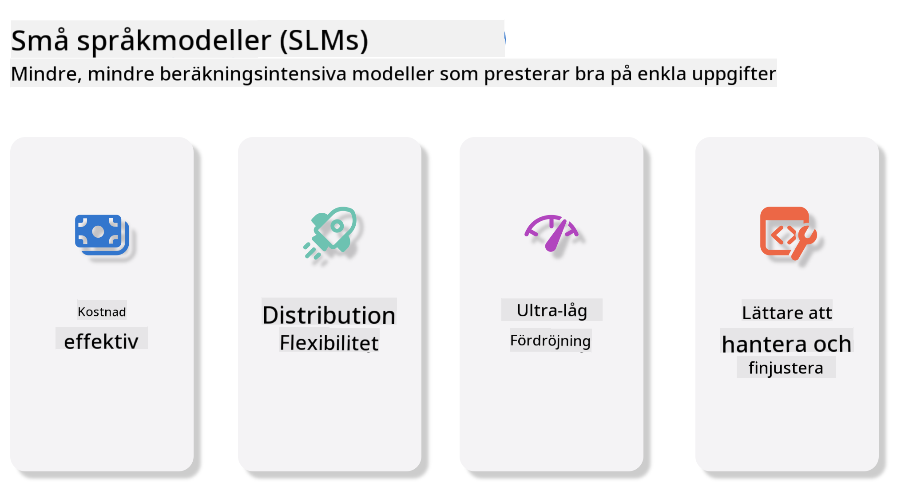
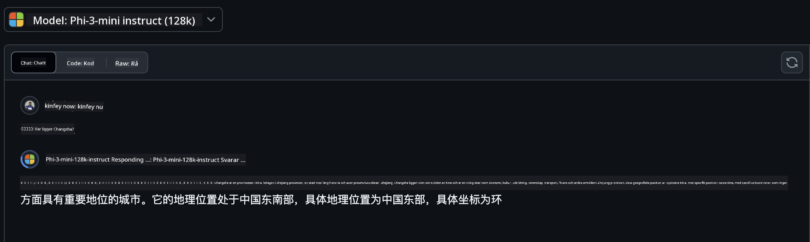
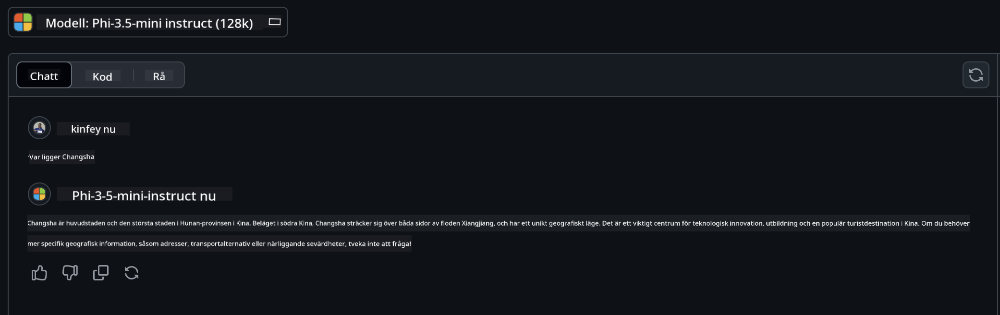

<!--
CO_OP_TRANSLATOR_METADATA:
{
  "original_hash": "124ad36cfe96f74038811b6e2bb93e9d",
  "translation_date": "2025-05-20T09:58:24+00:00",
  "source_file": "19-slm/README.md",
  "language_code": "sv"
}
-->
# Introduktion till små språkmodeller för generativ AI för nybörjare

Generativ AI är ett fascinerande område inom artificiell intelligens som fokuserar på att skapa system som kan generera nytt innehåll. Detta innehåll kan sträcka sig från text och bilder till musik och till och med hela virtuella miljöer. En av de mest spännande tillämpningarna av generativ AI är inom området språkmodeller.

## Vad är små språkmodeller?

En liten språkmodell (SLM) representerar en nedskalad variant av en stor språkmodell (LLM), som utnyttjar många av de arkitektoniska principerna och teknikerna hos LLMs, samtidigt som den uppvisar en betydligt reducerad beräkningsfotavtryck. SLMs är en undergrupp av språkmodeller som är utformade för att generera människoliknande text. Till skillnad från deras större motsvarigheter, såsom GPT-4, är SLMs mer kompakta och effektiva, vilket gör dem idealiska för tillämpningar där beräkningsresurser är begränsade. Trots sin mindre storlek kan de fortfarande utföra en mängd olika uppgifter. Typiskt konstrueras SLMs genom att komprimera eller destillera LLMs, med målet att behålla en betydande del av den ursprungliga modellens funktionalitet och språkliga kapaciteter. Denna minskning av modellstorlek minskar den övergripande komplexiteten, vilket gör SLMs mer effektiva både vad gäller minnesanvändning och beräkningskrav. Trots dessa optimeringar kan SLMs fortfarande utföra ett brett spektrum av uppgifter inom naturlig språkbehandling (NLP):

- Textgenerering: Skapa sammanhängande och kontextuellt relevanta meningar eller stycken.
- Textkomplettering: Förutsäga och komplettera meningar baserat på en given uppmaning.
- Översättning: Konvertera text från ett språk till ett annat.
- Sammanfattning: Komprimera långa textstycken till kortare, mer lättsmälta sammanfattningar.

Även om det finns vissa kompromisser i prestanda eller djup förståelse jämfört med deras större motsvarigheter.

## Hur fungerar små språkmodeller?

SLMs tränas på stora mängder textdata. Under träningen lär de sig språkets mönster och strukturer, vilket gör det möjligt för dem att generera text som är både grammatiskt korrekt och kontextuellt lämplig. Träningsprocessen innefattar:

- Datainsamling: Samla stora dataset av text från olika källor.
- Förbearbetning: Rensa och organisera data för att göra den lämplig för träning.
- Träning: Använda maskininlärningsalgoritmer för att lära modellen att förstå och generera text.
- Finjustering: Justera modellen för att förbättra dess prestanda på specifika uppgifter.

Utvecklingen av SLMs ligger i linje med det ökande behovet av modeller som kan distribueras i resursbegränsade miljöer, såsom mobila enheter eller edge-datorplattformar, där fullskaliga LLMs kan vara opraktiska på grund av deras höga resurskrav. Genom att fokusera på effektivitet balanserar SLMs prestanda med tillgänglighet, vilket möjliggör bredare tillämpning över olika domäner.



## Lärandemål

I denna lektion hoppas vi kunna introducera kunskapen om SLM och kombinera den med Microsoft Phi-3 för att lära olika scenarier inom textinnehåll, vision och MoE. I slutet av denna lektion bör du kunna svara på följande frågor:

- Vad är SLM
- Vad är skillnaden mellan SLM och LLM
- Vad är Microsoft Phi-3/3.5 Family
- Hur man drar slutsatser om Microsoft Phi-3/3.5 Family

Redo? Låt oss börja.

## Skillnaderna mellan stora språkmodeller (LLMs) och små språkmodeller (SLMs)

Både LLMs och SLMs bygger på grundläggande principer för probabilistisk maskininlärning, och följer liknande tillvägagångssätt i sin arkitektoniska design, träningsmetoder, datagenereringsprocesser och modelevalueringstekniker. Dock finns det flera viktiga faktorer som skiljer dessa två typer av modeller.

## Tillämpningar av små språkmodeller

SLMs har ett brett spektrum av tillämpningar, inklusive:

- Chatbots: Tillhandahålla kundsupport och engagera användare på ett konversationsmässigt sätt.
- Innehållsskapande: Hjälpa skribenter genom att generera idéer eller till och med utforma hela artiklar.
- Utbildning: Hjälpa studenter med skrivuppgifter eller att lära sig nya språk.
- Tillgänglighet: Skapa verktyg för personer med funktionsnedsättningar, såsom text-till-tal-system.

**Storlek**

En primär skillnad mellan LLMs och SLMs ligger i modellernas skala. LLMs, såsom ChatGPT (GPT-4), kan omfatta uppskattningsvis 1,76 biljoner parametrar, medan öppna SLMs som Mistral 7B är designade med betydligt färre parametrar—ungefär 7 miljarder. Denna skillnad beror främst på skillnader i modellarkitektur och träningsprocesser. Till exempel använder ChatGPT en självuppmärksamhetsmekanism inom en kodare-avkodare-ramverk, medan Mistral 7B använder glidande fönsteruppmärksamhet, vilket möjliggör mer effektiv träning inom en kodare-endast modell. Denna arkitektoniska variation har djupgående konsekvenser för modellernas komplexitet och prestanda.

**Förståelse**

SLMs är vanligtvis optimerade för prestanda inom specifika domäner, vilket gör dem mycket specialiserade men potentiellt begränsade i deras förmåga att ge bred kontextuell förståelse över flera kunskapsområden. I kontrast syftar LLMs till att simulera människoliknande intelligens på en mer omfattande nivå. Tränade på stora, mångsidiga datasets, är LLMs designade för att prestera bra över en mängd olika domäner, vilket erbjuder större mångsidighet och anpassningsförmåga. Följaktligen är LLMs mer lämpliga för ett bredare spektrum av efterföljande uppgifter, såsom naturlig språkbehandling och programmering.

**Beräkning**

Träning och distribution av LLMs är resursintensiva processer, som ofta kräver betydande beräkningsinfrastruktur, inklusive storskaliga GPU-kluster. Till exempel kan träning av en modell som ChatGPT från grunden kräva tusentals GPUer över längre perioder. I kontrast är SLMs, med sina mindre antal parametrar, mer tillgängliga när det gäller beräkningsresurser. Modeller som Mistral 7B kan tränas och köras på lokala maskiner utrustade med måttliga GPU-kapaciteter, även om träning fortfarande kräver flera timmar över flera GPUer.

**Bias**

Bias är ett känt problem i LLMs, främst på grund av träningens datakaraktär. Dessa modeller förlitar sig ofta på rå, öppet tillgänglig data från internet, vilket kan underrepresentera eller felrepresentera vissa grupper, introducera felaktig märkning, eller reflektera språkliga fördomar påverkade av dialekt, geografiska variationer, och grammatiska regler. Dessutom kan komplexiteten i LLM-arkitekturer oavsiktligt förstärka bias, vilket kan gå obemärkt förbi utan noggrann finjustering. Å andra sidan är SLMs, som tränas på mer begränsade, domänspecifika datasets, i sig mindre mottagliga för sådana bias, även om de inte är immuna mot dem.

**Slutsats**

Den reducerade storleken på SLMs ger dem en betydande fördel när det gäller inferenshastighet, vilket gör det möjligt för dem att generera utdata effektivt på lokal hårdvara utan behov av omfattande parallell bearbetning. I kontrast kräver LLMs, på grund av deras storlek och komplexitet, ofta betydande parallella beräkningsresurser för att uppnå acceptabla inferenstider. När flera samtidiga användare finns närvarande fördröjs LLMs svarstider ytterligare, särskilt när de distribueras i stor skala.

Sammanfattningsvis, medan både LLMs och SLMs delar en grundläggande bas i maskininlärning, skiljer de sig betydligt när det gäller modellstorlek, resurskrav, kontextuell förståelse, mottaglighet för bias, och inferenshastighet. Dessa skillnader reflekterar deras respektive lämplighet för olika användningsområden, med LLMs som är mer mångsidiga men resurskrävande, och SLMs som erbjuder mer domänspecifik effektivitet med reducerade beräkningskrav.

***Notera: I detta kapitel kommer vi att introducera SLM med Microsoft Phi-3 / 3.5 som ett exempel.***

## Introducera Phi-3 / Phi-3.5 Family

Phi-3 / 3.5 Family riktar sig främst mot text-, vision- och agent (MoE) applikationsscenarier:

### Phi-3 / 3.5 Instruct

Främst för textgenerering, chattkomplettering och innehållsinformationsutvinning, etc.

**Phi-3-mini**

Den 3.8B språkmodellen är tillgänglig på Microsoft Azure AI Studio, Hugging Face och Ollama. Phi-3 modeller överträffar betydligt språkmodeller av lika och större storlekar på viktiga benchmarks (se benchmarknummer nedan, högre nummer är bättre). Phi-3-mini överträffar modeller dubbelt så stora, medan Phi-3-small och Phi-3-medium överträffar större modeller, inklusive GPT-3.5

**Phi-3-small & medium**

Med bara 7B parametrar slår Phi-3-small GPT-3.5T på en mängd språk-, resonemangs-, kodnings- och mattebenchmarks. Phi-3-medium med 14B parametrar fortsätter denna trend och överträffar Gemini 1.0 Pro.

**Phi-3.5-mini**

Vi kan tänka oss det som en uppgradering av Phi-3-mini. Medan parametrarna förblir oförändrade, förbättrar det förmågan att stödja flera språk (stöd för 20+ språk: arabiska, kinesiska, tjeckiska, danska, nederländska, engelska, finska, franska, tyska, hebreiska, ungerska, italienska, japanska, koreanska, norska, polska, portugisiska, ryska, spanska, svenska, thailändska, turkiska, ukrainska) och lägger till starkare stöd för lång kontext. Phi-3.5-mini med 3.8B parametrar överträffar språkmodeller av samma storlek och är i nivå med modeller dubbelt så stora.

### Phi-3 / 3.5 Vision

Vi kan tänka oss Instruct-modellen av Phi-3/3.5 som Phis förmåga att förstå, och Vision är det som ger Phi ögon att förstå världen.

**Phi-3-Vision**

Phi-3-vision, med bara 4.2B parametrar, fortsätter denna trend och överträffar större modeller såsom Claude-3 Haiku och Gemini 1.0 Pro V på allmänna visuella resonemangsuppgifter, OCR och tabell- och diagramförståelseuppgifter.

**Phi-3.5-Vision**

Phi-3.5-Vision är också en uppgradering av Phi-3-Vision, som lägger till stöd för flera bilder. Du kan tänka dig det som en förbättring av visionen, inte bara kan du se bilder, utan också videor. Phi-3.5-vision överträffar större modeller såsom Claude-3.5 Sonnet och Gemini 1.5 Flash över OCR, tabell- och diagramförståelseuppgifter och i nivå på allmänna visuella kunskapsresonemangsuppgifter. Stöd för flerbildsinmatning, dvs. utföra resonemang på flera inmatningsbilder

### Phi-3.5-MoE

***Mixture of Experts (MoE)*** möjliggör modeller att förtränas med betydligt mindre beräkning, vilket innebär att du kan dramatiskt skala upp modell- eller datasetstorleken med samma beräkningsbudget som en tät modell. I synnerhet bör en MoE-modell uppnå samma kvalitet som sin täta motsvarighet mycket snabbare under förträning. Phi-3.5-MoE består av 16x3.8B expertmoduler. Phi-3.5-MoE med bara 6.6B aktiva parametrar uppnår en liknande nivå av resonemang, språkförståelse och matte som mycket större modeller

Vi kan använda Phi-3/3.5 Family-modellen baserat på olika scenarier. Till skillnad från LLM kan du distribuera Phi-3/3.5-mini eller Phi-3/3.5-Vision på edge-enheter.

## Hur man använder Phi-3/3.5 Family-modeller

Vi hoppas kunna använda Phi-3/3.5 i olika scenarier. Nästa steg kommer vi att använda Phi-3/3.5 baserat på olika scenarier.


### Inferensskillnad

Molnets API

**GitHub-modeller**

GitHub
Modeller är det mest direkta sättet. Du kan snabbt komma åt Phi-3/3.5-Instruct-modellen via GitHub Modeller. I kombination med Azure AI Inference SDK / OpenAI SDK kan du komma åt API:et genom kod för att slutföra Phi-3/3.5-Instruct-anropet. Du kan också testa olika effekter genom Playground. - Demo: Jämförelse av effekterna av Phi-3-mini och Phi-3.5-mini i kinesiska scenarier   **Azure AI Studio** Eller om vi vill använda vision- och MoE-modellerna kan du använda Azure AI Studio för att slutföra anropet. Om du är intresserad kan du läsa Phi-3 Cookbook för att lära dig hur man anropar Phi-3/3.5 Instruct, Vision, MoE genom Azure AI Studio [Klicka på denna länk](https://github.com/microsoft/Phi-3CookBook/blob/main/md/02.QuickStart/AzureAIStudio_QuickStart.md?WT.mc_id=academic-105485-koreyst) **NVIDIA NIM** Förutom de molnbaserade Model Catalog-lösningarna som tillhandahålls av Azure och GitHub kan du också använda [Nivida NIM](https://developer.nvidia.com/nim?WT.mc_id=academic-105485-koreyst) för att slutföra relaterade anrop. Du kan besöka NIVIDA NIM för att slutföra API-anropen av Phi-3/3.5 Family. NVIDIA NIM (NVIDIA Inference Microservices) är en uppsättning accelererade inferensmikrotjänster som är utformade för att hjälpa utvecklare att effektivt distribuera AI-modeller över olika miljöer, inklusive moln, datacenter och arbetsstationer. Här är några nyckelfunktioner hos NVIDIA NIM: - **Enkel distribution:** NIM möjliggör distribution av AI-modeller med ett enda kommando, vilket gör det enkelt att integrera i befintliga arbetsflöden. - **Optimerad prestanda:** Den utnyttjar NVIDIAs föroptimerade inferensmotorer, såsom TensorRT och TensorRT-LLM, för att säkerställa låg latens och hög genomströmning. - **Skalbarhet:** NIM stöder autoskalning på Kubernetes, vilket gör det möjligt att effektivt hantera varierande arbetsbelastningar. - **Säkerhet och kontroll:** Organisationer kan behålla kontrollen över sina data och applikationer genom att självhosta NIM-mikrotjänster på sin egen hanterade infrastruktur. - **Standard-API:er:** NIM tillhandahåller branschstandard-API:er, vilket gör det enkelt att bygga och integrera AI-applikationer som chattbottar, AI-assistenter och mer. NIM är en del av NVIDIA AI Enterprise, som syftar till att förenkla distributionen och operationaliseringen av AI-modeller, vilket säkerställer att de körs effektivt på NVIDIA GPU:er. - Demo: Använda Nividia NIM för att anropa Phi-3.5-Vision-API [[Klicka på denna länk](../../../19-slm/python/Phi-3-Vision-Nividia-NIM.ipynb)] ### Inference Phi-3/3.5 i lokal miljö Inferens i relation till Phi-3, eller någon språkmodell som GPT-3, avser processen att generera svar eller förutsägelser baserat på den input den får. När du ger en prompt eller fråga till Phi-3 använder den sitt tränade neurala nätverk för att dra slutsatser om det mest sannolika och relevanta svaret genom att analysera mönster och relationer i de data den har tränats på. **Hugging Face Transformer** Hugging Face Transformers är ett kraftfullt bibliotek designat för naturlig språkbehandling (NLP) och andra maskininlärningsuppgifter. Här är några viktiga punkter om det: 1. **Förtränade modeller**: Det tillhandahåller tusentals förtränade modeller som kan användas för olika uppgifter som textklassificering, namngiven enhetsigenkänning, frågesvar, sammanfattning, översättning och textgenerering. 2. **Ramsamverkan**: Biblioteket stöder flera djupinlärningsramverk, inklusive PyTorch, TensorFlow och JAX. Detta gör att du kan träna en modell i ett ramverk och använda den i ett annat. 3. **Multimodala funktioner**: Förutom NLP stöder Hugging Face Transformers också uppgifter inom datorsyn (t.ex. bildklassificering, objektdetektion) och ljudbehandling (t.ex. taligenkänning, ljudklassificering). 4. **Användarvänlighet**: Biblioteket erbjuder API:er och verktyg för att enkelt ladda ner och finjustera modeller, vilket gör det tillgängligt för både nybörjare och experter. 5. **Gemenskap och resurser**: Hugging Face har en livlig gemenskap och omfattande dokumentation, handledningar och guider för att hjälpa användare att komma igång och få ut det mesta av biblioteket. [officiell dokumentation](https://huggingface.co/docs/transformers/index?WT.mc_id=academic-105485-koreyst) eller deras [GitHub-repository](https://github.com/huggingface/transformers?WT.mc_id=academic-105485-koreyst). Detta är den mest använda metoden, men det kräver också GPU-acceleration. När allt kommer omkring kräver scener som Vision och MoE mycket beräkningar, vilket kommer att vara mycket begränsat i CPU om de inte kvantiseras. - Demo: Använda Transformer för att anropa Phi-3.5-Instuct [Klicka på denna länk](../../../19-slm/python/phi35-instruct-demo.ipynb) - Demo: Använda Transformer för att anropa Phi-3.5-Vision[Klicka på denna länk](../../../19-slm/python/phi35-vision-demo.ipynb) - Demo: Använda Transformer för att anropa Phi-3.5-MoE[Klicka på denna länk](../../../19-slm/python/phi35_moe_demo.ipynb) **Ollama** [Ollama](https://ollama.com/?WT.mc_id=academic-105485-koreyst) är en plattform designad för att göra det enklare att köra stora språkmodeller (LLMs) lokalt på din maskin. Den stöder olika modeller som Llama 3.1, Phi 3, Mistral och Gemma 2, bland andra. Plattformen förenklar processen genom att paketera modellvikter, konfiguration och data i ett enda paket, vilket gör det mer tillgängligt för användare att anpassa och skapa sina egna modeller. Ollama är tillgänglig för macOS, Linux och Windows. Det är ett utmärkt verktyg om du vill experimentera med eller distribuera LLMs utan att förlita dig på molntjänster. Ollama är det mest direkta sättet, du behöver bara köra följande uttalande. ```bash

ollama run phi3.5

``` **ONNX Runtime för GenAI** [ONNX Runtime](https://github.com/microsoft/onnxruntime-genai?WT.mc_id=academic-105485-koreyst) är en plattformsoberoende inferens- och träningsaccelerator för maskininlärning. ONNX Runtime för Generative AI (GENAI) är ett kraftfullt verktyg som hjälper dig att köra generativa AI-modeller effektivt över olika plattformar. ## Vad är ONNX Runtime? ONNX Runtime är ett open-source-projekt som möjliggör högpresterande inferens av maskininlärningsmodeller. Det stöder modeller i Open Neural Network Exchange (ONNX)-formatet, vilket är en standard för att representera maskininlärningsmodeller. ONNX Runtime-inferens kan möjliggöra snabbare kundupplevelser och lägre kostnader, stödja modeller från djupinlärningsramverk som PyTorch och TensorFlow/Keras samt klassiska maskininlärningsbibliotek som scikit-learn, LightGBM, XGBoost, etc. ONNX Runtime är kompatibel med olika hårdvara, drivrutiner och operativsystem och ger optimal prestanda genom att utnyttja hårdvaruacceleratorer där det är tillämpligt tillsammans med grafoptimeringar och transformationer ## Vad är Generative AI? Generative AI avser AI-system som kan generera nytt innehåll, såsom text, bilder eller musik, baserat på de data de har tränats på. Exempel inkluderar språkmodeller som GPT-3 och bildgenereringsmodeller som Stable Diffusion. ONNX Runtime för GenAI-biblioteket tillhandahåller den generativa AI-loopen för ONNX-modeller, inklusive inferens med ONNX Runtime, logitbehandling, sökning och sampling samt KV-cachehantering. ## ONNX Runtime för GENAI ONNX Runtime för GENAI utökar kapaciteterna hos ONNX Runtime för att stödja generativa AI-modeller. Här är några nyckelfunktioner: - **Brett plattformsstöd:** Det fungerar på olika plattformar, inklusive Windows, Linux, macOS, Android och iOS. - **Modellstöd:** Det stöder många populära generativa AI-modeller, såsom LLaMA, GPT-Neo, BLOOM och mer. - **Prestandaoptimering:** Det inkluderar optimeringar för olika hårdvaruacceleratorer som NVIDIA GPU:er, AMD GPU:er och mer2. - **Användarvänlighet:** Det tillhandahåller API:er för enkel integration i applikationer, vilket gör att du kan generera text, bilder och annat innehåll med minimal kod - Användare kan anropa en hög nivå generate()-metod eller köra varje iteration av modellen i en loop, generera en token i taget och valfritt uppdatera genereringsparametrar inuti loopen. - ONNX runtime har också stöd för girig/strålsökning och TopP, TopK sampling för att generera tokensekvenser och inbyggd logitbehandling som repetitionsstraff. Du kan också enkelt lägga till anpassad poängsättning. ## Komma igång För att komma igång med ONNX Runtime för GENAI kan du följa dessa steg: ### Installera ONNX Runtime: ```Python
pip install onnxruntime
``` ### Installera Generative AI Extensions: ```Python
pip install onnxruntime-genai
``` ### Kör en modell: Här är ett enkelt exempel i Python: ```Python
import onnxruntime_genai as og

model = og.Model('path_to_your_model.onnx')

tokenizer = og.Tokenizer(model)

input_text = "Hello, how are you?"

input_tokens = tokenizer.encode(input_text)

output_tokens = model.generate(input_tokens)

output_text = tokenizer.decode(output_tokens)

print(output_text) 
``` ### Demo: Använda ONNX Runtime GenAI för att anropa Phi-3.5-Vision ```python

import onnxruntime_genai as og

model_path = './Your Phi-3.5-vision-instruct ONNX Path'

img_path = './Your Image Path'

model = og.Model(model_path)

processor = model.create_multimodal_processor()

tokenizer_stream = processor.create_stream()

text = "Your Prompt"

prompt = "<|user|>\n"

prompt += "<|image_1|>\n"

prompt += f"{text}<|end|>\n"

prompt += "<|assistant|>\n"

image = og.Images.open(img_path)

inputs = processor(prompt, images=image)

params = og.GeneratorParams(model)

params.set_inputs(inputs)

params.set_search_options(max_length=3072)

generator = og.Generator(model, params)

while not generator.is_done():

    generator.compute_logits()
    
    generator.generate_next_token()

    new_token = generator.get_next_tokens()[0]
    
    code += tokenizer_stream.decode(new_token)
    
    print(tokenizer_stream.decode(new_token), end='', flush=True)

``` **Andra** Förutom ONNX Runtime och Ollama-referensmetoder kan vi också slutföra referensen av kvantitativa modeller baserat på modellreferensmetoder som tillhandahålls av olika tillverkare. Såsom Apple MLX-ramverk med Apple Metal, Qualcomm QNN med NPU, Intel OpenVINO med CPU/GPU, etc. Du kan också få mer innehåll från [Phi-3 Cookbook](https://github.com/microsoft/phi-3cookbook?WT.mc_id=academic-105485-koreyst) ## Mer Vi har lärt oss grunderna i Phi-3/3.5 Family, men för att lära oss mer om SLM behöver vi mer kunskap. Du kan hitta svaren i Phi-3 Cookbook. Om du vill lära dig mer, vänligen besök [Phi-3 Cookbook](https://github.com/microsoft/phi-3cookbook?WT.mc_id=academic-105485-koreyst).

**Ansvarsfriskrivning**:  
Detta dokument har översatts med hjälp av AI-översättningstjänsten [Co-op Translator](https://github.com/Azure/co-op-translator). Vi strävar efter noggrannhet, men var medveten om att automatiserade översättningar kan innehålla fel eller felaktigheter. Det ursprungliga dokumentet på sitt modersmål bör betraktas som den auktoritativa källan. För kritisk information rekommenderas professionell mänsklig översättning. Vi ansvarar inte för eventuella missförstånd eller feltolkningar som uppstår vid användningen av denna översättning.