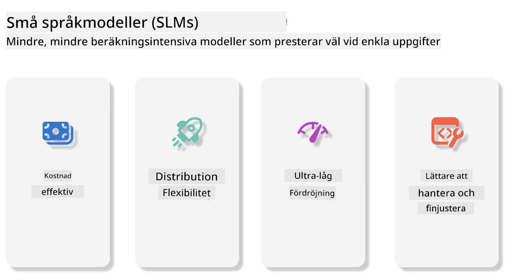
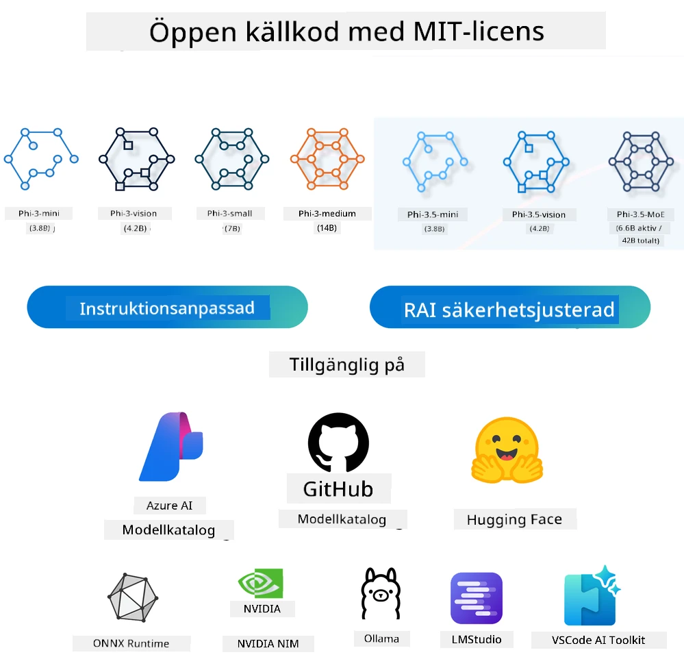
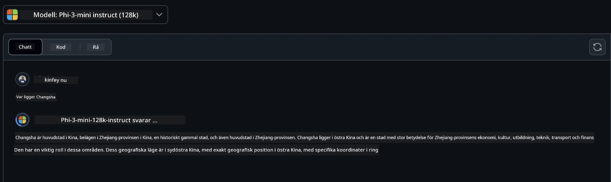
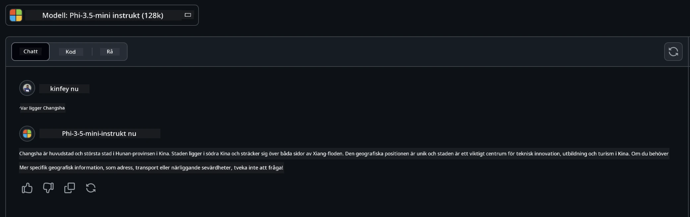

# Introduktion till små språkmodeller för generativ AI för nybörjare
Generativ AI är ett fascinerande område inom artificiell intelligens som fokuserar på att skapa system som kan generera nytt innehåll. Detta innehåll kan sträcka sig från text och bilder till musik och till och med hela virtuella miljöer. En av de mest spännande tillämpningarna av generativ AI är inom området språkmodeller.

## Vad är små språkmodeller?

En liten språkmodell (SLM) representerar en nedskalad variant av en stor språkmodell (LLM) och utnyttjar många av de arkitektoniska principerna och teknikerna från LLM, samtidigt som den uppvisar ett avsevärt minskat beräkningsavtryck.

SLM är en underkategori av språkmodeller som är designade för att generera text som liknar mänsklig text. Till skillnad från sina större motsvarigheter, som GPT-4, är SLM mer kompakta och effektiva, vilket gör dem idealiska för applikationer där beräkningsresurser är begränsade. Trots deras mindre storlek kan de fortfarande utföra en mängd olika uppgifter. Vanligtvis konstrueras SLM genom att komprimera eller destillera LLM, med målet att behålla en betydande del av den ursprungliga modellens funktionalitet och språkliga kapacitet. Denna storleksminskning minskar den totala komplexiteten, vilket gör SLM mer effektiva både när det gäller minnesanvändning och beräkningskrav. Trots dessa optimeringar kan SLM fortfarande utföra ett brett spektrum av uppgifter inom naturlig språkbehandling (NLP):

- Textgenerering: Skapa sammanhängande och kontextuellt relevanta meningar eller stycken.
- Textavslutning: Förutsäga och slutföra meningar baserat på en given prompt.
- Översättning: Översätta text från ett språk till ett annat.
- Sammanfattning: Kondensera långa textstycken till kortare, mer lättförståeliga sammanfattningar.

Om än med vissa kompromisser i prestanda eller djup av förståelse jämfört med deras större motsvarigheter.

## Hur fungerar små språkmodeller?
SLM tränas på enorma mängder textdata. Under träningen lär de sig språkets mönster och strukturer, vilket gör det möjligt för dem att generera text som är både grammatiskt korrekt och kontextuellt lämplig. Träningsprocessen innefattar:

- Datainsamling: Samla stora dataset av text från olika källor.
- Förbehandling: Rensa och organisera data för att göra den lämplig för träning.
- Träning: Använda maskininlärningsalgoritmer för att lära modellen hur den ska förstå och generera text.
- Finjustering: Justera modellen för att förbättra dess prestanda i specifika uppgifter.

Utvecklingen av SLM är i linje med det ökande behovet av modeller som kan distribueras i resursbegränsade miljöer, såsom mobila enheter eller edge computing-plattformar, där fullskaliga LLM kan vara opraktiska på grund av deras höga resursbehov. Genom att fokusera på effektivitet balanserar SLM prestanda med tillgänglighet, vilket möjliggör bredare tillämpning inom olika domäner.



## Lärandemål

I denna lektion hoppas vi introducera kunskapen om SLM och kombinera den med Microsoft Phi-3 för att lära oss olika scenarier inom textinnehåll, vision och MoE.

I slutet av denna lektion bör du kunna svara på följande frågor:

- Vad är SLM?
- Vad är skillnaden mellan SLM och LLM?
- Vad är Microsoft Phi-3/3.5-familjen?
- Hur kör man inferens med Microsoft Phi-3/3.5-familjen?

Redo? Låt oss börja.

## Skillnaderna mellan stora språkmodeller (LLM) och små språkmodeller (SLM)

Både LLM och SLM bygger på grundläggande principer för probabilistisk maskininlärning och följer liknande tillvägagångssätt vad gäller arkitektonisk design, träningsmetodik, datagenereringsprocesser och modelevalueringsmetoder. Dock skiljer sig flera viktiga faktorer mellan dessa två typer av modeller.

## Tillämpningar för små språkmodeller

SLM har ett brett spektrum av tillämpningar, inklusive:

- Chatbots: Erbjuda kundsupport och interagera med användare på ett konverserande sätt.
- Innehållsskapande: Assistera skribenter genom att generera idéer eller till och med utarbeta hela artiklar.
- Utbildning: Hjälpa studenter med skrivuppgifter eller att lära sig nya språk.
- Tillgänglighet: Skapa verktyg för personer med funktionsnedsättningar, såsom text-till-tal-system.

**Storlek**

En huvudsaklig skillnad mellan LLM och SLM ligger i modellernas skala. LLM, som ChatGPT (GPT-4), kan bestå av uppskattningsvis 1,76 biljoner parametrar, medan open-source SLM som Mistral 7B är designade med avsevärt färre parametrar — cirka 7 miljarder. Denna skillnad beror främst på skillnader i modellarkitektur och träningsprocesser. Till exempel använder ChatGPT en självuppmärksamhetsmekanism inom en encoder-decoder-ram, medan Mistral 7B använder sliding window-attention, vilket möjliggör effektivare träning inom en renodlad decodermodell. Denna arkitektoniska skillnad har djupgående konsekvenser för modellernas komplexitet och prestanda.

**Förståelse**

SLM är typiskt optimerade för prestanda inom specifika domäner vilket gör dem mycket specialiserade men potentiellt begränsade i deras förmåga att erbjuda bred kontextuell förståelse över flera kunskapsfält. Däremot strävar LLM efter att simulera människolik intelligens på en mer omfattande nivå. Tränade på stora, diversifierade datasets är LLM designade för att prestera väl inom flera olika områden, vilket erbjuder större mångsidighet och anpassningsförmåga. Följaktligen är LLM mer lämpliga för ett bredare spektrum av nedströmsuppgifter, såsom naturlig språkbehandling och programmering.

**Beräkning**

Träning och distribution av LLM är resursintensiva processer som ofta kräver betydande beräkningsinfrastruktur, inklusive stora GPU-kluster. Till exempel kan träning av en modell som ChatGPT från grunden behöva tusentals GPU:er under långa perioder. I kontrast är SLM, med sina mindre antal parametrar, mer tillgängliga vad gäller beräkningsresurser. Modeller som Mistral 7B kan tränas och köras på lokala maskiner utrustade med måttliga GPU-kapaciteter, även om träningen fortfarande kräver flera timmar över flera GPU:er.

**Bias**

Bias är en känd problematik i LLM, främst på grund av datamaterialets natur. Dessa modeller bygger ofta på rå, öppet tillgänglig data från internet, vilken kan underrepresentera eller felrepresentera vissa grupper, introducera felaktig märkning eller reflektera språkliga bias påverkade av dialekt, geografiska variationer och grammatiska regler. Dessutom kan LLM:s komplexa arkitektur oavsiktligt förstärka bias, vilket kan förbli oupptäckt utan noggrann finjustering. Å andra sidan, eftersom SLM tränas på mer begränsade, domänspecifika dataset, är de i grunden mindre mottagliga för sådana bias, om än inte immuna mot dem.

**Inferens**

Den reducerade storleken på SLM ger dem en betydande fördel vad gäller inferenshastighet, vilket tillåter att de effektivt kan generera output på lokal hårdvara utan behov av omfattande parallell bearbetning. Kontrasterande kräver LLM, på grund av sin storlek och komplexitet, ofta omfattande parallella beräkningsresurser för att uppnå acceptabla inferenstider. När flera samtidiga användare är inblandade förlängs LLM:s svarstider, särskilt vid storskalig distribution.

Sammanfattningsvis, medan både LLM och SLM delar en grundläggande bas i maskininlärning, skiljer de sig avsevärt i modellstorlek, resursbehov, kontextuell förståelse, mottaglighet för bias och inferenshastighet. Dessa skillnader återspeglar deras respektive lämplighet för olika användningsområden, där LLM är mer mångsidiga men resurskrävande, medan SLM erbjuder mer domänspecifik effektivitet med reducerade beräkningskrav.

***Notera: I denna lektion kommer vi att introducera SLM med Microsoft Phi-3 / 3.5 som exempel.***

## Introduktion till Phi-3 / Phi-3.5-familjen

Phi-3 / 3.5-familjen riktar sig främst till text-, vision- och Agent (MoE) applikationsscenarier:

### Phi-3 / 3.5 Instruct

Främst för textgenerering, chattavslutning och innehållsinformationsutvinning etc.

**Phi-3-mini**

Den 3,8 miljarder parametrar stora språkmodellen finns tillgänglig på Microsoft Azure AI Studio, Hugging Face och Ollama. Phi-3-modellerna presterar avsevärt bättre än språkmodeller i samma och större storleksordning på nyckelbenchmarks (se benchmarkvärden nedan, högre siffror är bättre). Phi-3-mini slår modeller som är dubbelt så stora, medan Phi-3-small och Phi-3-medium slår större modeller, inklusive GPT-3.5.

**Phi-3-small & medium**

Med bara 7 miljarder parametrar slår Phi-3-small GPT-3.5T på en rad språk-, resonemangs-, kodnings- och matematikbenchmarks.

Phi-3-medium med 14 miljarder parametrar fortsätter denna trend och presterar bättre än Gemini 1.0 Pro.

**Phi-3.5-mini**

Kan ses som en uppgradering av Phi-3-mini. Parametrarna är oförändrade, men den förbättrar stödet för flera språk (stödjer 20+ språk: arabiska, kinesiska, tjeckiska, danska, nederländska, engelska, finska, franska, tyska, hebreiska, ungerska, italienska, japanska, koreanska, norska, polska, portugisiska, ryska, spanska, svenska, thailändska, turkiska, ukrainska) och adderar starkare stöd för långt kontext.

Phi-3.5-mini med 3,8 miljarder parametrar presterar bättre än språkmodeller av samma storlek och är i nivå med modeller som är dubbelt så stora.

### Phi-3 / 3.5 Vision

Vi kan tänka på Instruct-modellen av Phi-3/3.5 som Phis förmåga att förstå, och Vision är vad som ger Phi ögon för att förstå världen.

**Phi-3-Vision**

Phi-3-Vision, med endast 4,2 miljarder parametrar, fortsätter denna trend och presterar bättre än större modeller som Claude-3 Haiku och Gemini 1.0 Pro V på generella visuella resonemangsuppgifter, OCR samt tabell- och diagramförståelse.

**Phi-3.5-Vision**

Phi-3.5-Vision är också en uppgradering av Phi-3-Vision som lägger till stöd för flera bilder. Man kan se det som en förbättring av visionen—inte bara kan den se bilder, utan även videor.

Phi-3.5-Vision presterar bättre än större modeller som Claude-3.5 Sonnet och Gemini 1.5 Flash över OCR-, tabell- och diagramförståelseuppgifter och ligger i nivå med generella visuella kunskapsresonemangsuppgifter. Stöder multi-frame input, det vill säga resonera på flera inskickade bilder.

### Phi-3.5-MoE

***Mixture of Experts (MoE)*** möjliggör för modeller att förtränas med betydligt mindre beräkningskraft, vilket gör att du dramatiskt kan skala upp modell- eller datasetstorleken med samma beräkningsbudget som en dense modell. Specifikt bör en MoE-modell uppnå samma kvalitet som sin dense motsvarighet mycket snabbare under förträning.

Phi-3.5-MoE består av 16x3,8B expertmoduler. Phi-3.5-MoE med endast 6,6 miljarder aktiva parametrar uppnår en liknande nivå av resonemang, språklig förståelse och matematik som mycket större modeller.

Vi kan använda Phi-3/3.5-familjens modell baserat på olika scenarier. Till skillnad från LLM kan du distribuera Phi-3/3.5-mini eller Phi-3/3.5-Vision på edge-enheter.

## Hur man använder Phi-3/3.5-familjsmodeller

Vi hoppas kunna använda Phi-3/3.5 i olika scenarier. Nästa steg är att använda Phi-3/3.5 baserat på olika scenarier.



### Inferens via moln-API:er

**GitHub Modeller**

GitHub Models är det mest direkta sättet. Du kan snabbt få tillgång till Phi-3/3.5-Instruct-modellen via GitHub Models. I kombination med Azure AI Inference SDK / OpenAI SDK kan du göra API-anrop via kod för att slutföra Phi-3/3.5-Instruct-anropet. Du kan också testa olika effekter via Playground.

- Demo: Jämförelse av effekterna av Phi-3-mini och Phi-3.5-mini i kinesiska scenarier





**Azure AI Studio**

Eller om vi vill använda vision- och MoE-modellerna kan du använda Azure AI Studio för att genomföra anropen. Om du är intresserad kan du läsa Phi-3 Cookbook för att lära dig hur man anropar Phi-3/3.5 Instruct, Vision, MoE genom Azure AI Studio [Klicka på denna länk](https://github.com/microsoft/Phi-3CookBook/blob/main/md/02.QuickStart/AzureAIStudio_QuickStart.md?WT.mc_id=academic-105485-koreyst)

**NVIDIA NIM**

Utöver molnbaserade Model Catalog-lösningar som erbjuds av Azure och GitHub kan du även använda [NVIDIA NIM](https://developer.nvidia.com/nim?WT.mc_id=academic-105485-koreyst) för att genomföra relaterade anrop. Du kan besöka NVIDIA NIM för att göra API-anrop för Phi-3/3.5-familjen. NVIDIA NIM (NVIDIA Inference Microservices) är en uppsättning accelererade inferensmicrotjänster designade för att hjälpa utvecklare att distribuera AI-modeller effektivt över olika miljöer, inklusive moln, datacenter och arbetsstationer.

Här är några nyckelfunktioner i NVIDIA NIM:
- **Enkel distribution:** NIM möjliggör distribution av AI-modeller med ett enda kommando, vilket gör det enkelt att integrera i befintliga arbetsflöden.  
- **Optimerad prestanda:** Det utnyttjar NVIDIAs föroptimerade inferensmotorer, såsom TensorRT och TensorRT-LLM, för att säkerställa låg latens och hög genomströmning.  
- **Skalbarhet:** NIM stödjer autoskalning på Kubernetes, vilket gör att det kan hantera varierande arbetsbelastningar effektivt.  
- **Säkerhet och kontroll:** Organisationer kan behålla kontroll över sina data och applikationer genom att själva drifta NIM-mikrotjänster på sin egen hanterade infrastruktur.  
- **Standard-API:er:** NIM tillhandahåller industristandard-API:er, vilket gör det enkelt att bygga och integrera AI-applikationer som chattbotar, AI-assistenter med mera.  

NIM är en del av NVIDIA AI Enterprise, som syftar till att förenkla distribution och drift av AI-modeller, och säkerställer att de körs effektivt på NVIDIA GPU:er.  

- Demo: Använda NVIDIA NIM för att anropa Phi-3.5-Vision-API [[Klicka på denna länk](./python/Phi-3-Vision-Nividia-NIM.ipynb?WT.mc_id=academic-105485-koreyst)]


### Köra Phi-3/3.5 Lokalt  
Inferens i relation till Phi-3, eller någon språkmodell som GPT-3, refererar till processen att generera svar eller förutsägelser baserat på den input den får. När du ger en prompt eller fråga till Phi-3 använder den sitt tränade neurala nätverk för att avgöra det mest sannolika och relevanta svaret genom att analysera mönster och samband i den data den tränats på.  

**Hugging Face Transformer**  
Hugging Face Transformers är ett kraftfullt bibliotek designat för naturlig språkbehandling (NLP) och andra maskininlärningsuppgifter. Här är några viktiga punkter om det:  

1. **Förtränade modeller:** Det tillhandahåller tusentals förtränade modeller som kan användas för olika uppgifter såsom textklassificering, namngiven entity-igenkänning, frågesvar, sammanfattning, översättning och textgenerering.  

2. **Ramverksinteroperabilitet:** Biblioteket stödjer flera djupinlärningsramverk, inklusive PyTorch, TensorFlow och JAX. Detta gör att du kan träna en modell i ett ramverk och använda den i ett annat.  

3. **Multimodala möjligheter:** Förutom NLP stödjer Hugging Face Transformers även uppgifter inom datorseende (t.ex. bildklassificering, objektigenkänning) och ljudbehandling (t.ex. taligenkänning, ljudklassificering).  

4. **Användarvänlighet:** Biblioteket erbjuder API:er och verktyg för att enkelt ladda ner och finjustera modeller, vilket gör det tillgängligt för både nybörjare och experter.  

5. **Gemenskap och resurser:** Hugging Face har en livlig gemenskap och omfattande dokumentation, tutorials och guider för att hjälpa användare att komma igång och få ut mesta möjliga av biblioteket.  
[officiell dokumentation](https://huggingface.co/docs/transformers/index?WT.mc_id=academic-105485-koreyst) eller deras [GitHub-repo](https://github.com/huggingface/transformers?WT.mc_id=academic-105485-koreyst).  

Det här är den mest använda metoden, men det kräver även GPU-acceleration. Scenarier som Vision och MoE kräver många beräkningar, vilket blir mycket långsamt på CPU om de inte kvantifieras.  

- Demo: Använda Transformer för att anropa Phi-3.5-Instruct [Klicka på denna länk](./python/phi35-instruct-demo.ipynb?WT.mc_id=academic-105485-koreyst)  

- Demo: Använda Transformer för att anropa Phi-3.5-Vision [Klicka på denna länk](./python/phi35-vision-demo.ipynb?WT.mc_id=academic-105485-koreyst)  

- Demo: Använda Transformer för att anropa Phi-3.5-MoE [Klicka på denna länk](./python/phi35_moe_demo.ipynb?WT.mc_id=academic-105485-koreyst)  

**Ollama**  
[Ollama](https://ollama.com/?WT.mc_id=academic-105485-koreyst) är en plattform utformad för att göra det enklare att köra stora språkmodeller (LLMs) lokalt på din maskin. Den stödjer olika modeller som Llama 3.1, Phi 3, Mistral och Gemma 2, bland andra. Plattformen förenklar processen genom att paketera modellvikter, konfiguration och data i ett enda paket, vilket gör det mer tillgängligt för användare att anpassa och skapa sina egna modeller. Ollama finns för macOS, Linux och Windows. Det är ett utmärkt verktyg om du vill experimentera med eller distribuera LLM utan att förlita dig på molntjänster. Ollama är det mest direkta sättet, du behöver bara köra följande kommando.  

```bash

ollama run phi3.5

```
  

**ONNX Runtime för GenAI**  

[ONNX Runtime](https://github.com/microsoft/onnxruntime-genai?WT.mc_id=academic-105485-koreyst) är en plattformsoberoende accelerator för inferens och träning av maskininlärning. ONNX Runtime för Generative AI (GENAI) är ett kraftfullt verktyg som hjälper dig att köra generativa AI-modeller effektivt över olika plattformar.  

## Vad är ONNX Runtime?  
ONNX Runtime är ett open source-projekt som möjliggör högpresterande inferens av maskininlärningsmodeller. Det stödjer modeller i Open Neural Network Exchange (ONNX)-formatet, vilket är en standard för att representera maskininlärningsmodeller. ONNX Runtime-inferens kan möjliggöra snabbare kundupplevelser och lägre kostnader, och stödjer modeller från djupinlärningsramverk som PyTorch och TensorFlow/Keras samt klassiska maskininlärningsbibliotek som scikit-learn, LightGBM, XGBoost med flera. ONNX Runtime är kompatibelt med olika hårdvaror, drivrutiner och operativsystem, och erbjuder optimal prestanda genom att utnyttja hårdvaruacceleration när det är tillämpligt, tillsammans med grafoptimeringar och transformationer.  

## Vad är Generativ AI?  
Generativ AI avser AI-system som kan generera nytt innehåll, som text, bilder eller musik, baserat på data de tränats på. Exempel inkluderar språkmodeller som GPT-3 och bildgenereringsmodeller som Stable Diffusion. ONNX Runtime för GenAI-biblioteket tillhandahåller den generativa AI-loopen för ONNX-modeller, inklusive inferens med ONNX Runtime, logitsbearbetning, sökning och sampling samt hantering av KV-cache.  

## ONNX Runtime för GENAI  
ONNX Runtime för GENAI utökar möjligheterna i ONNX Runtime för att stödja generativa AI-modeller. Här är några viktiga funktioner:  

- **Brett plattformsstöd:** Den fungerar på olika plattformar, inklusive Windows, Linux, macOS, Android och iOS.  
- **Modellstöd:** Den stödjer många populära generativa AI-modeller, såsom LLaMA, GPT-Neo, BLOOM med flera.  
- **Prestandaoptimering:** Den innehåller optimeringar för olika hårdvaruaccelerationer som NVIDIA GPU:er, AMD GPU:er med mera.  
- **Användarvänlighet:** Den tillhandahåller API:er för enkel integration i applikationer, så att du kan generera text, bilder och annat innehåll med minimal kod.  
- Användare kan anropa en högnivå-metod generate(), eller köra varje iteration av modellen i en loop, generera en token i taget, och valfritt uppdatera genereringsparametrar inuti loopen.  
- ONNX runtime stödjer även greedy/beam-sökning och TopP, TopK sampling för att generera tokensekvenser samt inbyggd logitsbearbetning som repetitionsstraff. Du kan även enkelt lägga till egen scoring.  

## Komma igång  
För att komma igång med ONNX Runtime för GENAI kan du följa dessa steg:  

### Installera ONNX Runtime:  
```Python
pip install onnxruntime
```
### Installera Generative AI Extensions:  
```Python
pip install onnxruntime-genai
```
  
### Kör en modell: Här är ett enkelt exempel i Python:  
```Python
import onnxruntime_genai as og

model = og.Model('path_to_your_model.onnx')

tokenizer = og.Tokenizer(model)

input_text = "Hello, how are you?"

input_tokens = tokenizer.encode(input_text)

output_tokens = model.generate(input_tokens)

output_text = tokenizer.decode(output_tokens)

print(output_text) 
```
### Demo: Använda ONNX Runtime GenAI för att anropa Phi-3.5-Vision  


```python

import onnxruntime_genai as og

model_path = './Your Phi-3.5-vision-instruct ONNX Path'

img_path = './Your Image Path'

model = og.Model(model_path)

processor = model.create_multimodal_processor()

tokenizer_stream = processor.create_stream()

text = "Your Prompt"

prompt = "<|user|>\n"

prompt += "<|image_1|>\n"

prompt += f"{text}<|end|>\n"

prompt += "<|assistant|>\n"

image = og.Images.open(img_path)

inputs = processor(prompt, images=image)

params = og.GeneratorParams(model)

params.set_inputs(inputs)

params.set_search_options(max_length=3072)

generator = og.Generator(model, params)

while not generator.is_done():

    generator.compute_logits()
    
    generator.generate_next_token()

    new_token = generator.get_next_tokens()[0]
    
    output = tokenizer_stream.decode(new_token)
    
    print(tokenizer_stream.decode(new_token), end='', flush=True)

```
  

**Andra**  

Förutom ONNX Runtime och Ollama-referensmetoder kan vi också komplettera referensen för kvantitativa modeller baserat på modellreferensmetoder som tillhandahålls av olika tillverkare. Som Apple MLX-ramverket med Apple Metal, Qualcomm QNN med NPU, Intel OpenVINO med CPU/GPU osv. Du kan även få mer innehåll från [Phi-3 Cookbook](https://github.com/microsoft/phi-3cookbook?WT.mc_id=academic-105485-koreyst)  


## Mer  

Vi har lärt oss grunderna om Phi-3/3.5-familjen, men för att lära oss mer om SLM behöver vi mer kunskap. Du kan hitta svaren i Phi-3 Cookbook. Om du vill lära dig mer, vänligen besök [Phi-3 Cookbook](https://github.com/microsoft/phi-3cookbook?WT.mc_id=academic-105485-koreyst).

---

<!-- CO-OP TRANSLATOR DISCLAIMER START -->
**Ansvarsfriskrivning**:
Detta dokument har översatts med hjälp av AI-översättningstjänsten [Co-op Translator](https://github.com/Azure/co-op-translator). Även om vi strävar efter noggrannhet, bör du vara medveten om att automatiska översättningar kan innehålla fel eller brister. Originaldokumentet på dess ursprungliga språk bör betraktas som den auktoritativa källan. För kritisk information rekommenderas professionell mänsklig översättning. Vi ansvarar inte för några missförstånd eller feltolkningar som uppstår till följd av användningen av denna översättning.
<!-- CO-OP TRANSLATOR DISCLAIMER END -->