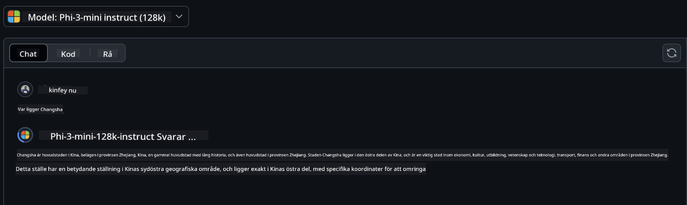
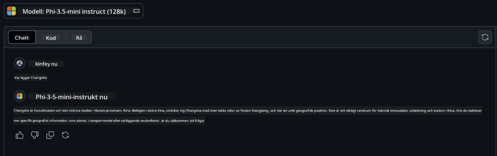

<!--
CO_OP_TRANSLATOR_METADATA:
{
  "original_hash": "124ad36cfe96f74038811b6e2bb93e9d",
  "translation_date": "2025-06-26T02:22:22+00:00",
  "source_file": "19-slm/README.md",
  "language_code": "sv"
}
-->

Modeller är det mest direkta sättet. Du kan snabbt få tillgång till Phi-3/3.5-Instruct-modellen via GitHub Models. I kombination med Azure AI Inference SDK / OpenAI SDK kan du få tillgång till API:n genom kod för att slutföra anropet av Phi-3/3.5-Instruct. Du kan också testa olika effekter genom Playground. - Demo: Jämförelse av effekterna av Phi-3-mini och Phi-3.5-mini i kinesiska scenarier   **Azure AI Studio** Eller om vi vill använda vision- och MoE-modeller kan du använda Azure AI Studio för att slutföra anropet. Om du är intresserad kan du läsa Phi-3 Cookbook för att lära dig hur man anropar Phi-3/3.5 Instruct, Vision, MoE genom Azure AI Studio [Klicka på denna länk](https://github.com/microsoft/Phi-3CookBook/blob/main/md/02.QuickStart/AzureAIStudio_QuickStart.md?WT.mc_id=academic-105485-koreyst) **NVIDIA NIM** Förutom de molnbaserade Model Catalog-lösningarna som tillhandahålls av Azure och GitHub kan du också använda [Nivida NIM](https://developer.nvidia.com/nim?WT.mc_id=academic-105485-koreyst) för att slutföra relaterade anrop. Du kan besöka NIVIDA NIM för att slutföra API-anropen av Phi-3/3.5 Family. NVIDIA NIM (NVIDIA Inference Microservices) är en uppsättning accelererade inferens-mikrotjänster utformade för att hjälpa utvecklare att distribuera AI-modeller effektivt över olika miljöer, inklusive moln, datacenter och arbetsstationer. Här är några nyckelfunktioner i NVIDIA NIM: - **Enkel distribution:** NIM möjliggör distribution av AI-modeller med ett enda kommando, vilket gör det enkelt att integrera i befintliga arbetsflöden. - **Optimerad prestanda:** Den utnyttjar NVIDIAs föroptimerade inferensmotorer, såsom TensorRT och TensorRT-LLM, för att säkerställa låg latens och hög genomströmning. - **Skalbarhet:** NIM stöder autoskalning på Kubernetes, vilket gör att den effektivt kan hantera varierande arbetsbelastningar. - **Säkerhet och kontroll:** Organisationer kan behålla kontrollen över sina data och applikationer genom att självhosta NIM-mikrotjänster på sin egen hanterade infrastruktur. - **Standard-API:er:** NIM tillhandahåller branschstandard-API:er, vilket gör det enkelt att bygga och integrera AI-applikationer som chattbotar, AI-assistenter och mer. NIM är en del av NVIDIA AI Enterprise, som syftar till att förenkla distribution och drift av AI-modeller, vilket säkerställer att de körs effektivt på NVIDIA GPU:er. - Demo: Använda Nividia NIM för att anropa Phi-3.5-Vision-API [[Klicka på denna länk](../../../19-slm/python/Phi-3-Vision-Nividia-NIM.ipynb)] ### Inferens Phi-3/3.5 i lokal miljö Inferens i relation till Phi-3, eller någon språkmodell som GPT-3, avser processen att generera svar eller förutsägelser baserat på den input den får. När du ger en prompt eller fråga till Phi-3 använder den sitt tränade neurala nätverk för att dra slutsatser om det mest sannolika och relevanta svaret genom att analysera mönster och relationer i de data den tränades på. **Hugging Face Transformer** Hugging Face Transformers är ett kraftfullt bibliotek utformat för naturlig språkbehandling (NLP) och andra maskininlärningsuppgifter. Här är några viktiga punkter om det: 1. **Förtränade modeller**: Det tillhandahåller tusentals förtränade modeller som kan användas för olika uppgifter såsom textklassificering, namngiven entity-igenkänning, frågesvar, summering, översättning och textgenerering. 2. **Ramsamverkan**: Biblioteket stöder flera djupinlärningsramverk, inklusive PyTorch, TensorFlow och JAX. Detta gör att du kan träna en modell i ett ramverk och använda den i ett annat. 3. **Multimodala kapaciteter**: Förutom NLP stöder Hugging Face Transformers även uppgifter inom datorseende (t.ex. bildklassificering, objektdetektion) och ljudbearbetning (t.ex. taligenkänning, ljudklassificering). 4. **Enkel användning**: Biblioteket erbjuder API:er och verktyg för att enkelt ladda ner och finjustera modeller, vilket gör det tillgängligt för både nybörjare och experter. 5. **Gemenskap och resurser**: Hugging Face har en livlig gemenskap och omfattande dokumentation, handledningar och guider för att hjälpa användare att komma igång och få ut det mesta av biblioteket. [officiell dokumentation](https://huggingface.co/docs/transformers/index?WT.mc_id=academic-105485-koreyst) eller deras [GitHub-repository](https://github.com/huggingface/transformers?WT.mc_id=academic-105485-koreyst). Detta är den mest använda metoden, men den kräver också GPU-acceleration. Trots allt kräver scener som Vision och MoE mycket beräkningar, vilket kommer att vara mycket begränsat i CPU om de inte är kvantiserade. - Demo: Använda Transformer för att anropa Phi-3.5-Instuct [Klicka på denna länk](../../../19-slm/python/phi35-instruct-demo.ipynb) - Demo: Använda Transformer för att anropa Phi-3.5-Vision[Klicka på denna länk](../../../19-slm/python/phi35-vision-demo.ipynb) - Demo: Använda Transformer för att anropa Phi-3.5-MoE[Klicka på denna länk](../../../19-slm/python/phi35_moe_demo.ipynb) **Ollama** [Ollama](https://ollama.com/?WT.mc_id=academic-105485-koreyst) är en plattform utformad för att göra det enklare att köra stora språkmodeller (LLM) lokalt på din maskin. Den stöder olika modeller som Llama 3.1, Phi 3, Mistral och Gemma 2, bland andra. Plattformen förenklar processen genom att bunta modellvikter, konfiguration och data i ett enda paket, vilket gör det mer tillgängligt för användare att anpassa och skapa sina egna modeller. Ollama är tillgänglig för macOS, Linux och Windows. Det är ett utmärkt verktyg om du vill experimentera med eller distribuera LLM utan att förlita dig på molntjänster. Ollama är det mest direkta sättet, du behöver bara utföra följande uttalande. ```bash

ollama run phi3.5

``` **ONNX Runtime för GenAI** [ONNX Runtime](https://github.com/microsoft/onnxruntime-genai?WT.mc_id=academic-105485-koreyst) är en plattformsoberoende inferens- och träningsmaskininlärningsaccelerator. ONNX Runtime för Generative AI (GENAI) är ett kraftfullt verktyg som hjälper dig att köra generativa AI-modeller effektivt över olika plattformar. ## Vad är ONNX Runtime? ONNX Runtime är ett open-source-projekt som möjliggör högpresterande inferens av maskininlärningsmodeller. Det stöder modeller i Open Neural Network Exchange (ONNX)-formatet, vilket är en standard för att representera maskininlärningsmodeller.ONNX Runtime-inferens kan möjliggöra snabbare kundupplevelser och lägre kostnader, stödja modeller från djupinlärningsramverk som PyTorch och TensorFlow/Keras samt klassiska maskininlärningsbibliotek som scikit-learn, LightGBM, XGBoost, etc. ONNX Runtime är kompatibel med olika hårdvara, drivrutiner och operativsystem, och ger optimal prestanda genom att utnyttja hårdvaruacceleratorer där det är tillämpligt tillsammans med grafoptimeringar och transformationer ## Vad är Generativ AI? Generativ AI avser AI-system som kan generera nytt innehåll, såsom text, bilder eller musik, baserat på de data de har tränats på. Exempel inkluderar språkmodeller som GPT-3 och bildgenereringsmodeller som Stable Diffusion. ONNX Runtime för GenAI-biblioteket tillhandahåller den generativa AI-loopen för ONNX-modeller, inklusive inferens med ONNX Runtime, logitbearbetning, sökning och provtagning samt KV-cachehantering. ## ONNX Runtime för GENAI ONNX Runtime för GENAI utökar kapaciteterna hos ONNX Runtime för att stödja generativa AI-modeller. Här är några nyckelfunktioner: - **Brett plattformsstöd:** Det fungerar på olika plattformar, inklusive Windows, Linux, macOS, Android och iOS. - **Modellstöd:** Det stöder många populära generativa AI-modeller, såsom LLaMA, GPT-Neo, BLOOM och mer. - **Prestandaoptimering:** Det inkluderar optimeringar för olika hårdvaruacceleratorer som NVIDIA GPU:er, AMD GPU:er och mer2. - **Enkel användning:** Det tillhandahåller API:er för enkel integration i applikationer, vilket gör att du kan generera text, bilder och annat innehåll med minimal kod - Användare kan anropa en högnivå generate()-metod, eller köra varje iteration av modellen i en loop, generera en token i taget och eventuellt uppdatera generationsparametrar inuti loopen. - ONNX runtime har också stöd för greedy/beam search och TopP, TopK-provtagning för att generera tokensekvenser och inbyggd logitbearbetning som repetitionsstraff. Du kan också enkelt lägga till anpassad poängsättning. ## Komma igång För att komma igång med ONNX Runtime för GENAI kan du följa dessa steg: ### Installera ONNX Runtime: ```Python
pip install onnxruntime
``` ### Installera Generative AI Extensions: ```Python
pip install onnxruntime-genai
``` ### Kör en modell: Här är ett enkelt exempel i Python: ```Python
import onnxruntime_genai as og

model = og.Model('path_to_your_model.onnx')

tokenizer = og.Tokenizer(model)

input_text = "Hello, how are you?"

input_tokens = tokenizer.encode(input_text)

output_tokens = model.generate(input_tokens)

output_text = tokenizer.decode(output_tokens)

print(output_text) 
``` ### Demo: Använda ONNX Runtime GenAI för att anropa Phi-3.5-Vision ```python

import onnxruntime_genai as og

model_path = './Your Phi-3.5-vision-instruct ONNX Path'

img_path = './Your Image Path'

model = og.Model(model_path)

processor = model.create_multimodal_processor()

tokenizer_stream = processor.create_stream()

text = "Your Prompt"

prompt = "<|user|>\n"

prompt += "<|image_1|>\n"

prompt += f"{text}<|end|>\n"

prompt += "<|assistant|>\n"

image = og.Images.open(img_path)

inputs = processor(prompt, images=image)

params = og.GeneratorParams(model)

params.set_inputs(inputs)

params.set_search_options(max_length=3072)

generator = og.Generator(model, params)

while not generator.is_done():

    generator.compute_logits()
    
    generator.generate_next_token()

    new_token = generator.get_next_tokens()[0]
    
    code += tokenizer_stream.decode(new_token)
    
    print(tokenizer_stream.decode(new_token), end='', flush=True)

``` **Övriga** Förutom ONNX Runtime och Ollama referensmetoder kan vi också slutföra referensen av kvantitativa modeller baserat på modellreferensmetoder som tillhandahålls av olika tillverkare. Såsom Apple MLX-ramverk med Apple Metal, Qualcomm QNN med NPU, Intel OpenVINO med CPU/GPU, etc. Du kan också få mer innehåll från [Phi-3 Cookbook](https://github.com/microsoft/phi-3cookbook?WT.mc_id=academic-105485-koreyst) ## Mer Vi har lärt oss grunderna i Phi-3/3.5 Family, men för att lära oss mer om SLM behöver vi mer kunskap. Du kan hitta svaren i Phi-3 Cookbook. Om du vill lära dig mer, vänligen besök [Phi-3 Cookbook](https://github.com/microsoft/phi-3cookbook?WT.mc_id=academic-105485-koreyst).

**Ansvarsfriskrivning**:  
Detta dokument har översatts med hjälp av AI-översättningstjänsten [Co-op Translator](https://github.com/Azure/co-op-translator). Även om vi strävar efter noggrannhet, var medveten om att automatiserade översättningar kan innehålla fel eller oriktigheter. Det ursprungliga dokumentet på sitt modersmål bör betraktas som den auktoritativa källan. För kritisk information rekommenderas professionell mänsklig översättning. Vi ansvarar inte för missförstånd eller misstolkningar som uppstår vid användning av denna översättning.