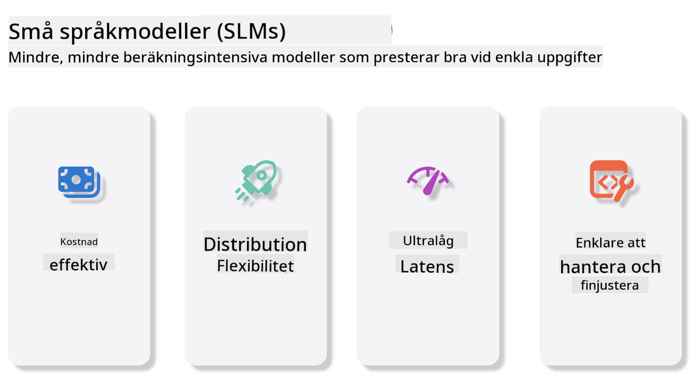
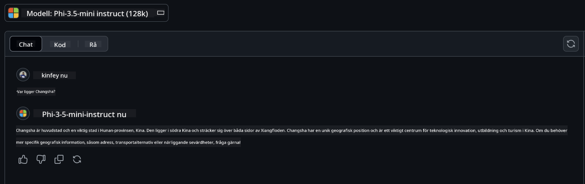

<!--
CO_OP_TRANSLATOR_METADATA:
{
  "original_hash": "124ad36cfe96f74038811b6e2bb93e9d",
  "translation_date": "2025-07-09T18:36:27+00:00",
  "source_file": "19-slm/README.md",
  "language_code": "sv"
}
-->
# Introduktion till små språkmodeller för generativ AI för nybörjare  
Generativ AI är ett fascinerande område inom artificiell intelligens som fokuserar på att skapa system som kan generera nytt innehåll. Detta innehåll kan vara allt från text och bilder till musik och till och med hela virtuella miljöer. En av de mest spännande tillämpningarna av generativ AI är inom språkmodeller.

## Vad är små språkmodeller?  

En liten språkmodell (SLM) är en nedskalad variant av en stor språkmodell (LLM) som använder många av de arkitektoniska principerna och teknikerna från LLM, men med en betydligt mindre beräkningsmässig belastning.  

SLM är en undergrupp av språkmodeller som är designade för att generera text som liknar mänskligt språk. Till skillnad från sina större motsvarigheter, som GPT-4, är SLM mer kompakta och effektiva, vilket gör dem idealiska för applikationer där beräkningsresurser är begränsade. Trots sin mindre storlek kan de fortfarande utföra en rad olika uppgifter. Vanligtvis byggs SLM genom att komprimera eller destillera LLM, med målet att behålla en stor del av den ursprungliga modellens funktionalitet och språkliga förmågor. Denna minskning i modellstorlek minskar den totala komplexiteten, vilket gör SLM mer effektiva både vad gäller minnesanvändning och beräkningskrav. Trots dessa optimeringar kan SLM fortfarande utföra en mängd olika uppgifter inom naturlig språkbehandling (NLP):

- Textgenerering: Skapa sammanhängande och kontextuellt relevanta meningar eller stycken.  
- Textkomplettering: Förutsäga och slutföra meningar baserat på en given prompt.  
- Översättning: Översätta text från ett språk till ett annat.  
- Sammanfattning: Kondensera långa texter till kortare, mer lättsmälta sammanfattningar.  

Dock med vissa kompromisser i prestanda eller djupare förståelse jämfört med deras större motsvarigheter.

## Hur fungerar små språkmodeller?  
SLM tränas på enorma mängder textdata. Under träningen lär de sig språkets mönster och strukturer, vilket gör att de kan generera text som är både grammatiskt korrekt och kontextuellt passande. Träningsprocessen innefattar:

- Datainsamling: Samla in stora textdatamängder från olika källor.  
- Förbehandling: Rensa och organisera data för att göra den lämplig för träning.  
- Träning: Använda maskininlärningsalgoritmer för att lära modellen att förstå och generera text.  
- Finjustering: Justera modellen för att förbättra dess prestanda på specifika uppgifter.  

Utvecklingen av SLM är i linje med det ökande behovet av modeller som kan användas i miljöer med begränsade resurser, som mobila enheter eller edge computing-plattformar, där fullskaliga LLM kan vara opraktiska på grund av deras höga resurskrav. Genom att fokusera på effektivitet balanserar SLM prestanda med tillgänglighet, vilket möjliggör bredare användning inom olika områden.



## Lärandemål  

I denna lektion hoppas vi introducera kunskap om SLM och kombinera det med Microsoft Phi-3 för att lära oss olika scenarier inom textinnehåll, vision och MoE.

I slutet av lektionen bör du kunna svara på följande frågor:

- Vad är SLM  
- Vad är skillnaden mellan SLM och LLM  
- Vad är Microsoft Phi-3/3.5-familjen  
- Hur man gör inferens med Microsoft Phi-3/3.5-familjen  

Redo? Då kör vi.

## Skillnaderna mellan stora språkmodeller (LLM) och små språkmodeller (SLM)  

Både LLM och SLM bygger på grundläggande principer inom probabilistisk maskininlärning och följer liknande tillvägagångssätt i arkitektur, träningsmetoder, datagenerering och utvärdering av modeller. Men flera viktiga faktorer skiljer dessa två typer av modeller åt.

## Användningsområden för små språkmodeller  

SLM har ett brett användningsområde, bland annat:

- Chatbots: Ge kundsupport och interagera med användare i samtal.  
- Innehållsskapande: Hjälpa författare genom att generera idéer eller till och med utkast till hela artiklar.  
- Utbildning: Stödja elever med skrivuppgifter eller språkinlärning.  
- Tillgänglighet: Skapa verktyg för personer med funktionsnedsättningar, som text-till-tal-system.  

**Storlek**  

En huvudskillnad mellan LLM och SLM är modellernas storlek. LLM, som ChatGPT (GPT-4), kan bestå av uppskattningsvis 1,76 biljoner parametrar, medan öppna SLM som Mistral 7B är designade med betydligt färre parametrar – cirka 7 miljarder. Denna skillnad beror främst på skillnader i modellarkitektur och träningsprocesser. Till exempel använder ChatGPT en självuppmärksamhetsmekanism inom en encoder-decoder-arkitektur, medan Mistral 7B använder sliding window attention, vilket möjliggör effektivare träning inom en decoder-only-modell. Denna arkitektoniska skillnad har stor påverkan på modellernas komplexitet och prestanda.

**Förståelse**  

SLM är vanligtvis optimerade för prestanda inom specifika domäner, vilket gör dem mycket specialiserade men potentiellt begränsade i sin förmåga att ge bred kontextuell förståelse över flera kunskapsområden. LLM strävar däremot efter att simulera mänsklig intelligens på en mer omfattande nivå. Tränade på stora, varierade dataset är LLM designade för att prestera väl inom många olika områden, vilket ger större mångsidighet och anpassningsförmåga. Därför är LLM mer lämpade för ett bredare spektrum av uppgifter, som naturlig språkbehandling och programmering.

**Beräkning**  

Träning och användning av LLM är resurskrävande processer som ofta kräver omfattande beräkningsinfrastruktur, inklusive stora GPU-kluster. Till exempel kan träning av en modell som ChatGPT från grunden kräva tusentals GPU:er under långa perioder. SLM, med sina mindre antal parametrar, är däremot mer tillgängliga vad gäller beräkningsresurser. Modeller som Mistral 7B kan tränas och köras på lokala maskiner med måttliga GPU-kapaciteter, även om träningen fortfarande kräver flera timmar över flera GPU:er.

**Bias**  

Bias är ett känt problem i LLM, främst på grund av träningsdata. Dessa modeller förlitar sig ofta på rå, öppet tillgänglig data från internet, vilket kan underrepresentera eller felaktigt representera vissa grupper, introducera felaktig märkning eller spegla språkliga bias som påverkas av dialekter, geografiska variationer och grammatiska regler. Dessutom kan den komplexa arkitekturen i LLM oavsiktligt förstärka bias, vilket kan gå obemärkt förbi utan noggrann finjustering. SLM, som tränas på mer begränsade, domänspecifika dataset, är i regel mindre mottagliga för sådana bias, även om de inte är helt immuna.

**Inferens**  

Den mindre storleken på SLM ger en betydande fördel i inferenshastighet, vilket gör att de kan generera resultat effektivt på lokal hårdvara utan behov av omfattande parallell bearbetning. LLM kräver däremot ofta stora parallella beräkningsresurser för att uppnå acceptabla inferenstider på grund av sin storlek och komplexitet. När flera användare är aktiva samtidigt kan LLM:s svarstider dessutom förlängas, särskilt vid storskalig användning.

Sammanfattningsvis, även om både LLM och SLM bygger på maskininlärning, skiljer de sig avsevärt i modellstorlek, resursbehov, kontextuell förståelse, mottaglighet för bias och inferenshastighet. Dessa skillnader speglar deras respektive lämplighet för olika användningsområden, där LLM är mer mångsidiga men resurskrävande, medan SLM erbjuder mer domänspecifik effektivitet med lägre beräkningskrav.

***Note：I detta kapitel kommer vi att introducera SLM med Microsoft Phi-3 / 3.5 som exempel.***

## Introduktion till Phi-3 / Phi-3.5-familjen  

Phi-3 / 3.5-familjen riktar sig främst mot text-, vision- och Agent (MoE) applikationsscenarier:

### Phi-3 / 3.5 Instruct  

Främst för textgenerering, chattkomplettering och extrahering av innehållsinformation med mera.

**Phi-3-mini**  

Den 3,8 miljarder parametrar stora språkmodellen finns tillgänglig på Microsoft Azure AI Studio, Hugging Face och Ollama. Phi-3-modeller presterar betydligt bättre än språkmodeller av samma eller större storlek på viktiga benchmarktester (se benchmark-siffror nedan, högre är bättre). Phi-3-mini överträffar modeller som är dubbelt så stora, medan Phi-3-small och Phi-3-medium presterar bättre än större modeller, inklusive GPT-3.5.

**Phi-3-small & medium**  

Med endast 7 miljarder parametrar slår Phi-3-small GPT-3.5T på en rad språk-, resonemangs-, kodnings- och matematikbenchmarks.

Phi-3-medium med 14 miljarder parametrar fortsätter denna trend och presterar bättre än Gemini 1.0 Pro.

**Phi-3.5-mini**  

Kan ses som en uppgradering av Phi-3-mini. Parametrarna är oförändrade, men den förbättrar stödet för flera språk (stödjer 20+ språk: arabiska, kinesiska, tjeckiska, danska, nederländska, engelska, finska, franska, tyska, hebreiska, ungerska, italienska, japanska, koreanska, norska, polska, portugisiska, ryska, spanska, svenska, thailändska, turkiska, ukrainska) och ger starkare stöd för långa kontexter.

Phi-3.5-mini med 3,8 miljarder parametrar presterar bättre än språkmodeller av samma storlek och är i nivå med modeller som är dubbelt så stora.

### Phi-3 / 3.5 Vision  

Vi kan se Instruct-modellen i Phi-3/3.5 som Phis förmåga att förstå, och Vision är det som ger Phi ögon för att förstå världen.

**Phi-3-Vision**  

Phi-3-Vision, med endast 4,2 miljarder parametrar, fortsätter denna trend och presterar bättre än större modeller som Claude-3 Haiku och Gemini 1.0 Pro V på allmänna visuella resonemangsuppgifter, OCR samt tabell- och diagramförståelse.

**Phi-3.5-Vision**  

Phi-3.5-Vision är också en uppgradering av Phi-3-Vision och lägger till stöd för flera bilder. Du kan se det som en förbättring inom vision – inte bara kan du se bilder, utan även videor.

Phi-3.5-Vision presterar bättre än större modeller som Claude-3.5 Sonnet och Gemini 1.5 Flash inom OCR, tabell- och diagramförståelse och är i nivå med dem på allmänna visuella kunskapsresonemangsuppgifter. Stöder multi-frame input, dvs. resonemang över flera inmatade bilder.

### Phi-3.5-MoE  

***Mixture of Experts (MoE)*** möjliggör att modeller kan förtränas med betydligt mindre beräkningskraft, vilket innebär att du kan skala upp modell- eller datasetstorleken dramatiskt med samma beräkningsbudget som en tät modell. Specifikt bör en MoE-modell uppnå samma kvalitet som sin täta motsvarighet mycket snabbare under förträning.

Phi-3.5-MoE består av 16x3,8 miljarder expertmoduler. Phi-3.5-MoE med endast 6,6 miljarder aktiva parametrar uppnår en liknande nivå av resonemang, språkförståelse och matematik som mycket större modeller.

Vi kan använda Phi-3/3.5-familjens modeller baserat på olika scenarier. Till skillnad från LLM kan du distribuera Phi-3/3.5-mini eller Phi-3/3.5-Vision på edge-enheter.

## Hur man använder Phi-3/3.5-familjens modeller  

Vi vill använda Phi-3/3.5 i olika scenarier. Nästa steg är att använda Phi-3/3.5 baserat på olika användningsområden.


### Skillnader i inferens via molnets API  

**GitHub Models**  

GitHub Models är det mest direkta sättet. Du kan snabbt få tillgång till Phi-3/3.5-Instruct-modellen via GitHub Models. Tillsammans med Azure AI Inference SDK / OpenAI SDK kan du nå API:et via kod för att göra anrop till Phi-3/3.5-Instruct. Du kan också testa olika effekter via Playground.

- Demo: Jämförelse av effekterna av Phi-3-mini och Phi-3.5-mini i kinesiska scenarier




**Azure AI Studio**  

Om du vill använda vision- och MoE-modeller kan du använda Azure AI Studio för att göra anrop. Om du är intresserad kan du läsa Phi-3 Cookbook för att lära dig hur du anropar Phi-3/3.5 Instruct, Vision, MoE via Azure AI Studio [Klicka på denna länk](https://github.com/microsoft/Phi-3CookBook/blob/main/md/02.QuickStart/AzureAIStudio_QuickStart.md?WT.mc_id=academic-105485-koreyst)

**NVIDIA NIM**  

Utöver molnbaserade Model Catalog-lösningar från Azure och GitHub kan du även använda [NVIDIA NIM](https://developer.nvidia.com/nim?WT.mc_id=academic-105485-koreyst) för att göra relaterade anrop. Du kan besöka NVIDIA NIM för att göra API-anrop för Phi-3/3.5-familjen. NVIDIA NIM (NVIDIA Inference Microservices) är en uppsättning accelererade inferens-mikrotjänster som hjälper utvecklare att effektivt distribuera AI-modeller i olika miljöer, inklusive moln, datacenter och arbetsstationer.

Här är några nyckelfunktioner i NVIDIA NIM:

- **Enkel distribution:** NIM möjliggör distribution av AI-modeller med ett enda kommando, vilket gör det enkelt att integrera i befintliga arbetsflöden.  
- **Optimerad prestanda:** Den utnyttjar NVIDIA:s föroptimerade inferensmotorer, som TensorRT och TensorRT-LLM, för att säkerställa låg latens och hög genomströmning.  
- **Skalbarhet:** NIM stödjer autoskalning på Kubernetes, vilket gör att den effektivt kan hantera varierande arbetsbelastningar.
- **Säkerhet och kontroll:** Organisationer kan behålla kontrollen över sina data och applikationer genom att självhosta NIM-mikrotjänster på sin egen hanterade infrastruktur.  
- **Standard-API:er:** NIM erbjuder branschstandard-API:er, vilket gör det enkelt att bygga och integrera AI-applikationer som chatbots, AI-assistenter och mer.

NIM är en del av NVIDIA AI Enterprise, som syftar till att förenkla distribution och drift av AI-modeller, och säkerställa att de körs effektivt på NVIDIA GPU:er.

- Demo: Använda Nvidia NIM för att anropa Phi-3.5-Vision-API [[Klicka på denna länk](python/Phi-3-Vision-Nividia-NIM.ipynb)]


### Inferens Phi-3/3.5 i lokal miljö  
Inferens i relation till Phi-3, eller någon språkmodell som GPT-3, avser processen att generera svar eller förutsägelser baserat på den input den får. När du ger en prompt eller fråga till Phi-3 använder den sitt tränade neurala nätverk för att dra slutsatsen om det mest sannolika och relevanta svaret genom att analysera mönster och samband i den data den tränats på.

**Hugging Face Transformer**  
Hugging Face Transformers är ett kraftfullt bibliotek designat för naturlig språkbehandling (NLP) och andra maskininlärningsuppgifter. Här är några viktiga punkter om det:

1. **Förtränade modeller:** Det erbjuder tusentals förtränade modeller som kan användas för olika uppgifter som textklassificering, namngiven entity-igenkänning, frågesvar, sammanfattning, översättning och textgenerering.

2. **Ramverkskompatibilitet:** Biblioteket stödjer flera djupinlärningsramverk, inklusive PyTorch, TensorFlow och JAX. Detta gör att du kan träna en modell i ett ramverk och använda den i ett annat.

3. **Multimodala möjligheter:** Förutom NLP stödjer Hugging Face Transformers även uppgifter inom datorseende (t.ex. bildklassificering, objektigenkänning) och ljudbehandling (t.ex. taligenkänning, ljudklassificering).

4. **Användarvänlighet:** Biblioteket erbjuder API:er och verktyg för att enkelt ladda ner och finjustera modeller, vilket gör det tillgängligt för både nybörjare och experter.

5. **Community och resurser:** Hugging Face har en livlig community och omfattande dokumentation, tutorials och guider för att hjälpa användare att komma igång och få ut mesta möjliga av biblioteket.  
[officiell dokumentation](https://huggingface.co/docs/transformers/index?WT.mc_id=academic-105485-koreyst) eller deras [GitHub-repo](https://github.com/huggingface/transformers?WT.mc_id=academic-105485-koreyst).

Detta är den mest använda metoden, men den kräver också GPU-acceleration. Scenarier som Vision och MoE kräver mycket beräkningar, vilket blir mycket begränsat på CPU om de inte kvantiseras.


- Demo: Använda Transformer för att anropa Phi-3.5-Instruct [Klicka på denna länk](python/phi35-instruct-demo.ipynb)

- Demo: Använda Transformer för att anropa Phi-3.5-Vision [Klicka på denna länk](python/phi35-vision-demo.ipynb)

- Demo: Använda Transformer för att anropa Phi-3.5-MoE [Klicka på denna länk](python/phi35_moe_demo.ipynb)

**Ollama**  
[Ollama](https://ollama.com/?WT.mc_id=academic-105485-koreyst) är en plattform som gör det enklare att köra stora språkmodeller (LLM) lokalt på din dator. Den stödjer olika modeller som Llama 3.1, Phi 3, Mistral och Gemma 2, bland andra. Plattformen förenklar processen genom att paketera modellvikter, konfiguration och data i ett enda paket, vilket gör det mer tillgängligt för användare att anpassa och skapa egna modeller. Ollama finns för macOS, Linux och Windows. Det är ett utmärkt verktyg om du vill experimentera med eller distribuera LLM utan att förlita dig på molntjänster. Ollama är det mest direkta sättet, du behöver bara köra följande kommando.


```bash

ollama run phi3.5

```


**ONNX Runtime för GenAI**

[ONNX Runtime](https://github.com/microsoft/onnxruntime-genai?WT.mc_id=academic-105485-koreyst) är en plattformsoberoende accelerator för inferens och träning av maskininlärning. ONNX Runtime för Generative AI (GENAI) är ett kraftfullt verktyg som hjälper dig att köra generativa AI-modeller effektivt över olika plattformar.

## Vad är ONNX Runtime?  
ONNX Runtime är ett open source-projekt som möjliggör högpresterande inferens av maskininlärningsmodeller. Det stödjer modeller i Open Neural Network Exchange (ONNX)-formatet, som är en standard för att representera maskininlärningsmodeller. ONNX Runtime-inferens kan möjliggöra snabbare kundupplevelser och lägre kostnader, och stödjer modeller från djupinlärningsramverk som PyTorch och TensorFlow/Keras samt klassiska maskininlärningsbibliotek som scikit-learn, LightGBM, XGBoost med flera. ONNX Runtime är kompatibelt med olika hårdvaror, drivrutiner och operativsystem, och ger optimal prestanda genom att utnyttja hårdvaruacceleration där det är möjligt, tillsammans med grafoptimeringar och transformationer.

## Vad är Generativ AI?  
Generativ AI avser AI-system som kan skapa nytt innehåll, såsom text, bilder eller musik, baserat på den data de tränats på. Exempel inkluderar språkmodeller som GPT-3 och bildgenereringsmodeller som Stable Diffusion. ONNX Runtime för GenAI-biblioteket tillhandahåller den generativa AI-loopen för ONNX-modeller, inklusive inferens med ONNX Runtime, logitsbearbetning, sökning och sampling samt hantering av KV-cache.

## ONNX Runtime för GENAI  
ONNX Runtime för GENAI utökar ONNX Runtimes kapabiliteter för att stödja generativa AI-modeller. Här är några viktiga funktioner:

- **Brett plattformsstöd:** Fungerar på olika plattformar, inklusive Windows, Linux, macOS, Android och iOS.  
- **Modellstöd:** Stöder många populära generativa AI-modeller, såsom LLaMA, GPT-Neo, BLOOM med flera.  
- **Prestandaoptimering:** Inkluderar optimeringar för olika hårdvaruacceleratorer som NVIDIA GPU:er, AMD GPU:er med flera.  
- **Användarvänlighet:** Erbjuder API:er för enkel integration i applikationer, vilket gör att du kan generera text, bilder och annat innehåll med minimal kod.  
- Användare kan anropa en hög-nivå generate()-metod, eller köra varje iteration av modellen i en loop, generera en token i taget och valfritt uppdatera genereringsparametrar inuti loopen.  
- ONNX Runtime har även stöd för greedy/beam search och TopP, TopK-sampling för att generera tokensekvenser samt inbyggd logitsbearbetning som repetitionsstraff. Du kan också enkelt lägga till egen poängsättning.

## Kom igång  
För att komma igång med ONNX Runtime för GENAI kan du följa dessa steg:

### Installera ONNX Runtime:  
```Python
pip install onnxruntime
```  
### Installera Generative AI Extensions:  
```Python
pip install onnxruntime-genai
```

### Kör en modell: Här är ett enkelt exempel i Python:  
```Python
import onnxruntime_genai as og

model = og.Model('path_to_your_model.onnx')

tokenizer = og.Tokenizer(model)

input_text = "Hello, how are you?"

input_tokens = tokenizer.encode(input_text)

output_tokens = model.generate(input_tokens)

output_text = tokenizer.decode(output_tokens)

print(output_text) 
```  
### Demo: Använda ONNX Runtime GenAI för att anropa Phi-3.5-Vision


```python

import onnxruntime_genai as og

model_path = './Your Phi-3.5-vision-instruct ONNX Path'

img_path = './Your Image Path'

model = og.Model(model_path)

processor = model.create_multimodal_processor()

tokenizer_stream = processor.create_stream()

text = "Your Prompt"

prompt = "<|user|>\n"

prompt += "<|image_1|>\n"

prompt += f"{text}<|end|>\n"

prompt += "<|assistant|>\n"

image = og.Images.open(img_path)

inputs = processor(prompt, images=image)

params = og.GeneratorParams(model)

params.set_inputs(inputs)

params.set_search_options(max_length=3072)

generator = og.Generator(model, params)

while not generator.is_done():

    generator.compute_logits()
    
    generator.generate_next_token()

    new_token = generator.get_next_tokens()[0]
    
    code += tokenizer_stream.decode(new_token)
    
    print(tokenizer_stream.decode(new_token), end='', flush=True)

```


**Övrigt**

Utöver ONNX Runtime och Ollama-referensmetoder kan vi också komplettera referensen för kvantitativa modeller baserat på modellreferensmetoder som tillhandahålls av olika tillverkare. Såsom Apple MLX-ramverket med Apple Metal, Qualcomm QNN med NPU, Intel OpenVINO med CPU/GPU med mera. Du kan också hitta mer innehåll i [Phi-3 Cookbook](https://github.com/microsoft/phi-3cookbook?WT.mc_id=academic-105485-koreyst)


## Mer

Vi har lärt oss grunderna i Phi-3/3.5-familjen, men för att lära oss mer om SLM behöver vi mer kunskap. Du kan hitta svaren i Phi-3 Cookbook. Om du vill lära dig mer, besök gärna [Phi-3 Cookbook](https://github.com/microsoft/phi-3cookbook?WT.mc_id=academic-105485-koreyst).

**Ansvarsfriskrivning**:  
Detta dokument har översatts med hjälp av AI-översättningstjänsten [Co-op Translator](https://github.com/Azure/co-op-translator). Även om vi strävar efter noggrannhet, vänligen observera att automatiska översättningar kan innehålla fel eller brister. Det ursprungliga dokumentet på dess modersmål bör betraktas som den auktoritativa källan. För kritisk information rekommenderas professionell mänsklig översättning. Vi ansvarar inte för några missförstånd eller feltolkningar som uppstår vid användning av denna översättning.