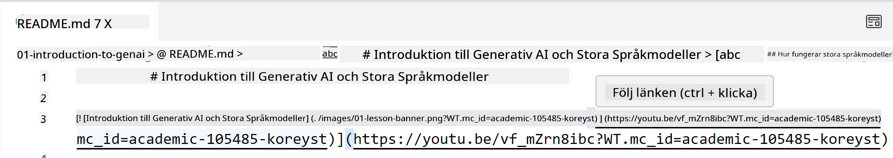
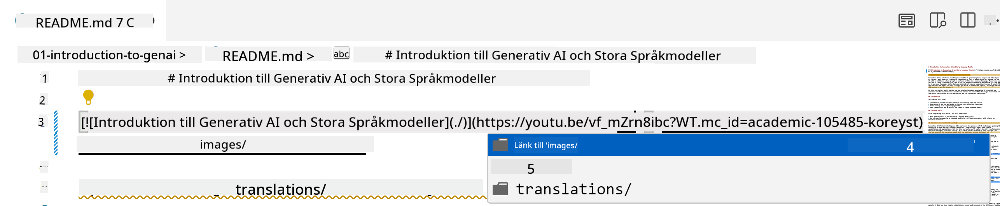
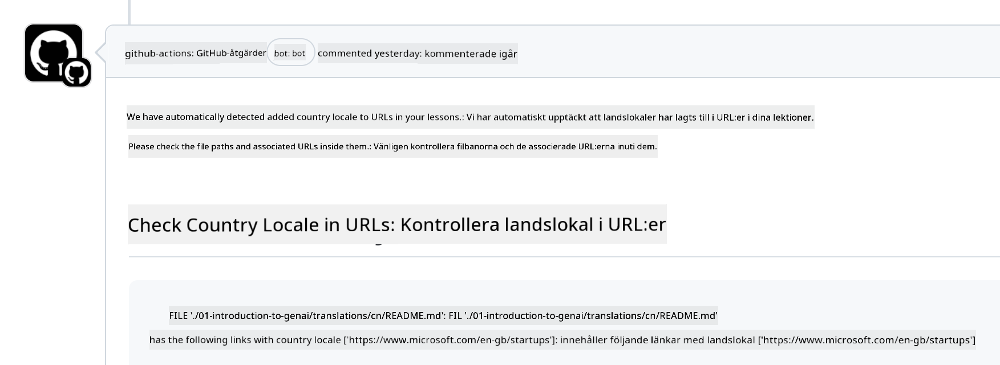

<!--
CO_OP_TRANSLATOR_METADATA:
{
  "original_hash": "57c41f2af71001a2cff9d8eb797cb843",
  "translation_date": "2025-05-19T11:17:29+00:00",
  "source_file": "CONTRIBUTING.md",
  "language_code": "sv"
}
-->
# Bidra

Detta projekt välkomnar bidrag och förslag. De flesta bidrag kräver att du godkänner ett Contributor License Agreement (CLA) som deklarerar att du har rätt att, och faktiskt ger oss rättigheter att använda ditt bidrag. För detaljer, besök <https://cla.microsoft.com>.

> Viktigt: när du översätter text i detta repo, se till att du inte använder maskinöversättning. Vi kommer att verifiera översättningar via gemenskapen, så anmäl dig endast för översättningar på språk där du är kunnig.

När du skickar in en pull-begäran kommer en CLA-bot automatiskt att avgöra om du behöver tillhandahålla en CLA och märka PR:n på lämpligt sätt (t.ex. etikett, kommentar). Följ helt enkelt instruktionerna från boten. Du behöver bara göra detta en gång för alla arkiv som använder vår CLA.

## Uppförandekod

Detta projekt har antagit [Microsoft Open Source Code of Conduct](https://opensource.microsoft.com/codeofconduct/?WT.mc_id=academic-105485-koreyst). För mer information, läs [Code of Conduct FAQ](https://opensource.microsoft.com/codeofconduct/faq/?WT.mc_id=academic-105485-koreyst) eller kontakta [opencode@microsoft.com](mailto:opencode@microsoft.com) med eventuella ytterligare frågor eller kommentarer.

## Fråga eller problem?

Öppna inte GitHub-ärenden för allmänna supportfrågor eftersom GitHub-listan bör användas för funktionsförfrågningar och buggrapporter. På så sätt kan vi lättare spåra faktiska problem eller buggar från koden och hålla den allmänna diskussionen separat från själva koden.

## Stavfel, problem, buggar och bidrag

När du skickar in ändringar till Generative AI for Beginners-repositoryt, följ dessa rekommendationer.

* Forka alltid repositoryt till ditt eget konto innan du gör dina ändringar
* Kombinera inte flera ändringar till en pull-begäran. Till exempel, skicka in buggrättelser och dokumentationsuppdateringar med separata PR:er
* Om din pull-begäran visar sammanslagningskonflikter, se till att uppdatera din lokala main så att den speglar vad som finns i huvudrepositoryt innan du gör dina ändringar
* Om du skickar in en översättning, skapa en PR för alla de översatta filerna eftersom vi inte accepterar partiella översättningar av innehållet
* Om du skickar in ett stavfel eller en dokumentationsfix, kan du kombinera ändringar till en enda PR där det är lämpligt

## Allmän vägledning för skrivande

- Se till att alla dina URL:er är inneslutna i hakparenteser följt av en parentes utan extra mellanslag runt dem eller inuti dem ``.
- Se till att eventuella relativa länkar (dvs. länkar till andra filer och mappar i repositoryt) börjar med en `./` som hänvisar till en fil eller mapp i den aktuella arbetskatalogen eller en `../` som hänvisar till en fil eller mapp i en överordnad arbetskatalog.
- Se till att eventuella relativa länkar (dvs. länkar till andra filer och mappar i repositoryt) har ett spårnings-ID (dvs. `?` eller `&` sedan `wt.mc_id=` eller `WT.mc_id=`) i slutet av det.
- Se till att alla URL:er från följande domäner _github.com, microsoft.com, visualstudio.com, aka.ms och azure.com_ har ett spårnings-ID (dvs. `?` eller `&` sedan `wt.mc_id=` eller `WT.mc_id=`) i slutet av det.
- Se till att dina länkar inte har landspecifika lokalinställningar i dem (dvs. `/en-us/` eller `/en/`).
- Se till att alla bilder lagras i `./images`-mappen.
- Se till att bilderna har beskrivande namn med engelska tecken, siffror och bindestreck i namnet på din bild.

## GitHub-arbetsflöden

När du skickar in en pull-begäran kommer fyra olika arbetsflöden att aktiveras för att validera de tidigare reglerna. Följ helt enkelt instruktionerna som listas här för att klara arbetsflödeskontrollerna.

- [Kontrollera brutna relativa sökvägar](../..)
- [Kontrollera att sökvägar har spårning](../..)
- [Kontrollera att URL:er har spårning](../..)
- [Kontrollera att URL:er inte har lokalinställningar](../..)

### Kontrollera brutna relativa sökvägar

Detta arbetsflöde säkerställer att alla relativa sökvägar i dina filer fungerar. Detta repository är distribuerat till GitHub-sidor så du måste vara mycket försiktig när du skriver länkarna som håller allt samman för att inte leda någon till fel plats.

För att säkerställa att dina länkar fungerar korrekt, använd helt enkelt VS code för att kontrollera det.

Till exempel, när du hovrar över någon länk i dina filer kommer du att uppmanas att följa länken genom att trycka på **ctrl + klick**

Om du klickar på en länk och den inte fungerar lokalt, kommer det säkert att utlösa arbetsflödet och inte fungera på GitHub.

För att lösa detta problem, försök att skriva länken med hjälp av VS code.

När du skriver `./` eller `../` kommer VS code att uppmana dig att välja från de tillgängliga alternativen beroende på vad du skrev.

Följ sökvägen genom att klicka på den önskade filen eller mappen och du kommer att vara säker på att din sökväg inte är bruten.

När du har lagt till den korrekta relativa sökvägen, spara och tryck på dina ändringar, kommer arbetsflödet att aktiveras igen för att verifiera dina ändringar. Om du klarar kontrollen är du redo att gå vidare.

### Kontrollera att sökvägar har spårning

Detta arbetsflöde säkerställer att alla relativa sökvägar har spårning i dem. Detta repository är distribuerat till GitHub-sidor så vi behöver spåra rörelsen mellan de olika filerna och mapparna.

För att säkerställa att dina relativa sökvägar har spårning i dem, kontrollera helt enkelt efter följande text `?wt.mc_id=` i slutet av sökvägen. Om det är tillagt till dina relativa sökvägar kommer du att klara denna kontroll.

Om inte, kan du få följande fel.

För att lösa detta problem, försök att öppna filsökvägen som arbetsflödet markerade och lägg till spårnings-ID:t i slutet av de relativa sökvägarna.

När du har lagt till spårnings-ID:t, spara och tryck på dina ändringar, kommer arbetsflödet att aktiveras igen för att verifiera dina ändringar. Om du klarar kontrollen är du redo att gå vidare.

### Kontrollera att URL:er har spårning

Detta arbetsflöde säkerställer att alla webbadresser har spårning i dem. Detta repository är tillgängligt för alla så du måste se till att spåra åtkomsten för att veta varifrån trafiken kommer.

För att säkerställa att dina URL:er har spårning i dem, kontrollera helt enkelt efter följande text `?wt.mc_id=` i slutet av URL:en. Om det är tillagt till dina URL:er kommer du att klara denna kontroll.

Om inte, kan du få följande fel.

För att lösa detta problem, försök att öppna filsökvägen som arbetsflödet markerade och lägg till spårnings-ID:t i slutet av URL:erna.

När du har lagt till spårnings-ID:t, spara och tryck på dina ändringar, kommer arbetsflödet att aktiveras igen för att verifiera dina ändringar. Om du klarar kontrollen är du redo att gå vidare.

### Kontrollera att URL:er inte har lokalinställningar

Detta arbetsflöde säkerställer att alla webbadresser inte har landspecifika lokalinställningar i dem. Detta repository är tillgängligt för alla runt om i världen så du måste se till att inte inkludera ditt lands lokalinställning i URL:er.

För att säkerställa att dina URL:er inte har landslokal i dem, kontrollera helt enkelt efter följande text `/en-us/` eller `/en/` eller någon annan språk-lokal var som helst i URL:en. Om det inte finns i dina URL:er kommer du att klara denna kontroll.

Om inte, kan du få följande fel.

För att lösa detta problem, försök att öppna filsökvägen som arbetsflödet markerade och ta bort landslokalen från URL:erna.

När du har tagit bort landslokalen, spara och tryck på dina ändringar, kommer arbetsflödet att aktiveras igen för att verifiera dina ändringar. Om du klarar kontrollen är du redo att gå vidare.

Grattis! Vi kommer att återkomma till dig så snart som möjligt med feedback om ditt bidrag.

**Ansvarsfriskrivning**:  
Detta dokument har översatts med hjälp av AI-översättningstjänsten [Co-op Translator](https://github.com/Azure/co-op-translator). Även om vi strävar efter noggrannhet, var medveten om att automatiserade översättningar kan innehålla fel eller oriktigheter. Det ursprungliga dokumentet på sitt modersmål bör betraktas som den auktoritativa källan. För kritisk information rekommenderas professionell mänsklig översättning. Vi ansvarar inte för eventuella missförstånd eller feltolkningar som uppstår vid användning av denna översättning.