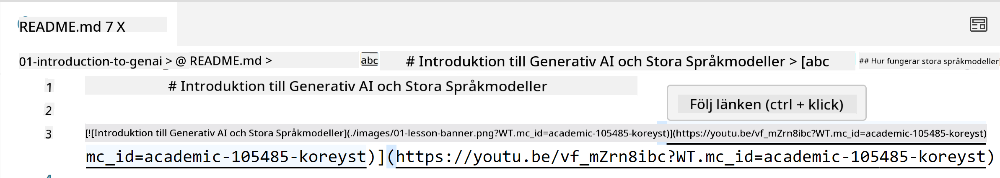
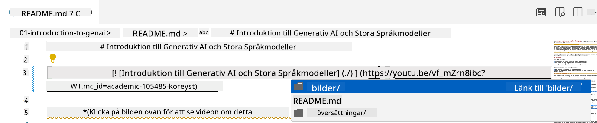
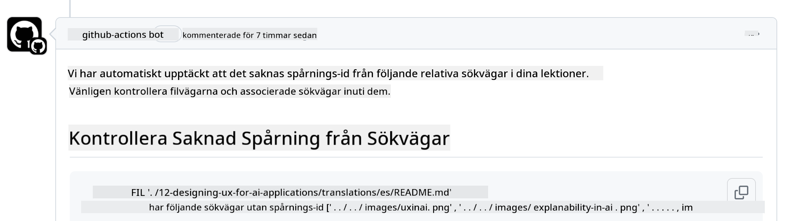
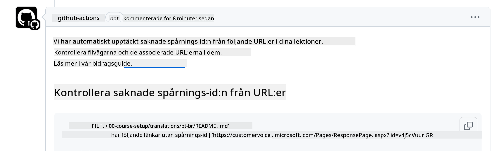
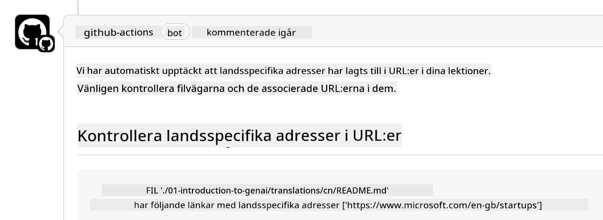

<!--
CO_OP_TRANSLATOR_METADATA:
{
  "original_hash": "57c41f2af71001a2cff9d8eb797cb843",
  "translation_date": "2025-06-25T07:11:51+00:00",
  "source_file": "CONTRIBUTING.md",
  "language_code": "sv"
}
-->
# Bidra

Det här projektet välkomnar bidrag och förslag. De flesta bidrag kräver att du går med på ett Contributor License Agreement (CLA) som deklarerar att du har rätt att, och faktiskt gör, ge oss rättigheter att använda ditt bidrag. För detaljer, besök <https://cla.microsoft.com>.

> Viktigt: när du översätter text i detta repo, se till att du inte använder maskinöversättning. Vi kommer att verifiera översättningar via communityn, så vänligen anmäl dig endast för översättningar på språk där du är kunnig.

När du skickar in en pull request kommer en CLA-bot automatiskt att avgöra om du behöver tillhandahålla ett CLA och dekorera PR:n på lämpligt sätt (t.ex. etikett, kommentar). Följ bara instruktionerna som ges av boten. Du behöver bara göra detta en gång för alla repositorier som använder vårt CLA.

## Uppförandekod

Det här projektet har antagit [Microsoft Open Source Code of Conduct](https://opensource.microsoft.com/codeofconduct/?WT.mc_id=academic-105485-koreyst). För mer information, läs [Code of Conduct FAQ](https://opensource.microsoft.com/codeofconduct/faq/?WT.mc_id=academic-105485-koreyst) eller kontakta [opencode@microsoft.com](mailto:opencode@microsoft.com) med eventuella ytterligare frågor eller kommentarer.

## Fråga eller Problem?

Öppna inte GitHub-ärenden för allmänna supportfrågor eftersom GitHub-listan bör användas för funktionsförfrågningar och buggrapporter. På så sätt kan vi lättare spåra faktiska problem eller buggar från koden och hålla den allmänna diskussionen separat från den faktiska koden.

## Stavfel, Problem, Buggar och bidrag

När du skickar in ändringar till Generative AI for Beginners-repositoriet, vänligen följ dessa rekommendationer.

* Förgrena alltid repositoriet till ditt eget konto innan du gör dina ändringar
* Kombinera inte flera ändringar till en pull request. Till exempel, skicka in bugfixar och dokumentationsuppdateringar med separata PR:er
* Om din pull request visar sammanslagningskonflikter, se till att uppdatera din lokala main så att den speglar vad som finns i huvudrepositoriet innan du gör dina ändringar
* Om du skickar in en översättning, vänligen skapa en PR för alla översatta filer eftersom vi inte accepterar partiella översättningar av innehållet
* Om du skickar in ett stavfel eller dokumentationsfix kan du kombinera ändringar till en enda PR där det är lämpligt

## Allmän vägledning för skrivande

- Se till att alla dina URL:er är omslutna av fyrkantiga parenteser följt av en parentes utan extra mellanslag runt dem eller inuti dem ``.
- Se till att alla relativa länkar (dvs. länkar till andra filer och mappar i repositoriet) börjar med en `./` som hänvisar till en fil eller mapp som finns i den aktuella arbetskatalogen eller en `../` som hänvisar till en fil eller mapp som finns i en föräldraarbetskatalog.
- Se till att alla relativa länkar (dvs. länkar till andra filer och mappar i repositoriet) har ett spårnings-ID (dvs. `?` eller `&` sedan `wt.mc_id=` eller `WT.mc_id=`) i slutet av dem.
- Se till att alla URL:er från följande domäner _github.com, microsoft.com, visualstudio.com, aka.ms, och azure.com_ har ett spårnings-ID (dvs. `?` eller `&` sedan `wt.mc_id=` eller `WT.mc_id=`) i slutet av dem.
- Se till att dina länkar inte har landspecifik lokalitet i dem (dvs. `/en-us/` eller `/en/`).
- Se till att alla bilder är lagrade i mappen `./images`.
- Se till att bilderna har beskrivande namn med engelska tecken, siffror och bindestreck i namnet på din bild.

## GitHub Arbetsflöden

När du skickar in en pull request kommer fyra olika arbetsflöden att aktiveras för att validera de tidigare reglerna. Följ bara instruktionerna som listas här för att klara arbetsflödeskontrollerna.

- [Check Broken Relative Paths](../..)
- [Check Paths Have Tracking](../..)
- [Check URLs Have Tracking](../..)
- [Check URLs Don't Have Locale](../..)

### Check Broken Relative Paths

Det här arbetsflödet säkerställer att alla relativa sökvägar i dina filer fungerar. Detta repositorium är distribuerat till GitHub-sidor så du måste vara mycket försiktig när du skriver länkarna som håller allt samman så att du inte leder någon till fel plats.

För att säkerställa att dina länkar fungerar korrekt, använd helt enkelt VS Code för att kontrollera det.

Till exempel, när du svävar över någon länk i dina filer kommer du att bli uppmanad att följa länken genom att trycka på **ctrl + klick**

Om du klickar på en länk och den inte fungerar lokalt kommer den säkert att utlösa arbetsflödet och inte fungera på GitHub.

För att åtgärda detta problem, försök att skriva länken med hjälp av VS Code.

När du skriver `./` eller `../` kommer VS Code att uppmana dig att välja från de tillgängliga alternativen enligt vad du skrev.

Följ sökvägen genom att klicka på den önskade filen eller mappen och du kommer att vara säker på att din sökväg inte är trasig.

När du har lagt till den korrekta relativa sökvägen, spara och skicka dina ändringar kommer arbetsflödet att utlösas igen för att verifiera dina ändringar. Om du klarar kontrollen är du redo att gå vidare.

### Check Paths Have Tracking

Det här arbetsflödet säkerställer att alla relativa sökvägar har spårning i sig. Detta repositorium är distribuerat till GitHub-sidor så vi behöver spåra rörelsen mellan de olika filerna och mapparna.

För att säkerställa att dina relativa sökvägar har spårning i dem, kontrollera helt enkelt efter följande text `?wt.mc_id=` i slutet av sökvägen. Om det är bifogat till dina relativa sökvägar kommer du att klara denna kontroll.

Om inte, kan du få följande fel.

För att åtgärda detta problem, försök att öppna filsökvägen som arbetsflödet markerade och lägg till spårnings-ID till slutet av de relativa sökvägarna.

När du har lagt till spårnings-ID, spara och skicka dina ändringar kommer arbetsflödet att utlösas igen för att verifiera dina ändringar. Om du klarar kontrollen är du redo att gå vidare.

### Check URLs Have Tracking

Det här arbetsflödet säkerställer att alla webbadresser har spårning i sig. Detta repositorium är tillgängligt för alla så du måste se till att spåra åtkomsten för att veta varifrån trafiken kommer.

För att säkerställa att dina URL:er har spårning i dem, kontrollera helt enkelt efter följande text `?wt.mc_id=` i slutet av URL:en. Om det är bifogat till dina URL:er kommer du att klara denna kontroll.

Om inte, kan du få följande fel.

För att åtgärda detta problem, försök att öppna filsökvägen som arbetsflödet markerade och lägg till spårnings-ID till slutet av URL:erna.

När du har lagt till spårnings-ID, spara och skicka dina ändringar kommer arbetsflödet att utlösas igen för att verifiera dina ändringar. Om du klarar kontrollen är du redo att gå vidare.

### Check URLs Don't Have Locale

Det här arbetsflödet säkerställer att alla webbadresser inte har landspecifik lokalitet i sig. Detta repositorium är tillgängligt för alla runt om i världen så du måste se till att inte inkludera ditt lands lokalitet i URL:er.

För att säkerställa att dina URL:er inte har landslokalitet i sig, kontrollera helt enkelt efter följande text `/en-us/` eller `/en/` eller någon annan språk lokalitet var som helst i URL:en. Om det inte finns i dina URL:er kommer du att klara denna kontroll.

Om inte, kan du få följande fel.

För att åtgärda detta problem, försök att öppna filsökvägen som arbetsflödet markerade och ta bort landslokaliteten från URL:erna.

När du har tagit bort landslokaliteten, spara och skicka dina ändringar kommer arbetsflödet att utlösas igen för att verifiera dina ändringar. Om du klarar kontrollen är du redo att gå vidare.

Grattis! Vi kommer att återkomma till dig så snart som möjligt med feedback om ditt bidrag.

**Ansvarsfriskrivning**:  
Detta dokument har översatts med hjälp av AI-översättningstjänsten [Co-op Translator](https://github.com/Azure/co-op-translator). Vi strävar efter noggrannhet, men var medveten om att automatiserade översättningar kan innehålla fel eller felaktigheter. Det ursprungliga dokumentet på dess modersmål bör betraktas som den auktoritativa källan. För kritisk information rekommenderas professionell mänsklig översättning. Vi ansvarar inte för eventuella missförstånd eller feltolkningar som uppstår vid användning av denna översättning.