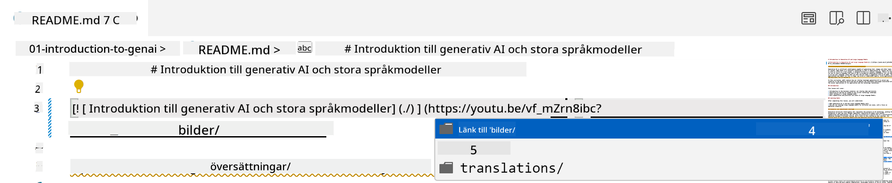
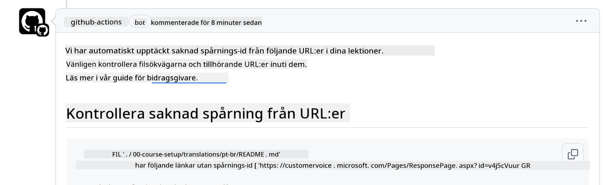
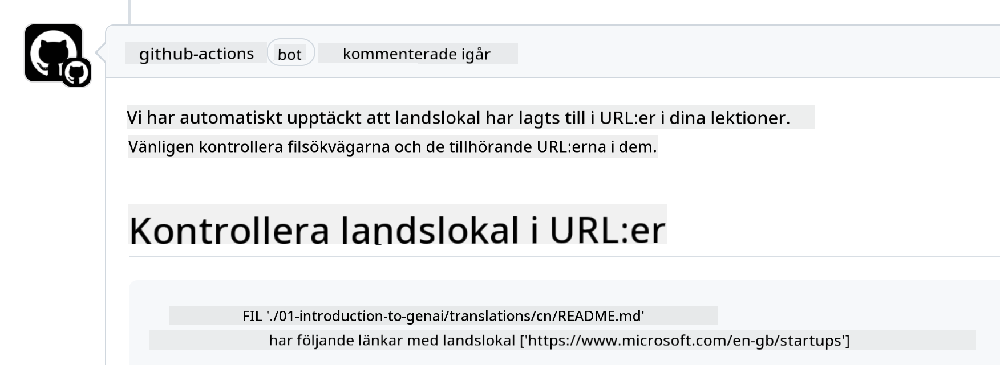

<!--
CO_OP_TRANSLATOR_METADATA:
{
  "original_hash": "57c41f2af71001a2cff9d8eb797cb843",
  "translation_date": "2025-07-09T06:07:40+00:00",
  "source_file": "CONTRIBUTING.md",
  "language_code": "sv"
}
-->
# Bidra

Det här projektet välkomnar bidrag och förslag. De flesta bidrag kräver att du
accepterar ett Contributor License Agreement (CLA) som intygar att du har rätt att,
och faktiskt gör det, ge oss rättigheterna att använda ditt bidrag. För mer information, besök
<https://cla.microsoft.com>.

> Viktigt: när du översätter text i detta repo, se till att du inte använder maskinöversättning. Vi kommer att verifiera översättningarna via communityn, så var vänlig och erbjud dig endast att översätta till språk du behärskar väl.

När du skickar en pull request kommer en CLA-bot automatiskt att avgöra om du behöver
lämna in en CLA och märka PR:n på lämpligt sätt (t.ex. etikett, kommentar). Följ bara
instruktionerna från boten. Du behöver bara göra detta en gång för alla repos som använder vår CLA.

## Uppförandekod

Det här projektet har antagit [Microsoft Open Source Code of Conduct](https://opensource.microsoft.com/codeofconduct/?WT.mc_id=academic-105485-koreyst).
För mer information, läs [Code of Conduct FAQ](https://opensource.microsoft.com/codeofconduct/faq/?WT.mc_id=academic-105485-koreyst) eller kontakta [opencode@microsoft.com](mailto:opencode@microsoft.com) vid ytterligare frågor eller kommentarer.

## Fråga eller problem?

Vänligen öppna inte GitHub-ärenden för allmänna supportfrågor eftersom GitHub-listan ska användas för funktionsförfrågningar och bugg-rapporter. På så sätt kan vi enklare spåra faktiska problem eller buggar i koden och hålla den allmänna diskussionen separat från själva koden.

## Stavfel, problem, buggar och bidrag

När du skickar ändringar till Generative AI for Beginners-repositoriet, vänligen följ dessa rekommendationer.

* Forka alltid repositoriet till ditt eget konto innan du gör dina ändringar
* Kombinera inte flera ändringar i en pull request. Till exempel, skicka buggfixar och dokumentationsuppdateringar i separata PR:er
* Om din pull request visar merge-konflikter, se till att uppdatera din lokala main så att den speglar innehållet i huvudrepositoriet innan du gör dina ändringar
* Om du skickar en översättning, skapa en PR för alla översatta filer eftersom vi inte accepterar delvisa översättningar av innehållet
* Om du skickar en stavnings- eller dokumentationskorrigering kan du kombinera ändringar i en enda PR där det är lämpligt

## Allmänna riktlinjer för skrivande

- Se till att alla dina URL:er är omslutna av hakparenteser följt av parentes utan extra mellanslag runt eller inuti ``.
- Se till att alla relativa länkar (dvs. länkar till andra filer och mappar i repositoriet) börjar med `./` som refererar till en fil eller mapp i den aktuella arbetskatalogen eller `../` som refererar till en fil eller mapp i en överordnad arbetskatalog.
- Se till att alla relativa länkar har en spårnings-ID (dvs. `?` eller `&` följt av `wt.mc_id=` eller `WT.mc_id=`) i slutet.
- Se till att alla URL:er från följande domäner _github.com, microsoft.com, visualstudio.com, aka.ms, och azure.com_ har en spårnings-ID (dvs. `?` eller `&` följt av `wt.mc_id=` eller `WT.mc_id=`) i slutet.
- Se till att dina länkar inte innehåller landspecifik lokal (dvs. `/en-us/` eller `/en/`).
- Se till att alla bilder är sparade i mappen `./images`.
- Se till att bilderna har beskrivande namn med engelska tecken, siffror och bindestreck i filnamnet.

## GitHub Workflows

När du skickar en pull request kommer fyra olika arbetsflöden att triggas för att validera ovanstående regler.
Följ bara instruktionerna här för att klara arbetsflödeskontrollerna.

- [Check Broken Relative Paths](../..)
- [Check Paths Have Tracking](../..)
- [Check URLs Have Tracking](../..)
- [Check URLs Don't Have Locale](../..)

### Check Broken Relative Paths

Detta arbetsflöde säkerställer att alla relativa sökvägar i dina filer fungerar.
Detta repo är publicerat på GitHub Pages, så du måste vara mycket noggrann när du skriver länkarna som binder ihop allt för att inte leda någon till fel plats.

För att säkerställa att dina länkar fungerar korrekt, använd helt enkelt VS Code för att kontrollera det.

Till exempel, när du hovrar över en länk i dina filer får du en prompt att följa länken genom att trycka på **ctrl + klick**

Om du klickar på en länk och den inte fungerar lokalt, kommer det med största sannolikhet att trigga arbetsflödet och inte fungera på GitHub.

För att åtgärda detta, försök skriva länken med hjälp av VS Code.

När du skriver `./` eller `../` kommer VS Code att föreslå tillgängliga alternativ baserat på vad du skrivit.

Följ sökvägen genom att klicka på önskad fil eller mapp och du kan vara säker på att din sökväg inte är bruten.

När du lagt till rätt relativa sökväg, spara och pusha dina ändringar så triggas arbetsflödet igen för att verifiera dina ändringar.
Om du klarar kontrollen är du redo att gå vidare.

### Check Paths Have Tracking

Detta arbetsflöde säkerställer att alla relativa sökvägar har spårning i sig.
Detta repo är publicerat på GitHub Pages, så vi behöver spåra rörelsen mellan olika filer och mappar.

För att säkerställa att dina relativa sökvägar har spårning, kontrollera helt enkelt att texten `?wt.mc_id=` finns i slutet av sökvägen.
Om det är tillagt i dina relativa sökvägar klarar du kontrollen.

Om inte, kan du få följande felmeddelande.

För att åtgärda detta, öppna filvägen som arbetsflödet markerat och lägg till spårnings-ID i slutet av de relativa sökvägarna.

När du lagt till spårnings-ID, spara och pusha dina ändringar så triggas arbetsflödet igen för att verifiera dina ändringar.
Om du klarar kontrollen är du redo att gå vidare.

### Check URLs Have Tracking

Detta arbetsflöde säkerställer att alla webbadresser har spårning i sig.
Detta repo är tillgängligt för alla, så du måste säkerställa att trafiken kan spåras för att veta varifrån den kommer.

För att säkerställa att dina URL:er har spårning, kontrollera att texten `?wt.mc_id=` finns i slutet av URL:en.
Om det är tillagt i dina URL:er klarar du kontrollen.

Om inte, kan du få följande felmeddelande.

För att åtgärda detta, öppna filvägen som arbetsflödet markerat och lägg till spårnings-ID i slutet av URL:erna.

När du lagt till spårnings-ID, spara och pusha dina ändringar så triggas arbetsflödet igen för att verifiera dina ändringar.
Om du klarar kontrollen är du redo att gå vidare.

### Check URLs Don't Have Locale

Detta arbetsflöde säkerställer att inga webbadresser innehåller landspecifik lokal.
Detta repo är tillgängligt för alla i hela världen, så du måste se till att inte inkludera ditt lands lokal i URL:erna.

För att säkerställa att dina URL:er inte innehåller landslokal, kontrollera att texten `/en-us/` eller `/en/` eller någon annan språklokal inte finns någonstans i URL:en.
Om det inte finns i dina URL:er klarar du kontrollen.

Om inte, kan du få följande felmeddelande.

För att åtgärda detta, öppna filvägen som arbetsflödet markerat och ta bort landslokalen från URL:erna.

När du tagit bort landslokalen, spara och pusha dina ändringar så triggas arbetsflödet igen för att verifiera dina ändringar.
Om du klarar kontrollen är du redo att gå vidare.

Grattis! Vi återkommer så snart som möjligt med feedback på ditt bidrag.

**Ansvarsfriskrivning**:  
Detta dokument har översatts med hjälp av AI-översättningstjänsten [Co-op Translator](https://github.com/Azure/co-op-translator). Även om vi strävar efter noggrannhet, vänligen observera att automatiska översättningar kan innehålla fel eller brister. Det ursprungliga dokumentet på dess modersmål bör betraktas som den auktoritativa källan. För kritisk information rekommenderas professionell mänsklig översättning. Vi ansvarar inte för några missförstånd eller feltolkningar som uppstår vid användning av denna översättning.