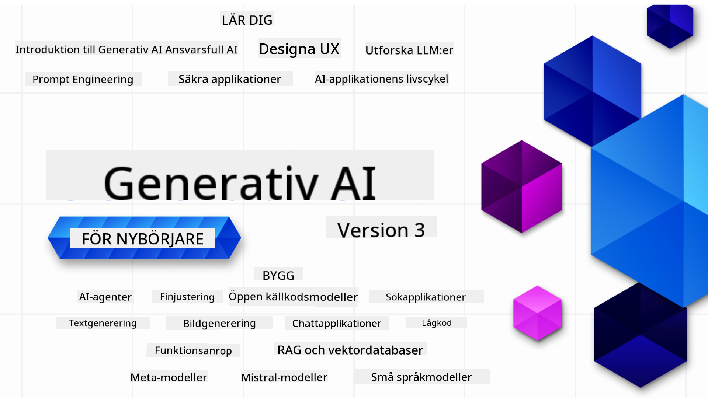

<!--
CO_OP_TRANSLATOR_METADATA:
{
  "original_hash": "054860715e642de31fa8e15c6d01f2b1",
  "translation_date": "2026-01-05T15:59:10+00:00",
  "source_file": "README.md",
  "language_code": "sv"
}
-->


### 21 lektioner som lär dig allt du behöver veta för att börja bygga generativa AI-applikationer

[](https://github.com/microsoft/Generative-AI-For-Beginners/blob/master/LICENSE?WT.mc_id=academic-105485-koreyst)
[](https://GitHub.com/microsoft/Generative-AI-For-Beginners/graphs/contributors/?WT.mc_id=academic-105485-koreyst)
[](https://GitHub.com/microsoft/Generative-AI-For-Beginners/issues/?WT.mc_id=academic-105485-koreyst)
[](https://GitHub.com/microsoft/Generative-AI-For-Beginners/pulls/?WT.mc_id=academic-105485-koreyst)
[](http://makeapullrequest.com?WT.mc_id=academic-105485-koreyst)

[](https://GitHub.com/microsoft/Generative-AI-For-Beginners/watchers/?WT.mc_id=academic-105485-koreyst)
[](https://GitHub.com/microsoft/Generative-AI-For-Beginners/network/?WT.mc_id=academic-105485-koreyst)
[](https://GitHub.com/microsoft/Generative-AI-For-Beginners/stargazers/?WT.mc_id=academic-105485-koreyst)

[](https://discord.gg/nTYy5BXMWG)

### 🌐 Fler språkstöd

#### Stöds via GitHub Action (Automatiserat och alltid uppdaterat)

<!-- CO-OP TRANSLATOR LANGUAGES TABLE START -->
[Arabiska](../ar/README.md) | [Bengali](../bn/README.md) | [Bulgarska](../bg/README.md) | [Burmese (Myanmar)](../my/README.md) | [Kinesiska (Förenklad)](../zh/README.md) | [Kinesiska (Traditionell, Hongkong)](../hk/README.md) | [Kinesiska (Traditionell, Macao)](../mo/README.md) | [Kinesiska (Traditionell, Taiwan)](../tw/README.md) | [Kroatiska](../hr/README.md) | [Tjeckiska](../cs/README.md) | [Danska](../da/README.md) | [Holländska](../nl/README.md) | [Estniska](../et/README.md) | [Finska](../fi/README.md) | [Franska](../fr/README.md) | [Tyska](../de/README.md) | [Grekiska](../el/README.md) | [Hebreiska](../he/README.md) | [Hindi](../hi/README.md) | [Ungerska](../hu/README.md) | [Indonesiska](../id/README.md) | [Italienska](../it/README.md) | [Japanska](../ja/README.md) | [Kannada](../kn/README.md) | [Koreanska](../ko/README.md) | [Litauiska](../lt/README.md) | [Malay](../ms/README.md) | [Malayalam](../ml/README.md) | [Marathi](../mr/README.md) | [Nepalesiska](../ne/README.md) | [Nigeriansk Pidgin](../pcm/README.md) | [Norska](../no/README.md) | [Persiska (Farsi)](../fa/README.md) | [Polska](../pl/README.md) | [Portugisiska (Brasilien)](../br/README.md) | [Portugisiska (Portugal)](../pt/README.md) | [Punjabi (Gurmukhi)](../pa/README.md) | [Rumänska](../ro/README.md) | [Ryska](../ru/README.md) | [Serbiska (Kyrilliska)](../sr/README.md) | [Slovakiska](../sk/README.md) | [Slovenska](../sl/README.md) | [Spanska](../es/README.md) | [Swahili](../sw/README.md) | [Svenska](./README.md) | [Tagalog (Filippinska)](../tl/README.md) | [Tamil](../ta/README.md) | [Telugu](../te/README.md) | [Thailändska](../th/README.md) | [Turkiska](../tr/README.md) | [Ukrainska](../uk/README.md) | [Urdu](../ur/README.md) | [Vietnamesiska](../vi/README.md)

> **Föredrar du att klona lokalt?**

> Detta arkiv innehåller över 50 språkversioner vilket markant ökar nedladdningsstorleken. För att klona utan översättningar, använd sparse checkout:
> ```bash
> git clone --filter=blob:none --sparse https://github.com/microsoft/generative-ai-for-beginners.git
> cd generative-ai-for-beginners
> git sparse-checkout set --no-cone '/*' '!translations' '!translated_images'
> ```
> Detta ger dig allt du behöver för att slutföra kursen med en mycket snabbare nedladdning.
<!-- CO-OP TRANSLATOR LANGUAGES TABLE END -->

# Generativ AI för nybörjare (Version 3) - En kurs

Lär dig grunderna i att bygga generativa AI-applikationer med vår 21-lektioners omfattande kurs från Microsoft Cloud Advocates.

## 🌱 Kom igång

Denna kurs har 21 lektioner. Varje lektion behandlar ett eget ämne så börja där du vill!

Lektioner är märkta antingen som "Learn"-lektioner där ett generativt AI-koncept förklaras eller "Build"-lektioner där ett koncept förklaras med kodexempel i både **Python** och **TypeScript** när det är möjligt.

För .NET-utvecklare, kolla in [Generative AI for Beginners (.NET Edition)](https://github.com/microsoft/Generative-AI-for-beginners-dotnet?WT.mc_id=academic-105485-koreyst)!

Varje lektion innehåller också en sektion för "Keep Learning" med ytterligare lärresurser.

## Vad du behöver
### För att köra koden i denna kurs kan du använda antingen:
 - [Azure OpenAI Service](https://aka.ms/genai-beginners/azure-open-ai?WT.mc_id=academic-105485-koreyst) - **Lektioner:** "aoai-assignment"
 - [GitHub Marketplace Model Catalog](https://aka.ms/genai-beginners/gh-models?WT.mc_id=academic-105485-koreyst) - **Lektioner:** "githubmodels"
 - [OpenAI API](https://aka.ms/genai-beginners/open-ai?WT.mc_id=academic-105485-koreyst) - **Lektioner:** "oai-assignment" 
   
- Grundläggande kunskaper i Python eller TypeScript är hjälpsamt - \*För absoluta nybörjare kolla in dessa [Python](https://aka.ms/genai-beginners/python?WT.mc_id=academic-105485-koreyst) och [TypeScript](https://aka.ms/genai-beginners/typescript?WT.mc_id=academic-105485-koreyst) kurser
- Ett GitHub-konto för att [forka hela detta repo](https://aka.ms/genai-beginners/github?WT.mc_id=academic-105485-koreyst) till ditt eget GitHub-konto

Vi har skapat en **[Course Setup](./00-course-setup/README.md?WT.mc_id=academic-105485-koreyst)** lektion för att hjälpa dig att sätta upp din utvecklingsmiljö.

Glöm inte att [stjärnmärka (🌟) detta repo](https://docs.github.com/en/get-started/exploring-projects-on-github/saving-repositories-with-stars?WT.mc_id=academic-105485-koreyst) för att lättare hitta det senare.

## 🧠 Redo att distribuera?

Om du söker mer avancerade kodexempel, se vår [samling av Generative AI-kodexempel](https://aka.ms/genai-beg-code?WT.mc_id=academic-105485-koreyst) i både **Python** och **TypeScript**.

## 🗣️ Möt andra studerande, få support

Gå med i vår [officiella Azure AI Foundry Discord-server](https://aka.ms/genai-discord?WT.mc_id=academic-105485-koreyst) för att träffa och nätverka med andra som går denna kurs och få stöd.

Ställ frågor eller dela produktfeedback i vårt [Azure AI Foundry Developer Forum](https://aka.ms/azureaifoundry/forum) på Github.

## 🚀 Bygger du en startup?

Besök [Microsoft for Startups](https://www.microsoft.com/startups) för att få reda på hur du kan börja bygga med Azure-krediter idag.

## 🙏 Vill du hjälpa till?

Har du förslag eller hittat stavfel eller kodfel? [Öppna ett ärende](https://github.com/microsoft/generative-ai-for-beginners/issues?WT.mc_id=academic-105485-koreyst) eller [Skapa en pull-begäran](https://github.com/microsoft/generative-ai-for-beginners/pulls?WT.mc_id=academic-105485-koreyst)

## 📂 Varje lektion inkluderar:

- En kort videointroduktion till ämnet
- En skriftlig lektion som finns i README
- Python- och TypeScript-kodexempel som stöder Azure OpenAI och OpenAI API
- Länkar till extra resurser för fortsatt lärande

## 🗃️ Lektioner

| #   | **Lektionslänk**                                                                                                                              | **Beskrivning**                                                                               | **Video**                                                                   | **Extra lärande**                                                              |
| --- | -------------------------------------------------------------------------------------------------------------------------------------------- | --------------------------------------------------------------------------------------------- | --------------------------------------------------------------------------- | ------------------------------------------------------------------------------ |
| 00  | [Kursupplägg](./00-course-setup/README.md?WT.mc_id=academic-105485-koreyst)                                                                    | **Lär dig:** Hur du sätter upp din utvecklingsmiljö                                          | Video kommer snart                                                             | [Läs mer](https://aka.ms/genai-collection?WT.mc_id=academic-105485-koreyst)     |
| 01  | [Introduktion till generativ AI och LLMs](./01-introduction-to-genai/README.md?WT.mc_id=academic-105485-koreyst)                              | **Lär dig:** Förstå vad generativ AI är och hur stora språkmodeller (LLMs) fungerar.          | [Video](https://aka.ms/gen-ai-lesson-1-gh?WT.mc_id=academic-105485-koreyst) | [Läs mer](https://aka.ms/genai-collection?WT.mc_id=academic-105485-koreyst)     |
| 02  | [Utforska och jämför olika LLMs](./02-exploring-and-comparing-different-llms/README.md?WT.mc_id=academic-105485-koreyst)                     | **Lär dig:** Hur du väljer rätt modell för ditt användningsfall                              | [Video](https://aka.ms/gen-ai-lesson2-gh?WT.mc_id=academic-105485-koreyst)  | [Läs mer](https://aka.ms/genai-collection?WT.mc_id=academic-105485-koreyst)     |
| 03  | [Använd Generativ AI ansvarsfullt](./03-using-generative-ai-responsibly/README.md?WT.mc_id=academic-105485-koreyst)                           | **Lär dig:** Hur man bygger generativa AI-applikationer på ett ansvarsfullt sätt             | [Video](https://aka.ms/gen-ai-lesson3-gh?WT.mc_id=academic-105485-koreyst)  | [Läs mer](https://aka.ms/genai-collection?WT.mc_id=academic-105485-koreyst)     |
| 04  | [Förstå grunderna i promptteknik](./04-prompt-engineering-fundamentals/README.md?WT.mc_id=academic-105485-koreyst)                           | **Lär dig:** Praktiska bästa metoder för promptteknik                                       | [Video](https://aka.ms/gen-ai-lesson4-gh?WT.mc_id=academic-105485-koreyst)  | [Läs mer](https://aka.ms/genai-collection?WT.mc_id=academic-105485-koreyst)     |
| 05  | [Skapa avancerade prompts](./05-advanced-prompts/README.md?WT.mc_id=academic-105485-koreyst)                                                | **Lär dig:** Hur man tillämpar prompt-engineering tekniker som förbättrar resultatet av dina prompts. | [Video](https://aka.ms/gen-ai-lesson5-gh?WT.mc_id=academic-105485-koreyst)  | [Läs mer](https://aka.ms/genai-collection?WT.mc_id=academic-105485-koreyst) |
| 06  | [Bygga textgenereringsapplikationer](./06-text-generation-apps/README.md?WT.mc_id=academic-105485-koreyst)                                | **Bygg:** En textgenereringsapp med Azure OpenAI / OpenAI API                                | [Video](https://aka.ms/gen-ai-lesson6-gh?WT.mc_id=academic-105485-koreyst)  | [Läs mer](https://aka.ms/genai-collection?WT.mc_id=academic-105485-koreyst) |
| 07  | [Bygga chattapplikationer](./07-building-chat-applications/README.md?WT.mc_id=academic-105485-koreyst)                                     | **Bygg:** Tekniker för effektivt byggande och integration av chattapplikationer.               | [Video](https://aka.ms/gen-ai-lessons7-gh?WT.mc_id=academic-105485-koreyst) | [Läs mer](https://aka.ms/genai-collection?WT.mc_id=academic-105485-koreyst) |
| 08  | [Bygga sökappar med vektordatabaser](./08-building-search-applications/README.md?WT.mc_id=academic-105485-koreyst)                        | **Bygg:** En sökapplikation som använder embeddings för att söka efter data.                        | [Video](https://aka.ms/gen-ai-lesson8-gh?WT.mc_id=academic-105485-koreyst)  | [Läs mer](https://aka.ms/genai-collection?WT.mc_id=academic-105485-koreyst) |
| 09  | [Bygga bildgenereringsapplikationer](./09-building-image-applications/README.md?WT.mc_id=academic-105485-koreyst)                        | **Bygg:** En applikation för bildgenerering                                                       | [Video](https://aka.ms/gen-ai-lesson9-gh?WT.mc_id=academic-105485-koreyst)  | [Läs mer](https://aka.ms/genai-collection?WT.mc_id=academic-105485-koreyst) |
| 10  | [Bygga lågkod AI-applikationer](./10-building-low-code-ai-applications/README.md?WT.mc_id=academic-105485-koreyst)                       | **Bygg:** En generativ AI-applikation med lågkodverktyg                                     | [Video](https://aka.ms/gen-ai-lesson10-gh?WT.mc_id=academic-105485-koreyst) | [Läs mer](https://aka.ms/genai-collection?WT.mc_id=academic-105485-koreyst) |
| 11  | [Integrera externa applikationer med funktionsanrop](./11-integrating-with-function-calling/README.md?WT.mc_id=academic-105485-koreyst) | **Bygg:** Vad funktionsanrop är och dess användningsområden för applikationer                          | [Video](https://aka.ms/gen-ai-lesson11-gh?WT.mc_id=academic-105485-koreyst) | [Läs mer](https://aka.ms/genai-collection?WT.mc_id=academic-105485-koreyst) |
| 12  | [Designa UX för AI-applikationer](./12-designing-ux-for-ai-applications/README.md?WT.mc_id=academic-105485-koreyst)                         | **Lär dig:** Hur man tillämpar UX-designprinciper vid utveckling av generativa AI-applikationer         | [Video](https://aka.ms/gen-ai-lesson12-gh?WT.mc_id=academic-105485-koreyst) | [Läs mer](https://aka.ms/genai-collection?WT.mc_id=academic-105485-koreyst) |
| 13  | [Säkra dina generativa AI-applikationer](./13-securing-ai-applications/README.md?WT.mc_id=academic-105485-koreyst)                         | **Lär dig:** Hoten och riskerna för AI-system och metoder för att säkra dessa system.             | [Video](https://aka.ms/gen-ai-lesson13-gh?WT.mc_id=academic-105485-koreyst) | [Läs mer](https://aka.ms/genai-collection?WT.mc_id=academic-105485-koreyst) |
| 14  | [Livscykeln för generativa AI-applikationer](./14-the-generative-ai-application-lifecycle/README.md?WT.mc_id=academic-105485-koreyst)           | **Lär dig:** Verktygen och mätvärdena för att hantera LLM-livscykeln och LLMOps                         | [Video](https://aka.ms/gen-ai-lesson14-gh?WT.mc_id=academic-105485-koreyst) | [Läs mer](https://aka.ms/genai-collection?WT.mc_id=academic-105485-koreyst) |
| 15  | [Retrieval Augmented Generation (RAG) och vektordatabaser](./15-rag-and-vector-databases/README.md?WT.mc_id=academic-105485-koreyst)        | **Bygg:** En applikation som använder ett RAG-ramverk för att hämta embeddings från vektordatabaser  | [Video](https://aka.ms/gen-ai-lesson15-gh?WT.mc_id=academic-105485-koreyst) | [Läs mer](https://aka.ms/genai-collection?WT.mc_id=academic-105485-koreyst) |
| 16  | [Open Source-modeller och Hugging Face](./16-open-source-models/README.md?WT.mc_id=academic-105485-koreyst)                                    | **Bygg:** En applikation som använder open source-modeller tillgängliga på Hugging Face                    | [Video](https://aka.ms/gen-ai-lesson16-gh?WT.mc_id=academic-105485-koreyst) | [Läs mer](https://aka.ms/genai-collection?WT.mc_id=academic-105485-koreyst) |
| 17  | [AI-agenter](./17-ai-agents/README.md?WT.mc_id=academic-105485-koreyst)                                                                       | **Bygg:** En applikation som använder ett AI-agentramverk                                           | [Video](https://aka.ms/gen-ai-lesson17-gh?WT.mc_id=academic-105485-koreyst) | [Läs mer](https://aka.ms/genai-collection?WT.mc_id=academic-105485-koreyst) |
| 18  | [Finjustering av LLMs](./18-fine-tuning/README.md?WT.mc_id=academic-105485-koreyst)                                                              | **Lär dig:** Vad, varför och hur man finjusterar LLMs                                            | [Video](https://aka.ms/gen-ai-lesson18-gh?WT.mc_id=academic-105485-koreyst) | [Läs mer](https://aka.ms/genai-collection?WT.mc_id=academic-105485-koreyst) |
| 19  | [Bygga med SLMs](./19-slm/README.md?WT.mc_id=academic-105485-koreyst)                                                              | **Lär dig:** Fördelarna med att bygga med små språkmodeller                                            | Video kommer snart | [Läs mer](https://aka.ms/genai-collection?WT.mc_id=academic-105485-koreyst) |
| 20  | [Bygga med Mistral-modeller](./20-mistral/README.md?WT.mc_id=academic-105485-koreyst)                                                              | **Lär dig:** Funktioner och skillnader i Mistral-familjens modeller                                           | Video kommer snart | [Läs mer](https://aka.ms/genai-collection?WT.mc_id=academic-105485-koreyst) |
| 21  | [Bygga med Meta-modeller](./21-meta/README.md?WT.mc_id=academic-105485-koreyst)                                                              | **Lär dig:** Funktioner och skillnader i Meta-familjens modeller                                           | Video kommer snart | [Läs mer](https://aka.ms/genai-collection?WT.mc_id=academic-105485-koreyst) |

### 🌟 Stort tack

Stort tack till [**John Aziz**](https://www.linkedin.com/in/john0isaac/) för att ha skapat alla GitHub Actions och arbetsflöden

[**Bernhard Merkle**](https://www.linkedin.com/in/bernhard-merkle-738b73/) för viktiga bidrag till varje lektion som förbättrar lärande och kodupplevelsen.

## 🎒 Andra kurser

Vårt team producerar andra kurser! Kolla in:

<!-- CO-OP TRANSLATOR OTHER COURSES START -->
### LangChain
[](https://aka.ms/langchain4j-for-beginners)
[](https://aka.ms/langchainjs-for-beginners?WT.mc_id=m365-94501-dwahlin)

---

### Azure / Edge / MCP / Agenter
[](https://github.com/microsoft/AZD-for-beginners?WT.mc_id=academic-105485-koreyst)
[](https://github.com/microsoft/edgeai-for-beginners?WT.mc_id=academic-105485-koreyst)
[](https://github.com/microsoft/mcp-for-beginners?WT.mc_id=academic-105485-koreyst)
[](https://github.com/microsoft/ai-agents-for-beginners?WT.mc_id=academic-105485-koreyst)

---
 
### Serie för generativ AI
[](https://github.com/microsoft/generative-ai-for-beginners?WT.mc_id=academic-105485-koreyst)
[-9333EA?style=for-the-badge&labelColor=E5E7EB&color=9333EA)](https://github.com/microsoft/Generative-AI-for-beginners-dotnet?WT.mc_id=academic-105485-koreyst)
[-C084FC?style=for-the-badge&labelColor=E5E7EB&color=C084FC)](https://github.com/microsoft/generative-ai-for-beginners-java?WT.mc_id=academic-105485-koreyst)
[-E879F9?style=for-the-badge&labelColor=E5E7EB&color=E879F9)](https://github.com/microsoft/generative-ai-with-javascript?WT.mc_id=academic-105485-koreyst)

---
 
### Grundläggande lärande
[](https://aka.ms/ml-beginners?WT.mc_id=academic-105485-koreyst)
[](https://aka.ms/datascience-beginners?WT.mc_id=academic-105485-koreyst)
[](https://aka.ms/ai-beginners?WT.mc_id=academic-105485-koreyst)
[](https://github.com/microsoft/Security-101?WT.mc_id=academic-96948-sayoung)
[](https://aka.ms/webdev-beginners?WT.mc_id=academic-105485-koreyst)
[](https://aka.ms/iot-beginners?WT.mc_id=academic-105485-koreyst)
[](https://github.com/microsoft/xr-development-for-beginners?WT.mc_id=academic-105485-koreyst)

---
 
### Copilot-serien
[](https://aka.ms/GitHubCopilotAI?WT.mc_id=academic-105485-koreyst)
[](https://github.com/microsoft/mastering-github-copilot-for-dotnet-csharp-developers?WT.mc_id=academic-105485-koreyst)
[](https://github.com/microsoft/CopilotAdventures?WT.mc_id=academic-105485-koreyst)
<!-- CO-OP TRANSLATOR OTHER COURSES END -->

## Få hjälp

Om du fastnar eller har några frågor om att bygga AI-appar. Gå med andra elever och erfarna utvecklare i diskussioner om MCP. Det är en stödjande gemenskap där frågor är välkomna och kunskap delas fritt.

[](https://discord.gg/nTYy5BXMWG)

Om du har produktfeedback eller fel under byggandet besök:

[](https://aka.ms/foundry/forum)

---

<!-- CO-OP TRANSLATOR DISCLAIMER START -->
**Ansvarsfriskrivning**:
Detta dokument har översatts med hjälp av AI-översättningstjänsten [Co-op Translator](https://github.com/Azure/co-op-translator). Även om vi strävar efter noggrannhet, bör du vara medveten om att automatiska översättningar kan innehålla fel eller brister. Det ursprungliga dokumentet på dess modersmål ska betraktas som den auktoritativa källan. För kritisk information rekommenderas professionell mänsklig översättning. Vi ansvarar inte för några missförstånd eller feltolkningar som uppstår till följd av användningen av denna översättning.
<!-- CO-OP TRANSLATOR DISCLAIMER END -->