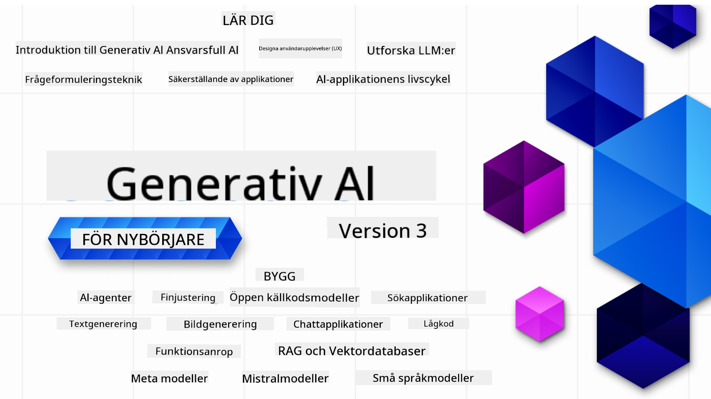

<!--
CO_OP_TRANSLATOR_METADATA:
{
  "original_hash": "ca2afa136ed9aca0634f39f51239746e",
  "translation_date": "2025-08-27T08:37:26+00:00",
  "source_file": "README.md",
  "language_code": "sv"
}
-->

### 21 lektioner som lär dig allt du behöver veta för att börja bygga generativa AI-applikationer

### 🌐 Stöd för flera språk

#### Stöds via GitHub Action (Automatiserat & Alltid Uppdaterat)

[Franska](../fr/README.md) | [Spanska](../es/README.md) | [Tyska](../de/README.md) | [Ryska](../ru/README.md) | [Arabiska](../ar/README.md) | [Persiska (Farsi)](../fa/README.md) | [Urdu](../ur/README.md) | [Kinesiska (Förenklad)](../zh/README.md) | [Kinesiska (Traditionell, Macau)](../mo/README.md) | [Kinesiska (Traditionell, Hongkong)](../hk/README.md) | [Kinesiska (Traditionell, Taiwan)](../tw/README.md) | [Japanska](../ja/README.md) | [Koreanska](../ko/README.md) | [Hindi](../hi/README.md) | [Bengali](../bn/README.md) | [Marathi](../mr/README.md) | [Nepali](../ne/README.md) | [Punjabi (Gurmukhi)](../pa/README.md) | [Portugisiska (Portugal)](../pt/README.md) | [Portugisiska (Brasilien)](../br/README.md) | [Italienska](../it/README.md) | [Litauiska](../lt/README.md) | [Polska](../pl/README.md) | [Turkiska](../tr/README.md) | [Grekiska](../el/README.md) | [Thailändska](../th/README.md) | [Svenska](./README.md) | [Danska](../da/README.md) | [Norska](../no/README.md) | [Finska](../fi/README.md) | [Holländska](../nl/README.md) | [Hebreiska](../he/README.md) | [Vietnamesiska](../vi/README.md) | [Indonesiska](../id/README.md) | [Malajiska](../ms/README.md) | [Tagalog (Filippinska)](../tl/README.md) | [Swahili](../sw/README.md) | [Ungerska](../hu/README.md) | [Tjeckiska](../cs/README.md) | [Slovakiska](../sk/README.md) | [Rumänska](../ro/README.md) | [Bulgariska](../bg/README.md) | [Serbiska (Kyrilliska)](../sr/README.md) | [Kroatiska](../hr/README.md) | [Slovenska](../sl/README.md) | [Ukrainska](../uk/README.md) | [Burmesiska (Myanmar)](../my/README.md)

# Generativ AI för Nybörjare (Version 3) - En Kurs

Lär dig grunderna i att bygga generativa AI-applikationer med vår omfattande kurs på 21 lektioner från Microsoft Cloud Advocates.

## 🌱 Kom igång

Den här kursen har 21 lektioner. Varje lektion täcker ett eget ämne, så börja där du vill!

Lektionerna är märkta antingen som "Learn"-lektioner som förklarar ett koncept inom generativ AI eller "Build"-lektioner som förklarar ett koncept och inkluderar kodexempel i både **Python** och **TypeScript** när det är möjligt.

För .NET-utvecklare, kolla in [Generativ AI för Nybörjare (.NET Edition)](https://github.com/microsoft/Generative-AI-for-beginners-dotnet?WT.mc_id=academic-105485-koreyst)!

Varje lektion innehåller också en "Keep Learning"-sektion med ytterligare lärresurser.

## Vad du behöver
### För att köra koden i denna kurs kan du använda:
 - [Azure OpenAI Service](https://aka.ms/genai-beginners/azure-open-ai?WT.mc_id=academic-105485-koreyst) - **Lektioner:** "aoai-assignment"
 - [GitHub Marketplace Model Catalog](https://aka.ms/genai-beginners/gh-models?WT.mc_id=academic-105485-koreyst) - **Lektioner:** "githubmodels"
 - [OpenAI API](https://aka.ms/genai-beginners/open-ai?WT.mc_id=academic-105485-koreyst) - **Lektioner:** "oai-assignment" 
   
- Grundläggande kunskaper i Python eller TypeScript är användbara - \*För absoluta nybörjare, kolla in dessa [Python](https://aka.ms/genai-beginners/python?WT.mc_id=academic-105485-koreyst) och [TypeScript](https://aka.ms/genai-beginners/typescript?WT.mc_id=academic-105485-koreyst) kurser
- Ett GitHub-konto för att [forka hela detta repo](https://aka.ms/genai-beginners/github?WT.mc_id=academic-105485-koreyst) till ditt eget GitHub-konto

Vi har skapat en **[Kursinställning](./00-course-setup/README.md?WT.mc_id=academic-105485-koreyst)** lektion för att hjälpa dig att ställa in din utvecklingsmiljö.

Glöm inte att [stjärnmärka (🌟) detta repo](https://docs.github.com/en/get-started/exploring-projects-on-github/saving-repositories-with-stars?WT.mc_id=academic-105485-koreyst) för att lättare hitta det senare.

## 🧠 Redo att distribuera?

Om du letar efter mer avancerade kodexempel, kolla in vår [samling av generativa AI-kodexempel](https://aka.ms/genai-beg-code?WT.mc_id=academic-105485-koreyst) i både **Python** och **TypeScript**.

## 🗣️ Träffa andra elever, få stöd

Gå med i vår [officiella Azure AI Foundry Discord-server](https://aka.ms/genai-discord?WT.mc_id=academic-105485-koreyst) för att träffa och nätverka med andra elever som tar denna kurs och få stöd.

Ställ frågor eller dela produktfeedback i vårt [Azure AI Foundry Developer Forum](https://aka.ms/azureaifoundry/forum) på Github.

## 🚀 Bygger du en startup?

Besök [Microsoft for Startups](https://www.microsoft.com/startups) för att ta reda på hur du kan komma igång med att bygga med Azure-krediter idag.

## 🙏 Vill du hjälpa till?

Har du förslag eller hittat stavfel eller kodfel? [Skapa ett ärende](https://github.com/microsoft/generative-ai-for-beginners/issues?WT.mc_id=academic-105485-koreyst) eller [Skapa en pull request](https://github.com/microsoft/generative-ai-for-beginners/pulls?WT.mc_id=academic-105485-koreyst)

## 📂 Varje lektion innehåller:

- En kort videointroduktion till ämnet
- En skriftlig lektion som finns i README
- Python- och TypeScript-kodexempel som stöder Azure OpenAI och OpenAI API
- Länkar till extra resurser för att fortsätta din inlärning

## 🗃️ Lektioner

| #   | **Lektionslänk**                                                                                                                              | **Beskrivning**                                                                                 | **Video**                                                                   | **Extra lärande**                                                             |
| --- | -------------------------------------------------------------------------------------------------------------------------------------------- | ----------------------------------------------------------------------------------------------- | --------------------------------------------------------------------------- | ------------------------------------------------------------------------------ |
| 00  | [Kursinställning](./00-course-setup/README.md?WT.mc_id=academic-105485-koreyst)                                                                 | **Learn:** Hur du ställer in din utvecklingsmiljö                                               | Video Kommer Snart                                                                 | [Lär dig mer](https://aka.ms/genai-collection?WT.mc_id=academic-105485-koreyst) |
| 01  | [Introduktion till Generativ AI och LLMs](./01-introduction-to-genai/README.md?WT.mc_id=academic-105485-koreyst)                              | **Learn:** Förstå vad generativ AI är och hur stora språkmodeller (LLMs) fungerar.              | [Video](https://aka.ms/gen-ai-lesson-1-gh?WT.mc_id=academic-105485-koreyst) | [Lär dig mer](https://aka.ms/genai-collection?WT.mc_id=academic-105485-koreyst) |
| 02  | [Utforska och jämföra olika LLMs](./02-exploring-and-comparing-different-llms/README.md?WT.mc_id=academic-105485-koreyst)                     | **Learn:** Hur du väljer rätt modell för ditt användningsområde                                 | [Video](https://aka.ms/gen-ai-lesson2-gh?WT.mc_id=academic-105485-koreyst)  | [Lär dig mer](https://aka.ms/genai-collection?WT.mc_id=academic-105485-koreyst) |
| 03  | [Använda Generativ AI Ansvarsfullt](./03-using-generative-ai-responsibly/README.md?WT.mc_id=academic-105485-koreyst)                           | **Learn:** Hur du bygger generativa AI-applikationer ansvarsfullt                               | [Video](https://aka.ms/gen-ai-lesson3-gh?WT.mc_id=academic-105485-koreyst)  | [Lär dig mer](https://aka.ms/genai-collection?WT.mc_id=academic-105485-koreyst) |
| 04  | [Förstå Grunderna i Prompt Engineering](./04-prompt-engineering-fundamentals/README.md?WT.mc_id=academic-105485-koreyst)                      | **Learn:** Praktiska bästa praxis för prompt engineering                                        | [Video](https://aka.ms/gen-ai-lesson4-gh?WT.mc_id=academic-105485-koreyst)  | [Lär dig mer](https://aka.ms/genai-collection?WT.mc_id=academic-105485-koreyst) |
| 05  | [Skapa Avancerade Prompter](./05-advanced-prompts/README.md?WT.mc_id=academic-105485-koreyst)                                                 | **Learn:** Hur du tillämpar tekniker för prompt engineering som förbättrar resultatet av dina prompter. | [Video](https://aka.ms/gen-ai-lesson5-gh?WT.mc_id=academic-105485-koreyst)  | [Lär dig mer](https://aka.ms/genai-collection?WT.mc_id=academic-105485-koreyst) |
| 06  | [Bygga textgenereringsapplikationer](./06-text-generation-apps/README.md?WT.mc_id=academic-105485-koreyst)                                | **Bygg:** En textgenereringsapplikation med Azure OpenAI / OpenAI API                                | [Video](https://aka.ms/gen-ai-lesson6-gh?WT.mc_id=academic-105485-koreyst)  | [Läs mer](https://aka.ms/genai-collection?WT.mc_id=academic-105485-koreyst) |
| 07  | [Bygga chattapplikationer](./07-building-chat-applications/README.md?WT.mc_id=academic-105485-koreyst)                                     | **Bygg:** Tekniker för att effektivt bygga och integrera chattapplikationer.                      | [Video](https://aka.ms/gen-ai-lessons7-gh?WT.mc_id=academic-105485-koreyst) | [Läs mer](https://aka.ms/genai-collection?WT.mc_id=academic-105485-koreyst) |
| 08  | [Bygga sökapplikationer med vektordatabaser](./08-building-search-applications/README.md?WT.mc_id=academic-105485-koreyst)                 | **Bygg:** En sökapplikation som använder inbäddningar för att söka efter data.                    | [Video](https://aka.ms/gen-ai-lesson8-gh?WT.mc_id=academic-105485-koreyst)  | [Läs mer](https://aka.ms/genai-collection?WT.mc_id=academic-105485-koreyst) |
| 09  | [Bygga bildgenereringsapplikationer](./09-building-image-applications/README.md?WT.mc_id=academic-105485-koreyst)                         | **Bygg:** En bildgenereringsapplikation                                                           | [Video](https://aka.ms/gen-ai-lesson9-gh?WT.mc_id=academic-105485-koreyst)  | [Läs mer](https://aka.ms/genai-collection?WT.mc_id=academic-105485-koreyst) |
| 10  | [Bygga lågkodade AI-applikationer](./10-building-low-code-ai-applications/README.md?WT.mc_id=academic-105485-koreyst)                     | **Bygg:** En generativ AI-applikation med lågkodade verktyg                                       | [Video](https://aka.ms/gen-ai-lesson10-gh?WT.mc_id=academic-105485-koreyst) | [Läs mer](https://aka.ms/genai-collection?WT.mc_id=academic-105485-koreyst) |
| 11  | [Integrera externa applikationer med funktionsanrop](./11-integrating-with-function-calling/README.md?WT.mc_id=academic-105485-koreyst)   | **Bygg:** Vad funktionsanrop är och dess användningsområden för applikationer                     | [Video](https://aka.ms/gen-ai-lesson11-gh?WT.mc_id=academic-105485-koreyst) | [Läs mer](https://aka.ms/genai-collection?WT.mc_id=academic-105485-koreyst) |
| 12  | [Designa UX för AI-applikationer](./12-designing-ux-for-ai-applications/README.md?WT.mc_id=academic-105485-koreyst)                       | **Lär dig:** Hur man tillämpar UX-designprinciper vid utveckling av generativa AI-applikationer   | [Video](https://aka.ms/gen-ai-lesson12-gh?WT.mc_id=academic-105485-koreyst) | [Läs mer](https://aka.ms/genai-collection?WT.mc_id=academic-105485-koreyst) |
| 13  | [Säkra dina generativa AI-applikationer](./13-securing-ai-applications/README.md?WT.mc_id=academic-105485-koreyst)                        | **Lär dig:** Hoten och riskerna för AI-system och metoder för att säkra dessa system.             | [Video](https://aka.ms/gen-ai-lesson13-gh?WT.mc_id=academic-105485-koreyst) | [Läs mer](https://aka.ms/genai-collection?WT.mc_id=academic-105485-koreyst) |
| 14  | [Livscykeln för generativa AI-applikationer](./14-the-generative-ai-application-lifecycle/README.md?WT.mc_id=academic-105485-koreyst)     | **Lär dig:** Verktygen och mätvärdena för att hantera LLM-livscykeln och LLMOps                   | [Video](https://aka.ms/gen-ai-lesson14-gh?WT.mc_id=academic-105485-koreyst) | [Läs mer](https://aka.ms/genai-collection?WT.mc_id=academic-105485-koreyst) |
| 15  | [Återhämtningsförstärkt generering (RAG) och vektordatabaser](./15-rag-and-vector-databases/README.md?WT.mc_id=academic-105485-koreyst)    | **Bygg:** En applikation som använder ett RAG-ramverk för att hämta inbäddningar från en vektordatabas | [Video](https://aka.ms/gen-ai-lesson15-gh?WT.mc_id=academic-105485-koreyst) | [Läs mer](https://aka.ms/genai-collection?WT.mc_id=academic-105485-koreyst) |
| 16  | [Öppna källkodsmodeller och Hugging Face](./16-open-source-models/README.md?WT.mc_id=academic-105485-koreyst)                             | **Bygg:** En applikation som använder öppna källkodsmodeller tillgängliga på Hugging Face         | [Video](https://aka.ms/gen-ai-lesson16-gh?WT.mc_id=academic-105485-koreyst) | [Läs mer](https://aka.ms/genai-collection?WT.mc_id=academic-105485-koreyst) |
| 17  | [AI-agenter](./17-ai-agents/README.md?WT.mc_id=academic-105485-koreyst)                                                                   | **Bygg:** En applikation som använder ett AI-agentramverk                                        | [Video](https://aka.ms/gen-ai-lesson17-gh?WT.mc_id=academic-105485-koreyst) | [Läs mer](https://aka.ms/genai-collection?WT.mc_id=academic-105485-koreyst) |
| 18  | [Finjustera LLM:er](./18-fine-tuning/README.md?WT.mc_id=academic-105485-koreyst)                                                          | **Lär dig:** Vad, varför och hur man finjusterar LLM:er                                          | [Video](https://aka.ms/gen-ai-lesson18-gh?WT.mc_id=academic-105485-koreyst) | [Läs mer](https://aka.ms/genai-collection?WT.mc_id=academic-105485-koreyst) |
| 19  | [Bygga med SLM:er](./19-slm/README.md?WT.mc_id=academic-105485-koreyst)                                                                   | **Lär dig:** Fördelarna med att bygga med små språkmodeller                                      | Video kommer snart | [Läs mer](https://aka.ms/genai-collection?WT.mc_id=academic-105485-koreyst) |
| 20  | [Bygga med Mistral-modeller](./20-mistral/README.md?WT.mc_id=academic-105485-koreyst)                                                     | **Lär dig:** Funktionerna och skillnaderna hos Mistral-familjens modeller                        | Video kommer snart | [Läs mer](https://aka.ms/genai-collection?WT.mc_id=academic-105485-koreyst) |
| 21  | [Bygga med Meta-modeller](./21-meta/README.md?WT.mc_id=academic-105485-koreyst)                                                           | **Lär dig:** Funktionerna och skillnaderna hos Meta-familjens modeller                           | Video kommer snart | [Läs mer](https://aka.ms/genai-collection?WT.mc_id=academic-105485-koreyst) |

### 🌟 Särskilt tack

Ett stort tack till [**John Aziz**](https://www.linkedin.com/in/john0isaac/) för att ha skapat alla GitHub Actions och arbetsflöden.

[**Bernhard Merkle**](https://www.linkedin.com/in/bernhard-merkle-738b73/) för viktiga bidrag till varje lektion för att förbättra lärande- och kodupplevelsen.

## 🎒 Andra kurser

Vårt team producerar andra kurser! Kolla in:

- [**NY** Modellkontextprotokoll för nybörjare](https://github.com/microsoft/mcp-for-beginners)
- [AI-agenter för nybörjare](https://github.com/microsoft/ai-agents-for-beginners)
- [Generativ AI för nybörjare med .NET](https://github.com/microsoft/Generative-AI-for-beginners-dotnet)
- [Generativ AI för nybörjare med JavaScript](https://aka.ms/genai-js-course)
- [Generativ AI för nybörjare med Java](https://aka.ms/genaijava)
- [ML för nybörjare](https://aka.ms/ml-beginners)
- [Data Science för nybörjare](https://aka.ms/datascience-beginners)
- [AI för nybörjare](https://aka.ms/ai-beginners)
- [Cybersäkerhet för nybörjare](https://github.com/microsoft/Security-101)
- [Webbutveckling för nybörjare](https://aka.ms/webdev-beginners)
- [IoT för nybörjare](https://aka.ms/iot-beginners)
- [XR-utveckling för nybörjare](https://github.com/microsoft/xr-development-for-beginners)
- [Bemästra GitHub Copilot för AI-parprogrammering](https://aka.ms/GitHubCopilotAI)
- [Bemästra GitHub Copilot för C#/.NET-utvecklare](https://github.com/microsoft/mastering-github-copilot-for-dotnet-csharp-developers)
- [Välj ditt eget Copilot-äventyr](https://github.com/microsoft/CopilotAdventures)

---

**Ansvarsfriskrivning**:  
Detta dokument har översatts med hjälp av AI-översättningstjänsten [Co-op Translator](https://github.com/Azure/co-op-translator). Även om vi strävar efter noggrannhet, vänligen notera att automatiska översättningar kan innehålla fel eller felaktigheter. Det ursprungliga dokumentet på dess originalspråk bör betraktas som den auktoritativa källan. För kritisk information rekommenderas professionell mänsklig översättning. Vi ansvarar inte för eventuella missförstånd eller feltolkningar som uppstår vid användning av denna översättning.