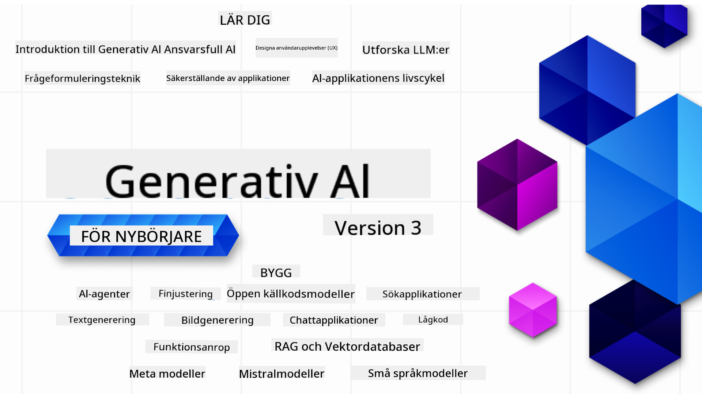

<!--
CO_OP_TRANSLATOR_METADATA:
{
  "original_hash": "6e3f4c8a4f323b8eab1cf11ded304b0f",
  "translation_date": "2025-06-25T07:59:25+00:00",
  "source_file": "README.md",
  "language_code": "sv"
}
-->

### 21 Lektioner som lär dig allt du behöver veta för att börja bygga generativa AI-applikationer

### 🌐 Stöd för flera språk

#### Stöds via GitHub Action (Automatiserat och alltid uppdaterat)

# Generativ AI för Nybörjare (Version 3) - En Kurs

Lär dig grunderna i att bygga Generativ AI-applikationer med vår omfattande kurs på 21 lektioner av Microsoft Cloud Advocates.

## 🌱 Komma igång

Denna kurs har 21 lektioner. Varje lektion täcker sitt eget ämne så börja där du vill!

Lektioner är antingen märkta som "Learn"-lektioner som förklarar ett Generativ AI-koncept eller "Build"-lektioner som förklarar ett koncept och kodexempel i både **Python** och **TypeScript** när det är möjligt.

För .NET-utvecklare, kolla in [Generativ AI för Nybörjare (.NET Edition)](https://github.com/microsoft/Generative-AI-for-beginners-dotnet?WT.mc_id=academic-105485-koreyst)!

Varje lektion inkluderar också en "Keep Learning"-sektion med ytterligare inlärningsverktyg.

## Vad du behöver
### För att köra koden i denna kurs kan du använda antingen:
 - [Azure OpenAI Service](https://aka.ms/genai-beginners/azure-open-ai?WT.mc_id=academic-105485-koreyst) - **Lektioner:** "aoai-assignment"
 - [GitHub Marketplace Model Catalog](https://aka.ms/genai-beginners/gh-models?WT.mc_id=academic-105485-koreyst) - **Lektioner:** "githubmodels"
 - [OpenAI API](https://aka.ms/genai-beginners/open-ai?WT.mc_id=academic-105485-koreyst) - **Lektioner:** "oai-assignment" 

- Grundläggande kunskaper i Python eller TypeScript är användbara - \*För absoluta nybörjare, kolla in dessa [Python](https://aka.ms/genai-beginners/python?WT.mc_id=academic-105485-koreyst) och [TypeScript](https://aka.ms/genai-beginners/typescript?WT.mc_id=academic-105485-koreyst) kurser
- Ett GitHub-konto för att [forka hela detta repo](https://aka.ms/genai-beginners/github?WT.mc_id=academic-105485-koreyst) till ditt eget GitHub-konto

Vi har skapat en **[Kursinställning](./00-course-setup/README.md?WT.mc_id=academic-105485-koreyst)** lektion för att hjälpa dig med att ställa in din utvecklingsmiljö.

Glöm inte att [stjärnmärka (🌟) detta repo](https://docs.github.com/en/get-started/exploring-projects-on-github/saving-repositories-with-stars?WT.mc_id=academic-105485-koreyst) för att lättare hitta det senare.

## 🧠 Redo att distribuera?

Om du letar efter mer avancerade kodexempel, kolla in vår [samling av Generativ AI-kodexempel](https://aka.ms/genai-beg-code?WT.mc_id=academic-105485-koreyst) i både **Python** och **TypeScript**.

## 🗣️ Möt andra elever, få support

Gå med i vår [officiella Azure AI Foundry Discord-server](https://aka.ms/genai-discord?WT.mc_id=academic-105485-koreyst) för att träffa och nätverka med andra elever som går denna kurs och få support.

Ställ frågor eller dela produktfeedback i vårt [Azure AI Foundry Developer Forum](https://aka.ms/azureaifoundry/forum) på Github.

## 🚀 Bygger du ett startup?

Registrera dig för [Microsoft for Startups Founders Hub](https://aka.ms/genai-foundershub?WT.mc_id=academic-105485-koreyst) för att få **gratis OpenAI-krediter** och upp till **$150k mot Azure-krediter för att få tillgång till OpenAI-modeller genom Azure OpenAI Services**.

## 🙏 Vill du hjälpa till?

Har du förslag eller hittat stavfel eller kodfel? [Skapa ett ärende](https://github.com/microsoft/generative-ai-for-beginners/issues?WT.mc_id=academic-105485-koreyst) eller [Skapa en pull request](https://github.com/microsoft/generative-ai-for-beginners/pulls?WT.mc_id=academic-105485-koreyst)

## 📂 Varje lektion inkluderar:

- En kort videointroduktion till ämnet
- En skriftlig lektion som finns i README
- Python- och TypeScript-kodexempel som stödjer Azure OpenAI och OpenAI API
- Länkar till extra resurser för att fortsätta din inlärning

## 🗃️ Lektioner

| #   | **Lektionslänk**                                                                                                                            | **Beskrivning**                                                                                 | **Video**                                                                   | **Extra Inlärning**                                                             |
| --- | -------------------------------------------------------------------------------------------------------------------------------------------- | ----------------------------------------------------------------------------------------------- | --------------------------------------------------------------------------- | ------------------------------------------------------------------------------ |
| 00  | [Kursinställning](./00-course-setup/README.md?WT.mc_id=academic-105485-koreyst)                                                              | **Lär dig:** Hur du ställer in din utvecklingsmiljö                                             | Video Kommer Snart                                                         | [Lär dig mer](https://aka.ms/genai-collection?WT.mc_id=academic-105485-koreyst) |
| 01  | [Introduktion till Generativ AI och LLMs](./01-introduction-to-genai/README.md?WT.mc_id=academic-105485-koreyst)                            | **Lär dig:** Förstå vad Generativ AI är och hur Stora Språkmodeller (LLMs) fungerar.            | [Video](https://aka.ms/gen-ai-lesson-1-gh?WT.mc_id=academic-105485-koreyst) | [Lär dig mer](https://aka.ms/genai-collection?WT.mc_id=academic-105485-koreyst) |
| 02  | [Utforska och jämföra olika LLMs](./02-exploring-and-comparing-different-llms/README.md?WT.mc_id=academic-105485-koreyst)                   | **Lär dig:** Hur du väljer rätt modell för ditt användningsfall                                | [Video](https://aka.ms/gen-ai-lesson2-gh?WT.mc_id=academic-105485-koreyst)  | [Lär dig mer](https://aka.ms/genai-collection?WT.mc_id=academic-105485-koreyst) |
| 03  | [Använda Generativ AI Ansvarsfullt](./03-using-generative-ai-responsibly/README.md?WT.mc_id=academic-105485-koreyst)                        | **Lär dig:** Hur man bygger Generativ AI-applikationer ansvarsfullt                            | [Video](https://aka.ms/gen-ai-lesson3-gh?WT.mc_id=academic-105485-koreyst)  | [Lär dig mer](https://aka.ms/genai-collection?WT.mc_id=academic-105485-koreyst) |
| 04  | [Förstå Grunderna i Prompt Engineering](./04-prompt-engineering-fundamentals/README.md?WT.mc_id=academic-105485-koreyst)                    | **Lär dig:** Praktiska Bästa Metoder för Prompt Engineering                                    | [Video](https://aka.ms/gen-ai-lesson4-gh?WT.mc_id=academic-105485-koreyst)  | [Lär dig mer](https://aka.ms/genai-collection?WT.mc_id=academic-105485-koreyst) |
| 05  | [Skapa avancerade promptar](./05-advanced-prompts/README.md?WT.mc_id=academic-105485-koreyst)                                                | **Lär dig:** Hur man tillämpar tekniker för prompt engineering som förbättrar resultatet av dina promptar. | [Video](https://aka.ms/gen-ai-lesson5-gh?WT.mc_id=academic-105485-koreyst)  | [Läs mer](https://aka.ms/genai-collection?WT.mc_id=academic-105485-koreyst) |
| 06  | [Bygga textgenereringsapplikationer](./06-text-generation-apps/README.md?WT.mc_id=academic-105485-koreyst)                                | **Bygg:** En textgenereringsapp med Azure OpenAI / OpenAI API                                | [Video](https://aka.ms/gen-ai-lesson6-gh?WT.mc_id=academic-105485-koreyst)  | [Läs mer](https://aka.ms/genai-collection?WT.mc_id=academic-105485-koreyst) |
| 07  | [Bygga chattapplikationer](./07-building-chat-applications/README.md?WT.mc_id=academic-105485-koreyst)                                     | **Bygg:** Tekniker för att effektivt bygga och integrera chattapplikationer.               | [Video](https://aka.ms/gen-ai-lessons7-gh?WT.mc_id=academic-105485-koreyst) | [Läs mer](https://aka.ms/genai-collection?WT.mc_id=academic-105485-koreyst) |
| 08  | [Bygga sökappar med vektordatabaser](./08-building-search-applications/README.md?WT.mc_id=academic-105485-koreyst)                        | **Bygg:** En sökapplikation som använder inbäddningar för att söka efter data.                        | [Video](https://aka.ms/gen-ai-lesson8-gh?WT.mc_id=academic-105485-koreyst)  | [Läs mer](https://aka.ms/genai-collection?WT.mc_id=academic-105485-koreyst) |
| 09  | [Bygga bildgenereringsapplikationer](./09-building-image-applications/README.md?WT.mc_id=academic-105485-koreyst)                        | **Bygg:** En bildgenereringsapplikation                                                       | [Video](https://aka.ms/gen-ai-lesson9-gh?WT.mc_id=academic-105485-koreyst)  | [Läs mer](https://aka.ms/genai-collection?WT.mc_id=academic-105485-koreyst) |
| 10  | [Bygga låga kod AI-applikationer](./10-building-low-code-ai-applications/README.md?WT.mc_id=academic-105485-koreyst)                       | **Bygg:** En generativ AI-applikation med hjälp av låga kodverktyg                                     | [Video](https://aka.ms/gen-ai-lesson10-gh?WT.mc_id=academic-105485-koreyst) | [Läs mer](https://aka.ms/genai-collection?WT.mc_id=academic-105485-koreyst) |
| 11  | [Integrera externa applikationer med funktionsanrop](./11-integrating-with-function-calling/README.md?WT.mc_id=academic-105485-koreyst) | **Bygg:** Vad funktionsanrop är och dess användningsområden för applikationer                          | [Video](https://aka.ms/gen-ai-lesson11-gh?WT.mc_id=academic-105485-koreyst) | [Läs mer](https://aka.ms/genai-collection?WT.mc_id=academic-105485-koreyst) |
| 12  | [Designa UX för AI-applikationer](./12-designing-ux-for-ai-applications/README.md?WT.mc_id=academic-105485-koreyst)                         | **Lär dig:** Hur man tillämpar UX-designprinciper vid utveckling av generativa AI-applikationer         | [Video](https://aka.ms/gen-ai-lesson12-gh?WT.mc_id=academic-105485-koreyst) | [Läs mer](https://aka.ms/genai-collection?WT.mc_id=academic-105485-koreyst) |
| 13  | [Säkra dina generativa AI-applikationer](./13-securing-ai-applications/README.md?WT.mc_id=academic-105485-koreyst)                         | **Lär dig:** Hoten och riskerna för AI-system och metoder för att säkra dessa system.             | [Video](https://aka.ms/gen-ai-lesson13-gh?WT.mc_id=academic-105485-koreyst) | [Läs mer](https://aka.ms/genai-collection?WT.mc_id=academic-105485-koreyst) |
| 14  | [Generativ AI-applikations livscykel](./14-the-generative-ai-application-lifecycle/README.md?WT.mc_id=academic-105485-koreyst)           | **Lär dig:** Verktygen och mätvärdena för att hantera LLM-livscykeln och LLMOps                         | [Video](https://aka.ms/gen-ai-lesson14-gh?WT.mc_id=academic-105485-koreyst) | [Läs mer](https://aka.ms/genai-collection?WT.mc_id=academic-105485-koreyst) |
| 15  | [Retrieval Augmented Generation (RAG) och vektordatabaser](./15-rag-and-vector-databases/README.md?WT.mc_id=academic-105485-koreyst)        | **Bygg:** En applikation med ett RAG-ramverk för att hämta inbäddningar från en vektordatabas  | [Video](https://aka.ms/gen-ai-lesson15-gh?WT.mc_id=academic-105485-koreyst) | [Läs mer](https://aka.ms/genai-collection?WT.mc_id=academic-105485-koreyst) |
| 16  | [Öppen källkod-modeller och Hugging Face](./16-open-source-models/README.md?WT.mc_id=academic-105485-koreyst)                                    | **Bygg:** En applikation med öppen källkod-modeller tillgängliga på Hugging Face                    | [Video](https://aka.ms/gen-ai-lesson16-gh?WT.mc_id=academic-105485-koreyst) | [Läs mer](https://aka.ms/genai-collection?WT.mc_id=academic-105485-koreyst) |
| 17  | [AI-agenter](./17-ai-agents/README.md?WT.mc_id=academic-105485-koreyst)                                                                       | **Bygg:** En applikation med ett AI-agentramverk                                           | [Video](https://aka.ms/gen-ai-lesson17-gh?WT.mc_id=academic-105485-koreyst) | [Läs mer](https://aka.ms/genai-collection?WT.mc_id=academic-105485-koreyst) |
| 18  | [Finjustering av LLMs](./18-fine-tuning/README.md?WT.mc_id=academic-105485-koreyst)                                                              | **Lär dig:** Vad, varför och hur man finjusterar LLMs                                            | [Video](https://aka.ms/gen-ai-lesson18-gh?WT.mc_id=academic-105485-koreyst) | [Läs mer](https://aka.ms/genai-collection?WT.mc_id=academic-105485-koreyst) |
| 19  | [Bygga med SLMs](./19-slm/README.md?WT.mc_id=academic-105485-koreyst)                                                              | **Lär dig:** Fördelarna med att bygga med små språkmodeller                                            | Video Kommer Snart | [Läs mer](https://aka.ms/genai-collection?WT.mc_id=academic-105485-koreyst) |
| 20  | [Bygga med Mistral-modeller](./20-mistral/README.md?WT.mc_id=academic-105485-koreyst)                                                              | **Lär dig:** Funktionerna och skillnaderna hos Mistral-familjemodeller                                           | Video Kommer Snart | [Läs mer](https://aka.ms/genai-collection?WT.mc_id=academic-105485-koreyst) |
| 21  | [Bygga med Meta-modeller](./21-meta/README.md?WT.mc_id=academic-105485-koreyst)                                                              | **Lär dig:** Funktionerna och skillnaderna hos Meta-familjemodeller                                           | Video Kommer Snart | [Läs mer](https://aka.ms/genai-collection?WT.mc_id=academic-105485-koreyst) |

### 🌟 Speciellt tack

Speciellt tack till [**John Aziz**](https://www.linkedin.com/in/john0isaac/) för att ha skapat alla GitHub Actions och arbetsflöden

[**Bernhard Merkle**](https://www.linkedin.com/in/bernhard-merkle-738b73/) för att ha gjort viktiga bidrag till varje lektion för att förbättra lärande- och kodupplevelsen. 

## 🎒 Andra kurser

Vårt team producerar andra kurser! Kolla in:

- [**NY** Modellkontextprotokoll för nybörjare](https://github.com/microsoft/mcp-for-beginners?WT.mc_id=academic-105485-koreyst)
- [AI-agenter för nybörjare](https://github.com/microsoft/ai-agents-for-beginners?WT.mc_id=academic-105485-koreyst)
- [Generativ AI för nybörjare med .NET](https://github.com/microsoft/Generative-AI-for-beginners-dotnet?WT.mc_id=academic-105485-koreyst)
- [Generativ AI för nybörjare med JavaScript](https://aka.ms/genai-js-course?WT.mc_id=academic-105485-koreyst)
- [ML för nybörjare](https://aka.ms/ml-beginners?WT.mc_id=academic-105485-koreyst)
- [Data Science för nybörjare](https://aka.ms/datascience-beginners?WT.mc_id=academic-105485-koreyst)
- [AI för nybörjare](https://aka.ms/ai-beginners?WT.mc_id=academic-105485-koreyst)
- [Cybersäkerhet för nybörjare](https://github.com/microsoft/Security-101??WT.mc_id=academic-96948-sayoung)
- [Webbutveckling för nybörjare](https://aka.ms/webdev-beginners?WT.mc_id=academic-105485-koreyst)
- [IoT för nybörjare](https://aka.ms/iot-beginners?WT.mc_id=academic-105485-koreyst)
- [XR-utveckling för nybörjare](https://github.com/microsoft/xr-development-for-beginners?WT.mc_id=academic-105485-koreyst)
- [Bemästra GitHub Copilot för AI-parprogrammering](https://aka.ms/GitHubCopilotAI?WT.mc_id=academic-105485-koreyst)
- [Bemästra GitHub Copilot för C#/.NET-utvecklare](https://github.com/microsoft/mastering-github-copilot-for-dotnet-csharp-developers?WT.mc_id=academic-105485-koreyst)
- [Välj din egen Copilot-äventyr](https://github.com/microsoft/CopilotAdventures?WT.mc_id=academic-105485-koreyst)

**Ansvarsfriskrivning**:  
Detta dokument har översatts med hjälp av AI-översättningstjänsten [Co-op Translator](https://github.com/Azure/co-op-translator). Vi strävar efter noggrannhet, men var medveten om att automatiserade översättningar kan innehålla fel eller felaktigheter. Det ursprungliga dokumentet på sitt modersmål bör betraktas som den auktoritativa källan. För kritisk information rekommenderas professionell mänsklig översättning. Vi är inte ansvariga för eventuella missförstånd eller feltolkningar som uppstår från användningen av denna översättning.