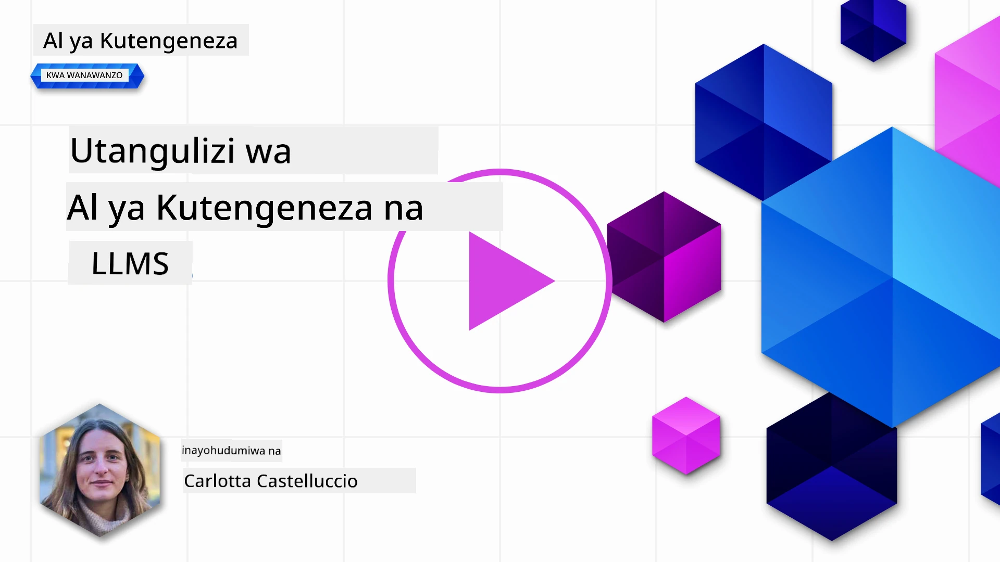
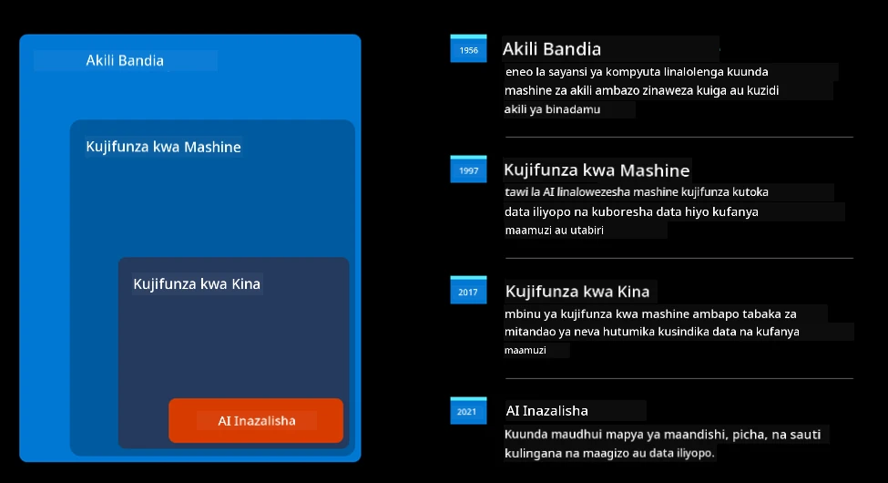
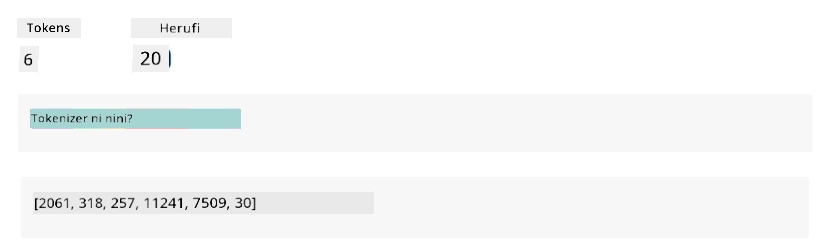
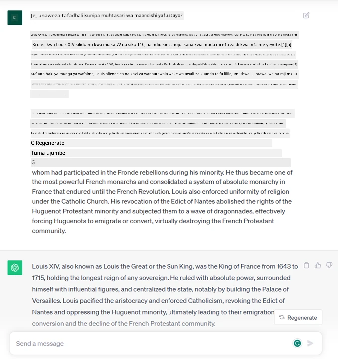
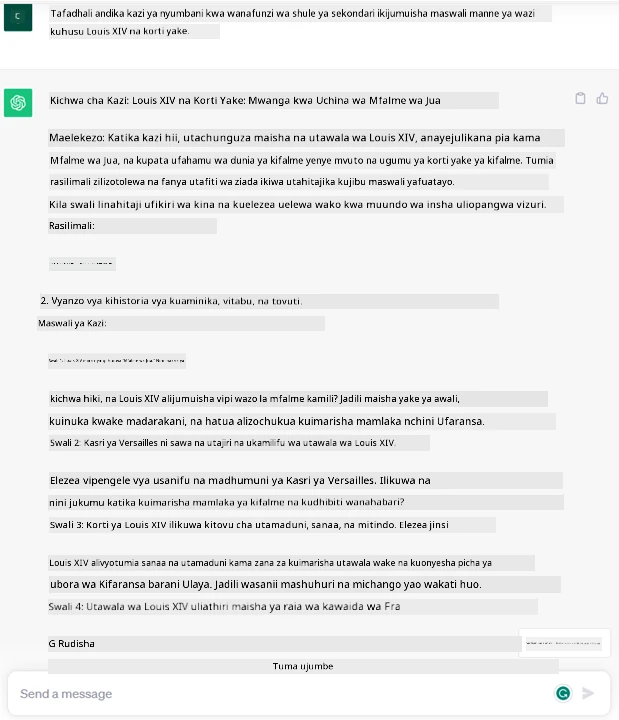
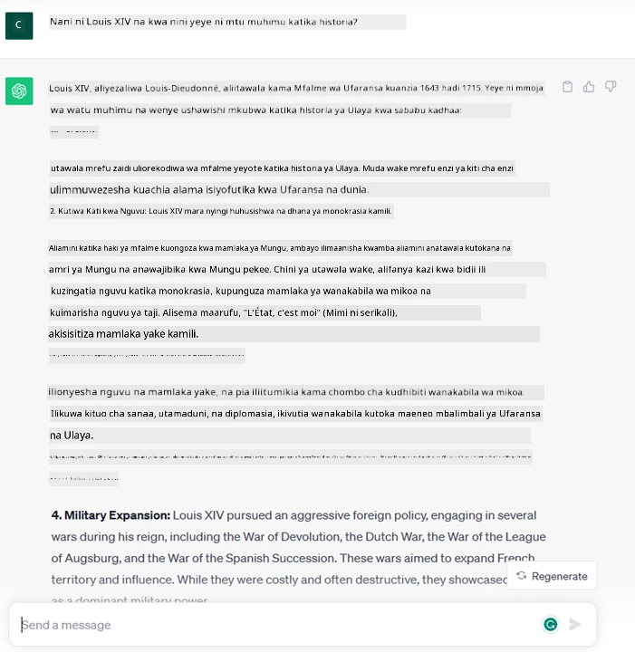
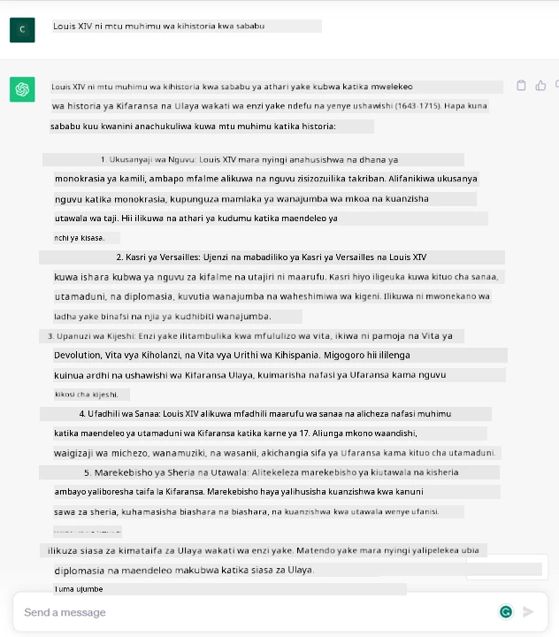
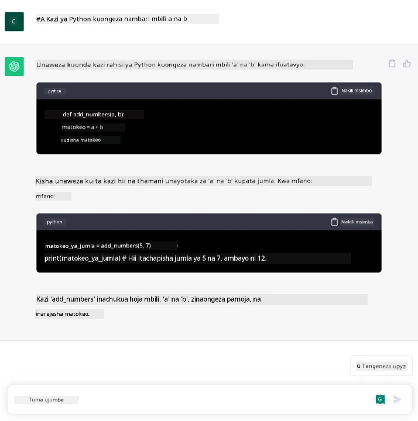

# Utangulizi kwa AI Inayotengeneza na Mifano Mikubwa ya Lugha

_(Bonyeza picha hapo juu kutazama video ya somo hili)_

AI Inayotengeneza ni akili bandia uwezo wake ni kuunda maandishi, picha na aina nyingine za maudhui. Kinachofanya iwe teknolojia ya ajabu ni kwamba inaleta AI kwa wote, mtu yeyote anaweza kuitumia kwa kutumia sindano ya maandishi, sentensi iliyoandikwa kwa lugha ya kawaida. Huna haja ya kujifunza lugha kama Java au SQL kufanikisha kitu, unahitaji tu kutumia lugha yako, eleza unachotaka kisha inatokea pendekezo kutoka kwa mfano wa AI. Matumizi na athari zake ni kubwa, unaandika au kuelewa ripoti, kuandika maombi na zaidi, yote kwa sekunde.

Katika mtaala huu, tutaangalia jinsi kampuni yetu ya kuanzisha inavyotumia AI inayozalisha kufungua matukio mapya katika elimu na jinsi tunavyoshughulikia changamoto zinazohusiana na athari za kijamii za matumizi yake na mipaka ya teknolojia.

## Utangulizi

Somo hili litajumuisha:

- Utangulizi kwa hali ya biashara: wazo la kampuni yetu ya kuanzisha na dhamira.
- AI inayozalisha na jinsi tulivyopata teknolojia ya sasa.
- Ufafanuzi wa ndani wa mfano mkubwa wa lugha.
- Uwezo mkuu na matumizi ya vitendo ya Mifano Mikubwa ya Lugha.

## Malengo ya Kujifunza

Baada ya kumaliza somo hili, utaelewa:

- AI inayotengeneza ni nini na jinsi Mifano Mikubwa ya Lugha inavyofanya kazi.
- Jinsi unaweza kutumia mifano mikubwa ya lugha kwa matumizi tofauti, hasa katika mazingira ya elimu.

## Hali: kampuni yetu ya elimu

Akili Bandia Inayotengeneza (AI) ni kilele cha teknolojia ya AI, ikisukuma mipaka ya kile kilichowahi kuonekana kuwa kisichowezekana. Mifano ya AI inayozalisha ina uwezo na matumizi kadhaa, lakini katika mtaala huu tutachunguza jinsi inavyobadili elimu kupitia kampuni ya kubuniwa. Tutarejelea kampuni hii kama _kampuni yetu ya kuanzisha_. Kampuni yetu inafanya kazi katika sekta ya elimu na kauli mbiu ya shauku

> _kuboreshwa upatikanaji wa elimu kwa kiwango cha dunia, kuhakikisha upatikanaji sawa wa elimu na kutoa uzoefu wa kujifunza wa kibinafsi kwa kila mwanafunzi, kulingana na mahitaji yao_.

Timu ya kampuni yetu inatambua kwamba hatutoweza kufanikisha lengo hili bila kutumia mojawapo ya zana zenye nguvu zaidi za nyakati hizi – Mifano Mikubwa ya Lugha (LLMs).

AI inayozalisha inatarajiwa kubadilisha jinsi tunavyojifunza na kufundisha leo, na wanafunzi kuwa na walimu wa mtandaoni saa 24 kwa siku wanaotoa taarifa nyingi na mifano, na walimu wakitumia zana bunifu kutathmini wanafunzi wao na kutoa maoni.

Kuanza, hebu tueleze baadhi ya dhana na istilahi za msingi tutakazitumia katika mtaala mzima.

## Jinsi tulivyopata AI Inayotengeneza?

Licha ya shauku kubwa iliyozuka hivi karibuni kwa tangazo la mifano ya AI inayozalisha, teknolojia hii imekuwa ikitengenezwa kwa miongo, na juhudi za utafiti za kwanza zikiwa miaka ya 60. Sasa tunafikia hatua ambapo AI ina uwezo wa fikira za binadamu, kama mazungumzo yaliyoonyeshwa kwa mfano [OpenAI ChatGPT](https://openai.com/chatgpt) au [Microsoft Copilot](https://copilot.microsoft.com/?WT.mc_id=academic-105485-koreyst), ambayo pia hutumia mfano wa GPT kwa uzoefu wa utafutaji wa mazungumzo mtandaoni.

Kurudi nyuma kidogo, majaribio ya kwanza kabisa ya AI yalikuwa chatbots zilizoandikwa kwa mkono, zikitegemea hifadhidata ya maarifa iliyotokana na wataalam na kuwasilishwa katika kompyuta. Majibu kwa hifadhidata yalitokana na maneno muhimu yaliyokuwa katika maandishi ya kiingilio.
Hata hivyo, ilijulikana mapema kwamba mbinu hiyo, kutumia chatbots za aina hiyo, haikuweza kupanuka vizuri.

### Njia ya Takwimu kwa AI: Kujifunza kwa Mashine

Mabadiliko makubwa yalikuja miaka ya 90, kwa matumizi ya njia ya takwimu kwa uchambuzi wa maandishi. Hii ilisababisha maendeleo ya algorithms mpya – zinazoitwa kujifunza kwa mashine – zenye uwezo wa kujifunza mifumo kutoka kwa data bila programu wazi. Mbinu hii inaruhusu mashine kuiga kuelewa lugha ya binadamu: mfano wa takwimu hufunzwa kwa jozi za maandishi-na-lebo, ikiruhusu mfano kuchambua maandishi yasiyojulikana kwa lebo iliyotangazwa inayowakilisha nia ya ujumbe.

### Mitandao ya Neva na Msaidizi wa mtandaoni wa kisasa

Katika miaka ya karibuni, maendeleo ya teknolojia ya vifaa vya kompyuta, vinavyoweza kushughulikia kiasi kikubwa cha data na mahesabu magumu zaidi, yamesukuma utafiti wa AI, na kusababisha maendeleo ya algorithms za kujifunza mashine zinazoitwa mitandao ya neva au algorithms za kujifunza kwa kina.

Mitandao ya neva (hasa Mitandao ya Neva Inayoendelea – RNNs) iliboresha sana uendeshaji wa lugha ya asili, ikiruhusu uwakilishi wa maana ya maandishi kwa njia yenye maana zaidi, ikizingatia muktadha wa neno katika sentensi.

Hii ndiyo teknolojia iliyoiwezesha misaada ya mtandaoni kuibuka katika muongo wa kwanza wa karne mpya, yenye ufanisi mkubwa katika kufasiri lugha ya binadamu, kubaini mahitaji, na kufanya kitendo kukidhi mahitaji hayo – kama kujibu kwa maandishi yaliyopangwa au kutumia huduma ya mtu wa tatu.

### Siku ya leo, AI Inayotengeneza

Hivyo ndivyo tulivyofikia AI Inayotengeneza leo, ambayo inaweza kuonekana kama sehemu ndogo ya kujifunza kwa kina.

Baada ya miongo ya utafiti katika uwanja wa AI, usanifu mpya wa mfano – uitwao _Transformer_ – ulizidi mipaka ya RNNs, uwezo wake ni kuchukua mfuatano mrefu zaidi wa maandishi kama kiingilio. Transformers zinatokana na utaratibu wa umakini, ukiruhusu mfano kutoa uzito tofauti kwa viingilio anavyopokea, ‘kuzingatia zaidi’ ambapo taarifa za muhimu zaidi zimo, bila kujali mpangilio wao katika mfuatano wa maandishi.

Mifano mikubwa ya AI inayozalisha hivi karibuni – pia inajulikana kama Mifano Mikubwa ya Lugha (LLMs), kwa kuwa hufanya kazi na viingilio na matokeo ya maandishi – inatokana hasa na usanifu huu. Kinachovutia zaidi kuhusu mifano hii – iliyofunzwa kwa kiasi kikubwa cha data isiyo na lebo kutoka kwa vyanzo mbalimbali kama vitabu, makala na tovuti – ni kwamba inaweza kubadilishwa kwa aina mbalimbali za kazi na kuzalisha maandishi sahihi kisarufi na dalili za ubunifu. Hivyo, si tu waliboresha sana uwezo wa mashine ‘kuelewa’ maandishi ya kiingilio, bali pia waliifanya iweze kuzalisha majibu bunifu kwa lugha ya binadamu.

## Mifano mikubwa ya lugha hufanya kazi vipi?

Katika sura inayofuata tutaangalia aina tofauti za mifano ya AI inayozalisha, lakini kwa sasa tuchunguze jinsi mifano mikubwa ya lugha inavyofanya kazi, hasa mfano wa OpenAI GPT (Generative Pre-trained Transformer).

- **Tokenizer, kutoka maandishi hadi nambari**: Mifano Mikubwa ya Lugha hupokea maandishi kama kiingilio na kuzalisha maandishi kama matokeo. Hata hivyo, kwa kuwa ni mifano ya takwimu, hufanya kazi vizuri zaidi na nambari kuliko mfuatano wa maandishi. Ndiyo maana kila kiingilio huandaliwa na tokenizer, kabla ya kutumika na mfano kuu. Token ni kipande cha maandishi – kinachojumuisha idadi tofauti ya herufi, hivyo kazi kuu ya tokenizer ni kugawanya kiingilio katika safu ya tokens. Kila token kisha inahusishwa na nambari ya token, ambayo ni msimbo wa integer wa kipande hicho cha maandishi ya asili.

- **Kukisia tokens za matokeo**: Kwa kutambua tokens n kama kiingilio (kwa kiwango cha juu n kinabadilika kutoka mfano hadi mwingine), mfano una uwezo wa kukisia token moja kama matokeo. Token hii kisha huingizwa katika kiingilio cha mzunguko ujao, kwa mfano wa dirisha linalopanuka, kuruhusu uzoefu bora wa mtumiaji kupata sentensi moja (au nyingi) kama jibu. Hii inaelezea kwa nini, kama umewahi kucheza na ChatGPT, unaweza kuona wakati mwingine huacha katikati ya sentensi.

- **Mchakato wa uchaguzi, mgawanyiko wa uwezekano**: Token ya matokeo huchaguliwa na mfano kulingana na uwezekano wake wa kutokea baada ya mfuatano wa maandishi wa sasa. Hii ni kwa sababu mfano unakisia mgawanyiko wa uwezekano juu ya ‘tokens zinazofuata’, ukihesabiwa kwa msingi wa mafunzo yake. Hata hivyo, si kila wakati token yenye uwezekano mkubwa hupatikana kutoka mgawanyiko wa matokeo. Kiwango cha bahati kinaongezwa katika uchaguzi huu, kwa njia ambayo mfano hutenda kwa hali ya kisichotabirika - hatupati matokeo yanayofanana kila mara kwa kiingilio kile kile. Kiwango hiki cha bahati kinaongezwa kuiga mchakato wa fikra za ubunifu na kinaweza kubadilishwa kwa kutumia parameter ya mfano uitwao joto (temperature).

## Jinsi kampuni yetu ya kuanzisha inaweza kutumia Mifano Mikubwa ya Lugha?

Sasa tunapoelewa vyema kazi ya ndani ya mfano mkubwa wa lugha, tuangalie mifano ya vitendo ya kazi zinazofanywa vyema na mifano hii, tukizingatia hali yetu ya biashara.
Tulisema kwamba uwezo mkuu wa Mfano Mkubwa wa Lugha ni _kuzalisha maandishi mapya, kuanzia kiingilio cha maandishi, kilichoandikwa kwa lugha ya asili_.

Lakini ni aina gani za kiingilio na matokeo ya maandishi?
Kiingilio cha mfano mkubwa wa lugha kinajulikana kama prompt, wakati matokeo yanajulikana kama completion, neno linalorejelea utaratibu wa mfano wa kuzalisha token inayofuata kukamilisha kiingilio cha sasa. Tutaangalia kwa undani ni nini prompt na jinsi ya kuibuni ili kupata matokeo bora zaidi ya mfano wetu. Lakini kwa sasa, tuseme prompt inaweza kujumuisha:

- **Maelekezo** yanayoelezea aina ya matokeo tunayotegemea kutoka kwa mfano. Maelekezo haya mara nyingine hujumuisha mifano au data ya ziada.

  1. Muhtasari wa makala, kitabu, mapitio ya bidhaa na zaidi, pamoja na uchambuzi wa maarifa kutoka kwa data isiyo rasmi.
    
    
  
  2. Ubunifu wa kiitikadi na usanifu wa makala, insha, kazi za nyumbani au zaidi.
      
     

- **Swali**, lililoombwa kwa njia ya mazungumzo na wakala.
  
  

- Kipande cha **maandishi ya kukamilisha**, ambacho kwa njia isiyoelezwa ni ombi la msaada wa uandishi.
  
  

- Kipande cha **msimbo** pamoja na ombi la kufafanua na kuandika kumbukumbu zake, au maoni yanayomaanisha kuzalisha kipande cha msimbo unaofanya kazi maalum.
  
  

Mifano hapo juu ni rahisi na haikusudiwi kuwa maonyesho kamili ya uwezo wa Mifano Mikubwa ya Lugha. Ni kuonyesha uwezo wa kutumia AI inayozalisha, hasa lakini si kwa muktadha wa elimu pekee.

Pia, matokeo ya mfano wa AI inayozalisha si kamili na wakati mwingine ubunifu wa mfano unaweza kuleta matokeo yanayochanganya ukweli kwa mtumiaji wa binadamu, au inaweza kuwa na matusi. AI inayozalisha si akili – angalau sio kwa ufafanuzi mpana wa akili, ikiwa ni pamoja na muktadha wa fikra za ubunifu na hisia; si hakika, na si wa kuaminika, kwa kuwa uchelewaji, kama marejeleo yasiyo sahihi, maudhui, na taarifa zinaweza kuunganishwa na taarifa sahihi, na kuwasilishwa kwa njia ya kuaminika na yenye ushawishi. Katika masomo yajayo, tutashughulikia mipaka hii yote na tutaona tunachoweza kufanya kupunguza.

## Kazi ya Nyumbani

Kazi yako ni kusoma zaidi juu ya [AI inayozalisha](https://en.wikipedia.org/wiki/Generative_artificial_intelligence?WT.mc_id=academic-105485-koreyst) na kutafuta eneo ambalo ungeongeza AI inayozalisha leo ambalo halina. Je, athari itakuwa tofauti na njia ya "zamani", unaweza kufanya jambo ulikoshindwa kabla, au una kasi zaidi? Andika muhtasari wa maneno 300 juu ya jinsi AI startup yako ya ndoto ingekuwa na jumuisha vichwa kama "Tatizo", "Jinsi Nitakavyotumia AI", "Athari" na hiari mpango wa biashara.

Kama umefanya kazi hii, unaweza hata kuwa tayari kuomba kwa incubator ya Microsoft, [Microsoft for Startups Founders Hub](https://www.microsoft.com/startups?WT.mc_id=academic-105485-koreyst) tunatoa mikopo kwa Azure, OpenAI, ushauri na zaidi, angalia!

## Kagua Maarifa

Nini ni kweli kuhusu mifano mikubwa ya lugha?

1. Unapata jibu sawa kila mara.
1. Hufanya mambo kwa usahihi kabisa, nzuri kwa kuongeza nambari, kuzalisha msimbo unaofanya kazi n.k.
1. Jibu linaweza kutofautiana hata unapotumia prompt ileile. Pia ni nzuri kutoa rasimu ya kwanza ya kitu, iwe maandishi au msimbo. Lakini unahitaji kuboresha matokeo.

A: 3, LLM si hakika, jibu linatofautiana, lakini unaweza kudhibiti tofauti yake kwa kutumia kuweka joto (temperature). Pia hutarajia ifanye mambo kwa usahihi kabisa, ipo kusaidia kufanya kazi nzito ambayo mara nyingi inamaanisha unapata jaribio bora la kitu unachohitaji kuboresha.

## Kazi Nzuri! Endelea Safari

Baada ya kumaliza somo hili, angalia mkusanyiko wetu wa [Kujifunza AI Inayotengeneza](https://aka.ms/genai-collection?WT.mc_id=academic-105485-koreyst) ili kuendelea kuboresha maarifa yako ya AI Inayotengeneza!

Nenda kwenye Somo la 2 ambapo tutaangalia jinsi ya [kuchunguza na kulinganisha aina tofauti za LLM](../02-exploring-and-comparing-different-llms/README.md?WT.mc_id=academic-105485-koreyst)!

---

<!-- CO-OP TRANSLATOR DISCLAIMER START -->
**Kionyozo**:
Hati hii imetafsiriwa kwa kutumia huduma ya tafsiri ya AI [Co-op Translator](https://github.com/Azure/co-op-translator). Ingawa tunajitahidi kupata usahihi, tafadhali fahamu kwamba tafsiri za kiotomatiki zinaweza kuwa na makosa au upungufu wa usahihi. Hati ya asili katika lugha yake halisi inapaswa kuchukuliwa kama chanzo cha mamlaka. Kwa taarifa muhimu, tafsiri ya kitaalamu inayofanywa na binadamu inapendekezwa. Hatutojibu kwa kuelewa vibaya au tafsiri potofu zinazotokea kutokana na matumizi ya tafsiri hii.
<!-- CO-OP TRANSLATOR DISCLAIMER END -->