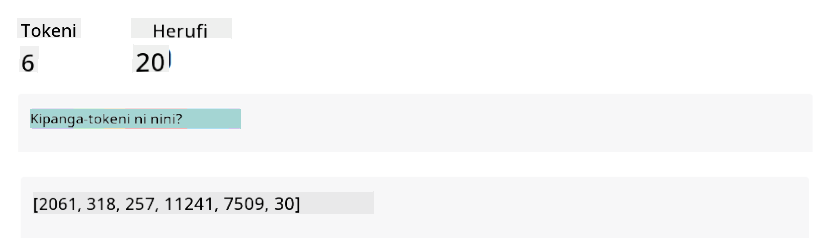
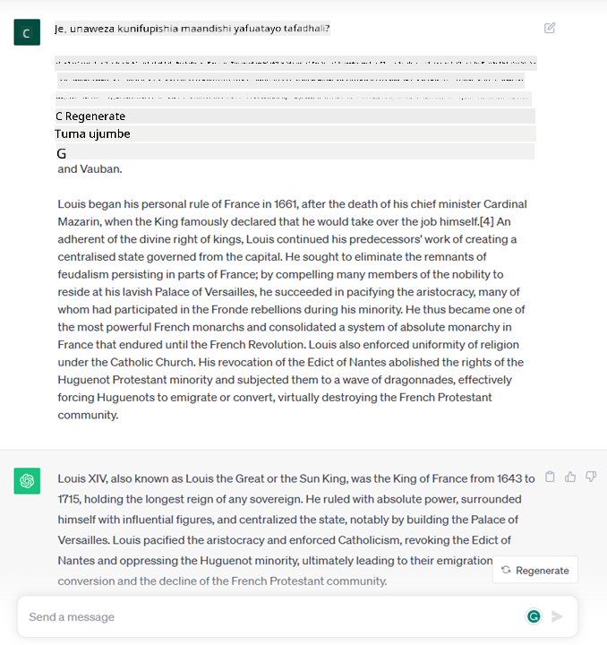
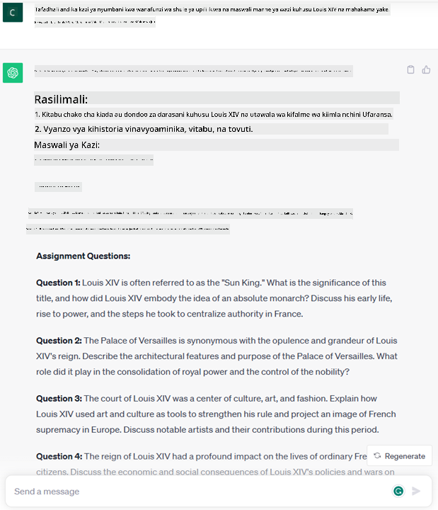
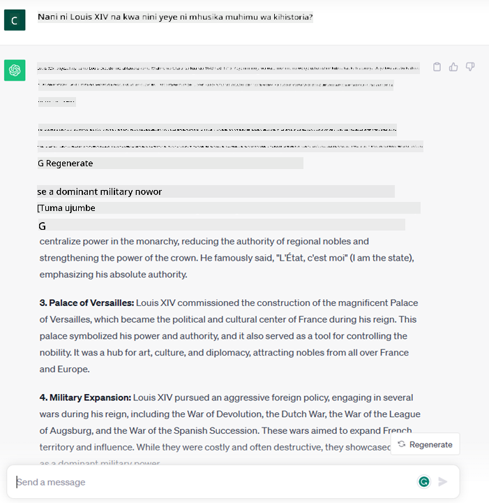

<!--
CO_OP_TRANSLATOR_METADATA:
{
  "original_hash": "bfb7901bdbece1ba3e9f35c400ca33e8",
  "translation_date": "2025-10-17T21:17:33+00:00",
  "source_file": "01-introduction-to-genai/README.md",
  "language_code": "sw"
}
-->
# Utangulizi wa AI ya Kizazi na Miundo Mikubwa ya Lugha

_(Bofya picha hapo juu kutazama video ya somo hili)_

AI ya kizazi ni akili bandia inayoweza kuzalisha maandishi, picha na aina nyingine za maudhui. Kinachofanya teknolojia hii kuwa ya ajabu ni kwamba inafanya AI kupatikana kwa kila mtu, unaweza kuitumia kwa urahisi kwa kutumia tu maelezo ya maandishi, sentensi iliyoandikwa kwa lugha ya kawaida. Huna haja ya kujifunza lugha kama Java au SQL ili kufanikisha jambo la maana, unachohitaji ni kutumia lugha yako, kueleza unachotaka na kisha unapata pendekezo kutoka kwa modeli ya AI. Matumizi na athari za hili ni kubwa, unaweza kuandika au kuelewa ripoti, kuandika programu na mengine mengi, yote kwa sekunde chache.

Katika mtaala huu, tutachunguza jinsi kampuni yetu ya kuanzisha inavyotumia AI ya kizazi kufungua hali mpya katika ulimwengu wa elimu na jinsi tunavyoshughulikia changamoto zisizoweza kuepukika zinazohusiana na athari za kijamii za matumizi yake na mipaka ya teknolojia.

## Utangulizi

Somo hili litashughulikia:

- Utangulizi wa hali ya biashara: wazo letu la kuanzisha na dhamira yetu.
- AI ya kizazi na jinsi tulivyofikia mandhari ya teknolojia ya sasa.
- Utendaji wa ndani wa modeli kubwa ya lugha.
- Uwezo kuu na matumizi ya vitendo ya Miundo Mikubwa ya Lugha.

## Malengo ya Kujifunza

Baada ya kukamilisha somo hili, utaelewa:

- AI ya kizazi ni nini na jinsi Miundo Mikubwa ya Lugha inavyofanya kazi.
- Jinsi unavyoweza kutumia miundo mikubwa ya lugha kwa matumizi tofauti, kwa kuzingatia hali za elimu.

## Hali: kampuni yetu ya elimu

Akili Bandia ya Kizazi (AI) inawakilisha kilele cha teknolojia ya AI, ikivuka mipaka ya kile kilichokuwa kikiwazia kuwa hakiwezekani. Miundo ya AI ya kizazi ina uwezo na matumizi kadhaa, lakini kwa mtaala huu tutachunguza jinsi inavyobadilisha elimu kupitia kampuni ya kuanzisha ya kubuniwa. Tutarejelea kampuni hii kama _kampuni yetu_. Kampuni yetu inafanya kazi katika sekta ya elimu ikiwa na dhamira ya kijasiri ya

> _kuboresha upatikanaji wa kujifunza, kwa kiwango cha kimataifa, kuhakikisha upatikanaji sawa wa elimu na kutoa uzoefu wa kujifunza wa kibinafsi kwa kila mwanafunzi, kulingana na mahitaji yao_.

Timu ya kampuni yetu inatambua kuwa hatutaweza kufanikisha lengo hili bila kutumia moja ya zana zenye nguvu zaidi za nyakati za kisasa – Miundo Mikubwa ya Lugha (LLMs).

AI ya kizazi inatarajiwa kubadilisha jinsi tunavyosoma na kufundisha leo, huku wanafunzi wakiwa na walimu wa mtandaoni masaa 24 kwa siku wanaotoa taarifa nyingi na mifano, na walimu wakiwa na uwezo wa kutumia zana za ubunifu kutathmini wanafunzi wao na kutoa maoni.

Ili kuanza, hebu tueleze baadhi ya dhana za msingi na istilahi tutakazotumia katika mtaala huu.

## Je, AI ya Kizazi ilifikaje?

Licha ya _hype_ ya ajabu iliyoundwa hivi karibuni na tangazo la miundo ya AI ya kizazi, teknolojia hii imekuwa ikitengenezwa kwa miongo kadhaa, na juhudi za kwanza za utafiti zikirudi hadi miaka ya 60. Sasa tuko katika hatua ambapo AI ina uwezo wa utambuzi wa binadamu, kama mazungumzo yanavyoonyeshwa kwa mfano na [OpenAI ChatGPT](https://openai.com/chatgpt) au [Bing Chat](https://www.microsoft.com/edge/features/bing-chat?WT.mc_id=academic-105485-koreyst), ambayo pia hutumia modeli ya GPT kwa mazungumzo ya utafutaji wa wavuti Bing.

Tukirudi nyuma kidogo, mifano ya kwanza kabisa ya AI ilikuwa na chatbots za maandishi, zinazotegemea msingi wa maarifa uliotolewa kutoka kwa kikundi cha wataalamu na kuwakilishwa kwenye kompyuta. Majibu katika msingi wa maarifa yalichochewa na maneno muhimu yanayoonekana katika maandishi ya pembejeo. 
Hata hivyo, ilionekana wazi kwamba mbinu kama hiyo, kwa kutumia chatbots za maandishi, haikuweza kupanuka vizuri.

### Mbinu ya Takwimu kwa AI: Kujifunza kwa Mashine

Hatua ya mabadiliko ilifika wakati wa miaka ya 90, na matumizi ya mbinu ya takwimu kwa uchambuzi wa maandishi. Hii ilisababisha maendeleo ya algorithmi mpya – zinazojulikana kama kujifunza kwa mashine – zinazoweza kujifunza mifumo kutoka kwa data bila kuandaliwa waziwazi. Mbinu hii inaruhusu mashine kuiga uelewa wa lugha ya binadamu: modeli ya takwimu inafundishwa kwa jozi za maandishi-lebo, ikiruhusu modeli kuainisha maandishi ya pembejeo yasiyojulikana na lebo iliyotangulia inayowakilisha nia ya ujumbe.

### Mitandao ya Neva na Wasaidizi wa Kisasa wa Kijanja

Katika miaka ya hivi karibuni, mageuzi ya kiteknolojia ya vifaa, vinavyoweza kushughulikia kiasi kikubwa cha data na mahesabu magumu zaidi, yamehamasisha utafiti katika AI, na kusababisha maendeleo ya algorithmi za kujifunza kwa mashine za hali ya juu zinazojulikana kama mitandao ya neva au algorithmi za kujifunza kwa kina.

Mitandao ya neva (na hasa Mitandao ya Neva ya Kurudia – RNNs) iliboresha sana usindikaji wa lugha asilia, ikiruhusu uwakilishi wa maana ya maandishi kwa njia yenye maana zaidi, ikithamini muktadha wa neno katika sentensi.

Hii ndiyo teknolojia iliyowezesha wasaidizi wa kijanja waliozaliwa katika muongo wa kwanza wa karne mpya, wenye ujuzi mkubwa wa kutafsiri lugha ya binadamu, kutambua hitaji, na kutekeleza hatua ya kuliridhisha – kama kujibu kwa maandishi yaliyotangulia au kutumia huduma ya mtu wa tatu.

### Siku za Leo, AI ya Kizazi

Hivyo ndivyo tulivyofikia AI ya kizazi leo, ambayo inaweza kuonekana kama sehemu ndogo ya kujifunza kwa kina.

Baada ya miongo ya utafiti katika uwanja wa AI, usanifu mpya wa modeli – unaoitwa _Transformer_ – ulivuka mipaka ya RNNs, ukiwa na uwezo wa kupokea mlolongo mrefu zaidi wa maandishi kama pembejeo. Transformers zinategemea utaratibu wa umakini, unaowezesha modeli kutoa uzito tofauti kwa pembejeo inazopokea, ‘kuzingatia zaidi’ pale ambapo taarifa muhimu zaidi zimejikita, bila kujali mpangilio wao katika mlolongo wa maandishi.

Miundo mingi ya AI ya kizazi ya hivi karibuni – inayojulikana pia kama Miundo Mikubwa ya Lugha (LLMs), kwa kuwa inafanya kazi na pembejeo na matokeo ya maandishi – kwa kweli inategemea usanifu huu. Kinachovutia kuhusu miundo hii – inayofundishwa kwa kiasi kikubwa cha data isiyo na lebo kutoka kwa vyanzo mbalimbali kama vitabu, makala na tovuti – ni kwamba inaweza kubadilishwa kwa kazi mbalimbali na kuzalisha maandishi sahihi kisarufi yenye dalili za ubunifu. Kwa hivyo, si tu kwamba imeboresha sana uwezo wa mashine ‘kuelewa’ maandishi ya pembejeo, lakini imewezesha uwezo wake wa kuzalisha jibu la asili kwa lugha ya binadamu.

## Miundo Mikubwa ya Lugha Hufanyaje Kazi?

Katika sura inayofuata tutachunguza aina tofauti za miundo ya AI ya kizazi, lakini kwa sasa hebu tuangalie jinsi miundo mikubwa ya lugha inavyofanya kazi, kwa kuzingatia modeli za OpenAI GPT (Generative Pre-trained Transformer).

- **Tokenizer, maandishi hadi namba**: Miundo Mikubwa ya Lugha hupokea maandishi kama pembejeo na huzalisha maandishi kama matokeo. Hata hivyo, kwa kuwa ni miundo ya takwimu, hufanya kazi vizuri zaidi na namba kuliko mlolongo wa maandishi. Ndiyo maana kila pembejeo kwa modeli huchakatwa na tokenizer, kabla ya kutumiwa na modeli kuu. Tokeni ni kipande cha maandishi – kinachojumuisha idadi tofauti ya herufi, hivyo kazi kuu ya tokenizer ni kugawanya pembejeo kuwa safu ya tokeni. Kisha, kila tokeni inaambatanishwa na index ya tokeni, ambayo ni usimbaji wa namba ya maandishi ya asili.

- **Kutabiri tokeni za matokeo**: Kwa kuzingatia tokeni n kama pembejeo (na max n ikitofautiana kutoka modeli moja hadi nyingine), modeli ina uwezo wa kutabiri tokeni moja kama matokeo. Tokeni hii kisha hujumuishwa katika pembejeo ya mzunguko unaofuata, kwa muundo wa dirisha linalopanuka, ikiruhusu uzoefu bora wa mtumiaji wa kupata sentensi moja (au nyingi) kama jibu. Hii inaeleza kwa nini, ikiwa umewahi kucheza na ChatGPT, unaweza kuwa umeona kwamba wakati mwingine inaonekana kama inasimama katikati ya sentensi.

- **Mchakato wa kuchagua, usambazaji wa uwezekano**: Tokeni ya matokeo huchaguliwa na modeli kulingana na uwezekano wake wa kutokea baada ya mlolongo wa maandishi wa sasa. Hii ni kwa sababu modeli inatabiri usambazaji wa uwezekano juu ya ‘tokeni zinazofuata’ zote zinazowezekana, iliyohesabiwa kulingana na mafunzo yake. Hata hivyo, si mara zote tokeni yenye uwezekano mkubwa zaidi huchaguliwa kutoka kwa usambazaji unaotokana. Kiwango fulani cha nasibu huongezwa kwenye chaguo hili, kwa njia ambayo modeli hufanya kwa mtindo usio wa kimaamuzi - hatupati matokeo sawa kwa pembejeo sawa. Kiwango hiki cha nasibu huongezwa ili kuiga mchakato wa kufikiri kwa ubunifu na kinaweza kubadilishwa kwa kutumia parameter ya modeli inayoitwa joto.

## Kampuni Yetu Inawezaje Kutumia Miundo Mikubwa ya Lugha?

Sasa kwa kuwa tunaelewa vyema utendaji wa ndani wa modeli kubwa ya lugha, hebu tuone mifano ya vitendo ya kazi za kawaida ambazo zinaweza kufanya vizuri sana, kwa kuzingatia hali ya biashara yetu. 
Tulisema kwamba uwezo mkuu wa Modeli Kubwa ya Lugha ni _kuzalisha maandishi kutoka mwanzo, kuanzia pembejeo ya maandishi, iliyoandikwa kwa lugha ya kawaida_.

Lakini ni aina gani ya pembejeo na matokeo ya maandishi?
Pembejeo ya modeli kubwa ya lugha inajulikana kama prompt, wakati matokeo yanajulikana kama completion, neno linalorejelea utaratibu wa modeli wa kuzalisha tokeni inayofuata kukamilisha pembejeo ya sasa. Tutachunguza kwa kina prompt ni nini na jinsi ya kuibuni kwa njia ya kupata zaidi kutoka kwa modeli yetu. Lakini kwa sasa, hebu tuseme tu kwamba prompt inaweza kujumuisha:

- **Maelekezo** yanayobainisha aina ya matokeo tunayotegemea kutoka kwa modeli. Maelekezo haya wakati mwingine yanaweza kujumuisha mifano au data ya ziada.

  1. Muhtasari wa makala, kitabu, maoni ya bidhaa na zaidi, pamoja na uchimbaji wa maarifa kutoka kwa data isiyo na muundo.
    
    
  
  2. Ubunifu wa mawazo na muundo wa makala, insha, kazi ya nyumbani au zaidi.
      
     

- **Swali**, linaloulizwa kwa njia ya mazungumzo na wakala.
  
  

- Kipande cha **maandishi ya kukamilisha**, ambacho kwa njia isiyo ya moja kwa moja ni ombi la msaada wa uandishi.
  
  

- Kipande cha **kodi** pamoja na ombi la kuelezea na kuandika maelezo yake, au maoni yanayoomba kuzalisha kipande cha kodi kinachofanya kazi maalum.
  
  

Mifano hapo juu ni rahisi sana na haikusudiwi kuwa onyesho kamili la uwezo wa Miundo Mikubwa ya Lugha. Zinakusudiwa kuonyesha uwezo wa kutumia AI ya kizazi, hasa lakini si tu kwa muktadha wa elimu.

Pia, matokeo ya modeli ya AI ya kizazi si kamilifu na wakati mwingine ubunifu wa modeli unaweza kufanya kazi kinyume chake, na kusababisha matokeo ambayo ni mchanganyiko wa maneno ambayo mtumiaji wa binadamu anaweza kutafsiri kama upotoshaji wa ukweli, au yanaweza kuwa ya kukera. AI ya kizazi si akili - angalau kwa ufafanuzi wa kina zaidi wa akili, ikiwa ni pamoja na hoja za kina na ubunifu au akili ya kihisia; si ya kimaamuzi, na si ya kuaminika, kwa kuwa uzushi, kama marejeleo ya makosa, maudhui, na taarifa, inaweza kuchanganywa na taarifa sahihi, na kuwasilishwa kwa njia ya kushawishi na yenye kujiamini. Katika masomo yanayofuata, tutashughulikia mipaka hii yote na tutaona tunachoweza kufanya ili kupunguza athari zake.

## Kazi

Kazi yako ni kusoma zaidi kuhusu [AI ya kizazi](https://en.wikipedia.org/wiki/Generative_artificial_intelligence?WT.mc_id=academic-105485-koreyst) na jaribu kutambua eneo ambalo ungeongeza AI ya kizazi leo ambalo halina. Je, athari ingekuwa tofauti na kufanya kwa njia ya "zamani", unaweza kufanya kitu ambacho hukuweza kufanya hapo awali, au unakuwa na kasi zaidi? Andika muhtasari wa maneno 300 kuhusu jinsi kampuni yako ya ndoto ya AI ingekuwa na vichwa kama "Tatizo", "Jinsi Ningetumia AI", "Athari" na kwa hiari mpango wa biashara.

Ikiwa umefanya kazi hii, unaweza hata kuwa tayari kuomba kwa incubator ya Microsoft, [Microsoft for Startups Founders Hub](https://www.microsoft.com/startups?WT.mc_id=academic-105485-koreyst) tunatoa mikopo kwa Azure, OpenAI, ushauri na mengi zaidi, angalia!

## Ukaguzi wa Maarifa

Ni nini kweli kuhusu miundo mikubwa ya lugha?

1. Unapata jibu sawa kila wakati.
1. Inafanya mambo kikamilifu, nzuri katika kuongeza namba, kuzalisha kodi inayofanya kazi nk.
1. Jibu linaweza kutofautiana licha ya kutumia prompt sawa. Pia ni nzuri katika kukupa rasimu ya kwanza ya kitu, iwe maandishi au kodi. Lakini unahitaji kuboresha matokeo.

A: 3, LLM si ya kimaamuzi, jibu linatofautiana, hata hivyo, unaweza kudhibiti tofauti yake kupitia mpangilio wa joto. Pia usitarajie ifanye mambo kikamilifu, iko hapa kufanya kazi nzito kwako ambayo mara nyingi inamaanisha unapata jaribio la kwanza zuri la kitu ambacho unahitaji kuboresha hatua kwa hatua.

## Kazi Nzuri! Endelea na Safari

Baada ya kukamilisha somo hili, angalia [Mkusanyiko wa Kujifunza AI ya Kizazi](https://aka.ms/genai-collection?WT.mc_id=academic-105485-koreyst) ili kuendelea kuongeza maarifa yako ya AI ya Kizazi!
Nenda kwenye Somo la 2 ambapo tutachunguza na kulinganisha aina tofauti za LLM [chunguza na linganisha aina tofauti za LLM](../02-exploring-and-comparing-different-llms/README.md?WT.mc_id=academic-105485-koreyst)!

---

**Kanusho**:  
Hati hii imetafsiriwa kwa kutumia huduma ya tafsiri ya AI [Co-op Translator](https://github.com/Azure/co-op-translator). Ingawa tunajitahidi kwa usahihi, tafadhali fahamu kuwa tafsiri za kiotomatiki zinaweza kuwa na makosa au kutokuwa sahihi. Hati ya asili katika lugha yake ya awali inapaswa kuzingatiwa kama chanzo cha mamlaka. Kwa taarifa muhimu, tafsiri ya kitaalamu ya binadamu inapendekezwa. Hatutawajibika kwa kutoelewana au tafsiri zisizo sahihi zinazotokana na matumizi ya tafsiri hii.