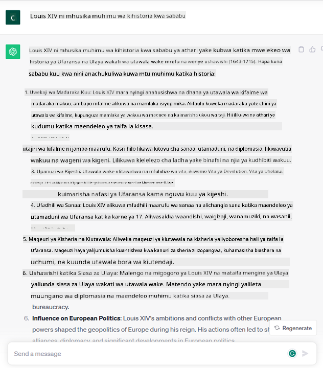
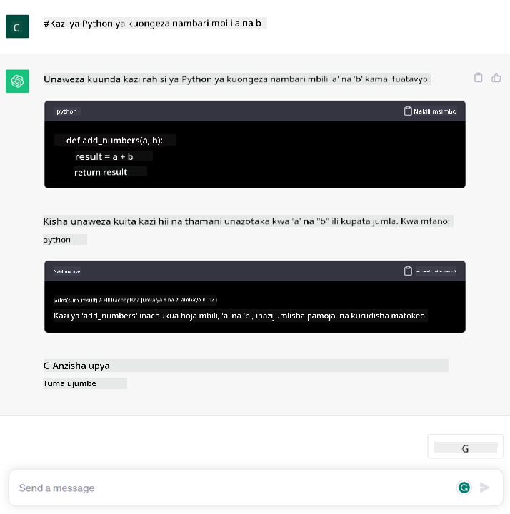

<!--
CO_OP_TRANSLATOR_METADATA:
{
  "original_hash": "f53ba0fa49164f9323043f1c6b11f2b1",
  "translation_date": "2025-07-09T07:59:36+00:00",
  "source_file": "01-introduction-to-genai/README.md",
  "language_code": "sw"
}
-->
# Utangulizi wa AI Inayozalisha na Modeli Kubwa za Lugha

_(Bonyeza picha hapo juu kutazama video ya somo hili)_

AI inayozalisha ni akili bandia inayoweza kuunda maandishi, picha na aina nyingine za maudhui. Kinachofanya teknolojia hii kuwa ya ajabu ni kwamba inafanya AI ipatikane kwa wote, mtu yeyote anaweza kuitumia kwa kutumia tu maelezo mafupi ya maandishi, sentensi iliyotungwa kwa lugha ya asili. Huna haja ya kujifunza lugha kama Java au SQL kufanikisha jambo muhimu, unachohitaji ni kutumia lugha yako, kueleza unachotaka na hutokea pendekezo kutoka kwa mfano wa AI. Matumizi na athari zake ni makubwa, unaweza kuandika au kuelewa ripoti, kuandika maombi na mengine mengi, yote kwa sekunde chache.

Katika mtaala huu, tutaangalia jinsi kampuni yetu mpya inavyotumia AI inayozalisha kufungua fursa mpya katika ulimwengu wa elimu na jinsi tunavyoshughulikia changamoto zisizoepukika zinazohusiana na athari za kijamii za matumizi yake na vikwazo vya teknolojia.

## Utangulizi

Somo hili litajumuisha:

- Utangulizi wa hali ya biashara: wazo na dhamira ya kampuni yetu mpya.
- AI inayozalisha na jinsi tulivyofikia mazingira ya teknolojia ya sasa.
- Jinsi mfano mkubwa wa lugha unavyofanya kazi ndani.
- Uwezo mkuu na matumizi halisi ya Modeli Kubwa za Lugha.

## Malengo ya Kujifunza

Baada ya kumaliza somo hili, utaelewa:

- AI inayozalisha ni nini na jinsi Modeli Kubwa za Lugha zinavyofanya kazi.
- Jinsi unavyoweza kutumia modeli kubwa za lugha kwa matumizi tofauti, hasa katika mazingira ya elimu.

## Hali ya Mfano: kampuni yetu mpya ya elimu

Akili Bandia Inayozalisha (AI) ni kilele cha teknolojia ya AI, ikipanua mipaka ya kile kilichowahi kudhaniwa kuwa haiwezekani. Modeli za AI zinazozalisha zina uwezo na matumizi mengi, lakini katika mtaala huu tutaangalia jinsi zinavyobadilisha elimu kupitia kampuni ya kubuniwa. Tutaitaja kampuni hii kama _kampuni yetu mpya_. Kampuni yetu mpya inafanya kazi katika sekta ya elimu na kauli mbiu yenye malengo makubwa ya

> _kuboresha upatikanaji wa elimu kwa kiwango cha dunia, kuhakikisha usawa wa fursa za elimu na kutoa uzoefu wa kujifunza uliobinafsishwa kwa kila mwanafunzi, kulingana na mahitaji yao_.

Timu ya kampuni yetu mpya inatambua kuwa hatutaweza kufanikisha lengo hili bila kutumia mojawapo ya zana zenye nguvu zaidi za nyakati za kisasa – Modeli Kubwa za Lugha (LLMs).

AI inayozalisha inatarajiwa kubadilisha njia tunavyojifunza na kufundisha leo, ambapo wanafunzi watakuwa na walimu wa mtandaoni masaa 24 kwa siku wanaotoa taarifa nyingi na mifano, na walimu watatumia zana bunifu kutathmini wanafunzi wao na kutoa mrejesho.

Kuanza, hebu tueleze baadhi ya dhana na istilahi za msingi tutakazotumia katika mtaala huu.

## Tulipataje AI Inayozalisha?

Licha ya shauku kubwa iliyozuka hivi karibuni kutokana na tangazo la modeli za AI zinazozalisha, teknolojia hii imekuwa ikitengenezwa kwa miongo kadhaa, na juhudi za utafiti zianzia miaka ya 60. Sasa tuko katika hatua ambapo AI ina uwezo wa kiakili wa binadamu, kama mazungumzo yanavyoonyeshwa kwa mfano na [OpenAI ChatGPT](https://openai.com/chatgpt) au [Bing Chat](https://www.microsoft.com/edge/features/bing-chat?WT.mc_id=academic-105485-koreyst), ambayo pia hutumia mfano wa GPT kwa mazungumzo ya utafutaji wa wavuti ya Bing.

Kurejea nyuma kidogo, prototypes za kwanza za AI zilikuwa chatbots za maandishi, zikitegemea hifadhidata ya maarifa iliyotolewa na kundi la wataalamu na kuingizwa kwenye kompyuta. Majibu katika hifadhidata yalitolewa kwa kutumia maneno muhimu yaliyotokea katika maandishi ya kuingiza. Hata hivyo, ilibainika haraka kuwa njia hii, ya kutumia chatbots za maandishi, haikuweza kuongezeka kwa urahisi.

### Njia ya takwimu kwa AI: Kujifunza kwa Mashine

Mabadiliko makubwa yalikuja miaka ya 90, kwa kutumia njia ya takwimu katika uchambuzi wa maandishi. Hii ilisababisha maendeleo ya algoriti mpya – zinazojulikana kama kujifunza kwa mashine – zenye uwezo wa kujifunza mifumo kutoka kwa data bila kuandikwa kwa njia ya moja kwa moja. Njia hii inaruhusu mashine kuiga uelewa wa lugha ya binadamu: mfano wa takwimu hujifunza kwa kutumia maandishi na lebo, kuruhusu mfano kuainisha maandishi yasiyojulikana kwa lebo iliyowekwa awali inayowakilisha nia ya ujumbe.

### Mitandao ya neva na wasaidizi wa mtandaoni wa kisasa

Katika miaka ya hivi karibuni, maendeleo ya kiteknolojia ya vifaa vya kompyuta, vinavyoweza kushughulikia data nyingi na hesabu ngumu zaidi, vilihamasisha utafiti katika AI, na kusababisha maendeleo ya algoriti za kujifunza kwa mashine za hali ya juu zinazojulikana kama mitandao ya neva au algoriti za kujifunza kwa kina.

Mitandao ya neva (hasa Recurrent Neural Networks – RNNs) iliboresha sana usindikaji wa lugha asilia, ikiruhusu uwasilishaji wa maana ya maandishi kwa njia yenye maana zaidi, ikizingatia muktadha wa neno katika sentensi.

Hii ndiyo teknolojia iliyoiwezesha wasaidizi wa mtandaoni waliotokea katika muongo wa kwanza wa karne hii mpya, waliokuwa na ufanisi mkubwa katika kuelewa lugha ya binadamu, kubaini hitaji, na kutekeleza hatua za kukidhi hitaji hilo – kama kujibu kwa maandishi yaliyopangwa awali au kutumia huduma za mtu wa tatu.

### Siku za sasa, AI Inayozalisha

Hivyo ndivyo tulivyofikia AI inayozalisha ya leo, ambayo inaweza kuonekana kama sehemu ndogo ya kujifunza kwa kina.

Baada ya miongo ya utafiti katika uwanja wa AI, usanifu mpya wa mfano – uitwao _Transformer_ – ulizidi vikwazo vya RNNs, ukiruhusu kupokea mfululizo mrefu zaidi wa maandishi kama ingizo. Transformers hutegemea mfumo wa umakini, unaowezesha mfano kutoa uzito tofauti kwa ingizo anazopokea, ‘kuzingatia zaidi’ sehemu zilizo na taarifa muhimu zaidi, bila kujali mpangilio wake katika mfululizo wa maandishi.

Modeli nyingi za hivi karibuni za AI zinazozalisha – pia zinajulikana kama Modeli Kubwa za Lugha (LLMs), kwa kuwa hufanya kazi na maandishi ya ingizo na matokeo – zinatokana na usanifu huu. Kinachovutia kuhusu modeli hizi – zilizofunzwa kwa kiasi kikubwa cha data isiyo na lebo kutoka vyanzo mbalimbali kama vitabu, makala na tovuti – ni kwamba zinaweza kubadilishwa kwa kazi mbalimbali na kuzalisha maandishi sahihi kisarufi yenye ubunifu wa aina fulani. Hivyo, si tu ziliongeza uwezo wa mashine ‘kuelewa’ maandishi ya ingizo, bali pia ziliongeza uwezo wa kuzalisha majibu ya asili kwa lugha ya binadamu.

## Modeli Kubwa za Lugha zinafanya kazi vipi?

Katika sura inayofuata tutaangalia aina tofauti za modeli za AI zinazozalisha, lakini kwa sasa tuchunguze jinsi modeli kubwa za lugha zinavyofanya kazi, tukizingatia modeli za OpenAI GPT (Generative Pre-trained Transformer).

- **Tokenizer, maandishi kuwa nambari**: Modeli Kubwa za Lugha hupokea maandishi kama ingizo na kuzalisha maandishi kama matokeo. Hata hivyo, kwa kuwa ni modeli za takwimu, hufanya kazi vizuri zaidi na nambari kuliko mfululizo wa maandishi. Ndiyo maana kila ingizo la mfano hulazimika kupitia tokenizer kabla ya kutumika na mfano mkuu. Token ni kipande cha maandishi – chenye idadi inayobadilika ya herufi, hivyo kazi kuu ya tokenizer ni kugawanya ingizo kuwa safu ya tokeni. Kila tokeni huambatanishwa na nambari ya tokeni, ambayo ni msimbo wa nambari wa kipande cha maandishi asilia.

- **Kutabiri tokeni za matokeo**: Kwa kupewa tokeni n kama ingizo (ambazo n hubadilika kutoka mfano mmoja hadi mwingine), mfano unaweza kutabiri tokeni moja kama matokeo. Tokeni hii huingizwa tena katika ingizo la mzunguko unaofuata, kwa njia ya dirisha linalopanuka, kuruhusu mtumiaji kupata sentensi moja (au zaidi) kama jibu. Hii inaelezea kwanini, kama umewahi kucheza na ChatGPT, unaweza kuwa umeona mara nyingine inaonekana kama inasimama katikati ya sentensi.

- **Mchakato wa uchaguzi, mgawanyo wa uwezekano**: Tokeni ya matokeo huchaguliwa na mfano kulingana na uwezekano wake wa kutokea baada ya mfululizo wa maandishi wa sasa. Hii ni kwa sababu mfano hutabiri mgawanyo wa uwezekano kwa tokeni zote zinazowezekana ‘zitakazofuata’, zikiwa zimehesabiwa kwa msingi wa mafunzo yake. Hata hivyo, si kila wakati tokeni yenye uwezekano mkubwa zaidi huchaguliwa kutoka mgawanyo huo. Kiwango cha nasibu huongezwa katika uchaguzi huu, kwa njia ambayo mfano hufanya kazi kwa mtindo usio na uhakika – hatupati matokeo sawa kila mara kwa ingizo lile lile. Kiwango hiki cha nasibu huongezwa kuiga mchakato wa kufikiri kwa ubunifu na kinaweza kurekebishwa kwa kutumia kipimo cha mfano kinachoitwa temperature.

## Kampuni yetu mpya inaweza kutumiaje Modeli Kubwa za Lugha?

Sasa tunapoelewa vizuri jinsi mfano mkubwa wa lugha unavyofanya kazi ndani, tuchunguze mifano halisi ya kazi zinazofanywa vizuri zaidi, tukizingatia hali yetu ya biashara. Tulisema uwezo mkuu wa Modeli Kubwa za Lugha ni _kuzalisha maandishi kutoka mwanzo, kuanzia na ingizo la maandishi, lililotungwa kwa lugha ya asili_.

Lakini ni aina gani ya ingizo na matokeo ya maandishi?
Ingizo la mfano mkubwa wa lugha linajulikana kama prompt, wakati matokeo huitwa completion, neno linalorejelea utaratibu wa mfano wa kuzalisha tokeni inayofuata ili kukamilisha ingizo la sasa. Tutaingia kwa kina zaidi kuhusu prompt na jinsi ya kuibuni ili kupata matokeo bora kutoka kwa mfano wetu. Lakini kwa sasa, tuseme prompt inaweza kujumuisha:

- **Maelekezo** yanayoeleza aina ya matokeo tunayotegemea kutoka kwa mfano. Maelekezo haya mara nyingine yanaweza kujumuisha mifano au data ya ziada.

  1. Muhtasari wa makala, kitabu, mapitio ya bidhaa na mengine, pamoja na uchimbaji wa maarifa kutoka kwa data isiyo na muundo.
    
    
  
  2. Ubunifu wa mawazo na uundaji wa makala, insha, kazi za nyumbani au zaidi.
      
     

- **Swali**, lililoombwa kwa njia ya mazungumzo na wakala.

  

- Kipande cha **maandishi ya kukamilisha**, ambacho kwa njia isiyo ya moja kwa moja ni ombi la msaada wa uandishi.

  

- Kipande cha **msimbo** pamoja na ombi la kuelezea na kuandika hati zake, au maoni yanayoomba kuzalisha kipande cha msimbo kinachotekeleza kazi fulani.

  

Mifano hapo juu ni rahisi na haikusudiwi kuwa onyesho kamili wa uwezo wa Modeli Kubwa za Lugha. Yalilenga kuonyesha uwezo wa kutumia AI inayozalisha, hasa lakini si tu katika muktadha wa elimu.

Pia, matokeo ya mfano wa AI inayozalisha si kamilifu na wakati mwingine ubunifu wa mfano unaweza kufanya kazi dhidi yake, na kusababisha matokeo kuwa mchanganyiko wa maneno ambayo mtumiaji wa binadamu anaweza kuyaona kama udanganyifu wa ukweli, au yanaweza kuwa ya kuudhi. AI inayozalisha si mwerevu – angalau si kwa maana pana ya akili, ikijumuisha fikra za kina na ubunifu au akili ya hisia; si ya uhakika, na si ya kuaminika, kwa kuwa uongo, kama marejeleo yasiyo sahihi, maudhui na taarifa, yanaweza kuunganishwa na taarifa sahihi na kuwasilishwa kwa njia ya kuvutia na yenye kujiamini. Katika masomo yajayo, tutashughulikia vikwazo hivi vyote na tutaona tunachoweza kufanya kupunguza athari zake.

## Kazi ya Nyumbani

Kazi yako ni kusoma zaidi kuhusu [AI inayozalisha](https://en.wikipedia.org/wiki/Generative_artificial_intelligence?WT.mc_id=academic-105485-koreyst) na kujaribu kubaini eneo ambalo ungeongeza AI inayozalisha leo ambalo halijatumika. Je, athari itakuwa tofauti vipi ukifanya kwa njia ya "zamani", unaweza kufanya kitu ambacho hukuweza hapo awali, au uko haraka zaidi? Andika muhtasari wa maneno 300 kuhusu kampuni yako ya ndoto ya AI na jumuisha vichwa kama "Tatizo", "Jinsi Nitakavyotumia AI", "Athari" na hiari mpango wa biashara.

Kama umefanya kazi hii, unaweza hata kuwa tayari kuomba kwenye incubator ya Microsoft, [Microsoft for Startups Founders Hub](https://www.microsoft.com/startups?WT.mc_id=academic-105485-koreyst) tunatoa mikopo kwa Azure, OpenAI, ushauri na mengine mengi, angalia!

## Mtihani wa Maarifa

Ni nini kinachosema kweli kuhusu Modeli Kubwa za Lugha?

1. Unapata jibu lile lile kila mara.
1. Hufanya mambo kwa ukamilifu, ni mzuri kuongeza nambari, kutoa msimbo unaofanya kazi n.k.
1. Jibu linaweza kutofautiana licha ya kutumia prompt ile ile. Pia ni mzuri kutoa rasimu ya kwanza ya kitu, iwe ni maandishi au msimbo. Lakini unahitaji kuboresha matokeo.

J: 3, LLM si ya uhakika, majibu hubadilika, hata hivyo, unaweza kudhibiti tofauti zake kwa kutumia kipimo cha temperature. Pia hufai kutegemea itafanya mambo kwa ukamilifu, ipo kusaidia kufanya kazi nzito ambayo mara nyingi inamaanisha unapata jaribio zuri la kwanza la kitu ambacho unahitaji kuboresha polepole.

## Kazi Nzuri! Endelea Safari

Baada ya kumaliza somo hili, angalia mkusanyiko wetu wa [Kujifunza AI Inayozalisha](https://aka.ms/genai-collection?WT.mc_id=academic-105485-koreyst) kuendelea kuongeza maarifa yako kuhusu AI Inayozalisha!
Nenda kwenye Somo la 2 ambapo tutaangalia jinsi ya [kuchunguza na kulinganisha aina tofauti za LLM](../02-exploring-and-comparing-different-llms/README.md?WT.mc_id=academic-105485-koreyst)!

**Kiarifu cha Kutotegemea**:  
Hati hii imetafsiriwa kwa kutumia huduma ya tafsiri ya AI [Co-op Translator](https://github.com/Azure/co-op-translator). Ingawa tunajitahidi kwa usahihi, tafadhali fahamu kwamba tafsiri za kiotomatiki zinaweza kuwa na makosa au upungufu wa usahihi. Hati ya asili katika lugha yake ya asili inapaswa kuchukuliwa kama chanzo cha mamlaka. Kwa taarifa muhimu, tafsiri ya kitaalamu inayofanywa na binadamu inapendekezwa. Hatubebei dhamana kwa kutoelewana au tafsiri potofu zinazotokana na matumizi ya tafsiri hii.