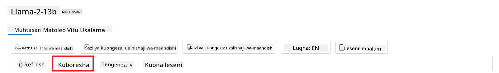
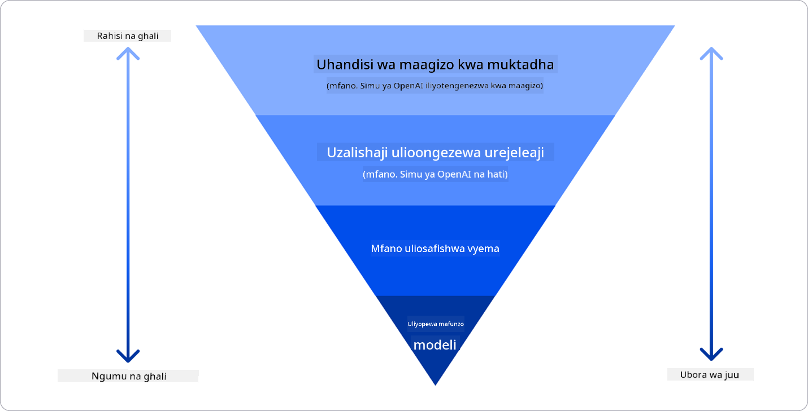

<!--
CO_OP_TRANSLATOR_METADATA:
{
  "original_hash": "e2f686f2eb794941761252ac5e8e090b",
  "translation_date": "2025-05-19T14:17:14+00:00",
  "source_file": "02-exploring-and-comparing-different-llms/README.md",
  "language_code": "sw"
}
-->
# Kuchunguza na kulinganisha LLM tofauti

> _Bofya picha hapo juu ili kutazama video ya somo hili_

Katika somo la awali, tumeona jinsi AI ya kizazi inavyobadilisha mandhari ya teknolojia, jinsi Moduli Kubwa za Lugha (LLMs) zinavyofanya kazi na jinsi biashara - kama vile kampuni yetu changa - inaweza kuzitumia katika kesi zake na kukua! Katika sura hii, tunatazamia kulinganisha na kutofautisha aina tofauti za moduli kubwa za lugha (LLMs) ili kuelewa faida na hasara zao.

Hatua inayofuata katika safari ya kampuni yetu changa ni kuchunguza mandhari ya sasa ya LLMs na kuelewa ni zipi zinazofaa kwa kesi yetu.

## Utangulizi

Somo hili litaangazia:

- Aina tofauti za LLMs katika mandhari ya sasa.
- Kupima, kurudia, na kulinganisha moduli tofauti kwa kesi yako katika Azure.
- Jinsi ya kupeleka LLM.

## Malengo ya Kujifunza

Baada ya kukamilisha somo hili, utaweza:

- Kuchagua moduli sahihi kwa kesi yako.
- Kuelewa jinsi ya kupima, kurudia, na kuboresha utendaji wa moduli yako.
- Kujua jinsi biashara zinavyoweka moduli.

## Kuelewa aina tofauti za LLMs

LLMs zinaweza kuwa na kategoria nyingi kulingana na usanifu wake, data ya mafunzo, na kesi ya matumizi. Kuelewa tofauti hizi kutasaidia kampuni yetu changa kuchagua moduli sahihi kwa hali, na kuelewa jinsi ya kupima, kurudia, na kuboresha utendaji.

Kuna aina nyingi tofauti za moduli za LLM, uchaguzi wako wa moduli unategemea unachotaka kuzitumia, data yako, kiasi unachotaka kulipa na zaidi.

Kutegemea ikiwa unataka kutumia moduli kwa maandishi, sauti, video, uzalishaji wa picha na kadhalika, unaweza kuchagua aina tofauti ya moduli.

- **Utambuzi wa sauti na hotuba**. Kwa kusudi hili, moduli za aina ya Whisper ni chaguo bora kwani ni za matumizi ya jumla na zinalenga utambuzi wa hotuba. Zimefundishwa kwenye sauti tofauti na zinaweza kufanya utambuzi wa hotuba wa lugha nyingi. Jifunze zaidi kuhusu [moduli za aina ya Whisper hapa](https://platform.openai.com/docs/models/whisper?WT.mc_id=academic-105485-koreyst).

- **Uzalishaji wa picha**. Kwa uzalishaji wa picha, DALL-E na Midjourney ni chaguo mbili zinazojulikana sana. DALL-E inatolewa na Azure OpenAI. [Soma zaidi kuhusu DALL-E hapa](https://platform.openai.com/docs/models/dall-e?WT.mc_id=academic-105485-koreyst) na pia katika Sura ya 9 ya mtaala huu.

- **Uzalishaji wa maandishi**. Moduli nyingi zimefundishwa kwenye uzalishaji wa maandishi na una chaguo nyingi kutoka GPT-3.5 hadi GPT-4. Zinakuja kwa gharama tofauti na GPT-4 ikiwa ya gharama kubwa zaidi. Inafaa kuangalia [Azure OpenAI playground](https://oai.azure.com/portal/playground?WT.mc_id=academic-105485-koreyst) ili kutathmini ni moduli gani zinafaa zaidi kwa mahitaji yako kwa uwezo na gharama.

- **Multi-modality**. Ikiwa unatafuta kushughulikia aina nyingi za data katika ingizo na matokeo, unaweza kutaka kuangalia moduli kama [gpt-4 turbo na vision au gpt-4o](https://learn.microsoft.com/azure/ai-services/openai/concepts/models#gpt-4-and-gpt-4-turbo-models?WT.mc_id=academic-105485-koreyst) - matoleo ya hivi karibuni ya moduli za OpenAI - ambazo zina uwezo wa kuunganisha usindikaji wa lugha asili na uelewa wa kuona, kuwezesha maingiliano kupitia interfaces za multi-modal.

Kuchagua moduli inamaanisha unapata uwezo wa msingi, ambao unaweza usitoshe. Mara nyingi unayo data maalum ya kampuni ambayo kwa namna fulani unahitaji kuijulisha LLM. Kuna chaguo kadhaa tofauti juu ya jinsi ya kukabiliana na hilo, zaidi juu ya hilo katika sehemu zijazo.

### Moduli za Msingi dhidi ya LLMs

Neno Moduli ya Msingi lilianzishwa na [watafiti wa Stanford](https://arxiv.org/abs/2108.07258?WT.mc_id=academic-105485-koreyst) na kufafanuliwa kama moduli ya AI inayofuata vigezo fulani, kama vile:

- **Zimefundishwa kwa kutumia kujifunza bila usimamizi au kujifunza kwa kujisimamia**, ikimaanisha zimefundishwa kwenye data ya multimodal isiyo na lebo, na hazihitaji uandishi wa kibinadamu au uwekaji lebo wa data kwa ajili ya mchakato wao wa mafunzo.
- **Ni moduli kubwa sana**, zinazotegemea mitandao ya neva iliyochimbika sana iliyofundishwa kwenye mamilioni ya vigezo.
- **Kwa kawaida zinakusudiwa kutumika kama 'msingi' kwa moduli nyingine**, ikimaanisha zinaweza kutumika kama sehemu ya kuanzia kwa moduli nyingine kujengwa juu yake, ambayo inaweza kufanywa kwa kuboresha.

Ili kufafanua zaidi tofauti hii, hebu tuchukue ChatGPT kama mfano. Ili kujenga toleo la kwanza la ChatGPT, moduli iitwayo GPT-3.5 ilitumika kama moduli ya msingi. Hii ina maana kwamba OpenAI ilitumia data maalum ya mazungumzo kuunda toleo lililoboresha la GPT-3.5 ambalo lilikuwa maalum katika kufanya vizuri katika hali za mazungumzo, kama vile chatbots.

### Moduli za Chanzo Huria dhidi ya Moduli za Umiliki

Njia nyingine ya kuweka kategoria LLMs ni ikiwa ni chanzo huria au umiliki.

Moduli za chanzo huria ni moduli ambazo zinapatikana kwa umma na zinaweza kutumiwa na mtu yeyote. Mara nyingi zinapatikana na kampuni iliyozitengeneza, au na jamii ya utafiti. Moduli hizi zinaruhusiwa kuchunguzwa, kurekebishwa, na kubinafsishwa kwa kesi mbalimbali za matumizi katika LLMs. Hata hivyo, hazijawezeshwa kwa matumizi ya uzalishaji, na zinaweza zisifanye kazi vizuri kama moduli za umiliki. Pia, ufadhili kwa moduli za chanzo huria unaweza kuwa mdogo, na zinaweza zisidumishwe kwa muda mrefu au zisibadilishwe na utafiti wa hivi karibuni. Mifano ya moduli maarufu za chanzo huria ni pamoja na [Alpaca](https://crfm.stanford.edu/2023/03/13/alpaca.html?WT.mc_id=academic-105485-koreyst), [Bloom](https://huggingface.co/bigscience/bloom) na [LLaMA](https://llama.meta.com).

Moduli za umiliki ni moduli ambazo zinamilikiwa na kampuni na hazitolewi kwa umma. Moduli hizi mara nyingi zimewezeshwa kwa matumizi ya uzalishaji. Hata hivyo, haziruhusiwi kuchunguzwa, kurekebishwa, au kubinafsishwa kwa kesi tofauti za matumizi. Pia, hazipatikani bure, na zinaweza kuhitaji usajili au malipo ya matumizi. Pia, watumiaji hawana udhibiti juu ya data inayotumiwa kufundisha moduli, ambayo ina maana wanapaswa kuamini mmiliki wa moduli kuhakikisha dhamira ya faragha ya data na matumizi ya AI yenye uwajibikaji. Mifano ya moduli maarufu za umiliki ni pamoja na [moduli za OpenAI](https://platform.openai.com/docs/models/overview?WT.mc_id=academic-105485-koreyst), [Google Bard](https://sapling.ai/llm/bard?WT.mc_id=academic-105485-koreyst) au [Claude 2](https://www.anthropic.com/index/claude-2?WT.mc_id=academic-105485-koreyst).

### Kuweka dhidi ya Uzalishaji wa Picha dhidi ya Uzalishaji wa Maandishi na Kanuni

LLMs pia zinaweza kuwekwa katika kategoria kulingana na matokeo wanayozalisha.

Kuweka ni seti ya moduli zinazoweza kubadilisha maandishi kuwa fomu ya nambari, inayoitwa kuweka, ambayo ni uwakilishi wa nambari wa maandishi ya ingizo. Kuweka kunafanya iwe rahisi kwa mashine kuelewa uhusiano kati ya maneno au sentensi na inaweza kutumiwa kama ingizo na moduli nyingine, kama vile moduli za uainishaji, au moduli za kugawanya ambazo zina utendaji bora kwenye data ya nambari. Moduli za kuweka mara nyingi hutumiwa kwa kujifunza kuhamisha, ambapo moduli imejengwa kwa kazi mbadala ambayo kuna wingi wa data, na kisha uzito wa moduli (kuweka) unatumika tena kwa kazi nyingine za chini. Mfano wa kategoria hii ni [OpenAI embeddings](https://platform.openai.com/docs/models/embeddings?WT.mc_id=academic-105485-koreyst).

Moduli za uzalishaji wa picha ni moduli zinazozalisha picha. Moduli hizi mara nyingi hutumiwa kwa uhariri wa picha, usanisi wa picha, na tafsiri ya picha. Moduli za uzalishaji wa picha mara nyingi zimefundishwa kwenye seti kubwa za data za picha, kama [LAION-5B](https://laion.ai/blog/laion-5b/?WT.mc_id=academic-105485-koreyst), na zinaweza kutumiwa kuzalisha picha mpya au kuhariri picha zilizopo kwa kutumia mbinu za kupiga rangi, super-resolution, na colorization. Mifano ni pamoja na [DALL-E-3](https://openai.com/dall-e-3?WT.mc_id=academic-105485-koreyst) na [Stable Diffusion models](https://github.com/Stability-AI/StableDiffusion?WT.mc_id=academic-105485-koreyst).

Moduli za uzalishaji wa maandishi na kanuni ni moduli zinazozalisha maandishi au kanuni. Moduli hizi mara nyingi hutumiwa kwa muhtasari wa maandishi, tafsiri, na kujibu maswali. Moduli za uzalishaji wa maandishi mara nyingi zimefundishwa kwenye seti kubwa za data za maandishi, kama [BookCorpus](https://www.cv-foundation.org/openaccess/content_iccv_2015/html/Zhu_Aligning_Books_and_ICCV_2015_paper.html?WT.mc_id=academic-105485-koreyst), na zinaweza kutumiwa kuzalisha maandishi mapya, au kujibu maswali. Moduli za uzalishaji wa kanuni, kama [CodeParrot](https://huggingface.co/codeparrot?WT.mc_id=academic-105485-koreyst), mara nyingi zimefundishwa kwenye seti kubwa za data za kanuni, kama GitHub, na zinaweza kutumiwa kuzalisha kanuni mpya, au kurekebisha makosa katika kanuni zilizopo.

### Encoder-Decoder dhidi ya Decoder-pekee

Kuzungumzia aina tofauti za usanifu wa LLMs, hebu tutumie mfano.

Fikiria meneja wako amekupa kazi ya kuandika jaribio kwa wanafunzi. Una wenzako wawili; mmoja anasimamia kuunda maudhui na mwingine anasimamia kuyakagua.

Muundaji wa maudhui ni kama moduli ya Decoder-pekee, anaweza kuangalia mada na kuona ulichokwisha kuandika kisha anaweza kuandika kozi kulingana na hiyo. Ana uwezo mkubwa wa kuandika maudhui ya kuvutia na yenye taarifa, lakini si mzuri sana katika kuelewa mada na malengo ya kujifunza. Baadhi ya mifano ya moduli za Decoder ni moduli za familia ya GPT, kama vile GPT-3.

Mhakiki ni kama moduli ya Encoder-pekee, anaangalia kozi iliyowandikwa na majibu, akitambua uhusiano kati yao na kuelewa muktadha, lakini si mzuri katika kuunda maudhui. Mfano wa moduli ya Encoder-pekee ingekuwa BERT.

Fikiria kwamba tunaweza kuwa na mtu pia ambaye angeweza kuunda na kukagua jaribio, hii ni moduli ya Encoder-Decoder. Baadhi ya mifano ingekuwa BART na T5.

### Huduma dhidi ya Moduli

Sasa, hebu tuzungumzie tofauti kati ya huduma na moduli. Huduma ni bidhaa inayotolewa na Mtoa Huduma za Wingu, na mara nyingi ni mchanganyiko wa moduli, data, na vipengele vingine. Moduli ni sehemu kuu ya huduma, na mara nyingi ni moduli ya msingi, kama vile LLM.

Huduma mara nyingi zimewezeshwa kwa matumizi ya uzalishaji na mara nyingi ni rahisi kutumia kuliko moduli, kupitia interface ya mtumiaji ya kielelezo. Hata hivyo, huduma hazipatikani bure, na zinaweza kuhitaji usajili au malipo ya matumizi, badala ya kutumia vifaa na rasilimali za mmiliki wa huduma, kupunguza gharama na kuongeza urahisi. Mfano wa huduma ni [Huduma ya Azure OpenAI](https://learn.microsoft.com/azure/ai-services/openai/overview?WT.mc_id=academic-105485-koreyst), inayotoa mpango wa malipo kulingana na matumizi, ikimaanisha watumiaji wanatozwa kulingana na kiasi wanachotumia huduma. Pia, Huduma ya Azure OpenAI inatoa usalama wa daraja la biashara na mfumo wa AI yenye uwajibikaji juu ya uwezo wa moduli.

Moduli ni tu Mtandao wa Neva, na vigezo, uzito, na vingine. Kuruhusu kampuni kuendesha ndani, hata hivyo, ingehitaji kununua vifaa, kujenga muundo wa kuongeza na kununua leseni au kutumia moduli ya chanzo huria. Moduli kama LLaMA inapatikana kutumiwa, ikihitaji nguvu ya kompyuta kuendesha moduli.

## Jinsi ya kupima na kurudia na moduli tofauti ili kuelewa utendaji kwenye Azure

Mara timu yetu itakapochunguza mandhari ya sasa ya LLMs na kutambua baadhi ya wagombea wazuri kwa hali zao, hatua inayofuata ni kuzipima kwenye data yao na mzigo wao wa kazi. Hii ni mchakato wa kurudia, unaofanywa kwa majaribio na vipimo.
Moduli nyingi tulizozitaja katika aya za awali (moduli za OpenAI, moduli za chanzo huria kama Llama2, na transfoma za Hugging Face) zinapatikana katika [Katalogi ya Moduli](https://learn.microsoft.com/azure/ai-studio/how-to/model-catalog-overview?WT.mc_id=academic-105485-koreyst) katika [Azure AI Studio](https://ai.azure.com/?WT.mc_id=academic-105485-koreyst).

[Azure AI Studio](https://learn.microsoft.com/azure/ai-studio/what-is-ai-studio?WT.mc_id=academic-105485-koreyst) ni Jukwaa la Wingu lililoundwa kwa ajili ya watengenezaji kujenga programu za AI za kizazi na kusimamia mzunguko mzima wa maendeleo - kutoka majaribio hadi tathmini - kwa kuunganisha huduma zote za AI za Azure katika kituo kimoja na GUI inayofaa. Katalogi ya Moduli katika Azure AI Studio inawezesha mtumiaji:

- Kutafuta Moduli ya Msingi ya kupendeza katika katalogi - ama umiliki au chanzo huria, kuchuja kwa kazi, leseni, au jina. Ili kuboresha utaftaji, moduli zimepangwa katika makusanyo, kama vile makusanyo ya Azure OpenAI, makusanyo ya Hugging Face, na zaidi.

- Kukagua kadi ya moduli, ikijumuisha maelezo ya kina ya matumizi yaliyokusudiwa na data ya mafunzo, sampuli za kanuni na matokeo ya tathmini kwenye maktaba ya tathmini za ndani.
- Linganisha alama za utendaji kati ya mifano na seti za data zinazopatikana katika tasnia ili kutathmini ni ipi inayofaa hali ya biashara, kupitia paneli ya [Model Benchmarks](https://learn.microsoft.com/azure/ai-studio/how-to/model-benchmarks?WT.mc_id=academic-105485-koreyst).

- Rekebisha zaidi mfano kwenye data ya mafunzo ya kibinafsi ili kuboresha utendaji wa mfano katika mzigo maalum wa kazi, kwa kutumia uwezo wa majaribio na ufuatiliaji wa Azure AI Studio.

- Tumia mfano wa awali uliopangwa au toleo lililorekebishwa zaidi kwa utabiri wa wakati halisi kwa mbali - hesabu inayosimamiwa - au kituo cha api kisicho na seva - [lipa kadri unavyotumia](https://learn.microsoft.com/azure/ai-studio/how-to/model-catalog-overview#model-deployment-managed-compute-and-serverless-api-pay-as-you-go?WT.mc_id=academic-105485-koreyst) - ili kuwezesha programu kuutumia.

> [!NOTE]
> Sio mifano yote katika katalogi inayopatikana kwa kurekebishwa zaidi na/au utumiaji wa kulipa kadri unavyotumia kwa sasa. Angalia kadi ya mfano kwa maelezo kuhusu uwezo na mipaka ya mfano.

## Kuboresha matokeo ya LLM

Tumetafiti na timu yetu ya kuanza aina tofauti za LLMs na Jukwaa la Wingu (Azure Machine Learning) ambalo linatuwezesha kulinganisha mifano tofauti, kuwapima kwenye data ya majaribio, kuboresha utendaji na kuwatumia kwenye vituo vya utabiri.

Lakini lini wanapaswa kuzingatia kurekebisha zaidi mfano badala ya kutumia ule uliopangwa awali? Je, kuna mbinu zingine za kuboresha utendaji wa mfano katika mzigo maalum wa kazi?

Kuna mbinu kadhaa ambazo biashara inaweza kutumia kupata matokeo wanayohitaji kutoka kwa LLM. Unaweza kuchagua aina tofauti za mifano na viwango tofauti vya mafunzo wakati wa kutumia LLM katika uzalishaji, na viwango tofauti vya ugumu, gharama, na ubora. Hapa kuna mbinu tofauti:

- **Uhandisi wa kuashiria na muktadha**. Wazo ni kutoa muktadha wa kutosha wakati unapoashiria ili kuhakikisha unapata majibu unayohitaji.

- **Utoaji wa Maarifa ulioboreshwa, RAG**. Data yako inaweza kuwepo kwenye hifadhidata au kituo cha wavuti kwa mfano, ili kuhakikisha data hii, au sehemu yake, inajumuishwa wakati wa kuashiria, unaweza kupata data husika na kuifanya kuwa sehemu ya maoni ya mtumiaji.

- **Mfano uliorekebishwa zaidi**. Hapa, unafundisha mfano zaidi kwenye data yako mwenyewe ambayo husababisha mfano kuwa sahihi zaidi na msikivu kwa mahitaji yako lakini inaweza kuwa na gharama kubwa.

Chanzo cha picha: [Njia Nne ambazo Makampuni yanatumia LLMs | Fiddler AI Blog](https://www.fiddler.ai/blog/four-ways-that-enterprises-deploy-llms?WT.mc_id=academic-105485-koreyst)

### Uhandisi wa kuashiria na muktadha

LLMs zilizopangwa awali hufanya kazi vizuri sana kwenye kazi za lugha ya asili kwa ujumla, hata kwa kuziita na maoni mafupi, kama sentensi ya kukamilisha au swali – inayoitwa “zero-shot” learning.

Hata hivyo, kadri mtumiaji anavyoweza kuunda swali lao, na ombi lililoelezwa na mifano – Muktadha – ndivyo jibu litakavyokuwa sahihi na karibu na matarajio ya mtumiaji. Katika kesi hii, tunazungumzia “one-shot” learning ikiwa maoni yanajumuisha mfano mmoja tu na “few-shot learning” ikiwa yanajumuisha mifano mingi.
Uhandisi wa kuashiria na muktadha ni mbinu yenye gharama nafuu zaidi kuanza nayo.

### Utoaji wa Maarifa ulioboreshwa (RAG)

LLMs zina kizuizi kwamba zinaweza kutumia tu data iliyotumiwa wakati wa mafunzo yao kutoa jibu. Hii ina maana kwamba hawajui chochote kuhusu ukweli uliotokea baada ya mchakato wao wa mafunzo, na hawawezi kufikia taarifa zisizo za umma (kama data ya kampuni).
Hii inaweza kushindwa kupitia RAG, mbinu inayoongeza maoni na data ya nje kwa namna ya vipande vya nyaraka, ikizingatia mipaka ya urefu wa maoni. Hii inasaidiwa na zana za hifadhidata ya Vector (kama [Azure Vector Search](https://learn.microsoft.com/azure/search/vector-search-overview?WT.mc_id=academic-105485-koreyst)) ambazo zinapata vipande muhimu kutoka vyanzo vya data vilivyowekwa tayari na kuviongeza kwenye Muktadha wa maoni.

Mbinu hii ni muhimu sana wakati biashara haina data ya kutosha, muda wa kutosha, au rasilimali za kurekebisha zaidi LLM, lakini bado inataka kuboresha utendaji katika mzigo maalum wa kazi na kupunguza hatari za uzushi, yaani, upotoshaji wa ukweli au maudhui hatari.

### Mfano uliorekebishwa zaidi

Kurekebisha zaidi ni mchakato unaotumia kujifunza kuhamisha ili 'kubadilisha' mfano kwa kazi ya chini au kutatua tatizo maalum. Tofauti na kujifunza kwa mifano michache na RAG, inasababisha mfano mpya kutengenezwa, na uzito na upendeleo uliosasishwa. Inahitaji seti ya mifano ya mafunzo inayojumuisha pembejeo moja (maoni) na matokeo yanayohusiana (ukamilishaji).
Hii itakuwa mbinu inayopendekezwa ikiwa:

- **Kutumia mifano iliyorekebishwa zaidi**. Biashara ingependa kutumia mifano iliyorekebishwa zaidi na uwezo mdogo (kama mifano ya kuunganisha) badala ya mifano ya utendaji wa juu, na kusababisha suluhisho lenye gharama nafuu na la haraka.

- **Kuzingatia ucheleweshaji**. Ucheleweshaji ni muhimu kwa kesi maalum ya matumizi, kwa hivyo haiwezekani kutumia maoni marefu sana au idadi ya mifano ambayo inapaswa kujifunza kutoka kwa mfano haifai na kikomo cha urefu wa maoni.

- **Kuwa na habari za kisasa**. Biashara ina data nyingi za ubora wa juu na lebo za ukweli wa msingi na rasilimali zinazohitajika ili kudumisha data hii kuwa ya kisasa kwa muda.

### Mfano uliopangwa

Kufundisha LLM kutoka mwanzo bila shaka ni mbinu ngumu zaidi na yenye changamoto zaidi kuzingatia, inayohitaji kiasi kikubwa cha data, rasilimali zenye ujuzi, na nguvu ya kompyuta inayofaa. Chaguo hili linapaswa kuzingatiwa tu katika hali ambapo biashara ina kesi maalum ya matumizi ya kikoa na kiasi kikubwa cha data inayozingatia kikoa.

## Tathmini ya maarifa

Ni nini inaweza kuwa mbinu nzuri ya kuboresha matokeo ya ukamilishaji wa LLM?

1. Uhandisi wa kuashiria na muktadha
1. RAG
1. Mfano uliorekebishwa zaidi

A:3, ikiwa una muda na rasilimali na data ya ubora wa juu, kurekebisha zaidi ni chaguo bora kubaki na habari za kisasa. Hata hivyo, ikiwa unatafuta kuboresha mambo na unakosa muda ni vyema kuzingatia RAG kwanza.

## 🚀 Changamoto

Soma zaidi juu ya jinsi unavyoweza [kutumia RAG](https://learn.microsoft.com/azure/search/retrieval-augmented-generation-overview?WT.mc_id=academic-105485-koreyst) kwa biashara yako.

## Kazi Nzuri, Endelea Kujifunza

Baada ya kukamilisha somo hili, angalia mkusanyiko wetu wa [Generative AI Learning](https://aka.ms/genai-collection?WT.mc_id=academic-105485-koreyst) ili kuendelea kuongeza maarifa yako ya Generative AI!

Nenda kwenye Somo la 3 ambapo tutaangalia jinsi ya [kujenga kwa Generative AI kwa Uwajibikaji](../03-using-generative-ai-responsibly/README.md?WT.mc_id=academic-105485-koreyst)!

**Kataa:**  
Hati hii imetafsiriwa kwa kutumia huduma ya kutafsiri ya AI [Co-op Translator](https://github.com/Azure/co-op-translator). Ingawa tunajitahidi kwa usahihi, tafadhali fahamu kuwa tafsiri za kiotomatiki zinaweza kuwa na makosa au kutokuwepo kwa usahihi. Hati ya asili katika lugha yake ya asili inapaswa kuchukuliwa kama chanzo chenye mamlaka. Kwa taarifa muhimu, tafsiri ya kitaalamu ya binadamu inapendekezwa. Hatutawajibika kwa kutokuelewana au tafsiri zisizo sahihi zinazotokana na matumizi ya tafsiri hii.