# Kuchunguza na kulinganisha Aina tofauti za LLMs

[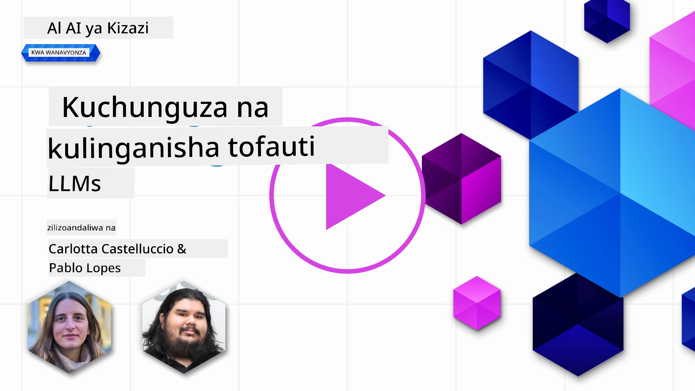](https://youtu.be/KIRUeDKscfI?si=8BHX1zvwzQBn-PlK)

> _Bonyeza picha hapo juu kutazama video ya somo hili_

Katika somo lililopita, tumeona jinsi AI ya Kizazi inavyobadilisha mandhari ya teknolojia, jinsi Modeli Kubwa za Lugha (LLMs) zinavyofanya kazi na jinsi biashara - kama vile kuanzishwa kwetu - inaweza kuzitumia kwenye matukio yao ya matumizi na kukua! Katika sura hii, tunatazama kulinganisha na kutofautisha aina tofauti za modeli kubwa za lugha (LLMs) kuelewa faida na hasara zao.

Hatua inayofuata katika safari ya kuanzisha kwetu ni kuchunguza mazingira ya sasa ya LLMs na kuelewa ni zipi zinazofaa kwa tukio letu la matumizi.

## Utangulizi

Somo hili litajumuisha:

- Aina tofauti za LLMs katika mazingira ya sasa.
- Kupima, kujaribu, na kulinganisha modeli tofauti kwa tukio lako la matumizi katika Azure.
- Jinsi ya kutekeleza LLM.

## Malengo ya Kujifunza

Baada ya kumaliza somo hili, utaweza:

- Kuchagua modeli sahihi kwa tukio lako la matumizi.
- Kuelewa jinsi ya kupima, kujaribu tena, na kuboresha utendaji wa modeli yako.
- Kujua jinsi biashara zinavyoweka modeli kazini.

## Elewa aina mbalimbali za LLMs

LLMs zinaweza kuwa na makundi mengi kulingana na usanifu wake, data ya mafunzo, na tukio la matumizi. Kuelewa tofauti hizi kutasaidia kuanzishwa kwetu kuchagua modeli sahihi kwa tukio, na kuelewa jinsi ya kupima, kujaribu tena, na kuboresha utendaji.

Kuna aina nyingi tofauti za modeli za LLM, uchaguzi wako wa modeli hutegemea unachotaka kuvitumia, data yako, kiasi unachotegemea kulipa na zaidi.

Kulingana na kama unataka kutumia modeli kwa maandishi, sauti, video, uzalishaji wa picha na kadhalika, unaweza kuchagua aina tofauti ya modeli.

- **Utambuzi wa Sauti na Hotuba**. Modeli za aina Whisper bado ni muhimu kama modeli za jumla za utambuzi wa hotuba, lakini chaguzi za uzalishaji sasa pia ni pamoja na modeli mpya za hotuba-kwa-maandishi kama `gpt-4o-transcribe`, `gpt-4o-mini-transcribe`, na aina za diarization. Pima ueneaji wa lugha, diarization, msaada wa wakati halisi, ucheleweshaji, na gharama kwa tukio lako. Jifunze zaidi katika [nyaraka za OpenAI za hotuba-kwa-maandishi](https://platform.openai.com/docs/guides/speech-to-text?WT.mc_id=academic-105485-koreyst).

- **Uzalishaji wa Picha**. DALL-E na Midjourney ni chaguzi maarufu za uzalishaji wa picha, lakini API za sasa za picha za OpenAI zinajikita kwenye modeli za GPT Image kama `gpt-image-2`, wakati Stable Diffusion, Imagen, Flux, na familia nyingine za modeli pia ni chaguzi za kawaida. Linganisha kufuata maelekezo, msaada wa uhariri, udhibiti wa mtindo, mahitaji ya usalama, na leseni. Jifunze zaidi katika [mwongozo wa uzalishaji wa picha wa OpenAI](https://platform.openai.com/docs/guides/images?WT.mc_id=academic-105485-koreyst) na Sura ya 9 ya mtaala huu.

- **Uzalishaji wa Maandishi**. Modeli za maandishi sasa zinajumuisha modeli za kisasa, modeli za mantiki, modeli ndogo za ucheleweshaji mdogo, na modeli za uzito wazi. Mifano ya sasa ni pamoja na modeli za OpenAI GPT-5.x, modeli za Anthropic Claude 4.x, modeli za Google Gemini 3.x, modeli za Meta Llama 4, na modeli za Mistral. Usichague kwa tarehe ya kutolewa au bei pekee; linganisha ubora wa kazi, ucheleweshaji, dirisha la muktadha, matumizi ya zana, tabia ya usalama, upatikanaji wa kikanda, na jumla ya gharama. [Katalogi ya modeli ya Microsoft Foundry](https://ai.azure.com/catalog?WT.mc_id=academic-105485-koreyst) ni mahali pazuri pa kulinganisha modeli zinazopatikana Azure.

- **Multi-modality**. Modeli nyingi za sasa zinaweza kushughulikia zaidi ya maandishi. Baadhi huchukua picha, sauti, au video kama ingizo; baadhi zinaweza kuita zana; na modeli maalum zinaweza kuzalisha picha, sauti, au video. Kwa mfano, modeli za sasa za OpenAI zinaunga mkono ingizo la maandishi na picha, modeli za Gemini zinaweza kuunga mkono ingizo la maandishi, msimbo, picha, sauti, na video kulingana na aina, na Llama 4 Scout na Maverick ni modeli za uzito wazi zenye uwezo wa aina nyingi kwa asili. Kila mara hakikisha kadi ya modeli inathibitisha aina za ingizo na matokeo zinazotegemewa kabla ya kuunda mtiririko wa kazi.

Kuchagua modeli kunamaanisha unapata baadhi ya uwezo wa msingi, lakini inaweza isitoshe. Mara nyingi unakuwa na data maalum ya kampuni ambayo unahitaji kusema kwa namna fulani kwa LLM. Kuna chaguzi kadhaa za jinsi ya kuifikia hiyo, zitazungumziwa zaidi katika sehemu zinazofuata.

### Modeli za Msingi dhidi ya LLMs

Neno Modeli ya Msingi lilitengenezwa na [watafiti wa Stanford](https://arxiv.org/abs/2108.07258?WT.mc_id=academic-105485-koreyst) na liliofafanuliwa kama modeli ya AI inayokidhi vigezo fulani, kama vile:

- **Zinafunzwa kwa kutumia ujifunzaji usiokuwa wa kufuatilia au ujifunzaji wa kujisoma peke yao**, ikimaanisha zinatumika kwa data isiyo na lebo yenye aina mbalimbali, na hazihitaji ufafanuzi au uandishi wa data na binadamu kwa mchakato wa mafunzo.
- **Ni modeli kubwa sana**, zinazotegemea mitandao ya neva yenye kina sana ambayo hufunzwa kwa mabilioni ya vigezo.
- **Kawaida huwa kama msingi wa kuundwa kwa modeli nyingine**, ikimaanisha zinaweza kutumika kama msingi wa kuunda modeli nyingine juu yake, jambo ambalo linaweza kufanyika kwa kuimarisha mafunzo.

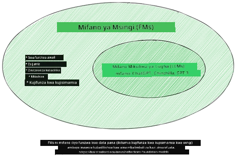

Chanzo cha picha: [Mwongozo Muhimu wa Modeli za Msingi na Modeli Kubwa za Lugha | na Babar M Bhatti | Medium
](https://thebabar.medium.com/essential-guide-to-foundation-models-and-large-language-models-27dab58f7404)

Ili kufafanua zaidi tofauti hii, tuchukue ChatGPT kama mfano wa kihistoria. Toleo za awali za ChatGPT zilitumia GPT-3.5 kama msingi wa modeli. OpenAI ilitumia data maalum ya mazungumzo na mbinu za mlinganiko kuunda toleo lililoboreshwa lililotumia vizuri zaidi katika hali za mazungumzo, kama vile roboti za mazungumzo. Huduma za kisasa za AI mara nyingi hutumia aina kadhaa za modeli, hivyo jina la huduma na la modeli ya msingi si mara zote sawa.

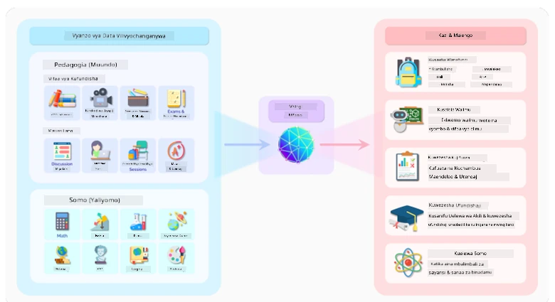

Chanzo cha picha: [2108.07258.pdf (arxiv.org)](https://arxiv.org/pdf/2108.07258.pdf?WT.mc_id=academic-105485-koreyst)

### Modeli Zenye Uzito Wazi/Open-Weight dhidi ya Modeli Miliki

Njia nyingine ya kugawanya LLM ni kama modeli ni uzito wazi, chanzo wazi, au miliki.

Modeli za chanzo wazi na uzito wazi hufanya vifungu vya modeli kupatikana kwa ukaguzi, kupakua, au kubinafsisha, lakini leseni zao zinatofautiana. Baadhi ni chanzo wazi kabisa, wakati zingine ni modeli za uzito wazi wenye vikwazo vya matumizi. Inaweza kuwa muhimu wakati biashara inahitaji udhibiti zaidi juu ya uanzishaji, eneo la data, gharama, au ubinafsishaji. Hata hivyo, timu bado zinahitaji kupitia masharti ya leseni, gharama za huduma, matengenezo, masasisho ya usalama, na ubora wa tathmini kabla ya kuzitumia kwa uzalishaji. Mifano ni pamoja na [Meta Llama 4](https://ai.meta.com/blog/llama-4-multimodal-intelligence/?WT.mc_id=academic-105485-koreyst), baadhi ya [modeli za Mistral](https://docs.mistral.ai/models/overview?WT.mc_id=academic-105485-koreyst), na modeli nyingi zinazohifadhiwa kwenye [Hugging Face](https://huggingface.co/models?WT.mc_id=academic-105485-koreyst).

Modeli miliki ni mali na yanahifadhiwa na muuzaji. Modeli hizi mara nyingi zimeboreshwa kwa matumizi ya uzalishaji ulioongozwa na usimamizi na zinaweza kutoa msaada thabiti, mifumo ya usalama, ujumuishaji wa zana, na upanuzi. Hata hivyo, wateja mara nyingi hawawezi kukagua au kubadilisha uzito wa modeli, na wanapaswa kupitia masharti ya muuzaji kuhusu faragha, uhifadhi, uzingatiaji, na matumizi yanayokubalika. Mifano ni pamoja na [modeli za OpenAI](https://platform.openai.com/docs/models?WT.mc_id=academic-105485-koreyst), [Google Gemini](https://deepmind.google/models/gemini/pro/?WT.mc_id=academic-105485-koreyst), na [Anthropic Claude](https://platform.claude.com/docs/en/about-claude/models/overview?WT.mc_id=academic-105485-koreyst).

### Uingizaji (Embedding) dhidi ya Uzalishaji wa Picha dhidi ya Uzalishaji wa Maandishi na Msimbo

LLMs pia zinaweza kugawanywa kulingana na matokeo yanayozalishwa.

Uingizaji ni seti ya modeli zinazoweza kubadilisha maandishi kuwa fomu ya nambari, inayoitwa uingizaji, ambayo ni uwakilishi wa nambari wa maandishi yaliyoingia. Uingizaji unarahisisha mashine kuelewa uhusiano kati ya maneno au sentensi na unaweza kutumika kama ingizo kwa modeli nyingine, kama vile modeli za uainishaji, au modeli za kugawanya ambazo zina utendaji bora kwenye data ya nambari. Modeli za uingizaji mara nyingi hutumika kwa ujifunzaji wa uhamisho, ambapo modeli huundwa kwa kazi mbadala ambayo kuna data nyingi, na kisha uzito wa modeli (uingizo) hutumika tena kwa kazi nyingine za chini zaidi. Mfano wa kundi hili ni [uingizo wa OpenAI](https://platform.openai.com/docs/models/embeddings?WT.mc_id=academic-105485-koreyst).

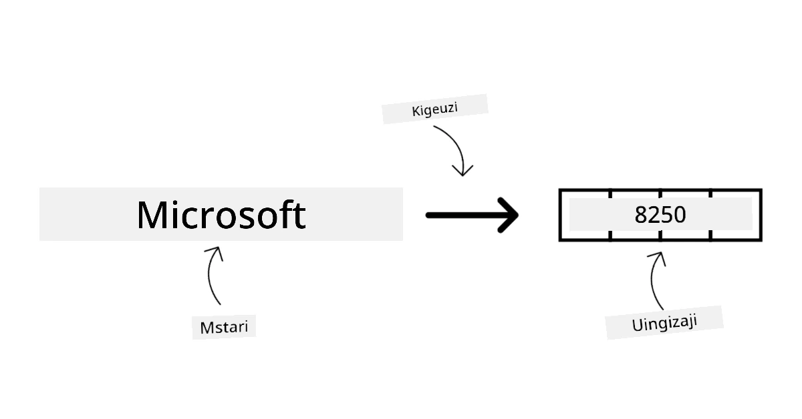

Modeli za uzalishaji wa picha ni modeli zinazozalisha picha. Modeli hizi mara nyingi hutumiwa kwa uhariri wa picha, usanisi wa picha, na tafsiri ya picha. Modeli za uzalishaji wa picha mara nyingi hufunzwa kwa hifadhidata kubwa za picha, kama [LAION-5B](https://laion.ai/blog/laion-5b/?WT.mc_id=academic-105485-koreyst), na zinaweza kutumika kuzalisha picha mpya au kuhariri picha zilizopo kwa mbinu za kuandaa upya sehemu (inpainting), azimio la juu (super-resolution), na rangi. Mifano ni pamoja na [modeli za GPT Image](https://platform.openai.com/docs/guides/images?WT.mc_id=academic-105485-koreyst), [modeli za Stable Diffusion](https://github.com/Stability-AI/StableDiffusion?WT.mc_id=academic-105485-koreyst), na modeli za Imagen.

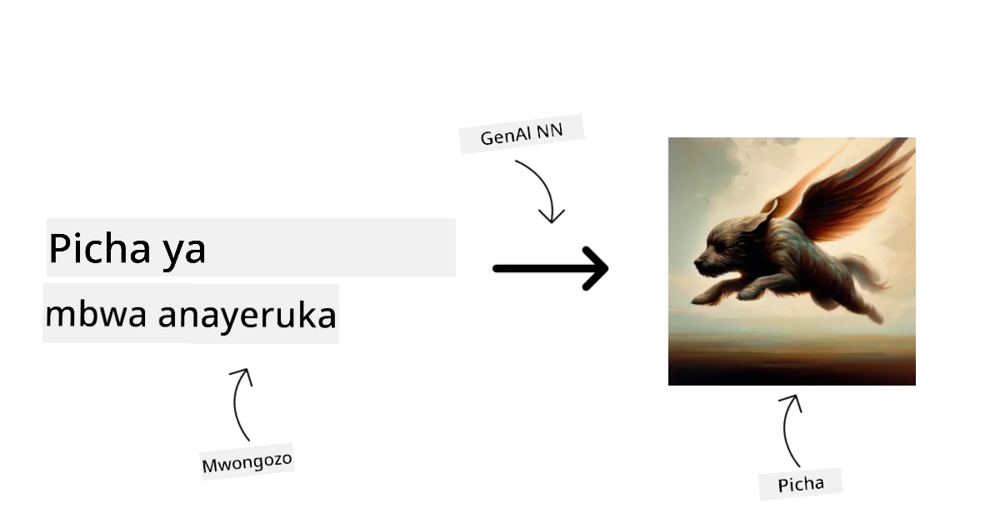

Modeli za uzalishaji wa maandishi na msimbo ni modeli zinazozalisha maandishi au msimbo. Modeli hizi mara nyingi hutumiwa kwa muhtasari wa maandishi, tafsiri, na kujibu maswali. Modeli za uzalishaji wa maandishi mara nyingi hufunzwa kwenye hifadhidata kubwa za maandishi, kama [BookCorpus](https://www.cv-foundation.org/openaccess/content_iccv_2015/html/Zhu_Aligning_Books_and_ICCV_2015_paper.html?WT.mc_id=academic-105485-koreyst), na zinaweza kutumika kuzalisha maandishi mapya, au kujibu maswali. Modeli za uzalishaji msimbo, kama [CodeParrot](https://huggingface.co/codeparrot?WT.mc_id=academic-105485-koreyst), mara nyingi hufunzwa kwenye hifadhidata kubwa za msimbo, kama GitHub, na zinaweza kutumika kuzalisha msimbo mpya, au kurekebisha makosa kwenye msimbo uliopo.

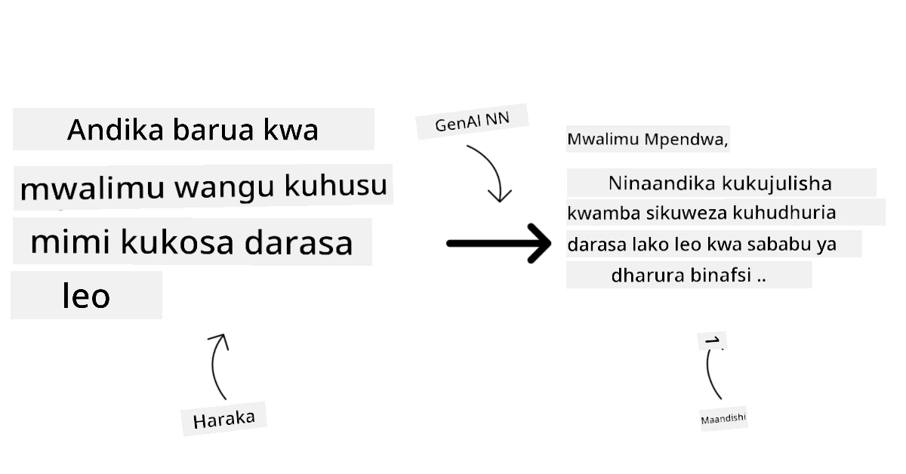

### Encoder-Decoder dhidi ya Decoder-pekee

Kuwaeleza aina tofauti za usanifu wa LLMs, tumia mfano wa kielelezo.

Fikiria meneja wako akikupa kazi ya kuandika mtihani mfupi kwa wanafunzi. Una wenzako wawili; mmoja anasimamia kuunda maudhui na mwingine anasimamia kuyakagua.

Muundaji wa maudhui ni kama modeli ya decoder-pekee: anaweza kuangalia mada, kuona kile ulichoandika tayari, kisha kuendelea kuzalisha maudhui kulingana na muktadha huo. Wana ufanisi mzuri katika kuandika maudhui yanayovutia na yenye taarifa, lakini si chaguo bora kila wakati wakati kazi ni kuainisha, kupata, au kuandika taarifa. Mifano ya familia za modeli za decoder-pekee ni pamoja na modeli za GPT na Llama.

Mkaguzi ni kama modeli ya Encoder pekee, wanaangalia kozi iliyotungwa na majibu, wakitambua uhusiano kati yao na kuelewa muktadha, lakini si mzuri kwenye uzalishaji wa maudhui. Mfano wa modeli ya Encoder pekee ni BERT.

Fikiria kwamba tuna mtu pia anaweza kuunda na kukagua mtihani, hii ni modeli ya Encoder-Decoder. Mifano ni pamoja na BART na T5.

### Huduma dhidi ya Modeli

Sasa, tuzungumze kuhusu tofauti kati ya huduma na modeli. Huduma ni bidhaa inayotolewa na Mtoa Huduma wa Wingu, na mara nyingi ni mchanganyiko wa modeli, data, na vipengele vingine. Modeli ni kiini cha huduma, na mara nyingi ni modeli ya msingi, kama LLM.

Huduma mara nyingi umeboreshwa kwa matumizi ya uzalishaji na mara nyingi ni rahisi kutumia kuliko modeli, kupitia kiolesura chenye picha. Hata hivyo, huduma si kila mara zinapatikana bure, na zinaweza kuhitaji usajili au malipo ya matumizi, kwa kubadilishana na kutumia vifaa na rasilimali za mmiliki wa huduma, kuimarisha gharama na kupanua kwa urahisi. Mfano wa huduma ni [Huduma ya Azure OpenAI](https://learn.microsoft.com/azure/ai-foundry/openai/overview?WT.mc_id=academic-105485-koreyst), inayotoa mpango wa malipo kulingana na matumizi, ikimaanisha watumiaji hutozwa kulingana na kiasi wanachotumia huduma. Huduma ya Azure OpenAI pia hutoa usalama wa kiwango cha biashara na mfumo wa AI wenye uwajibikaji juu ya uwezo wa modeli.

Modeli ni vina sacco vya mtandao wa neva: vigezo, uzito, usanifu, tokenizer, na usanidi wa msaada. Kuendesha modeli ndani ya eneo lako au mazingira binafsi kunahitaji vifaa vinavyofaa, miundombinu ya huduma, ufuatiliaji, na leseni inayolingana ya chanzo wazi/uzito wazi au leseni ya kibiashara. Modeli za uzito wazi kama Llama 4 au modeli za Mistral zinaweza kuhifadhiwa mwenyewe, lakini bado zinahitaji nguvu za kompyuta na utaalamu wa uendeshaji.

## Jinsi ya kupima na kujaribu tena modeli tofauti kuelewa utendaji katika Azure

Mara timu yetu itakapochunguza mandhari ya LLMs ya sasa na kubaini wagombea wazuri kwa matukio yao, hatua inayofuata ni kuwajaribu kwenye data zao na kwenye mzigo wao wa kazi. Huu ni mchakato unaorudiwa, unaofanywa kwa majaribio na vipimo.
Mengine ya modeli tuliyotaja katika aya zilizotangulia (modeli za OpenAI, modeli za uzito wazi kama Llama 4 na Mistral, na modeli za Hugging Face) zinapatikana katika [Microsoft Foundry Models](https://learn.microsoft.com/azure/foundry/concepts/foundry-models-overview?WT.mc_id=academic-105485-koreyst).

[Microsoft Foundry](https://learn.microsoft.com/azure/foundry/what-is-foundry?WT.mc_id=academic-105485-koreyst), hapo awali Azure AI Studio/Azure AI Foundry, ni jukwaa la Umoja la Azure kwa kujenga programu na mawakala wa AI. Husaidia watengenezaji kusimamia mzunguko wa maisha kutoka majaribio na tathmini hadi usambazaji, ufuatiliaji, na udhibiti. Katalogi ya modeli katika Microsoft Foundry huwasaidia watumiaji:

- Kupata modeli ya msingi inayovutia katika katalogi, ikiwa ni pamoja na modeli zinazouzwa na Azure na modeli kutoka kwa washirika na watoa huduma wa jamii. Watumiaji wanaweza kuchuja kwa kazi, mtoa huduma, leseni, chaguo la usambazaji, au jina.

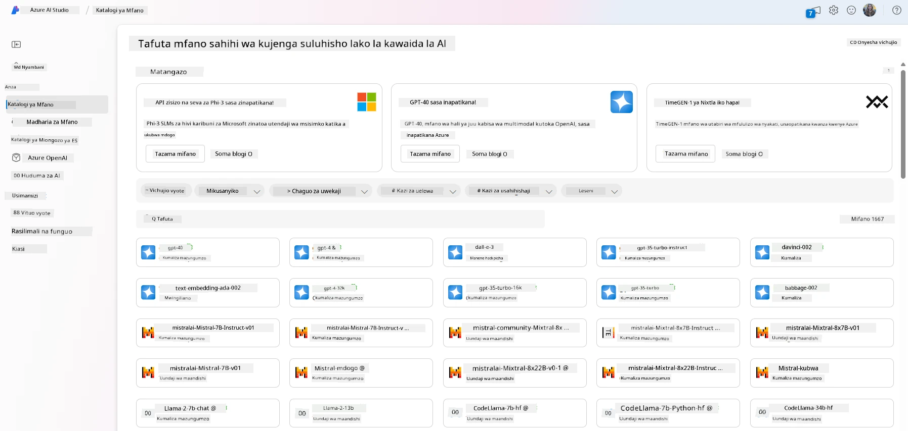

- Kagua kadi ya modeli, ikiwa ni pamoja na maelezo ya kina ya matumizi yaliyokusudiwa na data za mafunzo, sampuli za nambari na matokeo ya tathmini kwenye maktaba ya tathmini za ndani.

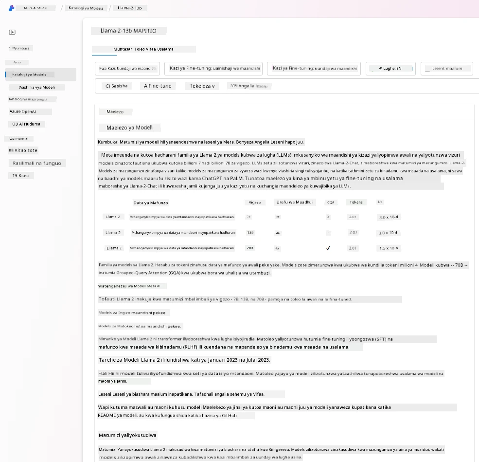

- Linganisha viwango kati ya modeli na seti za data zinazopatikana katika sekta ili kutathmini ni ipi inayokidhi hali ya biashara, kupitia dirisha la [Model Benchmarks](https://learn.microsoft.com/azure/ai-foundry/concepts/model-benchmarks?WT.mc_id=academic-105485-koreyst).

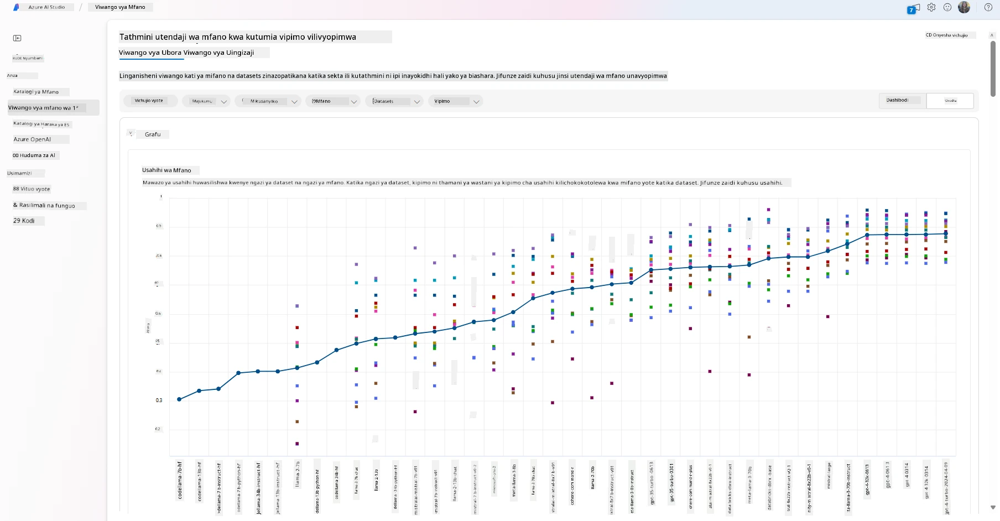

- Fanyia modeli zinazounga mkono mafunzo maalum kwa data za mafunzo za kawaida ili kuboresha utendaji wa modeli katika mzigo maalum wa kazi, ukitumia uwezo wa majaribio na ufuatiliaji wa Microsoft Foundry.

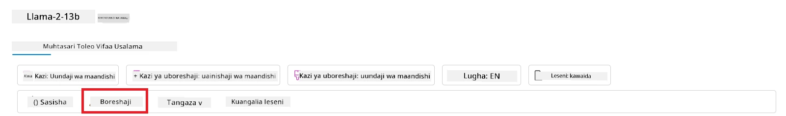

- Sambaza modeli ya awali iliyofunzwa au toleo lililobinafsishwa kwenye sehemu ya mbali ya utambuzi wa moja kwa moja, ukitumia chaguzi za hisa ulizodhibitiwa au usambazaji usio na seva, kuwezesha programu kuitumia.

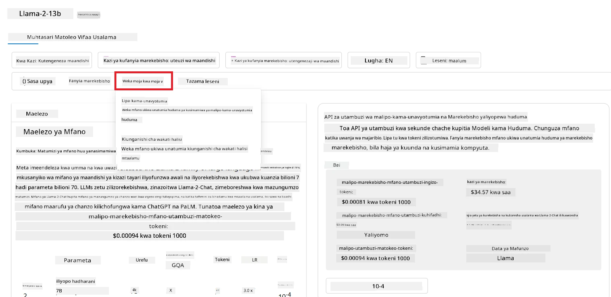

> [!NOTE]
> Sio modeli zote katika katalogi zinapatikana sasa hivi kwa mafunzo maalum na/au usambazaji wa malipo-pamoja-na-matumizi. Angalia kadi ya modeli kwa maelezo juu ya uwezo na mipaka ya modeli.

## Kuboresha Matokeo ya LLM

Tumetafiti na timu yetu ya kuanzisha aina tofauti za LLMs na jukwaa la wingu (Microsoft Foundry) linalotuwezesha kulinganisha modeli tofauti, kuzijaribu kwa data za majaribio, kuboresha utendaji, na kuzipeleka kwenye sehemu za utambuzi.

Lakini ni lini wanapaswa kuzingatia kufanyia modeli mafunzo maalum badala ya kutumia ile iliyo tayari kufunzwa? Je, kuna mbinu zingine za kuboresha utendaji wa modeli kwenye mzigo maalum wa kazi?

Kuna mbinu kadhaa biashara inaweza kutumia kupata matokeo wanayohitaji kutoka LLM. Unaweza kuchagua aina tofauti za modeli zenye viwango tofauti vya mafunzo unapotumia LLM katika uzalishaji, ukiwa na viwango tofauti vya ugumu, gharama, na ubora. Hapa kuna mbinu tofauti:

- **Uhandisi wa maelekezo kwa muktadha**. Wazo ni kutoa muktadha wa kutosha unapoelekeza ili kuhakikisha unapata majibu unayohitaji.

- **Uzalishaji ulioimarishwa kwa marejeleo, RAG**. Data yako inaweza kuwepo katika hifadhidata au sehemu ya mtandao kwa mfano, kuhakikisha data hii, au sehemu yake, inajumuishwa wakati wa kuagiza, unaweza kupata data husika na kuiweka kama sehemu ya maelekezo ya mtumiaji.

- **Modeli iliyofanyiwa mafunzo maalum**. Hapa, umefunza zaidi modeli kwa data zako mwenyewe, jambo ambalo lilipelekea modeli kuwa sahihi zaidi na ya kusaidia zaidi kulingana na mahitaji yako lakini linaweza kuwa gharama.

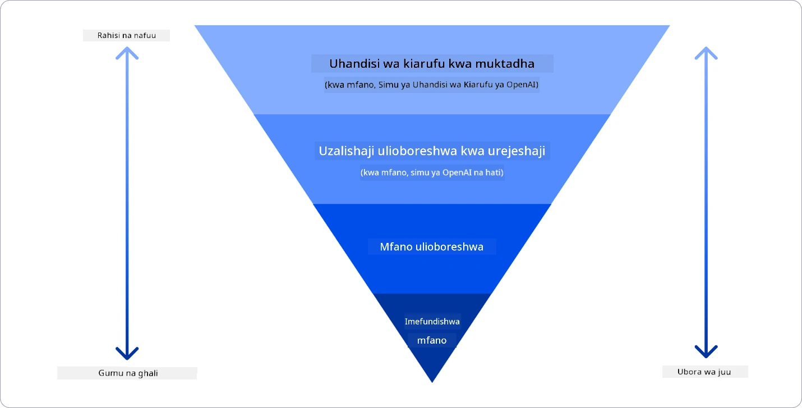

Chanzo cha picha: [Njia Nne Ambazo Makampuni Huwatumia LLMs | Fiddler AI Blog](https://www.fiddler.ai/blog/four-ways-that-enterprises-deploy-llms?WT.mc_id=academic-105485-koreyst)

### Uhandisi wa Maelekezo kwa Muktadha

LLM zilizofunzwa awali hufanya kazi vizuri sana kwenye kazi za lugha ya asili za jumla, hata kwa kuwaita kwa maelekezo mafupi, kama sentensi ya kukamilisha au swali – inayojulikana kama kujifunza “zero-shot.”

Hata hivyo, mtumiaji anapoweza kuweka undani zaidi katika swali lao, kwa ombi la kina na mifano – Muktadha – jibu litakuwa sahihi zaidi na karibu na matarajio ya mtumiaji. Katika kesi hii, tunazungumzia “one-shot” learning ikiwa maelekezo yanajumuisha mfano mmoja tu na “few-shot learning” ikiwa yanajumuisha mifano mingi.
Uhandisi wa maelekezo kwa muktadha ndio njia yenye gharama nafuu zaidi ya kuanza nayo.

### Uzalishaji Ulioboreshwa Kwa Marejeleo (RAG)

LLM zina kikomo kuwa zinaweza kutumia data tu iliyotumika wakati wa mafunzo yao kutoa jibu. Hii inamaanisha kuwa hazijui chochote kuhusu mambo yaliyojitokeza baada ya mchakato wa mafunzo, na haiwezi kupata taarifa zisizo za umma (kama data za kampuni).
Hii inaweza kushughulikiwa kupitia RAG, mbinu inayoongeza maelekezo na data za nje kwa njia ya vipande vya nyaraka, ikizingatia mipaka ya urefu wa maelekezo. Hii inaungwa mkono na zana za hifadhidata za Vector (kama [Azure Vector Search](https://learn.microsoft.com/azure/search/vector-search-overview?WT.mc_id=academic-105485-koreyst)) zinazotafuta vipande muhimu kutoka vyanzo tofauti vilivyobainishwa awali na kuongeza kwenye Muktadha wa maelekezo.

Mbinu hii ni msaada mkubwa pale biashara haina data ya kutosha, wakati wa kutosha, au rasilimali za kufanyia mafunzo maalum LLM, lakini bado inataka kuboresha utendaji wa mzigo maalum wa kazi na kupunguza hatari za majibu yanayojitokeza, yaliyotokea zamani, au yasiyoungwa mkono.

### Modeli Iliyofadhiliwa Mafunzo Maalum

Mafunzo maalum ni mchakato unaotumia kujifunza uhamisho ili ‘kubadilisha’ modeli kwa kazi ndogo au kutatua tatizo maalum. Tofauti na few-shot learning na RAG, hii husababisha mfano mpya kuzalishwa, wenye uzito na upande wa maamuzi uliosahihishwa. Inahitaji seti ya mifano ya mafunzo inayojumuisha ingizo moja (maelekezo) na matokeo yake yanayohusiana (ukamilishaji).
Hii itakuwa mbinu inayopendelewa ikiwa:

- **Kutumia modeli ndogo za kazi maalum**. Biashara ingependa kufanyia mafunzo maalum modeli ndogo kwa kazi ya kizingiti badala ya kujaribu kuanzisha mara kwa mara modeli kubwa ya mbele, na kupata suluhisho lenye gharama nafuu na la haraka.

- **Kuzingatia ucheleweshaji**. Ucheleweshaji ni muhimu kwa matumizi maalum, kwa hivyo siyo rahisi kutumia maelekezo marefu au idadi ya mifano inayotakiwa kujifunza haifai na kikomo cha urefu wa maelekezo.

- **Kubadilisha tabia imara**. Biashara ina mifano mingi ya ubora wa juu na inataka modeli ifuatilie kipindi cha shughuli, muundo wa matokeo, mtindo wa sauti, au mtindo wa sekta maalum kwa uthabiti. Ikiwa tatizo kuu ni habari mpya au maarifa ya faragha yanayobadilika mara kwa mara, tumia RAG badala ya kutegemea mafunzo maalum pekee.

### Modeli Iliyofunzwa

Kufunza LLM kutoka mwanzo ni bila shaka njia ngumu zaidi na yenye changamoto zaidi kuchukuliwa, ikihitaji kiasi kikubwa cha data, rasilimali zenye ustadi, na nguvu ya kompyuta inayofaa. Chaguo hili linapaswa kuzingatiwa tu katika hali ambayo biashara ina matumizi maalum ya sekta na kiasi kikubwa cha data inayohusiana na sekta hiyo.

## Ukaguzi wa Maarifa

Ni mbinu gani nzuri za kuboresha matokeo ya ukamilishaji wa LLM?

1. Uhandisi wa maelekezo kwa muktadha
1. RAG
1. Modeli iliyofanyiwa mafunzo maalum

J: Tatu hizi zinaweza kusaidia. Anza na uhandisi wa maelekezo na muktadha kwa maboresho ya haraka, na tumia RAG wakati modeli inahitaji taarifa za hivi karibuni au data za biashara za faragha. Chagua mafunzo maalum unapokuwa na mifano ya ubora wa juu ya kutosha na unahitaji modeli ifuatilie kwa uthabiti kazi, muundo, sauti, au mtindo wa sekta.

## 🚀 Changamoto

Soma zaidi juu ya jinsi unavyoweza [kutumia RAG](https://learn.microsoft.com/azure/search/retrieval-augmented-generation-overview?WT.mc_id=academic-105485-koreyst) kwa biashara yako.

## Kazi Nzuri, Endelea Kujifunza

Baada ya kumaliza somo hili, angalia [Mkusanyiko wa Kujifunza AI ya Kizazi](https://aka.ms/genai-collection?WT.mc_id=academic-105485-koreyst) kuendelea kuboresha maarifa yako ya AI ya Kizazi!

Nenda kwa Somo la 3 ambapo tutaangalia jinsi ya [kujenga kwa AI ya Kizazi kwa Uwajibikaji](../03-using-generative-ai-responsibly/README.md?WT.mc_id=academic-105485-koreyst)!

---

<!-- CO-OP TRANSLATOR DISCLAIMER START -->
**Kionyozo**:
Hati hii imetafsiriwa kwa kutumia huduma ya tafsiri ya AI [Co-op Translator](https://github.com/Azure/co-op-translator). Ingawa tunajitahidi kupata usahihi, tafadhali fahamu kwamba tafsiri za kiotomatiki zinaweza kuwa na makosa au upungufu wa usahihi. Hati ya asili katika lugha yake halisi inapaswa kuchukuliwa kama chanzo cha mamlaka. Kwa taarifa muhimu, tafsiri ya kitaalamu inayofanywa na binadamu inapendekezwa. Hatutojibu kwa kuelewa vibaya au tafsiri potofu zinazotokea kutokana na matumizi ya tafsiri hii.
<!-- CO-OP TRANSLATOR DISCLAIMER END -->