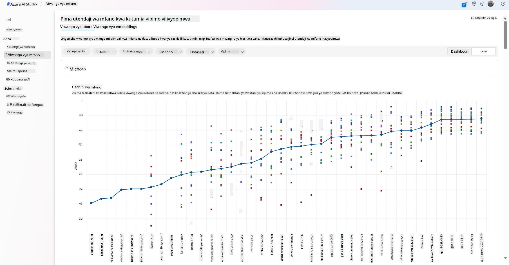
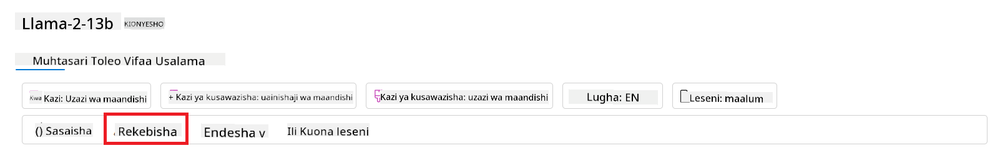
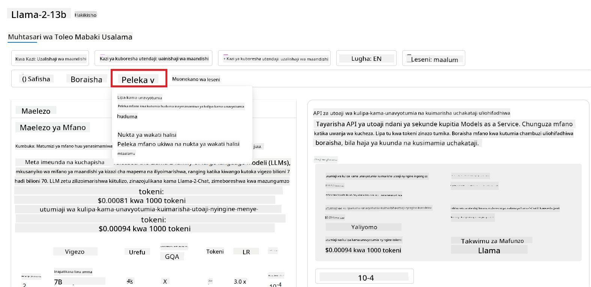
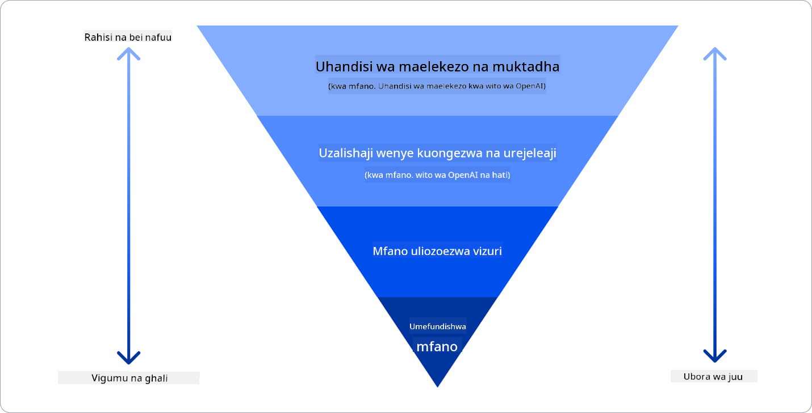

<!--
CO_OP_TRANSLATOR_METADATA:
{
  "original_hash": "e2f686f2eb794941761252ac5e8e090b",
  "translation_date": "2025-06-25T10:56:05+00:00",
  "source_file": "02-exploring-and-comparing-different-llms/README.md",
  "language_code": "sw"
}
-->
# Kuchunguza na kulinganisha LLM tofauti

> _Bonyeza picha hapo juu ili kuona video ya somo hili_

Katika somo la awali, tuliona jinsi AI inayozalisha inavyobadilisha mazingira ya teknolojia, jinsi Large Language Models (LLMs) zinavyofanya kazi, na jinsi biashara - kama vile startup yetu - inaweza kuzitumia kwa matumizi yao na kukua! Katika sura hii, tunatafuta kulinganisha na kulinganua aina tofauti za large language models (LLMs) ili kuelewa faida na hasara zao.

Hatua inayofuata katika safari ya startup yetu ni kuchunguza mazingira ya sasa ya LLMs na kuelewa ni zipi zinazofaa kwa matumizi yetu.

## Utangulizi

Somo hili litashughulikia:

- Aina tofauti za LLMs katika mazingira ya sasa.
- Kujaribu, kurudia, na kulinganisha mifano tofauti kwa matumizi yako katika Azure.
- Jinsi ya kuweka LLM.

## Malengo ya Kujifunza

Baada ya kukamilisha somo hili, utaweza:

- Kuchagua mfano sahihi kwa matumizi yako.
- Kuelewa jinsi ya kujaribu, kurudia, na kuboresha utendaji wa mfano wako.
- Kujua jinsi biashara zinavyoweka mifano.

## Kuelewa aina tofauti za LLMs

LLMs zinaweza kuwa na aina nyingi kulingana na usanifu wao, data ya mafunzo, na matumizi. Kuelewa tofauti hizi kutasaidia startup yetu kuchagua mfano sahihi kwa hali hiyo, na kuelewa jinsi ya kujaribu, kurudia, na kuboresha utendaji.

Kuna aina nyingi tofauti za mifano ya LLM, chaguo lako la mfano linategemea unachokusudia kuzitumia, data yako, kiasi gani uko tayari kulipa na zaidi.

Kutegemea kama unakusudia kutumia mifano kwa maandishi, sauti, video, uzalishaji wa picha na kadhalika, unaweza kuchagua aina tofauti ya mfano.

- **Kutambua sauti na mazungumzo**. Kwa kusudi hili, mifano ya aina ya Whisper ni chaguo nzuri kwani ni ya matumizi ya jumla na inalenga kutambua mazungumzo. Imefunzwa kwenye sauti mbalimbali na inaweza kutambua mazungumzo ya lugha nyingi. Jifunze zaidi kuhusu [mifano ya aina ya Whisper hapa](https://platform.openai.com/docs/models/whisper?WT.mc_id=academic-105485-koreyst).

- **Uzalishaji wa picha**. Kwa uzalishaji wa picha, DALL-E na Midjourney ni chaguo mbili zinazojulikana sana. DALL-E inatolewa na Azure OpenAI. [Soma zaidi kuhusu DALL-E hapa](https://platform.openai.com/docs/models/dall-e?WT.mc_id=academic-105485-koreyst) na pia katika Sura ya 9 ya mtaala huu.

- **Uzalishaji wa maandishi**. Mifano mingi imefunzwa kwenye uzalishaji wa maandishi na una chaguo nyingi kutoka GPT-3.5 hadi GPT-4. Zinakuja kwa gharama tofauti na GPT-4 ikiwa ya gharama kubwa zaidi. Inafaa kuangalia [Azure OpenAI playground](https://oai.azure.com/portal/playground?WT.mc_id=academic-105485-koreyst) kutathmini ni mifano gani inayofaa zaidi mahitaji yako kwa uwezo na gharama.

- **Multi-modality**. Ikiwa unatafuta kushughulikia aina nyingi za data katika pembejeo na matokeo, unaweza kutaka kuangalia mifano kama [gpt-4 turbo na vision au gpt-4o](https://learn.microsoft.com/azure/ai-services/openai/concepts/models#gpt-4-and-gpt-4-turbo-models?WT.mc_id=academic-105485-koreyst) - matoleo ya hivi karibuni ya mifano ya OpenAI - ambayo yana uwezo wa kuunganisha usindikaji wa lugha asilia na uelewa wa kuona, kuwezesha mwingiliano kupitia interfaces za multi-modal.

Kuchagua mfano ina maana unapata uwezo wa msingi, ambao huenda usitoshe hata hivyo. Mara nyingi una data maalum ya kampuni ambayo unahitaji kwa namna fulani kuiambia LLM kuhusu. Kuna chaguo kadhaa tofauti kuhusu jinsi ya kukabiliana na hilo, zaidi kuhusu hilo katika sehemu zijazo.

### Foundation Models dhidi ya LLMs

Neno Foundation Model lilikuwa [lilianzishwa na watafiti wa Stanford](https://arxiv.org/abs/2108.07258?WT.mc_id=academic-105485-koreyst) na kufafanuliwa kama mfano wa AI unaofuata vigezo kadhaa, kama vile:

- **Zinazofunzwa kwa kutumia ujifunzaji usio na uangalizi au ujifunzaji wa kibinafsi**, ikimaanisha zinazo funzwa kwenye data ya multi-modal isiyo na lebo, na hazihitaji upachikaji au uangalizi wa kibinadamu wa data kwa mchakato wao wa mafunzo.
- **Ni mifano kubwa sana**, inayotegemea mitandao ya neural ya kina sana iliyo funzwa kwenye mabilioni ya vigezo.
- **Kwa kawaida zinakusudiwa kutumika kama 'msingi' wa mifano mingine**, ikimaanisha zinaweza kutumika kama mwanzo wa mifano mingine kujengwa juu yake, ambayo inaweza kufanywa kwa kuboresha.

Ili kufafanua zaidi tofauti hii, hebu tuchukue ChatGPT kama mfano. Ili kujenga toleo la kwanza la ChatGPT, mfano unaoitwa GPT-3.5 ulitumika kama mfano wa msingi. Hii ina maana kwamba OpenAI ilitumia data maalum ya mazungumzo kuunda toleo lililoboreshwa la GPT-3.5 ambalo lilikuwa maalum katika kufanya vizuri katika hali za mazungumzo, kama vile chatbots.

### Mifano ya Open Source dhidi ya Proprietary

Njia nyingine ya kuweka LLMs ni ikiwa ni open source au proprietary.

Mifano ya open source ni mifano ambayo inapatikana kwa umma na inaweza kutumiwa na mtu yeyote. Mara nyingi zinatolewa na kampuni iliyoziunda, au na jamii ya utafiti. Mifano hii inaruhusiwa kukaguliwa, kurekebishwa, na kubinafsishwa kwa matumizi mbalimbali katika LLMs. Hata hivyo, hazija boreshwa daima kwa matumizi ya uzalishaji, na huenda zisifanye kazi vizuri kama mifano ya proprietary. Plus, ufadhili wa mifano ya open source unaweza kuwa mdogo, na huenda zisihifadhiwe kwa muda mrefu au zisisasishwe na utafiti wa hivi karibuni. Mifano maarufu ya open source ni pamoja na [Alpaca](https://crfm.stanford.edu/2023/03/13/alpaca.html?WT.mc_id=academic-105485-koreyst), [Bloom](https://huggingface.co/bigscience/bloom) na [LLaMA](https://llama.meta.com).

Mifano ya proprietary ni mifano inayomilikiwa na kampuni na haijatolewa kwa umma. Mifano hii mara nyingi imeboreshwa kwa matumizi ya uzalishaji. Hata hivyo, haziruhusiwi kukaguliwa, kurekebishwa, au kubinafsishwa kwa matumizi tofauti. Plus, hazipatikani daima bila malipo, na zinaweza kuhitaji usajili au malipo ili kuzitumia. Pia, watumiaji hawana udhibiti juu ya data inayotumiwa kufundisha mfano, ambayo ina maana wanapaswa kuamini mmiliki wa mfano kuhakikisha dhamira ya faragha ya data na matumizi ya AI kwa uwajibikaji. Mifano maarufu ya proprietary ni pamoja na [OpenAI models](https://platform.openai.com/docs/models/overview?WT.mc_id=academic-105485-koreyst), [Google Bard](https://sapling.ai/llm/bard?WT.mc_id=academic-105485-koreyst) au [Claude 2](https://www.anthropic.com/index/claude-2?WT.mc_id=academic-105485-koreyst).

### Embedding dhidi ya Uzalishaji wa Picha dhidi ya Uzalishaji wa Maandishi na Msimbo

LLMs zinaweza pia kuwekwa katika makundi kulingana na matokeo wanayozalisha.

Embeddings ni seti ya mifano inayoweza kubadilisha maandishi kuwa fomu ya namba, inayoitwa embedding, ambayo ni uwakilishi wa namba wa maandishi ya pembejeo. Embeddings hufanya iwe rahisi kwa mashine kuelewa uhusiano kati ya maneno au sentensi na zinaweza kutumiwa kama pembejeo na mifano mingine, kama vile mifano ya uainishaji, au mifano ya clustering ambayo ina utendaji bora kwenye data ya namba. Mifano ya embedding mara nyingi hutumiwa kwa ujifunzaji wa uhamisho, ambapo mfano unajengwa kwa kazi ya mbadala ambayo kuna wingi wa data, na kisha uzito wa mfano (embeddings) hutumiwa tena kwa kazi nyingine za chini. Mfano wa kundi hili ni [OpenAI embeddings](https://platform.openai.com/docs/models/embeddings?WT.mc_id=academic-105485-koreyst).

Mifano ya uzalishaji wa picha ni mifano inayozalisha picha. Mifano hii mara nyingi hutumiwa kwa uhariri wa picha, uzalishaji wa picha, na tafsiri ya picha. Mifano ya uzalishaji wa picha mara nyingi hufunzwa kwenye datasets kubwa za picha, kama vile [LAION-5B](https://laion.ai/blog/laion-5b/?WT.mc_id=academic-105485-koreyst), na inaweza kutumiwa kuzalisha picha mpya au kuhariri picha zilizopo kwa kutumia mbinu za inpainting, super-resolution, na colorization. Mifano ni pamoja na [DALL-E-3](https://openai.com/dall-e-3?WT.mc_id=academic-105485-koreyst) na [Stable Diffusion models](https://github.com/Stability-AI/StableDiffusion?WT.mc_id=academic-105485-koreyst).

Mifano ya uzalishaji wa maandishi na msimbo ni mifano inayozalisha maandishi au msimbo. Mifano hii mara nyingi hutumiwa kwa muhtasari wa maandishi, tafsiri, na kujibu maswali. Mifano ya uzalishaji wa maandishi mara nyingi hufunzwa kwenye datasets kubwa za maandishi, kama vile [BookCorpus](https://www.cv-foundation.org/openaccess/content_iccv_2015/html/Zhu_Aligning_Books_and_ICCV_2015_paper.html?WT.mc_id=academic-105485-koreyst), na inaweza kutumiwa kuzalisha maandishi mapya, au kujibu maswali. Mifano ya uzalishaji wa msimbo, kama [CodeParrot](https://huggingface.co/codeparrot?WT.mc_id=academic-105485-koreyst), mara nyingi hufunzwa kwenye datasets kubwa za msimbo, kama vile GitHub, na inaweza kutumiwa kuzalisha msimbo mpya, au kurekebisha makosa katika msimbo uliopo.

### Encoder-Decoder dhidi ya Decoder-only

Kuzungumzia aina tofauti za usanifu wa LLMs, hebu tutumie mfano.

Fikiria meneja wako amekupa kazi ya kuandika jaribio kwa wanafunzi. Una wenzako wawili; mmoja anasimamia kuunda maudhui na mwingine anasimamia kuyakagua.

Mwandishi wa maudhui ni kama mfano wa Decoder only, wanaweza kuangalia mada na kuona ulichokwisha andika na kisha anaweza kuandika kozi kulingana na hayo. Wana uwezo mkubwa wa kuandika maudhui yanayovutia na ya habari, lakini sio wazuri sana katika kuelewa mada na malengo ya kujifunza. Baadhi ya mifano ya Decoder ni mifano ya GPT family, kama vile GPT-3.

Mhakiki ni kama mfano wa Encoder only, wanaangalia kozi iliyoandikwa na majibu, wakiona uhusiano kati yao na kuelewa muktadha, lakini sio wazuri katika kuunda maudhui. Mfano wa Encoder only ingekuwa BERT.

Fikiria kwamba tunaweza kuwa na mtu pia ambaye anaweza kuunda na kukagua jaribio, hii ni mfano wa Encoder-Decoder. Baadhi ya mifano ingekuwa BART na T5.

### Huduma dhidi ya Mfano

Sasa, hebu tuzungumze kuhusu tofauti kati ya huduma na mfano. Huduma ni bidhaa inayotolewa na Mtoa Huduma ya Wingu, na mara nyingi ni mchanganyiko wa mifano, data, na vipengele vingine. Mfano ni kipengele cha msingi cha huduma, na mara nyingi ni mfano wa msingi, kama vile LLM.

Huduma mara nyingi zimeboreshwa kwa matumizi ya uzalishaji na mara nyingi ni rahisi kutumia kuliko mifano, kupitia interface ya mtumiaji ya kielelezo. Hata hivyo, huduma hazipatikani daima bila malipo, na zinaweza kuhitaji usajili au malipo ili kuzitumia, kwa kubadilishana kwa kutumia vifaa na rasilimali za mmiliki wa huduma, kupunguza gharama na kuongeza urahisi. Mfano wa huduma ni [Azure OpenAI Service](https://learn.microsoft.com/azure/ai-services/openai/overview?WT.mc_id=academic-105485-koreyst), ambayo inatoa mpango wa bei kulingana na matumizi, ikimaanisha watumiaji wanatozwa kulingana na kiasi gani wanatumia huduma. Pia, Azure OpenAI Service inatoa usalama wa kiwango cha biashara na mfumo wa AI kwa uwajibikaji juu ya uwezo wa mifano.

Mifano ni tu Neural Network, na vigezo, uzito, na vingine. Kuruhusu kampuni kuendesha ndani, hata hivyo, ingehitaji kununua vifaa, kujenga muundo wa kuongeza na kununua leseni au kutumia mfano wa open-source. Mfano kama LLaMA unapatikana kutumiwa, unahitaji nguvu ya kompyuta kuendesha mfano.

## Jinsi ya kujaribu na kurudia na mifano tofauti kuelewa utendaji kwenye Azure

Mara timu yetu imechunguza mazingira ya sasa ya LLMs na kutambua baadhi ya wagombea wazuri kwa hali zao, hatua inayofuata ni kuzijaribu kwenye data yao na kwenye mzigo wao wa kazi. Hii ni mchakato wa kurudia, unaofanywa kwa majaribio na vipimo.
Mifano nyingi tulizotaja katika aya za awali (OpenAI models, open source models kama Llama2, na Hugging Face transformers) zinapatikana katika [Model Catalog](https://learn.microsoft.com/azure/ai-studio/how-to/model-catalog-overview?WT.mc_id=academic-105485-koreyst) katika [Azure AI Studio](https://ai.azure.com/?WT.mc_id=academic-105485-koreyst).

[Azure AI Studio](https://learn.microsoft.com/azure/ai-studio/what-is-ai-studio?WT.mc_id=academic-105485-koreyst) ni Jukwaa la Wingu lililoundwa kwa ajili ya watengenezaji kujenga maombi ya AI yanayozalisha na kusimamia mzunguko mzima wa maendeleo - kutoka majaribio hadi tathmini - kwa kuunganisha huduma zote za Azure AI katika kituo kimoja na GUI rahisi. Model Catalog katika Azure AI Studio inamwezesha mtumiaji:

- Kupata Foundation Model ya maslahi katika katalogi - ama proprietary au open source, kwa kuchuja kwa kazi, leseni, au jina. Ili kuboresha utaftaji, mifano imepangwa katika makusanyo, kama vile Azure OpenAI collection, Hugging Face collection, na zaidi.

- Kukagua kadi ya mfano, ikijumuisha maelezo ya kina ya matumizi yaliyokusudiwa na data ya mafunzo, sampuli za msimbo na matokeo ya tathmini kwenye maktaba ya tathmini ya ndani.
- Linganisha alama za viwango kati ya mifano na seti za data zinazopatikana katika tasnia ili kutathmini ni ipi inayokidhi hali ya biashara, kupitia paneli ya [Model Benchmarks](https://learn.microsoft.com/azure/ai-studio/how-to/model-benchmarks?WT.mc_id=academic-105485-koreyst).

- Rekebisha mfano kwenye data ya mafunzo maalum ili kuboresha utendaji wa mfano katika mzigo maalum wa kazi, ukitumia uwezo wa majaribio na ufuatiliaji wa Azure AI Studio.

- Peleka mfano wa awali uliotayarishwa au toleo lililorekebishwa kwa utabiri wa wakati halisi wa mbali - kompyuta inayosimamiwa - au mwisho wa api bila seva - [kulipa kadri unavyotumia](https://learn.microsoft.com/azure/ai-studio/how-to/model-catalog-overview#model-deployment-managed-compute-and-serverless-api-pay-as-you-go?WT.mc_id=academic-105485-koreyst) - ili kuwezesha programu kuutumia.

> [!NOTE]
> Sio mifano yote katika katalogi inapatikana kwa kurekebisha na/au upelekwaji wa kulipa kadri unavyotumia kwa sasa. Angalia kadi ya mfano kwa maelezo juu ya uwezo na mipaka ya mfano.

## Kuboresha matokeo ya LLM

Tumeshirikiana na timu yetu ya kuanzisha aina tofauti za LLM na Jukwaa la Wingu (Azure Machine Learning) linalotuwezesha kulinganisha mifano tofauti, kuipima kwenye data ya mtihani, kuboresha utendaji na kuipeleka kwenye mwisho wa utabiri.

Lakini ni lini wanapaswa kuzingatia kurekebisha mfano badala ya kutumia ule uliotayarishwa awali? Je, kuna mbinu zingine za kuboresha utendaji wa mfano katika mzigo maalum wa kazi?

Kuna mbinu kadhaa ambazo biashara inaweza kutumia kupata matokeo wanayohitaji kutoka kwa LLM. Unaweza kuchagua aina tofauti za mifano na viwango tofauti vya mafunzo unapopeleka LLM katika uzalishaji, na viwango tofauti vya ugumu, gharama, na ubora. Hapa kuna mbinu tofauti:

- **Uhandisi wa prompt na muktadha**. Wazo ni kutoa muktadha wa kutosha unapotoa prompt ili kuhakikisha unapata majibu unayohitaji.

- **Utoaji ulioimarishwa wa Urejeshaji, RAG**. Data yako inaweza kuwepo kwenye hifadhidata au mwisho wa wavuti kwa mfano, ili kuhakikisha data hii, au sehemu yake, inajumuishwa wakati wa kutoa prompt, unaweza kupata data husika na kuifanya kuwa sehemu ya prompt ya mtumiaji.

- **Mfano uliorekebishwa**. Hapa, umefundisha mfano zaidi kwenye data yako mwenyewe ambayo ilisababisha mfano kuwa sahihi zaidi na msikivu kwa mahitaji yako lakini inaweza kuwa na gharama kubwa.

Chanzo cha picha: [Njia Nne ambazo Biashara Zinaweka LLMs | Fiddler AI Blog](https://www.fiddler.ai/blog/four-ways-that-enterprises-deploy-llms?WT.mc_id=academic-105485-koreyst)

### Uhandisi wa Prompt na Muktadha

LLM zilizotayarishwa awali zinafanya kazi vizuri sana katika kazi za lugha asilia zilizoenea, hata kwa kuziita na prompt fupi, kama sentensi ya kukamilisha au swali - inayoitwa "zero-shot" learning.

Hata hivyo, kadri mtumiaji anavyoweza kuunda swali lake, na ombi lililoelezwa na mifano - Muktadha - jibu litakuwa sahihi zaidi na karibu na matarajio ya mtumiaji. Katika kesi hii, tunazungumzia "one-shot" learning ikiwa prompt inajumuisha mfano mmoja tu na "few-shot learning" ikiwa inajumuisha mifano mingi.
Uhandisi wa prompt na muktadha ni mbinu ya gharama nafuu zaidi kuanza nayo.

### Utoaji Ulioimarishwa wa Urejeshaji (RAG)

LLM zina kizuizi kwamba zinaweza kutumia tu data ambayo imetumika wakati wa mafunzo yao kutoa jibu. Hii inamaanisha kwamba hazijui chochote kuhusu ukweli uliofanyika baada ya mchakato wao wa mafunzo, na haziwezi kufikia habari isiyo ya umma (kama data ya kampuni).
Hii inaweza kushindwa kupitia RAG, mbinu inayoongeza prompt na data ya nje katika mfumo wa vipande vya nyaraka, ikizingatia mipaka ya urefu wa prompt. Hii inaungwa mkono na zana za hifadhidata za Vector (kama [Azure Vector Search](https://learn.microsoft.com/azure/search/vector-search-overview?WT.mc_id=academic-105485-koreyst)) ambazo zinarejesha vipande muhimu kutoka kwa vyanzo vya data vilivyotangulia na kuviweka katika Muktadha wa prompt.

Mbinu hii ni muhimu sana wakati biashara haina data ya kutosha, muda wa kutosha, au rasilimali za kurekebisha LLM, lakini bado inataka kuboresha utendaji katika mzigo maalum wa kazi na kupunguza hatari za uzushi, yaani, kutengenezwa kwa uhalisia au maudhui yenye madhara.

### Mfano uliorekebishwa

Kurekebisha ni mchakato unaotumia mafunzo ya uhamisho ‘kurekebisha’ mfano kwa kazi ya chini au kutatua tatizo maalum. Tofauti na few-shot learning na RAG, inasababisha mfano mpya kutengenezwa, na uzani na upendeleo uliosasishwa. Inahitaji seti ya mifano ya mafunzo inayojumuisha pembejeo moja (prompt) na pato lake linalohusiana (kukamilika).
Hii ingekuwa mbinu inayopendekezwa ikiwa:

- **Kutumia mifano iliyorekebishwa**. Biashara ingependa kutumia mifano iliyorekebishwa isiyo na uwezo (kama mifano ya embedding) badala ya mifano yenye utendaji wa juu, ikisababisha suluhisho la gharama nafuu na haraka.

- **Kuzingatia latency**. Latency ni muhimu kwa kesi maalum ya matumizi, kwa hivyo haiwezekani kutumia prompt ndefu sana au idadi ya mifano ambayo inapaswa kujifunza kutoka kwa mfano haifai na kikomo cha urefu wa prompt.

- **Kujua habari za hivi karibuni**. Biashara ina data nyingi za ubora wa juu na lebo za ukweli wa msingi na rasilimali zinazohitajika kudumisha data hii kuwa ya kisasa kwa muda.

### Mfano uliofundishwa

Kufundisha LLM kutoka mwanzo bila shaka ni mbinu ngumu zaidi na ngumu zaidi ya kuchukua, inahitaji kiasi kikubwa cha data, rasilimali zenye ujuzi, na nguvu ya kompyuta inayofaa. Chaguo hili linapaswa kuzingatiwa tu katika hali ambapo biashara ina kesi ya matumizi maalum ya kikoa na kiasi kikubwa cha data ya kikoa.

## Tathmini ya maarifa

Je, ni mbinu gani nzuri ya kuboresha matokeo ya kukamilisha LLM?

1. Uhandisi wa prompt na muktadha
1. RAG
1. Mfano uliorekebishwa

A:3, ikiwa una muda na rasilimali na data ya ubora wa juu, kurekebisha ni chaguo bora kubaki na habari za hivi karibuni. Hata hivyo, ikiwa unatazamia kuboresha mambo na unakosa muda inafaa kuzingatia RAG kwanza.

## 🚀 Changamoto

Soma zaidi juu ya jinsi unavyoweza [kutumia RAG](https://learn.microsoft.com/azure/search/retrieval-augmented-generation-overview?WT.mc_id=academic-105485-koreyst) kwa biashara yako.

## Kazi Nzuri, Endelea Kujifunza

Baada ya kukamilisha somo hili, angalia [Mkusanyiko wetu wa Kujifunza AI Inayozalisha](https://aka.ms/genai-collection?WT.mc_id=academic-105485-koreyst) ili kuendelea kuongeza maarifa yako ya AI Inayozalisha!

Nenda kwenye Somo la 3 ambapo tutaangalia jinsi ya [kujenga na AI Inayozalisha kwa Uwajibikaji](../03-using-generative-ai-responsibly/README.md?WT.mc_id=academic-105485-koreyst)!

**Kanusho**:  
Hati hii imetafsiriwa kwa kutumia huduma ya tafsiri ya AI [Co-op Translator](https://github.com/Azure/co-op-translator). Ingawa tunajitahidi kwa usahihi, tafadhali fahamu kwamba tafsiri za kiotomatiki zinaweza kuwa na makosa au kutokuwa sahihi. Hati ya asili katika lugha yake ya asili inapaswa kuzingatiwa kama chanzo cha mamlaka. Kwa taarifa muhimu, tafsiri ya kitaalamu ya binadamu inapendekezwa. Hatuwajibiki kwa kutoelewana au tafsiri zisizo sahihi zinazotokana na matumizi ya tafsiri hii.