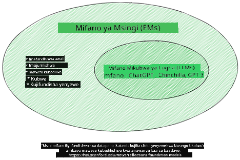
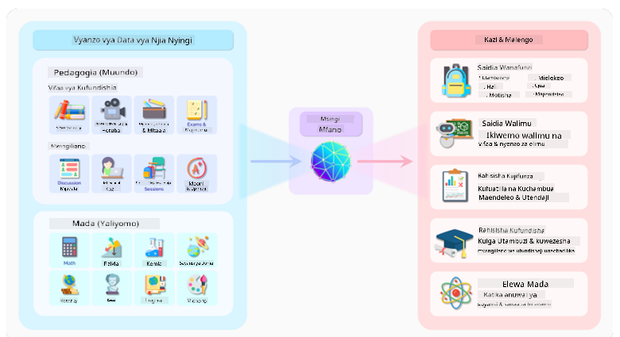
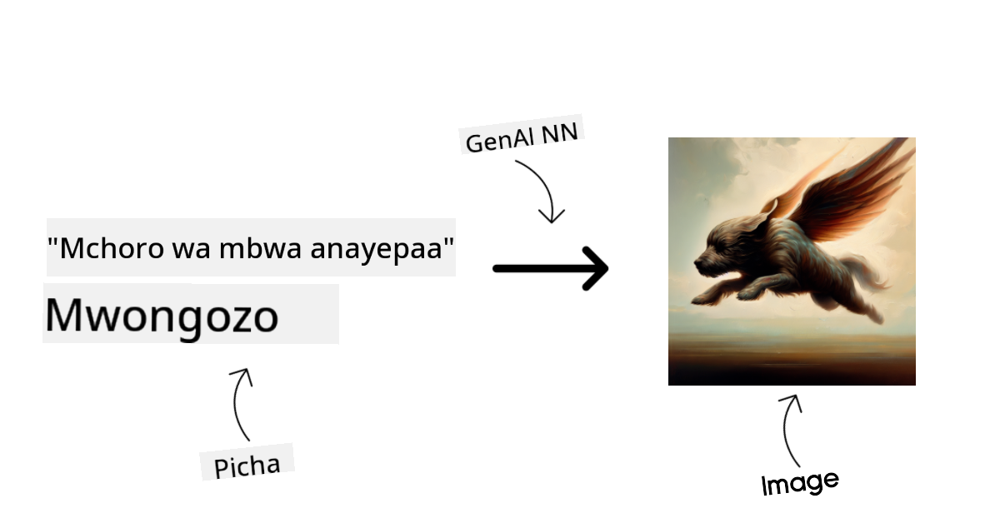
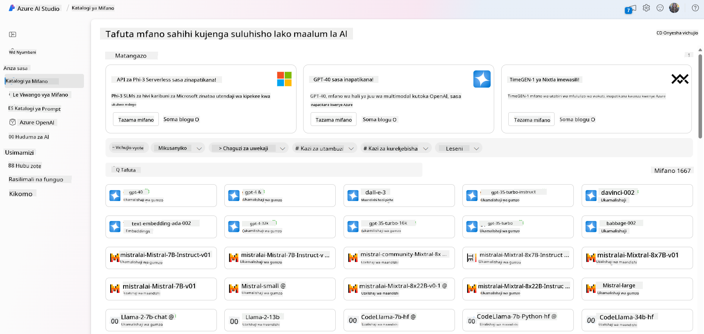
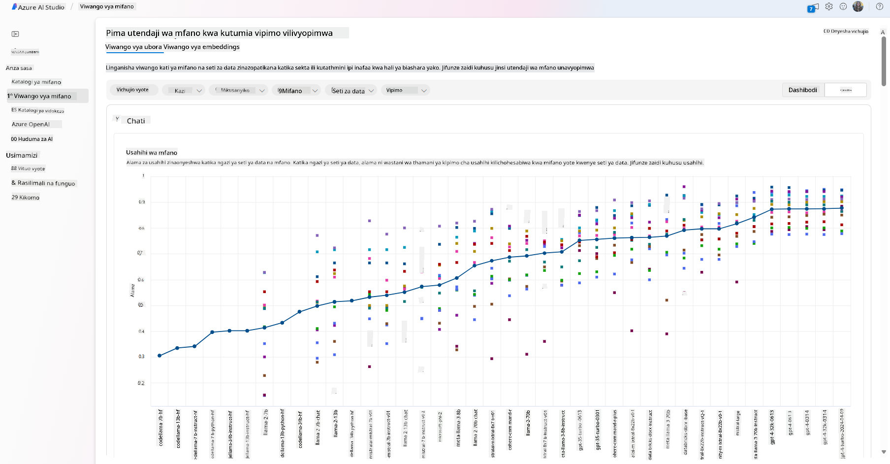
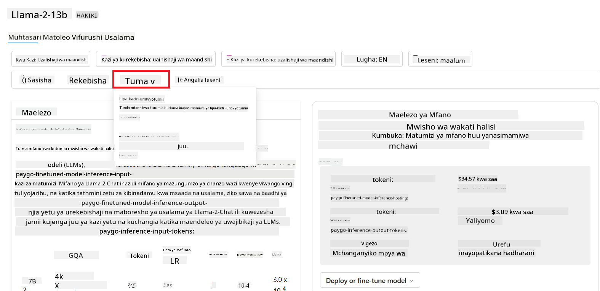

<!--
CO_OP_TRANSLATOR_METADATA:
{
  "original_hash": "e2f686f2eb794941761252ac5e8e090b",
  "translation_date": "2025-07-09T08:36:18+00:00",
  "source_file": "02-exploring-and-comparing-different-llms/README.md",
  "language_code": "sw"
}
-->
# Kuchunguza na kulinganisha aina tofauti za LLMs

> _Bonyeza picha hapo juu kutazama video ya somo hili_

Katika somo lililopita, tumeona jinsi Generative AI inavyobadilisha mazingira ya teknolojia, jinsi Large Language Models (LLMs) zinavyofanya kazi na jinsi biashara - kama startup yetu - inaweza kuzitumia kwa matumizi yao na kukua! Katika sura hii, tunatazama kulinganisha na kutofautisha aina tofauti za LLMs ili kuelewa faida na hasara zao.

Hatua inayofuata katika safari ya startup yetu ni kuchunguza mazingira ya sasa ya LLMs na kuelewa ni zipi zinazofaa kwa matumizi yetu.

## Utangulizi

Somo hili litajumuisha:

- Aina tofauti za LLMs katika mazingira ya sasa.
- Kupima, kurudia, na kulinganisha modeli tofauti kwa matumizi yako katika Azure.
- Jinsi ya kupeleka LLM.

## Malengo ya Kujifunza

Baada ya kumaliza somo hili, utaweza:

- Kuchagua modeli sahihi kwa matumizi yako.
- Kuelewa jinsi ya kupima, kurudia, na kuboresha utendaji wa modeli yako.
- Kujua jinsi biashara zinavyoweka modeli kazini.

## Elewa aina tofauti za LLMs

LLMs zinaweza kugawanywa kwa njia mbalimbali kulingana na usanifu wao, data ya mafunzo, na matumizi. Kuelewa tofauti hizi kutasaidia startup yetu kuchagua modeli inayofaa kwa hali husika, na kuelewa jinsi ya kupima, kurudia, na kuboresha utendaji.

Kuna aina nyingi tofauti za modeli za LLM, uchaguzi wako wa modeli unategemea unachotaka kuzitumia, data yako, kiasi unachotaka kulipa na zaidi.

Kulingana na kama unataka kutumia modeli kwa maandishi, sauti, video, uzalishaji wa picha na kadhalika, unaweza kuchagua aina tofauti ya modeli.

- **Utambuzi wa sauti na hotuba**. Kwa madhumuni haya, modeli za aina ya Whisper ni chaguo zuri kwa kuwa ni za matumizi ya jumla na zinalenga utambuzi wa hotuba. Zimefundishwa kwa sauti mbalimbali na zinaweza kutambua hotuba katika lugha nyingi. Jifunze zaidi kuhusu [modeli za aina ya Whisper hapa](https://platform.openai.com/docs/models/whisper?WT.mc_id=academic-105485-koreyst).

- **Uzalishaji wa picha**. Kwa uzalishaji wa picha, DALL-E na Midjourney ni chaguo maarufu sana. DALL-E inatolewa na Azure OpenAI. [Soma zaidi kuhusu DALL-E hapa](https://platform.openai.com/docs/models/dall-e?WT.mc_id=academic-105485-koreyst) na pia katika Sura ya 9 ya mtaala huu.

- **Uzalishaji wa maandishi**. Modeli nyingi zimefundishwa kwa uzalishaji wa maandishi na una chaguzi nyingi kuanzia GPT-3.5 hadi GPT-4. Zinakuja kwa gharama tofauti ambapo GPT-4 ni ghali zaidi. Inafaa kuangalia [Azure OpenAI playground](https://oai.azure.com/portal/playground?WT.mc_id=academic-105485-koreyst) ili kutathmini ni modeli gani zinafaa zaidi kwa mahitaji yako kwa upande wa uwezo na gharama.

- **Multi-modality**. Ikiwa unatafuta kushughulikia aina nyingi za data katika ingizo na matokeo, unaweza kutaka kuangalia modeli kama [gpt-4 turbo with vision au gpt-4o](https://learn.microsoft.com/azure/ai-services/openai/concepts/models#gpt-4-and-gpt-4-turbo-models?WT.mc_id=academic-105485-koreyst) - toleo la hivi karibuni la modeli za OpenAI - ambazo zina uwezo wa kuunganisha usindikaji wa lugha asilia na uelewa wa kuona, kuruhusu mwingiliano kupitia kiolesura cha multi-modal.

Kuchagua modeli kunamaanisha unapata uwezo wa msingi, ingawa huenda haukutoshi. Mara nyingi una data maalum za kampuni ambayo unahitaji kumjulisha LLM. Kuna chaguzi kadhaa za jinsi ya kushughulikia hilo, zaidi kuhusu hilo katika sehemu zinazofuata.

### Foundation Models dhidi ya LLMs

Neno Foundation Model lilianzishwa na [watafiti wa Stanford](https://arxiv.org/abs/2108.07258?WT.mc_id=academic-105485-koreyst) na linafafanuliwa kama modeli ya AI inayofuata vigezo fulani, kama vile:

- **Zimefundishwa kwa kutumia kujifunza bila usimamizi au kujifunza kwa kujisimamia**, ikimaanisha zimefundishwa kwa data isiyo na lebo ya aina mbalimbali, na hazihitaji ufafanuzi wa binadamu au kuweka lebo kwa data kwa ajili ya mchakato wa mafunzo.
- **Ni modeli kubwa sana**, zikiwa msingi wa mitandao ya neva yenye kina kirefu iliyofundishwa kwa mabilioni ya vigezo.
- **Kwa kawaida zinakusudiwa kutumika kama ‘msingi’ kwa modeli nyingine**, ikimaanisha zinaweza kutumika kama msingi wa kuanzisha modeli nyingine, ambazo zinaweza kuboreshwa kwa fine-tuning.

Chanzo cha picha: [Essential Guide to Foundation Models and Large Language Models | by Babar M Bhatti | Medium](https://thebabar.medium.com/essential-guide-to-foundation-models-and-large-language-models-27dab58f7404)

Ili kufafanua zaidi tofauti hii, tuchukue ChatGPT kama mfano. Ili kujenga toleo la kwanza la ChatGPT, modeli iitwayo GPT-3.5 ilitumika kama foundation model. Hii inamaanisha OpenAI ilitumia data maalum ya mazungumzo kuunda toleo lililobinafsishwa la GPT-3.5 lililobobea kufanya vizuri katika hali za mazungumzo, kama vile chatbots.

Chanzo cha picha: [2108.07258.pdf (arxiv.org)](https://arxiv.org/pdf/2108.07258.pdf?WT.mc_id=academic-105485-koreyst)

### Open Source dhidi ya Proprietary Models

Njia nyingine ya kugawanya LLMs ni kama ni open source au proprietary.

Modeli za open source ni zile zinazotolewa kwa umma na mtu yeyote anaweza kuzitumia. Mara nyingi hutolewa na kampuni iliyozizalisha, au jamii ya watafiti. Modeli hizi zinaruhusiwa kuchunguzwa, kubadilishwa, na kubinafsishwa kwa matumizi mbalimbali ya LLMs. Hata hivyo, si kila mara zimeboreshwa kwa matumizi ya uzalishaji, na huenda hazifanyi kazi vizuri kama modeli za proprietary. Pia, ufadhili kwa modeli za open source unaweza kuwa mdogo, na huenda hazidumishwi kwa muda mrefu au hazibadilishwi kwa utafiti wa hivi karibuni. Mifano ya modeli maarufu za open source ni pamoja na [Alpaca](https://crfm.stanford.edu/2023/03/13/alpaca.html?WT.mc_id=academic-105485-koreyst), [Bloom](https://huggingface.co/bigscience/bloom) na [LLaMA](https://llama.meta.com).

Modeli za proprietary ni zile zinazomilikiwa na kampuni na hazitolewi kwa umma. Modeli hizi mara nyingi zimeboreshwa kwa matumizi ya uzalishaji. Hata hivyo, haziruhusiwi kuchunguzwa, kubadilishwa, au kubinafsishwa kwa matumizi tofauti. Pia, si kila mara zinapatikana bure, na huenda zinahitaji usajili au malipo ya matumizi. Pia, watumiaji hawana udhibiti juu ya data inayotumika kufundisha modeli, ambayo inamaanisha wanapaswa kumtumaini mmiliki wa modeli kuhakikisha ulinzi wa data na matumizi ya AI kwa uwajibikaji. Mifano ya modeli maarufu za proprietary ni pamoja na [OpenAI models](https://platform.openai.com/docs/models/overview?WT.mc_id=academic-105485-koreyst), [Google Bard](https://sapling.ai/llm/bard?WT.mc_id=academic-105485-koreyst) au [Claude 2](https://www.anthropic.com/index/claude-2?WT.mc_id=academic-105485-koreyst).

### Embedding dhidi ya Uzalishaji wa Picha dhidi ya Uzalishaji wa Maandishi na Msimbo

LLMs pia zinaweza kugawanywa kulingana na matokeo wanayotengeneza.

Embedding ni seti ya modeli zinazoweza kubadilisha maandishi kuwa fomu ya nambari, inayoitwa embedding, ambayo ni uwakilishi wa nambari wa maandishi yaliyotolewa. Embeddings hufanya iwe rahisi kwa mashine kuelewa uhusiano kati ya maneno au sentensi na zinaweza kutumiwa kama ingizo kwa modeli nyingine, kama modeli za upangaji au za kundi ambazo zina utendaji bora kwenye data ya nambari. Modeli za embedding mara nyingi hutumika kwa transfer learning, ambapo modeli hujengwa kwa kazi mbadala yenye data nyingi, kisha uzito wa modeli (embeddings) hutumika tena kwa kazi nyingine. Mfano wa kundi hili ni [OpenAI embeddings](https://platform.openai.com/docs/models/embeddings?WT.mc_id=academic-105485-koreyst).

Modeli za uzalishaji wa picha ni zile zinazozalisha picha. Modeli hizi mara nyingi hutumika kwa uhariri wa picha, usanisi wa picha, na tafsiri ya picha. Modeli za uzalishaji wa picha mara nyingi zimefundishwa kwa seti kubwa za picha, kama [LAION-5B](https://laion.ai/blog/laion-5b/?WT.mc_id=academic-105485-koreyst), na zinaweza kutumika kuzalisha picha mpya au kuhariri picha zilizopo kwa mbinu za inpainting, super-resolution, na colorization. Mifano ni pamoja na [DALL-E-3](https://openai.com/dall-e-3?WT.mc_id=academic-105485-koreyst) na [Stable Diffusion models](https://github.com/Stability-AI/StableDiffusion?WT.mc_id=academic-105485-koreyst).

Modeli za uzalishaji wa maandishi na msimbo ni zile zinazozalisha maandishi au msimbo. Modeli hizi mara nyingi hutumika kwa muhtasari wa maandishi, tafsiri, na majibu ya maswali. Modeli za uzalishaji wa maandishi mara nyingi zimefundishwa kwa seti kubwa za maandishi, kama [BookCorpus](https://www.cv-foundation.org/openaccess/content_iccv_2015/html/Zhu_Aligning_Books_and_ICCV_2015_paper.html?WT.mc_id=academic-105485-koreyst), na zinaweza kutumika kuzalisha maandishi mapya, au kutoa majibu ya maswali. Modeli za uzalishaji wa msimbo, kama [CodeParrot](https://huggingface.co/codeparrot?WT.mc_id=academic-105485-koreyst), mara nyingi zimefundishwa kwa seti kubwa za msimbo, kama GitHub, na zinaweza kutumika kuzalisha msimbo mpya, au kurekebisha makosa katika msimbo uliopo.

### Encoder-Decoder dhidi ya Decoder-only

Kuzungumzia aina tofauti za usanifu wa LLMs, tumia mfano.

Fikiria meneja wako amekupa kazi ya kuandika mtihani wa maswali kwa wanafunzi. Una wenzako wawili; mmoja anasimamia kuunda maudhui na mwingine anasimamia kuyakagua.

Muumba wa maudhui ni kama modeli ya Decoder only, anaweza kuangalia mada na kuona uliyokuwa umeandika kisha anaweza kuandika kozi kulingana na hiyo. Wana ujuzi mzuri wa kuandika maudhui ya kuvutia na yenye taarifa, lakini si mzuri sana kuelewa mada na malengo ya kujifunza. Mifano ya modeli za Decoder ni familia ya GPT, kama GPT-3.

Mkaguzi ni kama modeli ya Encoder only, wanaangalia kozi iliyotungwa na majibu, wakigundua uhusiano kati yao na kuelewa muktadha, lakini si mzuri kuzalisha maudhui. Mfano wa modeli ya Encoder only ni BERT.

Fikiria tuna mtu ambaye anaweza kuunda na kukagua mtihani, hii ni modeli ya Encoder-Decoder. Mifano ni BART na T5.

### Huduma dhidi ya Modeli

Sasa, tuchunguze tofauti kati ya huduma na modeli. Huduma ni bidhaa inayotolewa na Mtoa Huduma wa Wingu, na mara nyingi ni mchanganyiko wa modeli, data, na vipengele vingine. Modeli ni sehemu kuu ya huduma, na mara nyingi ni foundation model, kama LLM.

Huduma mara nyingi zimeboreshwa kwa matumizi ya uzalishaji na ni rahisi kutumia kuliko modeli, kupitia kiolesura cha mtumiaji cha picha. Hata hivyo, huduma si kila mara zinapatikana bure, na huenda zinahitaji usajili au malipo ya matumizi, kwa ajili ya kutumia vifaa na rasilimali za mmiliki wa huduma, kupunguza gharama na kuongeza upanuzi kwa urahisi. Mfano wa huduma ni [Azure OpenAI Service](https://learn.microsoft.com/azure/ai-services/openai/overview?WT.mc_id=academic-105485-koreyst), ambayo hutoa mpango wa malipo kulingana na matumizi, ikimaanisha watumiaji hulipwa kulingana na kiasi wanachotumia huduma. Pia, Azure OpenAI Service hutoa usalama wa kiwango cha biashara na mfumo wa AI wenye uwajibikaji juu ya uwezo wa modeli.

Modeli ni mtandao wa neva tu, wenye vigezo, uzito, na vingine. Kuruhusu kampuni kuendesha kwa ndani, ingawa, itahitaji kununua vifaa, kujenga muundo wa upanuzi na kununua leseni au kutumia modeli ya open source. Modeli kama LLaMA inapatikana kwa matumizi, ikihitaji nguvu ya kompyuta kuendesha modeli.

## Jinsi ya kupima na kurudia na modeli tofauti kuelewa utendaji katika Azure

Mara timu yetu itakapochunguza mazingira ya sasa ya LLMs na kubaini wagombea wazuri kwa hali zao, hatua inayofuata ni kuwapima kwa data yao na mzigo wao wa kazi. Huu ni mchakato wa kurudia, unaofanywa kwa majaribio na vipimo.
Mifano mingi tuliyotaja katika aya zilizopita (mifano ya OpenAI, mifano ya chanzo huria kama Llama2, na transformers za Hugging Face) inapatikana katika [Model Catalog](https://learn.microsoft.com/azure/ai-studio/how-to/model-catalog-overview?WT.mc_id=academic-105485-koreyst) katika [Azure AI Studio](https://ai.azure.com/?WT.mc_id=academic-105485-koreyst).

[Azure AI Studio](https://learn.microsoft.com/azure/ai-studio/what-is-ai-studio?WT.mc_id=academic-105485-koreyst) ni Jukwaa la Wingu lililoundwa kwa watengenezaji kujenga programu za AI zinazozalisha na kusimamia mzunguko mzima wa maendeleo - kuanzia majaribio hadi tathmini - kwa kuunganisha huduma zote za Azure AI katika kituo kimoja chenye GUI rahisi kutumia. Model Catalog katika Azure AI Studio inamwezesha mtumiaji:

- Kupata Foundation Model anayevutia katika katalogi - iwe ni miliki au chanzo huria, kwa kuchuja kwa kazi, leseni, au jina. Ili kuboresha urahisi wa utafutaji, mifano imepangwa katika makusanyo, kama mkusanyiko wa Azure OpenAI, mkusanyiko wa Hugging Face, na mengineyo.

- Kagua kadi ya mfano, ikiwa ni pamoja na maelezo ya kina ya matumizi yaliyokusudiwa na data ya mafunzo, sampuli za msimbo na matokeo ya tathmini kwenye maktaba ya tathmini za ndani.

- Linganisha viwango vya utendaji kati ya mifano na seti za data zinazopatikana katika sekta ili kutathmini ni ipi inayokidhi hali ya biashara, kupitia dirisha la [Model Benchmarks](https://learn.microsoft.com/azure/ai-studio/how-to/model-benchmarks?WT.mc_id=academic-105485-koreyst).

- Fanya marekebisho ya kina (fine-tune) kwa mfano kwa kutumia data ya mafunzo maalum ili kuboresha utendaji wa mfano katika kazi fulani, ukitumia uwezo wa majaribio na ufuatiliaji wa Azure AI Studio.

- Sambaza mfano wa awali uliopata mafunzo au toleo lililorekebishwa kwa wakati halisi wa utambuzi wa mbali - kompyuta inayosimamiwa - au kiunganishi cha API kisicho na seva - [lipa-kama-unavyotumia](https://learn.microsoft.com/azure/ai-studio/how-to/model-catalog-overview#model-deployment-managed-compute-and-serverless-api-pay-as-you-go?WT.mc_id=academic-105485-koreyst) - ili kuwezesha programu kuutumia.

> [!NOTE]
> Sio mifano yote katika katalogi inapatikana kwa sasa kwa ajili ya marekebisho ya kina na/au usambazaji wa lipa-kama-unavyotumia. Angalia kadi ya mfano kwa maelezo kuhusu uwezo na vikwazo vya mfano.

## Kuboresha Matokeo ya LLM

Tumekuwa tukijaribu na timu yetu ya kuanzisha aina mbalimbali za LLM na Jukwaa la Wingu (Azure Machine Learning) linalotuwezesha kulinganisha mifano tofauti, kuipima kwa data ya majaribio, kuboresha utendaji na kuisambaza kwenye vituo vya utambuzi.

Lakini ni lini wanapaswa kuzingatia kufanya marekebisho ya kina kwa mfano badala ya kutumia mfano uliopata mafunzo awali? Je, kuna mbinu nyingine za kuboresha utendaji wa mfano katika kazi maalum?

Kuna mbinu kadhaa biashara inaweza kutumia kupata matokeo wanayohitaji kutoka kwa LLM. Unaweza kuchagua aina tofauti za mifano yenye viwango tofauti vya mafunzo wakati wa kusambaza LLM katika uzalishaji, zenye ngazi tofauti za ugumu, gharama, na ubora. Hapa kuna mbinu tofauti:

- **Uhandisi wa prompt kwa muktadha**. Wazo ni kutoa muktadha wa kutosha unapotoa prompt ili kuhakikisha unapata majibu unayohitaji.

- **Retrieval Augmented Generation, RAG**. Data yako inaweza kuwepo katika hifadhidata au kiunganishi cha wavuti kwa mfano, ili kuhakikisha data hii, au sehemu yake, inajumuishwa wakati wa kutoa prompt, unaweza kupata data husika na kuifanya sehemu ya prompt ya mtumiaji.

- **Mfano uliorekebishwa (fine-tuned model)**. Hapa, umefundisha mfano zaidi kwa data yako mwenyewe ambayo ilisababisha mfano kuwa sahihi zaidi na kujibu mahitaji yako lakini inaweza kuwa na gharama.

Chanzo cha picha: [Njia Nne Ambazo Biashara Zinavyosambaza LLMs | Fiddler AI Blog](https://www.fiddler.ai/blog/four-ways-that-enterprises-deploy-llms?WT.mc_id=academic-105485-koreyst)

### Uhandisi wa Prompt kwa Muktadha

LLM zilizopata mafunzo awali hufanya kazi vizuri sana kwenye kazi za lugha ya asili kwa ujumla, hata kwa kuwaita kwa prompt fupi, kama sentensi ya kukamilisha au swali – inayoitwa “zero-shot” learning.

Hata hivyo, kadri mtumiaji anavyoweza kufafanua swali lake, kwa ombi la kina na mifano – Muktadha – ndivyo jibu litakavyokuwa sahihi zaidi na karibu na matarajio ya mtumiaji. Katika kesi hii, tunazungumzia “one-shot” learning ikiwa prompt ina mfano mmoja tu na “few-shot learning” ikiwa ina mifano mingi.
Uhandisi wa prompt kwa muktadha ni njia yenye gharama nafuu zaidi kuanza nayo.

### Retrieval Augmented Generation (RAG)

LLM zina kikomo kwamba zinaweza kutumia tu data iliyotumika wakati wa mafunzo yao kutoa jibu. Hii inamaanisha kwamba hazijui chochote kuhusu matukio yaliyotokea baada ya mchakato wa mafunzo, na hawawezi kupata taarifa zisizo za umma (kama data ya kampuni).
Hii inaweza kushughulikiwa kupitia RAG, mbinu inayoongeza prompt kwa data ya nje kwa njia ya vipande vya nyaraka, ikizingatia vizingiti vya urefu wa prompt. Hii inaungwa mkono na zana za hifadhidata za Vector (kama [Azure Vector Search](https://learn.microsoft.com/azure/search/vector-search-overview?WT.mc_id=academic-105485-koreyst)) zinazopata vipande muhimu kutoka vyanzo mbalimbali vya data vilivyowekwa awali na kuviunganisha kwenye Muktadha wa prompt.

Mbinu hii ni msaada mkubwa pale biashara haina data ya kutosha, muda wa kutosha, au rasilimali za kufanya marekebisho ya kina kwa LLM, lakini bado inataka kuboresha utendaji katika kazi maalum na kupunguza hatari za uongo, yaani, kuficha ukweli au maudhui hatarishi.

### Mfano uliorekebishwa (Fine-tuned model)

Fine-tuning ni mchakato unaotumia transfer learning ‘kurekebisha’ mfano kwa kazi ya chini au kutatua tatizo maalum. Tofauti na few-shot learning na RAG, huzaa mfano mpya ulio na uzito na upendeleo uliosasishwa. Inahitaji seti ya mifano ya mafunzo yenye ingizo moja (prompt) na matokeo yake yanayohusiana (ukamilishaji).
Hii itakuwa njia inayopendekezwa ikiwa:

- **Kutumia mifano iliyorekebishwa**. Biashara ingependa kutumia mifano iliyorekebishwa isiyo na uwezo mkubwa (kama mifano ya embedding) badala ya mifano yenye utendaji wa juu, ambayo huleta suluhisho la gharama nafuu na haraka.

- **Kuzingatia ucheleweshaji (latency)**. Ucheleweshaji ni muhimu kwa matumizi maalum, hivyo haiwezekani kutumia prompt ndefu sana au idadi ya mifano ambayo inapaswa kujifunzwa na mfano haifai na kikomo cha urefu wa prompt.

- **Kuwa na taarifa za kisasa**. Biashara ina data nyingi za ubora wa juu na lebo za ukweli wa msingi pamoja na rasilimali zinazohitajika kudumisha data hii kuwa ya kisasa kwa muda mrefu.

### Mfano uliopatiwa mafunzo (Trained model)

Kufundisha LLM kutoka mwanzo ni bila shaka njia ngumu zaidi na tata zaidi ya kutumia, ikihitaji kiasi kikubwa cha data, rasilimali zenye ujuzi, na nguvu ya kompyuta inayofaa. Chaguo hili linapaswa kuzingatiwa tu pale ambapo biashara ina matumizi maalum ya sekta na kiasi kikubwa cha data inayolenga sekta hiyo.

## Mtihani wa Maarifa

Ni njia gani nzuri ya kuboresha matokeo ya ukamilishaji wa LLM?

1. Uhandisi wa prompt kwa muktadha  
1. RAG  
1. Mfano uliorekebishwa  

J:3, ikiwa una muda na rasilimali pamoja na data ya ubora wa juu, fine-tuning ni chaguo bora zaidi kudumisha taarifa za kisasa. Hata hivyo, ikiwa unatafuta kuboresha mambo na ukikosa muda, ni vyema kuzingatia RAG kwanza.

## 🚀 Changamoto

Soma zaidi kuhusu jinsi unavyoweza [kutumia RAG](https://learn.microsoft.com/azure/search/retrieval-augmented-generation-overview?WT.mc_id=academic-105485-koreyst) kwa biashara yako.

## Kazi Nzuri, Endelea Kujifunza

Baada ya kumaliza somo hili, angalia [Mkusanyiko wa Kujifunza Generative AI](https://aka.ms/genai-collection?WT.mc_id=academic-105485-koreyst) ili kuendelea kuongeza ujuzi wako wa Generative AI!

Nenda kwenye Somo la 3 ambapo tutaangalia jinsi ya [kujenga kwa Generative AI kwa Uwajibikaji](../03-using-generative-ai-responsibly/README.md?WT.mc_id=academic-105485-koreyst)!

**Kiarifu cha Kutotegemea**:  
Hati hii imetafsiriwa kwa kutumia huduma ya tafsiri ya AI [Co-op Translator](https://github.com/Azure/co-op-translator). Ingawa tunajitahidi kwa usahihi, tafadhali fahamu kwamba tafsiri za kiotomatiki zinaweza kuwa na makosa au upungufu wa usahihi. Hati ya asili katika lugha yake ya asili inapaswa kuchukuliwa kama chanzo cha mamlaka. Kwa taarifa muhimu, tafsiri ya kitaalamu inayofanywa na binadamu inapendekezwa. Hatubebei dhamana kwa kutoelewana au tafsiri potofu zinazotokana na matumizi ya tafsiri hii.