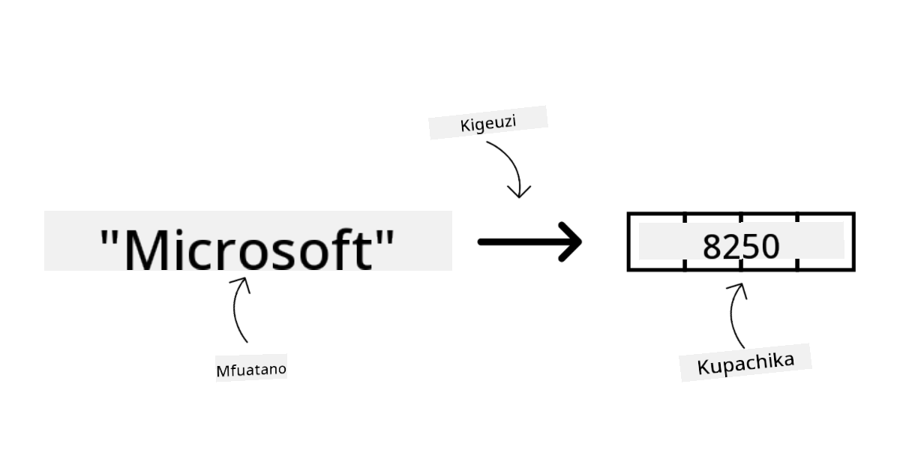
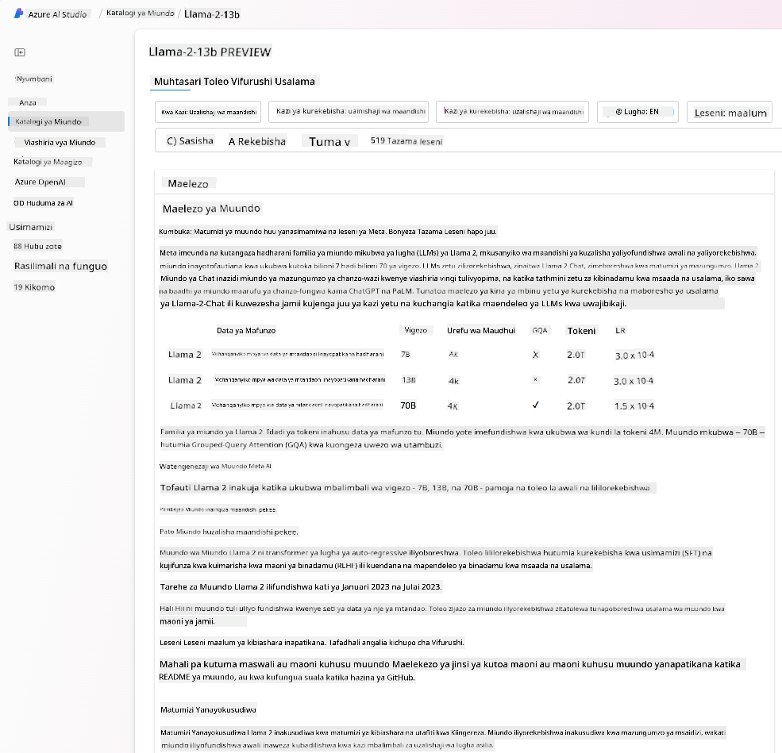

<!--
CO_OP_TRANSLATOR_METADATA:
{
  "original_hash": "6b7629b8ee4d7d874a27213e903d86a7",
  "translation_date": "2025-10-17T21:13:23+00:00",
  "source_file": "02-exploring-and-comparing-different-llms/README.md",
  "language_code": "sw"
}
-->
# Kuchunguza na kulinganisha LLM tofauti

> _Bonyeza picha hapo juu kutazama video ya somo hili_

Katika somo lililopita, tumeona jinsi AI ya kizazi inavyobadilisha taswira ya teknolojia, jinsi Large Language Models (LLMs) zinavyofanya kazi, na jinsi biashara - kama kampuni yetu ya kuanza - inaweza kuzitumia kwa matumizi yao na kukua! Katika sura hii, tunatazamia kulinganisha na kutofautisha aina tofauti za LLM ili kuelewa faida na hasara zake.

Hatua inayofuata katika safari ya kampuni yetu ya kuanza ni kuchunguza taswira ya sasa ya LLM na kuelewa ni zipi zinazofaa kwa matumizi yetu.

## Utangulizi

Somo hili litashughulikia:

- Aina tofauti za LLM katika taswira ya sasa.
- Kupima, kurudia, na kulinganisha mifano tofauti kwa matumizi yako katika Azure.
- Jinsi ya kupeleka LLM.

## Malengo ya Kujifunza

Baada ya kukamilisha somo hili, utaweza:

- Kuchagua mfano sahihi kwa matumizi yako.
- Kuelewa jinsi ya kupima, kurudia, na kuboresha utendaji wa mfano wako.
- Kujua jinsi biashara zinavyoweka mifano.

## Kuelewa aina tofauti za LLM

LLM zinaweza kuwa na makundi mbalimbali kulingana na muundo wake, data ya mafunzo, na matumizi. Kuelewa tofauti hizi kutasaidia kampuni yetu kuchagua mfano sahihi kwa hali hiyo, na kuelewa jinsi ya kupima, kurudia, na kuboresha utendaji.

Kuna aina nyingi tofauti za mifano ya LLM, chaguo lako la mfano linategemea unacholenga kutumia kwa, data yako, kiasi unachotaka kulipia na zaidi.

Kutegemea kama unalenga kutumia mifano kwa maandishi, sauti, video, uzalishaji wa picha na kadhalika, unaweza kuchagua aina tofauti ya mfano.

- **Utambuzi wa sauti na hotuba**. Kwa kusudi hili, mifano ya aina ya Whisper ni chaguo bora kwani ni ya matumizi ya jumla na inalenga utambuzi wa hotuba. Imefundishwa kwa sauti mbalimbali na inaweza kufanya utambuzi wa hotuba wa lugha nyingi. Jifunze zaidi kuhusu [mifano ya aina ya Whisper hapa](https://platform.openai.com/docs/models/whisper?WT.mc_id=academic-105485-koreyst).

- **Uzalishaji wa picha**. Kwa uzalishaji wa picha, DALL-E na Midjourney ni chaguo mbili maarufu sana. DALL-E inatolewa na Azure OpenAI. [Soma zaidi kuhusu DALL-E hapa](https://platform.openai.com/docs/models/dall-e?WT.mc_id=academic-105485-koreyst) na pia katika Sura ya 9 ya mtaala huu.

- **Uzalishaji wa maandishi**. Mifano mingi imefundishwa kwa uzalishaji wa maandishi na una chaguo nyingi kutoka GPT-3.5 hadi GPT-4. Zinakuja kwa gharama tofauti na GPT-4 ikiwa ya gharama kubwa zaidi. Inafaa kuangalia [Azure OpenAI playground](https://oai.azure.com/portal/playground?WT.mc_id=academic-105485-koreyst) kutathmini ni mifano gani inayofaa mahitaji yako kwa uwezo na gharama.

- **Multi-modality**. Ikiwa unatafuta kushughulikia aina nyingi za data katika pembejeo na matokeo, unaweza kutaka kuangalia mifano kama [gpt-4 turbo na vision au gpt-4o](https://learn.microsoft.com/azure/ai-services/openai/concepts/models#gpt-4-and-gpt-4-turbo-models?WT.mc_id=academic-105485-koreyst) - matoleo ya hivi karibuni ya mifano ya OpenAI - ambayo yana uwezo wa kuchanganya usindikaji wa lugha asilia na uelewa wa kuona, kuwezesha mwingiliano kupitia interface za multi-modal.

Kuchagua mfano inamaanisha unapata uwezo wa msingi, ambao huenda usitoshe hata hivyo. Mara nyingi una data maalum ya kampuni ambayo kwa namna fulani unahitaji kuijulisha LLM. Kuna chaguo kadhaa tofauti juu ya jinsi ya kukabiliana na hilo, zaidi juu ya hilo katika sehemu zijazo.

### Mifano ya Msingi dhidi ya LLM

Neno Mfano wa Msingi lilianzishwa na [watafiti wa Stanford](https://arxiv.org/abs/2108.07258?WT.mc_id=academic-105485-koreyst) na kufafanuliwa kama mfano wa AI unaofuata vigezo fulani, kama vile:

- **Zinapewa mafunzo kwa kutumia kujifunza bila usimamizi au kujifunza kwa kujisimamia**, ikimaanisha zinapewa mafunzo kwa data isiyo na lebo ya multi-modal, na hazihitaji maelezo ya binadamu au kuweka lebo ya data kwa mchakato wao wa mafunzo.
- **Ni mifano mikubwa sana**, inayotegemea mitandao ya neva yenye kina kirefu iliyofundishwa kwa mamilioni ya vigezo.
- **Kwa kawaida zinalenga kutumika kama ‘msingi’ wa mifano mingine**, ikimaanisha zinaweza kutumika kama msingi wa mifano mingine kujengwa juu yake, ambayo inaweza kufanywa kwa kurekebisha.

Chanzo cha picha: [Mwongozo Muhimu wa Mifano ya Msingi na LLM | na Babar M Bhatti | Medium
](https://thebabar.medium.com/essential-guide-to-foundation-models-and-large-language-models-27dab58f7404)

Ili kufafanua zaidi tofauti hii, hebu tuchukue ChatGPT kama mfano. Ili kujenga toleo la kwanza la ChatGPT, mfano uitwao GPT-3.5 ulitumika kama mfano wa msingi. Hii inamaanisha kuwa OpenAI ilitumia data maalum ya mazungumzo kuunda toleo lililorekebishwa la GPT-3.5 ambalo lilikuwa maalum kwa kufanya vizuri katika hali za mazungumzo, kama vile chatbots.

Chanzo cha picha: [2108.07258.pdf (arxiv.org)](https://arxiv.org/pdf/2108.07258.pdf?WT.mc_id=academic-105485-koreyst)

### Mifano ya Chanzo Huria dhidi ya Mifano ya Kibiashara

Njia nyingine ya kuainisha LLM ni ikiwa ni chanzo huria au ya kibiashara.

Mifano ya chanzo huria ni mifano ambayo inapatikana kwa umma na inaweza kutumiwa na yeyote. Mara nyingi hutolewa na kampuni iliyoiunda, au na jamii ya utafiti. Mifano hii inaruhusiwa kuchunguzwa, kurekebishwa, na kuboreshwa kwa matumizi mbalimbali katika LLM. Hata hivyo, hazijaboreshwa kila mara kwa matumizi ya uzalishaji, na huenda zisifanye kazi vizuri kama mifano ya kibiashara. Zaidi ya hayo, ufadhili wa mifano ya chanzo huria unaweza kuwa mdogo, na huenda zisihifadhiwe kwa muda mrefu au zisisasishwe na utafiti wa hivi karibuni. Mifano maarufu ya chanzo huria ni pamoja na [Alpaca](https://crfm.stanford.edu/2023/03/13/alpaca.html?WT.mc_id=academic-105485-koreyst), [Bloom](https://huggingface.co/bigscience/bloom) na [LLaMA](https://llama.meta.com).

Mifano ya kibiashara ni mifano inayomilikiwa na kampuni na haipatikani kwa umma. Mifano hii mara nyingi imeboreshwa kwa matumizi ya uzalishaji. Hata hivyo, haziruhusiwi kuchunguzwa, kurekebishwa, au kuboreshwa kwa matumizi tofauti. Zaidi ya hayo, hazipatikani kila mara bila malipo, na huenda zikahitaji usajili au malipo ili kutumia. Pia, watumiaji hawana udhibiti juu ya data inayotumika kufundisha mfano, ambayo inamaanisha wanapaswa kuamini mmiliki wa mfano kuhakikisha kujitolea kwa faragha ya data na matumizi ya AI kwa uwajibikaji. Mifano maarufu ya kibiashara ni pamoja na [OpenAI models](https://platform.openai.com/docs/models/overview?WT.mc_id=academic-105485-koreyst), [Google Bard](https://sapling.ai/llm/bard?WT.mc_id=academic-105485-koreyst) au [Claude 2](https://www.anthropic.com/index/claude-2?WT.mc_id=academic-105485-koreyst).

### Embedding dhidi ya Uzalishaji wa Picha dhidi ya Uzalishaji wa Maandishi na Nambari

LLM pia zinaweza kuainishwa kulingana na matokeo wanayozalisha.

Embeddings ni seti ya mifano inayoweza kubadilisha maandishi kuwa fomu ya nambari, inayoitwa embedding, ambayo ni uwakilishi wa nambari wa maandishi ya pembejeo. Embeddings hufanya iwe rahisi kwa mashine kuelewa uhusiano kati ya maneno au sentensi na inaweza kutumiwa kama pembejeo na mifano mingine, kama mifano ya uainishaji, au mifano ya clustering ambayo ina utendaji bora kwenye data ya nambari. Mifano ya embedding mara nyingi hutumiwa kwa kujifunza uhamisho, ambapo mfano hujengwa kwa kazi mbadala ambayo kuna wingi wa data, na kisha uzito wa mfano (embeddings) hutumiwa tena kwa kazi nyingine za chini. Mfano wa kategoria hii ni [OpenAI embeddings](https://platform.openai.com/docs/models/embeddings?WT.mc_id=academic-105485-koreyst).

Mifano ya uzalishaji wa picha ni mifano inayozalisha picha. Mifano hii mara nyingi hutumiwa kwa uhariri wa picha, usanisi wa picha, na tafsiri ya picha. Mifano ya uzalishaji wa picha mara nyingi hufundishwa kwa seti kubwa za data za picha, kama [LAION-5B](https://laion.ai/blog/laion-5b/?WT.mc_id=academic-105485-koreyst), na inaweza kutumika kuzalisha picha mpya au kuhariri picha zilizopo kwa mbinu za inpainting, super-resolution, na colorization. Mifano ni pamoja na [DALL-E-3](https://openai.com/dall-e-3?WT.mc_id=academic-105485-koreyst) na [Stable Diffusion models](https://github.com/Stability-AI/StableDiffusion?WT.mc_id=academic-105485-koreyst).

Mifano ya uzalishaji wa maandishi na nambari ni mifano inayozalisha maandishi au nambari. Mifano hii mara nyingi hutumiwa kwa muhtasari wa maandishi, tafsiri, na kujibu maswali. Mifano ya uzalishaji wa maandishi mara nyingi hufundishwa kwa seti kubwa za data za maandishi, kama [BookCorpus](https://www.cv-foundation.org/openaccess/content_iccv_2015/html/Zhu_Aligning_Books_and_ICCV_2015_paper.html?WT.mc_id=academic-105485-koreyst), na inaweza kutumika kuzalisha maandishi mapya, au kujibu maswali. Mifano ya uzalishaji wa nambari, kama [CodeParrot](https://huggingface.co/codeparrot?WT.mc_id=academic-105485-koreyst), mara nyingi hufundishwa kwa seti kubwa za data za nambari, kama GitHub, na inaweza kutumika kuzalisha nambari mpya, au kurekebisha hitilafu katika nambari zilizopo.

### Encoder-Decoder dhidi ya Decoder-only

Ili kuzungumzia aina tofauti za miundo ya LLM, hebu tutumie mfano.

Fikiria meneja wako amekupa kazi ya kuandika jaribio kwa wanafunzi. Una wenzako wawili; mmoja anasimamia kuunda maudhui na mwingine anasimamia kuyapitia.

Mwandishi wa maudhui ni kama mfano wa Decoder pekee, anaweza kuangalia mada na kuona ulichokwisha kuandika kisha anaweza kuandika kozi kulingana na hayo. Wana uwezo mzuri wa kuandika maudhui ya kuvutia na ya kuelimisha, lakini hawana uwezo mzuri wa kuelewa mada na malengo ya kujifunza. Baadhi ya mifano ya Decoder ni familia ya mifano ya GPT, kama GPT-3.

Mhakiki ni kama mfano wa Encoder pekee, anaangalia kozi iliyoandikwa na majibu, akiona uhusiano kati yao na kuelewa muktadha, lakini hana uwezo mzuri wa kuunda maudhui. Mfano wa Encoder pekee ni BERT.

Fikiria tunaweza kuwa na mtu pia ambaye anaweza kuunda na kupitia jaribio, huyu ni mfano wa Encoder-Decoder. Baadhi ya mifano ni BART na T5.

### Huduma dhidi ya Mfano

Sasa, hebu tuzungumzie tofauti kati ya huduma na mfano. Huduma ni bidhaa inayotolewa na Mtoa Huduma wa Wingu, na mara nyingi ni mchanganyiko wa mifano, data, na vipengele vingine. Mfano ni kipengele cha msingi cha huduma, na mara nyingi ni mfano wa msingi, kama LLM.

Huduma mara nyingi zimeboreshwa kwa matumizi ya uzalishaji na mara nyingi ni rahisi kutumia kuliko mifano, kupitia interface ya mtumiaji ya picha. Hata hivyo, huduma hazipatikani kila mara bila malipo, na huenda zikahitaji usajili au malipo ili kutumia, badala ya kutumia vifaa na rasilimali za mmiliki wa huduma, kupunguza gharama na kupanua kwa urahisi. Mfano wa huduma ni [Azure OpenAI Service](https://learn.microsoft.com/azure/ai-services/openai/overview?WT.mc_id=academic-105485-koreyst), ambayo inatoa mpango wa malipo kulingana na matumizi, ikimaanisha watumiaji wanatozwa kulingana na kiasi wanachotumia huduma. Pia, Azure OpenAI Service inatoa usalama wa daraja la biashara na mfumo wa AI wa uwajibikaji juu ya uwezo wa mifano.

Mifano ni tu Mtandao wa Neva, na vigezo, uzito, na vingine. Kuruhusu kampuni kuendesha ndani, hata hivyo, ingehitaji kununua vifaa, kujenga muundo wa kupanua na kununua leseni au kutumia mfano wa chanzo huria. Mfano kama LLaMA unapatikana kutumiwa, ukihitaji nguvu ya kompyuta kuendesha mfano.

## Jinsi ya kupima na kurudia na mifano tofauti kuelewa utendaji kwenye Azure

Mara timu yetu inapochunguza taswira ya sasa ya LLM na kutambua wagombea wazuri kwa hali zao, hatua inayofuata ni kuwapima kwenye data yao na mzigo wa kazi. Hii ni mchakato wa kurudia, unaofanywa kwa majaribio na vipimo.
Mifano mingi ya modeli tuliyotaja katika aya zilizopita (modeli za OpenAI, modeli za chanzo huria kama Llama2, na transformers za Hugging Face) zinapatikana katika [Model Catalog](https://learn.microsoft.com/azure/ai-studio/how-to/model-catalog-overview?WT.mc_id=academic-105485-koreyst) ndani ya [Azure AI Studio](https://ai.azure.com/?WT.mc_id=academic-105485-koreyst).

[Azure AI Studio](https://learn.microsoft.com/azure/ai-studio/what-is-ai-studio?WT.mc_id=academic-105485-koreyst) ni jukwaa la wingu lililoundwa kwa ajili ya watengenezaji kujenga programu za AI za kizazi na kusimamia mzunguko mzima wa maendeleo - kuanzia majaribio hadi tathmini - kwa kuunganisha huduma zote za Azure AI katika kituo kimoja chenye GUI rahisi. Katalogi ya Modeli katika Azure AI Studio inamwezesha mtumiaji:

- Kupata Modeli ya Msingi ya kuvutia katika katalogi - iwe ni ya wamiliki au chanzo huria, kwa kuchuja kulingana na kazi, leseni, au jina. Ili kuboresha utafutaji, modeli zimepangwa katika makusanyo, kama vile mkusanyiko wa Azure OpenAI, mkusanyiko wa Hugging Face, na zaidi.

- Kukagua kadi ya modeli, ikiwa ni pamoja na maelezo ya kina ya matumizi yaliyokusudiwa na data ya mafunzo, sampuli za msimbo na matokeo ya tathmini kwenye maktaba ya tathmini ya ndani.

- Kulinganisha viwango vya utendaji kati ya modeli na seti za data zinazopatikana katika sekta ili kutathmini ni ipi inayokidhi hali ya biashara, kupitia paneli ya [Model Benchmarks](https://learn.microsoft.com/azure/ai-studio/how-to/model-benchmarks?WT.mc_id=academic-105485-koreyst).

- Kuboresha modeli kwa kutumia data ya mafunzo ya kibinafsi ili kuboresha utendaji wa modeli katika mzigo maalum wa kazi, kwa kutumia uwezo wa majaribio na ufuatiliaji wa Azure AI Studio.

- Kuweka modeli ya awali iliyofunzwa au toleo lililoboreshwa kwa utabiri wa wakati halisi wa mbali - kompyuta inayosimamiwa - au mwisho wa api isiyo na seva - [kulipa kadri unavyotumia](https://learn.microsoft.com/azure/ai-studio/how-to/model-catalog-overview#model-deployment-managed-compute-and-serverless-api-pay-as-you-go?WT.mc_id=academic-105485-koreyst) - ili kuwezesha programu kuitumia.

> [!NOTE]
> Sio modeli zote katika katalogi zinapatikana kwa sasa kwa kuboreshwa na/au kuwekwa kwa kulipa kadri unavyotumia. Angalia kadi ya modeli kwa maelezo kuhusu uwezo na mipaka ya modeli.

## Kuboresha matokeo ya LLM

Tumeshirikiana na timu yetu ya kuanzisha kuchunguza aina tofauti za LLM na Jukwaa la Wingu (Azure Machine Learning) linalotuwezesha kulinganisha modeli tofauti, kuzitathmini kwa data ya majaribio, kuboresha utendaji na kuzitumia kwenye vituo vya utabiri.

Lakini ni lini wanapaswa kuzingatia kuboresha modeli badala ya kutumia ile iliyofunzwa tayari? Je, kuna njia nyingine za kuboresha utendaji wa modeli katika mzigo maalum wa kazi?

Kuna njia kadhaa biashara inaweza kutumia kupata matokeo wanayohitaji kutoka kwa LLM. Unaweza kuchagua aina tofauti za modeli zenye viwango tofauti vya mafunzo wakati wa kuweka LLM katika uzalishaji, na viwango tofauti vya ugumu, gharama, na ubora. Hapa kuna njia tofauti:

- **Uhandisi wa maelekezo na muktadha**. Wazo ni kutoa muktadha wa kutosha wakati wa kutoa maelekezo ili kuhakikisha unapata majibu unayohitaji.

- **Uzalishaji Ulioimarishwa na Urejeshaji, RAG**. Data yako inaweza kuwepo katika hifadhidata au mwisho wa wavuti kwa mfano, ili kuhakikisha data hii, au sehemu yake, inajumuishwa wakati wa kutoa maelekezo, unaweza kuchukua data husika na kuifanya kuwa sehemu ya maelekezo ya mtumiaji.

- **Modeli iliyoboreshwa**. Hapa, unafundisha modeli zaidi kwa data yako mwenyewe ambayo husababisha modeli kuwa sahihi zaidi na kujibu mahitaji yako lakini inaweza kuwa ghali.

Chanzo cha picha: [Four Ways that Enterprises Deploy LLMs | Fiddler AI Blog](https://www.fiddler.ai/blog/four-ways-that-enterprises-deploy-llms?WT.mc_id=academic-105485-koreyst)

### Uhandisi wa Maelekezo na Muktadha

LLM zilizofunzwa tayari hufanya kazi vizuri sana katika kazi za lugha asilia za jumla, hata kwa kuzitumia na maelekezo mafupi, kama sentensi ya kukamilisha au swali – inayoitwa “ujifunzaji wa sifuri.”

Hata hivyo, kadri mtumiaji anavyoweza kuunda swali lake, kwa ombi la kina na mifano – Muktadha – ndivyo jibu litakavyokuwa sahihi zaidi na karibu na matarajio ya mtumiaji. Katika kesi hii, tunazungumzia “ujifunzaji wa mara moja” ikiwa maelekezo yanajumuisha mfano mmoja tu na “ujifunzaji wa mifano michache” ikiwa yanajumuisha mifano mingi.
Uhandisi wa maelekezo na muktadha ni njia ya gharama nafuu zaidi kuanza nayo.

### Uzalishaji Ulioimarishwa na Urejeshaji (RAG)

LLM zina kikwazo kwamba zinaweza kutumia tu data ambayo imetumika wakati wa mafunzo yao kutoa jibu. Hii inamaanisha kuwa hawajui chochote kuhusu ukweli uliofanyika baada ya mchakato wao wa mafunzo, na hawawezi kufikia taarifa zisizo za umma (kama data ya kampuni).
Hili linaweza kushughulikiwa kupitia RAG, mbinu inayoongeza maelekezo kwa data ya nje kwa njia ya vipande vya nyaraka, ikizingatia mipaka ya urefu wa maelekezo. Hii inaungwa mkono na zana za hifadhidata ya Vector (kama [Azure Vector Search](https://learn.microsoft.com/azure/search/vector-search-overview?WT.mc_id=academic-105485-koreyst)) ambazo hurejesha vipande muhimu kutoka kwa vyanzo vya data vilivyotangulia na kuviweka katika Muktadha wa maelekezo.

Mbinu hii ni muhimu sana wakati biashara haina data ya kutosha, muda wa kutosha, au rasilimali za kuboresha LLM, lakini bado inataka kuboresha utendaji katika mzigo maalum wa kazi na kupunguza hatari za uzushi, yaani, kupotosha ukweli au maudhui yenye madhara.

### Modeli iliyoboreshwa

Kuboresha modeli ni mchakato unaotumia ujifunzaji wa uhamisho ‘kurekebisha’ modeli kwa kazi ya chini au kutatua tatizo maalum. Tofauti na ujifunzaji wa mifano michache na RAG, husababisha modeli mpya kuundwa, yenye uzito na upendeleo uliosasishwa. Inahitaji seti ya mifano ya mafunzo inayojumuisha pembejeo moja (maelekezo) na matokeo yake yanayohusiana (ukamilishaji).
Hii itakuwa njia inayopendekezwa ikiwa:

- **Kutumia modeli zilizoboreshwa**. Biashara ingependa kutumia modeli zilizoboreshwa zenye uwezo mdogo (kama modeli za embedding) badala ya modeli zenye utendaji wa juu, na kusababisha suluhisho la gharama nafuu na la haraka.

- **Kuzingatia ucheleweshaji**. Ucheleweshaji ni muhimu kwa kesi maalum ya matumizi, kwa hivyo haiwezekani kutumia maelekezo marefu sana au idadi ya mifano ambayo inapaswa kujifunzwa kutoka kwa modeli haifai na kikomo cha urefu wa maelekezo.

- **Kuwa na taarifa za kisasa**. Biashara ina data nyingi za hali ya juu na lebo za ukweli wa msingi na rasilimali zinazohitajika kudumisha data hii kuwa ya kisasa kwa muda.

### Modeli iliyofunzwa

Kufundisha LLM kutoka mwanzo bila shaka ni njia ngumu zaidi na yenye changamoto kubwa ya kuchukua, ikihitaji kiasi kikubwa cha data, rasilimali zenye ujuzi, na nguvu ya kompyuta inayofaa. Chaguo hili linapaswa kuzingatiwa tu katika hali ambapo biashara ina kesi ya matumizi maalum ya uwanja na kiasi kikubwa cha data inayohusiana na uwanja huo.

## Ukaguzi wa Maarifa

Je, ni njia gani nzuri ya kuboresha matokeo ya ukamilishaji wa LLM?

1. Uhandisi wa maelekezo na muktadha  
1. RAG  
1. Modeli iliyoboreshwa  

A:3, ikiwa una muda na rasilimali pamoja na data ya hali ya juu, kuboresha ni chaguo bora kubaki na taarifa za kisasa. Hata hivyo, ikiwa unatafuta kuboresha mambo na huna muda, inafaa kuzingatia RAG kwanza.

## 🚀 Changamoto

Soma zaidi kuhusu jinsi unavyoweza [kutumia RAG](https://learn.microsoft.com/azure/search/retrieval-augmented-generation-overview?WT.mc_id=academic-105485-koreyst) kwa biashara yako.

## Kazi Nzuri, Endelea Kujifunza

Baada ya kukamilisha somo hili, angalia [Mkusanyiko wa Kujifunza AI ya Kizazi](https://aka.ms/genai-collection?WT.mc_id=academic-105485-koreyst) ili kuendelea kuongeza maarifa yako ya AI ya Kizazi!

Nenda kwenye Somo la 3 ambapo tutatazama jinsi ya [kujenga na AI ya Kizazi kwa Uwajibikaji](../03-using-generative-ai-responsibly/README.md?WT.mc_id=academic-105485-koreyst)!

---

**Kanusho**:  
Hati hii imetafsiriwa kwa kutumia huduma ya tafsiri ya AI [Co-op Translator](https://github.com/Azure/co-op-translator). Ingawa tunajitahidi kwa usahihi, tafadhali fahamu kuwa tafsiri za kiotomatiki zinaweza kuwa na makosa au kutokuwa sahihi. Hati ya asili katika lugha yake ya awali inapaswa kuzingatiwa kama chanzo cha mamlaka. Kwa taarifa muhimu, tafsiri ya kitaalamu ya binadamu inapendekezwa. Hatutawajibika kwa kutoelewana au tafsiri zisizo sahihi zinazotokana na matumizi ya tafsiri hii.