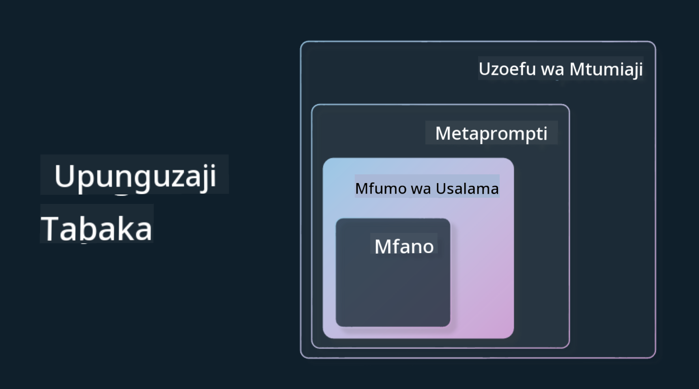

<!--
CO_OP_TRANSLATOR_METADATA:
{
  "original_hash": "4d57fad773cbeb69c5dd62e65c34200d",
  "translation_date": "2025-10-17T21:11:54+00:00",
  "source_file": "03-using-generative-ai-responsibly/README.md",
  "language_code": "sw"
}
-->
# Kutumia AI ya Kizazi kwa Uwajibikaji

> _Bonyeza picha hapo juu kutazama video ya somo hili_

Ni rahisi kuvutiwa na AI, hasa AI ya kizazi, lakini unapaswa kuzingatia jinsi ya kuitumia kwa uwajibikaji. Unapaswa kufikiria mambo kama kuhakikisha matokeo ni ya haki, yasiyo na madhara, na zaidi. Sura hii inalenga kukupa muktadha uliotajwa, mambo ya kuzingatia, na jinsi ya kuchukua hatua za kuboresha matumizi yako ya AI.

## Utangulizi

Somo hili litashughulikia:

- Kwa nini unapaswa kuzingatia AI ya Uwajibikaji unapojenga programu za AI ya Kizazi.
- Kanuni kuu za AI ya Uwajibikaji na jinsi zinavyohusiana na AI ya Kizazi.
- Jinsi ya kuweka kanuni hizi za AI ya Uwajibikaji katika vitendo kupitia mikakati na zana.

## Malengo ya Kujifunza

Baada ya kukamilisha somo hili utajua:

- Umuhimu wa AI ya Uwajibikaji unapojenga programu za AI ya Kizazi.
- Wakati wa kufikiria na kutumia kanuni kuu za AI ya Uwajibikaji unapojenga programu za AI ya Kizazi.
- Zana na mikakati inayopatikana kwako kuweka dhana ya AI ya Uwajibikaji katika vitendo.

## Kanuni za AI ya Uwajibikaji

Shauku ya AI ya Kizazi haijawahi kuwa juu zaidi. Shauku hii imeleta waendelezaji wapya wengi, umakini, na ufadhili katika eneo hili. Ingawa hili ni jambo chanya sana kwa yeyote anayetarajia kujenga bidhaa na kampuni zinazotumia AI ya Kizazi, ni muhimu pia tuendelee kwa uwajibikaji.

Katika kozi hii, tunazingatia kujenga kampuni yetu ya kuanzisha na bidhaa yetu ya elimu ya AI. Tutatumia kanuni za AI ya Uwajibikaji: Haki, Ujumuishi, Uaminifu/Usalama, Usalama na Faragha, Uwazi, na Uwajibikaji. Kwa kanuni hizi, tutachunguza jinsi zinavyohusiana na matumizi yetu ya AI ya Kizazi katika bidhaa zetu.

## Kwa Nini Unapaswa Kutoa Kipaumbele kwa AI ya Uwajibikaji

Unapojenga bidhaa, kuchukua mtazamo unaozingatia binadamu kwa kuweka maslahi bora ya mtumiaji wako akilini huleta matokeo bora.

Unyenyekevu wa AI ya Kizazi ni uwezo wake wa kuunda majibu ya msaada, taarifa, mwongozo, na maudhui kwa watumiaji. Hili linaweza kufanyika bila hatua nyingi za mwongozo, jambo ambalo linaweza kuleta matokeo ya kuvutia sana. Bila mipango na mikakati sahihi, inaweza pia kwa bahati mbaya kusababisha matokeo mabaya kwa watumiaji wako, bidhaa yako, na jamii kwa ujumla.

Hebu tuangalie baadhi (lakini si yote) ya matokeo haya yanayoweza kuwa mabaya:

### Uhalisia wa Kifedha

Uhalisia wa kifedha ni neno linalotumika kuelezea wakati LLM inazalisha maudhui ambayo ni ya kipuuzi kabisa au kitu ambacho tunajua ni makosa ya ukweli kulingana na vyanzo vingine vya taarifa.

Hebu tuchukue mfano tunajenga kipengele kwa kampuni yetu ya kuanzisha kinachoruhusu wanafunzi kuuliza maswali ya kihistoria kwa modeli. Mwanafunzi anauliza swali `Nani alikuwa ocusalia pekee wa Titanic?`

Modeli inazalisha jibu kama lile lililo hapa chini:

> _(Chanzo: [Flying bisons](https://flyingbisons.com?WT.mc_id=academic-105485-koreyst))_

Hili ni jibu la kujiamini sana na la kina. Kwa bahati mbaya, ni makosa. Hata kwa utafiti mdogo, mtu angegundua kulikuwa na zaidi ya ocusalia mmoja wa janga la Titanic. Kwa mwanafunzi ambaye anaanza tu kuchunguza mada hii, jibu hili linaweza kuwa la kushawishi vya kutosha kutoulizwa na kutendewa kama ukweli. Matokeo ya hili yanaweza kusababisha mfumo wa AI kutokuwa wa kuaminika na kuathiri vibaya sifa ya kampuni yetu ya kuanzisha.

Kwa kila toleo la modeli yoyote ya LLM, tumeona maboresho ya utendaji kuhusu kupunguza uhalisia wa kifedha. Hata na maboresho haya, sisi kama waendelezaji wa programu na watumiaji bado tunapaswa kuwa waangalifu kuhusu mapungufu haya.

### Maudhui Yenye Madhara

Tulizungumzia katika sehemu ya awali wakati LLM inazalisha majibu yasiyo sahihi au ya kipuuzi. Hatari nyingine tunapaswa kuwa waangalifu nayo ni wakati modeli inajibu kwa maudhui yenye madhara.

Maudhui yenye madhara yanaweza kufafanuliwa kama:

- Kutoa maelekezo au kuhimiza kujidhuru au madhara kwa makundi fulani.
- Maudhui ya chuki au ya kudhalilisha.
- Kuongoza mipango ya aina yoyote ya shambulio au vitendo vya vurugu.
- Kutoa maelekezo ya jinsi ya kupata maudhui haramu au kufanya vitendo haramu.
- Kuonyesha maudhui ya wazi ya kingono.

Kwa kampuni yetu ya kuanzisha, tunataka kuhakikisha tuna zana na mikakati sahihi mahali pa kuzuia aina hii ya maudhui kuonekana kwa wanafunzi.

### Ukosefu wa Haki

Haki inafafanuliwa kama “kuhakikisha kwamba mfumo wa AI hauna upendeleo na ubaguzi na kwamba unawatendea kila mtu kwa haki na usawa.” Katika ulimwengu wa AI ya Kizazi, tunataka kuhakikisha kwamba mitazamo ya kutengwa ya makundi yaliyotengwa hayaimarishwi na matokeo ya modeli.

Aina hizi za matokeo si tu zinaharibu kujenga uzoefu mzuri wa bidhaa kwa watumiaji wetu, lakini pia husababisha madhara zaidi ya kijamii. Kama waendelezaji wa programu, tunapaswa kila wakati kuweka msingi mpana na wa watumiaji mbalimbali akilini tunapojenga suluhisho na AI ya Kizazi.

## Jinsi ya Kutumia AI ya Kizazi kwa Uwajibikaji

Sasa kwa kuwa tumetambua umuhimu wa AI ya Kizazi ya Uwajibikaji, hebu tuangalie hatua 4 tunazoweza kuchukua kujenga suluhisho zetu za AI kwa uwajibikaji:

### Kupima Madhara Yanayoweza Kutokea

Katika upimaji wa programu, tunapima vitendo vinavyotarajiwa vya mtumiaji kwenye programu. Vivyo hivyo, kupima seti mbalimbali za maoni ambayo watumiaji wanaweza kutumia ni njia nzuri ya kupima madhara yanayoweza kutokea.

Kwa kuwa kampuni yetu ya kuanzisha inajenga bidhaa ya elimu, itakuwa vizuri kuandaa orodha ya maoni yanayohusiana na elimu. Hii inaweza kuwa ya kufunika somo fulani, ukweli wa kihistoria, na maoni kuhusu maisha ya wanafunzi.

### Kupunguza Madhara Yanayoweza Kutokea

Sasa ni wakati wa kutafuta njia za kuzuia au kupunguza madhara yanayoweza kusababishwa na modeli na majibu yake. Tunaweza kuangalia hili katika tabaka 4 tofauti:

- **Modeli**. Kuchagua modeli sahihi kwa matumizi sahihi. Modeli kubwa na ngumu zaidi kama GPT-4 zinaweza kusababisha hatari zaidi ya maudhui yenye madhara zinapotumika kwa matumizi madogo na maalum. Kutumia data yako ya mafunzo kuboresha pia hupunguza hatari ya maudhui yenye madhara.

- **Mfumo wa Usalama**. Mfumo wa usalama ni seti ya zana na usanidi kwenye jukwaa linalohudumia modeli ambalo husaidia kupunguza madhara. Mfano wa hili ni mfumo wa kuchuja maudhui kwenye huduma ya Azure OpenAI. Mifumo inapaswa pia kugundua mashambulio ya jailbreak na shughuli zisizotakiwa kama maombi kutoka kwa bots.

- **Metaprompt**. Metaprompt na msingi ni njia tunazoweza kuelekeza au kupunguza modeli kulingana na tabia fulani na taarifa. Hii inaweza kuwa kutumia pembejeo za mfumo kufafanua mipaka fulani ya modeli. Aidha, kutoa matokeo yanayohusiana zaidi na upeo au uwanja wa mfumo.

Inaweza pia kuwa kutumia mbinu kama Retrieval Augmented Generation (RAG) ili modeli ichukue taarifa tu kutoka kwa uteuzi wa vyanzo vinavyoaminika. Kuna somo baadaye katika kozi hii kwa [kujenga programu za utafutaji](../08-building-search-applications/README.md?WT.mc_id=academic-105485-koreyst)

- **Uzoefu wa Mtumiaji**. Tabaka la mwisho ni pale mtumiaji anaposhirikiana moja kwa moja na modeli kupitia kiolesura cha programu yetu kwa njia fulani. Kwa njia hii tunaweza kubuni UI/UX ili kupunguza mtumiaji juu ya aina za pembejeo wanazoweza kutuma kwa modeli pamoja na maandishi au picha zinazoonyeshwa kwa mtumiaji. Wakati wa kupeleka programu ya AI, pia tunapaswa kuwa wazi kuhusu kile programu yetu ya AI ya Kizazi inaweza na haiwezi kufanya.

Tuna somo zima lililojitolea kwa [Kubuni UX kwa Programu za AI](../12-designing-ux-for-ai-applications/README.md?WT.mc_id=academic-105485-koreyst)

- **Kutathmini modeli**. Kufanya kazi na LLMs kunaweza kuwa changamoto kwa sababu hatuwezi kila wakati kudhibiti data ambayo modeli ilifundishwa nayo. Hata hivyo, tunapaswa kila wakati kutathmini utendaji wa modeli na matokeo yake. Ni muhimu bado kupima usahihi wa modeli, usawa, msingi, na umuhimu wa matokeo. Hii husaidia kutoa uwazi na uaminifu kwa wadau na watumiaji.

### Kuendesha Suluhisho la AI ya Kizazi la Uwajibikaji

Kujenga mazoezi ya kiutendaji kuzunguka programu zako za AI ni hatua ya mwisho. Hii inajumuisha kushirikiana na sehemu nyingine za kampuni yetu ya kuanzisha kama Sheria na Usalama ili kuhakikisha tunazingatia sera zote za udhibiti. Kabla ya kuzindua, tunataka pia kujenga mipango kuhusu utoaji, kushughulikia matukio, na kurudisha nyuma ili kuzuia madhara yoyote kwa watumiaji wetu kutoka kukua.

## Zana

Ingawa kazi ya kuendeleza suluhisho za AI ya Uwajibikaji inaweza kuonekana kuwa nyingi, ni kazi inayostahili juhudi. Kadri eneo la AI ya Kizazi linavyokua, zana zaidi za kusaidia waendelezaji kuunganisha uwajibikaji kwa ufanisi katika mtiririko wao wa kazi zitakomaa. Kwa mfano, [Azure AI Content Safety](https://learn.microsoft.com/azure/ai-services/content-safety/overview?WT.mc_id=academic-105485-koreyst) inaweza kusaidia kugundua maudhui yenye madhara na picha kupitia ombi la API.

## Ukaguzi wa Maarifa

Ni mambo gani unapaswa kujali ili kuhakikisha matumizi ya AI kwa uwajibikaji?

1. Kwamba jibu ni sahihi.
1. Matumizi yenye madhara, kwamba AI haitumiki kwa madhumuni ya uhalifu.
1. Kuhakikisha AI haina upendeleo na ubaguzi.

A: 2 na 3 ni sahihi. AI ya Uwajibikaji inakusaidia kufikiria jinsi ya kupunguza athari mbaya na upendeleo na zaidi.

## 🚀 Changamoto

Soma kuhusu [Azure AI Content Safety](https://learn.microsoft.com/azure/ai-services/content-safety/overview?WT.mc_id=academic-105485-koreyst) na uone ni nini unaweza kupitisha kwa matumizi yako.

## Kazi Nzuri, Endelea Kujifunza

Baada ya kukamilisha somo hili, angalia [Mkusanyiko wa Kujifunza AI ya Kizazi](https://aka.ms/genai-collection?WT.mc_id=academic-105485-koreyst) ili kuendelea kuongeza maarifa yako ya AI ya Kizazi!

Nenda kwenye Somo la 4 ambapo tutatazama [Misingi ya Uhandisi wa Maoni](../04-prompt-engineering-fundamentals/README.md?WT.mc_id=academic-105485-koreyst)!

---

**Kanusho**:  
Hati hii imetafsiriwa kwa kutumia huduma ya tafsiri ya AI [Co-op Translator](https://github.com/Azure/co-op-translator). Ingawa tunajitahidi kwa usahihi, tafadhali fahamu kuwa tafsiri za kiotomatiki zinaweza kuwa na makosa au kutokuwa sahihi. Hati ya asili katika lugha yake ya kiasili inapaswa kuzingatiwa kama chanzo cha mamlaka. Kwa taarifa muhimu, tafsiri ya kitaalamu ya binadamu inapendekezwa. Hatutawajibika kwa kutoelewana au tafsiri zisizo sahihi zinazotokana na matumizi ya tafsiri hii.