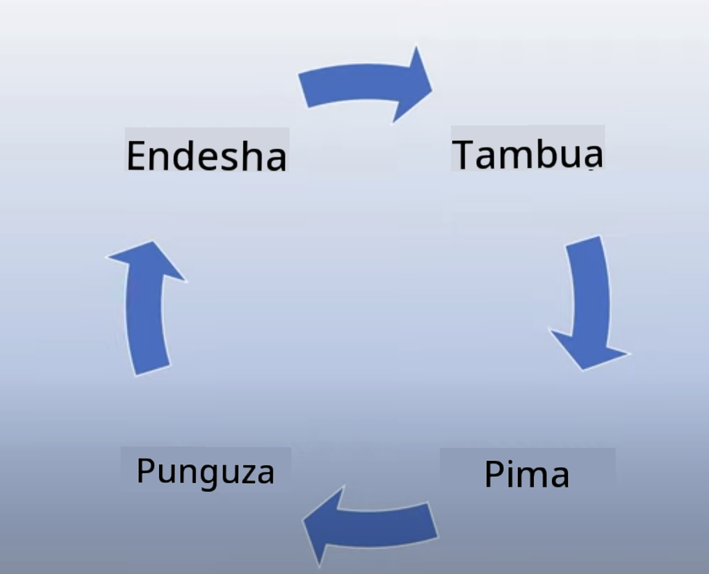

<!--
CO_OP_TRANSLATOR_METADATA:
{
  "original_hash": "7f8f4c11f8c1cb6e1794442dead414ea",
  "translation_date": "2025-07-09T09:01:13+00:00",
  "source_file": "03-using-generative-ai-responsibly/README.md",
  "language_code": "sw"
}
-->
# Kutumia Generative AI kwa Uwajibikaji

> _Bonyeza picha hapo juu kutazama video ya somo hili_

Ni rahisi kuvutiwa na AI na hasa Generative AI, lakini unahitaji kuzingatia jinsi ya kuitumia kwa uwajibikaji. Unahitaji kuzingatia mambo kama kuhakikisha matokeo ni ya haki, hayadhuru, na mengineyo. Sura hii inalenga kukupa muktadha uliotajwa, mambo ya kuzingatia, na jinsi ya kuchukua hatua madhubuti kuboresha matumizi yako ya AI.

## Utangulizi

Somo hili litajumuisha:

- Kwa nini unapaswa kuipa kipaumbele AI yenye Uwajibikaji unapoanzisha programu za Generative AI.
- Kanuni kuu za AI yenye Uwajibikaji na jinsi zinavyohusiana na Generative AI.
- Jinsi ya kuweka kanuni hizi za AI yenye Uwajibikaji katika vitendo kupitia mikakati na zana.

## Malengo ya Kujifunza

Baada ya kumaliza somo hili utajua:

- Umuhimu wa AI yenye Uwajibikaji unapoanzisha programu za Generative AI.
- Wakati wa kufikiria na kutumia kanuni kuu za AI yenye Uwajibikaji unapoanzisha programu za Generative AI.
- Zana na mikakati inayopatikana kwako kuweka dhana ya AI yenye Uwajibikaji katika vitendo.

## Kanuni za AI yenye Uwajibikaji

Msisimko wa Generative AI haujawahi kuwa mkubwa hivi. Msisimko huu umeleta waendelezaji wengi wapya, umakini, na ufadhili katika eneo hili. Ingawa hili ni jambo zuri kwa yeyote anayetaka kuunda bidhaa na makampuni kwa kutumia Generative AI, pia ni muhimu tuendelee kwa uwajibikaji.

Katika kozi hii, tunazingatia kujenga startup yetu na bidhaa yetu ya elimu ya AI. Tutatumia kanuni za AI yenye Uwajibikaji: Haki, Ushirikishwaji, Uaminifu/Usalama, Usalama & Faragha, Uwazi na Uwajibikaji. Kwa kanuni hizi, tutaangalia jinsi zinavyohusiana na matumizi yetu ya Generative AI katika bidhaa zetu.

## Kwa Nini Unapaswa Kuipa Kipaumbele AI yenye Uwajibikaji

Unapoanzisha bidhaa, kuchukua mtazamo unaoweka maslahi bora ya mtumiaji wako mbele huleta matokeo bora zaidi.

Kipengele cha kipekee cha Generative AI ni uwezo wake wa kutoa majibu yenye msaada, taarifa, mwongozo, na maudhui kwa watumiaji. Hii inaweza kufanyika bila hatua nyingi za mikono ambazo zinaweza kuleta matokeo ya kushangaza. Bila mipango na mikakati sahihi, inaweza pia kusababisha matokeo mabaya kwa watumiaji wako, bidhaa yako, na jamii kwa ujumla.

Tuchunguze baadhi ya matokeo haya yanayoweza kusababisha madhara (lakini si yote):

### Halusinasheni

Halusinasheni ni neno linalotumika kuelezea wakati LLM inazalisha maudhui ambayo ni ya kupotosha kabisa au tunajua ni makosa kulingana na vyanzo vingine vya taarifa.

Tuchukue mfano tunapojenga kipengele kwa startup yetu kinachowezesha wanafunzi kuuliza maswali ya kihistoria kwa mfano. Mwanafunzi anauliza swali `Nani alikuwa mmojawapo aliyekufa kwenye Titanic?`

Mfano unatoa jibu kama hili hapa chini:

> _(Chanzo: [Flying bisons](https://flyingbisons.com?WT.mc_id=academic-105485-koreyst))_

Huu ni jibu lenye kujiamini na kinaeleweka vizuri. Kwa bahati mbaya, si sahihi. Hata kwa utafiti mdogo, mtu angegundua kulikuwa na waokolewa zaidi ya mmoja katika ajali ya Titanic. Kwa mwanafunzi anayeanza tu kufanya utafiti juu ya mada hii, jibu hili linaweza kumshawishi asilie na kuchukuliwa kama ukweli. Matokeo yake yanaweza kufanya mfumo wa AI usiwe wa kuaminika na kuathiri vibaya sifa ya startup yetu.

Kwa kila toleo jipya la LLM yoyote, tumeshuhudia maboresho ya utendaji katika kupunguza halusinasheni. Hata na maboresho haya, sisi kama waendelezaji wa programu na watumiaji bado tunapaswa kuwa makini na mipaka hii.

### Maudhui Yanayoweza Kusababisha Madhara

Tulijadili katika sehemu ya awali wakati LLM inazalisha majibu yasiyo sahihi au ya kupotosha. Hatari nyingine tunayopaswa kuzingatia ni wakati mfano unajibu kwa maudhui yanayoweza kusababisha madhara.

Maudhui yanayoweza kusababisha madhara yanaweza kufafanuliwa kama:

- Kutoa maelekezo au kuhamasisha kujiua au kuumiza makundi fulani.
- Maudhui ya chuki au ya kudhalilisha.
- Kuongoza mipango ya aina yoyote ya shambulio au matendo ya vurugu.
- Kutoa maelekezo ya jinsi ya kupata maudhui haramu au kufanya matendo haramu.
- Kuonyesha maudhui ya ngono waziwazi.

Kwa startup yetu, tunataka kuhakikisha tuna zana na mikakati sahihi ili kuzuia aina hii ya maudhui kuonekana na wanafunzi.

### Ukosefu wa Haki

Haki inafafanuliwa kama “kuhakikisha mfumo wa AI haujumuishi upendeleo au ubaguzi na unawatendea watu wote kwa usawa na haki.” Katika ulimwengu wa Generative AI, tunataka kuhakikisha kuwa mitazamo ya dunia inayotengwa ya makundi yaliyotengwa haisaidiiwa na matokeo ya mfano.

Aina hizi za matokeo si tu zinaharibu ujenzi wa uzoefu mzuri wa bidhaa kwa watumiaji wetu, bali pia husababisha madhara zaidi kwa jamii. Kama waendelezaji wa programu, tunapaswa kila mara kuzingatia msingi mpana na tofauti wa watumiaji tunapojenga suluhisho kwa kutumia Generative AI.

## Jinsi ya Kutumia Generative AI kwa Uwajibikaji

Sasa tumebaini umuhimu wa Generative AI yenye Uwajibikaji, tazama hatua 4 tunazoweza kuchukua kujenga suluhisho zetu za AI kwa uwajibikaji:

### Pima Madhara Yanayoweza Kutokea

Katika upimaji wa programu, tunapima matendo yanayotarajiwa ya mtumiaji kwenye programu. Vivyo hivyo, kupima seti mbalimbali za maelekezo ambayo watumiaji wana uwezekano mkubwa wa kutumia ni njia nzuri ya kupima madhara yanayoweza kutokea.

Kwa kuwa startup yetu inajenga bidhaa ya elimu, itakuwa vyema kuandaa orodha ya maelekezo yanayohusiana na elimu. Hii inaweza kuwa kwa kufunika somo fulani, ukweli wa kihistoria, na maelekezo kuhusu maisha ya mwanafunzi.

### Zuia Madhara Yanayoweza Kutokea

Sasa ni wakati wa kutafuta njia za kuzuia au kupunguza madhara yanayoweza kusababishwa na mfano na majibu yake. Tunaweza kuangalia hili kwa tabaka 4 tofauti:

- **Mfano**. Kuchagua mfano sahihi kwa matumizi sahihi. Mifano mikubwa na tata kama GPT-4 inaweza kusababisha hatari zaidi ya maudhui yanayoweza kusababisha madhara inapotekelezwa kwa matumizi madogo na maalum. Kutumia data yako ya mafunzo kurekebisha mfano pia hupunguza hatari ya maudhui yanayoweza kusababisha madhara.

- **Mfumo wa Usalama**. Mfumo wa usalama ni seti ya zana na usanidi kwenye jukwaa linalohudumia mfano zinazosaidia kupunguza madhara. Mfano wa hili ni mfumo wa kuchuja maudhui kwenye huduma ya Azure OpenAI. Mifumo pia inapaswa kugundua mashambulio ya jailbreak na shughuli zisizotakikana kama maombi kutoka kwa bots.

- **Metaprompt**. Metaprompt na kuweka msingi ni njia tunazoweza kuelekeza au kupunguza mfano kulingana na tabia na taarifa fulani. Hii inaweza kuwa kutumia ingizo za mfumo kufafanua mipaka fulani ya mfano. Zaidi ya hayo, kutoa matokeo yanayohusiana zaidi na wigo au eneo la mfumo.

Pia inaweza kuwa kutumia mbinu kama Retrieval Augmented Generation (RAG) ili mfano uchukue taarifa kutoka kwa vyanzo vinavyoaminika tu. Kuna somo baadaye katika kozi hii kuhusu [kujenga programu za utafutaji](../08-building-search-applications/README.md?WT.mc_id=academic-105485-koreyst)

- **Uzoefu wa Mtumiaji**. Tabaka la mwisho ni pale mtumiaji anaposhirikiana moja kwa moja na mfano kupitia kiolesura cha programu yetu kwa njia fulani. Kwa njia hii tunaweza kubuni UI/UX ili kumzuia mtumiaji aina za maingizo anazoweza kutuma kwa mfano pamoja na maandishi au picha zinazowasilishwa kwa mtumiaji. Tunapoweka programu ya AI, pia lazima tuwe wazi kuhusu kile programu yetu ya Generative AI inaweza na haiwezi kufanya.

Tuna somo zima lililojikita katika [Kubuni UX kwa Programu za AI](../12-designing-ux-for-ai-applications/README.md?WT.mc_id=academic-105485-koreyst)

- **Tathmini mfano**. Kufanya kazi na LLM kunaweza kuwa changamoto kwa sababu hatuna udhibiti kila mara juu ya data ambayo mfano ulifundishwa nayo. Hata hivyo, tunapaswa kila mara kutathmini utendaji na matokeo ya mfano. Ni muhimu kupima usahihi wa mfano, ufananishi, msingi, na uhusiano wa matokeo. Hii husaidia kutoa uwazi na kuaminika kwa washikadau na watumiaji.

### Endesha Suluhisho la Generative AI lenye Uwajibikaji

Kujenga utaratibu wa uendeshaji unaozunguka programu zako za AI ni hatua ya mwisho. Hii inajumuisha kushirikiana na sehemu nyingine za startup yetu kama Idara ya Sheria na Usalama kuhakikisha tunazingatia sera zote za udhibiti. Kabla ya kuzindua, pia tunataka kuandaa mipango kuhusu utoaji, kushughulikia matukio, na kurejesha hali ya awali ili kuzuia madhara yoyote kwa watumiaji wetu kuongezeka.

## Zana

Ingawa kazi ya kuendeleza suluhisho za AI yenye Uwajibikaji inaweza kuonekana kuwa nyingi, ni kazi inayostahili juhudi. Kadiri eneo la Generative AI linavyokua, zana zaidi za kusaidia waendelezaji kuingiza uwajibikaji kwa ufanisi katika mchakato wao zitakua. Kwa mfano, [Azure AI Content Safety](https://learn.microsoft.com/azure/ai-services/content-safety/overview?WT.mc_id=academic-105485-koreyst) inaweza kusaidia kugundua maudhui na picha zinazoweza kusababisha madhara kupitia ombi la API.

## Jaribio la Maarifa

Ni mambo gani unayopaswa kuyazingatia kuhakikisha matumizi ya AI yenye uwajibikaji?

1. Kwamba jibu ni sahihi.
1. Matumizi yanayoweza kusababisha madhara, kwamba AI haitumiki kwa madhumuni ya uhalifu.
1. Kuhakikisha AI haina upendeleo na ubaguzi.

J: 2 na 3 ni sahihi. AI yenye Uwajibikaji inakusaidia kuzingatia jinsi ya kupunguza madhara na upendeleo na mengineyo.

## 🚀 Changamoto

Soma kuhusu [Azure AI Content Safety](https://learn.microsoft.com/azure/ai-services/content-safety/overview?WT.mc_id=academic-105485-koreyst) na angalia ni nini unaweza kuutumia kwa matumizi yako.

## Kazi Nzuri, Endelea Kujifunza

Baada ya kumaliza somo hili, tembelea [Mkusanyiko wa Kujifunza Generative AI](https://aka.ms/genai-collection?WT.mc_id=academic-105485-koreyst) kuendelea kuongeza ujuzi wako wa Generative AI!

Nenda kwenye Somo la 4 ambapo tutaangalia [Misingi ya Uhandisi wa Prompt](../04-prompt-engineering-fundamentals/README.md?WT.mc_id=academic-105485-koreyst)!

**Kiarifu cha Kutotegemea**:  
Hati hii imetafsiriwa kwa kutumia huduma ya tafsiri ya AI [Co-op Translator](https://github.com/Azure/co-op-translator). Ingawa tunajitahidi kwa usahihi, tafadhali fahamu kwamba tafsiri za kiotomatiki zinaweza kuwa na makosa au upungufu wa usahihi. Hati ya asili katika lugha yake ya asili inapaswa kuchukuliwa kama chanzo cha mamlaka. Kwa taarifa muhimu, tafsiri ya kitaalamu inayofanywa na binadamu inashauriwa. Hatuna dhamana kwa kutoelewana au tafsiri potofu zinazotokana na matumizi ya tafsiri hii.