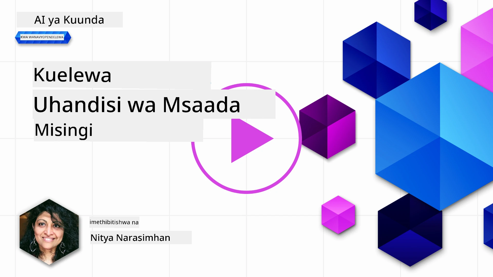
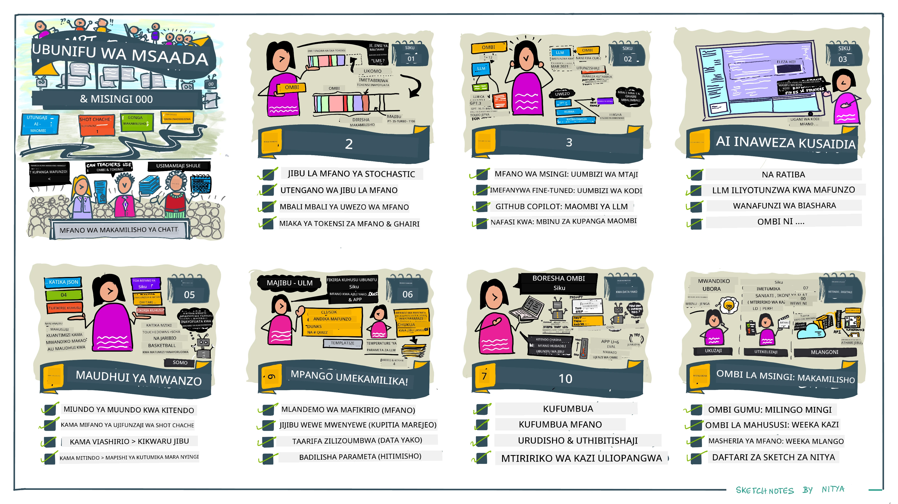
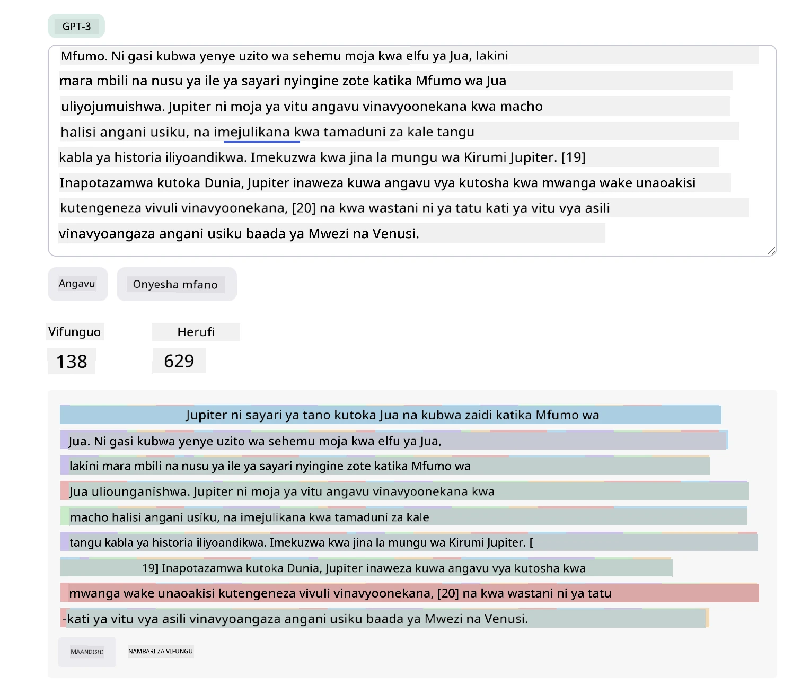
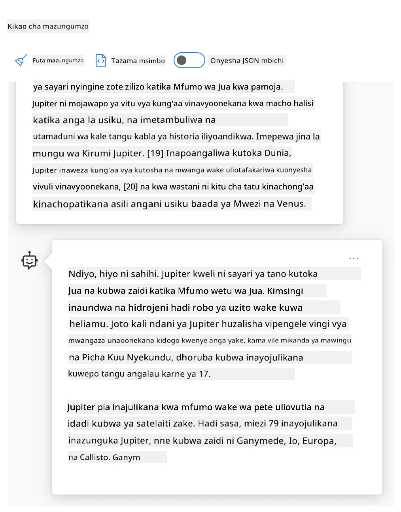
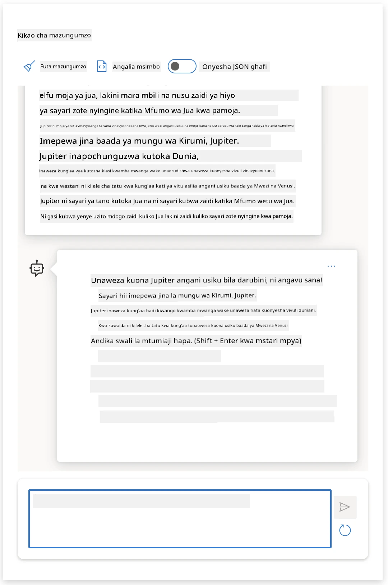
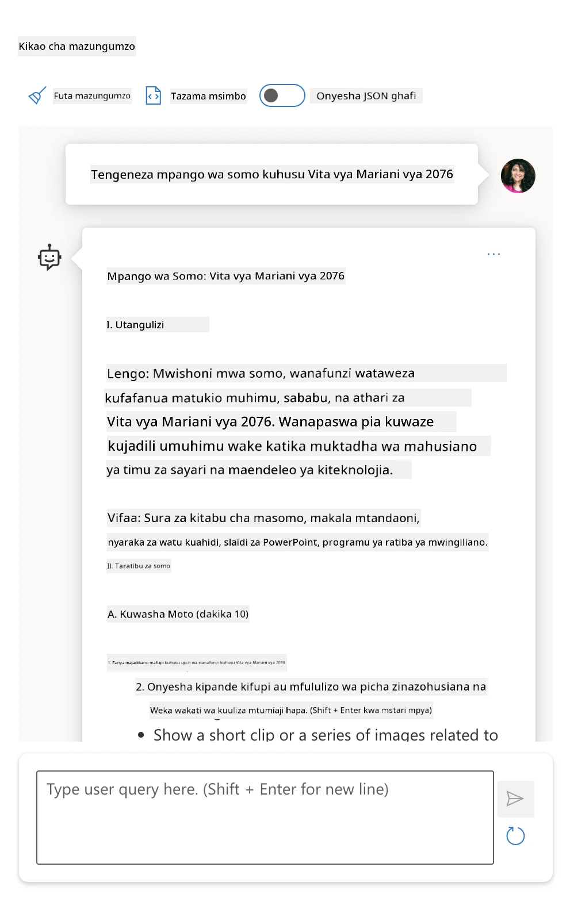
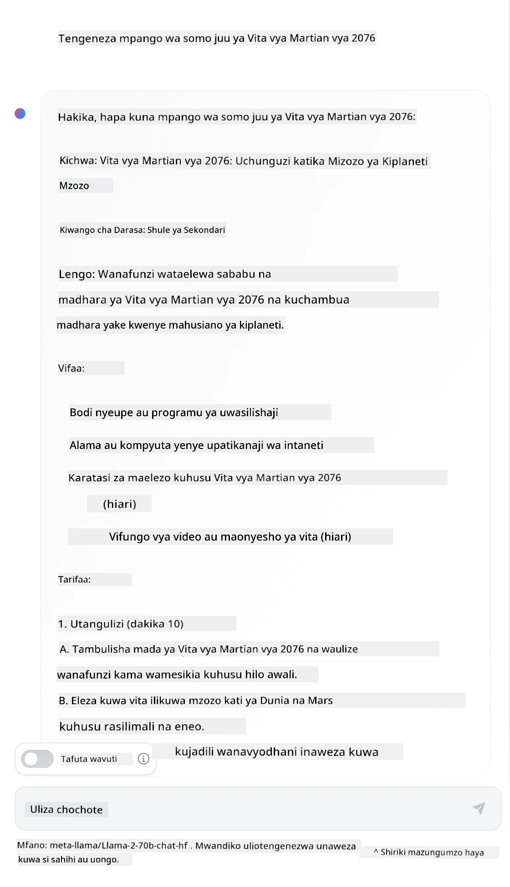

# Misingi ya Ufundi wa Kuunda Maagizo

[](https://youtu.be/GElCu2kUlRs?si=qrXsBvXnCW12epb8)

## Utangulizi  
Moduli hii inashughulikia dhana muhimu na mbinu za kutengeneza maagizo madhubuti katika mifano ya AI inayotengeneza maudhui. Njia unavyoandika agizo lako kwa LLM ni muhimu pia. Agizo lililoundwa kwa uangalifu linaweza kupata majibu bora zaidi. Lakini maana halisi ya maneno kama _agizo_ na _ufundi wa kuunda maagizo_ ni nini? Na ni vipi ninaweza kuboresha _kiingilio_ cha agizo ninachotuma kwa LLM? Haya ni maswali tutayajibu katika sura hii na ijayo.

_AI inayotengeneza maudhui_ ina uwezo wa kutengeneza maudhui mapya (kama maandishi, picha, sauti, nambari n.k.) kama majibu kwa maombi ya mtumiaji. Hii inafanikishwa kwa kutumia _Modeli Kubwa za Lugha_ kama mfululizo wa GPT ("Generative Pre-trained Transformer") wa OpenAI ambao wamefundishwa kutumia lugha ya asili na nambari.

Watumiaji sasa wanaweza kuwasiliana na modeli hizi kwa mbinu za kawaida kama mazungumzo, bila hitaji la utaalamu wa kiufundi au mafunzo. Modeli hizi hutegemea _maagizo_ - watumiaji hutuma maandishi (agizo) na kurudishiwa jibu la AI (ukamilisho). Baada yake wanaweza "kuzungumza na AI" kwa mizunguko mingi, wakiboresha agizo lao hadi jibu lifanane na matarajio yao.

"Maagizo" sasa yanakuwa _kiolesura cha programu_ muhimu cha matumizi ya AI inayotengeneza maudhui, ikiwaambia modeli nini cha kufanya na kuathiri ubora wa majibu yanayorejeshwa. "Ufundi wa Kuunda Maagizo" ni taaluma inayokua kwa kasi inayojikita katika _kubuni na kuboresha_ maagizo ili kutoa majibu yanayolingana na yenye ubora kwa wingi.

## Malengo ya Kujifunza

Katika somo hili, tunajifunza ni nini Ufundi wa Kuunda Maagizo, kwa nini ni muhimu, na jinsi tunavyoweza kubuni maagizo bora zaidi kwa modeli na lengo la matumizi fulani. Tutafahamu dhana kuu na mbinu bora za ufundi wa kuunda maagizo - na kujifunza kuhusu mazingira ya mazoezi ya Jupyter Notebooks ambapo tunaweza kuona dhana hizi zikifanywa kwa mifano halisi.

Mwisho wa somo hili tutakuwa na uwezo wa:

1. Kueleza ni nini ufundi wa kuunda maagizo na kwa nini ni muhimu.
2. Kueleza vipengele vya agizo na jinsi vinavyotumika.
3. Kujifunza mbinu bora na mikakati ya ufundi wa kuunda maagizo.
4. Kutumia mbinu zilizojifunza kwenye mifano halisi, tukitumia kiunganishi cha OpenAI.

## Maneno Muhimu

Ufundi wa Kuunda Maagizo: Mazoezi ya kubuni na kuboresha viingilio ili kuongoza modeli za AI kuzalisha matokeo yanayotakikana.  
Tokenization: Mchakato wa kubadilisha maandishi kuwa vitengo vidogo vidogo, vinavyoitwa tokeni, ambavyo modeli inaweza kuelewa na kuchakata.  
Instruction-Tuned LLMs: Modeli Kubwa za Lugha (LLMs) zilizobinafsishwa kwa maagizo maalum ili kuboresha usahihi na umuhimu wa majibu yao.

## Mazoezi ya Kujifunza

Ufundi wa kuunda maagizo kwa sasa ni sanaa zaidi kuliko sayansi. Njia bora ya kuboresha hisia zetu juu yake ni _kufanya mazoezi zaidi_ na kuzingatia njia ya jaribio-na-kosa ambayo huunganisha ujuzi wa eneo la matumizi na mbinu zinazopendekezwa na uboreshaji wa modeli maalum.

Daftari la Jupyter linaloambatana na somo hili linatoa mazingira ya _sandbox_ ambapo unaweza kujaribu unachojifunza - unapopita au kama sehemu ya changamoto ya msimbo mwishoni. Ili kutekeleza mazoezi, utahitaji:

1. **Ufunguo wa API wa Azure OpenAI** - kiunganishi cha huduma kwa LLM iliyosambazwa.  
2. **Mazingira ya Python Runtime** - ili Daftari liweze kuendeshwa.  
3. **Mabadiliko ya Mazingira Mahali Mlokoni** - _kamilisha hatua za [MAANDALIZI](./../00-course-setup/02-setup-local.md?WT.mc_id=academic-105485-koreyst) sasa ili ujipange_.

Daftari lina mazoezi ya _mwanzilishi_ - lakini unahimizwa kuongeza sehemu zako za _Markdown_ (maelezo) na _Code_ (maombi ya agizo) ili kujaribu mifano au mawazo zaidi - na kujenga hisia zako za kubuni maagizo.

## Mwongozo Uliopigwa Picha

Unataka picha kubwa ya nini somo hili linashughulikia kabla ya kuingia? Angalia mwongozo huu uliopigwa picha, unaokupa hisia za mada kuu zilizofunikwa na mambo muhimu ya kuzijadili kila moja. Ramani ya somo inakupeleka kutoka kwa kuelewa dhana kuu na changamoto hadi kuzitatua kwa mbinu za ufundi wa kuunda maagizo na mbinu bora. Kumbuka sehemu ya "Mbinu Zinazoendelea" katika mwongozo huu inahusu maudhui yaliyofunikwa katika sura _ijayo_ ya mtaala huu.



## Kuanza Kwetu

Sasa, tusonge kwenye jinsi _mada hii_ inavyohusiana na dhamira ya kuanzisha kampuni yetu ya kuleta [uvumbuzi wa AI katika elimu](https://educationblog.microsoft.com/2023/06/collaborating-to-bring-ai-innovation-to-education?WT.mc_id=academic-105485-koreyst). Tunataka kujenga programu za AI zinazosaidia _ujifunzaji uliobinafsishwa_ - kwa hiyo fikiria jinsi watumiaji mbalimbali wa programu yetu wanavyoweza "kubuni" maagizo:

- **Wasimamizi** wanaweza kumwomba AI _kuchambua data ya mtaala ili kubaini mapungufu ya mafunzo_. AI inaweza kufupisha matokeo au kuyaonyesha kwa kutumia nambari.  
- **Walimu** wanaweza kumwomba AI _kutengeneza mpango wa somo kwa hadhira na mada lengwa_. AI inaweza kuunda mpango uliobinafsishwa kwa muundo maalum.  
- **Wanafunzi** wanaweza kumwomba AI _kuwa mwalimu wao katika somo gumu_. AI sasa inaweza kuwaongoza wanafunzi kwa masomo, vidokezo & mifano iliyoboreshwa kwa kiwango chao.

Hiyo ni mwanzo tu. Angalia [Maagizo kwa Elimu](https://github.com/microsoft/prompts-for-edu/tree/main?WT.mc_id=academic-105485-koreyst) - maktaba ya maagizo ya chanzo wazi iliyohusishwa na wataalam wa elimu - kupata hisia pana za uwezekano! _Jaribu kuendesha baadhi ya maagizo hayo katika sandbox au kutumia OpenAI Playground kuona kinachotokea!_

<!--  
TEMPLATE YA SOMO:  
Kitengo hiki kinapaswa kufunika dhana kuu #1.  
Thibitisha dhana hiyo kwa mifano na marejeleo.

DHANA #1:  
Ufundi wa Kuunda Maagizo.  
Ifafanue na eleza kwa nini inahitajika.  
-->

## Ufundi wa Kuunda Maagizo ni Nini?

Tulianza somo hili kwa kufafanua **Ufundi wa Kuunda Maagizo** kama mchakato wa _kubuni na kuboresha_ viingilio vya maandishi (maagizo) ili kutoa majibu (ukamilisho) ya ubora na yanayolingana kwa lengo fulani la matumizi na modeli. Tunaweza kufikiria hii kama mchakato wa hatua 2:

- _kubuni_ agizo la awali kwa modeli na lengo fulani  
- _kuboresha_ agizo kwa mizunguko ili kuboresha ubora wa jibu  

Hii ni mchakato wa jaribio-na-kosa unaohitaji hisia na juhudi za mtumiaji kupata matokeo bora. Kwa hiyo ni kwa nini ni muhimu? Ili kujibu swali hilo, kwanza tunahitaji kuelewa dhana tatu:

- _Tokenization_ = jinsi modeli "inaona" agizo  
- _Base LLMs_ = jinsi modeli msingi "inachakata" agizo  
- _Instruction-Tuned LLMs_ = jinsi modeli sasa inaweza kuona "kazi"

### Tokenization

LLM huona maagizo kama _mfuatano wa tokeni_ ambapo modeli tofauti (au matoleo ya modeli) zinaweza ku-tokenize agizo hilo kwa njia tofauti. Kwa kuwa LLM zimeshindwa kufundishwa kwa tokeni (bado si maandishi kama yalivyo), njia maagizo yanavyogawanywa tokeni huathiri moja kwa moja ubora wa jibu linalozalishwa.

Ili kupata hisia ya jinsi tokenization inavyofanya kazi, jaribu zana kama [OpenAI Tokenizer](https://platform.openai.com/tokenizer?WT.mc_id=academic-105485-koreyst) iliyoonyeshwa hapa chini. Nakili agizo lako - na ona jinsi linavyobadilishwa kuwa tokeni, ukizingatia jinsi tabia za anga na alama za uwingu zinavyoshughulikiwa. Fahamu kuwa mfano huu unaonyesha LLM ya zamani (GPT-3) - kwa hiyo jaribu hii na modeli mpya inaweza kutoa matokeo tofauti.



### Dhana: Modeli za Msingi

Baada ya agizo ku-tokenize, kazi kuu ya ["Base LLM"](https://blog.gopenai.com/an-introduction-to-base-and-instruction-tuned-large-language-models-8de102c785a6?WT.mc_id=academic-105485-koreyst) (au modeli msingi) ni kutabiri tokeni inayofuata katika mfuatano huo. Kwa kuwa LLM zimeshindwa kufundishwa kwa seti kubwa za maandishi, zina uelewa mzuri wa uhusiano wa takwimu kati ya tokeni na zinaweza kufanya utabiri huo kwa kujiamini fulani. Kumbuka hawafahamu _maana_ ya maneno katika agizo au tokeni; wao huona tu muundo ambao wanaweza "ukamilisha" kwa utabiri wao unaofuata. Wanaweza kuendelea kutabiri mfuatano mpaka wazuiaji wa mtumiaji au hali iliyowekwa kabla isijitokee.

Unataka kuona jinsi ukamilishaji unaotegemea agizo unavyofanya kazi? Weka agizo ulilotaja hapo juu katika Azure OpenAI Studio [_Chat Playground_](https://oai.azure.com/playground?WT.mc_id=academic-105485-koreyst) kwa mipangilio ya msingi. Mfumo umezungushwa ili kuchukulia maagizo kama maombi ya taarifa - kwa hiyo utapata jibu linaloridhisha muktadha huu.

Lakini je, mtumiaji angependa kuona kitu maalum kinachokidhi vigezo au lengo la kazi? Hapa ndipo _instruction-tuned_ LLM zinapoingia.



### Dhana: Instruction Tuned LLMs

[Instruction Tuned LLM](https://blog.gopenai.com/an-introduction-to-base-and-instruction-tuned-large-language-models-8de102c785a6?WT.mc_id=academic-105485-koreyst) huanza na modeli msingi na kuibinafsisha zaidi kwa kutumia mifano au jozi za ingizo/mazao (kama "jumbe" za mizunguko mingi) zenye maagizo wazi - na jibu kutoka AI linajaribu kufuata agizo hilo.

Hii inatumia mbinu kama Kujifunza kwa Uimarishaji na Maoni ya Binadamu (RLHF) ambayo inaweza kufundisha modeli _kufuata maagizo_ na _kujifunza kutoka maoni_ ili kutoa majibu yanayofaa zaidi kwa matumizi halisi na yenye umuhimu zaidi kwa malengo ya mtumiaji.

Hebu tujaribu - rudi kwenye agizo hapo juu, lakini sasa badilisha _ujumbe wa mfumo_ kutoa maelekezo yafuatayo kama muktadha:

> _Fupisha maudhui unayopewa kwa mwanafunzi wa darasa la pili. Weka matokeo katika aya moja yenye pointi 3-5._

Tazama jinsi matokeo sasa yamezingatia lengo na muundo unaotakikana? Mwalimu anaweza sasa kutumia jibu hili moja kwa moja katika mabango yao kwa darasa hilo.



## Kwa Nini Tunahitaji Ufundi wa Kuunda Maagizo?

Sasa tunajua jinsi LLM zinavyoshughulikia maagizo, hebu tuzungumzie _kwa nini_ tunahitaji ufundi wa kuunda maagizo. Jibu liko katika ukweli kwamba LLM za sasa zina changamoto kadhaa zinazofanya _ukamilisho wa kuaminika na kuendeleza_ kuwa vigumu kupata bila juhudi za kujenga na kuboresha agizo. Kwa mfano:

1. **Majibu ya modeli ni ya kubahatisha.** _Agizo moja_ linaweza kutoa majibu tofauti kwa modeli tofauti au matoleo tofauti ya modeli. Na pia linaweza kutoa matokeo tofauti na _modi moja_ kwa nyakati tofauti. _Mbinu za ufundi wa kuunda maagizo zinaweza kusaidia kupunguza tofauti hizi kwa kutoa mipaka bora_.

1. **Modeli zinaweza kuzidisha majibu.** Modeli zimeshindwa kufundishwa kwa seti kubwa lakini kificho (zipo kikomo), kwa maana haziwezi kujua dhana nje ya mafunzo yao. Kama matokeo, zinaweza kutoa majibu yasiyo sahihi, ya kubuni, au yanayopingana moja kwa moja na ukweli unaojulikana. _Mbinu za ufundi wa kuunda maagizo husaidia watumiaji kutambua na kupunguza uongo huo kwa mfano kwa kuomba AI chanzo au hoja_.

1. **Uwezo wa modeli utatofautiana.** Modeli mpya au kizazi kipya zitakuwa na uwezo mkubwa zaidi lakini pia zitaleta tabia na changamoto za kipekee kuhusu gharama na ugumu. _Ufundi wa kuunda maagizo unaweza kutusaidia kuendeleza mbinu na taratibu bora ambazo zinatenganisha tofauti hizi na kubadilika kwa mahitaji maalum ya modeli kwa njia za kirefu na zisizo na mshono_.

Tazama hii ikifanyika katika OpenAI au Azure OpenAI Playground:

- Tumia agizo lile lile na toleo tofauti za LLM (kama OpenAI, Azure OpenAI, Hugging Face) - umegundua tofauti?  
- Tumia agizo lile lile mara kwa mara na toleo _lilo sawa_ la LLM (mfano, Azure OpenAI playground) - tofauti hizi zilikuwa tofauti vipi?

### Mfano wa Kuzidisha Majibu

Katika kozi hii, tunatumia neno **"kuzidisha"** kurejelea hali ambapo LLM mara nyingine huunda taarifa zisizo sahihi kwa sababu ya vizuizi vya mafunzo yao au vikwazo vingine. Pia unaweza kuwa umesikia hili likitolewa kama _"matokeo ya kuota fikra"_ katika makala maarufu au karatasi za utafiti. Hata hivyo, tunashauri sana kutumia neno _"kuzidisha"_ ili tusitimue tabia hiyo kwa kughani sifa za kibinadamu katika matokeo yanayotokana na mashine. Hii pia inaimarisha [miongozo ya AI ya Kuwajibika](https://www.microsoft.com/ai/responsible-ai?WT.mc_id=academic-105485-koreyst) kutoka mtazamo wa istilahi, kuyatenga maneno ambayo yanaweza kuchukuliwa kuwa yanadhuru au hayajumuishi katika muktadha fulani.

Unataka kuona jinsi kuzidisha kunavyotokea? Fikiria agizo linaloelekeza AI kuzalisha maudhui kuhusu mada isiyo na ukweli (ili kuhakikisha haipo katika seti ya mafunzo). Kwa mfano - nilijaribu agizo hili:

> **Agizo:** tengeneza mpango wa somo juu ya Vita vya Martian vya mwaka 2076.
Utafutaji wa wavuti ulinionyesha kuwa kulikuwepo na hadithi za kubuni (mfano, mfululizo wa televisheni au vitabu) kuhusu vita vya Marsi - lakini hakuna yoyote mnamo 2076. Hali halisi pia inatueleza kuwa 2076 ni _katika siku za usoni_ na hivyo, haiwezi kuhusishwa na tukio halisi.

Basi ni nini hutokea tunapochukua prompt hii kwenye watoa huduma tofauti wa LLM?

> **Jibu 1**: OpenAI Playground (GPT-35)


> **Jibu 2**: Azure OpenAI Playground (GPT-35)



> **Jibu 3**: : Hugging Face Chat Playground (LLama-2)



Kama ilivyotarajiwa, kila mfano (au toleo la mfano) hutoa majibu yenye tofauti kidogo kutokana na tabia ya nasibu na utofauti wa uwezo wa mfano. Kwa mfano, mfano mmoja unalenga hadhira ya darasa la nane wakati mwingine unadhani mwanafunzi wa shule ya upili. Lakini modeli zote tatu zilizalisha majibu ambayo yangeweza kumshawishi mtumiaji asiye na taarifa kuwa tukio hilo ni halisi.

Mbinu za uhandisi wa prompt kama vile _metaprompting_ na _usanidi wa joto (temperature)_ zinaweza kupunguza uvumbuzi wa mfano kwa kiasi fulani. Miundo mipya ya uhandisi wa prompt pia hujumuisha zana na mbinu mpya kwa urahisi katika mtiririko wa prompt, ili kupunguza au kuondoa baadhi ya athari hizi.

## Uchunguzi wa Kesi: GitHub Copilot

Tumalize sehemu hii kwa kupata hisia ya jinsi uhandisi wa prompt unavyotumika katika suluhisho halisi kwa kutazama Uchunguzi wa Kesi moja: [GitHub Copilot](https://github.com/features/copilot?WT.mc_id=academic-105485-koreyst).

GitHub Copilot ni "Mshirika wako wa AI wa Uandishi wa Programu" - hubadilisha prompt za maandishi kuwa ukamilishaji wa msimbo na umejumuishwa katika mazingira yako ya maendeleo (mfano, Visual Studio Code) kwa uzoefu wa mtumiaji usio na mshono. Kama ilivyoandikwa katika mfululizo wa blogu hapa chini, toleo la awali lilitegemea mfano wa OpenAI Codex - na wahandisi waliotambua haraka hitaji la kufanyia mfano mazoezi tena na kuendeleza mbinu bora za uhandisi wa prompt, ili kuboresha ubora wa msimbo. Mwezi Julai, walizindua [mfano wa AI ulioboreshwa ambao unazidi Codex](https://github.blog/2023-07-28-smarter-more-efficient-coding-github-copilot-goes-beyond-codex-with-improved-ai-model/?WT.mc_id=academic-105485-koreyst) kwa mapendekezo ya haraka zaidi.

Soma machapisho kwa mpangilio, ili kufuata safari yao ya kujifunza.

- **Mei 2023** | [GitHub Copilot inazidi Kuboresha Kuelewa Msimbo Wako](https://github.blog/2023-05-17-how-github-copilot-is-getting-better-at-understanding-your-code/?WT.mc_id=academic-105485-koreyst)
- **Mei 2023** | [Ndani ya GitHub: Kufanya kazi na LLMs nyuma ya GitHub Copilot](https://github.blog/2023-05-17-inside-github-working-with-the-llms-behind-github-copilot/?WT.mc_id=academic-105485-koreyst).
- **Jun 2023** | [Jinsi ya kuandika prompt bora kwa GitHub Copilot](https://github.blog/2023-06-20-how-to-write-better-prompts-for-github-copilot/?WT.mc_id=academic-105485-koreyst).
- **Jul 2023** | [.. GitHub Copilot unazidi Codex na mfano wa AI ulioboreshwa](https://github.blog/2023-07-28-smarter-more-efficient-coding-github-copilot-goes-beyond-codex-with-improved-ai-model/?WT.mc_id=academic-105485-koreyst)
- **Jul 2023** | [Mwongozo wa Mradi kwa Uhandisi wa Prompt na LLMs](https://github.blog/2023-07-17-prompt-engineering-guide-generative-ai-llms/?WT.mc_id=academic-105485-koreyst)
- **Sep 2023** | [Jinsi ya kujenga programu ya LLM ya biashara: Mafunzo kutoka GitHub Copilot](https://github.blog/2023-09-06-how-to-build-an-enterprise-llm-application-lessons-from-github-copilot/?WT.mc_id=academic-105485-koreyst)

Unaweza pia kupitia [blogu yao ya Uhandisi](https://github.blog/category/engineering/?WT.mc_id=academic-105485-koreyst) kwa machapisho zaidi kama [haya](https://github.blog/2023-09-27-how-i-used-github-copilot-chat-to-build-a-reactjs-gallery-prototype/?WT.mc_id=academic-105485-koreyst) yanayoonyesha jinsi mifano hii na mbinu zinavyotumika kwa kuendesha matumizi halisi ya dunia.

---

<!--
LESSON TEMPLATE:
This unit should cover core concept #2.
Reinforce the concept with examples and references.

CONCEPT #2:
Prompt Design.
Illustrated with examples.
-->

## Uundaji wa Prompt

Tumeona kwa nini uhandisi wa prompt ni muhimu - sasa tuelewe jinsi prompt zinavyoundwa ili tuweze kutathmini mbinu tofauti kwa ajili ya kubuni ya prompt yenye ufanisi zaidi.

### Prompt Msingi

Tuanzie na prompt ya msingi: ingizo la maandishi lililotumwa kwa mfano bila muktadha mwingine wowote. Hapa kuna mfano - tunapomtumia API ya [Completion ya OpenAI](https://platform.openai.com/docs/api-reference/completions?WT.mc_id=academic-105485-koreyst) maneno machache ya wimbo wa taifa wa Marekani, mara moja hutoa _ukamilisho_ wa majibu kwa mistari inayofuata, ikionyesha tabia ya msingi ya utabiri.

| Prompt (Ingizo)         | Ukamilisho (Matokeo)                                                                                                                      |
| :--------------------- | :---------------------------------------------------------------------------------------------------------------------------------------- |
| Oh say can you see     | Inaonekana kama unaanza maneno ya wimbo wa "The Star-Spangled Banner," wimbo wa taifa wa Marekani. Maneno yote ni ...                      |

### Prompt Changamano

Sasa tukaongeza muktadha na maagizo kwa prompt hiyo ya msingi. API ya [Chat Completion](https://learn.microsoft.com/azure/ai-services/openai/how-to/chatgpt?WT.mc_id=academic-105485-koreyst) inaturuhusu kuunda prompt changamano kama mkusanyiko wa _jumbe_ zenye:

- Mapairs ya ingizo/outputs yanayoakisi ingizo la _mtumiaji_ na jibu la _msaidizi_.
- Ujumbe wa mfumo unaoweka muktadha wa tabia au utu wa msaidizi.

Ombi sasa uko kwa muundo huu hapa chini, ambapo _tokenization_ inakamata taarifa husika kutoka kwa muktadha na mazungumzo. Sasa, kubadilisha muktadha wa mfumo kunaweza kuwa na ushawishi mkubwa kwenye ubora wa ukamilishaji, kama vile ingizo la mtumiaji ulivyo.

```python
response = openai.chat.completions.create(
    model="gpt-3.5-turbo",
    messages=[
        {"role": "system", "content": "You are a helpful assistant."},
        {"role": "user", "content": "Who won the world series in 2020?"},
        {"role": "assistant", "content": "The Los Angeles Dodgers won the World Series in 2020."},
        {"role": "user", "content": "Where was it played?"}
    ]
)
```

### Prompt la Maagizo

Katika mifano ya juu, prompt ya mtumiaji ilikuwa swali rahisi la maandishi ambalo linaweza kufasiriwa kama ombi la habari. Kwa prompt za _maagizo_, tunaweza kutumia maandishi hayo kutaja kazi kwa undani zaidi, tukitoa mwongozo bora kwa AI. Hapa kuna mfano:

| Prompt (Ingizo)                                                                                                                                                                                                              | Ukamilisho (Matokeo)                                                                                                           | Aina ya Maagizo    |
| :-------------------------------------------------------------------------------------------------------------------------------------------------------------------------------------------------------------------------- | :----------------------------------------------------------------------------------------------------------------------------- | :----------------- |
| Andika maelezo ya Vita vya Ndani                                                                                                                                                                                          | _ilirudisha aya rahisi_                                                                                                        | Rahisi             |
| Andika maelezo ya Vita vya Ndani. Toa tarehe muhimu na matukio na eleza umuhimu wake                                                                                                                                      | _ilirudisha aya ikifuatiwa na orodha ya tarehe muhimu za matukio na maelezo_                                                   | Changamano         |
| Andika maelezo ya Vita vya Ndani kwa aya 1. Toa pointi 3 za vidole kwa tarehe muhimu na umuhimu wake. Toa pointi 3 zaidi za vidole za watu muhimu wa kihistoria na mchango wao. Rudisha matokeo kama faili ya JSON       | _hurudisha maelezo ya kina zaidi kwenye kisanduku cha maandishi, kimepangwa kama JSON ambacho unaweza kukuakili na kuhakiki_ | Changamano. Imeandikwa. |

## Maudhui Muhimu

Katika mifano ya juu, prompt bado ilikuwa wazi kiasi, ikimruhusu LLM kuamua ni sehemu gani ya data yake ya mafunzo ni husika. Kwa muundo wa _maudhui muhimu_, maandishi ya ingizo hugawanywa vipande viwili:

- maagizo (kitendo)
- maudhui husika (yanayoathiri kitendo)

Hapa kuna mfano ambapo maagizo ni "fupisha hii kwa sentensi 2".

| Prompt (Ingizo)                                                                                                                                                                                                                                                                                                                                                                                                                                                                                                                                                                                                                                                                                  | Ukamilisho (Matokeo)                                                                                                                                                                                                                                                                                |
| :------------------------------------------------------------------------------------------------------------------------------------------------------------------------------------------------------------------------------------------------------------------------------------------------------------------------------------------------------------------------------------------------------------------------------------------------------------------------------------------------------------------------------------------------------------------------------------------------------------------------------------------------------------------------------------------------ | :------------------------------------------------------------------------------------------------------------------------------------------------------------------------------------------------------------------------------------------------------------------------------------------------- |
| Jupiter ni sayari ya tano kutoka Jua na kubwa zaidi katika Mfumo wa Jua. Ni gasi kubwa yenye uzito wa elfu moja ya Jua, lakini mara mbili na nusu ya uzito wa sayari zote nyingine katika Mfumo wa Jua kwa pamoja. Jupiter ni mojawapo ya vitu vinavyong’aa vinavyoonekana kwa jicho tupu usiku, na imejulikana kwa ustaarabu wa kale tangu kabla ya historia kurekodiwa. Imepewa jina la mungu wa Kirumi Jupiter.[19] Ikitazama kutoka Dunia, Jupiter inaweza kuwa ang’avu vya kutosha kwa mwanga wake kutoa mienendo inayoonekana,[20] na kwa wastani ni kitu cha tatu chenye mwanga wa asili ang’avu zaidi usiku baada ya Mwezi na Venus. <br/> **Fupisha hii katika sentensi 2 fupi** | Jupiter, sayari ya tano kutoka Jua, ni kubwa zaidi katika Mfumo wa Jua na inajulikana kwa kuwa moja ya vitu vinavyoangaza zaidi usiku. Imepewa jina la mungu wa Kirumi Jupiter, ni gasi kubwa yenye uzito mara mbili na nusu wa uzito wa sayari zote nyingine za mfumo kwa pamoja. |

Sehemu ya maudhui muhimu inaweza kutumika kwa njia mbalimbali kuendesha maagizo bora zaidi:

- **Mifano** - badala ya kusema moja kwa moja kwa mfano ni nini cha kufanya, toa mifano ya kile kinachotakiwa nassa itafsiri muktadha.
- **Chapa** - fuata maagizo na "chapa" ambayo huandaa ukamilishaji, ikielekeza mfano kwa majibu husika zaidi.
- **TEMPLATE** - hizi ni "mapishi" ya kurudia ya prompt zenye sehemu za kujaza (badilika) ambazo zinaweza kubadilishwa kwa data kwa matumizi maalum.

Hebu tuchunguze haya kwa vitendo.

### Kutumia Mifano

Hii ni mbinu ambapo unatumia maudhui muhimu "kumlisha mfano" mifano ya matokeo yanayohitajika kwa agizo fulani, na kumruhusu afafanue mtindo wa matokeo yanayohitajika. Kulingana na idadi ya mifano iliyotolewa, tunaweza kuwa na prompt isiyo na mfano (zero-shot), prompt yenye mfano mmoja (one-shot), prompt yenye mifano michache (few-shot) n.k.

Prompt sasa ina vitu vitatu:

- Maelezo ya kazi
- Mifano michache ya matokeo yanayohitajika
- Mwanzo wa mfano mpya (ambao hupokelewa kama maelezo ya kazi bila kusema wazi)

| Aina ya Kujifunza | Prompt (Ingizo)                                                                                                                              | Ukamilisho (Matokeo)        |
| :---------------- | :------------------------------------------------------------------------------------------------------------------------------------------ | :--------------------------- |
| Zero-shot         | "The Sun is Shining". Tafsiri kwa Kihispania                                                                                                | "El Sol está brillando".     |
| One-shot          | "The Sun is Shining" => ""El Sol está brillando". <br> "It's a Cold and Windy Day" =>                                                       | "Es un día frío y ventoso".  |
| Few-shot          | Mchezaji alikimbia viwanja => Baseball <br/> Mchezaji alipiga ace => Tennis <br/> Mchezaji alipiga six => Cricket <br/> Mchezaji alifanya slam-dunk => | Basketball                   |
|                   |                                                                                                                                            |                             |

Tazama jinsi tulivyotakiwa kutoa maagizo wazi ("Tafsiri kwa Kihispania") katika prompt isiyo na mfano, lakini hueleweka katika mfano mmoja. Mfano wa few-shot unaonyesha jinsi kuongeza mifano zaidi kunavyoruhusu mifano kutoa makadirio sahihi bila maagizo zaidi.

### Chapa za Prompt

Mbinu nyingine ya kutumia maudhui muhimu ni kutoa _chapa_ badala ya mifano. Katika kesi hii, tunampa mfano mdundo kuelekea upande ulio sahihi kwa _kuanza_ na kipande kinachoonyesha muundo wa jibu linalotakiwa. Mfano huchukua chapa hiyo kuendelea kwa mtindo huo.

| Idadi ya Chapa | Prompt (Ingizo)                                                                                                                                                                                                                                                                                                                                                                                           | Ukamilisho (Matokeo)                                                                                                                                                                                                                                                                                                                         |
| :------------- | :--------------------------------------------------------------------------------------------------------------------------------------------------------------------------------------------------------------------------------------------------------------------------------------------------------------------------------------------------------------------------------------------------------- | :-------------------------------------------------------------------------------------------------------------------------------------------------------------------------------------------------------------------------------------------------------------------------------------------------------------------------------------------- |
| 0              | Jupiter ni sayari ya tano kutoka Jua na kubwa zaidi katika Mfumo wa Jua. Ni gasi kubwa yenye uzito wa elfu moja ya Jua, lakini mara mbili na nusu ya uzito wa sayari zote nyingine katika Mfumo wa Jua kwa pamoja. Jupiter ni mojawapo ya vitu vinavyong’aa vinavyoonekana kwa jicho tupu usiku, na imejulikana kwa ustaarabu wa kale tangu kabla ya historia kurekodiwa. <br/>**Fupisha Hii**                                  | Jupiter ni sayari kubwa zaidi katika Mfumo wetu wa Jua na sayari ya tano kutoka Jua. Ni gasi kubwa yenye uzito wa 1/1000 wa Jua, lakini ni nzito zaidi kuliko sayari zingine zote kwa pamoja. Ustaarabu wa kale umekuwa ukijua kuhusu Jupiter kwa muda mrefu, na ni rahisi kuiona usiku ang’avu.. |
| 1              | Jupiter ni sayari ya tano kutoka Jua na kubwa zaidi katika Mfumo wa Jua. Ni gasi kubwa yenye wingi wa mara elfu moja wa ule wa Jua, lakini mara mbili na nusu ya zile za sayari nyingine zote katika Mfumo wa Jua pamoja. Jupiter ni moja ya vitu angavu vinavyoonekana kwa jicho tupu usiku, na imekuwa ikijulikana kwa ustaarabu wa kale tangu kabla ya historia kusajiliwa. <br/>**Fupisha Hii** <br/> Tulivyojifunza ni kuwa Jupiter | ni sayari ya tano kutoka Jua na kubwa zaidi katika Mfumo wa Jua. Ni gasi kubwa yenye wingi wa mara elfu moja wa ule wa Jua, lakini mara mbili na nusu ya zile za sayari nyingine zote pamoja. Inaonekana kwa urahisi kwa jicho tupu na imekuwa ikijulikana tangu nyakati za kale.                        |
| 2              | Jupiter ni sayari ya tano kutoka Jua na kubwa zaidi katika Mfumo wa Jua. Ni gasi kubwa yenye wingi wa mara elfu moja wa ule wa Jua, lakini mara mbili na nusu ya zile za sayari nyingine zote katika Mfumo wa Jua pamoja. Jupiter ni moja ya vitu angavu vinavyoonekana kwa jicho tupu usiku, na imekuwa ikijulikana kwa ustaarabu wa kale tangu kabla ya historia kusajiliwa. <br/>**Fupisha Hii** <br/> Ukweli 3 Kuu Tuliojifunza:         | 1. Jupiter ni sayari ya tano kutoka Jua na kubwa zaidi katika Mfumo wa Jua. <br/> 2. Ni gasi kubwa yenye wingi wa mara elfu moja wa ule wa Jua...<br/> 3. Jupiter imekuwa ikionekana kwa jicho tupu tangu nyakati za kale ...                                                                       |
|                |                                                                                                                                                                                                                                                                                                                                                                                                                                                              |                                                                                                                                                                                                                                                                                                           |

### Prompt Templates

Kiolezo cha prompt ni _mapishi yaliyowekwa kabla kwa prompt_ ambayo yanaweza kuhifadhiwa na kutumika tena kadri inavyohitajika, ili kuendesha uzoefu wa mtumiaji unaoendana kwa kiwango kikubwa. Katika muundo wake rahisi kabisa, ni mkusanyiko wa mifano ya prompt kama [hii kutoka OpenAI](https://platform.openai.com/examples?WT.mc_id=academic-105485-koreyst) inayotoa sehemu za prompt za maingiliano (jumbe za mtumiaji na mfumo) pamoja na muundo wa ombi la API - kusaidia kutumia tena.

Katika muundo wake mgumu zaidi kama [mfano huu kutoka LangChain](https://python.langchain.com/docs/concepts/prompt_templates/?WT.mc_id=academic-105485-koreyst) una _viashiria_ vinavyoweza kubadilishwa na data kutoka kwa vyanzo mbalimbali (ingizo la mtumiaji, muktadha wa mfumo, vyanzo vya data vya nje n.k.) ili kuunda prompt kwa njia ya mabadiliko ya wakati halisi. Hii inatupa uwezo wa kuunda maktaba za prompt zinazoweza kutumika tena ambazo zinaweza kutumika kuendesha uzoefu wa mtumiaji unaoendana **kwa mpangilio wa programu** kwa kiwango kikubwa.

Mwishowe, thamani halisi ya vialamisho iko katika uwezo wa kuunda na kuchapisha _maktaba za prompt_ kwa maeneo maalum ya matumizi - ambapo kiolezo cha prompt sasa kimebinafsishwa ili kuonyesha muktadha maalum wa matumizi au mifano inayofanya majibu kuwa ya maana zaidi na sahihi kwa hadhira lengwa ya watumiaji. Hifadhidata ya [Prompts For Edu](https://github.com/microsoft/prompts-for-edu?WT.mc_id=academic-105485-koreyst) ni mfano mzuri wa njia hii, ikikusanya maktaba ya prompt kwa sekta ya elimu ikiwa na msisitizo kwenye malengo muhimu kama kupanga somo, kubuni mitaala, msaada wa wanafunzi n.k.

## Maudhui ya Msaada

Ikiwa tutaangalia ujenzi wa prompt kuwa na maelekezo (kazi) na lengo (maudhui makuu), basi _maudhui ya sekondari_ ni kama muktadha wa ziada tunaotoa ili **kuathiri matokeo kwa namna fulani**. Hii inaweza kuwa vigezo vya kurekebisha, maagizo ya muundo, aina za mada n.k. ambavyo vinaweza kusaidia modeli _kubinafsisha_ majibu yake ili yatimize malengo au matarajio ya mtumiaji.

Kwa mfano: Ikiwa tunayo katalogi ya kozi yenye metadata nyingi (jina, maelezo, kiwango, lebo za metadata, mwalimu n.k.) kwa kozi zote zilizopo kwenye mitaala:

- tunaweza kufafanua maelekezo ya "fupisha katalogi ya kozi kwa Msimu wa Kuvua 2023"
- tunaweza tumia maudhui makuu kutoa mifano michache ya matokeo yanayotarajiwa
- tunaweza tumia maudhui ya sekondari kubainisha "lebo" 5 kuu zinazovutia.

Sasa, modeli inaweza kutoa muhtasari kwa muundo unaoonyeshwa na mifano michache - lakini ikiwa matokeo yana lebo nyingi, inaweza kuipa kipaumbele lebo 5 zilizotolewa katika maudhui ya sekondari.

---

<!--
KIOLEZO CHA SOMO:
Sehemu hii inapaswa kufunika dhana kuu #1.
Thibitisha dhana kwa mifano na marejeleo.

DHANA #3:
Mbinu za Uhandisi wa Prompt.
Ni mbinu gani za msingi za uhandisi wa prompt?
Onyesha kwa mazoezi machache.
-->

## Mazoezi Bora ya Prompting

Sasa tunajua jinsi prompts zinaweza _kujengwa_, tunaweza kuanza kufikiri jinsi ya _kubuni_ ili kuonyesha mazoea bora. Tunaweza kuangalia hili kwa sehemu mbili - kuwa na _mtazamo_ sahihi na kutumia _mbinu_ sahihi.

### Mtazamo wa Uhandisi wa Prompt

Uhandisi wa Prompt ni mchakato wa jaribio na makosa, kwa hivyo kumbuka mambo matatu ya kawaida:

1. **Uelewa wa Sekta ni Muhimu.** Usahihi na umuhimu wa majibu ni kazi ya _sekta_ ambayo programu au mtumiaji inafanya kazi ndani yake. Tumia hisia zako na utaalamu wa sekta ili **kubinafsisha mbinu** zaidi. Mfano, fafanua _mimi wa sekta maalum_ katika prompts za mfumo wako, au tumia _vialamisho vya sekta maalum_ katika prompts za mtumiaji. Toa maudhui ya sekondari yanayoonyesha muktadha wa sekta maalum, au tumia _viashiria na mifano ya sekta_ kuongoza modeli kuelekea mitindo ya matumizi inayojulikana.

2. **Uelewa wa Modeli ni Muhimu.** Tunajua modeli ni za kistokasti kwa asili. Lakini utekelezaji wa modeli unaweza kutofautiana kwa kutumia seti ya mafunzo wanayotumia (maarifa yaliyopangwa awali), uwezo wanazotoa (kwa API au SDK) na aina ya maudhui waliyobinafsisha (kama, msimbo dhidi ya picha au maandishi). Fahamu nguvu na mapungufu ya modeli unayotumia, na tumia maarifa hayo ku _panga kazi_ au kuunda _vialamisho vilivyobinafsishwa_ vinavyoendana na uwezo wa modeli.

3. **Marudio na Uhakiki ni Muhimu.** Modeli zinabadilika kwa kasi, na mbinu za uhandisi wa prompt pia. Kama mtaalamu wa sekta, huenda uka kuwa na muktadha au vigezo vingine vya _programu yako_ maalum, ambavyo haviendani na jamii kubwa. Tumia zana na mbinu za uhandisi wa prompt kuanza mchakato wa ujenzi, kisha rudia na hakiki matokeo kwa kutumia hisia na utaalamu wako. Rekodi maarifa yako na unda **hifadhidata ya maarifa** (mfano, maktaba za prompt) ambazo zinaweza kutumika kama msingi mpya na wengine, kwa mabadiliko ya haraka siku zijazo.

## Mazoezi Bora

Sasa tuangalie mazoea ya kawaida bora yanayopendekezwa na wataalamu wa [OpenAI](https://help.openai.com/en/articles/6654000-best-practices-for-prompt-engineering-with-openai-api?WT.mc_id=academic-105485-koreyst) na [Azure OpenAI](https://learn.microsoft.com/azure/ai-services/openai/concepts/prompt-engineering#best-practices?WT.mc_id=academic-105485-koreyst).

| Kitu                              | Kwa Nini                                                                                                                                                                                                                                           |
| :-------------------------------- | :------------------------------------------------------------------------------------------------------------------------------------------------------------------------------------------------------------------------------------------------- |
| Tathmini modeli mpya.             | Vizazi vipya vya modeli vina manufaa bora na ubora zaidi - lakini pia vinaweza kuwa na gharama kubwa. Zithamini kwa athari, kisha fanya maamuzi ya uhamishaji.                                                                                        |
| Toa tofauti kati ya maelekezo & muktadha | Angalia kama modeli yako/mtoa huduma hutumia _vizuizi_ kutofautisha maelekezo, maudhui makuu na maudhui ya sekondari kwa uwazi zaidi. Hii inaweza kusaidia modeli kupa uzito sahihi kwa tokeni.                                                     |
| Kuwa maalum na wazi              | Toa maelezo zaidi kuhusu muktadha unaotakiwa, matokeo, urefu, muundo, mtindo n.k. Hii itaboresha ubora na uthabiti wa majibu. Hifadhi mapishi katika vialamisho vinavyotumika tena.                                                              |
| Toa maelezo, tumia mifano       | Modeli zinaweza kutoa majibu bora kwa njia ya "onyesha na eleza". Anza na njia ya `zero-shot` ambapo unampa maelekezo (bila mifano) kisha jaribu `few-shot` kama maboresho, ukitoa mifano michache ya matokeo yanayotarajiwa. Tumia mifano ya kufananisha. |
| Tumia viashiria kuanzisha majibu | Mchochee kuelekea matokeo unayotaka kwa kumpa maneno au misemo ya kuanzia ambayo anaweza kutumia kama msingi wa jibu.                                                                                                                               |
| Rudia mara mbili                 | Wakati mwingine huenda ukahitaji kujirudia kwa modeli. Toa maelekezo kabla na baada ya maudhui makuu, tumia maelekezo na kiashiria, n.k. Rudia na hakiki kuona kinachofanya kazi.                                                                   |
| Mpangilio ni Muhimu              | Mpangilio wa kutoa taarifa kwa modeli unaweza kuathiri matokeo, hata katika mifano ya kujifunza, kutokana na upendeleo wa mpya (recency bias). Jaribu chaguzi tofauti kuona kinachoendana zaidi.                                                        |
| Mpe modeli njia ya kujiondoa     | Mpe modeli jibu la _badala_ la kukamilisha ikiwa haiwezi kutimiza kazi kwa sababu yoyote. Hii inaweza kupunguza nafasi ya modeli kutoa majibu ya uongo au yaliyotengenezwa.                                                                           |
|                                   |                                                                                                                                                                                                                                                   |

Kama ilivyo kwa mazoea yoyote bora, kumbuka kuwa _matokeo yako yanaweza kutofautiana_ kulingana na modeli, kazi na sekta. Tumia haya kama mwanzo, na rudia kupata kinachofanya kazi vizuri kwako. Endelea kutathmini mchakato wako wa uhandisi wa prompt kadri modeli na zana mpya zinavyopatikana, kwa mtazamo wa upanuzi wa mchakato na ubora wa majibu.

<!--
KIOLEZO CHA SOMO:
Sehemu hii inapaswa kutoa changamoto ya msimbo ikiwa inahitajika

CHANGAMOTO:
Kiunga cha Jupyter Notebook iliyo na maelezo ya mazoea tu ndani ya maelekezo (sehemu za msimbo ni tupu).

SULUHISHO:
Kiunga cha toleo la Notebook lililojaa prompts na limefanywa kazi, linaonyesha mfano mmoja wa matokeo.
-->

## Kazi ya Nyumbani

Hongera! Umefika mwisho wa somo! Sasa ni wakati wa kujaribu baadhi ya dhana na mbinu kwa mifano halisi!

Kwa kazi yetu ya nyumbani, tutatumia Jupyter Notebook yenye mazoezi unaweza kuyakamilisha kwa maingiliano. Pia unaweza kuongeza seli za Markdown na Msimbo mwenyewe kuchunguza mawazo na mbinu kwa njia binafsi.

### Kuanzia, tengeneza nakala ya repo, kisha

- (Inapendekezwa) Anzisha GitHub Codespaces
- (Mbali na hapo) Nakili repo kwenye kifaa chako cha ndani na uitumie na Docker Desktop
- (Mbali na hapo) Fungua Notebook na mazingira ya muda unaopendelea ya utendaji wa Notebook.

### Kisha, tunga vigezo vya mazingira yako

- Nakili faili `.env.copy` kwenye mizizi ya repo na uiite `.env` kisha jaza thamani za `AZURE_OPENAI_API_KEY`, `AZURE_OPENAI_ENDPOINT` na `AZURE_OPENAI_DEPLOYMENT`. Rudi kwenye sehemu ya [Learning Sandbox](../../../04-prompt-engineering-fundamentals) kujifunza jinsi.

### Kisha, fungua Jupyter Notebook

- Chagua kiini cha runtime. Ikiwa unatumia chaguo 1 au 2, chagua tu kiini cha Python 3.10.x chenye mkokoteni wa dev.

Uko tayari kuendesha mazoezi. Kumbuka kuwa hakuna majibu _sahihi au makosa_ hapa - ni kuchunguza tu kwa njia ya jaribio na makosa na kujifunza hisia ya kile kinachofanya kazi kwa modeli na programu fulani.

_Kwa sababu hii hapana sehemu za Suluhisho la Msimbo katika somo hili. Badala yake, Notebook itakuwa na seli za Markdown zilizo na kichwa "Suluhisho Langu:" kinachoonyesha mfano mmoja wa matokeo kwa rejea._

 <!--
KIOLEZO CHA SOMO:
Mfunga sehemu hii kwa muhtasari na rasilimali za kujifunza binafsi.
-->

## Kagua Maarifa

Ni ipi kati ya zifuatazo ni prompt nzuri inayofuata baadhi ya mazoea bora yanayokubalika?

1. Nionyeshe picha ya gari jekundu
2. Nionyeshe picha ya gari jekundu la chapa Volvo na mfano XC90 limeegeshwa kando ya mwamba wakati jua linapotua
3. Nionyeshe picha ya gari jekundu la chapa Volvo na mfano XC90

J: 2, ni prompt bora zaidi kwa kuwa inatoa maelezo ya "nini" na kwenda undani zaidi (si gari yoyote tu bali chapa na mfano maalum) na pia inaeleza mazingira kwa ujumla. 3 ni bora ya pili kwa kuwa nayo ina maelezo mengi pia.

## 🚀 Changamoto

Tazama kama unaweza kutumia mbinu ya "kiashiria" na prompt: Malizia sentensi "Nionyeshe picha ya gari jekundu la chapa Volvo na ". Inajibu nini, na unaweza kuiboresha vipi?

## Kazi Nzuri! Endelea Kujifunza

Unataka kujifunza zaidi kuhusu dhana tofauti za Uhandisi wa Prompt? Nenda kwenye [ukurasa wa kujifunza zaidi](https://aka.ms/genai-collection?WT.mc_id=academic-105485-koreyst) kupata rasilimali nyingine nzuri za mada hii.

Nenda kwenye Somo la 5 ambapo tutatazama [mbinu za juu za prompting](../05-advanced-prompts/README.md?WT.mc_id=academic-105485-koreyst)!

---

<!-- CO-OP TRANSLATOR DISCLAIMER START -->
**Kumbusho**:
Hati hii imetafsiriwa kwa kutumia huduma ya tafsiri ya AI [Co-op Translator](https://github.com/Azure/co-op-translator). Wakati tunajitahidi kufanikisha usahihi, tafadhali fahamu kwamba tafsiri zinazotengenezwa kwa mashine zinaweza kuwa na makosa au upotovu wa maana. Hati ya asili katika lugha yake ya msingi inapaswa kuchukuliwa kama chanzo cha mamlaka. Kwa taarifa muhimu, tafsiri ya kitaalamu kwa binadamu inashauriwa. Hatutorajii kuwajibika kwa kutokuelewana au makosa ya tafsiri yanayotokea kutokana na matumizi ya tafsiri hii.
<!-- CO-OP TRANSLATOR DISCLAIMER END -->