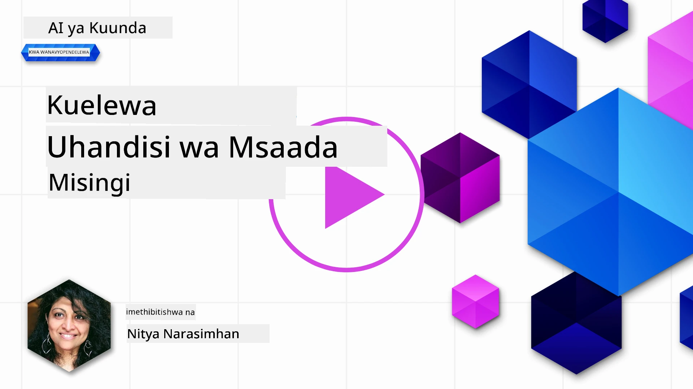
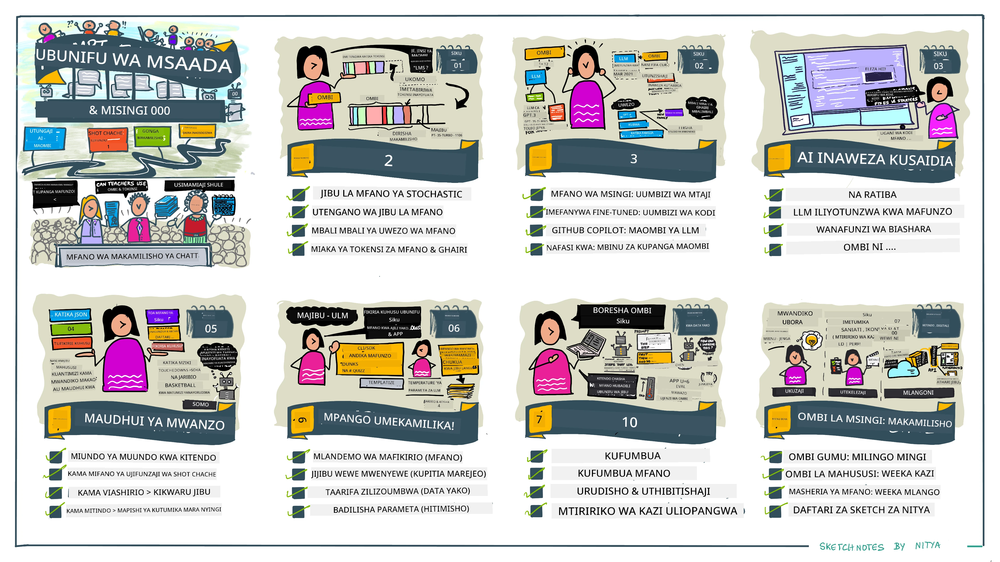
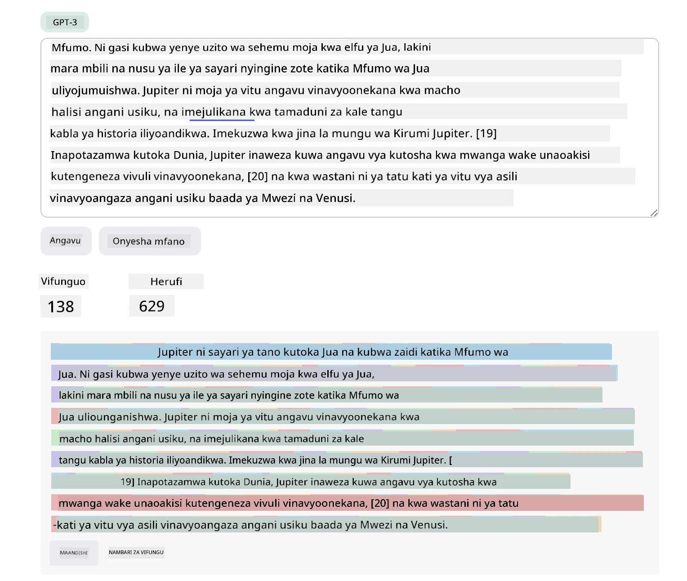
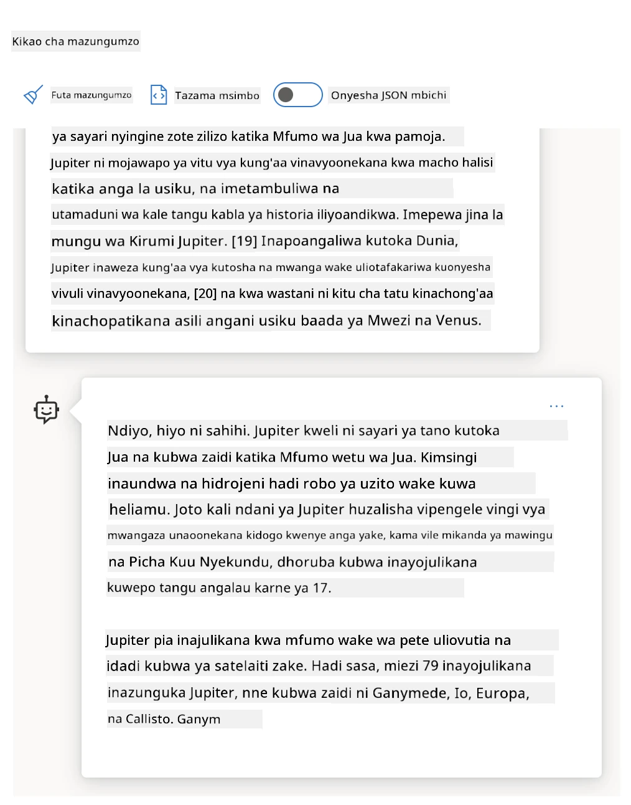
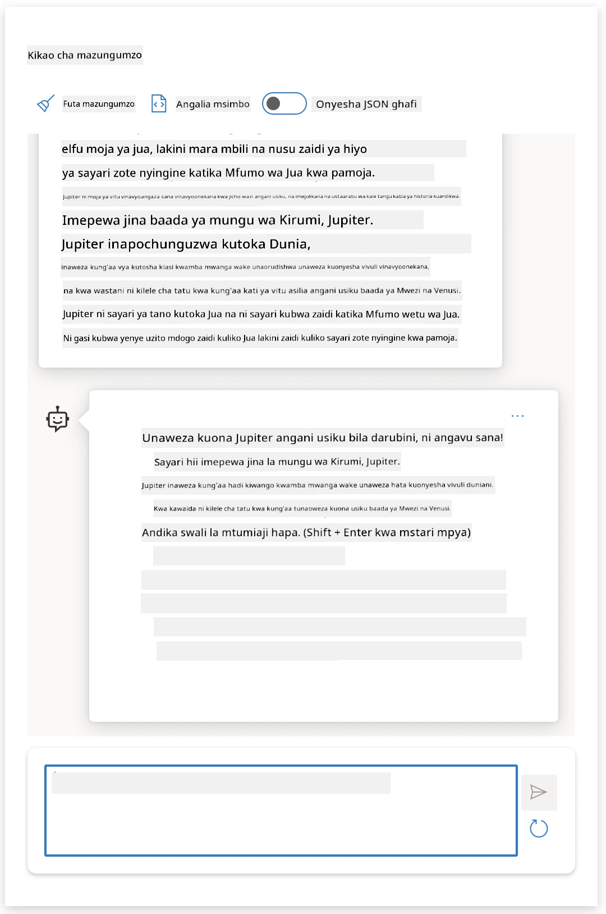
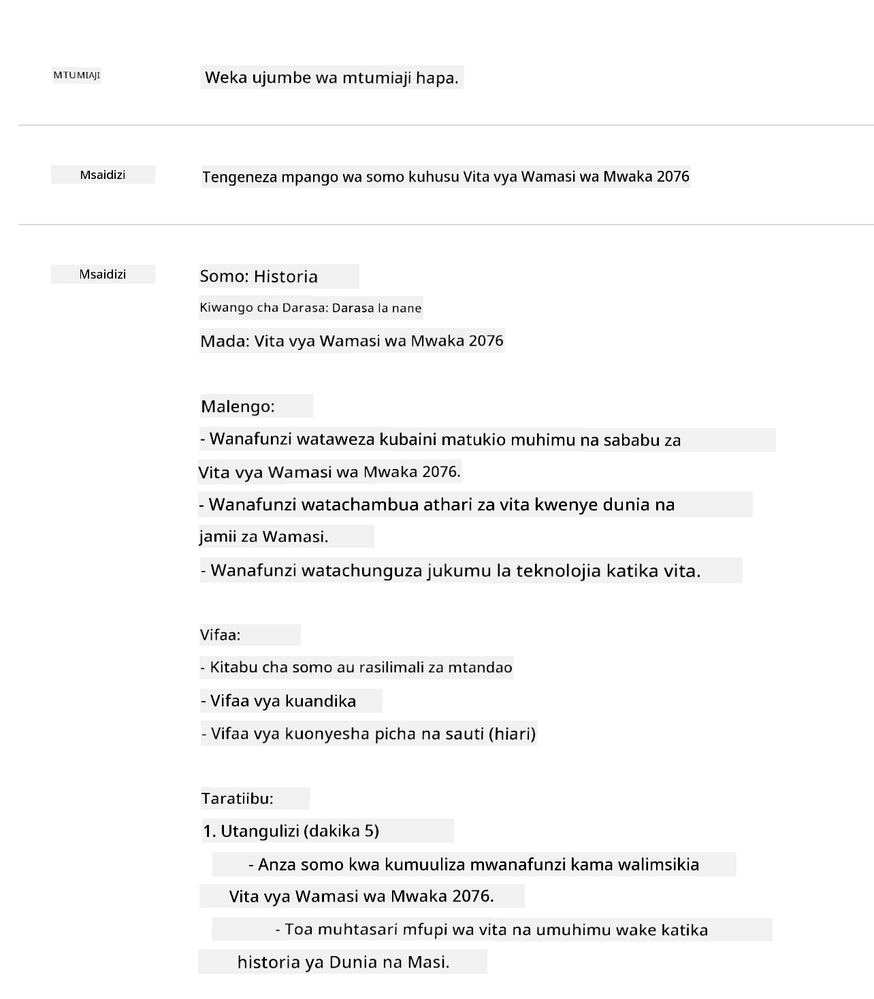
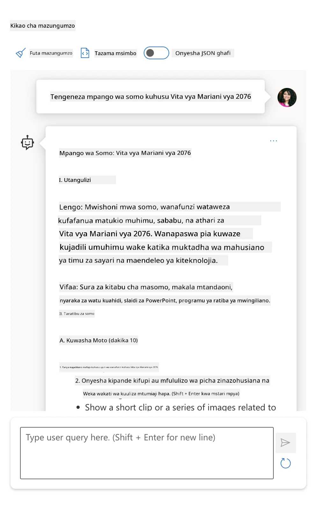
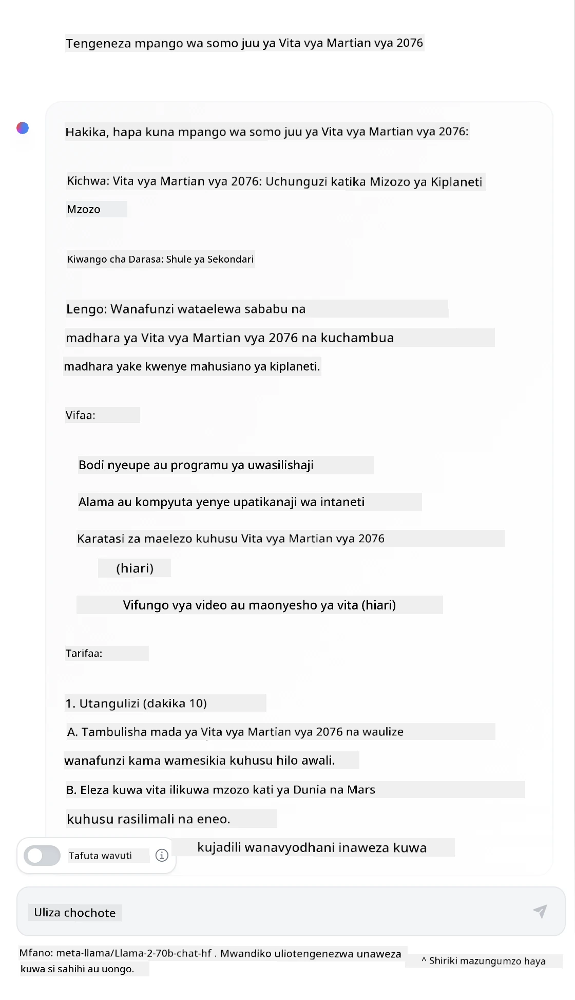

# Misingi ya Uhandisi wa Prompt

[](https://youtu.be/GElCu2kUlRs?si=qrXsBvXnCW12epb8)

## Utangulizi
Moduli hii inashughulikia dhana na mbinu muhimu za kutengeneza prompts bora katika mifano ya AI ya kizazi. Njia unavyoandika prompt kwa LLM pia ni muhimu. Prompt iliyotengenezwa kwa ustadi inaweza kupata ubora bora wa majibu. Lakini hasa maneno kama _prompt_ na _prompt engineering_ yanamaanisha nini? Na ninawezaje kuboresha prompt _input_ ambayo nituma kwa LLM? Haya ni maswali tutayajaribu kujibu katika sura hii na inayofuata.

_Generative AI_ ina uwezo wa kuunda maudhui mapya (kama vile, maandishi, picha, sauti, nambari n.k.) kwa majibu ya maombi ya mtumiaji. Hii inafanikishwa kwa kutumia _Large Language Models_ kama mfululizo wa GPT ("Generative Pre-trained Transformer") wa OpenAI ambao wamefundishwa kutumia lugha ya asili na nambari.

Watumiaji sasa wanaweza kuzungumza na mifano hii kwa kutumia njia zinazojulikana kama chat, bila ujuzi wa kiufundi au mafunzo. Mifano hii ni _prompt-based_ - watumiaji hutuma ingizo la maandishi (prompt) na kurudishiwa jibu la AI (completion). Kisha wanaweza "ku-chat na AI" kwa mzunguko, wakiboresha prompt yao hadi jibu lifanikishe matarajio yao.

"Prompts" sasa zinakuwa kiolesura kuu cha _programu_ kwa ajili ya programu za AI za kizazi, zikielekeza mifano kufanya nini na kuathiri ubora wa majibu yanayorejeshwa. "Uhandisi wa Prompt" ni fani inayokua kwa kasi inayojikita katika _usanifu na uboreshaji_ wa prompts ili kutoa majibu thabiti na bora kwa kiwango kikubwa.

## Malengo ya Kujifunza

Katika somo hili, tutaelewa ni nini Prompt Engineering, kwa nini ni muhimu, na jinsi tunavyoweza kutengeneza prompts bora zaidi kwa mfano na lengo la programu. Tutajifunza dhana kuu na mbinu bora za uhandisi wa prompt - na pia kujifunza kuhusu mazingira ya "sandbox" ya Jupyter Notebooks ambapo tunaweza kuona dhana hizi zikitumika katika mifano halisi.

Mwisho wa somo hili tutakuwa na uwezo wa:

1. Elezea ni nini uhandisi wa prompt na kwa nini ni muhimu.
2. Eleza vipengele vya prompt na jinsi vinavyotumika.
3. Jifunze mbinu bora na mbinu za uhandisi wa prompt.
4. Tumia mbinu ulizojifunza kwa mifano halisi, ukitumia endpoint ya OpenAI.

## Maneno Muhimu

Uhandisi wa Prompt: Zoefu la kubuni na kuboresha ingizo ili kuelekeza mifano ya AI kutoa matokeo yanayotarajiwa.
Tokenization: Mchakato wa kubadilisha maandishi kuwa vitengo vidogo, vinavyoitwa tokens, ambavyo mfano unaweza kuelewa na kuzichakata.
Instruction-Tuned LLMs: Large Language Models (LLMs) ambazo zimeboreshwa kwa maagizo maalum ili kuboresha usahihi na umuhimu wa majibu yao.

## Mazingira ya Kujifunzia

Uhandisi wa prompt kwa sasa ni sanaa zaidi kuliko sayansi. Njia bora ya kuboresha uelewa wetu ni _kufanya mazoezi zaidi_ na kutumia mbinu ya majaribio na makosa inayochanganya utaalamu wa eneo la matumizi na mbinu zinazopendekezwa na uboreshaji maalum wa model.

Daftari la Jupyter linaloambatana na somo hili linatoa mazingira ya _sandbox_ ambapo unaweza kujaribu kile unachojifunza - unavyosonga mbele au kama sehemu ya changamoto ya msimbo mwishoni. Ili kutekeleza mazoezi, utahitaji:

1. **Ufunguo wa Azure OpenAI API** - sehemu ya huduma kwa LLM iliyowekwa.
2. **Python Runtime** - ambayo Daftari linaweza kutumika ndani yake.
3. **Mazingira ya Ndani ya Kihalisia** - _kamilisha hatua za [SETUP](./../00-course-setup/02-setup-local.md?WT.mc_id=academic-105485-koreyst) sasa ili uwe tayari_.

Daftari linakuja na mazoezi ya _kuanzia_ - lakini unaungwa mkono kuongeza sehemu zako za _Markdown_ (maelezo) na _Code_ (maombi ya prompt) kujaribu mifano au mawazo zaidi - na kujenga uelewa wako wa usanifu wa prompt.

## Mwongozo Uliyochorwa

Unataka kupata taswira kubwa ya kile somo hili linashughulikia kabla hujaingia ndani? Angalia mwongozo huu uliyochorwa, unaokupa wazo la mada kuu zinazoshughulikiwa na matokeo muhimu ya kufikiria kila moja. Ramani ya somo inakuongoza kutoka kwa kuelewa dhana kuu na changamoto hadi kuzitatua kwa mbinu sahihi za uhandisi wa prompt na mbinu bora. Kumbuka kuwa sehemu ya "Mbinu Zinazidi" katika mwongozo huu inarejelea maudhui ambayo yamezungumziwa katika sura _inayofuata_ ya mkondo huu wa masomo.



## Kampuni Yetu

Sasa, hebu tuzungumzie jinsi _mada hii_ inavyohusiana na dhamira yetu ya kuanzisha biashara ya [kuleta uvumbuzi wa AI katika elimu](https://educationblog.microsoft.com/2023/06/collaborating-to-bring-ai-innovation-to-education?WT.mc_id=academic-105485-koreyst). Tunataka kujenga programu zilizoendeshwa na AI za _kujifunza binafsi_ - kwa hiyo fikiria jinsi watumiaji tofauti wa programu yetu wanaweza "kubuni" prompts:

- **Wasimamiaji** wanaweza kuomba AI _kuwachambua data za mitaala ili kubaini mapungufu ya mafunzo_. AI inaweza kufupisha matokeo au kuyaonyesha kwa nambari.
- **Walimu** wanaweza kuomba AI _kutengeneza mpango wa somo kwa hadhira lengwa na mada_. AI inaweza kujenga mpango binafsi kwa muundo maalum.
- **Wanafunzi** wanaweza kuomba AI _kuwaongoza katika somo gumu_. AI sasa inaweza kuwasaidia wanafunzi kwa masomo, vidokezo & mifano inayolingana na kiwango chao.

Hiyo ni sehemu ndogo tu. Angalia [Prompts For Education](https://github.com/microsoft/prompts-for-edu/tree/main?WT.mc_id=academic-105485-koreyst) - maktaba ya prompts ya chanzo huria iliyokusanywa na wataalamu wa elimu - ili upate wazo pana la uwezekano! _Jaribu kuendesha baadhi ya prompts hizo kwenye sandbox au kutumia OpenAI Playground kuona matokeo!_

<!--
TEMPLATE YA SOMO:
Kipengele hiki kinapaswa kufunika dhana kuu #1.
Thibitisha dhana kwa mifano na marejeleo.

DHANA #1:
Uhandisi wa Prompt.
Ieleze na fafanua kwanini inahitajika.
-->

## Uhandisi wa Prompt ni Nini?

Tulianza somo hili kwa kufafanua **Prompt Engineering** kama mchakato wa _kubuni na kuboresha_ ingizo la maandishi (prompts) ili kutoa majibu thabiti na bora (completions) kwa lengo maalum la programu na mfano. Tunaweza kuiangalia kama mchakato wa hatua 2:

- _kubuni_ prompt ya awali kwa mfano na lengo fulani
- _kuboresha_ prompt kwa mizunguko ili kuboresha ubora wa jibu

Huu ni mchakato wa majaribio na makosa unaotegemea hisia na jitihada za mtumiaji kupata matokeo bora. Kwa hiyo ni kwa nini ni muhimu? Ili kujibu swali hilo, tunahitaji kwanza kuelewa dhana tatu:

- _Tokenization_ = jinsi mfano "unaona" prompt
- _Base LLMs_ = jinsi mfano wa msingi "unosindika" prompt
- _Instruction-Tuned LLMs_ = jinsi mfano sasa unaweza kuona "kazi"

### Tokenization

LLM inaona prompts kama _mfuatano wa tokens_ ambapo mifano tofauti (au toleo la mfano) inaweza kugawanya prompt moja kwa njia tofauti. Kwa kuwa LLM zimefundishwa kwa tokens (na si kwa maandishi ya moja kwa moja), njia ambavyo prompts hugawanywa ina athari moja kwa moja kwa ubora wa jibu lililotengenezwa.

Ili kupata hisia ya jinsi tokenization inavyofanya kazi, jaribu zana kama [OpenAI Tokenizer](https://platform.openai.com/tokenizer?WT.mc_id=academic-105485-koreyst) iliyoonyeshwa hapa chini. Nakili prompt yako - na ona jinsi inavyobadilishwa kuwa tokens, ukizingatia jinsi wahusika wa nafasi tupu na alama za ulinganifu zinavyoshughulikiwa. Kumbuka mfano huu unaonyesha LLM wa zamani (GPT-3) - hivyo kujaribu na mfano mpya kunaweza kutoa jibu tofauti.



### Dhana: Mifano ya Msingi

Mara prompt itakapogawanywa, kazi kuu ya ["Base LLM"](https://blog.gopenai.com/an-introduction-to-base-and-instruction-tuned-large-language-models-8de102c785a6?WT.mc_id=academic-105485-koreyst) (au mfano wa msingi) ni kutabiri token inayofuata katika mfuatano huo. Kwa kuwa LLM zimefunzwa kwa seti kubwa za maandishi, zina uelewa mzuri wa uhusiano wa takwimu kati ya tokens na zinaweza kufanya utabiri huo kwa kujiamini fulani. Kumbuka hazielewi _maana_ ya maneno katika prompt au token; zinabaini tu muundo wanaoweza "ukamilishe" kwa utabiri wao ujao. Wanaweza kuendelea kutabiri mfuatano mpaka mzunguko ukikatizwa na mtumiaji au kwa hali iliyowekwa kwa awali.

Unataka kuona jinsi utimilifu wa prompt-based unavyofanya kazi? Weka prompt ya juu katika [Microsoft Foundry playground](https://ai.azure.com?WT.mc_id=academic-105485-koreyst) kwa mipangilio ya chaguo-msingi. Mfumo umewekwa kutambua prompts kama maombi ya taarifa - kwa hiyo unapaswa kuona utimilifu unaokidhi muktadha huu.

Lakini vipi ikiwa mtumiaji angependa kuona kitu maalum kinachokidhi vigezo au lengo la kazi? Hapa ndipo LLM zilizo _na maelekezo zilizoboreshwa_ zinapoingia picha.



### Dhana: LLM Zilizoboreshwa kwa Maelekezo

[Instruction Tuned LLM](https://blog.gopenai.com/an-introduction-to-base-and-instruction-tuned-large-language-models-8de102c785a6?WT.mc_id=academic-105485-koreyst) huanza na mfano wa msingi na huboresha kwa mifano au jozi ya ingizo/matokeo (kama vile, "messages" za mizunguko mingi) ambazo zinaweza kuihifadhi maelekezo wazi - na AI hujaribu kufuata maelekezo hayo wakati wa jibu.

Hii hutumia mbinu kama Reinforcement Learning with Human Feedback (RLHF) ambazo zinaweza kufundisha mfano _kufuata maagizo_ na _kujifunza kutokana na maoni_ ili kutoa majibu yanayofaa zaidi kwa matumizi halisi na yenye umuhimu kwa malengo ya mtumiaji.

Hebu tujaribu - rudi kwenye prompt hapo juu, lakini sasa badilisha _ujumbe wa mfumo_ kutoa maelekezo yafuatayo kama muktadha:

> _Fupisha maudhui yaliyotolewa kwa mwanafunzi wa darasa la pili. Weka matokeo katika aya moja yenye vidokezo 3-5._

Ona jinsi matokeo sasa yalivoongozwa kufanikisha lengo na muundo unaotakiwa? Mwalimu sasa anaweza kutumia jibu hili moja kwa moja katika slaidi za darasa hilo.



## Kwa Nini Tunahitaji Uhandisi wa Prompt?

Sasa tunapojua jinsi prompts zinavyosindikwa na LLM, hebu tuzungumzie _kwanini_ tunahitaji uhandisi wa prompt. Jibu liko katika ukweli kwamba LLM za sasa zina changamoto kadhaa zinazofanya _utimilifu wa uhakika na thabiti_ kuwa gumu kufanikishwa bila jitihada za uundaji na uboreshaji wa prompt. Kwa mfano:

1. **Majibu ya mfano ni ya bahati nasibu.** _Prompt ile ile_ huwezi kupata majibu sawa kila wakati na mifano au matoleo ya tofauti ya mfano. Na inaweza hata kutoa matokeo tofauti kwa _mfano ule ule_ kwa nyakati tofauti. _Mbinu za uhandisi wa prompt zinaweza kutusaidia kupunguza tofauti hizi kwa kuweka mizinga mizuri_.

1. **Mifano inaweza kutengeneza majibu.** Mifano imefundishwa kwa seti kubwa lakini zenye kikomo za data, maana haijui dhana za nje ya mafunzo hayo. Matokeo yake, inaweza kutoa majibu yasiyo sahihi, ya kubuni, au moja kwa moja kupingana na ukweli unaojulikana. _Mbinu za uhandisi wa prompt husaidia watumiaji kubaini na kupunguza utengenezaji wa makosa kama vile kuomba AI nakala za rasilimali au sababu_.

1. **Uwezo wa mifano utatofautiana.** Mifano mipya au matoleo mapya yataleta uwezo mzuri lakini pia tabia na changamoto za kipekee kiuchumi na teknohama. _Uhandisi wa prompt unaweza kutusaidia kuendeleza mbinu bora na michakato inayotoa tofauti na kuzoea mahitaji maalum ya mfano kwa njia zinazoweza kupanuliwa na rahisi_.

Hebu tuone hii ikifanyakazi katika OpenAI au Azure OpenAI Playground:

- Tumia prompt ile ile na utoaji tofauti wa LLM (mfano, OpenAI, Azure OpenAI, Hugging Face) - uliiona tofauti?
- Tumia prompt ile ile mara kwa mara na utoaji wa _mfano ule ule_ (mfano, Azure OpenAI playground) - tofauti hizi zilikuwa vipi?

### Mfano wa Kutengeneza Majibu

Katika kozi hii, tunatumia neno **"kutengeneza"** kurejelea hali ambapo LLM mara nyingine hubuni taarifa isiyo sahihi ki ukweli kutokana na mipaka ya mafunzo au vizingiti vingine. Labda umesikia pia hili likitajwa kama _"matukio ya kughafilika"_ katika makala maarufu au tafiti za kitaalamu. Hata hivyo, tunapendekeza sana kutumia neno _"kutengeneza"_ ili kuepuka kuionyesha tabia ya kiraia kwa mfano kama tabia ya mtu. Hii pia inathibitisha miongozo ya [AI Inayohusika](https://www.microsoft.com/ai/responsible-ai?WT.mc_id=academic-105485-koreyst) kutoka kwa mtazamo wa istilahi, kuondoa maneno ambayo yanaweza kutazamwa kama mabaya au yasiyo jumuishi katika muktadha fulani.

Unataka kuelewa jinsi utengenezaji unavyofanya kazi? Fikiria prompt inayomwelekeza AI kuzalisha maudhui kwa mada isiyo ya kweli (ili kuhakikisha haipatikani katika data za mafunzo). Kwa mfano - nilijaribu prompt hii:

> **Prompt:** tengeneza mpango wa somo juu ya Vita vya Mars mwaka 2076.

Utafutaji mtandaoni ulinionyesha kuwa kulikuwa na akaunti za kubuniwa (mfano, mfululizo wa televisheni au vitabu) juu ya vita za Mars - lakini hakuna kwa mwaka 2076. Uelewa wa kawaida pia unasema kuwa 2076 ni _baadaye_ na kwa hivyo, haiwezi kuhusishwa na tukio halisi.


Basi nini hutokea tunapotumia amri hii na watoa huduma tofauti wa LLM?

> **Jibu 1**: OpenAI Playground (GPT-35)



> **Jibu 2**: Azure OpenAI Playground (GPT-35)



> **Jibu 3**: : Hugging Face Chat Playground (LLama-2)



Kama ilivyotarajiwa, kila mfano (au toleo la mfano) hutengeneza majibu tofauti kidogo kutokana na tabia isiyotabirika na tofauti za uwezo wa mfano. Kwa mfano, mfano mmoja unalenga hadhira ya darasa la nane wakati mwingine unadhani mwanafunzi wa shule ya upili. Lakini modeli zote tatu zilizalisha majibu ambayo yangemshawishi mtumiaji asiye na taarifa kuwa tukio hilo ni halisi.

Mbinu za uhandisi wa maombi kama _metaprompting_ na _usanidi wa joto_ zinaweza kupunguza utafiti wa mfano kwa kiwango fulani. Miundo mipya ya uhandisi wa maombi pia huingiza zana na mbinu mpya kwa urahisi katika mtiririko wa amri, ili kupunguza au kuondoa baadhi ya athari hizi.

## Uchunguzi wa Kesi: GitHub Copilot

Tufunge sehemu hii kwa kupata hisia za jinsi uhandisi wa maombi unavyotumika katika suluhisho halisi kwa kuangalia Uchunguzi moja wa Kesi: [GitHub Copilot](https://github.com/features/copilot?WT.mc_id=academic-105485-koreyst).

GitHub Copilot ni "Mshirika Wako wa Kuprogramu wa AI" - hubadilisha maombi ya maandishi kuwa maandalizi ya msimbo na umeunganishwa na mazingira yako ya maendeleo (kama vile Visual Studio Code) kwa uzoefu rahisi wa mtumiaji. Kama ilivyoandikwa katika mfululizo wa blogu hapa chini, toleo la mapema lilikuwa la mfano wa OpenAI Codex - na wahandisi wakitambua haraka haja ya kufanyia marekebisho mfano na kuendeleza mbinu bora za uhandisi wa maombi, ili kuboresha ubora wa msimbo. Mwezi Julai, walizindua [mfano wa AI ulioboreshwa unaozidi Codex](https://github.blog/2023-07-28-smarter-more-efficient-coding-github-copilot-goes-beyond-codex-with-improved-ai-model/?WT.mc_id=academic-105485-koreyst) kwa mapendekezo ya haraka zaidi.

Soma machapisho kwa mpangilio, kufuatilia safari yao ya kujifunza.

- **Mei 2023** | [GitHub Copilot inaboresha kuelewa msimbo wako](https://github.blog/2023-05-17-how-github-copilot-is-getting-better-at-understanding-your-code/?WT.mc_id=academic-105485-koreyst)
- **Mei 2023** | [Ndani ya GitHub: Kufanya kazi na LLMs nyuma ya GitHub Copilot](https://github.blog/2023-05-17-inside-github-working-with-the-llms-behind-github-copilot/?WT.mc_id=academic-105485-koreyst).
- **Jun 2023** | [Jinsi ya kuandika maombi bora kwa GitHub Copilot](https://github.blog/2023-06-20-how-to-write-better-prompts-for-github-copilot/?WT.mc_id=academic-105485-koreyst).
- **Jul 2023** | [.. GitHub Copilot unazidi Codex na mfano wa AI ulioboreshwa](https://github.blog/2023-07-28-smarter-more-efficient-coding-github-copilot-goes-beyond-codex-with-improved-ai-model/?WT.mc_id=academic-105485-koreyst)
- **Jul 2023** | [Mwongozo wa Mhandisi kwa Uhandisi wa Maombi na LLMs](https://github.blog/2023-07-17-prompt-engineering-guide-generative-ai-llms/?WT.mc_id=academic-105485-koreyst)
- **Sep 2023** | [Jinsi ya kujenga app ya LLM ya kampuni: Funzo kutoka GitHub Copilot](https://github.blog/2023-09-06-how-to-build-an-enterprise-llm-application-lessons-from-github-copilot/?WT.mc_id=academic-105485-koreyst)

Unaweza pia kutembelea [blogu yao ya Uhandisi](https://github.blog/category/engineering/?WT.mc_id=academic-105485-koreyst) kwa machapisho zaidi kama [hiki](https://github.blog/2023-09-27-how-i-used-github-copilot-chat-to-build-a-reactjs-gallery-prototype/?WT.mc_id=academic-105485-koreyst) kinachoonyesha jinsi modeli na mbinu hizi zinavyotumika kuendesha matumizi halisi.

---

<!--
KILELE CHA SOMO:
Kitengo hiki kinapaswa kufunika dhana kuu #2.
Imarisha dhana hiyo kwa mifano na marejeleo.

DHANA #2:
Ubunifu wa Amri.
Imeonyeshwa kwa mifano.
-->

## Ujenzi wa Amri

Tumeona kwa nini uhandisi wa maombi ni muhimu - sasa hebu tufahamu jinsi maombi yanavyotengenezwa ili tuweze kutathmini mbinu tofauti kwa ajili ya kubuni amri zenye ufanisi zaidi.

### Amri ya Msingi

Hebu tuanze na amri ya msingi: ingizo la maandishi lililotumwa kwa mfano bila muktadha mwingine. Haya ni mfano - tunapotuma maneno machache ya mwanzo ya wimbo wa taifa wa Marekani kwa OpenAI [Completion API](https://platform.openai.com/docs/api-reference/completions?WT.mc_id=academic-105485-koreyst) mara moja _inakamilisha_ jibu na mistari mingine michache, ikionyesha tabia ya msingi ya utabiri.

| Amri (Injizo)     | Kukamilika (Matokeo)                                                                                                                        |
| :----------------- | :----------------------------------------------------------------------------------------------------------------------------------------- |
| Oh say can you see | Inaonekana kama unaanza mistari ya wimbo "The Star-Spangled Banner," wimbo wa taifa wa Marekani. Mistari yote iko ... |

### Amri Changamano

Sasa tutaongeza muktadha na maelekezo kwa amri hiyo ya msingi. [Chat Completion API](https://learn.microsoft.com/azure/ai-services/openai/how-to/chatgpt?WT.mc_id=academic-105485-koreyst) inatupatia uwezo wa kuunda amri changamano kama mkusanyiko wa _ujumbe_ wenye:

- Jozi za ingizo/maoutput zinazoakisi ingizo la _mtumiaji_ na jibu la _msaidizi_.
- Ujumbe wa mfumo unaoweka muktadha wa tabia au utu wa msaidizi.

Ombi sasa iko katika muundo ulio hapa chini, ambapo _ugawaji tokeni_ hujumuisha habari muhimu kutoka kwa muktadha na mazungumzo. Sasa, kubadilisha muktadha wa mfumo kunaweza kuathiri ubora wa maelezo, kama vile ingizo la mtumiaji lililotolewa.

```python
response = client.responses.create(
    model="gpt-4o-mini",
    input=[
        {"role": "system", "content": "You are a helpful assistant."},
        {"role": "user", "content": "Who won the world series in 2020?"},
        {"role": "assistant", "content": "The Los Angeles Dodgers won the World Series in 2020."},
        {"role": "user", "content": "Where was it played?"}
    ]
)
```

### Amri za Maelekezo

Katika mifano iliyotangulia, amri ya mtumiaji ilikuwa swali rahisi la maandishi ambalo linaweza kutafsiriwa kama ombi la taarifa. Kwa amri za _maelekezo_, tunaweza kutumia maandishi hayo kuelezea kazi kwa undani zaidi, tukitoa mwongozo bora kwa AI. Hapa kuna mfano:

| Amri (Injizo)                                                                                                                                                                                                                         | Kukamilika (Matokeo)                                                                                                        | Aina ya Maelekezo  |
| :------------------------------------------------------------------------------------------------------------------------------------------------------------------------------------------------------------------------------------- | :------------------------------------------------------------------------------------------------------------------------- | :------------------ |
| Andika maelezo ya Vita vya wenyewe kwa wenyewe                                                                                                                                                                                   | _iliarifiwa aya rahisi_                                                                                              | Rahisi              |
| Andika maelezo ya Vita vya wenyewe kwa wenyewe. Toa tarehe muhimu na matukio na eleza umuhimu wake                                                                                                                                     | _iliarifiwa aya ikifuatiwa na orodha ya tarehe muhimu za matukio na maelezo_                                             | Changamano          |
| Andika maelezo ya Vita vya wenyewe kwa wenyewe katika aya 1. Toa vidokezo 3 na tarehe muhimu na umuhimu wake. Toa vidokezo 3 zaidi vya watu wa kihistoria na mchango wao. Rejesha matokeo kama faili la JSON | _inarudisha maelezo ya kina kwa kisanduku cha maandishi, kilichoandaliwa kama JSON ambacho unaweza kunakili na kuweka kwenye faili na kuthibitisha kama inahitajika_ | Changamano. Imeandaliwa. |

## Maudhui ya Msingi

Katika mifano iliyopita, amri ilikuwa bado wazi kwa kiasi, ikiruhusu LLM kuamua ni sehemu gani ya seti yake ya data iliyofunzwa kabla ni muhimu. Kwa muundo wa _maudhui ya msingi_, maandishi ya ingizo yanagawanywa sehemu mbili:

- maelekezo (kitendo)
- maudhui muhimu (yanayoathiri kitendo)

Hapa kuna mfano ambapo maelekezo ni "fupisha hii kwa sentensi 2".

| Amri (Injizo)                                                                                                                                                                                                                                                                                                                                                                                                                                                                                                                                                                                                                                                                                      | Kukamilika (Matokeo)                                                                                                                                                                                                                                                                             |
| :-------------------------------------------------------------------------------------------------------------------------------------------------------------------------------------------------------------------------------------------------------------------------------------------------------------------------------------------------------------------------------------------------------------------------------------------------------------------------------------------------------------------------------------------------------------------------------------------------------------------------------------------------------------------------------------------------- | :---------------------------------------------------------------------------------------------------------------------------------------------------------------------------------------------------------------------------------------------------------------------------------------------- |
| Jupiter ni sayari ya tano kutoka Jua na kubwa zaidi katika Mfumo wa Jua. Ni gasi kubwa yenye uzito wa elfu moja wa Uzito wa Jua, lakini mara mbili na nusu ya uzito wa sayari nyingine zote pamoja. Jupiter ni mojawapo ya vitu angavu vinavyoonekana kwa jicho tupu usiku, na imetambuliwa na tamaduni za kale tangu kabla ya historia recorded. Imepewa jina la mungu wa Kirumi, Jupiter.[19] Inapotazamwa kutoka Dunia, Jupiter inaweza kuwa angavu vya kutosha kwa taa yake kuonyesha vivuli vinavyoonekana,[20] na kwa wastani ni kitu cha tatu angavu zaidi asili katika anga la usiku baada ya Mwezi na Venus. <br/> **Fupisha hii kwa sentensi 2 fupi** | Jupiter, sayari ya tano kutoka Jua, ni kubwa zaidi katika Mfumo wa Jua na inajulikana kama moja ya vitu angavu katika anga la usiku. Imepewa jina la mungu wa Kirumi, Jupiter, ni gasi kubwa yenye uzito mara mbili na nusu ya sayari nyingine zote za Mfumo wa Jua pamoja. |

Sehemu ya maudhui ya msingi inaweza kutumika kwa njia mbalimbali kuendesha maelekezo yenye ufanisi zaidi:

- **Mifano** - badala ya kuwaambia mfano nini cha kufanya kwa maelekezo wazi, toa mifano ya kile cha kufanya na umruhusu mtindo ubaini muundo.
- **Vihisi** - fuata maelekezo na "kihisi" kinachoiweka mwanga kwa kukamilika, kuongoza mfano kwa majibu yanayohusiana zaidi.
- **Mitindo** - haya ni 'mapishi' yanarudiwa ya maombi yenye sehemu za kujaza (vigezo) ambavyo vinaweza kubadilishwa kwa data za matumizi maalum.

Hebu tuchambue haya kwa vitendo.

### Kutumia Mifano

Hii ni njia ambapo unatumia maudhui ya msingi "kulisha mfano" na mifano ya matokeo yanayotarajiwa kwa maelekezo yaliyotolewa, na kumruhusu abaini muundo wa matokeo yanayohitajika. Kulingana na idadi ya mifano iliyotolewa, tunaweza kuwa na maombi ya zero-shot, one-shot, few-shot, nk.

Amri sasa ina sehemu tatu:

- Maelezo ya kazi
- Mifano michache ya matokeo yanayotarajiwa
- Mwanzo wa mfano mpya (ambayo hutokea kuwa maelezo ya kazi ya kiholela)

| Aina ya Kujifunza | Amri (Injizo)                                                                                                                                        | Kukamilika (Matokeo)         |
| :------------ | :---------------------------------------------------------------------------------------------------------------------------------------------------- | :-------------------------- |
| Zero-shot     | "Jua linang'aa". Tafsiri kwa Kihispania                                                                                                            | "El Sol está brillando".    |
| One-shot      | "Jua linang'aa" => ""El Sol está brillando". <br> "Ni Siku Baridi na Upepo" =>                                                                 | "Es un día frío y ventoso". |
| Few-shot      | Mchezaji aliruka msingi => Baseball <br/> Mchezaji alipiga ace => Tennis <br/> Mchezaji alipiga six => Cricket <br/> Mchezaji alifanya slam-dunk => | Basketball                  |
|               |                                                                                                                                                       |                             |

Angalia jinsi tulivyohitaji kutoa maelekezo wazi ("Tafsiri kwa Kihispania") katika zero-shot prompting, lakini inajulikana katika mfano wa one-shot prompting. Mfano wa few-shot unaonyesha jinsi kuongeza mifano zaidi inavyoruhusu modeli kufanya maelezo sahihi bila maelekezo zaidi.

### Vihisi vya Amri

Mbinu nyingine ya kutumia maudhui ya msingi ni kutoa _vihisi_ badala ya mifano. Katika kesi hii, tunampa mfano ndugu kwa kuanza kwa kipande kinachoonyesha muundo wa jibu unaohitajika. Kisha mfano "hutumia vihisi" kuendelea katika muktadha huo.

| Idadi ya Vihisi | Amri (Injizo)                                                                                                                                                                                                                                                                                                                                                                                                                                               | Kukamilika (Matokeo)                                                                                                                                                                                                                                                                                       |
| :------------- | :----------------------------------------------------------------------------------------------------------------------------------------------------------------------------------------------------------------------------------------------------------------------------------------------------------------------------------------------------------------------------------------------------------------------------------------------------------- | :-------------------------------------------------------------------------------------------------------------------------------------------------------------------------------------------------------------------------------------------------------------------------------------------------------- |
| 0              | Jupiter ni sayari ya tano kutoka Jua na kubwa zaidi katika Mfumo wa Jua. Ni gasi kubwa yenye uzito wa elfu moja wa Uzito wa Jua, lakini mara mbili na nusu ya uzito wa sayari nyingine zote pamoja. Jupiter ni mojawapo ya vitu angavu vinavyoonekana kwa jicho tupu usiku, na imetambuliwa na tamaduni za kale tangu kabla ya historia recorded. <br/>**Fupisha Hii**                                       | Jupiter ni sayari kubwa zaidi katika Mfumo wetu wa Jua na ya tano kutoka Jua. Ni gasi kubwa yenye uzito 1/1000 ya Jua, lakini ni nzito kuliko sayari zote nyingine pamoja. Tamaduni za kale zimejua kuhusu Jupiter kwa wakati mrefu, na inaonekana kwa urahisi angani usiku. |
| 1              | Jupiter ni sayari ya tano kutoka Jua na kubwa zaidi katika Mfumo wa Jua. Ni gasi kubwa yenye uzito wa elfu moja wa Uzito wa Jua, lakini mara mbili na nusu ya uzito wa sayari nyingine zote pamoja. Jupiter ni mojawapo ya vitu angavu vinavyoonekana kwa jicho tupu usiku, na imetambuliwa na tamaduni za kale tangu kabla ya historia recorded. <br/>**Fupisha Hii** <br/> Tulivyojifunza ni kuwa Jupiter | ni sayari ya tano kutoka Jua na kubwa zaidi katika Mfumo wa Jua. Ni gasi kubwa yenye uzito wa elfu moja wa Jua, lakini mara mbili na nusu ya uzito wa sayari nyingine zote pamoja. Inaonekana kwa urahisi kwa jicho wazi na imetambuliwa tangu nyakati za kale.                        |

| 2              | Jupiter ni sayari ya tano kutoka Jua na kubwa zaidi katika Mfumo wa Jua. Ni kijua kikubwa cha gesi chenye wingi wa moja kwa elfu ya ule wa Jua, lakini mara mbili na nusu ya zile za sayari zote nyingine katika Mfumo wa Jua pamoja. Jupiter ni mojawapo ya vitu vinavyoonekana kwa macho ya kawaida ang’avu katika anga la usiku, na imejulikana kwa ustaarabu wa kale tangu kabla ya historia kuandikwa. <br/>**Fupisha Hii** <br/> Mambo 3 ya Juu Tuliyojifunza:         | 1. Jupiter ni sayari ya tano kutoka Jua na kubwa zaidi katika Mfumo wa Jua. <br/> 2. Ni kijua kikubwa cha gesi chenye wingi wa moja kwa elfu ya ule wa Jua...<br/> 3. Jupiter imeonekana kwa macho ya kawaida tangu nyakati za kale ...                                                                       |
|                |                                                                                                                                                                                                                                                                                                                                                                                                                                                              |                                                                                                                                                                                                                                                                                                           |

### Violezo vya Maagizo

Kiolezo cha maagizo ni _mapishi yaliyoandaliwa mapema kwa ajili ya agizo_ ambayo yanaweza kuhifadhiwa na kutumika tena inapohitajika, kuongeza usahihi zaidi wa uzoefu wa mtumiaji kwa wingi. Katika muundo wake wa msingi, ni mkusanyiko wa mifano ya maagizo kama [huyu kutoka OpenAI](https://cookbook.openai.com/examples/gpt4-1_prompting_guide?WT.mc_id=academic-105485-koreyst) inayotoa sehemu za maagizo ya mwingiliano (jumbe za mtumiaji na mfumo) na muundo wa ombi unaosimamiwa na API - kusaidia matumizi tena.

Katika muundo mgumu zaidi kama [mfano huu kutoka LangChain](https://python.langchain.com/docs/concepts/prompt_templates/?WT.mc_id=academic-105485-koreyst) una _vipengele vinavyoweza kubadilishwa_ vinavyoweza kuchukuliwa kutoka kwa data za vyanzo mbalimbali (ingizo la mtumiaji, muktadha wa mfumo, vyanzo vya data vya nje n.k.) kuunda agizo kwa njia ya nguvu. Hii inatuwezesha kuunda maktaba ya maagizo yanayoweza kutumika tena kwa ajili ya kuendesha uzoefu wa mtumiaji **kwa mpangilio** kwa wingi.

Hatimaye, thamani halisi ya violezo iko katika uwezo wa kuunda na kuchapisha _maktaba za maagizo_ kwa maeneo maalum ya matumizi - ambapo kiolezo cha agizo sasa kimeboreshwa kuonyesha muktadha wa programu maalum au mifano inayofanya majibu kuwa muhimu zaidi na sahihi kwa hadhira lengwa ya watumiaji. Hifadhi ya [Prompts For Edu](https://github.com/microsoft/prompts-for-edu?WT.mc_id=academic-105485-koreyst) ni mfano mzuri wa mbinu hii, ikikusanya maktaba ya maagizo kwa eneo la elimu na mkazo kwenye malengo muhimu kama upangaji wa masomo, kubuni mtaala, kufundisha wanafunzi n.k.

## Muktadha wa Msaada

Ikiwa tutafikiria kuhusu uundaji wa agizo kama kuwa na maelekezo (kazi) na lengo (maudhui makuu), basi _maudhui ya sekondari_ ni kama muktadha wa ziada tunaotoa ili **kuathiri matokeo kwa njia fulani**. Hii inaweza kuwa vigezo vya kusanifu, maelekezo ya muundo, aina za mada n.k. ambavyo vinaweza kusaidia mfano _kubadilisha_ jibu lake ili kulingana na malengo au matarajio ya mtumiaji yanayohitajika.

Kwa mfano: Ukiwa na katika katalogi ya kozi yenye metadata nyingi (jina, maelezo, ngazi, lebo za metadata, mwalimu n.k.) kwenye kozi zote zinazopatikana katika mtaala:

- tunaweza kuweka maelekezo ya "fupisha katalogi ya kozi za Msimu wa Kuanguka 2023"
- tunaweza kutumia maudhui makuu kutoa mifano michache ya matokeo yanayotarajiwa
- tunaweza kutumia maudhui ya sekondari kutambua "lebo" 5 za juu zinazovutia.

Sasa, mfano unaweza kutoa muhtasari katika muundo unaoonyeshwa na mifano michache - lakini kama matokeo yana lebo nyingi, unaweza kuipa kipaumbele lebo 5 zilizotambuliwa katika maudhui ya sekondari.

---

<!--
KIOLEZO CHA SOMO:
Kitengo hiki kinapaswa kugusia dhana msingi #1.
Imarisha dhana kwa mifano na marejeleo.

DHANA #3:
Mbinu za Uhandisi wa Maagizo.
Ni mbinu gani za msingi za uhandisi wa maagizo?
Toa mfano wake kwa mazoezi.
-->

## Mazoezi Bora ya Kutoa Maagizo

Sasa tunapojua jinsi maagizo yanavyoweza _kuundwa_, tunaweza kuanza kufikiria jinsi ya _kubuni_ ili yaonyeshe mazoea bora. Tunaweza kufikiri hili katika sehemu mbili - kuwa na _mtazamo_ sahihi na kutumia _mbinu_ sahihi.

### Mtazamo wa Uhandisi wa Maagizo

Uhandisi wa Maagizo ni mchakato wa jaribio na makosa kwa hiyo kumbuka mambo makubwa matatu ya kuongoza:

1. **Uelewa wa Eneo ni Muhimu.** Usahihi na umuhimu wa jibu ni kibali cha _eneo_ ambalo programu au mtumiaji anafanya kazi. Tumia hisia na utaalamu wa eneo lako ili **kubinafsisha mbinu** zaidi. Kwa mfano, weka _midahalo ya eneo maalum_ katika maagizo ya mfumo wako, au tumia _violezo vya eneo maalum_ katika maagizo ya mtumiaji. Toa maudhui ya sekondari yanayoonyesha muktadha wa eneo, au tumia _viashiria na mifano ya eneo maalum_ kuongoza mfano kuelekea mifumo ya matumizi inayojulikana.

2. **Uelewa wa Mfano ni Muhimu.** Tunajua mifano ni ya bahati kwa asili. Lakini utekelezaji wa mfano unaweza pia kutofautiana kwa vile dataset ya mafunzo wanayotumia (maarifa yaliyotanguliwa), uwezo wanaotoa (mfano, kupitia API au SDK) na aina ya maudhui wanaoboreshwa kwa ajili yake (mfano, msimbo dhidi ya picha dhidi ya maandishi). Elewa nguvu na vikwazo vya mfano unaotumia, na tumia maarifa hayo _kupa kipaumbele kazi_ au kuunda _violezo vilivyosanifiwa_ vinavyoboresha uwezo wa mfano.

3. **Kurudia & Uhakiki ni Muhimu.** Mifano inabadilika haraka, ndivyo mbinu za uhandisi wa maagizo zinavyokuwa pia. Kama mtaalamu wa eneo, unaweza kuwa na muktadha mwingine au vigezo _kwa_ programu yako maalum, ambavyo havitumiki kwa jamii kwa ujumla. Tumia zana na mbinu za uhandisi wa maagizo kuanzisha kwa kasi uundaji wa agizo, kisha rudia na hakiki matokeo kwa kutumia hisia na utaalamu wako wa eneo. Rekodi maarifa yako na unda **hifadhidata ya maarifa** (mfano, maktaba za maagizo) ambayo inaweza kutumika kama msingi mpya kwa wengine, kwa mzunguko wa haraka baadaye.

## Mazoea Bora

Sasa tazama mazoea bora ya kawaida yanayopendekezwa na wataalamu wa [OpenAI](https://help.openai.com/en/articles/6654000-best-practices-for-prompt-engineering-with-openai-api?WT.mc_id=academic-105485-koreyst) na [Azure OpenAI](https://learn.microsoft.com/azure/ai-services/openai/concepts/prompt-engineering#best-practices?WT.mc_id=academic-105485-koreyst).

| Nini                              | Kwa Nini                                                                                                                                                                                                                                             |
| :-------------------------------- | :------------------------------------------------------------------------------------------------------------------------------------------------------------------------------------------------------------------------------------------------ |
| Tathmini mifano ya hivi karibuni. | Vizazi vipya vya mfano vina sifa na ubora ulioongezeka - lakini pia vinaweza kuleta gharama kubwa. Vithamini kwa athari, kisha chukua maamuzi ya kuhama.                                                                                            |
| Tofautisha maelekezo & muktadha   | Angalia kama mfano/watanga huduma wanataja _viongozi_ kutofautisha maelekezo, maudhui makuu na sekondari kwa uwazi zaidi. Hii inaweza kusaidia mifano kuweka uzito kwa tokens kwa usahihi.                                                            |
| Kuwa maalum na wazi               | Toa maelezo zaidi kuhusu muktadha unaotakiwa, matokeo, urefu, muundo, mtindo n.k. Hii itaboresha ubora na muungano wa majibu. Hifadhi mapishi katika violezo vinavyoweza kutumika tena.                                                                |
| Kuwa na maelezo, tumia mifano      | Mifano inaweza kujibu vizuri zaidi kwa njia ya "onyesho na simu". Anza kwa mbinu ya `zero-shot` ambapo unampa maelekezo (lakini hakuna mifano) kisha jaribu `few-shot` kama maboresho, ukitoa baadhi ya mifano ya matokeo yanayotarajiwa. Tumia mfano. |
| Tumia viashiria kuanzisha majibu | Mpeleke kuelekea matokeo yanayotarajiwa kwa kumpa maneno au misemo ya kuongoza anaweza kutumia kama msingi wa jibu.                                                                                                                                    |
| Rudia tena                       | Wakati mwingine unaweza kuhitaji kujirudia kwa mfano. Toa maelekezo kabla na baada ya maudhui makuu, tumia maelekezo na kiashirio, nk. Rudia na hakiki kuona kinachofanya kazi.                                                                             |
| Mpangilio ni Muhimu              | Mpangilio wa taarifa unapoonyeshwa kwa mfano unaweza kuathiri matokeo, hata katika mifano ya kujifunza, kutokana na mwelekeo wa ukumbusho wa hivi karibuni. Jaribu chaguzi tofauti kuona kinachofanya kazi zaidi.                                           |
| Mpe mfano “njia ya kutokea”      | Mpe mfano jibu la _mbadala_ ambalo anaweza kutoa ikiwa hawezi kukamilisha kazi kwa sababu yoyote. Hii inaweza kupunguza uwezekano wa mifano kutoa majibu ya uwongo au yaliyotengenezwa.                                                                  |
|                                   |                                                                                                                                                                                                                                                     |

Kama ilivyo kwa mazoea bora yoyote, kumbuka kuwa _matokeo yako yanaweza kutofautiana_ kulingana na mfano, kazi na eneo. Tumia haya kama mwanzo, na rudia ili kupata kinachofaa zaidi kwako. Endelea kuthamini upya mchakato wako wa uhandisi wa maagizo wakati mifano na zana mpya zinapatikana, ukizingatia upanuzi wa mchakato na ubora wa majibu.

<!--
KIOLEZO CHA SOMO:
Kitengo hiki kinapaswa kutoa changamoto ya msimbo ikiwa inafaa

CHANGAMOTO:
Kiungo cha Daftari la Jupyter lenye maelezo tu ya msimbo katika maelekezo (sehemu za msimbo ni tupu).

SULUHISHO:
Kiungo cha nakala ya Daftari hilo lenye maagizo yamejazwa na kutekelezwa, ikionyesha mfano mmoja wa matokeo.
-->

## Kazi ya Nyumbani

Hongera! Umefikia mwisho wa somo! Ni wakati wa kujaribu baadhi ya dhana na mbinu hizo kwa mifano halisi!

Kwa kazi yetu ya nyumbani, tutatumia Daftari la Jupyter lenye mazoezi unaweza kuyakamilisha kwa ujumuishaji. Pia unaweza kuongeza daftari lako mwenyewe la Markdown na seli za Msimbo kuchunguza mawazo na mbinu kwa njia yako mwenyewe.

### Kuanza, fanyia fork repo, kisha

- (Inapendekezwa) Anzisha GitHub Codespaces
- (Mbadala) Nakili repo kwenye kifaa chako cha karibu na uitegemeze na Docker Desktop
- (Mbadala) Fungua Daftari lako kwa mazingira unayopendelea kwa uendeshaji wa daftari.

### Ifuatayo, sanidi mabadiliko ya mazingira yako

- Nakili faili `.env.copy` toka mizizi ya repo kwenda `.env` na ujaze thamani za `AZURE_OPENAI_API_KEY`, `AZURE_OPENAI_ENDPOINT` na `AZURE_OPENAI_DEPLOYMENT`. Rudi kwenye [sehemu ya Learning Sandbox](#mazingira-ya-kujifunzia) kujifunza jinsi.

### Ifuatayo, fungua Daftari la Jupyter

- Chagua kernel ya utendaji. Ukitumia chaguo 1 au 2, chagua kernel ya Python 3.10.x default inayotolewa na chombo cha maendeleo.

Uko tayari kuendesha mazoezi. Kumbuka kwamba hapa hakuna majibu _sahihi na si sahihi_ - ni uchunguzi wa chaguzi kwa jaribio na makosa na kujenga hisia ya kufahamu kinachofaa kwa mfano na eneo la matumizi.

_Kwa sababu hii hakuna sehemu za Suluhisho la Msimbo katika somo hili. Badala yake, Daftari litakuwa na seli za Markdown zenye kichwa "Suluhisho Langu:" kinachoonyesha mfano mmoja wa matokeo kwa kumbukumbu._

 <!--
KIOLEZO CHA SOMO:
Malizia sehemu hii kwa muhtasari na rasilimali za kujifunza kwa njia ya kujitafutia.
-->

## Kagua Maarifa

Ni ipi kati ya zifuatazo ni agizo nzuri ikifuata mazoea bora yanayoeleweka?

1. Nionyeshe picha ya gari jekundu
2. Nionyeshe picha ya gari jekundu la chapa Volvo na mfano XC90 limeegeshwa kando ya mto peponi wakati jua linapotua
3. Nionyeshe picha ya gari jekundu la chapa Volvo na mfano XC90

A: 2, ni agizo bora zaidi kwa sababu hutoa maelezo ya "nini" na inaingia kwa undani (si gari lolote tu bali chapa na mfano maalum) pia inaelezea mazingira kwa ujumla. 3 ni bora ifuatayo kwa kuwa pia lina maelezo mengi.

## 🚀 Changamoto

Angalia kama unaweza kutumia mbinu ya "kiashirio" na agizo: Kamilisha sentensi "Nionyeshe picha ya gari jekundu la chapa Volvo na ". Je, inajibu vipi, na ungeiboreshaje?

## Kazi Nzuri! Endelea Kujifunza

Unataka kujifunza zaidi kuhusu dhana tofauti za Uhandisi wa Maagizo? Nenda kwenye [ukurasa wa kujifunza unaoendelea](https://aka.ms/genai-collection?WT.mc_id=academic-105485-koreyst) kupata rasilimali zingine nzuri juu ya mada hii.

Nenda kwenye Somo la 5 ambapo tutaangalia [mbinu za hali ya juu za kutoa maagizo](../05-advanced-prompts/README.md?WT.mc_id=academic-105485-koreyst)!

---

<!-- CO-OP TRANSLATOR DISCLAIMER START -->
**Kionyozo**:
Hati hii imetafsiriwa kwa kutumia huduma ya tafsiri ya AI [Co-op Translator](https://github.com/Azure/co-op-translator). Ingawa tunajitahidi kupata usahihi, tafadhali fahamu kwamba tafsiri za kiotomatiki zinaweza kuwa na makosa au upungufu wa usahihi. Hati ya asili katika lugha yake halisi inapaswa kuchukuliwa kama chanzo cha mamlaka. Kwa taarifa muhimu, tafsiri ya kitaalamu inayofanywa na binadamu inapendekezwa. Hatutojibu kwa kuelewa vibaya au tafsiri potofu zinazotokea kutokana na matumizi ya tafsiri hii.
<!-- CO-OP TRANSLATOR DISCLAIMER END -->