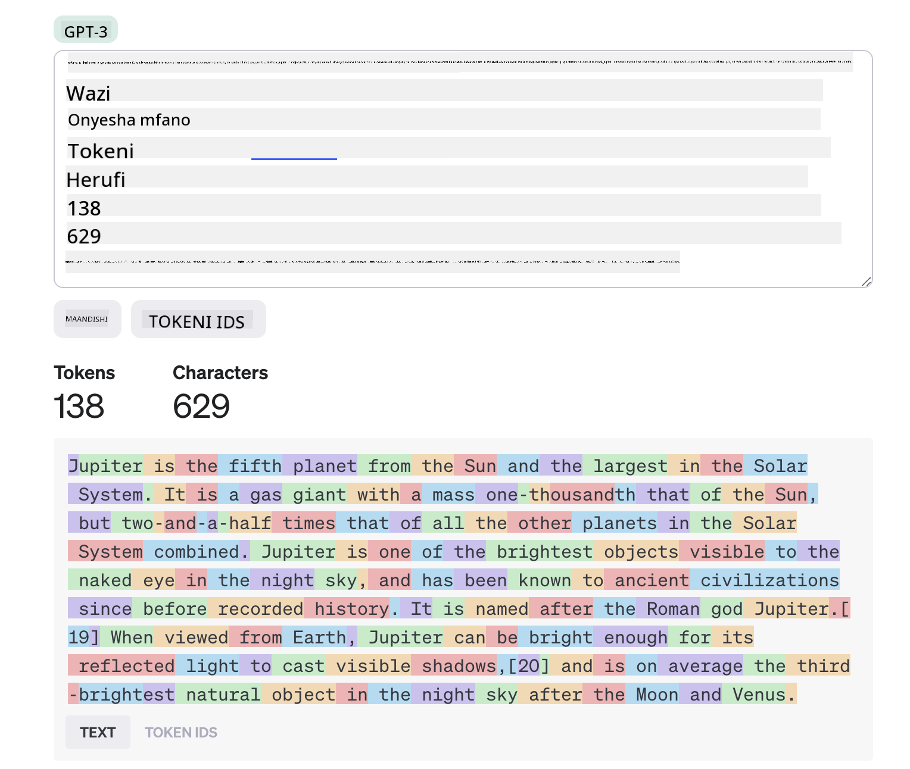
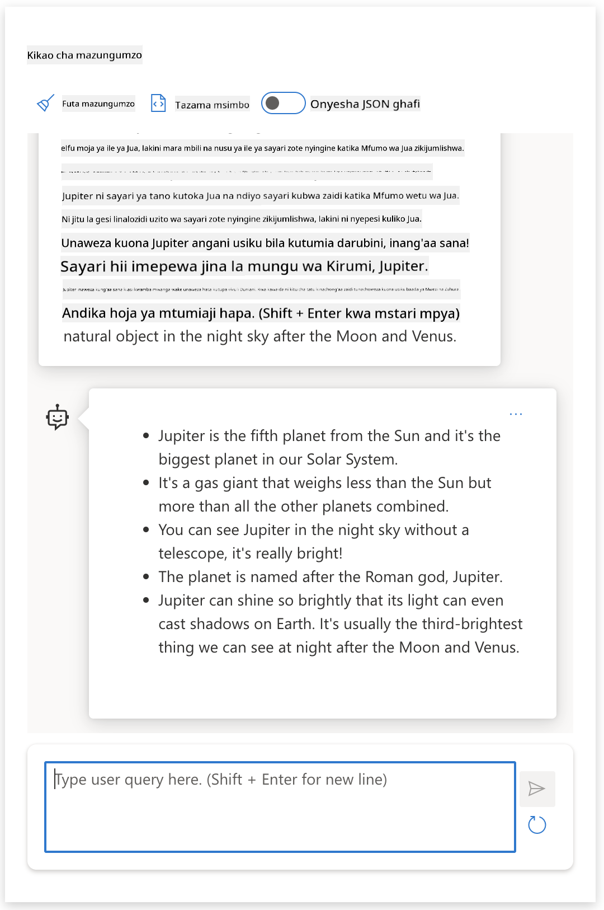

<!--
CO_OP_TRANSLATOR_METADATA:
{
  "original_hash": "a45c318dc6ebc2604f35b8b829f93af2",
  "translation_date": "2025-07-09T10:49:50+00:00",
  "source_file": "04-prompt-engineering-fundamentals/README.md",
  "language_code": "sw"
}
-->
# Misingi ya Uhandisi wa Prompt

[](https://aka.ms/gen-ai-lesson4-gh?WT.mc_id=academic-105485-koreyst)

## Utangulizi  
Moduli hii inashughulikia dhana na mbinu muhimu za kuunda prompt bora katika mifano ya AI ya kizazi. Jinsi unavyoandika prompt kwa LLM pia ni muhimu. Prompt iliyotengenezwa kwa uangalifu inaweza kupata majibu bora zaidi. Lakini hasa maneno kama _prompt_ na _uhandisi wa prompt_ yanamaanisha nini? Na ninawezaje kuboresha _input_ ya prompt ninayotuma kwa LLM? Haya ni maswali tutayajibu katika sura hii na inayofuata.

_AI ya Kizazi_ ina uwezo wa kuunda maudhui mapya (mfano, maandishi, picha, sauti, msimbo n.k.) kama jibu kwa maombi ya mtumiaji. Hii inafanikishwa kwa kutumia _Mifano Mikubwa ya Lugha_ kama mfululizo wa GPT wa OpenAI ("Generative Pre-trained Transformer") ambao wamefundishwa kutumia lugha ya asili na msimbo.

Watumiaji sasa wanaweza kuwasiliana na mifano hii kwa njia zinazojulikana kama mazungumzo, bila ujuzi wa kiufundi au mafunzo maalum. Mifano hii ni _inayotegemea prompt_ - watumiaji hutuma maandishi (prompt) na kurudishiwa jibu la AI (completion). Kisha wanaweza "kuzungumza na AI" kwa mizunguko mingi, wakiboresha prompt yao hadi jibu lifanikishe matarajio yao.

"Prompts" sasa zinakuwa _kiolesura cha programu_ kuu kwa programu za AI za kizazi, zikielekeza mifano nini cha kufanya na kuathiri ubora wa majibu yanayorejeshwa. "Uhandisi wa Prompt" ni taaluma inayokua kwa kasi inayojikita katika _kubuni na kuboresha_ prompts ili kutoa majibu thabiti na bora kwa wingi.

## Malengo ya Kujifunza

Katika somo hili, tutajifunza ni nini Uhandisi wa Prompt, kwa nini ni muhimu, na jinsi ya kuunda prompts bora kwa mfano na lengo la programu. Tutafahamu dhana kuu na mbinu bora za uhandisi wa prompt - na kujifunza kuhusu mazingira ya mazoezi ya Jupyter Notebooks ambapo tunaweza kuona dhana hizi zikitumika kwa mifano halisi.

Mwisho wa somo hili tutakuwa na uwezo wa:

1. Eleza ni nini uhandisi wa prompt na kwa nini ni muhimu.
2. Eleza vipengele vya prompt na jinsi vinavyotumika.
3. Jifunze mbinu bora na mbinu za uhandisi wa prompt.
4. Tumia mbinu ulizojifunza kwa mifano halisi, ukitumia endpoint ya OpenAI.

## Maneno Muhimu

Uhandisi wa Prompt: Mazoezi ya kubuni na kuboresha maingizo ili kuelekeza mifano ya AI kutoa matokeo yanayotarajiwa.  
Tokenization: Mchakato wa kubadilisha maandishi kuwa vitengo vidogo, vinavyoitwa tokens, ambavyo mfano unaweza kuelewa na kushughulikia.  
Instruction-Tuned LLMs: Mifano Mikubwa ya Lugha (LLMs) iliyoboreshwa kwa maagizo maalum ili kuboresha usahihi na umuhimu wa majibu.

## Mazoezi ya Kujifunza

Uhandisi wa prompt kwa sasa ni zaidi sanaa kuliko sayansi. Njia bora ya kuboresha hisia zetu juu yake ni _kufanya mazoezi zaidi_ na kutumia mbinu ya jaribio na makosa inayochanganya utaalamu wa eneo la matumizi na mbinu zilizopendekezwa pamoja na uboreshaji maalum wa mfano.

Jupyter Notebook inayokuja na somo hili inatoa mazingira ya _sandbox_ ambapo unaweza kujaribu kile unachojifunza - wakati wowote au kama sehemu ya changamoto ya msimbo mwishoni. Ili kutekeleza mazoezi, utahitaji:

1. **Ufunguo wa API wa Azure OpenAI** - endpoint ya huduma kwa LLM iliyowekwa.  
2. **Mazingira ya Python Runtime** - ambapo Notebook inaweza kutekelezwa.  
3. **Mazingira ya Kiasili ya Mitaa** - _kamilisha hatua za [SETUP](./../00-course-setup/SETUP.md?WT.mc_id=academic-105485-koreyst) sasa ili kujiandaa_.

Notebook inakuja na mazoezi ya _kuanzia_ - lakini unahimizwa kuongeza sehemu zako za _Markdown_ (maelezo) na _Code_ (maombi ya prompt) kujaribu mifano au mawazo zaidi - na kujenga hisia zako za kubuni prompt.

## Mwongozo wa Picha

Unataka kupata picha kubwa ya kile somo hili linashughulikia kabla ya kuingia? Angalia mwongozo huu wa picha, unaokupa hisia ya mada kuu zinazoshughulikiwa na mambo muhimu ya kuzingatia kila moja. Ramani ya somo inakupeleka kutoka kuelewa dhana kuu na changamoto hadi kuzitatua kwa mbinu za uhandisi wa prompt na mbinu bora. Kumbuka sehemu ya "Mbinu za Juu" katika mwongozo huu inahusu maudhui yaliyoshughulikiwa katika sura _inayofuata_ ya mtaala huu.


## Kampuni Yetu

Sasa, tuzungumzie jinsi _mada hii_ inavyohusiana na dhamira ya kampuni yetu ya kuleta [ubunifu wa AI katika elimu](https://educationblog.microsoft.com/2023/06/collaborating-to-bring-ai-innovation-to-education?WT.mc_id=academic-105485-koreyst). Tunataka kujenga programu za AI zinazotegemea _kujifunza binafsi_ - kwa hivyo fikiria jinsi watumiaji tofauti wa programu yetu wanaweza "kubuni" prompts:

- **Wasimamizi** wanaweza kumuomba AI _kuchambua data ya mtaala ili kubaini mapungufu ya mafunzo_. AI inaweza kufupisha matokeo au kuyaonyesha kwa msimbo.  
- **Walimu** wanaweza kumuomba AI _kuunda mpango wa somo kwa hadhira na mada fulani_. AI inaweza kutengeneza mpango binafsi kwa muundo uliobainishwa.  
- **Wanafunzi** wanaweza kumuomba AI _kuwa mwalimu wao katika somo gumu_. AI sasa inaweza kuwaongoza wanafunzi kwa masomo, vidokezo na mifano inayolingana na kiwango chao.

Hiyo ni kidogo tu. Angalia [Prompts For Education](https://github.com/microsoft/prompts-for-edu/tree/main?WT.mc_id=academic-105485-koreyst) - maktaba ya prompts ya chanzo huria iliyokusanywa na wataalamu wa elimu - kupata picha pana ya uwezekano! _Jaribu kuendesha baadhi ya prompts hizo katika sandbox au kutumia OpenAI Playground kuona kinachotokea!_

<!--  
TEMPLATE YA SOMO:  
Kitengo hiki kinapaswa kufunika dhana kuu #1.  
Thibitisha dhana hiyo kwa mifano na marejeleo.  

DHANA #1:  
Uhandisi wa Prompt.  
Ufafanue na eleza kwa nini unahitajika.  
-->

## Uhandisi wa Prompt ni Nini?

Tulianza somo hili kwa kufafanua **Uhandisi wa Prompt** kama mchakato wa _kubuni na kuboresha_ maingizo ya maandishi (prompts) ili kutoa majibu thabiti na bora (completions) kwa lengo la programu na mfano fulani. Tunaweza kuiona kama mchakato wa hatua 2:

- _kubuni_ prompt ya awali kwa mfano na lengo fulani  
- _kuboresha_ prompt kwa mizunguko ili kuboresha ubora wa jibu

Huu ni mchakato wa jaribio na makosa unaohitaji hisia na juhudi za mtumiaji kupata matokeo bora. Kwa nini ni muhimu? Ili kujibu hilo, kwanza tunahitaji kuelewa dhana tatu:

- _Tokenization_ = jinsi mfano "unaona" prompt  
- _Base LLMs_ = jinsi mfano wa msingi "ushughulikia" prompt  
- _Instruction-Tuned LLMs_ = jinsi mfano sasa unaweza kuona "kazi"

### Tokenization

LLM inaona prompts kama _mfuatano wa tokens_ ambapo mifano tofauti (au matoleo ya mfano) inaweza kugawanya prompt hiyo kwa njia tofauti. Kwa kuwa LLM zimefundishwa kwa tokens (na si maandishi ghafi), jinsi prompts zinavyogawanywa kwa tokens inaathiri moja kwa moja ubora wa jibu lililotengenezwa.

Ili kupata hisia ya jinsi tokenization inavyofanya kazi, jaribu zana kama [OpenAI Tokenizer](https://platform.openai.com/tokenizer?WT.mc_id=academic-105485-koreyst) iliyoonyeshwa hapa chini. Nakili prompt yako - na uone jinsi inavyobadilishwa kuwa tokens, ukizingatia jinsi nafasi na alama za uandishi zinavyoshughulikiwa. Kumbuka mfano huu unaonyesha LLM ya zamani (GPT-3) - hivyo kujaribu na mfano mpya kunaweza kutoa matokeo tofauti.



### Dhana: Mifano ya Msingi

Mara prompt inapogawanywa kwa tokens, kazi kuu ya ["Base LLM"](https://blog.gopenai.com/an-introduction-to-base-and-instruction-tuned-large-language-models-8de102c785a6?WT.mc_id=academic-105485-koreyst) (au mfano wa msingi) ni kutabiri token inayofuata katika mfuatano huo. Kwa kuwa LLM zimefundishwa kwa seti kubwa za maandishi, zina uelewa mzuri wa uhusiano wa takwimu kati ya tokens na zinaweza kufanya utabiri huo kwa uhakika fulani. Kumbuka hazielewi _maana_ ya maneno katika prompt au token; zinaona tu muundo wanaoweza "kukamilisha" kwa utabiri wao unaofuata. Zinaweza kuendelea kutabiri mfuatano hadi zitakapotimuliwa na mtumiaji au kwa hali iliyowekwa awali.

Unataka kuona jinsi kukamilisha kwa prompt kunavyofanya kazi? Ingiza prompt hapo juu katika Azure OpenAI Studio [_Chat Playground_](https://oai.azure.com/playground?WT.mc_id=academic-105485-koreyst) kwa mipangilio ya msingi. Mfumo umewekwa kutambua prompts kama maombi ya taarifa - hivyo unapaswa kuona jibu linalokidhi muktadha huu.

Lakini mtumiaji angependa kuona kitu maalum kinachokidhi vigezo au lengo la kazi? Hapa ndipo _Instruction-Tuned_ LLMs huingia.


### Dhana: Instruction Tuned LLMs

[Instruction Tuned LLM](https://blog.gopenai.com/an-introduction-to-base-and-instruction-tuned-large-language-models-8de102c785a6?WT.mc_id=academic-105485-koreyst) huanza na mfano wa msingi na kuuboresha kwa mifano au jozi za ingizo/mazao (mfano, "jumbe" za mizunguko mingi) zinazoweza kuwa na maagizo wazi - na jibu kutoka kwa AI linajaribu kufuata agizo hilo.

Hii hutumia mbinu kama Reinforcement Learning with Human Feedback (RLHF) inayoweza kufundisha mfano _kufuata maagizo_ na _kujifunza kutokana na maoni_ ili kutoa majibu yanayofaa zaidi kwa matumizi halisi na yanayohusiana zaidi na malengo ya mtumiaji.

Tujaribu - rudi kwenye prompt hapo juu, lakini sasa badilisha _ujumbe wa mfumo_ kutoa agizo lifuatalo kama muktadha:

> _Fupisha maudhui uliyopewa kwa mwanafunzi wa darasa la pili. Weka matokeo katika aya moja yenye pointi 3-5._

Tazama jinsi matokeo sasa yanavyolingana na lengo na muundo uliotakiwa? Mwalimu sasa anaweza kutumia jibu hili moja kwa moja katika slaidi za darasa hilo.



## Kwa Nini Tunahitaji Uhandisi wa Prompt?

Sasa tunapojua jinsi prompts zinavyoshughulikiwa na LLMs, tuzungumze _kwa nini_ tunahitaji uhandisi wa prompt. Jibu liko katika ukweli kwamba LLMs za sasa zina changamoto kadhaa zinazofanya _kukamilisha majibu kwa uhakika na uthabiti_ kuwa vigumu kufanikisha bila juhudi za kujenga na kuboresha prompt. Kwa mfano:

1. **Majibu ya mfano ni ya nasibu.** _Prompt ile ile_ inaweza kutoa majibu tofauti kwa mifano tofauti au matoleo tofauti ya mfano. Na inaweza hata kutoa matokeo tofauti kwa _mfano ule ule_ wakati tofauti. _Mbinu za uhandisi wa prompt zinaweza kutusaidia kupunguza tofauti hizi kwa kutoa miongozo bora_.

1. **Mifano inaweza kuunda majibu ya uongo.** Mifano imefundishwa kwa seti kubwa lakini _zilizo na kikomo_ za data, maana yake hawana maarifa ya dhana nje ya mafunzo hayo. Hii inaweza kusababisha kutoa majibu yasiyo sahihi, ya kubuni, au yanayopingana na ukweli unaojulikana. _Mbinu za uhandisi wa prompt husaidia watumiaji kugundua na kupunguza uongo kama huo kwa kuomba AI kutoa marejeleo au hoja_.

1. **Uwezo wa mifano utatofautiana.** Mifano mipya au vizazi vipya vitakuwa na uwezo zaidi lakini pia huleta changamoto na mabadiliko ya gharama na ugumu. _Uhandisi wa prompt unaweza kutusaidia kuunda mbinu bora na mtiririko wa kazi unaozificha tofauti na kuendana na mahitaji maalum ya mfano kwa njia inayoweza kupanuka na rahisi_.

Tazama hili likifanyika katika OpenAI au Azure OpenAI Playground:

- Tumia prompt ile ile kwa utoaji tofauti wa LLM (mfano, OpenAI, Azure OpenAI, Hugging Face) - je, umegundua tofauti?  
- Tumia prompt ile ile mara kwa mara kwa utoaji _ule ule_ wa LLM (mfano, Azure OpenAI playground) - tofauti hizi zilikuwa vipi?

### Mfano wa Uongo

Katika kozi hii, tunatumia neno **"fabrication"** kurejelea hali ambapo LLMs wakati mwingine hutengeneza taarifa zisizo sahihi kutokana na vikwazo vya mafunzo au vikwazo vingine. Pia unaweza kuwa umesikia hili likitajwa kama _"hallucinations"_ katika makala maarufu au karatasi za utafiti. Hata hivyo, tunapendekeza kutumia _"fabrication"_ kama neno ili kuepuka kumfananisha AI na tabia za binadamu kwa makosa. Hii pia inahimiza [miongozo ya AI yenye uwajibikaji](https://www.microsoft.com/ai/responsible-ai?WT.mc_id=academic-105485-koreyst) kwa mtazamo wa istilahi, kuondoa maneno ambayo yanaweza kuchukuliwa kuwa ya kuudhi au yasiyo jumuishi katika muktadha fulani.

Unataka kupata hisia ya jinsi fabrications zinavyofanya kazi? Fikiria prompt inayomwambia AI kuunda maudhui kwa mada isiyopo (ili kuhakikisha haipatikani katika seti ya mafunzo). Kwa mfano - nilijaribu prompt hii:
# Mpango wa Somo: Vita vya Wamars mwaka 2076

## Malengo ya Somo
- Kuelewa sababu kuu za Vita vya Wamars mwaka 2076
- Kuchambua matukio muhimu katika vita hiyo
- Kujifunza athari za vita kwa sayari ya Dunia na Mars
- Kujadili mbinu za kijeshi zilizotumika na matokeo yake

## Muhtasari wa Somo
Katika somo hili, tutachunguza Vita vya Wamars vilivyotokea mwaka 2076, vita ambavyo vilibadilisha kabisa uhusiano kati ya Dunia na Mars. Tutajadili chanzo cha mzozo, mikakati ya kijeshi, na jinsi vita hiyo ilivyoshawishi maendeleo ya kisayansi na kisiasa.

## Mada za Somo
1. **Utangulizi wa Vita vya Wamars**
   - Historia ya uhusiano kati ya Dunia na Mars kabla ya 2076
   - Sababu za mzozo

2. **Matukio Muhimu ya Vita**
   - Mapigano makubwa na maeneo yao
   - Teknolojia za kijeshi zilizotumika
   - Watu maarufu na viongozi wa vita

3. **Athari za Vita**
   - Hasara za kibinadamu na mali
   - Mabadiliko ya kisiasa na kijamii
   - Matarajio ya baadaye ya uhusiano kati ya sayari hizo

4. **Mjadala na Hitimisho**
   - Je, vita vilizuilika vipi?
   - Mafanikio na changamoto zilizojitokeza baada ya vita
   - Maswali ya kujadili na maoni ya wanafunzi

## Mbinu za Kufundishia
- Matangazo ya video na picha za kihistoria
- Mazungumzo ya darasani na mijadala ya vikundi vidogo
- Kazi za utafiti na ripoti fupi
- Matumizi ya ramani na michoro kuelezea mikakati ya vita

## Vifaa Vinavyohitajika
- Kompyuta na projector
- Vitabu na makala za kihistoria
- Ramani za Mars na Dunia
- Vifaa vya kuandika na karatasi

## Tathmini
- Maswali ya kujibu baada ya somo
- Kazi ya kuandika ripoti kuhusu matukio ya vita
- Mjadala wa darasani kuhusu athari za vita na mafunzo yake

## Marejeleo
- Vitabu vya historia ya anga za juu
- Makala za wataalamu wa uhusiano wa sayari
- Video za kihistoria na nyaraka za vita vya Wamars
Utafutaji wa wavuti ulinionyesha kuwa kulikuwa na hadithi za kubuni (mfano, mfululizo wa televisheni au vitabu) kuhusu vita vya Wamarsiani - lakini hakuna hata moja mwaka 2076. Hekima ya kawaida pia inatueleza kuwa 2076 ni _baadaye_ na kwa hivyo, haiwezi kuhusishwa na tukio halisi.

Basi nini hutokea tunapotekeleza ombi hili kwa watoa huduma tofauti wa LLM?

> **Jibu 1**: OpenAI Playground (GPT-35)


> **Jibu 2**: Azure OpenAI Playground (GPT-35)


> **Jibu 3**: : Hugging Face Chat Playground (LLama-2)


Kama ilivyotarajiwa, kila mfano (au toleo la mfano) hutoa majibu tofauti kidogo kutokana na tabia ya nasibu na tofauti za uwezo wa mfano. Kwa mfano, mfano mmoja unalenga hadhira ya darasa la nane wakati mwingine unadhani ni mwanafunzi wa shule ya upili. Lakini modeli zote tatu zilizalisha majibu ambayo yanaweza kumshawishi mtumiaji asiye na taarifa kuwa tukio hilo ni halisi.

Mbinu za uhandisi wa maombi kama _metaprompting_ na _usanidi wa joto_ zinaweza kupunguza uundaji wa habari za uongo na modeli kwa kiasi fulani. Miundo mipya ya uhandisi wa maombi pia hujumuisha zana na mbinu mpya kwa urahisi katika mtiririko wa maombi, ili kupunguza au kuondoa baadhi ya athari hizi.

## Uchunguzi wa Kesi: GitHub Copilot

Tumalize sehemu hii kwa kupata hisia ya jinsi uhandisi wa maombi unavyotumika katika suluhisho halisi kwa kuangalia Uchunguzi wa Kesi moja: [GitHub Copilot](https://github.com/features/copilot?WT.mc_id=academic-105485-koreyst).

GitHub Copilot ni "Mshirika wako wa Programu wa AI" - hubadilisha maombi ya maandishi kuwa ukamilishaji wa msimbo na umeunganishwa katika mazingira yako ya maendeleo (mfano, Visual Studio Code) kwa uzoefu mzuri wa mtumiaji. Kama ilivyoandikwa katika mfululizo wa blogu hapa chini, toleo la awali lilikuwa linategemea mfano wa OpenAI Codex - na wahandisi waligundua haraka hitaji la kuboresha mfano na kuendeleza mbinu bora za uhandisi wa maombi, ili kuboresha ubora wa msimbo. Mwezi Julai, walizindua [mfano bora wa AI unaozidi Codex](https://github.blog/2023-07-28-smarter-more-efficient-coding-github-copilot-goes-beyond-codex-with-improved-ai-model/?WT.mc_id=academic-105485-koreyst) kwa mapendekezo ya haraka zaidi.

Soma machapisho kwa mpangilio, kufuatilia safari yao ya kujifunza.

- **Mei 2023** | [GitHub Copilot inazidi kuelewa msimbo wako vizuri](https://github.blog/2023-05-17-how-github-copilot-is-getting-better-at-understanding-your-code/?WT.mc_id=academic-105485-koreyst)
- **Mei 2023** | [Ndani ya GitHub: Kufanya kazi na LLMs nyuma ya GitHub Copilot](https://github.blog/2023-05-17-inside-github-working-with-the-llms-behind-github-copilot/?WT.mc_id=academic-105485-koreyst)
- **Juni 2023** | [Jinsi ya kuandika maombi bora kwa GitHub Copilot](https://github.blog/2023-06-20-how-to-write-better-prompts-for-github-copilot/?WT.mc_id=academic-105485-koreyst)
- **Julai 2023** | [.. GitHub Copilot inazidi Codex kwa mfano bora wa AI](https://github.blog/2023-07-28-smarter-more-efficient-coding-github-copilot-goes-beyond-codex-with-improved-ai-model/?WT.mc_id=academic-105485-koreyst)
- **Julai 2023** | [Mwongozo wa Mhandisi kwa Uhandisi wa Maombi na LLMs](https://github.blog/2023-07-17-prompt-engineering-guide-generative-ai-llms/?WT.mc_id=academic-105485-koreyst)
- **Septemba 2023** | [Jinsi ya kujenga programu ya LLM ya biashara: Mafunzo kutoka GitHub Copilot](https://github.blog/2023-09-06-how-to-build-an-enterprise-llm-application-lessons-from-github-copilot/?WT.mc_id=academic-105485-koreyst)

Unaweza pia kuvinjari [blogu yao ya Uhandisi](https://github.blog/category/engineering/?WT.mc_id=academic-105485-koreyst) kwa machapisho zaidi kama [haya](https://github.blog/2023-09-27-how-i-used-github-copilot-chat-to-build-a-reactjs-gallery-prototype/?WT.mc_id=academic-105485-koreyst) yanayoonyesha jinsi modeli hizi na mbinu zinavyotumika _kutekeleza_ programu halisi.

---

<!--
KIPANDE CHA SOMO:
Kitengo hiki kinapaswa kufunika dhana kuu #2.
Imarisha dhana kwa mifano na marejeleo.

DHANA #2:
Ubunifu wa Maombi.
Imeonyeshwa kwa mifano.
-->

## Ujenzi wa Maombi

Tumeona kwa nini uhandisi wa maombi ni muhimu - sasa tuelewe jinsi maombi yanavyotengenezwa ili tuweze kutathmini mbinu tofauti kwa ajili ya kubuni maombi yenye ufanisi zaidi.

### Ombi la Msingi

Tuanze na ombi la msingi: ingizo la maandishi lililotumwa kwa mfano bila muktadha mwingine. Hapa kuna mfano - tunapotuma maneno machache ya wimbo wa taifa wa Marekani kwa OpenAI [Completion API](https://platform.openai.com/docs/api-reference/completions?WT.mc_id=academic-105485-koreyst) mara moja _hukamilisha_ jibu kwa mistari inayofuata, ikionyesha tabia ya msingi ya utabiri.

| Ombi (Ingizo)     | Ukamilishaji (Matokeo)                                                                                                                        |
| :----------------- | :----------------------------------------------------------------------------------------------------------------------------------------- |
| Oh say can you see | Inaonekana kama unaanza mistari ya "The Star-Spangled Banner," wimbo wa taifa wa Marekani. Mistari kamili ni ... |

### Ombi Changamano

Sasa tuongeze muktadha na maelekezo kwa ombi hilo la msingi. [Chat Completion API](https://learn.microsoft.com/azure/ai-services/openai/how-to/chatgpt?WT.mc_id=academic-105485-koreyst) inatuwezesha kuunda ombi changamano kama mkusanyiko wa _jumbe_ zenye:

- Pairs za ingizo/mazao zinazoakisi ingizo la _mtumiaji_ na jibu la _msaidizi_.
- Ujumbe wa mfumo unaoweka muktadha wa tabia au utu wa msaidizi.

Ombi sasa uko katika muundo ulio hapa chini, ambapo _ugawaji wa tokeni_ unachukua taarifa muhimu kutoka muktadha na mazungumzo. Sasa, kubadilisha muktadha wa mfumo kunaweza kuwa na athari kubwa kwenye ubora wa ukamilishaji, kama vile ingizo la mtumiaji lililotolewa.

```python
response = openai.chat.completions.create(
    model="gpt-3.5-turbo",
    messages=[
        {"role": "system", "content": "You are a helpful assistant."},
        {"role": "user", "content": "Who won the world series in 2020?"},
        {"role": "assistant", "content": "The Los Angeles Dodgers won the World Series in 2020."},
        {"role": "user", "content": "Where was it played?"}
    ]
)
```

### Ombi la Maelekezo

Katika mifano hapo juu, ombi la mtumiaji lilikuwa swali rahisi la maandishi ambalo linaweza kufasiriwa kama ombi la taarifa. Kwa maombi ya _maelekezo_, tunaweza kutumia maandishi hayo kubainisha kazi kwa undani zaidi, tukitoa mwongozo bora kwa AI. Hapa kuna mfano:

| Ombi (Ingizo)                                                                                                                                                                                                                         | Ukamilishaji (Matokeo)                                                                                                        | Aina ya Maelekezo    |
| :------------------------------------------------------------------------------------------------------------------------------------------------------------------------------------------------------------------------------------- | :------------------------------------------------------------------------------------------------------------------------- | :------------------ |
| Andika maelezo ya Vita vya wenyewe kwa wenyewe                                                                                                                                                                                                   | _ilirudisha aya rahisi_                                                                                              | Rahisi              |
| Andika maelezo ya Vita vya wenyewe kwa wenyewe. Toa tarehe muhimu na matukio na eleza umuhimu wake                                                                                                                                     | _ilirudisha aya ikifuatiwa na orodha ya tarehe muhimu za matukio na maelezo_                                             | Changamano             |
| Andika maelezo ya Vita vya wenyewe kwa wenyewe katika aya 1. Toa pointi 3 za vidokezo na tarehe muhimu na umuhimu wake. Toa pointi 3 zaidi za vidokezo kuhusu watu muhimu wa kihistoria na michango yao. Rudisha matokeo kama faili la JSON | _inarejesha maelezo zaidi kwa kisanduku cha maandishi, kimepangwa kama JSON ambacho unaweza kunakili-kubandika kwenye faili na kuthibitisha kama inahitajika_ | Changamano. Imeandaliwa. |

## Yaliyomo Muhimu

Katika mifano hapo juu, ombi bado ulikuwa wazi, ukiruhusu LLM kuamua ni sehemu gani ya seti yake ya mafunzo iliyoandaliwa kabla ni muhimu. Kwa muundo wa _yaliyomo muhimu_, maandishi ya ingizo hugawanywa katika sehemu mbili:

- maelekezo (kitendo)
- yaliyomo muhimu (yanayoathiri kitendo)

Hapa kuna mfano ambapo maelekezo ni "fupisha hii kwa sentensi 2".

| Ombi (Ingizo)                                                                                                                                                                                                                                                                                                                                                                                                                                                                                                                                                                                                                                                                                      | Ukamilishaji (Matokeo)                                                                                                                                                                                                                                                                             |
| :-------------------------------------------------------------------------------------------------------------------------------------------------------------------------------------------------------------------------------------------------------------------------------------------------------------------------------------------------------------------------------------------------------------------------------------------------------------------------------------------------------------------------------------------------------------------------------------------------------------------------------------------------------------------------------------------------- | :---------------------------------------------------------------------------------------------------------------------------------------------------------------------------------------------------------------------------------------------------------------------------------------------- |
| Jupiter ni sayari ya tano kutoka Jua na kubwa zaidi katika Mfumo wa Jua. Ni gasi kubwa yenye uzito wa elfu moja wa Jua, lakini mara mbili na nusu ya uzito wa sayari zote nyingine katika Mfumo wa Jua kwa pamoja. Jupiter ni mojawapo ya vitu vinavyoangaza sana vinavyoonekana kwa jicho la kawaida usiku, na imejulikana kwa ustaarabu wa kale tangu kabla ya historia kuandikwa. Imepewa jina la mungu wa Kirumi Jupiter.[19] Inapoangaliwa kutoka Dunia, Jupiter inaweza kung'aa vya kutosha kwa mwanga wake unaoakisi kuonyesha vivuli vinavyoonekana,[20] na kwa wastani ni kitu cha tatu kinachoangaza zaidi asili usiku baada ya Mwezi na Venus. <br/> **Fupisha hii kwa sentensi 2 fupi** | Jupiter, sayari ya tano kutoka Jua, ni kubwa zaidi katika Mfumo wa Jua na inajulikana kwa kuwa mojawapo ya vitu vinavyoangaza usiku. Imepewa jina la mungu wa Kirumi Jupiter, ni gasi kubwa yenye uzito mara mbili na nusu ya uzito wa sayari zote nyingine katika Mfumo wa Jua kwa pamoja. |

Sehemu ya yaliyomo muhimu inaweza kutumika kwa njia mbalimbali kuendesha maelekezo yenye ufanisi zaidi:

- **Mifano** - badala ya kusema kwa mfano ni nini cha kufanya kwa maelekezo wazi, mpe mifano ya kile cha kufanya na uiruhusu itafsiri muundo.
- **Vidokezo** - fuata maelekezo na "kidokezo" kinachochochea ukamilishaji, kuongoza mfano kuelekea majibu yanayofaa zaidi.
- **Violezo** - hizi ni 'mapishi' yanayoweza kurudiwa kwa maombi yenye sehemu za kubadilishwa (vigezo) ambavyo vinaweza kubinafsishwa kwa data kwa matumizi maalum.

Tuchunguze haya kwa vitendo.

### Kutumia Mifano

Hii ni mbinu ambapo unatumia yaliyomo muhimu "kulisha mfano" baadhi ya mifano ya matokeo yanayotarajiwa kwa maelekezo fulani, na kuiruhusu itafsiri muundo wa matokeo yanayotarajiwa. Kulingana na idadi ya mifano iliyotolewa, tunaweza kuwa na maombi ya zero-shot, one-shot, few-shot n.k.

Ombi sasa unajumuisha vipengele vitatu:

- Maelezo ya kazi
- Mifano michache ya matokeo yanayotarajiwa
- Mwanzo wa mfano mpya (ambao hutumika kama maelezo ya kazi kwa njia isiyo wazi)

| Aina ya Kujifunza | Ombi (Ingizo)                                                                                                                                        | Ukamilishaji (Matokeo)         |
| :------------ | :---------------------------------------------------------------------------------------------------------------------------------------------------- | :-------------------------- |
| Zero-shot     | "The Sun is Shining". Tafsiri kwa Kihispania                                                                                                            | "El Sol está brillando".    |
| One-shot      | "The Sun is Shining" => ""El Sol está brillando". <br> "It's a Cold and Windy Day" =>                                                                 | "Es un día frío y ventoso". |
| Few-shot      | Mchezaji alikimbia misingi => Baseball <br/> Mchezaji alipiga ace => Tennis <br/> Mchezaji alipiga sita => Cricket <br/> Mchezaji alifanya slam-dunk => | Basketball                  |
|               |                                                                                                                                                       |                             |

Angalia jinsi tulivyotakiwa kutoa maelekezo wazi ("Tafsiri kwa Kihispania") katika ombi la zero-shot, lakini linatambuliwa katika mfano wa one-shot. Mfano wa few-shot unaonyesha jinsi kuongeza mifano zaidi kunaruhusu modeli kufanya makadirio sahihi zaidi bila maelekezo ya ziada.

### Vidokezo vya Ombi

Mbinu nyingine ya kutumia yaliyomo muhimu ni kutoa _vidokezo_ badala ya mifano. Katika kesi hii, tunamchochea mfano kwa _kuanza_ na kipande kinachoonyesha muundo wa jibu linalotakiwa. Kisha mfano "huchukua kidokezo" kuendelea kwa mtindo huo.

| Idadi ya Vidokezo | Ombi (Ingizo)                                                                                                                                                                                                                                                                                                                                                                                                                                               | Ukamilishaji (Matokeo)                                                                                                                                                                                                                                                                                       |
| :------------- | :----------------------------------------------------------------------------------------------------------------------------------------------------------------------------------------------------------------------------------------------------------------------------------------------------------------------------------------------------------------------------------------------------------------------------------------------------------- | :-------------------------------------------------------------------------------------------------------------------------------------------------------------------------------------------------------------------------------------------------------------------------------------------------------- |
| 0              | Jupiter ni sayari ya tano kutoka Jua na kubwa zaidi katika Mfumo wa Jua. Ni gasi kubwa yenye uzito wa elfu moja wa Jua, lakini mara mbili na nusu ya uzito wa sayari zote nyingine katika Mfumo wa Jua kwa pamoja. Jupiter ni mojawapo ya vitu vinavyoangaza sana vinavyoonekana kwa jicho la kawaida usiku, na imejulikana kwa ustaarabu wa kale tangu kabla ya historia kuandikwa.

**Muhtasari Huu**                                       | Jupiter ni sayari kubwa zaidi katika Mfumo wetu wa Jua na ya tano kuanzia Jua. Ni sayari kubwa ya gesi yenye wingi wa 1/1000 wa Jua, lakini ni nzito zaidi kuliko sayari zote nyingine kwa pamoja. Dola za kale zimejua kuhusu Jupiter kwa muda mrefu, na inaonekana kwa urahisi angani usiku.. |
| 1              | Jupiter ni sayari ya tano kuanzia Jua na kubwa zaidi katika Mfumo wa Jua. Ni sayari kubwa ya gesi yenye wingi wa elfu moja wa Jua, lakini mara mbili na nusu ya wingi wa sayari zote nyingine kwa pamoja. Jupiter ni moja ya vitu angavu vinavyoonekana kwa jicho la kawaida usiku angani, na imejulikana kwa ustaarabu wa kale tangu kabla ya historia kuandikwa. <br/>**Muhtasari Huu** <br/> Tuliyojifunza ni kwamba Jupiter | ni sayari ya tano kuanzia Jua na kubwa zaidi katika Mfumo wa Jua. Ni sayari kubwa ya gesi yenye wingi wa elfu moja wa Jua, lakini mara mbili na nusu ya wingi wa sayari zote nyingine kwa pamoja. Inaonekana kwa urahisi kwa jicho la kawaida na imejulikana tangu nyakati za kale.                        |
| 2              | Jupiter ni sayari ya tano kuanzia Jua na kubwa zaidi katika Mfumo wa Jua. Ni sayari kubwa ya gesi yenye wingi wa elfu moja wa Jua, lakini mara mbili na nusu ya wingi wa sayari zote nyingine katika Mfumo wa Jua kwa pamoja. Jupiter ni moja ya vitu angavu vinavyoonekana kwa jicho la kawaida usiku angani, na imejulikana kwa ustaarabu wa kale tangu kabla ya historia kuandikwa. <br/>**Muhtasari Huu** <br/> Ukweli 3 Bora Tuliojifunza:         | 1. Jupiter ni sayari ya tano kuanzia Jua na kubwa zaidi katika Mfumo wa Jua. <br/> 2. Ni sayari kubwa ya gesi yenye wingi wa elfu moja wa Jua...<br/> 3. Jupiter imeonekana kwa jicho la kawaida tangu nyakati za kale ...                                                                       |
|                |                                                                                                                                                                                                                                                                                                                                                                                                                                                              |                                                                                                                                                                                                                                                                                                           |

### Violezo vya Maagizo

Kiolezo cha maagizo ni _mapishi yaliyotanguliwa kwa ajili ya agizo_ ambayo yanaweza kuhifadhiwa na kutumika tena inapohitajika, ili kuleta uzoefu wa mtumiaji unaoendelea kwa kiwango kikubwa. Kwa muundo wake rahisi, ni mkusanyiko wa mifano ya maagizo kama [hii kutoka OpenAI](https://platform.openai.com/examples?WT.mc_id=academic-105485-koreyst) inayotoa sehemu za maingiliano za agizo (jumbe za mtumiaji na mfumo) pamoja na muundo wa ombi linaloendeshwa na API - kusaidia matumizi tena.

Katika muundo wake mgumu zaidi kama [mfano huu kutoka LangChain](https://python.langchain.com/docs/concepts/prompt_templates/?WT.mc_id=academic-105485-koreyst) huwa na _vibandiko_ vinavyoweza kubadilishwa na data kutoka vyanzo mbalimbali (ingizo la mtumiaji, muktadha wa mfumo, vyanzo vya data vya nje n.k.) ili kuzalisha agizo kwa njia ya mabadiliko. Hii inatuwezesha kuunda maktaba ya maagizo yanayoweza kutumika tena ambayo yanaweza kutumika kuendesha uzoefu wa mtumiaji unaoendelea **kwa mpangilio wa programu** kwa kiwango kikubwa.

Mwishowe, thamani halisi ya violezo iko katika uwezo wa kuunda na kuchapisha _maktaba za maagizo_ kwa maeneo maalum ya matumizi - ambapo kiolezo cha agizo sasa kimeboreshwa kuakisi muktadha maalum wa matumizi au mifano inayofanya majibu kuwa muhimu zaidi na sahihi kwa hadhira lengwa. Hifadhidata ya [Prompts For Edu](https://github.com/microsoft/prompts-for-edu?WT.mc_id=academic-105485-koreyst) ni mfano mzuri wa njia hii, ikikusanya maktaba ya maagizo kwa sekta ya elimu kwa msisitizo kwenye malengo muhimu kama upangaji wa masomo, muundo wa mtaala, ufundishaji wa wanafunzi n.k.

## Maudhui ya Msaada

Ikiwa tutafikiria uundaji wa agizo kama kuwa na maelekezo (kazi) na lengo (maudhui makuu), basi _maudhui ya sekondari_ ni kama muktadha wa ziada tunaotoa ili **kuathiri matokeo kwa namna fulani**. Hii inaweza kuwa vigezo vya usanidi, maelekezo ya muundo, aina za mada n.k. ambavyo vinaweza kusaidia mfano _kubadilisha_ jibu lake ili lifae malengo au matarajio ya mtumiaji.

Kwa mfano: Tukichukulia orodha ya kozi yenye metadata nyingi (jina, maelezo, kiwango, lebo za metadata, mwalimu n.k.) kwa kozi zote zilizopo katika mtaala:

- tunaweza kuweka maelekezo ya "fupisha orodha ya kozi za Msimu wa Fall 2023"
- tunaweza kutumia maudhui makuu kutoa mifano michache ya matokeo yanayotarajiwa
- tunaweza kutumia maudhui ya sekondari kubainisha lebo 5 kuu zinazovutia.

Sasa, mfano unaweza kutoa muhtasari kwa muundo unaoonyeshwa na mifano michache - lakini ikiwa matokeo yana lebo nyingi, unaweza kuipa kipaumbele lebo 5 zilizobainishwa katika maudhui ya sekondari.

---

<!--
KIOLEZO CHA SOMO:
Kitengo hiki kinapaswa kufunika dhana kuu #1.
Imarisha dhana hiyo kwa mifano na marejeleo.

DHANA #3:
Mbinu za Uhandisi wa Maagizo.
Ni mbinu zipi za msingi za uhandisi wa maagizo?
Toa mifano kwa mazoezi.
-->

## Mbinu Bora za Kuandika Maagizo

Sasa tunapojua jinsi maagizo yanavyoweza _kuundwa_, tunaweza kuanza kufikiria jinsi ya _kuyabuni_ ili yaakisi mbinu bora. Tunaweza kufikiria hili kwa sehemu mbili - kuwa na _mtazamo_ sahihi na kutumia _mbinu_ sahihi.

### Mtazamo wa Uhandisi wa Maagizo

Uhandisi wa Maagizo ni mchakato wa jaribio na makosa, hivyo kumbuka mambo matatu makuu:

1. **Uelewa wa Sekta ni Muhimu.** Usahihi na umuhimu wa majibu ni matokeo ya _sekta_ ambayo programu au mtumiaji anafanya kazi ndani yake. Tumia hisia zako na utaalamu wa sekta ili **kuboresha mbinu** zaidi. Kwa mfano, weka _tabia za sekta_ katika maagizo ya mfumo wako, au tumia _violezo vya sekta_ katika maagizo ya mtumiaji. Toa maudhui ya sekondari yanayoakisi muktadha wa sekta, au tumia _ishara na mifano ya sekta_ kuongoza mfano kuelekea matumizi yanayojulikana.

2. **Uelewa wa Mfano ni Muhimu.** Tunajua mifano ni ya nasibu kwa asili. Lakini utekelezaji wa mfano unaweza kutofautiana kulingana na seti ya mafunzo wanayotumia (maarifa yaliyopangwa awali), uwezo wanaupa (mfano API au SDK) na aina ya maudhui wanayolenga (mfano, msimbo dhidi ya picha dhidi ya maandishi). Fahamu nguvu na mapungufu ya mfano unaotumia, na tumia maarifa hayo kupewa kipaumbele kazi au kujenga _violezo maalum_ vilivyoandaliwa kwa uwezo wa mfano.

3. **Mizunguko na Uhakiki ni Muhimu.** Mifano inabadilika kwa kasi, na hivyo pia mbinu za uhandisi wa maagizo. Kama mtaalamu wa sekta, unaweza kuwa na muktadha au vigezo vingine vya programu yako maalum, ambavyo haviwezi kutumika kwa jumuiya kubwa. Tumia zana na mbinu za uhandisi wa maagizo kuanza uundaji wa agizo, kisha fanya mizunguko na uhakiki kwa kutumia hisia zako na utaalamu wa sekta. Rekodi maarifa yako na unda **hifadhidata ya maarifa** (mfano, maktaba za maagizo) ambayo inaweza kutumika kama msingi mpya na wengine, kwa mizunguko ya haraka baadaye.

## Mbinu Bora

Sasa tuchunguze mbinu za kawaida bora zinazopendekezwa na wataalamu wa [OpenAI](https://help.openai.com/en/articles/6654000-best-practices-for-prompt-engineering-with-openai-api?WT.mc_id=academic-105485-koreyst) na [Azure OpenAI](https://learn.microsoft.com/azure/ai-services/openai/concepts/prompt-engineering#best-practices?WT.mc_id=academic-105485-koreyst).

| Nini                              | Kwa Nini                                                                                                                                                                                                                                               |
| :-------------------------------- | :------------------------------------------------------------------------------------------------------------------------------------------------------------------------------------------------------------------------------------------------ |
| Tathmini mifano ya hivi karibuni.       | Vizazi vipya vya mifano vinaweza kuwa na sifa na ubora ulioimarishwa - lakini pia vinaweza kuleta gharama kubwa zaidi. Vithamini kwa athari, kisha fanya maamuzi ya uhamiaji.                                                                                |
| Tenganisha maelekezo na muktadha   | Angalia kama mfano/watoa huduma wako wanaelekeza _vitu vya kutenganisha_ ili kutofautisha maelekezo, maudhui makuu na maudhui ya sekondari kwa uwazi zaidi. Hii inaweza kusaidia mifano kutoa uzito sahihi kwa tokeni.                                                         |
| Kuwa maalum na wazi             | Toa maelezo zaidi kuhusu muktadha unaotakiwa, matokeo, urefu, muundo, mtindo n.k. Hii itaboresha ubora na uthabiti wa majibu. Hifadhi mapishi katika violezo vinavyoweza kutumika tena.                                                          |
| Kuwa wa kuelezea, tumia mifano      | Mifano inaweza kusaidia mifano kutoa majibu bora. Anza na njia ya `zero-shot` ambapo unampa maelekezo (bila mifano) kisha jaribu `few-shot` kama maboresho, ukitoa mifano michache ya matokeo yanayotarajiwa. Tumia mifano ya kulinganisha. |
| Tumia ishara kuanzisha majibu | Mwelekeze kuelekea matokeo yanayotarajiwa kwa kumpa maneno au misemo ya kuanzia ambayo anaweza kutumia kama msingi wa jibu.                                                                                                               |
| Rudia mara mbili                       | Wakati mwingine unaweza kuhitaji kujirudia kwa mfano. Toa maelekezo kabla na baada ya maudhui makuu, tumia maelekezo na ishara, n.k. Fanya mizunguko na uhakiki kuona kinachofanya kazi.                                                         |
| Mpangilio ni Muhimu                     | Mpangilio wa jinsi unavyoleta taarifa kwa mfano unaweza kuathiri matokeo, hata katika mifano ya kujifunza, kutokana na upendeleo wa mambo ya hivi karibuni. Jaribu chaguzi tofauti kuona kinachofanya kazi vizuri.                                                               |
| Mpe mfano “njia ya kutoroka”           | Mpe mfano jibu la _kuhitimisha mbadala_ ambalo anaweza kutoa ikiwa hawezi kukamilisha kazi kwa sababu yoyote. Hii inaweza kupunguza nafasi za mifano kutoa majibu ya uongo au yaliyotengenezwa.                                                         |
|                                   |                                                                                                                                                                                                                                                   |

Kama ilivyo kwa mbinu yoyote bora, kumbuka kuwa _matokeo yako yanaweza kutofautiana_ kulingana na mfano, kazi na sekta. Tumia haya kama msingi, na fanya mizunguko kupata kinachofaa kwako. Endelea kutathmini mchakato wako wa uhandisi wa maagizo kadri mifano na zana mpya zinavyopatikana, ukiangazia upanuzi wa mchakato na ubora wa majibu.

<!--
KIOLEZO CHA SOMO:
Kitengo hiki kinapaswa kutoa changamoto ya msimbo ikiwa inafaa

CHANGAMOTO:
Kiungo cha Jupyter Notebook chenye maelezo ya msimbo pekee katika maelekezo (sehemu za msimbo ni tupu).

SULUHISHO:
Kiungo cha nakala ya Notebook hiyo yenye maagizo yamejazwa na kuendeshwa, ikionyesha mfano mmoja wa matokeo.
-->

## Kazi ya Nyumbani

Hongera! Umefika mwisho wa somo! Sasa ni wakati wa kujaribu baadhi ya dhana na mbinu hizo kwa mifano halisi!

Kwa kazi yetu ya nyumbani, tutatumia Jupyter Notebook yenye mazoezi ambayo unaweza kumaliza kwa njia ya maingiliano. Pia unaweza kuongeza Markdown na seli za Msimbo zako mwenyewe kuchunguza mawazo na mbinu kwa njia yako.

### Kuanzia, tengeneza nakala ya repo, kisha

- (Inapendekezwa) Anzisha GitHub Codespaces
- (Mbali na hilo) Nakili repo kwenye kifaa chako na uitumie na Docker Desktop
- (Mbali na hilo) Fungua Notebook kwa mazingira ya kuendesha unayopendelea.

### Kisha, sanidi vigezo vya mazingira

- Nakili faili `.env.copy` kutoka kwenye mizizi ya repo hadi `.env` na ujaze thamani za `AZURE_OPENAI_API_KEY`, `AZURE_OPENAI_ENDPOINT` na `AZURE_OPENAI_DEPLOYMENT`. Rudi kwenye [sehemu ya Learning Sandbox](../../../04-prompt-engineering-fundamentals/04-prompt-engineering-fundamentals) kujifunza jinsi.

### Kisha, fungua Jupyter Notebook

- Chagua kernel ya runtime. Ikiwa unatumia chaguo 1 au 2, chagua kernel ya Python 3.10.x inayotolewa na kontena la maendeleo.

Uko tayari kuendesha mazoezi. Kumbuka hakuna majibu _sahihi au makosa_ hapa - ni kuchunguza chaguzi kwa jaribio na makosa na kujenga hisia ya kile kinachofaa kwa mfano na sekta fulani.

_Kwa sababu hii hakuna sehemu za Suluhisho la Msimbo katika somo hili. Badala yake, Notebook itakuwa na seli za Markdown zilizo na kichwa "My Solution:" zinazoonyesha mfano mmoja wa matokeo kwa rejea._

 <!--
KIOLEZO CHA SOMO:
Malizia sehemu hii kwa muhtasari na rasilimali za kujifunza binafsi.
-->

## Kagua Maarifa

Ni ipi kati ya zifuatazo ni agizo zuri linalofuata mbinu bora za kawaida?

1. Nionyeshe picha ya gari jekundu
2. Nionyeshe picha ya gari jekundu la chapa Volvo na mfano XC90 likiwekewa kando ya mto na jua likizama
3. Nionyeshe picha ya gari jekundu la chapa Volvo na mfano XC90

J: 2, ni agizo bora zaidi kwa sababu linaeleza "nini" na linaelezea kwa undani (si gari lolote bali chapa na mfano maalum) na pia linaelezea mazingira kwa ujumla. 3 ni bora inayofuata kwa kuwa pia lina maelezo mengi.

## 🚀 Changamoto

Jaribu kutumia mbinu ya "ishara" kwa agizo: Kamilisha sentensi "Nionyeshe picha ya gari jekundu la chapa Volvo na ". Jibu ni nini, na ungeiboresha vipi?

## Kazi Nzuri! Endelea Kujifunza

Unataka kujifunza zaidi kuhusu dhana tofauti za Uhandisi wa Maagizo? Tembelea [ukurasa wa kujifunza zaidi](https://aka.ms/genai-collection?WT.mc_id=academic-105485-koreyst) kupata rasilimali nyingine nzuri kuhusu mada hii.

Nenda kwenye Somo la 5 ambapo tutaangalia [mbinu za hali ya juu za maagizo](../05-advanced-prompts/README.md?WT.mc_id=academic-105485-koreyst)!

**Kiarifu cha Kutotegemea**:  
Hati hii imetafsiriwa kwa kutumia huduma ya tafsiri ya AI [Co-op Translator](https://github.com/Azure/co-op-translator). Ingawa tunajitahidi kwa usahihi, tafadhali fahamu kwamba tafsiri za kiotomatiki zinaweza kuwa na makosa au upungufu wa usahihi. Hati ya asili katika lugha yake ya asili inapaswa kuchukuliwa kama chanzo cha mamlaka. Kwa taarifa muhimu, tafsiri ya kitaalamu inayofanywa na binadamu inapendekezwa. Hatubebei dhamana kwa kutoelewana au tafsiri potofu zinazotokana na matumizi ya tafsiri hii.