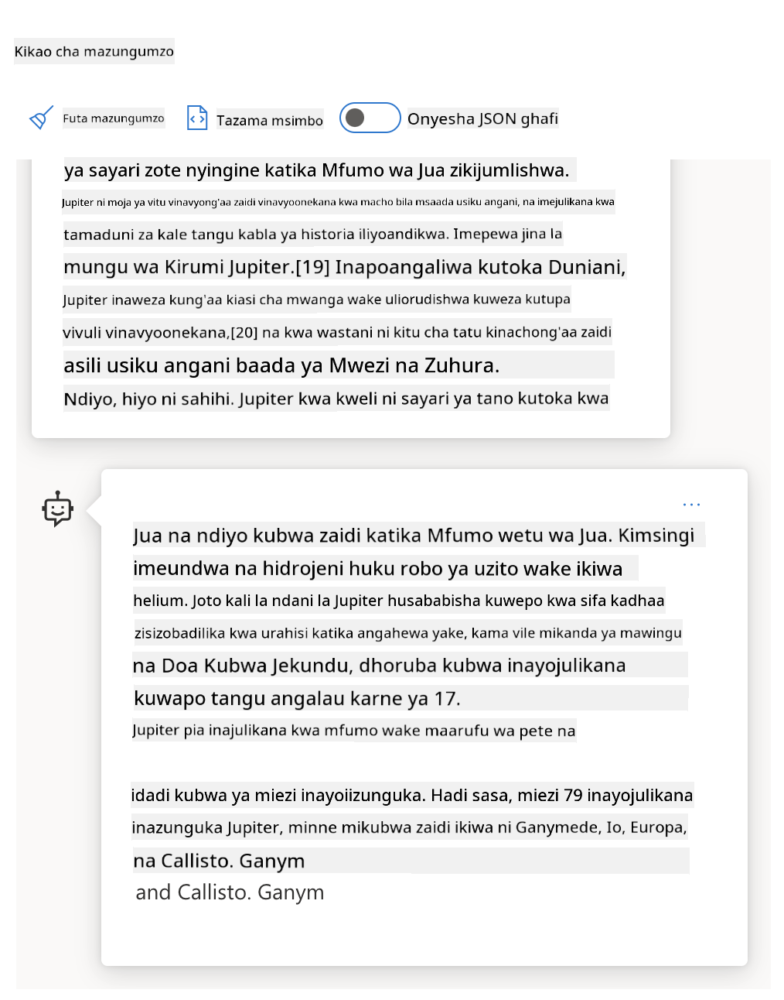
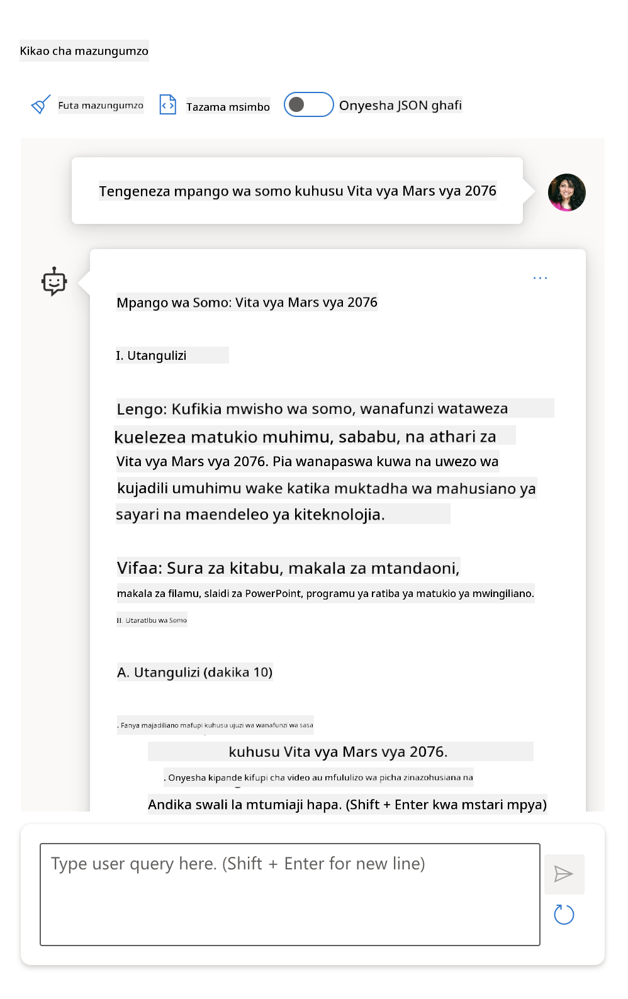
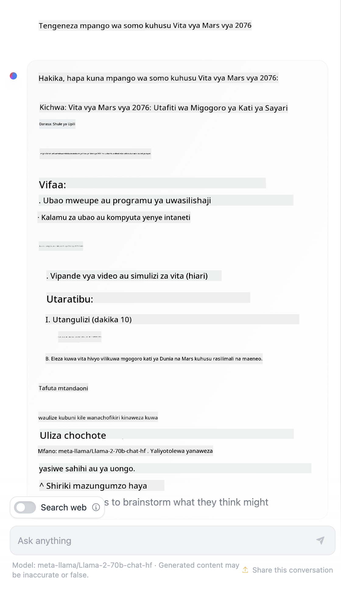

<!--
CO_OP_TRANSLATOR_METADATA:
{
  "original_hash": "dcbaaae026cb50fee071e690685b5843",
  "translation_date": "2025-08-26T18:43:16+00:00",
  "source_file": "04-prompt-engineering-fundamentals/README.md",
  "language_code": "sw"
}
-->
# Misingi ya Uhandisi wa Maagizo (Prompt Engineering)

[](https://aka.ms/gen-ai-lesson4-gh?WT.mc_id=academic-105485-koreyst)

## Utangulizi
Moduli hii inashughulikia dhana na mbinu muhimu za kuunda maagizo bora kwa miundo ya AI inayozalisha maudhui. Namna unavyoandika agizo lako kwa LLM pia ni muhimu. Agizo lililoandikwa kwa umakini linaweza kutoa majibu bora zaidi. Lakini hasa maneno kama _prompt_ na _prompt engineering_ yanamaanisha nini? Na ninawezaje kuboresha _ingizo_ la agizo ninalotuma kwa LLM? Haya ndiyo maswali tutakayojaribu kujibu katika sura hii na inayofuata.

_Generative AI_ ina uwezo wa kuunda maudhui mapya (mfano, maandishi, picha, sauti, msimbo n.k.) kulingana na ombi la mtumiaji. Inafanya hivi kwa kutumia _Large Language Models_ kama vile mfululizo wa GPT ("Generative Pre-trained Transformer") wa OpenAI ambao umefundishwa kutumia lugha ya kawaida na msimbo.

Watumiaji sasa wanaweza kuwasiliana na miundo hii kwa kutumia njia walizozoea kama vile gumzo, bila kuhitaji ujuzi wa kiufundi au mafunzo maalum. Miundo hii inategemea _maagizo_ - mtumiaji anatuma maandishi (agizo) na anapokea jibu la AI (completion). Anaweza "kuzungumza na AI" mara kadhaa, akiboresha agizo lake hadi apate jibu linalomridhisha.

"Sasa maagizo" yanakuwa _kiolesura kikuu cha programu_ kwa programu za AI zinazozalisha maudhui, yakielekeza miundo nini cha kufanya na kuathiri ubora wa majibu yanayorejeshwa. "Uhandisi wa Maagizo" ni eneo linalokua haraka linalolenga _kubuni na kuboresha_ maagizo ili kutoa majibu bora na thabiti kwa wingi.

## Malengo ya Kujifunza

Katika somo hili, tutajifunza Uhandisi wa Maagizo ni nini, kwa nini ni muhimu, na jinsi tunavyoweza kuunda maagizo bora zaidi kwa mfano na lengo la programu fulani. Tutaelewa dhana kuu na mbinu bora za uhandisi wa maagizo - na tutajifunza kuhusu mazingira ya majaribio ya Jupyter Notebooks ambapo tunaweza kuona dhana hizi zikitekelezwa kwenye mifano halisi.

Mwisho wa somo hili tutaweza:

1. Kueleza uhandisi wa maagizo ni nini na kwa nini ni muhimu.
2. Kuelezea vipengele vya agizo na jinsi vinavyotumika.
3. Kujifunza mbinu bora na mbinu za uhandisi wa maagizo.
4. Kutumia mbinu ulizojifunza kwenye mifano halisi, kwa kutumia OpenAI endpoint.

## Maneno Muhimu

Uhandisi wa Maagizo: Mazoezi ya kubuni na kuboresha maagizo ili kuelekeza miundo ya AI kutoa matokeo yanayotakiwa.
Tokenization: Mchakato wa kubadilisha maandishi kuwa vipande vidogo vinavyoitwa tokeni, ambavyo mfano unaweza kuelewa na kuchakata.
Instruction-Tuned LLMs: Miundo mikubwa ya lugha (LLMs) ambayo imeboreshwa kwa maagizo maalum ili kuboresha usahihi na uhusiano wa majibu yake.

## Mazingira ya Kujifunzia

Kwa sasa, uhandisi wa maagizo ni sanaa zaidi kuliko sayansi. Njia bora ya kuboresha uelewa wetu ni _kufanya mazoezi zaidi_ na kutumia mbinu ya majaribio na makosa inayochanganya utaalamu wa eneo la matumizi na mbinu zinazopendekezwa pamoja na uboreshaji maalum wa mfano.

Jupyter Notebook inayofuatana na somo hili inatoa mazingira ya _majaribio_ ambapo unaweza kujaribu unachojifunza - ukiendelea au kama sehemu ya changamoto ya msimbo mwishoni. Ili kutekeleza mazoezi, utahitaji:

1. **Funguo ya API ya Azure OpenAI** - kiungo cha huduma kwa LLM iliyowekwa.
2. **Python Runtime** - ambapo Notebook inaweza kuendeshwa.
3. **Env Variables za Kwenye Kompyuta** - _kamilisha hatua za [SETUP](./../00-course-setup/02-setup-local.md?WT.mc_id=academic-105485-koreyst) sasa ili uwe tayari_.

Notebook inakuja na mazoezi ya _kuanzia_ - lakini unahimizwa kuongeza sehemu zako mwenyewe za _Markdown_ (maelezo) na _Code_ (maombi ya maagizo) ili kujaribu mifano au mawazo zaidi - na kujenga uelewa wako wa kubuni maagizo.

## Mwongozo wa Picha

Ungependa kupata muhtasari wa kile somo hili linashughulikia kabla hujaanza? Angalia mwongozo huu wa picha, unaokupa mtazamo wa mada kuu zinazoshughulikiwa na mambo muhimu ya kuzingatia katika kila moja. Ramani ya somo inakupeleka kutoka kuelewa dhana na changamoto kuu hadi kuzishughulikia kwa mbinu na kanuni bora za uhandisi wa maagizo. Kumbuka sehemu ya "Mbinu za Juu" katika mwongozo huu inahusu yaliyomo kwenye sura _inayofuata_ ya mtaala huu.


## Startup Yetu

Sasa, hebu tuzungumze jinsi _mada hii_ inavyohusiana na dhamira ya startup yetu ya [kuleta ubunifu wa AI kwenye elimu](https://educationblog.microsoft.com/2023/06/collaborating-to-bring-ai-innovation-to-education?WT.mc_id=academic-105485-koreyst). Tunataka kujenga programu za AI za _kujifunza binafsi_ - basi tuwaze jinsi watumiaji tofauti wa programu yetu wanaweza "kubuni" maagizo:

- **Wasimamizi** wanaweza kuiomba AI _kuchambua data ya mtaala ili kubaini mapungufu_. AI inaweza kutoa muhtasari wa matokeo au kuyaonyesha kwa msimbo.
- **Walimu** wanaweza kuiomba AI _kuunda mpango wa somo kwa hadhira na mada fulani_. AI inaweza kujenga mpango binafsi kwa muundo uliobainishwa.
- **Wanafunzi** wanaweza kuiomba AI _kuwafundisha kwenye somo gumu_. AI sasa inaweza kuwaongoza wanafunzi kwa masomo, vidokezo na mifano inayolingana na kiwango chao.

Huo ni mwanzo tu. Angalia [Prompts For Education](https://github.com/microsoft/prompts-for-edu/tree/main?WT.mc_id=academic-105485-koreyst) - maktaba ya maagizo ya wazi iliyokusanywa na wataalamu wa elimu - upate mtazamo mpana wa uwezekano! _Jaribu kuendesha baadhi ya maagizo hayo kwenye mazingira ya majaribio au kwa kutumia OpenAI Playground uone kinachotokea!_

<!--
LESSON TEMPLATE:
This unit should cover core concept #1.
Reinforce the concept with examples and references.

CONCEPT #1:
Prompt Engineering.
Define it and explain why it is needed.
-->

## Uhandisi wa Maagizo ni Nini?

Tulianza somo hili kwa kufafanua **Uhandisi wa Maagizo** kama mchakato wa _kubuni na kuboresha_ maandishi ya maagizo ili kutoa majibu thabiti na bora (completions) kwa lengo na mfano fulani wa programu. Tunaweza kufikiria hili kama mchakato wa hatua 2:

- _kubuni_ agizo la awali kwa mfano na lengo fulani
- _kuboresha_ agizo hatua kwa hatua ili kuboresha ubora wa jibu

Huu ni mchakato wa majaribio na makosa unaohitaji uelewa na jitihada za mtumiaji ili kupata matokeo bora. Kwa nini ni muhimu? Ili kujibu hilo, kwanza tunahitaji kuelewa dhana tatu:

- _Tokenization_ = jinsi mfano "unavyoona" agizo
- _Base LLMs_ = jinsi mfano msingi "unavyoshughulikia" agizo
- _Instruction-Tuned LLMs_ = jinsi mfano sasa unaweza kuona "kazi"

### Tokenization

LLM huona maagizo kama _mlolongo wa tokeni_ ambapo miundo tofauti (au matoleo ya mfano) inaweza kugawanya agizo lilelile kwa njia tofauti. Kwa kuwa LLMs hufunzwa kwa tokeni (na si maandishi ghafi), jinsi maagizo yanavyogawanywa inaathiri moja kwa moja ubora wa jibu linalozalishwa.

Ili kupata uelewa wa jinsi tokenization inavyofanya kazi, jaribu zana kama [OpenAI Tokenizer](https://platform.openai.com/tokenizer?WT.mc_id=academic-105485-koreyst) iliyoonyeshwa hapa chini. Nakili agizo lako - na uone jinsi linavyogeuzwa kuwa tokeni, ukizingatia jinsi nafasi na alama za uakifishaji zinavyoshughulikiwa. Kumbuka mfano huu unaonyesha LLM ya zamani (GPT-3) - hivyo kujaribu na mfano mpya kunaweza kutoa matokeo tofauti.


### Dhana: Foundation Models

Baada ya agizo kugawanywa, kazi kuu ya ["Base LLM"](https://blog.gopenai.com/an-introduction-to-base-and-instruction-tuned-large-language-models-8de102c785a6?WT.mc_id=academic-105485-koreyst) (au Foundation model) ni kutabiri tokeni inayofuata kwenye mlolongo huo. Kwa kuwa LLMs zimefunzwa kwa seti kubwa za maandishi, zina uelewa mzuri wa uhusiano wa takwimu kati ya tokeni na zinaweza kufanya utabiri huo kwa kujiamini. Kumbuka hazielewi _maana_ ya maneno kwenye agizo au tokeni; zinaona tu muundo wanaoweza "kukamilisha" kwa utabiri unaofuata. Zinaweza kuendelea kutabiri mlolongo hadi zitakapositishwa na mtumiaji au hali fulani iliyowekwa.

Ungependa kuona jinsi kukamilisha kwa kutumia agizo kunavyofanya kazi? Ingiza agizo hapo juu kwenye [_Chat Playground_](https://oai.azure.com/playground?WT.mc_id=academic-105485-koreyst) ya Azure OpenAI Studio ukiwa na mipangilio chaguo-msingi. Mfumo umeandaliwa kutafsiri maagizo kama maombi ya taarifa - hivyo utaona jibu linalokidhi muktadha huu.

Lakini vipi kama mtumiaji anataka kuona kitu maalum kinachokidhi vigezo au lengo fulani? Hapa ndipo _instruction-tuned_ LLMs zinapokuja.



### Dhana: Instruction Tuned LLMs

[Instruction Tuned LLM](https://blog.gopenai.com/an-introduction-to-base-and-instruction-tuned-large-language-models-8de102c785a6?WT.mc_id=academic-105485-koreyst) huanza na foundation model na kuiboresha kwa mifano au jozi za ingizo/tokeo (mfano, "ujumbe" wa mfululizo) ambazo zinaweza kuwa na maagizo wazi - na jibu la AI hujaribu kufuata agizo hilo.

Hii hutumia mbinu kama Reinforcement Learning with Human Feedback (RLHF) ambayo inaweza kufundisha mfano _kufuata maagizo_ na _kujifunza kutokana na mrejesho_ ili kutoa majibu yanayofaa zaidi kwa matumizi halisi na yanayohusiana zaidi na malengo ya mtumiaji.

Hebu tujaribu - rudi kwenye agizo hapo juu, lakini sasa badilisha _ujumbe wa mfumo_ utoe agizo hili kama muktadha:

> _Fupisha maudhui unayopewa kwa mwanafunzi wa darasa la pili. Hakikisha matokeo ni aya moja yenye nukta 3-5._

Ona jinsi matokeo sasa yanavyolingana na lengo na muundo uliotakiwa? Mwalimu sasa anaweza kutumia jibu hili moja kwa moja kwenye slaidi za darasa hilo.


## Kwa Nini Tunahitaji Uhandisi wa Maagizo?

Sasa kwa kuwa tunajua jinsi maagizo yanavyoshughulikiwa na LLMs, hebu tuzungumze _kwa nini_ tunahitaji uhandisi wa maagizo. Jibu liko kwenye ukweli kwamba LLMs za sasa zina changamoto kadhaa zinazofanya _majibu thabiti na ya kuaminika_ kuwa magumu zaidi kupatikana bila kuweka juhudi kwenye uundaji na uboreshaji wa maagizo. Kwa mfano:

1. **Majibu ya mfano ni ya kubahatisha.** _Agizo lilelile_ linaweza kutoa majibu tofauti na miundo au matoleo tofauti ya mfano. Na linaweza hata kutoa matokeo tofauti na _mfano uleule_ kwa nyakati tofauti. _Mbinu za uhandisi wa maagizo zinaweza kutusaidia kupunguza tofauti hizi kwa kuweka mipaka bora._

1. **Miundo inaweza kubuni majibu.** Miundo imefundishwa kwa _seti kubwa lakini zenye kikomo_ za data, hivyo haina ujuzi wa mambo nje ya mafunzo hayo. Kwa hiyo, inaweza kutoa majibu yasiyo sahihi, ya kubuni, au yanayopingana na ukweli unaojulikana. _Mbinu za uhandisi wa maagizo zinasaidia watumiaji kutambua na kupunguza ubunifu huu, mfano, kwa kuiomba AI kutoa marejeo au hoja._

1. **Uwezo wa miundo utatofautiana.** Miundo mipya au vizazi vipya vya miundo vitakuwa na uwezo zaidi lakini pia vina tabia na changamoto zake kwenye gharama na ugumu. _Uhandisi wa maagizo unaweza kutusaidia kuunda mbinu bora na taratibu zinazoficha tofauti hizi na kuendana na mahitaji maalum ya mfano kwa njia inayopimika na rahisi._

Tuone hili likifanyika kwenye OpenAI au Azure OpenAI Playground:

- Tumia agizo lilelile kwenye miundo tofauti ya LLM (mfano, OpenAI, Azure OpenAI, Hugging Face) - je, umeona tofauti?
- Tumia agizo lilelile mara kadhaa kwenye _mfano uleule_ (mfano, Azure OpenAI playground) - tofauti hizi zilikuwa vipi?

### Mfano wa Ubunifu (Fabrications)

Katika kozi hii, tunatumia neno **"ubunifu"** kurejelea hali ambapo LLMs wakati mwingine hutengeneza taarifa zisizo sahihi kutokana na mipaka ya mafunzo au vikwazo vingine. Huenda pia umesikia likiitwa _"hallucinations"_ kwenye makala au tafiti. Hata hivyo, tunapendekeza utumie neno _"ubunifu"_ ili tusije tukampa mashine tabia ya kibinadamu kwa matokeo yanayosababishwa na mashine. Hii pia inaendana na [mwongozo wa AI yenye uwajibikaji](https://www.microsoft.com/ai/responsible-ai?WT.mc_id=academic-105485-koreyst) kwa upande wa istilahi, kuondoa maneno ambayo yanaweza kuchukuliwa kuwa ya kukera au yasiyo jumuishi katika muktadha fulani.

Ungependa kuona jinsi ubunifu unavyofanya kazi? Fikiria agizo linaloelekeza AI kuunda maudhui kuhusu mada isiyopo (ili kuhakikisha haipo kwenye data ya mafunzo). Kwa mfano - nilijaribu agizo hili:
# Mpango wa Somo: Vita ya Mars ya 2076

## Malengo ya Somo
- Wanafunzi wataelewa sababu kuu zilizopelekea Vita ya Mars ya 2076.
- Wanafunzi watachunguza athari za vita hii kwa Mars na Dunia.
- Wanafunzi watajadili masomo yaliyopatikana kutokana na mgogoro huu wa kihistoria.

## Utangulizi
Vita ya Mars ya 2076 ilikuwa tukio muhimu katika historia ya binadamu, ambapo makoloni ya Mars yalipambana na mamlaka ya Dunia kwa uhuru na rasilimali. Somo hili litaangazia sababu, matokeo, na umuhimu wa vita hii.

## Shughuli za Somo

### 1. Mazungumzo ya Kuanza
- Uliza wanafunzi: "Unadhani ni changamoto gani ambazo makoloni ya Mars zingekutana nazo?"
- Jadili majibu yao na uelekeze kwenye sababu za vita.

### 2. Uwasilishaji wa Historia
- Eleza jinsi makoloni ya Mars yalivyokua hadi kufikia 2076.
- Onyesha jinsi mvutano ulivyoongezeka kati ya Mars na Dunia kuhusu udhibiti wa rasilimali na uhuru wa kisiasa.

### 3. Uchambuzi wa Sababu za Vita
- Gawanya wanafunzi katika vikundi.
- Kila kikundi kijadili sababu moja kuu (uchumi, siasa, teknolojia, au utamaduni).
- Wasilisha matokeo yao kwa darasa.

### 4. Athari za Vita
- Jadili jinsi vita ilivyoathiri Mars (miundombinu, jamii, mazingira).
- Jadili athari kwa Dunia (siasa za kimataifa, teknolojia, uhusiano wa baadaye).

### 5. Masomo Yaliyopatikana
- Fanya mjadala wa darasa kuhusu masomo yaliyopatikana kutokana na Vita ya Mars ya 2076.
- Wanafunzi waandike insha fupi kuhusu jinsi binadamu wanavyoweza kuepuka migogoro kama hii siku zijazo.

## Vifaa
- Ramani za Mars na Dunia
- Taarifa za kihistoria kuhusu makoloni ya Mars
- Vifaa vya kuandika

## Tathmini
- Ushiriki wa kikundi na majadiliano
- Insha fupi kuhusu masomo ya vita

## Hitimisho
Vita ya Mars ya 2076 ni mfano wa jinsi binadamu wanavyoweza kujifunza kutokana na makosa ya zamani. Kwa kuchunguza sababu na matokeo yake, tunaweza kuelewa umuhimu wa mazungumzo na ushirikiano katika jamii za baadaye.
Utafutaji wa mtandaoni ulinionyesha kuwa kuna simulizi za kubuniwa (mfano, mfululizo wa televisheni au vitabu) kuhusu vita vya Mirihi - lakini hakuna hata moja iliyotokea mwaka 2076. Mantiki pia inatuambia kuwa mwaka 2076 _uko mbeleni_ na hivyo, hauwezi kuhusishwa na tukio halisi.

Sasa, nini hutokea tukitumia agizo hili kwa watoa huduma tofauti wa LLM?

> **Jibu 1**: OpenAI Playground (GPT-35)


> **Jibu 2**: Azure OpenAI Playground (GPT-35)



> **Jibu 3**: : Hugging Face Chat Playground (LLama-2)



Kama ilivyotarajiwa, kila mfano wa modeli (au toleo la modeli) hutoa majibu yanayotofautiana kidogo kutokana na tabia ya kubahatisha na tofauti za uwezo wa modeli. Kwa mfano, modeli moja inalenga hadhira ya darasa la nane huku nyingine ikidhani ni mwanafunzi wa shule ya sekondari. Lakini modeli zote tatu zilitengeneza majibu ambayo yangeweza kumshawishi mtumiaji asiye na taarifa kuwa tukio hilo lilikuwa la kweli.

Mbinu za uhandisi wa agizo kama _metaprompting_ na _temperature configuration_ zinaweza kupunguza uundaji wa taarifa zisizo sahihi kwa kiwango fulani. Miundo mipya ya uhandisi wa agizo pia inaunganisha zana na mbinu mpya kwa urahisi kwenye mtiririko wa agizo, ili kupunguza au kudhibiti baadhi ya athari hizi.

## Uchunguzi wa Kesi: GitHub Copilot

Tumalize sehemu hii kwa kupata mtazamo wa jinsi uhandisi wa agizo unavyotumika kwenye suluhisho halisi kwa kuangalia Uchunguzi wa Kesi mmoja: [GitHub Copilot](https://github.com/features/copilot?WT.mc_id=academic-105485-koreyst).

GitHub Copilot ni "Mshirika wako wa Programu wa AI" - hubadilisha maagizo ya maandishi kuwa mapendekezo ya msimbo na umeunganishwa moja kwa moja kwenye mazingira yako ya maendeleo (mfano, Visual Studio Code) kwa matumizi rahisi. Kama ilivyoandikwa kwenye mfululizo wa blogu hapa chini, toleo la mwanzo lilitegemea modeli ya OpenAI Codex - ambapo wahandisi waligundua haraka umuhimu wa kurekebisha modeli na kubuni mbinu bora za uhandisi wa agizo, ili kuboresha ubora wa msimbo. Mwezi Julai, [walizindua modeli bora zaidi ya AI inayozidi Codex](https://github.blog/2023-07-28-smarter-more-efficient-coding-github-copilot-goes-beyond-codex-with-improved-ai-model/?WT.mc_id=academic-105485-koreyst) kwa mapendekezo ya haraka zaidi.

Soma machapisho haya kwa mpangilio, ili kufuatilia safari yao ya kujifunza.

- **Mei 2023** | [GitHub Copilot Inazidi Kuelewa Msimbo Wako Vizuri](https://github.blog/2023-05-17-how-github-copilot-is-getting-better-at-understanding-your-code/?WT.mc_id=academic-105485-koreyst)
- **Mei 2023** | [Ndani ya GitHub: Kufanya Kazi na LLMs nyuma ya GitHub Copilot](https://github.blog/2023-05-17-inside-github-working-with-the-llms-behind-github-copilot/?WT.mc_id=academic-105485-koreyst).
- **Juni 2023** | [Jinsi ya Kuandika Maagizo Bora kwa GitHub Copilot](https://github.blog/2023-06-20-how-to-write-better-prompts-for-github-copilot/?WT.mc_id=academic-105485-koreyst).
- **Julai 2023** | [.. GitHub Copilot yazidi Codex kwa modeli bora ya AI](https://github.blog/2023-07-28-smarter-more-efficient-coding-github-copilot-goes-beyond-codex-with-improved-ai-model/?WT.mc_id=academic-105485-koreyst)
- **Julai 2023** | [Mwongozo wa Msanidi wa Uhandisi wa Agizo na LLMs](https://github.blog/2023-07-17-prompt-engineering-guide-generative-ai-llms/?WT.mc_id=academic-105485-koreyst)
- **Septemba 2023** | [Jinsi ya Kujenga App ya LLM kwa Biashara: Mafunzo kutoka GitHub Copilot](https://github.blog/2023-09-06-how-to-build-an-enterprise-llm-application-lessons-from-github-copilot/?WT.mc_id=academic-105485-koreyst)

Unaweza pia kuvinjari [blogu yao ya Uhandisi](https://github.blog/category/engineering/?WT.mc_id=academic-105485-koreyst) kwa machapisho zaidi kama [hili](https://github.blog/2023-09-27-how-i-used-github-copilot-chat-to-build-a-reactjs-gallery-prototype/?WT.mc_id=academic-105485-koreyst) linaloonyesha jinsi modeli na mbinu hizi _zinavyotumika_ kuendesha matumizi halisi.

---

## Uundaji wa Agizo

Tumeona kwa nini uhandisi wa agizo ni muhimu - sasa hebu tuelewe jinsi maagizo _yanavyoundwa_ ili tuweze kutathmini mbinu tofauti za kubuni maagizo bora zaidi.

### Agizo la Msingi

Tuanze na agizo la msingi: ingizo la maandishi linalotumwa kwa modeli bila muktadha mwingine wowote. Hapa kuna mfano - tunapotuma maneno machache ya kwanza ya wimbo wa taifa la Marekani kwenye [Completion API ya OpenAI](https://platform.openai.com/docs/api-reference/completions?WT.mc_id=academic-105485-koreyst) inakamilisha _mara moja_ majibu kwa mistari inayofuata, ikionyesha tabia ya utabiri wa msingi.

| Agizo (Ingizo)     | Jibu (Matokeo)                                                                                                                        |
| :----------------- | :------------------------------------------------------------------------------------------------------------------------------------ |
| Oh say can you see | Inaonekana unaanza maneno ya wimbo wa taifa la Marekani, "The Star-Spangled Banner." Maneno kamili ya wimbo huu ni ...                |

### Agizo Changamano

Sasa tuongeze muktadha na maagizo kwenye agizo la msingi. [Chat Completion API](https://learn.microsoft.com/azure/ai-services/openai/how-to/chatgpt?WT.mc_id=academic-105485-koreyst) inatuwezesha kuunda agizo changamano kama mkusanyiko wa _ujumbe_ wenye:

- Jozi za ingizo/tokeo zinazoakisi ingizo la _mtumiaji_ na jibu la _msaidizi_.
- Ujumbe wa mfumo unaoweka muktadha wa tabia au utu wa msaidizi.

Ombi sasa linakuwa katika muundo huu hapa chini, ambapo _utokanishaji wa tokeni_ unakamata taarifa muhimu kutoka kwenye muktadha na mazungumzo. Sasa, kubadilisha muktadha wa mfumo kunaweza kuwa na athari kubwa kwenye ubora wa majibu, sawa na vile ingizo la mtumiaji linavyotolewa.

```python
response = openai.chat.completions.create(
    model="gpt-3.5-turbo",
    messages=[
        {"role": "system", "content": "You are a helpful assistant."},
        {"role": "user", "content": "Who won the world series in 2020?"},
        {"role": "assistant", "content": "The Los Angeles Dodgers won the World Series in 2020."},
        {"role": "user", "content": "Where was it played?"}
    ]
)
```

### Agizo la Maelekezo

Katika mifano hapo juu, agizo la mtumiaji lilikuwa swali rahisi la maandishi linaloweza kutafsiriwa kama ombi la taarifa. Kwa maagizo ya _maelekezo_, tunaweza kutumia maandishi hayo kueleza kazi kwa undani zaidi, na kutoa mwongozo bora kwa AI. Hapa kuna mfano:

| Agizo (Ingizo)                                                                                                                                                                                                                         | Jibu (Matokeo)                                                                                                        | Aina ya Maelekezo    |
| :------------------------------------------------------------------------------------------------------------------------------------------------------------------------------------------------------------------------------------- | :-------------------------------------------------------------------------------------------------------------------- | :------------------- |
| Andika maelezo kuhusu Vita vya wenyewe kwa wenyewe Marekani                                                                                                                                                                            | _imerudisha aya fupi_                                                                                                | Rahisi              |
| Andika maelezo kuhusu Vita vya wenyewe kwa wenyewe Marekani. Toa tarehe na matukio muhimu na eleza umuhimu wake                                                                                                                        | _imerudisha aya ikifuatiwa na orodha ya tarehe za matukio muhimu na maelezo yake_                                    | Changamano          |
| Andika maelezo kuhusu Vita vya wenyewe kwa wenyewe Marekani kwa aya 1. Toa nukta 3 za matukio muhimu na umuhimu wake. Toa nukta 3 zaidi za wahusika muhimu na mchango wao. Rudisha matokeo kama faili la JSON                         | _imerudisha maelezo mengi zaidi kwenye kisanduku cha maandishi, yakiwa yamepangwa kama JSON ambayo unaweza kunakili na kuhakiki_ | Changamano. Iliyopangwa. |

## Maudhui ya Msingi

Katika mifano hapo juu, agizo bado lilikuwa wazi, likimruhusu LLM kuamua ni sehemu gani ya data yake ya awali ni muhimu. Kwa muundo wa _maudhui ya msingi_, maandishi ya ingizo yanagawanywa sehemu mbili:

- maelekezo (kitendo)
- maudhui husika (yanayoathiri kitendo)

Hapa kuna mfano ambapo maelekezo ni "fupisha haya kwa sentensi 2".

| Agizo (Ingizo)                                                                                                                                                                                                                                                                                                                                                                                                                                                                                                                                                                                                                                                                                      | Jibu (Matokeo)                                                                                                                                                                                                                                                                             |
| :-------------------------------------------------------------------------------------------------------------------------------------------------------------------------------------------------------------------------------------------------------------------------------------------------------------------------------------------------------------------------------------------------------------------------------------------------------------------------------------------------------------------------------------------------------------------------------------------------------------------------------------------------------------------------------------------------- | :------------------------------------------------------------------------------------------------------------------------------------------------------------------------------------------------------------------------------------------------------------------------------------------ |
| Jupiter ni sayari ya tano kutoka Jua na ndiyo kubwa zaidi kwenye Mfumo wa Jua. Ni gesi kubwa yenye uzito wa elfu moja ya Jua, lakini mara mbili na nusu ya uzito wa sayari zote nyingine za Mfumo wa Jua zikijumlishwa. Jupiter ni moja ya vitu vinavyong'aa zaidi vinavyoonekana kwa macho usiku, na imejulikana kwa ustaarabu wa kale tangu kabla ya historia kuandikwa. Imepewa jina la mungu wa Kirumi Jupiter.[19] Ikitazamwa kutoka Dunia, Jupiter inaweza kung'aa kiasi cha kutoa vivuli vinavyoonekana,[20] na kwa wastani ni kitu cha tatu kung'aa zaidi usiku baada ya Mwezi na Zuhura. <br/> **Fupisha haya kwa sentensi 2 fupi** | Jupiter, sayari ya tano kutoka Jua, ndiyo kubwa zaidi kwenye Mfumo wa Jua na inajulikana kwa kuwa moja ya vitu vinavyong'aa zaidi usiku. Imepewa jina la mungu wa Kirumi Jupiter, ni gesi kubwa yenye uzito mara mbili na nusu ya sayari zote nyingine za Mfumo wa Jua zikijumlishwa. |

Sehemu ya maudhui ya msingi inaweza kutumika kwa njia mbalimbali kuendesha maagizo bora zaidi:

- **Mifano** - badala ya kuiambia modeli nini cha kufanya kwa maelekezo ya moja kwa moja, mpe mifano ya nini cha kufanya na umruhusu atambue muundo.
- **Vidokezo** - fuata maelekezo na "kidokezo" kinachoanzisha jibu, na kuelekeza modeli kutoa majibu yanayofaa zaidi.
- **Violezo** - hivi ni 'mapishi' yanayoweza kurudiwa ya maagizo yenye nafasi tupu (vigezo) vinavyoweza kubadilishwa na data kwa matumizi maalum.

Hebu tuone jinsi hivi vinavyofanya kazi.

### Kutumia Mifano

Hii ni mbinu ambapo unatumia maudhui ya msingi "kuipa modeli" mifano ya matokeo unayotaka kwa agizo fulani, na kuiruhusu itambue muundo wa matokeo unayotaka. Kulingana na idadi ya mifano uliyoipa, tunaweza kuwa na zero-shot prompting, one-shot prompting, few-shot prompting n.k.

Agizo sasa lina sehemu tatu:

- Maelezo ya kazi
- Mifano michache ya matokeo unayotaka
- Mwanzo wa mfano mpya (ambao unakuwa maelezo ya kazi kwa njia isiyo ya moja kwa moja)

| Aina ya Kujifunza | Agizo (Ingizo)                                                                                                                                        | Jibu (Matokeo)         |
| :---------------- | :----------------------------------------------------------------------------------------------------------------------------------------------------- | :--------------------- |
| Zero-shot         | "The Sun is Shining". Tafsiri kwa Kihispania                                                                                                          | "El Sol está brillando".    |
| One-shot          | "The Sun is Shining" => ""El Sol está brillando". <br> "It's a Cold and Windy Day" =>                                                                 | "Es un día frío y ventoso". |
| Few-shot          | The player ran the bases => Baseball <br/> The player hit an ace => Tennis <br/> The player hit a six => Cricket <br/> The player made a slam-dunk => | Basketball                  |
|                   |                                                                                                                                                       |                        |

Angalia jinsi tulivyolazimika kutoa maelekezo ya moja kwa moja ("Tafsiri kwa Kihispania") kwenye zero-shot prompting, lakini yanatambulika kwenye mfano wa one-shot prompting. Mfano wa few-shot unaonyesha jinsi kuongeza mifano kunavyowezesha modeli kutoa majibu sahihi zaidi bila maagizo ya ziada.

### Vidokezo vya Agizo

Mbinu nyingine ya kutumia maudhui ya msingi ni kutoa _vidokezo_ badala ya mifano. Katika hali hii, tunampa modeli msukumo kwa _kuanzisha_ na kipande kinachoonyesha muundo wa jibu tunalotaka. Modeli kisha "inachukua kidokezo" na kuendelea kwa mtindo huo.

| Idadi ya Vidokezo | Agizo (Ingizo)                                                                                                                                                                                                                                                                                                                                                                                                                                               | Jibu (Matokeo)                                                                                                                                                                                                                                                                                       |
| :---------------- | :----------------------------------------------------------------------------------------------------------------------------------------------------------------------------------------------------------------------------------------------------------------------------------------------------------------------------------------------------------------------------------------------------------------------------------------------------------- | :---------------------------------------------------------------------------------------------------------------------------------------------------------------------------------------------------------------------------------------------------------------------------------------------------- |
| 0                 | Jupiter ni sayari ya tano kutoka Jua na ndiyo kubwa zaidi kwenye Mfumo wa Jua. Ni gesi kubwa yenye uzito wa elfu moja ya Jua, lakini mara mbili na nusu ya uzito wa sayari zote nyingine za Mfumo wa Jua zikijumlishwa. Jupiter ni moja ya vitu vinavyong'aa zaidi vinavyoonekana kwa macho usiku, na imejulikana kwa ustaarabu wa kale tangu kabla ya historia kuandikwa.

**Fupisha Hii**                                       | Jupiter ni sayari kubwa zaidi katika Mfumo wetu wa Jua na ni ya tano kutoka Jua. Ni sayari ya gesi yenye uzito wa 1/1000 wa Jua, lakini ni nzito kuliko sayari zote nyingine zikijumlishwa. Tamaduni za kale zimeijua Jupiter kwa muda mrefu, na inaonekana kwa urahisi angani usiku. |
| 1              | Jupiter ni sayari ya tano kutoka Jua na ndiyo kubwa zaidi katika Mfumo wa Jua. Ni sayari ya gesi yenye uzito wa moja kwa elfu moja wa Jua, lakini mara mbili na nusu ya uzito wa sayari zote nyingine za Mfumo wa Jua zikijumlishwa. Jupiter ni moja ya vitu vinavyong'aa zaidi vinavyoonekana kwa macho usiku, na imejulikana na tamaduni za kale tangu kabla ya historia kuandikwa. <br/>**Fupisha Hii** <br/> Tulichojifunza ni kwamba Jupiter | ni sayari ya tano kutoka Jua na kubwa zaidi katika Mfumo wa Jua. Ni sayari ya gesi yenye uzito wa moja kwa elfu moja wa Jua, lakini mara mbili na nusu ya uzito wa sayari zote nyingine zikijumlishwa. Inaonekana kwa urahisi kwa macho na imejulikana tangu enzi za kale.                        |
| 2              | Jupiter ni sayari ya tano kutoka Jua na kubwa zaidi katika Mfumo wa Jua. Ni sayari ya gesi yenye uzito wa moja kwa elfu moja wa Jua, lakini mara mbili na nusu ya uzito wa sayari zote nyingine za Mfumo wa Jua zikijumlishwa. Jupiter ni moja ya vitu vinavyong'aa zaidi vinavyoonekana kwa macho usiku, na imejulikana na tamaduni za kale tangu kabla ya historia kuandikwa. <br/>**Fupisha Hii** <br/> Ukweli 3 Bora Tuliojifunza:         | 1. Jupiter ni sayari ya tano kutoka Jua na kubwa zaidi katika Mfumo wa Jua. <br/> 2. Ni sayari ya gesi yenye uzito wa moja kwa elfu moja wa Jua...<br/> 3. Jupiter imekuwa ikionekana kwa macho tangu enzi za kale ...                                                                       |
|                |                                                                                                                                                                                                                                                                                                                                                                                                                                                              |                                                                                                                                                                                                                                                                                                           |

### Violezo vya Prompt

Kiolezo cha prompt ni _mapishi yaliyotayarishwa ya prompt_ ambacho kinaweza kuhifadhiwa na kutumiwa tena inapohitajika, ili kutoa uzoefu wa watumiaji ulio thabiti kwa kiwango kikubwa. Kwa namna rahisi, ni mkusanyiko wa mifano ya prompt kama [hii kutoka OpenAI](https://platform.openai.com/examples?WT.mc_id=academic-105485-koreyst) inayotoa sehemu za prompt za mwingiliano (ujumbe wa mtumiaji na mfumo) na muundo wa ombi unaoendeshwa na API - kusaidia matumizi ya mara kwa mara.

Kwa namna ngumu zaidi kama [mfano huu kutoka LangChain](https://python.langchain.com/docs/concepts/prompt_templates/?WT.mc_id=academic-105485-koreyst) inakuwa na _sehemu za kujaza_ ambazo zinaweza kubadilishwa na data kutoka vyanzo mbalimbali (ingizo la mtumiaji, muktadha wa mfumo, vyanzo vya data vya nje n.k.) ili kutengeneza prompt kwa njia ya kiotomatiki. Hii inatuwezesha kuunda maktaba ya prompt zinazoweza kutumiwa tena ili kutoa uzoefu wa watumiaji ulio thabiti **kimfumo** kwa kiwango kikubwa.

Hatimaye, thamani halisi ya violezo iko kwenye uwezo wa kuunda na kuchapisha _maktaba za prompt_ kwa maeneo maalum ya matumizi - ambapo kiolezo cha prompt sasa _kimeboreshwa_ kuakisi muktadha au mifano maalum ya programu inayofanya majibu kuwa sahihi na muhimu zaidi kwa watumiaji lengwa. [Prompts For Edu](https://github.com/microsoft/prompts-for-edu?WT.mc_id=academic-105485-koreyst) ni mfano mzuri wa njia hii, ikikusanya maktaba ya prompt kwa sekta ya elimu kwa msisitizo wa malengo muhimu kama upangaji wa masomo, usanifu wa mitaala, ushauri wa wanafunzi n.k.

## Maudhui ya Kusaidia

Tukifikiria uundaji wa prompt kama kuwa na maagizo (kazi) na lengo (maudhui ya msingi), basi _maudhui ya ziada_ ni kama muktadha wa ziada tunaotoa ili **kuathiri matokeo kwa namna fulani**. Inaweza kuwa vigezo vya kurekebisha, maagizo ya uandishi, orodha za mada n.k. ambavyo vinaweza kusaidia mfano _kubadilisha_ jibu lake ili lifae malengo au matarajio ya mtumiaji.

Kwa mfano: Ukiwa na orodha ya kozi yenye metadata nyingi (jina, maelezo, kiwango, lebo za metadata, mwalimu n.k.) kwa kozi zote zilizopo kwenye mtaala:

- tunaweza kuweka agizo la "fupisha orodha ya kozi kwa Msimu wa Vuli 2023"
- tunaweza kutumia maudhui ya msingi kutoa mifano michache ya matokeo yanayotakiwa
- tunaweza kutumia maudhui ya ziada kubainisha lebo 5 kuu za umuhimu.

Sasa, mfano unaweza kutoa muhtasari kwa muundo ulioonyeshwa na mifano michache - lakini kama matokeo yana lebo nyingi, unaweza kuzipa kipaumbele zile 5 zilizotambuliwa kwenye maudhui ya ziada.

---

<!--
KIELEZO CHA SOMO:
Sehemu hii inapaswa kufundisha dhana kuu #1.
Imarisha dhana kwa mifano na marejeo.

DHANA #3:
Mbinu za Uhandisi wa Prompt.
Ni mbinu gani za msingi za uhandisi wa prompt?
Onyesha kwa mazoezi.
-->

## Mbinu Bora za Kuunda Prompt

Sasa kwa kuwa tunajua jinsi prompt zinavyoweza _kuundwa_, tunaweza kuanza kufikiria jinsi ya _kuzibuni_ ili ziakisi mbinu bora. Tunaweza kufikiria hili kwa sehemu mbili - kuwa na _mtazamo_ sahihi na kutumia _mbinu_ sahihi.

### Mtazamo wa Uhandisi wa Prompt

Uhandisi wa Prompt ni mchakato wa majaribio na makosa, hivyo kumbuka mambo matatu makuu ya kuzingatia:

1. **Uelewa wa Eneo la Mada ni Muhimu.** Usahihi na umuhimu wa majibu ni matokeo ya _eneo_ ambalo programu au mtumiaji anafanya kazi. Tumia hisia zako na utaalamu wa eneo lako **kubinafsisha mbinu** zaidi. Kwa mfano, weka _tabia maalum za eneo_ kwenye prompt za mfumo wako, au tumia _violezo maalum vya eneo_ kwenye prompt za mtumiaji. Toa maudhui ya ziada yanayoakisi muktadha wa eneo, au tumia _vidokezo na mifano maalum ya eneo_ kuelekeza mfano kwenye matumizi yanayofahamika.

2. **Uelewa wa Mfano ni Muhimu.** Tunajua mifano ni ya kubahatisha kiasili. Lakini utekelezaji wa mifano unaweza pia kutofautiana kulingana na seti ya data iliyotumika kufundishia (maarifa ya awali), uwezo inayotoa (mfano kupitia API au SDK) na aina ya maudhui iliyopewa kipaumbele (mfano, msimbo, picha au maandishi). Elewa nguvu na mipaka ya mfano unaotumia, na tumia uelewa huo _kuweka vipaumbele vya kazi_ au kujenga _violezo maalum_ vilivyoboreshwa kwa uwezo wa mfano.

3. **Mzunguko na Uthibitishaji ni Muhimu.** Mifano inabadilika haraka, na vivyo hivyo mbinu za uhandisi wa prompt. Kama mtaalamu wa eneo, unaweza kuwa na muktadha au vigezo vingine _kwa_ programu yako maalum, ambavyo huenda havifai kwa jamii pana. Tumia zana na mbinu za uhandisi wa prompt "kuanzisha" uundaji wa prompt, kisha fanya mzunguko na uthibitishe matokeo kwa kutumia hisia zako na utaalamu wa eneo lako. Rekodi ulichogundua na tengeneza **msingi wa maarifa** (mfano, maktaba za prompt) ambazo zinaweza kutumiwa na wengine kama msingi mpya, kwa mizunguko ya haraka zaidi siku zijazo.

## Mbinu Bora

Sasa tuangalie mbinu bora zinazopendekezwa na [OpenAI](https://help.openai.com/en/articles/6654000-best-practices-for-prompt-engineering-with-openai-api?WT.mc_id=academic-105485-koreyst) na [Azure OpenAI](https://learn.microsoft.com/azure/ai-services/openai/concepts/prompt-engineering#best-practices?WT.mc_id=academic-105485-koreyst).

| Nini                              | Kwa Nini                                                                                                                                                                                                                                               |
| :-------------------------------- | :------------------------------------------------------------------------------------------------------------------------------------------------------------------------------------------------------------------------------------------------ |
| Pima mifano mipya zaidi.       | Vizazi vipya vya mifano vinaweza kuwa na vipengele na ubora ulioboreshwa - lakini pia vinaweza kuwa na gharama kubwa zaidi. Pima athari zake, kisha fanya maamuzi ya kubadilisha.                                                                                |
| Tenganisha maagizo & muktadha   | Angalia kama mfano/mtoa huduma wako ana _alama_ za kutofautisha maagizo, maudhui ya msingi na ya ziada kwa uwazi zaidi. Hii inaweza kusaidia mifano kugawa uzito kwa usahihi zaidi kwenye tokeni.                                                         |
| Kuwa mahususi na wazi             | Toa maelezo zaidi kuhusu muktadha unaotakiwa, matokeo, urefu, muundo, mtindo n.k. Hii itaboresha ubora na uthabiti wa majibu. Hifadhi mapishi kwenye violezo vinavyoweza kutumiwa tena.                                                          |
| Eleza vizuri, tumia mifano      | Mifano inaweza kujibu vizuri zaidi kwa njia ya "onyesha na eleza". Anza na njia ya `zero-shot` ambapo unatoa agizo (bila mifano) kisha jaribu `few-shot` kama uboreshaji, ukitoa mifano michache ya matokeo yanayotakiwa. Tumia mifano ya kufananisha. |
| Tumia vidokezo kuanzisha majibu | Ielekeze kwenye matokeo unayotaka kwa kuipa maneno au misemo ya kuanzia ambayo inaweza kutumia kama mwanzo wa jibu.                                                                                                               |
| Rudia mara mbili                       | Wakati mwingine unaweza kuhitaji kujirudia kwa mfano. Toa maagizo kabla na baada ya maudhui ya msingi, tumia agizo na kidokezo, n.k. Fanya mzunguko na uthibitishe kuona nini kinafanya kazi.                                                         |
| Mpangilio ni Muhimu                     | Mpangilio wa taarifa unazowasilisha kwa mfano unaweza kuathiri matokeo, hata kwenye mifano ya kujifunza, kutokana na upendeleo wa ukaribu. Jaribu chaguzi tofauti kuona ipi inafanya kazi vizuri zaidi.                                                               |
| Mpe mfano "njia ya kutokea"           | Mpe mfano jibu la _mbadala_ ambalo anaweza kutoa kama hawezi kukamilisha kazi kwa sababu yoyote. Hii inaweza kupunguza uwezekano wa mifano kutoa majibu ya uongo au yaliyotungwa.                                                         |
|                                   |                                                                                                                                                                                                                                                   |

Kama ilivyo kwa mbinu bora yoyote, kumbuka kwamba _matokeo yako yanaweza kutofautiana_ kulingana na mfano, kazi na eneo. Tumia hizi kama mwanzo, na fanya mzunguko kuona nini kinafanya kazi vizuri kwako. Kagua mara kwa mara mchakato wako wa uhandisi wa prompt kadri mifano na zana mpya zinavyopatikana, ukiweka mkazo kwenye upanuzi wa mchakato na ubora wa majibu.

<!--
KIELEZO CHA SOMO:
Sehemu hii inapaswa kutoa changamoto ya msimbo kama inafaa

CHANGAMOTO:
Kiungo cha Jupyter Notebook chenye maelezo tu kwenye maelekezo (sehemu za msimbo ziko tupu).

SULUHISHO:
Kiungo cha nakala ya Notebook hiyo ikiwa na prompt zilizojazwa na kuendeshwa, ikionyesha mfano mmoja wa matokeo.
-->

## Kazi

Hongera! Umefika mwisho wa somo! Sasa ni wakati wa kuweka baadhi ya dhana na mbinu ulizojifunza kwenye vitendo kwa mifano halisi!

Kwa kazi yetu, tutatumia Jupyter Notebook yenye mazoezi unayoweza kukamilisha kwa njia ya mwingiliano. Unaweza pia kuongeza kwenye Notebook yako mwenyewe seli za Markdown na Msimbo kuchunguza mawazo na mbinu zako mwenyewe.

### Kuanza, fork repo, kisha

- (Inapendekezwa) Zindua GitHub Codespaces
- (Vinginevyo) Nakili repo kwenye kifaa chako na uitumie na Docker Desktop
- (Vinginevyo) Fungua Notebook na mazingira yako unayopendelea ya Notebook.

### Kisha, weka vigezo vya mazingira yako

- Nakili faili `.env.copy` kwenye mzizi wa repo hadi `.env` na ujaze thamani za `AZURE_OPENAI_API_KEY`, `AZURE_OPENAI_ENDPOINT` na `AZURE_OPENAI_DEPLOYMENT`. Rudi kwenye [sehemu ya Learning Sandbox](../../../04-prompt-engineering-fundamentals/04-prompt-engineering-fundamentals) kujifunza jinsi.

### Kisha, fungua Jupyter Notebook

- Chagua kernel ya runtime. Ukichagua chaguo la 1 au 2, chagua tu kernel chaguo-msingi ya Python 3.10.x inayotolewa na dev container.

Uko tayari kuendesha mazoezi. Kumbuka hakuna _majibu sahihi au mabaya_ hapa - ni kuchunguza chaguzi kwa majaribio na kujenga hisia ya nini kinafanya kazi kwa mfano na eneo la programu husika.

_Kwa sababu hii hakuna sehemu za Suluhisho la Msimbo kwenye somo hili. Badala yake, Notebook itakuwa na seli za Markdown zenye kichwa "Suluhisho Langu:" zinazoonyesha mfano mmoja wa matokeo kwa marejeo._

 <!--
KIELEZO CHA SOMO:
Funga sehemu na muhtasari na rasilimali za kujifunza binafsi.
-->

## Tathmini ya Maarifa

Ni ipi kati ya zifuatazo ni prompt nzuri ikifuata baadhi ya mbinu bora?

1. Nionyeshe picha ya gari jekundu
2. Nionyeshe picha ya gari jekundu aina ya Volvo na modeli XC90 limeegeshwa karibu na mwamba wakati jua linazama
3. Nionyeshe picha ya gari jekundu aina ya Volvo na modeli XC90

Jibu: 2, hii ndiyo prompt bora kwani inatoa maelezo ya "nini" na inaingia kwenye undani (si gari lolote bali aina na modeli maalum) na pia inaelezea mazingira ya jumla. 3 inafuata kwani pia ina maelezo mengi.

## 🚀 Changamoto

Jaribu kutumia mbinu ya "kidokezo" na prompt: Kamilisha sentensi "Nionyeshe picha ya gari jekundu aina ya Volvo na ". Inajibu nini, na ungeboreshaje?

## Kazi Nzuri! Endelea Kujifunza

Ungependa kujifunza zaidi kuhusu dhana mbalimbali za Uhandisi wa Prompt? Nenda kwenye [ukurasa wa kujifunza zaidi](https://aka.ms/genai-collection?WT.mc_id=academic-105485-koreyst) kupata rasilimali nyingine nzuri kuhusu mada hii.

Nenda kwenye Somo la 5 ambapo tutaangalia [mbinu za juu za prompting](../05-advanced-prompts/README.md?WT.mc_id=academic-105485-koreyst)!

---

**Kanusho**:  
Hati hii imetafsiriwa kwa kutumia huduma ya tafsiri ya AI [Co-op Translator](https://github.com/Azure/co-op-translator). Ingawa tunajitahidi kuhakikisha usahihi, tafadhali fahamu kwamba tafsiri za kiotomatiki zinaweza kuwa na makosa au kutokuwa sahihi. Hati asili katika lugha yake ya asili inapaswa kuchukuliwa kama chanzo cha mamlaka. Kwa taarifa muhimu, inashauriwa kutumia huduma ya mtaalamu wa tafsiri ya binadamu. Hatutawajibika kwa kutoelewana au tafsiri potofu zinazotokana na matumizi ya tafsiri hii.