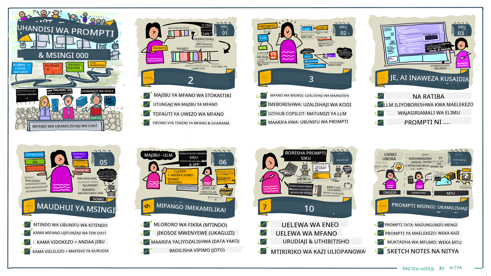

<!--
CO_OP_TRANSLATOR_METADATA:
{
  "original_hash": "0135e6c271f3ece8699050d4debbce88",
  "translation_date": "2025-10-17T21:18:08+00:00",
  "source_file": "04-prompt-engineering-fundamentals/README.md",
  "language_code": "sw"
}
-->
# Misingi ya Uhandisi wa Maelekezo

[](https://youtu.be/GElCu2kUlRs?si=qrXsBvXnCW12epb8)

## Utangulizi
Moduli hii inashughulikia dhana muhimu na mbinu za kuunda maelekezo bora kwa mifano ya AI inayozalisha. Jinsi unavyoandika maelekezo yako kwa LLM pia ni muhimu. Maelekezo yaliyoandaliwa kwa uangalifu yanaweza kufanikisha majibu bora zaidi. Lakini maneno kama _maelekezo_ na _uhandisi wa maelekezo_ yanamaanisha nini hasa? Na ninawezaje kuboresha _maelekezo_ ninayotuma kwa LLM? Haya ni maswali tutakayojaribu kujibu ndani ya sura hii na inayofuata.

_AI inayozalisha_ ina uwezo wa kuunda maudhui mapya (mfano, maandishi, picha, sauti, nambari n.k.) kwa kujibu maombi ya mtumiaji. Inafanikisha hili kwa kutumia _Mifano Mikubwa ya Lugha_ kama mfululizo wa GPT ("Generative Pre-trained Transformer") wa OpenAI ambao umefundishwa kutumia lugha ya asili na nambari.

Watumiaji sasa wanaweza kuwasiliana na mifano hii kwa kutumia mifumo inayofahamika kama mazungumzo, bila kuhitaji utaalamu wa kiufundi au mafunzo. Mifano hii ni _inayotegemea maelekezo_ - watumiaji hutuma maandishi (maelekezo) na kupata majibu ya AI (ukamilishaji). Kisha wanaweza "kuzungumza na AI" mara kwa mara, katika mazungumzo ya mizunguko mingi, wakiboresha maelekezo yao hadi majibu yatakapolingana na matarajio yao.

"Maelekezo" sasa yanakuwa kiolesura cha msingi cha _programu_ kwa programu za AI zinazozalisha, zikieleza mifano nini cha kufanya na kuathiri ubora wa majibu yanayorejeshwa. "Uhandisi wa Maelekezo" ni uwanja unaokua haraka wa masomo unaozingatia _muundo na uboreshaji_ wa maelekezo ili kutoa majibu thabiti na bora kwa kiwango kikubwa.

## Malengo ya Kujifunza

Katika somo hili, tunajifunza uhandisi wa maelekezo ni nini, kwa nini ni muhimu, na jinsi tunavyoweza kuunda maelekezo bora zaidi kwa mfano fulani na lengo la programu. Tutaelewa dhana za msingi na mbinu bora za uhandisi wa maelekezo - na kujifunza kuhusu mazingira ya majaribio ya "sandbox" ya Jupyter Notebooks ambapo tunaweza kuona dhana hizi zikitumika kwa mifano halisi.

Mwisho wa somo hili tutakuwa na uwezo wa:

1. Kuelezea uhandisi wa maelekezo ni nini na kwa nini ni muhimu.
2. Kufafanua vipengele vya maelekezo na jinsi vinavyotumika.
3. Kujifunza mbinu bora na mbinu za uhandisi wa maelekezo.
4. Kutumia mbinu zilizojifunza kwa mifano halisi, kwa kutumia kituo cha OpenAI.

## Maneno Muhimu

Uhandisi wa Maelekezo: Mazoezi ya kubuni na kuboresha maingizo ili kuelekeza mifano ya AI kutoa matokeo yanayotarajiwa.
Tokenization: Mchakato wa kubadilisha maandishi kuwa vitengo vidogo, vinavyoitwa tokeni, ambavyo mfano unaweza kuelewa na kuchakata.
LLMs Zilizotunzwa kwa Maelekezo: Mifano Mikubwa ya Lugha (LLMs) ambayo imeboreshwa kwa maelekezo maalum ili kuboresha usahihi na umuhimu wa majibu yao.

## Mazingira ya Kujifunza

Uhandisi wa maelekezo kwa sasa ni zaidi ya sanaa kuliko sayansi. Njia bora ya kuboresha hisia zetu juu yake ni _kufanya mazoezi zaidi_ na kutumia mbinu ya majaribio na makosa inayochanganya utaalamu wa uwanja wa programu na mbinu zinazopendekezwa na uboreshaji maalum wa mfano.

Notebook ya Jupyter inayosindikiza somo hili inatoa mazingira ya _sandbox_ ambapo unaweza kujaribu kile unachojifunza - unapoendelea au kama sehemu ya changamoto ya nambari mwishoni. Ili kutekeleza mazoezi, utahitaji:

1. **Funguo ya API ya Azure OpenAI** - kituo cha huduma kwa LLM iliyowekwa.
2. **Mazingira ya Python** - ambapo Notebook inaweza kutekelezwa.
3. **Vigezo vya Mazingira ya Ndani** - _kamilisha hatua za [SETUP](./../00-course-setup/02-setup-local.md?WT.mc_id=academic-105485-koreyst) sasa ili kujiandaa_.

Notebook inakuja na mazoezi ya _kuanzia_ - lakini unahimizwa kuongeza sehemu zako za _Markdown_ (maelezo) na _Nambari_ (maombi ya maelekezo) ili kujaribu mifano zaidi au mawazo - na kujenga hisia zako za kubuni maelekezo.

## Mwongozo wa Picha

Unataka kupata picha kubwa ya kile somo hili linashughulikia kabla ya kuanza? Angalia mwongozo huu wa picha, ambao unakupa hisia ya mada kuu zinazoshughulikiwa na mambo muhimu ya kuzingatia katika kila moja. Ramani ya somo inakupeleka kutoka kuelewa dhana za msingi na changamoto hadi kuzishughulikia kwa mbinu husika za uhandisi wa maelekezo na mbinu bora. Kumbuka kuwa sehemu ya "Mbinu za Juu" katika mwongozo huu inahusu maudhui yanayoshughulikiwa katika sura _inayofuata_ ya mtaala huu.



## Kuanza kwa Biashara Yetu

Sasa, hebu tuzungumze kuhusu jinsi _mada hii_ inavyohusiana na dhamira ya biashara yetu ya [kuleta ubunifu wa AI katika elimu](https://educationblog.microsoft.com/2023/06/collaborating-to-bring-ai-innovation-to-education?WT.mc_id=academic-105485-koreyst). Tunataka kujenga programu za elimu zinazotumia AI kwa _ujifunzaji wa kibinafsi_ - kwa hivyo hebu tufikirie jinsi watumiaji tofauti wa programu yetu wanaweza "kubuni" maelekezo:

- **Wasimamizi** wanaweza kuuliza AI _kuchambua data ya mtaala ili kutambua mapungufu katika mafunzo_. AI inaweza kufupisha matokeo au kuyaonyesha kwa nambari.
- **Walimu** wanaweza kuuliza AI _kuunda mpango wa somo kwa hadhira lengwa na mada fulani_. AI inaweza kuunda mpango wa kibinafsi katika muundo uliowekwa.
- **Wanafunzi** wanaweza kuuliza AI _kuwafundisha somo gumu_. AI sasa inaweza kuwaongoza wanafunzi kwa masomo, vidokezo & mifano inayolingana na kiwango chao.

Hiyo ni mwanzo tu. Angalia [Maelekezo kwa Elimu](https://github.com/microsoft/prompts-for-edu/tree/main?WT.mc_id=academic-105485-koreyst) - maktaba ya maelekezo ya chanzo huria iliyokusanywa na wataalamu wa elimu - ili kupata hisia pana ya uwezekano! _Jaribu kuendesha baadhi ya maelekezo hayo katika sandbox au kwa kutumia OpenAI Playground ili kuona kinachotokea!_

## Uhandisi wa Maelekezo ni Nini?

Tulianza somo hili kwa kufafanua **Uhandisi wa Maelekezo** kama mchakato wa _kubuni na kuboresha_ maingizo ya maandishi (maelekezo) ili kutoa majibu thabiti na bora (ukamilishaji) kwa lengo fulani la programu na mfano. Tunaweza kufikiria hili kama mchakato wa hatua 2:

- _kubuni_ maelekezo ya awali kwa mfano fulani na lengo
- _kuboresha_ maelekezo mara kwa mara ili kuboresha ubora wa majibu

Hii ni mchakato wa lazima wa majaribio na makosa unaohitaji hisia na juhudi za mtumiaji ili kupata matokeo bora. Kwa hivyo kwa nini ni muhimu? Ili kujibu swali hilo, tunahitaji kwanza kuelewa dhana tatu:

- _Tokenization_ = jinsi mfano "unavyoona" maelekezo
- _Base LLMs_ = jinsi mfano wa msingi "unavyosindika" maelekezo
- _LLMs Zilizotunzwa kwa Maelekezo_ = jinsi mfano unavyoweza kuona "kazi"

### Tokenization

LLM huona maelekezo kama _mlolongo wa tokeni_ ambapo mifano tofauti (au matoleo ya mfano) inaweza kugawa maelekezo sawa kwa njia tofauti. Kwa kuwa LLMs zimefundishwa kwa tokeni (na si kwa maandishi ghafi), jinsi maelekezo yanavyogawanywa ina athari ya moja kwa moja kwenye ubora wa majibu yanayozalishwa.

Ili kupata hisia ya jinsi tokenization inavyofanya kazi, jaribu zana kama [OpenAI Tokenizer](https://platform.openai.com/tokenizer?WT.mc_id=academic-105485-koreyst) iliyoonyeshwa hapa chini. Nakili maelekezo yako - na uone jinsi yanavyobadilishwa kuwa tokeni, ukizingatia jinsi wahusika wa nafasi na alama za uakifishaji zinavyoshughulikiwa. Kumbuka kuwa mfano huu unaonyesha LLM ya zamani (GPT-3) - kwa hivyo kujaribu hili na mfano mpya zaidi kunaweza kutoa matokeo tofauti.


### Dhana: Mifano ya Msingi

Mara maelekezo yanapogawanywa, kazi ya msingi ya ["Base LLM"](https://blog.gopenai.com/an-introduction-to-base-and-instruction-tuned-large-language-models-8de102c785a6?WT.mc_id=academic-105485-koreyst) (au mfano wa msingi) ni kutabiri tokeni katika mlolongo huo. Kwa kuwa LLMs zimefundishwa kwa seti kubwa za data za maandishi, zina hisia nzuri ya uhusiano wa takwimu kati ya tokeni na zinaweza kufanya utabiri huo kwa ujasiri fulani. Kumbuka kuwa hazielewi _maana_ ya maneno katika maelekezo au tokeni; zinaona tu muundo ambao zinaweza "kukamilisha" kwa utabiri wao unaofuata. Zinaweza kuendelea kutabiri mlolongo hadi kusimamishwa na uingiliaji wa mtumiaji au hali fulani iliyowekwa awali.

Unataka kuona jinsi ukamilishaji unaotegemea maelekezo unavyofanya kazi? Weka maelekezo hapo juu kwenye [_Chat Playground_](https://oai.azure.com/playground?WT.mc_id=academic-105485-koreyst) ya Azure OpenAI Studio na mipangilio ya chaguo-msingi. Mfumo umewekwa kutibu maelekezo kama maombi ya taarifa - kwa hivyo unapaswa kuona ukamilishaji unaoridhisha muktadha huu.

Lakini je, mtumiaji alitaka kuona kitu maalum kinachokidhi vigezo fulani au lengo la kazi? Hapa ndipo _LLMs zilizotunzwa kwa maelekezo_ zinapokuja.


### Dhana: LLMs Zilizotunzwa kwa Maelekezo

[LLM iliyotunzwa kwa Maelekezo](https://blog.gopenai.com/an-introduction-to-base-and-instruction-tuned-large-language-models-8de102c785a6?WT.mc_id=academic-105485-koreyst) huanza na mfano wa msingi na kuiboresha kwa mifano au jozi za ingizo/tokeo (mfano, "ujumbe" wa mizunguko mingi) ambazo zinaweza kuwa na maelekezo wazi - na majibu kutoka kwa AI yanajaribu kufuata maelekezo hayo.

Hii hutumia mbinu kama Kujifunza Kuimarisha kwa Maoni ya Binadamu (RLHF) ambayo inaweza kufundisha mfano _kufuata maelekezo_ na _kujifunza kutoka kwa maoni_ ili kutoa majibu yanayofaa zaidi kwa matumizi ya vitendo na yanayolingana zaidi na malengo ya mtumiaji.

Hebu tujaribu - rudi kwenye maelekezo hapo juu, lakini sasa badilisha _ujumbe wa mfumo_ ili kutoa maelekezo yafuatayo kama muktadha:

> _Fupisha maudhui unayopewa kwa mwanafunzi wa darasa la pili. Weka matokeo katika aya moja yenye vidokezo 3-5._

Angalia jinsi matokeo sasa yanavyolingana na lengo na muundo unaotakiwa? Mwalimu sasa anaweza kutumia moja kwa moja majibu haya katika slaidi za darasa hilo.


## Kwa nini tunahitaji Uhandisi wa Maelekezo?

Sasa kwa kuwa tunajua jinsi maelekezo yanavyosindika na LLMs, hebu tuzungumze kuhusu _kwa nini_ tunahitaji uhandisi wa maelekezo. Jibu liko katika ukweli kwamba LLMs za sasa zina changamoto kadhaa zinazofanya _ukamilishaji wa kuaminika na thabiti_ kuwa changamoto zaidi kufanikisha bila kuweka juhudi katika uundaji na uboreshaji wa maelekezo. Kwa mfano:

1. **Majibu ya mfano ni ya nasibu.** _Maelekezo yale yale_ yanaweza kutoa majibu tofauti na mifano tofauti au matoleo ya mfano. Na yanaweza hata kutoa matokeo tofauti na _mfano ule ule_ kwa nyakati tofauti. _Mbinu za uhandisi wa maelekezo zinaweza kutusaidia kupunguza tofauti hizi kwa kutoa miongozo bora_.

1. **Mifano inaweza kutunga majibu.** Mifano imefundishwa kwa seti kubwa lakini _finyu_ za data, ikimaanisha kuwa hazina maarifa kuhusu dhana nje ya wigo wa mafunzo hayo. Kwa sababu hiyo, zinaweza kutoa ukamilishaji ambao si sahihi, wa kufikirika, au unaopingana moja kwa moja na ukweli unaojulikana. _Mbinu za uhandisi wa maelekezo zinasaidia watumiaji kutambua na kupunguza utungaji kama huo kwa mfano, kwa kuomba AI ithibitishe au kutoa sababu_.

1. **Uwezo wa mifano utatofautiana.** Mifano mpya au vizazi vya mfano vitakuwa na uwezo zaidi lakini pia huleta tabia za kipekee na changamoto za gharama & ugumu. _Uhandisi wa maelekezo unaweza kutusaidia kuunda mbinu bora na michakato inayoficha tofauti na kuendana na mahitaji maalum ya mfano kwa njia inayoweza kupimika na isiyo na mshono_.

Hebu tuone hili likifanya kazi katika OpenAI au Azure OpenAI Playground:

- Tumia maelekezo yale yale na mifano tofauti ya LLM (mfano, OpenAI, Azure OpenAI, Hugging Face) - je, uliona tofauti?
- Tumia maelekezo yale yale mara kwa mara na _mfano ule ule_ wa LLM (mfano, Azure OpenAI Playground) - tofauti hizi zilikuwa vipi?

### Mfano wa Utungaji

Katika kozi hii, tunatumia neno **"utungaji"** kurejelea hali ambapo LLMs wakati mwingine huzalisha taarifa zisizo sahihi kutokana na mapungufu katika mafunzo yao au vikwazo vingine. Unaweza pia kuwa umesikia hili likirejelewa kama _"halu"_" katika makala maarufu au karatasi za utafiti. Hata hivyo, tunapendekeza sana kutumia neno _"utungaji"_ ili tusihusishe tabia ya kibinadamu kwa matokeo yanayotokana na mashine. Hii pia inaimarisha [miongozo ya AI inayowajibika](https://www.microsoft.com/ai/responsible-ai?WT.mc_id=academic-105485-koreyst) kutoka kwa mtazamo wa istilahi, kuondoa maneno ambayo yanaweza pia kuchukuliwa kuwa ya kukera au yasiyo jumuishi katika baadhi ya muktadha.

Unataka kupata hisia ya jinsi utungaji unavyofanya kazi? Fikiria maelekezo yanayoelekeza AI kuunda maudhui kwa mada isiyokuwepo (ili kuhakikisha haipatikani katika seti ya mafunzo). Kwa mfano - nilijaribu maelekezo haya:

> **Maelekezo:** tengeneza mpango wa somo kuhusu Vita vya Mirihi vya mwaka 2076.
Utafutaji wa mtandao ulionyesha kuwa kulikuwa na akaunti za kubuni (mfano, mfululizo wa televisheni au vitabu) kuhusu vita vya Mars - lakini hakuna yoyote mwaka 2076. Akili ya kawaida pia inatuambia kuwa mwaka 2076 ni _katika siku zijazo_ na kwa hivyo, haiwezi kuhusishwa na tukio halisi.

Kwa hivyo, nini kinatokea tunapojaribu ombi hili na watoa huduma tofauti wa LLM?

> **Jibu 1**: OpenAI Playground (GPT-35)


> **Jibu 2**: Azure OpenAI Playground (GPT-35)


> **Jibu 3**: Hugging Face Chat Playground (LLama-2)


Kama ilivyotarajiwa, kila modeli (au toleo la modeli) hutoa majibu yanayotofautiana kidogo kutokana na tabia ya nasibu na tofauti za uwezo wa modeli. Kwa mfano, modeli moja inalenga hadhira ya darasa la nane, wakati nyingine inadhani ni mwanafunzi wa shule ya upili. Lakini modeli zote tatu zilitengeneza majibu ambayo yanaweza kumshawishi mtumiaji asiye na taarifa kuwa tukio hilo lilikuwa halisi.

Mbinu za uhandisi wa ombi kama _metaprompting_ na _mipangilio ya joto_ zinaweza kupunguza uzushi wa modeli kwa kiwango fulani. Miundo mipya ya uhandisi wa ombi pia inajumuisha zana na mbinu mpya kwa urahisi katika mtiririko wa ombi, ili kupunguza au kupunguza baadhi ya athari hizi.

## Uchunguzi wa Kesi: GitHub Copilot

Tumalize sehemu hii kwa kupata hisia ya jinsi uhandisi wa ombi unavyotumika katika suluhisho za ulimwengu halisi kwa kuangalia Uchunguzi wa Kesi: [GitHub Copilot](https://github.com/features/copilot?WT.mc_id=academic-105485-koreyst).

GitHub Copilot ni "Mshirika wako wa Programu ya AI" - inabadilisha maombi ya maandishi kuwa ukamilishaji wa msimbo na imeunganishwa katika mazingira yako ya maendeleo (mfano, Visual Studio Code) kwa uzoefu wa mtumiaji usio na mshono. Kama ilivyoandikwa katika mfululizo wa blogu hapa chini, toleo la awali lilitegemea modeli ya OpenAI Codex - huku wahandisi wakigundua haraka hitaji la kurekebisha modeli na kuendeleza mbinu bora za uhandisi wa ombi, ili kuboresha ubora wa msimbo. Mnamo Julai, walizindua [modeli ya AI iliyoboreshwa inayozidi Codex](https://github.blog/2023-07-28-smarter-more-efficient-coding-github-copilot-goes-beyond-codex-with-improved-ai-model/?WT.mc_id=academic-105485-koreyst) kwa mapendekezo ya haraka zaidi.

Soma machapisho kwa mpangilio, ili kufuatilia safari yao ya kujifunza.

- **Mei 2023** | [GitHub Copilot Inazidi Kuwa Bora Katika Kuelewa Msimbo Wako](https://github.blog/2023-05-17-how-github-copilot-is-getting-better-at-understanding-your-code/?WT.mc_id=academic-105485-koreyst)
- **Mei 2023** | [Ndani ya GitHub: Kufanya Kazi na LLMs Nyuma ya GitHub Copilot](https://github.blog/2023-05-17-inside-github-working-with-the-llms-behind-github-copilot/?WT.mc_id=academic-105485-koreyst).
- **Jun 2023** | [Jinsi ya Kuandika Maombi Bora kwa GitHub Copilot](https://github.blog/2023-06-20-how-to-write-better-prompts-for-github-copilot/?WT.mc_id=academic-105485-koreyst).
- **Jul 2023** | [.. GitHub Copilot Inazidi Codex na Modeli ya AI Iliyoboreshwa](https://github.blog/2023-07-28-smarter-more-efficient-coding-github-copilot-goes-beyond-codex-with-improved-ai-model/?WT.mc_id=academic-105485-koreyst)
- **Jul 2023** | [Mwongozo wa Mwandishi wa Programu kwa Uhandisi wa Maombi na LLMs](https://github.blog/2023-07-17-prompt-engineering-guide-generative-ai-llms/?WT.mc_id=academic-105485-koreyst)
- **Sep 2023** | [Jinsi ya Kujenga Programu ya LLM ya Biashara: Masomo kutoka GitHub Copilot](https://github.blog/2023-09-06-how-to-build-an-enterprise-llm-application-lessons-from-github-copilot/?WT.mc_id=academic-105485-koreyst)

Unaweza pia kuvinjari [Blogu ya Uhandisi](https://github.blog/category/engineering/?WT.mc_id=academic-105485-koreyst) kwa machapisho zaidi kama [hili](https://github.blog/2023-09-27-how-i-used-github-copilot-chat-to-build-a-reactjs-gallery-prototype/?WT.mc_id=academic-105485-koreyst) linaloonyesha jinsi modeli hizi na mbinu zinavyotumika kuendesha programu za ulimwengu halisi.

---

## Uundaji wa Maombi

Tumeona kwa nini uhandisi wa ombi ni muhimu - sasa wacha tuelewe jinsi maombi yanavyoundwa ili tuweze kutathmini mbinu tofauti za kubuni maombi kwa ufanisi zaidi.

### Ombi la Msingi

Wacha tuanze na ombi la msingi: pembejeo ya maandishi inayotumwa kwa modeli bila muktadha mwingine wowote. Hapa kuna mfano - tunapotuma maneno machache ya kwanza ya wimbo wa taifa wa Marekani kwa OpenAI [Completion API](https://platform.openai.com/docs/api-reference/completions?WT.mc_id=academic-105485-koreyst) inakamilisha mara moja majibu na mistari michache inayofuata, ikionyesha tabia ya msingi ya utabiri.

| Ombi (Pembejeo)     | Ukamilishaji (Matokeo)                                                                                                                        |
| :------------------ | :------------------------------------------------------------------------------------------------------------------------------------------- |
| Oh say can you see  | Inaonekana kama unaanza maneno ya "The Star-Spangled Banner," wimbo wa taifa wa Marekani. Maneno kamili ni ...                               |

### Ombi Gumu

Sasa wacha tuongeze muktadha na maelekezo kwa ombi hilo la msingi. [Chat Completion API](https://learn.microsoft.com/azure/ai-services/openai/how-to/chatgpt?WT.mc_id=academic-105485-koreyst) inatuwezesha kuunda ombi gumu kama mkusanyiko wa _ujumbe_ wenye:

- Jozi za pembejeo/mazao zinazoakisi pembejeo za _mtumiaji_ na majibu ya _msaidizi_.
- Ujumbe wa mfumo unaoweka muktadha wa tabia ya msaidizi au utu wake.

Ombi sasa liko katika muundo hapa chini, ambapo _tokenization_ inakamata kwa ufanisi taarifa muhimu kutoka kwa muktadha na mazungumzo. Sasa, kubadilisha muktadha wa mfumo kunaweza kuwa na athari kubwa kwa ubora wa ukamilishaji, kama pembejeo za mtumiaji zinazotolewa.

```python
response = openai.chat.completions.create(
    model="gpt-3.5-turbo",
    messages=[
        {"role": "system", "content": "You are a helpful assistant."},
        {"role": "user", "content": "Who won the world series in 2020?"},
        {"role": "assistant", "content": "The Los Angeles Dodgers won the World Series in 2020."},
        {"role": "user", "content": "Where was it played?"}
    ]
)
```

### Ombi la Maelekezo

Katika mifano ya hapo juu, ombi la mtumiaji lilikuwa swali rahisi la maandishi ambalo linaweza kufasiriwa kama ombi la taarifa. Kwa maombi ya _maelekezo_, tunaweza kutumia maandishi hayo kuelezea kazi kwa undani zaidi, tukitoa mwongozo bora kwa AI. Hapa kuna mfano:

| Ombi (Pembejeo)                                                                                                                                                                                                                         | Ukamilishaji (Matokeo)                                                                                                        | Aina ya Maelekezo   |
| :------------------------------------------------------------------------------------------------------------------------------------------------------------------------------------------------------------------------------------- | :--------------------------------------------------------------------------------------------------------------------------- | :------------------ |
| Andika maelezo ya Vita vya Kiraia                                                                                                                                                                                                      | _ilirejesha aya rahisi_                                                                                                      | Rahisi              |
| Andika maelezo ya Vita vya Kiraia. Toa tarehe muhimu na matukio na eleza umuhimu wake                                                                                                                                                  | _ilirejesha aya ikifuatiwa na orodha ya tarehe muhimu za matukio na maelezo_                                                 | Gumu                |
| Andika maelezo ya Vita vya Kiraia katika aya 1. Toa alama 3 za risasi zenye tarehe muhimu na umuhimu wake. Toa alama 3 zaidi za risasi zenye wahusika muhimu wa kihistoria na michango yao. Rejesha matokeo kama faili ya JSON.          | _ilirejesha maelezo ya kina zaidi katika kisanduku cha maandishi, kilichopangwa kama JSON unachoweza kunakili na kuweka kwenye faili na kuthibitisha kama inavyohitajika_ | Gumu. Iliyopangwa.  |

## Maudhui ya Msingi

Katika mifano ya hapo juu, ombi bado lilikuwa wazi sana, likiruhusu LLM kuamua ni sehemu gani ya seti ya data iliyofunzwa awali inayohusiana. Kwa muundo wa _maudhui ya msingi_, maandishi ya pembejeo yanagawanywa katika sehemu mbili:

- maelekezo (kitendo)
- maudhui yanayohusiana (yanayoathiri kitendo)

Hapa kuna mfano ambapo maelekezo ni "yafupishe haya kwa sentensi 2".

| Ombi (Pembejeo)                                                                                                                                                                                                                                                                                                                                                                                                                                                                                                                                                                                                                                                                                      | Ukamilishaji (Matokeo)                                                                                                                                                                                                                                                                             |
| :-------------------------------------------------------------------------------------------------------------------------------------------------------------------------------------------------------------------------------------------------------------------------------------------------------------------------------------------------------------------------------------------------------------------------------------------------------------------------------------------------------------------------------------------------------------------------------------------------------------------------------------------------------------------------------------------------- | :---------------------------------------------------------------------------------------------------------------------------------------------------------------------------------------------------------------------------------------------------------------------------------------------- |
| Jupiter ni sayari ya tano kutoka Jua na kubwa zaidi katika Mfumo wa Jua. Ni jitu la gesi lenye uzito wa moja ya elfu ya Jua, lakini mara mbili na nusu ya uzito wa sayari zote nyingine katika Mfumo wa Jua kwa pamoja. Jupiter ni moja ya vitu vinavyong'aa zaidi vinavyoonekana kwa macho usiku, na imejulikana na ustaarabu wa kale tangu kabla ya historia iliyorekodiwa. Imepewa jina la mungu wa Kirumi Jupiter.[19] Ikionekana kutoka Duniani, Jupiter inaweza kuwa na mwangaza wa kutosha kwa mwanga wake unaoakisiwa kutupa vivuli vinavyoonekana,[20] na kwa wastani ni kitu cha tatu kinachong'aa zaidi katika anga ya usiku baada ya Mwezi na Zuhura. <br/> **Yafupishe haya kwa sentensi 2 fupi** | Jupiter, sayari ya tano kutoka Jua, ni kubwa zaidi katika Mfumo wa Jua na inajulikana kwa kuwa moja ya vitu vinavyong'aa zaidi katika anga ya usiku. Imepewa jina la mungu wa Kirumi Jupiter, ni jitu la gesi lenye uzito mara mbili na nusu ya sayari zote nyingine kwa pamoja. |

Sehemu ya maudhui ya msingi inaweza kutumika kwa njia mbalimbali kuendesha maelekezo yenye ufanisi zaidi:

- **Mifano** - badala ya kuambia modeli nini cha kufanya kwa maelekezo ya wazi, mpe mifano ya nini cha kufanya na uiruhusu itoe muundo wa matokeo yanayohitajika.
- **Dalili** - fuata maelekezo na "dalili" inayochochea ukamilishaji, ikiongoza modeli kuelekea majibu yanayohusiana zaidi.
- **Violezo** - hivi ni 'mapishi' yanayoweza kurudiwa kwa maombi yenye nafasi za kujazwa (vigezo) ambavyo vinaweza kubadilishwa na data kwa matumizi maalum.

Wacha tuangalie haya yakifanya kazi.

### Kutumia Mifano

Hii ni mbinu ambapo unatumia maudhui ya msingi "kulisha modeli" baadhi ya mifano ya matokeo yanayohitajika kwa maelekezo fulani, na kuiruhusu itoe muundo wa matokeo yanayohitajika. Kulingana na idadi ya mifano iliyotolewa, tunaweza kuwa na maombi ya zero-shot, one-shot, few-shot n.k.

Ombi sasa lina sehemu tatu:

- Maelezo ya kazi
- Mifano michache ya matokeo yanayohitajika
- Mwanzo wa mfano mpya (ambayo inakuwa maelezo ya kazi isiyo ya moja kwa moja)

| Aina ya Kujifunza | Ombi (Pembejeo)                                                                                                                                        | Ukamilishaji (Matokeo)         |
| :---------------- | :---------------------------------------------------------------------------------------------------------------------------------------------------- | :-------------------------- |
| Zero-shot         | "Jua linang'aa". Tafsiri kwa Kihispania                                                                                                              | "El Sol está brillando".    |
| One-shot          | "Jua linang'aa" => ""El Sol está brillando". <br> "Ni siku baridi na yenye upepo" =>                                                                 | "Es un día frío y ventoso". |
| Few-shot          | Mchezaji alikimbia mzunguko wa uwanja => Baseball <br/> Mchezaji alipiga ace => Tennis <br/> Mchezaji alipiga sita => Kriketi <br/> Mchezaji alifanya slam-dunk => | Basketball                  |
|                   |                                                                                                                                                       |                             |

Angalia jinsi tulivyohitaji kutoa maelekezo ya wazi ("Tafsiri kwa Kihispania") katika maombi ya zero-shot, lakini inatolewa katika mfano wa one-shot. Mfano wa few-shot unaonyesha jinsi kuongeza mifano zaidi kunavyoruhusu modeli kufanya maamuzi sahihi zaidi bila maelekezo ya ziada.

### Dalili za Ombi

Mbinu nyingine ya kutumia maudhui ya msingi ni kutoa _dalili_ badala ya mifano. Katika kesi hii, tunampa modeli msukumo sahihi kwa _kuanzisha_ na kipande kinachoakisi muundo wa matokeo yanayohitajika. Modeli kisha "inachukua dalili" kuendelea kwa mtindo huo.

| Idadi ya Dalili | Ombi (Pembejeo)                                                                                                                                                                                                                                                                                                                                                                                                                                               | Ukamilishaji (Matokeo)                                                                                                                                                                                                                                                                                       |
| :-------------- | :----------------------------------------------------------------------------------------------------------------------------------------------------------------------------------------------------------------------------------------------------------------------------------------------------------------------------------------------------------------------------------------------------------------------------------------------------------- | :-------------------------------------------------------------------------------------------------------------------------------------------------------------------------------------------------------------------------------------------------------------------------------------------------------- |
| 0               | Jupiter ni sayari ya tano kutoka Jua na kubwa zaidi katika Mfumo wa Jua. Ni jitu la gesi lenye uzito wa moja ya elfu ya Jua, lakini mara mbili na nusu ya uzito wa sayari zote nyingine katika Mfumo wa Jua kwa pamoja. Jupiter ni moja ya vitu vinavyong'aa zaidi vinavyoonekana kwa macho usiku, na imejulikana na ustaarabu wa kale tangu kabla ya historia iliyorekodiwa. <br/>**Yafupishe Haya**                                       | Jupiter ni sayari kubwa zaidi katika Mfumo wa Jua na ya tano kutoka Jua. Ni jitu la gesi lenye uzito mara mbili na nusu ya sayari zote nyingine kwa pamoja, na inajulikana kwa mwangaza wake katika anga ya usiku. |
| 1              | Jupiter ni sayari ya tano kutoka Jua na kubwa zaidi katika Mfumo wa Jua. Ni sayari ya gesi yenye uzito wa moja ya elfu ya Jua, lakini mara mbili na nusu ya uzito wa sayari zote za Mfumo wa Jua zikijumuishwa. Jupiter ni moja ya vitu vinavyong'aa zaidi vinavyoonekana kwa macho usiku, na imejulikana na ustaarabu wa kale tangu kabla ya historia kurekodiwa. <br/>**Fupisha Hili** <br/> Tulichojifunza ni kwamba Jupiter | ni sayari ya tano kutoka Jua na kubwa zaidi katika Mfumo wa Jua. Ni sayari ya gesi yenye uzito wa moja ya elfu ya Jua, lakini mara mbili na nusu ya uzito wa sayari zote zikijumuishwa. Inaonekana kwa urahisi kwa macho na imejulikana tangu nyakati za kale.                        |
| 2              | Jupiter ni sayari ya tano kutoka Jua na kubwa zaidi katika Mfumo wa Jua. Ni sayari ya gesi yenye uzito wa moja ya elfu ya Jua, lakini mara mbili na nusu ya uzito wa sayari zote za Mfumo wa Jua zikijumuishwa. Jupiter ni moja ya vitu vinavyong'aa zaidi vinavyoonekana kwa macho usiku, na imejulikana na ustaarabu wa kale tangu kabla ya historia kurekodiwa. <br/>**Fupisha Hili** <br/> Ukweli 3 Bora Tuliojifunza:         | 1. Jupiter ni sayari ya tano kutoka Jua na kubwa zaidi katika Mfumo wa Jua. <br/> 2. Ni sayari ya gesi yenye uzito wa moja ya elfu ya Jua...<br/> 3. Jupiter imekuwa ikionekana kwa macho tangu nyakati za kale ...                                                                       |
|                |                                                                                                                                                                                                                                                                                                                                                                                                                                                              |                                                                                                                                                                                                                                                                                                           |

### Miundo ya Maelekezo

Muundo wa maelekezo ni _mapishi yaliyotayarishwa ya maelekezo_ ambayo yanaweza kuhifadhiwa na kutumika tena inapohitajika, ili kuendesha uzoefu wa watumiaji kwa njia thabiti kwa kiwango kikubwa. Kwa hali yake rahisi, ni mkusanyiko wa mifano ya maelekezo kama [hii kutoka OpenAI](https://platform.openai.com/examples?WT.mc_id=academic-105485-koreyst) inayotoa vipengele vya maelekezo ya maingiliano (ujumbe wa mtumiaji na mfumo) na muundo wa ombi linaloendeshwa na API - kusaidia matumizi ya mara kwa mara.

Kwa hali yake ngumu zaidi kama [mfano huu kutoka LangChain](https://python.langchain.com/docs/concepts/prompt_templates/?WT.mc_id=academic-105485-koreyst) ina _sehemu za nafasi_ ambazo zinaweza kubadilishwa na data kutoka vyanzo mbalimbali (maingizo ya mtumiaji, muktadha wa mfumo, vyanzo vya data vya nje n.k.) ili kuunda maelekezo kwa njia ya kiotomatiki. Hii inatuwezesha kuunda maktaba ya maelekezo yanayoweza kutumika tena ambayo yanaweza kutumika kuendesha uzoefu wa watumiaji kwa njia thabiti **kwa njia ya programu** kwa kiwango kikubwa.

Hatimaye, thamani halisi ya miundo iko katika uwezo wa kuunda na kuchapisha _maktaba ya maelekezo_ kwa nyanja za matumizi maalum - ambapo muundo wa maelekezo sasa umeboreshwa kuonyesha muktadha maalum wa matumizi au mifano inayofanya majibu kuwa muhimu zaidi na sahihi kwa hadhira lengwa ya watumiaji. Hifadhi ya [Prompts For Edu](https://github.com/microsoft/prompts-for-edu?WT.mc_id=academic-105485-koreyst) ni mfano mzuri wa mbinu hii, ikikusanya maktaba ya maelekezo kwa nyanja ya elimu kwa msisitizo wa malengo muhimu kama upangaji wa masomo, muundo wa mtaala, ushauri wa wanafunzi n.k.

## Maudhui ya Msaada

Tukifikiria uundaji wa maelekezo kama kuwa na maelekezo (kazi) na lengo (maudhui ya msingi), basi _maudhui ya sekondari_ ni kama muktadha wa ziada tunaotoa ili **kuathiri matokeo kwa namna fulani**. Inaweza kuwa vigezo vya kurekebisha, maelekezo ya muundo, taksonomia za mada n.k. ambazo zinaweza kusaidia modeli _kurekebisha_ majibu yake ili kufaa malengo au matarajio ya mtumiaji.

Kwa mfano: Tukipewa katalogi ya kozi yenye metadata nyingi (jina, maelezo, kiwango, lebo za metadata, mwalimu n.k.) kuhusu kozi zote zinazopatikana katika mtaala:

- tunaweza kufafanua maelekezo ya "kufupisha katalogi ya kozi kwa Msimu wa Kuanguka 2023"
- tunaweza kutumia maudhui ya msingi kutoa mifano michache ya matokeo yanayotarajiwa
- tunaweza kutumia maudhui ya sekondari kutambua "lebo" 5 za juu za maslahi.

Sasa, modeli inaweza kutoa muhtasari kwa muundo ulioonyeshwa na mifano michache - lakini ikiwa matokeo yana lebo nyingi, inaweza kuzipa kipaumbele lebo 5 zilizotambuliwa katika maudhui ya sekondari.

---

<!--
MUUNDO WA SOMO:
Sehemu hii inapaswa kufunika dhana kuu #1.
Imarisha dhana hiyo kwa mifano na marejeleo.

DHANA #3:
Mbinu za Uhandisi wa Maelekezo.
Je, ni mbinu zipi za msingi za uhandisi wa maelekezo?
Onyesha kwa mazoezi.
-->

## Mazoea Bora ya Uhandisi wa Maelekezo

Sasa kwa kuwa tunajua jinsi maelekezo yanavyoweza _kuundwa_, tunaweza kuanza kufikiria jinsi ya _kuyabuni_ ili kuonyesha mazoea bora. Tunaweza kufikiria hili kwa sehemu mbili - kuwa na _mtazamo_ sahihi na kutumia _mbinu_ sahihi.

### Mtazamo wa Uhandisi wa Maelekezo

Uhandisi wa Maelekezo ni mchakato wa majaribio na makosa, kwa hivyo zingatia mambo makuu matatu ya mwongozo:

1. **Uelewa wa Nyanja ni Muhimu.** Usahihi na umuhimu wa majibu ni matokeo ya _nyanja_ ambayo programu au mtumiaji huyo anafanya kazi. Tumia angalizo lako na utaalamu wa nyanja ili **kubinafsisha mbinu** zaidi. Kwa mfano, fafanua _tabia maalum za nyanja_ katika maelekezo ya mfumo wako, au tumia _miundo maalum ya nyanja_ katika maelekezo ya mtumiaji wako. Toa maudhui ya sekondari yanayoonyesha muktadha maalum wa nyanja, au tumia _vidokezo na mifano maalum ya nyanja_ kuongoza modeli kuelekea mifumo ya matumizi inayojulikana.

2. **Uelewa wa Modeli ni Muhimu.** Tunajua modeli ni za nasibu kwa asili. Lakini utekelezaji wa modeli unaweza pia kutofautiana kulingana na seti ya data ya mafunzo wanayotumia (maarifa yaliyotayarishwa), uwezo wanatoa (mfano, kupitia API au SDK) na aina ya maudhui wanayoboreshwa kwa ajili yake (mfano, msimbo dhidi ya picha dhidi ya maandishi). Elewa nguvu na mapungufu ya modeli unayotumia, na tumia maarifa hayo _kupa kipaumbele kazi_ au kujenga _miundo maalum_ inayoboreshwa kwa uwezo wa modeli.

3. **Kurudia na Uthibitishaji ni Muhimu.** Modeli zinabadilika haraka, na mbinu za uhandisi wa maelekezo pia zinabadilika. Kama mtaalamu wa nyanja, unaweza kuwa na muktadha au vigezo vingine _vya_ programu yako maalum, ambavyo vinaweza kutotumika kwa jamii pana. Tumia zana na mbinu za uhandisi wa maelekezo kuanza uundaji wa maelekezo, kisha rudia na thibitisha matokeo ukitumia angalizo lako na utaalamu wa nyanja. Rekodi maarifa yako na unda **maktaba ya maarifa** (mfano, maktaba ya maelekezo) ambayo yanaweza kutumika kama msingi mpya na wengine, kwa kurudia haraka siku zijazo.

## Mazoea Bora

Sasa tuangalie mazoea bora yanayopendekezwa na [OpenAI](https://help.openai.com/en/articles/6654000-best-practices-for-prompt-engineering-with-openai-api?WT.mc_id=academic-105485-koreyst) na watendaji wa [Azure OpenAI](https://learn.microsoft.com/azure/ai-services/openai/concepts/prompt-engineering#best-practices?WT.mc_id=academic-105485-koreyst).

| Nini                              | Kwa nini                                                                                                                                                                                                                                               |
| :-------------------------------- | :------------------------------------------------------------------------------------------------------------------------------------------------------------------------------------------------------------------------------------------------ |
| Tathmini modeli za hivi karibuni. | Vizazi vipya vya modeli vina uwezekano wa kuwa na vipengele vilivyoboreshwa na ubora - lakini vinaweza pia kuhusisha gharama kubwa. Tathmini athari, kisha fanya maamuzi ya uhamiaji.                                                                                |
| Tenganisha maelekezo na muktadha  | Angalia ikiwa modeli/mtoa huduma wako anafafanua _vifupisho_ kutofautisha maelekezo, maudhui ya msingi na ya sekondari kwa uwazi zaidi. Hii inaweza kusaidia modeli kupeana uzito kwa usahihi kwa tokeni.                                                         |
| Kuwa maalum na wazi               | Toa maelezo zaidi kuhusu muktadha unaotakiwa, matokeo, urefu, muundo, mtindo n.k. Hii itaboresha ubora na uthabiti wa majibu. Hifadhi mapishi katika miundo inayoweza kutumika tena.                                                          |
| Kuwa na maelezo, tumia mifano     | Modeli zinaweza kujibu vyema zaidi kwa mbinu ya "onyesha na eleza". Anza na mbinu ya `zero-shot` ambapo unampa maelekezo (lakini bila mifano) kisha jaribu `few-shot` kama marekebisho, ukitoa mifano michache ya matokeo yanayotarajiwa. Tumia mfananisho. |
| Tumia vidokezo kuanzisha majibu   | Elekeza kuelekea matokeo yanayotakiwa kwa kumpa maneno au misemo ya kuanzia ambayo anaweza kutumia kama mwanzo wa majibu.                                                                                                               |
| Rudia                             | Wakati mwingine unaweza kuhitaji kujirudia kwa modeli. Toa maelekezo kabla na baada ya maudhui ya msingi, tumia maelekezo na kidokezo, n.k. Rudia na thibitisha kuona kinachofanya kazi.                                                         |
| Mpangilio ni Muhimu               | Mpangilio wa jinsi unavyowasilisha taarifa kwa modeli unaweza kuathiri matokeo, hata katika mifano ya kujifunza, kutokana na upendeleo wa ukaribu. Jaribu chaguo tofauti kuona kinachofanya kazi bora.                                                               |
| Mpe modeli "njia ya kutokea"      | Mpe modeli majibu ya _kuangukia_ ambayo anaweza kutoa ikiwa hawezi kukamilisha kazi kwa sababu yoyote. Hii inaweza kupunguza nafasi za modeli kutoa majibu ya uongo au ya kubuni.                                                         |
|                                   |                                                                                                                                                                                                                                                   |

Kama ilivyo kwa mazoea yoyote bora, kumbuka kuwa _matokeo yako yanaweza kutofautiana_ kulingana na modeli, kazi na nyanja. Tumia haya kama mwanzo, na rudia ili kupata kinachofanya kazi bora kwako. Tathmini mara kwa mara mchakato wako wa uhandisi wa maelekezo kadri modeli mpya na zana zinavyopatikana, kwa kuzingatia upanuzi wa mchakato na ubora wa majibu.

<!--
MUUNDO WA SOMO:
Sehemu hii inapaswa kutoa changamoto ya msimbo ikiwa inafaa

CHANGAMOTO:
Unganisha na Jupyter Notebook yenye maelezo ya msimbo tu katika maelekezo (sehemu za msimbo ziko tupu).

SULUHISHO:
Unganisha na nakala ya Notebook hiyo yenye maelekezo yamejazwa na kuendeshwa, ikionyesha mfano mmoja wa matokeo.
-->

## Kazi

Hongera! Umefika mwisho wa somo! Ni wakati wa kujaribu baadhi ya dhana na mbinu hizo kwa mifano halisi!

Kwa kazi yetu, tutatumia Jupyter Notebook yenye mazoezi unayoweza kukamilisha kwa maingiliano. Unaweza pia kupanua Notebook hiyo kwa seli zako za Markdown na Msimbo ili kuchunguza mawazo na mbinu zako mwenyewe.

### Kuanzisha, fanya fork ya repo, kisha

- (Inapendekezwa) Fungua GitHub Codespaces
- (Vinginevyo) Clone repo kwenye kifaa chako cha ndani na uitumie na Docker Desktop
- (Vinginevyo) Fungua Notebook na mazingira yako ya runtime ya Notebook unayopendelea.

### Kisha, sanidi vigezo vya mazingira yako

- Nakili faili `.env.copy` katika mzizi wa repo hadi `.env` na ujaze maadili ya `AZURE_OPENAI_API_KEY`, `AZURE_OPENAI_ENDPOINT` na `AZURE_OPENAI_DEPLOYMENT`. Rudi kwenye [sehemu ya Learning Sandbox](../../../04-prompt-engineering-fundamentals/04-prompt-engineering-fundamentals) kujifunza jinsi.

### Kisha, fungua Jupyter Notebook

- Chagua kernel ya runtime. Ikiwa unatumia chaguo 1 au 2, chagua tu kernel ya Python 3.10.x iliyotolewa na kontena la maendeleo.

Uko tayari kuendesha mazoezi. Kumbuka kuwa hakuna _majibu sahihi na yasiyo sahihi_ hapa - ni kuchunguza chaguo kwa majaribio na makosa na kujenga angalizo la kinachofanya kazi kwa modeli fulani na nyanja ya programu.

_Kwa sababu hii hakuna sehemu za Suluhisho la Msimbo katika somo hili. Badala yake, Notebook itakuwa na seli za Markdown zilizopewa jina "Suluhisho Langu:" zinazoonyesha mfano mmoja wa matokeo kwa marejeleo._

 <!--
MUUNDO WA SOMO:
Funga sehemu na muhtasari na rasilimali za kujifunza kwa kujiongoza.
-->

## Ukaguzi wa Maarifa

Ni ipi kati ya zifuatazo ni maelekezo mazuri yanayofuata baadhi ya mazoea bora yanayofaa?

1. Nionyeshe picha ya gari jekundu
2. Nionyeshe picha ya gari jekundu la chapa Volvo na modeli XC90 limeegeshwa karibu na mwamba huku jua likizama
3. Nionyeshe picha ya gari jekundu la chapa Volvo na modeli XC90

J: 2, ni maelekezo bora zaidi kwani yanatoa maelezo kuhusu "nini" na yanaingia katika maelezo maalum (si gari lolote bali chapa na modeli maalum) na pia yanaelezea mazingira ya jumla. 3 ni bora zaidi baada ya hapo kwani pia ina maelezo mengi.

## 🚀 Changamoto

Angalia kama unaweza kutumia mbinu ya "kidokezo" na maelekezo: Kamilisha sentensi "Nionyeshe picha ya gari jekundu la chapa Volvo na ". Inajibu nini, na ungeiboresha vipi?

## Kazi Nzuri! Endelea Kujifunza

Unataka kujifunza zaidi kuhusu dhana tofauti za Uhandisi wa Maelekezo? Nenda kwenye [ukurasa wa kujifunza zaidi](https://aka.ms/genai-collection?WT.mc_id=academic-105485-koreyst) kupata rasilimali nyingine nzuri kuhusu mada hii.

Nenda kwenye Somo la 5 ambapo tutatazama [mbinu za hali ya juu za maelekezo](../05-advanced-prompts/README.md?WT.mc_id=academic-105485-koreyst)!

---

**Kanusho**:  
Hati hii imetafsiriwa kwa kutumia huduma ya tafsiri ya AI [Co-op Translator](https://github.com/Azure/co-op-translator). Ingawa tunajitahidi kwa usahihi, tafadhali fahamu kuwa tafsiri za kiotomatiki zinaweza kuwa na makosa au kutokuwa sahihi. Hati ya asili katika lugha yake ya awali inapaswa kuzingatiwa kama chanzo cha mamlaka. Kwa taarifa muhimu, tafsiri ya kitaalamu ya binadamu inapendekezwa. Hatutawajibika kwa kutoelewana au tafsiri zisizo sahihi zinazotokana na matumizi ya tafsiri hii.