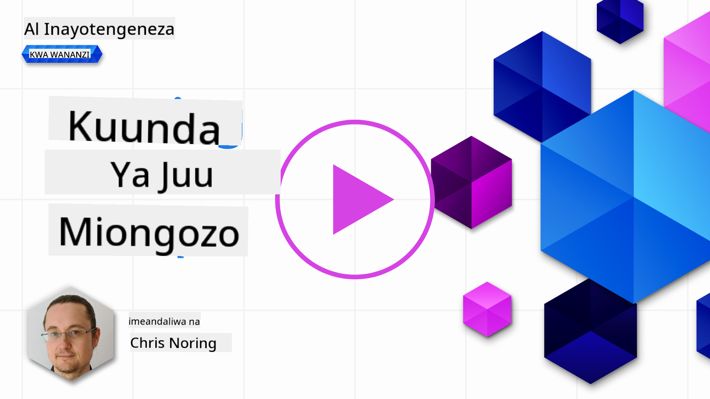

<!--
CO_OP_TRANSLATOR_METADATA:
{
  "original_hash": "b2651fb16bcfbc62b8e518751ed90fdb",
  "translation_date": "2025-10-17T21:08:17+00:00",
  "source_file": "05-advanced-prompts/README.md",
  "language_code": "sw"
}
-->
# Kuunda Maelekezo ya Juu

[](https://youtu.be/BAjzkaCdRok?si=NmUIyRf7-cDgbjtt)

Hebu tukumbuke baadhi ya masomo kutoka sura iliyopita:

> Uhandisi wa maelekezo ni mchakato wa **kuongoza modeli kuelekea majibu yanayofaa zaidi** kwa kutoa maelekezo au muktadha wa maana zaidi.

Pia kuna hatua mbili za kuandika maelekezo: kuunda maelekezo kwa kutoa muktadha unaofaa, na _kuboresha_, jinsi ya kuboresha maelekezo hatua kwa hatua.

Kwa sasa, tuna uelewa wa msingi wa jinsi ya kuandika maelekezo, lakini tunahitaji kwenda zaidi. Katika sura hii, utatoka kujaribu maelekezo mbalimbali hadi kuelewa kwa nini maelekezo fulani ni bora kuliko mengine. Utajifunza jinsi ya kuunda maelekezo ukifuata mbinu za msingi ambazo zinaweza kutumika kwa LLM yoyote.

## Utangulizi

Katika sura hii, tutashughulikia mada zifuatazo:

- Panua maarifa yako ya uhandisi wa maelekezo kwa kutumia mbinu tofauti kwenye maelekezo yako.
- Sanidi maelekezo yako ili kubadilisha matokeo.

## Malengo ya Kujifunza

Baada ya kukamilisha somo hili, utaweza:

- Tumia mbinu za uhandisi wa maelekezo zinazoboresha matokeo ya maelekezo yako.
- Fanya maelekezo ambayo ni ya kubadilika au ya uhakika.

## Uhandisi wa Maelekezo

Uhandisi wa maelekezo ni mchakato wa kuunda maelekezo yatakayotoa matokeo unayotaka. Kuna zaidi ya uhandisi wa maelekezo kuliko tu kuandika maelekezo ya maandishi. Uhandisi wa maelekezo si taaluma ya uhandisi, ni seti ya mbinu unazoweza kutumia kupata matokeo unayotaka.

### Mfano wa Maelekezo

Hebu tuchukue maelekezo ya msingi kama haya:

> Tengeneza maswali 10 kuhusu jiografia.

Katika maelekezo haya, unatumia seti ya mbinu tofauti za maelekezo.

Hebu tuyaangalie kwa undani.

- **Muktadha**, unataja kuwa inapaswa kuwa kuhusu "jiografia".
- **Kuweka mipaka ya matokeo**, unataka maswali yasizidi 10.

### Mapungufu ya Maelekezo Rahisi

Huenda ukapata au usipate matokeo unayotaka. Utapata maswali yako yameundwa, lakini jiografia ni mada kubwa na huenda usipate unachotaka kwa sababu zifuatazo:

- **Mada kubwa**, hujui kama itakuwa kuhusu nchi, miji mikuu, mito na kadhalika.
- **Muundo**, vipi kama ulitaka maswali yawe na muundo fulani?

Kama unavyoona, kuna mengi ya kuzingatia unapounda maelekezo.

Hadi sasa, tumeona mfano wa maelekezo rahisi, lakini AI ya kizazi inaweza kufanya mengi zaidi kusaidia watu katika majukumu na sekta mbalimbali. Hebu tuangalie mbinu za msingi zinazofuata.

### Mbinu za Maelekezo

Kwanza, tunahitaji kuelewa kuwa maelekezo ni mali inayojitokeza ya LLM, ikimaanisha kuwa hii si kipengele kilichojengwa ndani ya modeli bali kitu tunachogundua tunapotumia modeli.

Kuna mbinu za msingi tunazoweza kutumia kuongoza LLM. Hebu tuzichunguze.

- **Maelekezo ya bila mfano**, hii ni aina ya msingi kabisa ya maelekezo. Ni maelekezo moja yanayoomba jibu kutoka kwa LLM kulingana tu na data yake ya mafunzo.
- **Maelekezo ya mfano mdogo**, aina hii ya maelekezo inaongoza LLM kwa kutoa mfano 1 au zaidi ambayo inaweza kutegemea kutoa jibu lake.
- **Mnyororo wa mawazo**, aina hii ya maelekezo inaelekeza LLM jinsi ya kugawanya tatizo katika hatua.
- **Maarifa yaliyotengenezwa**, ili kuboresha jibu la maelekezo, unaweza kutoa ukweli au maarifa yaliyotengenezwa kwa nyongeza kwenye maelekezo yako.
- **Kidogo hadi kikubwa**, kama mnyororo wa mawazo, mbinu hii inahusu kugawanya tatizo katika mfululizo wa hatua na kisha kuomba hatua hizi zifanywe kwa mpangilio.
- **Jiboresha mwenyewe**, mbinu hii inahusu kukosoa matokeo ya LLM na kisha kuiomba iyaboreshe.
- **Maelekezo ya maieutic**, hapa unataka kuhakikisha jibu la LLM ni sahihi na unaiomba kuelezea sehemu mbalimbali za jibu. Hii ni aina ya jiboresha mwenyewe.

### Maelekezo ya bila mfano

Mtindo huu wa maelekezo ni rahisi sana, unajumuisha maelekezo moja. Mbinu hii huenda ndiyo unayotumia unapoanza kujifunza kuhusu LLM. Hapa kuna mfano:

- Maelekezo: "Algebra ni nini?"
- Jibu: "Algebra ni tawi la hisabati linalochunguza alama za hisabati na sheria za kuzibadilisha."

### Maelekezo ya mfano mdogo

Mtindo huu wa maelekezo husaidia modeli kwa kutoa mifano michache pamoja na ombi. Unajumuisha maelekezo moja na data ya ziada maalum kwa kazi. Hapa kuna mfano:

- Maelekezo: "Andika shairi kwa mtindo wa Shakespeare. Hapa kuna mifano michache ya soneti za Shakespeare:
  Soneti 18: 'Je, nikulinganishe na siku ya kiangazi? Wewe ni mzuri zaidi na mpole zaidi...'
  Soneti 116: 'Usiniruhusu kwa ndoa ya akili za kweli Kukubali vikwazo. Upendo si upendo Ambayo hubadilika inapopata mabadiliko...'
  Soneti 132: 'Macho yako ninayapenda, na yanavyonihurumia, Kujua moyo wako unanisumbua kwa dharau,...'
  Sasa, andika soneti kuhusu uzuri wa mwezi."
- Jibu: "Juu ya anga, mwezi unang'aa kwa upole, Katika mwanga wa fedha unaotoa neema yake ya upole,..."

Mifano hutoa LLM muktadha, muundo au mtindo wa matokeo yanayotakiwa. Zinasaidia modeli kuelewa kazi maalum na kutoa majibu sahihi na yanayofaa zaidi.

### Mnyororo wa mawazo

Mnyororo wa mawazo ni mbinu ya kuvutia sana kwani inahusu kupeleka LLM kupitia mfululizo wa hatua. Wazo ni kuelekeza LLM kwa njia ambayo inaelewa jinsi ya kufanya kitu. Fikiria mfano ufuatao, na bila mnyororo wa mawazo:

    - Maelekezo: "Alice ana maapulo 5, anatupa maapulo 3, anampa Bob maapulo 2 na Bob anamrudishia moja, Alice ana maapulo mangapi?"
    - Jibu: 5

LLM inajibu na 5, ambalo si sahihi. Jibu sahihi ni maapulo 1, ukizingatia hesabu (5 -3 -2 + 1 = 1).

Kwa hivyo tunawezaje kufundisha LLM kufanya hili kwa usahihi?

Hebu tujaribu mnyororo wa mawazo. Kutumia mnyororo wa mawazo kunamaanisha:

1. Toa mfano sawa kwa LLM.
1. Onyesha hesabu, na jinsi ya kuhesabu kwa usahihi.
1. Toa maelekezo ya awali.

Hivi ndivyo:

- Maelekezo: "Lisa ana maapulo 7, anatupa maapulo 1, anampa Bart maapulo 4 na Bart anamrudishia moja:
  7 -1 = 6
  6 -4 = 2
  2 +1 = 3  
  Alice ana maapulo 5, anatupa maapulo 3, anampa Bob maapulo 2 na Bob anamrudishia moja, Alice ana maapulo mangapi?"
  Jibu: 1

Angalia jinsi tunavyoandika maelekezo marefu kwa kiasi kikubwa na mfano mwingine, hesabu na kisha maelekezo ya awali na tunafikia jibu sahihi 1.

Kama unavyoona, mnyororo wa mawazo ni mbinu yenye nguvu sana.

### Maarifa yaliyotengenezwa

Mara nyingi unapotaka kuunda maelekezo, unataka kufanya hivyo kwa kutumia data ya kampuni yako mwenyewe. Unataka sehemu ya maelekezo iwe kutoka kwa kampuni na sehemu nyingine iwe maelekezo unayovutiwa nayo.

Kwa mfano, hivi ndivyo maelekezo yako yanaweza kuonekana ikiwa uko katika biashara ya bima:

```text
{{company}}: {{company_name}}
{{products}}:
{{products_list}}
Please suggest an insurance given the following budget and requirements:
Budget: {{budget}}
Requirements: {{requirements}}
```

Hapo juu, unaona jinsi maelekezo yanavyoundwa kwa kutumia kiolezo. Katika kiolezo kuna idadi ya vigezo, vilivyowakilishwa na `{{variable}}`, ambavyo vitabadilishwa na maadili halisi kutoka kwa API ya kampuni.

Hapa kuna mfano wa jinsi maelekezo yanaweza kuonekana mara tu vigezo vimebadilishwa na maudhui kutoka kwa kampuni yako:

```text
Insurance company: ACME Insurance
Insurance products (cost per month):
- Car, cheap, 500 USD
- Car, expensive, 1100 USD
- Home, cheap, 600 USD
- Home, expensive, 1200 USD
- Life, cheap, 100 USD

Please suggest an insurance given the following budget and requirements:
Budget: $1000
Requirements: Car, Home, and Life insurance
```

Kuendesha maelekezo haya kupitia LLM kutatoa jibu kama hili:

```output
Given the budget and requirements, we suggest the following insurance package from ACME Insurance:
- Car, cheap, 500 USD
- Home, cheap, 600 USD
- Life, cheap, 100 USD
Total cost: $1,200 USD
```

Kama unavyoona, pia inapendekeza bima ya maisha, ambayo haipaswi. Matokeo haya ni dalili kwamba tunahitaji kuboresha maelekezo kwa kuyabadilisha ili kuwa wazi zaidi kuhusu kile kinachoruhusiwa. Baada ya _majaribio na makosa_, tunafikia maelekezo yafuatayo:

```text
Insurance company: ACME Insurance
Insurance products (cost per month):
- type: Car, cheap, cost: 500 USD
- type: Car, expensive, cost: 1100 USD
- type: Home, cheap, cost: 600 USD
- type: Home, expensive, cost: 1200 USD
- type: Life, cheap, cost: 100 USD

Please suggest an insurance given the following budget and requirements:
Budget: $1000 restrict choice to types: Car, Home
```

Angalia jinsi ya kuongeza _aina_ na _gharama_ na pia kutumia neno _zuia_ kunasaidia LLM kuelewa tunachotaka.

Sasa tunapata jibu lifuatalo:

```output
Given the budget and requirements, we suggest the Car, Cheap insurance product which costs 500 USD per month.
```

Lengo la mfano huu lilikuwa kuonyesha kwamba hata tunapotumia mbinu ya msingi kama _maarifa yaliyotengenezwa_, bado tunahitaji kuboresha maelekezo katika hali nyingi ili kupata matokeo yanayotakiwa.

### Kidogo hadi kikubwa

Wazo la maelekezo ya Kidogo hadi Kikubwa ni kugawanya tatizo kubwa katika matatizo madogo. Kwa njia hiyo, unasaidia kuongoza LLM jinsi ya "kushinda" tatizo kubwa. Mfano mzuri unaweza kuwa kwa sayansi ya data ambapo unaweza kuomba LLM kugawanya tatizo kama hivi:

> Maelekezo: Jinsi ya kufanya sayansi ya data kwa hatua 5?

Na msaidizi wako wa AI akijibu:

1. Kukusanya data
1. Kusafisha data
1. Kuchambua data
1. Kuchora data
1. Kuwasilisha data

### Jiboresha mwenyewe, kosoa matokeo

Kwa AI za kizazi na LLM, huwezi kuamini matokeo. Unahitaji kuyathibitisha. Baada ya yote, LLM inakupa tu kile kinachoweza kuwa kitu kinachofuata cha kusema, si kile kilicho sahihi. Kwa hivyo, wazo zuri ni kuomba LLM kujikosoa yenyewe, ambayo inatupeleka kwenye mbinu ya jiboresha mwenyewe.

Jinsi inavyofanya kazi ni kwamba unafuata hatua zifuatazo:

1. Maelekezo ya awali ya kuomba LLM kutatua tatizo
1. LLM inajibu
1. Unakosoa jibu na kuomba AI kuboresha
1. LLM inajibu tena, wakati huu ikizingatia ukosoaji na kupendekeza suluhisho ilizokuja nazo

Unaweza kurudia mchakato huu mara nyingi unavyotaka.

Hapa kuna mfano wa kutumia mbinu hii:

> Maelekezo: "Tengeneza API ya Wavuti ya Python yenye njia za bidhaa na wateja"

Jibu la AI:

```python
import flask
app = Flask(__name__)

@app.route('/products')
def products():
    return 'Products'

@app.route('/customers')
def customers():
    return 'Customers'
```

> Maelekezo: pendekeza maboresho 3 ya msimbo hapo juu

Jibu la AI:

```text
Sure, here are three suggestions to improve the code:

Import the correct module: The first line should import Flask instead of flask. The correct import statement should be from flask import Flask.

Add a main function: Add a if __name__ == '__main__': block to the end of the file to run the application when the file is executed.

Use f-strings: Use f-strings to format the return statements in the route functions. For example, return 'Products' can be changed to return f'This is the {request.path} page'.
```

```python
from flask import Flask, request

app = Flask(__name__)

@app.route('/products')
def products():
    return f'This is the {request.path} page'

@app.route('/customers')
def customers():
    return f'This is the {request.path} page'

if __name__ == '__main__':
    app.run()
```

Kama unavyoona, jibu la AI hapo juu linaboresha msimbo uliopendekezwa wa awali shukrani kwa ukosoaji wa jibu la kwanza.

### Maelekezo ya maieutic

Maelekezo ya maieutic ni mbinu inayofanana na jiboresha mwenyewe lakini inahusu zaidi kuomba LLM kujieleza. Lengo ni kupunguza kutokuwepo kwa uthabiti katika matokeo ya LLM ili kuhakikisha inafikia jibu sahihi. Utaratibu wa kufuata ni:

1. Omba LLM kujibu swali
1. Kwa kila sehemu ya jibu, omba LLM kuelezea kwa undani zaidi.
1. Ikiwa kuna kutokuwepo kwa uthabiti, ondoa sehemu ambazo si thabiti.

Rudia hatua ya 2 na 3 hadi umepitia sehemu zote na unaridhika na jibu.

Hapa kuna mfano wa maelekezo:

> Maelekezo: Jinsi gani ninaweza kuunda mpango wa dharura kupunguza athari za janga kwa hatua 5?
> Jibu la LLM:

```text
1. Identify the risks
1. Identify the stakeholders
1. Identify the resources
1. Identify the actions
1. Identify the communication channels
```

Imebainisha hatua 5, lakini tunaweza kuamua ikiwa hii ni sahihi? Hebu tuombe LLM kuelezea kila hatua kwa undani zaidi:

> Maelekezo: Eleza hatua ya kwanza kwa undani zaidi, ni hatari gani kwa undani zinazohusiana na janga?

```text
The risks are the following:

- Loss of life
- Loss of business
- Loss of reputation
- Loss of customers
- Loss of employees
```

Kwa hatua hii, tunataka kuhakikisha LLM iko sahihi kwa hivyo tunaomba ieleze hatari ya kwanza kwa undani zaidi na tunatumai inalingana na jibu hapo juu:

> Maelekezo: Katika janga, ni hatari gani kubwa zaidi na kwa nini?

```text
The biggest risk is loss of life because it's the most important thing to protect.
```

> Ni hatari gani mbili kubwa zaidi katika janga?

```text
The two biggest risks are loss of life and loss of business.
```

Kwa hatua hii, LLM ni thabiti na inataja "maisha" na "biashara" kama hatari mbili kuu. Sasa tunaweza kuendelea na hatua inayofuata na kujisikia kuwa na uhakika. Hata hivyo, hatupaswi kuamini LLM bila shaka, tunapaswa kila mara kuthibitisha matokeo.

## Badilisha matokeo yako

LLMs ni za asili zisizo na uhakika, ikimaanisha kuwa utapata matokeo tofauti kila wakati unapokimbia maelekezo yale yale. Jaribu maelekezo yafuatayo kwa mfano:

> "Tengeneza msimbo wa API ya Wavuti ya Python"

```python
# Import necessary modules
import flask
from flask import request, jsonify

# Create a Flask app
app = flask.Flask(__name__)

# Create a route for the API
@app.route('/api', methods=['GET'])
def api():
    # Get the data from the request
    data = request.args

    # Process the data
    result = process_data(data)

    # Return the result as JSON
    return jsonify(result)

# Function to process the data
def process_data(data):
    # Do something with the data
    result = data + 1

    # Return the result
    return result

# Run the app
if __name__ == '__main__':
    app.run()

```

Kuendesha maelekezo yale yale tena kunatoa jibu tofauti kidogo:

```python
#import necessary packages
import flask
from flask import request, jsonify

#create the Flask application
app = flask.Flask(__name__)
app.config["DEBUG"] = True

#create a list of books
books = [
    {'id': 0,
     'title': 'A Fire Upon the Deep',
     'author': 'Vernor Vinge',
     'first_sentence': 'The coldsleep itself was dreamless.',
     'year_published': '1992'},
    {'id': 1,
     'title': 'The Ones Who Walk Away From Omelas',
     'author': 'Ursula K. Le Guin',
     'first_sentence': 'With a clamor of bells that set the swallows soaring, the Festival of Summer came to the city Omelas, bright-towered by the sea.',
     'published': '1973'},
    {'id': 2,
     'title': 'Dhalgren',
     'author': 'Samuel R. Delany',
     'first_sentence': 'to wound the autumnal city.',
     'published': '1975'}
]

#create an endpoint for the API
@app.route('/', methods=['GET'])
def home():
    return '''<h1>Books API</h1>
<p>A prototype API for retrieving books.</p>'''

#create an endpoint to return all books
@app.route('/api/v1/resources/books/all', methods=['GET'])
def api_all():
    return jsonify(books)

#create an endpoint to return a single book
@app.route('/api/v1/resources/books', methods=['GET'])
def api_id():
    #check if an ID was provided as part of the URL
    #if ID is provided, assign it to a variable
    #if no ID is provided, display an error
    if 'id' in request.args:
        id = int(request.args['id'])
    else:
        return "Error: No id field provided. Please specify an id."

    #create an empty list for our results
    results = []

    #loop through the data and match results that fit the requested ID
    #IDs are unique, but other fields might return many results
    for book in books:
        if book['id'] == id:
            results.append(book)

    #use the jsonify function from Flask to convert our list of
    #Python dictionaries to the JSON format
    return jsonify(results)

app.run()
```

> Je, matokeo yanayobadilika ni tatizo?

Inategemea unachojaribu kufanya. Ikiwa unataka jibu maalum basi ni tatizo. Ikiwa uko sawa na matokeo yanayobadilika kama "Tengeneza maswali yoyote 3 kuhusu jiografia", basi si tatizo.

### Kutumia joto kubadilisha matokeo yako

Sawa, kwa hivyo tumeamua tunataka kupunguza matokeo ili yawe ya kutabirika zaidi, yaani yawe ya uhakika zaidi. Tunafanyaje hivyo?

Joto ni thamani kati ya 0 na 1, ambapo 0 ni ya uhakika zaidi na 1 ni ya kubadilika zaidi. Thamani ya kawaida ni 0.7. Hebu tuone kinachotokea na majaribio mawili ya maelekezo yale yale na joto limewekwa kuwa 0.1:

> "Tengeneza msimbo wa API ya Wavuti ya Python"

```python
#import necessary libraries
import flask
from flask import request, jsonify

#create an instance of the Flask class
app = flask.Flask(__name__)

#create an endpoint for the API
@app.route('/api/v1/endpoint', methods=['GET'])
def api_endpoint():
    #get the request data
    data = request.get_json()

    #process the data
    result = process_data(data)

    #return the result
    return jsonify(result)

#function to process the data
def process_data(data):
    #process the data
    result = {'result': 'success'}

    #return the result
    return result

#run the Flask app
if __name__ == '__main__':
    app.run()

```

Kuendesha maelekezo tena kunatoa matokeo haya:

```python
#import necessary libraries
import flask
from flask import request, jsonify

#create a Flask app
app = flask.Flask(__name__)

#create a route for the API
@app.route('/api', methods=['GET'])
def api_call():
    #get the data from the request
    data = request.get_json()

    #process the data
    result = process_data(data)

    #return the result
    return jsonify(result)

#define the process_data function
def process_data(data):
    #do something with the data
    result = data + 1

    #return the result
    return result

#run the app
if __name__ == '__main__':
    app.run()

```

Kuna tofauti ndogo tu kati ya matokeo haya mawili. Hebu tufanye kinyume wakati huu, tuweke joto kuwa 0.9:

```python
# Import necessary libraries
import flask
from flask import request, jsonify

# Create a Flask app
app = flask.Flask(__name__)

# Create a route for the API
@app.route('/api', methods=['GET'])
def api_call():
    # Get the data from the request
    data = request.args

    # Process the data
    result = process_data(data)

    # Return the result
    return jsonify(result)

# Function to process the data
def process_data(data):
    # Do something with the data
    result = data + 1

    # Return the result
    return result

# Run the app
if __name__ == '__main__':
    app.run()

```

na jaribio la pili kwa joto la 0.9 kama thamani:

```python
import flask
from flask import request, jsonify

# create the Flask app
app = flask.Flask(__name__)
app.config['DEBUG'] = True

# create some test data
books = [
    {'id': 0, 'title': 'A Fire Upon The Deep', 'author': 'Vernor Vinge', 'first_sentence': 'The coldsleep itself was dreamless.', 'year_published': '1992'},
    {'id': 1, 'title': 'The Ones Who Walk Away From Omelas', 'author': 'Ursula K. Le Guin', 'first_sentence': 'With a clamor of bells that set the swallows soaring, the Festival of Summer came to the city Omelas, bright-towered by the sea.', 'published': '1973'},
    {'id': 2, 'title': 'Dhalgren', 'author': 'Samuel R. Delany', 'first_sentence': 'to wound the autumnal city.', 'published': '1975'}
]

# create an endpoint
@app.route('/', methods=['GET'])
def home():
    return '''<h1>Welcome to our book API!</h1>'''

@app.route('/api/v1/resources/books

```

Kama unavyoona, matokeo hayawezi kuwa tofauti zaidi.

> Kumbuka, kuna vigezo zaidi unavyoweza kubadilisha ili kutofautisha matokeo, kama top-k, top-p, adhabu ya kurudia, adhabu ya urefu na adhabu ya utofauti lakini haya yako nje ya mafunzo haya.

## Mazoea Mazuri

Kuna mazoea mengi unayoweza kutumia kujaribu kupata kile unachotaka. Utapata mtindo wako mwenyewe kadri unavyotumia kuandika maelekezo zaidi na zaidi.

Mbali na mbinu tulizozungumzia, kuna mazoea mazuri ya kuzingatia unapotoa maelekezo kwa LLM.

Hapa kuna mazoea mazuri ya kuzingatia:

- **Eleza muktadha**. Muktadha ni muhimu, kadri unavyoweza kueleza kama eneo, mada, n.k. ndivyo bora zaidi.
- Punguza matokeo. Ikiwa unataka idadi maalum ya vitu au urefu maalum, eleza.
- **Eleza nini na jinsi gani**. Kumbuka kutaja kile unachotaka na jinsi unavyotaka, kwa mfano "Tengeneza Python Web API yenye njia za bidhaa na wateja, igawanye katika faili 3".
- **Tumia templeti**. Mara nyingi, utataka kuboresha maelekezo yako kwa data kutoka kwa kampuni yako. Tumia templeti kufanya hivyo. Templeti zinaweza kuwa na vigezo ambavyo unabadilisha na data halisi.
- **Andika kwa usahihi**. LLM inaweza kukupa jibu sahihi, lakini ukiandika kwa usahihi, utapata jibu bora zaidi.

## Kazi

Hapa kuna msimbo wa Python unaoonyesha jinsi ya kujenga API rahisi kwa kutumia Flask:

```python
from flask import Flask, request

app = Flask(__name__)

@app.route('/')
def hello():
    name = request.args.get('name', 'World')
    return f'Hello, {name}!'

if __name__ == '__main__':
    app.run()
```

Tumia msaidizi wa AI kama GitHub Copilot au ChatGPT na tumia mbinu ya "kujiboresha" kuboresha msimbo.

## Suluhisho

Tafadhali jaribu kutatua kazi kwa kuongeza maelekezo yanayofaa kwenye msimbo.

> [!TIP]
> Eleza maelekezo ya kuomba kuboresha, ni wazo zuri kupunguza idadi ya maboresho. Unaweza pia kuomba kuboresha kwa njia fulani, kwa mfano usanifu, utendaji, usalama, n.k.

[Solution](../../../05-advanced-prompts/python/aoai-solution.py)

## Ukaguzi wa Maarifa

Kwa nini ningetumia maelekezo ya mnyororo wa mawazo? Nionyeshe jibu 1 sahihi na majibu 2 yasiyo sahihi.

1. Kufundisha LLM jinsi ya kutatua tatizo.
1. B, Kufundisha LLM kutafuta makosa kwenye msimbo.
1. C, Kuelekeza LLM kuja na suluhisho tofauti.

A: 1, kwa sababu mnyororo wa mawazo unahusu kuonyesha LLM jinsi ya kutatua tatizo kwa kuipatia mfululizo wa hatua, na matatizo yanayofanana na jinsi yalivyotatuliwa.

## 🚀 Changamoto

Umetumia tu mbinu ya kujiboresha katika kazi. Chukua programu yoyote uliyotengeneza na fikiria maboresho unayotaka kuifanyia. Sasa tumia mbinu ya kujiboresha kutekeleza mabadiliko yaliyopendekezwa. Ulifikiria matokeo, bora au mbaya?

## Kazi Nzuri! Endelea Kujifunza

Baada ya kukamilisha somo hili, angalia [Mkusanyiko wa Kujifunza AI ya Kizazi](https://aka.ms/genai-collection?WT.mc_id=academic-105485-koreyst) ili kuendelea kuongeza maarifa yako ya AI ya Kizazi!

Nenda kwenye Somo la 6 ambapo tutatumia maarifa yetu ya Uhandisi wa Maelekezo kwa [kujenga programu za kizazi cha maandishi](../06-text-generation-apps/README.md?WT.mc_id=academic-105485-koreyst)

---

**Kanusho**:  
Hati hii imetafsiriwa kwa kutumia huduma ya tafsiri ya AI [Co-op Translator](https://github.com/Azure/co-op-translator). Ingawa tunajitahidi kwa usahihi, tafadhali fahamu kuwa tafsiri za kiotomatiki zinaweza kuwa na makosa au kutokuwa sahihi. Hati ya asili katika lugha yake ya kiasili inapaswa kuzingatiwa kama chanzo cha mamlaka. Kwa taarifa muhimu, tafsiri ya kitaalamu ya binadamu inapendekezwa. Hatutawajibika kwa kutoelewana au tafsiri zisizo sahihi zinazotokana na matumizi ya tafsiri hii.