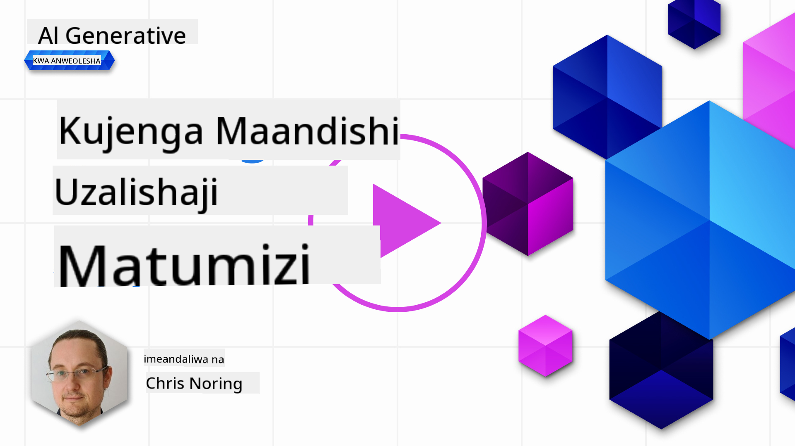

<!--
CO_OP_TRANSLATOR_METADATA:
{
  "original_hash": "5ec6c92b629564538ef397c550adb73e",
  "translation_date": "2025-05-19T17:13:15+00:00",
  "source_file": "06-text-generation-apps/README.md",
  "language_code": "sw"
}
-->
# Kujenga Programu za Uzalishaji wa Maandishi

[](https://aka.ms/gen-ai-lesson6-gh?WT.mc_id=academic-105485-koreyst)

> _(Bonyeza picha hapo juu kutazama video ya somo hili)_

Umeona hadi sasa kupitia mtaala huu kwamba kuna dhana kuu kama maelezo na hata taaluma nzima inayoitwa "ufundi wa maelezo". Vifaa vingi unavyoweza kuingiliana navyo kama ChatGPT, Office 365, Microsoft Power Platform na zaidi, vinakuwezesha kutumia maelezo ili kutimiza kitu.

Ili uongeze uzoefu kama huo kwenye programu, unahitaji kuelewa dhana kama maelezo, kukamilisha na kuchagua maktaba ya kufanya kazi nayo. Hicho ndicho utakachojifunza katika sura hii.

## Utangulizi

Katika sura hii, utajifunza:

- Kuhusu maktaba ya openai na dhana zake kuu.
- Kujenga programu ya uzalishaji wa maandishi kwa kutumia openai.
- Kuelewa jinsi ya kutumia dhana kama maelezo, joto, na tokeni ili kujenga programu ya uzalishaji wa maandishi.

## Malengo ya Kujifunza

Mwisho wa somo hili, utaweza:

- Kuelezea nini programu ya uzalishaji wa maandishi ni.
- Kujenga programu ya uzalishaji wa maandishi kwa kutumia openai.
- Kuseti programu yako kutumia tokeni zaidi au chache na pia kubadilisha joto, kwa matokeo tofauti.

## Nini ni programu ya uzalishaji wa maandishi?

Kwa kawaida unapojenga programu ina aina fulani ya kiolesura kama ifuatavyo:

- Inayotegemea amri. Programu za koni ni programu za kawaida ambapo unaandika amri na inafanya kazi. Kwa mfano, `git` ni programu inayotegemea amri.
- Kiolesura cha mtumiaji (UI). Programu zingine zina kiolesura cha picha (GUIs) ambapo unabonyeza vitufe, kuingiza maandishi, kuchagua chaguo na zaidi.

### Programu za Koni na UI zina mipaka

Linganisheni na programu inayotegemea amri ambapo unaandika amri:

- **Ina mipaka**. Huwezi tu kuandika amri yoyote, ni zile tu ambazo programu inaunga mkono.
- **Lugha maalum**. Programu zingine zinaunga mkono lugha nyingi, lakini kwa kawaida programu imejengwa kwa lugha maalum, hata kama unaweza kuongeza msaada wa lugha zaidi.

### Faida za programu za uzalishaji wa maandishi

Kwa hiyo programu ya uzalishaji wa maandishi ni tofauti vipi?

Katika programu ya uzalishaji wa maandishi, una uhuru zaidi, hauko kwenye seti ya amri au lugha maalum ya kuingiza. Badala yake, unaweza kutumia lugha ya kawaida kuingiliana na programu. Faida nyingine ni kwamba kwa sababu tayari unaingiliana na chanzo cha data ambacho kimefundishwa kwenye mkusanyiko mkubwa wa habari, ambapo programu ya kawaida inaweza kuwa na mipaka kwenye kile kilicho kwenye hifadhidata.

### Nini naweza kujenga na programu ya uzalishaji wa maandishi?

Kuna mambo mengi unaweza kujenga. Kwa mfano:

- **Chatbot**. Chatbot inayojibu maswali kuhusu mada, kama kampuni yako na bidhaa zake inaweza kuwa mechi nzuri.
- **Msaidizi**. LLMs ni nzuri katika mambo kama kufupisha maandishi, kupata maarifa kutoka kwa maandishi, kutengeneza maandishi kama wasifu na zaidi.
- **Msaidizi wa kodi**. Kutegemea na mfano wa lugha unayotumia, unaweza kujenga msaidizi wa kodi anayekusaidia kuandika kodi. Kwa mfano, unaweza kutumia bidhaa kama GitHub Copilot pamoja na ChatGPT kukusaidia kuandika kodi.

## Jinsi naweza kuanza?

Kweli, unahitaji kupata njia ya kuunganisha na LLM ambayo kawaida inajumuisha njia mbili zifuatazo:

- Tumia API. Hapa unajenga maombi ya wavuti na maelezo yako na kupata maandishi yaliyotengenezwa.
- Tumia maktaba. Maktaba husaidia kufunika simu za API na kuzifanya rahisi kutumia.

## Maktaba/SDKs

Kuna maktaba chache zinazojulikana kwa kufanya kazi na LLMs kama:

- **openai**, maktaba hii inafanya iwe rahisi kuunganisha na mfano wako na kutuma maelezo.

Kisha kuna maktaba zinazofanya kazi kwenye kiwango cha juu kama:

- **Langchain**. Langchain inajulikana na inaunga mkono Python.
- **Semantic Kernel**. Semantic Kernel ni maktaba ya Microsoft inayounga mkono lugha za C#, Python, na Java.

## Programu ya kwanza kutumia openai

Tuone jinsi tunavyoweza kujenga programu yetu ya kwanza, ni maktaba gani tunahitaji, ni kiasi gani kinahitajika na kadhalika.

### Sakinisha openai

Kuna maktaba nyingi huko nje za kuingiliana na OpenAI au Azure OpenAI. Inawezekana kutumia lugha nyingi za programu kama C#, Python, JavaScript, Java na zaidi. Tumechagua kutumia maktaba ya `openai` Python, kwa hivyo tutatumia `pip` kuisakinisha.

```bash
pip install openai
```

### Unda rasilimali

Unahitaji kutekeleza hatua zifuatazo:

- Unda akaunti kwenye Azure [https://azure.microsoft.com/free/](https://azure.microsoft.com/free/?WT.mc_id=academic-105485-koreyst).
- Pata ufikiaji wa Azure OpenAI. Nenda [https://learn.microsoft.com/azure/ai-services/openai/overview#how-do-i-get-access-to-azure-openai](https://learn.microsoft.com/azure/ai-services/openai/overview#how-do-i-get-access-to-azure-openai?WT.mc_id=academic-105485-koreyst) na omba ufikiaji.

  > [!NOTE]
  > Wakati wa kuandika, unahitaji kuomba ufikiaji wa Azure OpenAI.

- Sakinisha Python <https://www.python.org/>
- Unda rasilimali ya Huduma ya Azure OpenAI. Angalia mwongozo huu jinsi ya [kuunda rasilimali](https://learn.microsoft.com/azure/ai-services/openai/how-to/create-resource?pivots=web-portal?WT.mc_id=academic-105485-koreyst).

### Pata ufunguo wa API na mwisho

Kwa wakati huu, unahitaji kuambia maktaba yako ya `openai` ni ufunguo wa API gani wa kutumia. Ili kupata ufunguo wako wa API, nenda kwenye sehemu ya "Keys and Endpoint" ya rasilimali yako ya Azure OpenAI na nakili thamani ya "Key 1".


Sasa kwa kuwa una habari hii imekopiwa, hebu tuagize maktaba kutumia.

> [!NOTE]
> Inafaa kutenganisha ufunguo wako wa API kutoka kwa kodi yako. Unaweza kufanya hivyo kwa kutumia vigezo vya mazingira.
>
> - Weka kigezo cha mazingira `OPENAI_API_KEY` to your API key.
>   `export OPENAI_API_KEY='sk-...'`

### Setup configuration Azure

Ikiwa unatumia Azure OpenAI, hapa kuna jinsi unavyoseti usanidi:

```python
openai.api_type = 'azure'
openai.api_key = os.environ["OPENAI_API_KEY"]
openai.api_version = '2023-05-15'
openai.api_base = os.getenv("API_BASE")
```

Hapo juu tunaseti yafuatayo:

- `api_type` to `azure`. This tells the library to use Azure OpenAI and not OpenAI.
- `api_key`, this is your API key found in the Azure Portal.
- `api_version`, this is the version of the API you want to use. At the time of writing, the latest version is `2023-05-15`.
- `api_base`, this is the endpoint of the API. You can find it in the Azure Portal next to your API key.

> [!NOTE] > `os.getenv` is a function that reads environment variables. You can use it to read environment variables like `OPENAI_API_KEY` and `API_BASE`. Set these environment variables in your terminal or by using a library like `dotenv`.

## Generate text

The way to generate text is to use the `Completion` class. Hapa kuna mfano:

```python
prompt = "Complete the following: Once upon a time there was a"

completion = openai.Completion.create(model="davinci-002", prompt=prompt)
print(completion.choices[0].text)
```

Katika kodi hapo juu, tunaunda kitu cha kukamilisha na kupitisha mfano tunaotaka kutumia na maelezo. Kisha tunachapisha maandishi yaliyotengenezwa.

### Kukamilisha mazungumzo

Hadi sasa, umeona jinsi tunavyotumia `Completion` to generate text. But there's another class called `ChatCompletion` ambayo inafaa zaidi kwa chatbots. Hapa kuna mfano wa kuitumia:

```python
import openai

openai.api_key = "sk-..."

completion = openai.ChatCompletion.create(model="gpt-3.5-turbo", messages=[{"role": "user", "content": "Hello world"}])
print(completion.choices[0].message.content)
```

Zaidi kuhusu utendaji huu katika sura inayofuata.

## Zoezi - programu yako ya kwanza ya uzalishaji wa maandishi

Sasa kwa kuwa tumeelewa jinsi ya kusanidi na kuseti openai, ni wakati wa kujenga programu yako ya kwanza ya uzalishaji wa maandishi. Ili kujenga programu yako, fuata hatua hizi:

1. Unda mazingira ya kawaida na usakinishe openai:

   ```bash
   python -m venv venv
   source venv/bin/activate
   pip install openai
   ```

   > [!NOTE]
   > Ikiwa unatumia Windows andika `venv\Scripts\activate` instead of `source venv/bin/activate`.

   > [!NOTE]
   > Locate your Azure OpenAI key by going to [https://portal.azure.com/](https://portal.azure.com/?WT.mc_id=academic-105485-koreyst) and search for `Open AI` and select the `Open AI resource` and then select `Keys and Endpoint` and copy the `Key 1` value.

1. Unda faili _app.py_ na uipe kodi ifuatayo:

   ```python
   import openai

   openai.api_key = "<replace this value with your open ai key or Azure OpenAI key>"

   openai.api_type = 'azure'
   openai.api_version = '2023-05-15'
   openai.api_base = "<endpoint found in Azure Portal where your API key is>"
   deployment_name = "<deployment name>"

   # add your completion code
   prompt = "Complete the following: Once upon a time there was a"
   messages = [{"role": "user", "content": prompt}]

   # make completion
   completion = openai.chat.completions.create(model=deployment_name, messages=messages)

   # print response
   print(completion.choices[0].message.content)
   ```

   > [!NOTE]
   > Ikiwa unatumia Azure OpenAI, unahitaji kuweka `api_type` to `azure` and set the `api_key` kwa ufunguo wako wa Azure OpenAI.

   Unapaswa kuona matokeo kama yafuatayo:

   ```output
    very unhappy _____.

   Once upon a time there was a very unhappy mermaid.
   ```

## Aina tofauti za maelezo, kwa vitu tofauti

Sasa umeona jinsi ya kuzalisha maandishi kwa kutumia maelezo. Hata una programu inayoendelea ambayo unaweza kubadilisha na kubadilisha ili kuzalisha aina tofauti za maandishi.

Maelezo yanaweza kutumika kwa kazi zote. Kwa mfano:

- **Zalisha aina ya maandishi**. Kwa mfano, unaweza kuzalisha shairi, maswali ya jaribio n.k.
- **Tafuta habari**. Unaweza kutumia maelezo kutafuta habari kama mfano ufuatao 'CORS inamaanisha nini katika maendeleo ya wavuti?'.
- **Zalisha kodi**. Unaweza kutumia maelezo kuzalisha kodi, kwa mfano kutengeneza usemi wa kawaida unaotumika kuthibitisha barua pepe au kwa nini usizalishe programu nzima, kama programu ya wavuti?

## Matumizi ya vitendo zaidi: jenereta ya mapishi

Fikiria una viungo nyumbani na unataka kupika kitu. Kwa hilo, unahitaji mapishi. Njia ya kupata mapishi ni kutumia injini ya utafutaji au unaweza kutumia LLM kufanya hivyo.

Unaweza kuandika maelezo kama hivi:

> "Nionyeshe mapishi 5 ya sahani yenye viungo vifuatavyo: kuku, viazi, na karoti. Kwa kila mapishi, orodhesha viungo vyote vilivyotumika"

Kwa maelezo hayo hapo juu, unaweza kupata majibu yanayofanana na:

```output
1. Roasted Chicken and Vegetables:
Ingredients:
- 4 chicken thighs
- 2 potatoes, cut into cubes
- 2 carrots, cut into cubes
- 2 tablespoons olive oil
- 2 cloves garlic, minced
- 1 teaspoon dried thyme
- 1 teaspoon dried oregano
- Salt and pepper, to taste

2. Chicken and Potato Stew:
Ingredients:
- 2 tablespoons olive oil
- 1 onion, diced
- 2 cloves garlic, minced
- 2 chicken breasts, cut into cubes
- 2 potatoes, cut into cubes
- 2 carrots, cut into cubes
- 1 teaspoon dried oregano
- 1 teaspoon dried thyme
- 1 cup chicken broth
- Salt and pepper, to taste

3. Chicken and Potato Bake:
Ingredients:
- 2 tablespoons olive oil
- 2 chicken breasts, cut into cubes
- 2 potatoes, cut into cubes
- 2 carrots, cut into cubes
- 1 onion, diced
- 2 cloves garlic, minced
- 1 teaspoon dried oregano
- 1 teaspoon dried thyme
- 1 cup chicken broth
- Salt and pepper, to taste

4. Chicken and Potato Soup:
Ingredients:
- 2 tablespoons olive oil
- 1 onion, diced
- 2 cloves garlic, minced
- 2 chicken breasts, cut into cubes
- 2 potatoes, cut into cubes
- 2 carrots, cut into cubes
- 1 teaspoon dried oregano
- 1 teaspoon dried thyme
- 4 cups chicken broth
- Salt and pepper, to taste

5. Chicken and Potato Hash:
Ingredients:
- 2 tablespoons olive oil
- 2 chicken breasts, cut into cubes
- 2 potatoes, cut into cubes
- 2 carrots, cut into cubes
- 1 onion, diced
- 2 cloves garlic, minced
- 1 teaspoon dried oregano
```

Matokeo haya ni mazuri, najua nini cha kupika. Kwa wakati huu, maboresho yanayoweza kuwa muhimu ni:

- Kuchuja viungo nisivyovipenda au nilivyo na mzio.
- Tengeneza orodha ya ununuzi, ikiwa sina viungo vyote nyumbani.

Kwa kesi zilizo hapo juu, hebu tuongeze maelezo ya ziada:

> "Tafadhali ondoa mapishi yenye vitunguu saumu kwani nina mzio na ubadilishe na kitu kingine. Pia, tafadhali tengeneza orodha ya ununuzi kwa mapishi, ukizingatia tayari nina kuku, viazi na karoti nyumbani."

Sasa una matokeo mapya, yaani:

```output
1. Roasted Chicken and Vegetables:
Ingredients:
- 4 chicken thighs
- 2 potatoes, cut into cubes
- 2 carrots, cut into cubes
- 2 tablespoons olive oil
- 1 teaspoon dried thyme
- 1 teaspoon dried oregano
- Salt and pepper, to taste

2. Chicken and Potato Stew:
Ingredients:
- 2 tablespoons olive oil
- 1 onion, diced
- 2 chicken breasts, cut into cubes
- 2 potatoes, cut into cubes
- 2 carrots, cut into cubes
- 1 teaspoon dried oregano
- 1 teaspoon dried thyme
- 1 cup chicken broth
- Salt and pepper, to taste

3. Chicken and Potato Bake:
Ingredients:
- 2 tablespoons olive oil
- 2 chicken breasts, cut into cubes
- 2 potatoes, cut into cubes
- 2 carrots, cut into cubes
- 1 onion, diced
- 1 teaspoon dried oregano
- 1 teaspoon dried thyme
- 1 cup chicken broth
- Salt and pepper, to taste

4. Chicken and Potato Soup:
Ingredients:
- 2 tablespoons olive oil
- 1 onion, diced
- 2 chicken breasts, cut into cubes
- 2 potatoes, cut into cubes
- 2 carrots, cut into cubes
- 1 teaspoon dried oregano
- 1 teaspoon dried thyme
- 4 cups chicken broth
- Salt and pepper, to taste

5. Chicken and Potato Hash:
Ingredients:
- 2 tablespoons olive oil
- 2 chicken breasts, cut into cubes
- 2 potatoes, cut into cubes
- 2 carrots, cut into cubes
- 1 onion, diced
- 1 teaspoon dried oregano

Shopping List:
- Olive oil
- Onion
- Thyme
- Oregano
- Salt
- Pepper
```

Hayo ni mapishi yako matano, bila kutaja vitunguu saumu na pia una orodha ya ununuzi ukizingatia kile ulichonacho nyumbani.

## Zoezi - tengeneza jenereta ya mapishi

Sasa kwa kuwa tumecheza nje ya hali, hebu tuandike kodi ili kufanana na hali iliyodhihirishwa. Ili kufanya hivyo, fuata hatua hizi:

1. Tumia faili iliyopo _app.py_ kama sehemu ya kuanzia
1. Pata kigezo cha `prompt` na ubadilishe kodi yake kuwa ifuatayo:

   ```python
   prompt = "Show me 5 recipes for a dish with the following ingredients: chicken, potatoes, and carrots. Per recipe, list all the ingredients used"
   ```

   Ikiwa sasa utaendesha kodi, unapaswa kuona matokeo yanayofanana na:

   ```output
   -Chicken Stew with Potatoes and Carrots: 3 tablespoons oil, 1 onion, chopped, 2 cloves garlic, minced, 1 carrot, peeled and chopped, 1 potato, peeled and chopped, 1 bay leaf, 1 thyme sprig, 1/2 teaspoon salt, 1/4 teaspoon black pepper, 1 1/2 cups chicken broth, 1/2 cup dry white wine, 2 tablespoons chopped fresh parsley, 2 tablespoons unsalted butter, 1 1/2 pounds boneless, skinless chicken thighs, cut into 1-inch pieces
   -Oven-Roasted Chicken with Potatoes and Carrots: 3 tablespoons extra-virgin olive oil, 1 tablespoon Dijon mustard, 1 tablespoon chopped fresh rosemary, 1 tablespoon chopped fresh thyme, 4 cloves garlic, minced, 1 1/2 pounds small red potatoes, quartered, 1 1/2 pounds carrots, quartered lengthwise, 1/2 teaspoon salt, 1/4 teaspoon black pepper, 1 (4-pound) whole chicken
   -Chicken, Potato, and Carrot Casserole: cooking spray, 1 large onion, chopped, 2 cloves garlic, minced, 1 carrot, peeled and shredded, 1 potato, peeled and shredded, 1/2 teaspoon dried thyme leaves, 1/4 teaspoon salt, 1/4 teaspoon black pepper, 2 cups fat-free, low-sodium chicken broth, 1 cup frozen peas, 1/4 cup all-purpose flour, 1 cup 2% reduced-fat milk, 1/4 cup grated Parmesan cheese

   -One Pot Chicken and Potato Dinner: 2 tablespoons olive oil, 1 pound boneless, skinless chicken thighs, cut into 1-inch pieces, 1 large onion, chopped, 3 cloves garlic, minced, 1 carrot, peeled and chopped, 1 potato, peeled and chopped, 1 bay leaf, 1 thyme sprig, 1/2 teaspoon salt, 1/4 teaspoon black pepper, 2 cups chicken broth, 1/2 cup dry white wine

   -Chicken, Potato, and Carrot Curry: 1 tablespoon vegetable oil, 1 large onion, chopped, 2 cloves garlic, minced, 1 carrot, peeled and chopped, 1 potato, peeled and chopped, 1 teaspoon ground coriander, 1 teaspoon ground cumin, 1/2 teaspoon ground turmeric, 1/2 teaspoon ground ginger, 1/4 teaspoon cayenne pepper, 2 cups chicken broth, 1/2 cup dry white wine, 1 (15-ounce) can chickpeas, drained and rinsed, 1/2 cup raisins, 1/2 cup chopped fresh cilantro
   ```

   > NOTE, LLM yako haina uhakika, kwa hivyo unaweza kupata matokeo tofauti kila wakati unapendesha programu.

   Nzuri, hebu tuone jinsi tunavyoweza kuboresha mambo. Ili kuboresha mambo, tunataka kuhakikisha kuwa kodi ni rahisi kubadilika, kwa hivyo viungo na idadi ya mapishi vinaweza kuboreshwa na kubadilishwa.

1. Hebu tubadilishe kodi kwa njia ifuatayo:

   ```python
   no_recipes = input("No of recipes (for example, 5): ")

   ingredients = input("List of ingredients (for example, chicken, potatoes, and carrots): ")

   # interpolate the number of recipes into the prompt an ingredients
   prompt = f"Show me {no_recipes} recipes for a dish with the following ingredients: {ingredients}. Per recipe, list all the ingredients used"
   ```

   Kuchukua kodi kwa majaribio, inaweza kuonekana kama hii:

   ```output
   No of recipes (for example, 5): 3
   List of ingredients (for example, chicken, potatoes, and carrots): milk,strawberries

   -Strawberry milk shake: milk, strawberries, sugar, vanilla extract, ice cubes
   -Strawberry shortcake: milk, flour, baking powder, sugar, salt, unsalted butter, strawberries, whipped cream
   -Strawberry milk: milk, strawberries, sugar, vanilla extract
   ```

### Boresha kwa kuongeza kichujio na orodha ya ununuzi

Sasa tuna programu inayofanya kazi inayoweza kutoa mapishi na ni rahisi kubadilika kwani inategemea maingizo kutoka kwa mtumiaji, wote kwenye idadi ya mapishi lakini pia viungo vinavyotumika.

Ili kuboresha zaidi, tunataka kuongeza yafuatayo:

- **Chuja viungo**. Tunataka kuwa na uwezo wa kuchuja viungo tusivyovipenda au tunavyo mzio. Ili kufanikisha mabadiliko haya, tunaweza kuhariri maelezo yetu yaliyopo na kuongeza hali ya kuchuja mwishoni mwa kama ifuatavyo:

  ```python
  filter = input("Filter (for example, vegetarian, vegan, or gluten-free): ")

  prompt = f"Show me {no_recipes} recipes for a dish with the following ingredients: {ingredients}. Per recipe, list all the ingredients used, no {filter}"
  ```

  Hapo juu, tunaongeza `{filter}` mwishoni mwa maelezo na pia tunakamata thamani ya kichujio kutoka kwa mtumiaji.

  Mfano wa maingizo ya kuendesha programu sasa inaweza kuonekana kama hivi:

  ```output
  No of recipes (for example, 5): 3
  List of ingredients (for example, chicken, potatoes, and carrots): onion,milk
  Filter (for example, vegetarian, vegan, or gluten-free): no milk

  1. French Onion Soup

  Ingredients:

  -1 large onion, sliced
  -3 cups beef broth
  -1 cup milk
  -6 slices french bread
  -1/4 cup shredded Parmesan cheese
  -1 tablespoon butter
  -1 teaspoon dried thyme
  -1/4 teaspoon salt
  -1/4 teaspoon black pepper

  Instructions:

  1. In a large pot, sauté onions in butter until golden brown.
  2. Add beef broth, milk, thyme, salt, and pepper. Bring to a boil.
  3. Reduce heat and simmer for 10 minutes.
  4. Place french bread slices on soup bowls.
  5. Ladle soup over bread.
  6. Sprinkle with Parmesan cheese.

  2. Onion and Potato Soup

  Ingredients:

  -1 large onion, chopped
  -2 cups potatoes, diced
  -3 cups vegetable broth
  -1 cup milk
  -1/4 teaspoon black pepper

  Instructions:

  1. In a large pot, sauté onions in butter until golden brown.
  2. Add potatoes, vegetable broth, milk, and pepper. Bring to a boil.
  3. Reduce heat and simmer for 10 minutes.
  4. Serve hot.

  3. Creamy Onion Soup

  Ingredients:

  -1 large onion, chopped
  -3 cups vegetable broth
  -1 cup milk
  -1/4 teaspoon black pepper
  -1/4 cup all-purpose flour
  -1/2 cup shredded Parmesan cheese

  Instructions:

  1. In a large pot, sauté onions in butter until golden brown.
  2. Add vegetable broth, milk, and pepper. Bring to a boil.
  3. Reduce heat and simmer for 10 minutes.
  4. In a small bowl, whisk together flour and Parmesan cheese until smooth.
  5. Add to soup and simmer for an additional 5 minutes, or until soup has thickened.
  ```

  Kama unavyoona, mapishi yoyote yenye maziwa yamechujwa. Lakini, ikiwa una tatizo la kutovumilia lactose, unaweza kutaka kuchuja mapishi yenye jibini pia, kwa hivyo kuna haja ya kuwa wazi.

- **Tengeneza orodha ya ununuzi**. Tunataka kutengeneza orodha ya ununuzi, ukizingatia kile tunachonacho tayari nyumbani.

  Kwa utendaji huu, tunaweza kujaribu kutatua kila kitu katika maelezo moja au tunaweza kuigawanya katika maelezo mawili. Hebu tujaribu njia ya pili. Hapa tunapendekeza kuongeza maelezo ya ziada, lakini ili hiyo ifanye kazi, tunahitaji kuongeza matokeo ya maelezo ya kwanza kama muktadha kwa maelezo ya pili.

  Pata sehemu katika kodi inayochapisha matokeo kutoka kwa maelezo ya kwanza na ongeza kodi ifuatayo chini:

  ```python
  old_prompt_result = completion.choices[0].message.content
  prompt = "Produce a shopping list for the generated recipes and please don't include ingredients that I already have."

  new_prompt = f"{old_prompt_result} {prompt}"
  messages = [{"role": "user", "content": new_prompt}]
  completion = openai.Completion.create(engine=deployment_name, messages=messages, max_tokens=1200)

  # print response
  print("Shopping list:")
  print(completion.choices[0].message.content)
  ```

  Angalia yafuatayo:

  1. Tunatengeneza maelezo mapya kwa kuongeza matokeo kutoka kwa maelezo ya kwanza kwa maelezo mapya:

     ```python
     new_prompt = f"{old_prompt_result} {prompt}"
     ```

  1. Tunafanya ombi jipya, lakini pia ukizingatia idadi ya tokeni tulizoomba katika maelezo ya kwanza, kwa hivyo wakati huu tunasema `max_tokens` ni 1200.

     ```python
     completion = openai.Completion.create(engine=deployment_name, prompt=new_prompt, max_tokens=1200)
     ```

     Kuchukua kodi hii kwa majaribio, sasa tunafikia matokeo yafuatayo:

     ```output
     No of recipes (for example, 5): 2
     List of ingredients (for example, chicken, potatoes, and carrots): apple,flour
     Filter (for example, vegetarian, vegan, or gluten-free): sugar


     -Apple and flour pancakes: 1 cup flour, 1/2 tsp baking powder, 1/2 tsp baking soda, 1/4 tsp salt, 1 tbsp sugar, 1 egg, 1 cup buttermilk or sour milk, 1/4 cup melted butter, 1 Granny Smith apple, peeled and grated
     -Apple fritters: 1-1/2 cups flour, 1 tsp baking powder, 1/4 tsp salt, 1/4 tsp baking soda, 1/4 tsp nutmeg, 1/4 tsp cinnamon, 1/4 tsp allspice, 1/4 cup sugar, 1/4 cup vegetable shortening, 1/4 cup milk, 1 egg, 2 cups shredded, peeled apples
     Shopping list:
     -Flour, baking powder, baking soda, salt, sugar, egg, buttermilk, butter, apple, nutmeg, cinnamon, allspice
     ```

## Boresha usanidi wako

Kile tunacho hadi sasa ni kodi inayofanya kazi, lakini kuna baadhi ya marekebisho tunapaswa kufanya ili kuboresha mambo zaidi. Baadhi ya mambo tunapaswa kufanya ni:

- **Tenganisha siri kutoka kwa kodi**, kama ufunguo wa API. Siri hazipaswi kuwa kwenye kodi na zinapaswa kuhifadhiwa katika eneo salama. Ili kutenganisha siri kutoka kwa kodi, tunaweza kutumia vigezo vya mazingira na maktaba kama `python-dotenv` to load them from a file. Here's how that would look like in code:

  1. Create a `.env` file na maudhui yafuatayo:

     ```bash
     OPENAI_API_KEY=sk-...
     ```

     > Kumbuka, kwa Azure, unahitaji kuweka vigezo vifuatavyo vya mazingira:

     ```bash
     OPENAI_API_TYPE=azure
     OPENAI_API_VERSION=2023-05-15
     OPENAI_API_BASE=<replace>
     ```

     Katika kodi, ungepakiwa vigezo vya mazingira kama ifuatavyo:

     ```python
     from dotenv import load_dotenv

     load_dotenv()

     openai.api_key = os.environ["OPENAI_API_KEY"]
     ```

- **Neno juu ya urefu wa tokeni**. Tunapaswa kuzingatia ni tokeni ngapi tunahitaji kuzalisha maandishi tunayotaka. Tokeni zinagharimu pesa, kwa hivyo inapowezekana, tunapaswa kujaribu kuwa na uchumi na idadi ya tokeni tunazotumia. Kwa mfano, tunaweza kuweka maelezo ili tuweze kutumia tokeni chache?

  Ili kubadilisha tokeni zinazotumiwa, unaweza kutumia kigezo cha `max_tokens`. Kwa mfano, ikiwa unataka kutumia tokeni 100, ungefanya:

  ```python
  completion = client.chat.completions.create(model=deployment, messages=messages, max_tokens=100)
  ```

- **Kujaribu na joto**. Joto ni kitu ambacho hatujataja hadi sasa lakini ni muktadha muhimu kwa jinsi programu yetu inavyofanya kazi. Thamani ya joto la juu zaidi matokeo yatakuwa ya nasibu zaidi. Kwa upande mwingine, thamani ya joto la chini zaidi matokeo yatakuwa ya kutabirika zaidi. Fikiria kama unataka tofauti katika matokeo yako au la.

  Ili kubadilisha joto, unaweza kutumia kigezo cha `temperature`. Kwa mfano, ikiwa unataka kutumia joto la 0.5, ungefanya:

  ```python
  completion = client.chat.completions.create(model=deployment, messages=messages, temperature=0.5)
  ```

  > Kumbuka, kadri unavyokaribia 1.0, matokeo yatakuwa tofauti zaidi.

## Kazi

Kwa kazi hii, unaweza kuchagua nini cha kujenga.

Hapa kuna mapendekezo:

- Rekebisha programu ya jenereta ya mapishi ili kuiboresha zaidi. Cheza na thamani za joto, na maelezo ili kuona unachoweza kuja nayo.
- Jenga "rafiki wa kusoma". Programu hii inapaswa kuwa na uwezo wa

**Kanusho**: 
Hati hii imetafsiriwa kwa kutumia huduma ya tafsiri ya AI [Co-op Translator](https://github.com/Azure/co-op-translator). Ingawa tunajitahidi kwa usahihi, tafadhali fahamu kuwa tafsiri za kiotomatiki zinaweza kuwa na makosa au upungufu. Hati ya asili katika lugha yake ya asili inapaswa kuzingatiwa kama chanzo cha mamlaka. Kwa taarifa muhimu, tafsiri ya kitaalamu ya kibinadamu inapendekezwa. Hatuwajibiki kwa kutoelewana au tafsiri potofu zinazotokana na matumizi ya tafsiri hii.